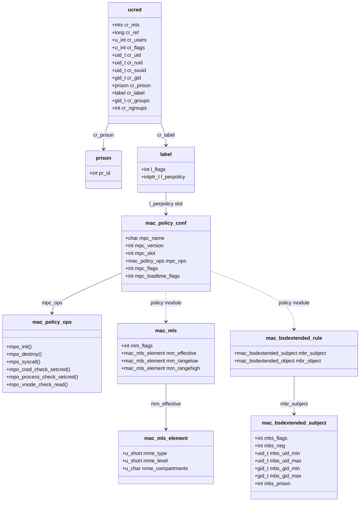

# Credentials, Privilege, and the MAC Framework — the Access-Control Substrate
<!-- This file is auto-generated by generate-doc.py -- do not edit manually -->

---
**Navigation:**
  **Up:** [Kernel Core — Structure and Entry Point](../README.md) ▸ [Source Tree — Layout and Conventions](../../README_internals.md)
  **Related:** [VFS — Virtual File System Layer](../fs/README.md) | [Jails — OS-level Isolation](README_jail.md) | [Capsicum — Capability Mode and Sandboxing](README_capsicum.md)
  **All chapters:** [Source Tree — Layout and Conventions](../../README_internals.md) | [Boot Process — UEFI Bootloader to Kernel Handoff](../../stand/efi/loader/README.md) | [Kernel Core — Structure and Entry Point](../README.md) | [Build System — buildworld and buildkernel](../../share/mk/README.md) | [System Calls and Image Activation — Entry, sysent, and exec](README_syscall.md) | [Kernel Modules and the Linker — KLD, SYSINIT, and linker sets](README_kld.md) | [Virtual Memory Subsystem — vm_page, UMA, and Pagers](../vm/README.md) | [Process Management — Scheduling and Lifecycle](README_process.md) ...
---


## Quick Summary

Every process in FreeBSD carries a credential — `struct ucred` — that answers the question "who is this process, and what may it do?" The credential bundles the real, effective, and saved user and group ids, the supplementary group list, the login class, the per-uid resource-accounting pointers, and (in a `MAC` build) a pointer to a [MAC label](#glossary). It is the single object the kernel consults to make protection decisions, and it is the object that [`setuid(2)`](../../lib/libsys/setuid.2), `fork(1)`, and [`execve(2)`](../../lib/libsys/execve.2) mutate. Because a credential is reference-counted, a `fork()` shares the parent's credential instead of copying it, and the first later mutation (a `setuid`, a `setgroups`) triggers a copy-on-write so siblings are left undisturbed.

Discretionary privilege is funneled through one function, `priv_check(9)`. Rather than every caller testing `cr_uid == 0`, the kernel asks `priv_check` whether the calling credential holds a named privilege — `PRIV_REBOOT`, `PRIV_IO`, `PRIV_SETTIMEOFDAY`, and so on. That single choke point is what lets other layers interpose: the same call also consults the process's jail (its `prison`) and the loaded MAC policies, so a privilege can be granted by root, denied at a jail boundary, or denied by a mandatory policy, without the caller knowing which layer decided.

The MAC framework turns the kernel's access-control decisions into a series of hooks. Kernel code calls a small, stable set of entry points declared in `mac_framework.h`; the framework walks the list of loaded policy modules and forwards the call to each policy's corresponding `mpo_*` operation, composing their verdicts. A policy module — registered with `MAC_POLICY_SET` against the `mac_policy.h` interface — labels subjects (processes, credentials) and objects (vnodes — the kernel's per-file abstraction — mounts, sockets) and votes on operations. The framework itself knows nothing about any policy's label type: it stores each policy's label in a numbered slot of a generic `struct label`, so policies can be loaded and unloaded independently and one label can serve many of them at once.

Jails and Capsicum are not separate access-control systems; they stand on this substrate. A jail is a `struct prison` pointer field on the `ucred` (`cr_prison`) plus the allow-bits that `priv_check` consults; Capsicum [capability mode](#glossary) is a single flag on the `ucred` (`CRED_FLAG_CAPMODE`) plus per-fd rights. This chapter documents the substrate they build on, and links out to the jail and Capsicum chapters for the policies themselves.

## Glossary

**credential (ucred)** — the kernel object that records the identities a process acts under; the unit of protection the whole kernel consults.

**real / effective / saved id** — three copies of a uid/gid: the real id is who logged in, the effective id is what the kernel checks, and the saved id is the value restored when the effective id drops (the `setuid` round-trip).

**supplementary groups** — the extra group ids, beyond the primary gid, that a process belongs to; stored in the credential's `cr_groups` array.

**copy-on-write (credential)** — when a shared credential (more than one process using it) is about to be mutated, the kernel first makes a private copy so sibling processes are left undisturbed.

**privilege (PRIV_\*)** — a named, boolean capability the kernel checks through `priv_check(9)`; the unit of discretionary privilege.

**MAC label** — the per-object and per-subject security tag the MAC framework attaches; internally a fixed array holding one slot per loaded policy.

**prison** — the kernel's name for a jail; a `ucred` field that bounds what its member processes may do.

**capability mode** — the Capsicum state, a single `ucred` flag that switches a process from path-based to per-fd rights.

## Architecture

The substrate has three cooperating layers, each in its own file, and each one the place a later mechanism (jail, Capsicum, a MAC policy) plugs into.

**The credential — `sys/kern/kern_prot.c` and `sys/sys/ucred.h`.** `struct ucred` (defined in `sys/sys/ucred.h`) is the identity record every [thread](README_process.md#glossary) carries in `thread->td_ucred`. `kern_prot.c` owns its whole life cycle. Allocation is `crget()` (a fresh credential) and `crhold()` (take another reference to an existing one); `crfree()` drops a reference and, at zero, runs `crfree_final()`. The interesting work is in the mutation path: `crsetgroups()`, `crsetgroups_and_egid()`, and the `change_euid()` / `change_egid()` / `change_ruid()` / `change_rgid()` / `change_svuid()` / `change_svgid()` helpers all route through a copy-on-write gate. When a credential is shared (`cr_users > 1`), the kernel calls `crcowget()` to make a private copy before writing, and `crcopy()` / `crcopysafe()` perform the actual field copy. The `cr_startcopy` / `cr_endcopy` markers in the structure delimit the small id block that is copied by value; the large, shared payloads — the `cr_groups` array and the `cr_label` pointer — live outside that window and are shared by reference. That split is the whole reason the struct is shaped the way it is: `fork()` must be cheap, so the group array and MAC label are shared, while the few id fields that `setuid` actually changes are copied.

**The privilege funnel — `sys/kern/kern_priv.c` and `sys/sys/priv.h`.** `sys/sys/priv.h` is a flat, numbered list of `PRIV_*` macros (`PRIV_ACCT` is 2, `PRIV_REBOOT` is 8, `PRIV_IO` is 12, and so on). The header carries a maintenance warning: when adding a privilege you must decide whether it is meaningful inside a jail and update `prison_priv_check()` in `kern_jail.c`. `kern_priv.c` implements `priv_check()` and its variants (`priv_check_cred()`, `priv_check_cred_vfs_lookup()`, `priv_check_cred_vfs_generation()`). Each check runs a fixed pipeline: first a MAC pre-check (`mac_priv_check`), then the root/suser test gated by `suser_enabled()`, then the jail test via `prison_priv_check()`, and finally a MAC post-check. The `suser_enabled()` helper reduces "is uid 0 privileged" to a single jail allow-bit, `prison_allow(cred, PR_ALLOW_SUSER)`, which is what the `security.bsd.suser_enabled` sysctl writes.

**The MAC framework — `sys/security/mac/`.** `mac_framework.c` holds policy registration, the per-policy locking (`mac_policy_slock_*`, `mac_policy_xlock`), and the error-composition logic. `mac_internal.h` defines the generic `struct label` and the `MAC_POLICY_PERFORM` dispatch macro. `mac_label.c` allocates every label from one [UMA zone](../sys/README_mbuf.md#glossary) (`"MAC labels"`) and provides `mac_label_get()` / `mac_label_set()`, which index a label's per-policy slot array. The per-object-class files (`mac_cred.c`, `mac_process.c`, `mac_vfs.c`, `mac_mount`-related code in `mac_vfs.c`, `mac_socket.c`, ...) are the kernel-side entry points: each one is a thin wrapper that allocates or frees a label and calls `MAC_POLICY_PERFORM` to fan a check out to every loaded policy.

The relationship to the consumers is a pointer, not a mechanism. A jail is `ucred.cr_prison`; the jail chapter explains what a `prison` contains. Capsicum is `ucred.cr_flags & CRED_FLAG_CAPMODE` plus the per-fd rights table; the Capsicum chapter explains the rights. Both read and write only fields that already exist on this substrate.

## Key Data Structures

**`struct ucred`** — the credential, verbatim from `sys/sys/ucred.h`. Note the header comment: "Please do not inspect `cr_uid` directly to determine superuserness. The [`priv(9)`](../../share/man/man9/priv.9) interface should be used to check for privilege."

```c
struct ucred {
	struct mtx cr_mtx;
	long	cr_ref;			/* (c) reference count */
	u_int	cr_users;		/* (c) proc + thread using this cred */
	u_int	cr_flags;		/* credential flags */
	struct auditinfo_addr	cr_audit;	/* Audit properties. */
	int	cr_ngroups;		/* number of supplementary groups */
#define	cr_startcopy cr_uid
	uid_t	cr_uid;			/* effective user id */
	uid_t	cr_ruid;		/* real user id */
	uid_t	cr_svuid;		/* saved user id */
	gid_t	cr_gid;			/* effective group id */
	gid_t	cr_rgid;		/* real group id */
	gid_t	cr_svgid;		/* saved group id */
	struct uidinfo	*cr_uidinfo;	/* per euid resource consumption */
	struct uidinfo	*cr_ruidinfo;	/* per ruid resource consumption */
	struct prison	*cr_prison;	/* jail(2) */
	struct loginclass	*cr_loginclass; /* login class */
	void		*cr_pspare2[2];	/* general use 2 */
#define	cr_endcopy	cr_label
	struct label	*cr_label;	/* MAC label */
	gid_t	*cr_groups;		/* groups */
	int	cr_agroups;		/* Available groups */
	/* storage for small groups */
	gid_t   cr_smallgroups[CRED_SMALLGROUPS_NB];
};
```

Field notes. `cr_ref` is the reference count; `cr_users` counts the processes and threads actually using this credential — it is the copy-on-write trigger. `cr_uid`/`cr_ruid`/`cr_svuid` and the matching gid triple are the three id sets; `cr_startcopy`/`cr_endcopy` mark the value-copy window. `cr_uidinfo`/`cr_ruidinfo` point at per-uid resource-consumption records (the basis for `rctl` limits). `cr_prison` is the jail; `cr_loginclass` is the login class; `cr_label` is the MAC label. `cr_groups` plus `cr_agroups` hold the [supplementary groups](#glossary), with `cr_smallgroups[CRED_SMALLGROUPS_NB]` (16) inlined so the common case needs no allocation. `cr_flags` carries `CRED_FLAG_CAPMODE` (0x1, "In capability mode") and `CRED_FLAG_GROUPSET` (0x2). Two sentinels are defined just below the struct: `NOCRED` (NULL, "no credential available") and `FSCRED` (`(struct ucred *)-1`, the filesystem credential used for operations with no user context).

**`struct xucred`** — the external, on-the-wire form of a credential (used by `getpeereid`, `sendfile`, and the `__mac_*` calls). It is a fixed-size structure headed by a `cr_version` field and carrying the uid/gid id set plus a fixed `cr_groups[XU_NGROUPS]` array (16), so it can cross the kernel/user boundary without a variable-length group list.

**`struct setcred32`** — the argument block for the [`setcred(2)`](../../lib/libsys/setcred.2) system call, from `sys/sys/ucred.h`: `sc_uid`, `sc_ruid`, `sc_svuid`, `sc_gid`, `sc_rgid`, `sc_svgid`, `sc_pad`, and `sc_supp_groups_nb`. It is how userland sets the full id set and group list in one atomic operation.

**The privilege list** — `sys/sys/priv.h` is a numbered enum of `PRIV_*` macros. A representative slice, verbatim:

```c
#define	_PRIV_LOWEST	1
#define	PRIV_ACCT		2	/* Manage process accounting. */
#define	PRIV_MAXFILES		3	/* Exceed system open files limit. */
#define	PRIV_MAXPROC		4	/* Exceed system processes limit. */
#define	PRIV_KTRACE		5	/* Set/clear KTRFAC_ROOT on ktrace. */
#define	PRIV_SETDUMPER		6	/* Configure dump device. */
#define	PRIV_REBOOT		8	/* Can reboot system. */
#define	PRIV_SWAPON		9	/* Can swapon(). */
#define	PRIV_SWAPOFF		10	/* Can swapoff(). */
#define	PRIV_MSGBUF		11	/* Can read kernel message buffer. */
#define	PRIV_IO			12	/* Can perform low-level I/O. */
#define	PRIV_KEYBOARD		13	/* Reprogram keyboard. */
#define	PRIV_DRIVER		14	/* Low-level driver privilege. */
#define	PRIV_ADJTIME		15	/* Set time adjustment. */
#define	PRIV_NTP_ADJTIME	16	/* Set NTP time adjustment. */
#define	PRIV_CLOCK_SETTIME	17	/* Can call clock_settime. */
#define	PRIV_SETTIMEOFDAY	18	/* Can call settimeofday. */
```

The header's comment explains why the numbers are stable: "Particular numeric privilege assignments are part of the loadable kernel module ABI, and should not be changed across minor releases."

**`struct label`** — the generic MAC label, from `sys/security/mac/mac_internal.h`. It has two members: `l_flags` and `l_perpolicy[MAC_MAX_SLOTS]`. Every loaded policy is assigned a slot; a policy stores its own opaque label pointer in `l_perpolicy[slot]`. Because the framework never dereferences that pointer, one `struct label` can carry the [state](../netpfil/pf/README.md#glossary) of every loaded policy at once, and a policy loaded after an object already has a label finds a NULL in its slot.

**`struct mac_policy_conf`** — the policy registration descriptor, from `sys/security/mac/mac_policy.h`. It records the policy's `mpc_name`, `mpc_version`, the `mpc_slot` it occupies, a pointer to its `mpc_ops` (a `struct mac_policy_ops`), and two flag words, `mpc_flags` and `mpc_loadtime_flags`. The `MAC_POLICY_SET()` macro fills this descriptor and registers the module.

**`struct mac_policy_ops`** — the table of entry points a policy may implement, from `sys/security/mac/mac_policy.h`. It begins with the lifecycle entries `mpo_destroy` and `mpo_init`, a general-purpose `mpo_syscall`, and then hundreds of `mpo_*` check and event operations grouped by object class (cred, process, thread, vnode, mount, socket, ...). A policy leaves any operation it does not care about NULL, and the framework skips it.

## Deep Dive

### Credential life cycle: share, then copy-on-write

`fork()` does not copy the credential. The child inherits the parent's `struct ucred` by taking a reference — `crhold()` bumps `cr_ref`, and the shared credential's `cr_users` climbs. This is deliberate: the credential's biggest members are the supplementary group array and the MAC label, and neither changes on a plain `fork()`. Copying them would make every process creation pay for a group-array `bcopy` and a label operation it did not need.

The cost is deferred to the first mutation. When a process calls [`setuid(2)`](../../lib/libsys/setuid.2), [`setgroups(2)`](../../lib/libsys/setgroups.2), or [`setcred(2)`](../../lib/libsys/setcred.2), the path runs through `kern_setcred()` in `kern_prot.c`, which calls the `change_*` helpers. Those helpers check `cr_users`; if the credential is still shared, they call `crcowget()` to make a private copy first, and only then write the new id. `crcopy()` is the underlying field copier; the `cr_startcopy`/`cr_endcopy` window tells it which scalar id fields to copy by value while `cr_groups` and `cr_label` are shared by reference (the group list is re-shared via `crsetgroups_internal()`, and the label is re-linked via the MAC credential entry points in `mac_cred.c`). Once `cr_users` is 1, later mutations write in place with no copy.

On [`execve(2)`](../../lib/libsys/execve.2) the credential is normally carried across unchanged. The setuid/setgid bits on the executable are the one exception: `exec_check_permissions()` in the exec path may drop the effective id to the file's owner and set the saved id to the old effective id, which is exactly the round-trip the three-id design exists to support — a setuid binary can drop to its file owner, do the unprivileged work, and restore the effective id from the saved id without the caller having to remember it.

The [`setcred(2)`](../../lib/libsys/setcred.2) system call is the atomic variant: `sys_setcred()` → `user_setcred()` → `kern_setcred()` sets the whole id set and group list in one step, again gated by the same copy-on-write logic.

### The privilege funnel

`priv_check()` is the single place the kernel asks "may this credential do X?" Its pipeline is short and fixed. The MAC pre-check runs first:

```c
static __always_inline int
priv_check_cred_pre(struct ucred *cred, int priv)
{
	int error;

#ifdef MAC
	error = mac_priv_check(cred, priv);
#else
	error = 0;
#endif
	return (error);
}
```

If a loaded policy vetoes the privilege, the check fails before any root or jail logic runs. The suser test is what most callers think of as "am I root," but in FreeBSD it is itself jail-aware:

```c
static bool
suser_enabled(struct ucred *cred)
{

	return (prison_allow(cred, PR_ALLOW_SUSER));
}
```

So "uid 0 has privilege" really means "uid 0 and its jail has the `PR_ALLOW_SUSER` bit," which is what the `security.bsd.suser_enabled` sysctl (`sysctl_kern_suser_enabled`) sets. After the suser test, `prison_priv_check()` in `kern_jail.c` applies the per-privilege jail policy, and the MAC post-check gives policies a final say. The VFS-specific variants (`priv_check_cred_vfs_lookup()`, `priv_check_cred_vfs_generation()`) exist so that path-lookup privilege can be checked against the right mount's generation without re-deriving it on every call.

The engineering point is separation of mechanism from policy: `priv_check` is the mechanism (a named, numbered, checkable capability), and the meaning of each `PRIV_*` plus who may hold it is policy, spread across the root test, the jail, and the MAC layer. Adding a new privileged operation means adding one `PRIV_*` and one `priv_check` call — and, per the header comment, deciding its jail behavior in `prison_priv_check()`.

### How a MAC policy interposes

A policy module is a loadable kernel module that fills a `struct mac_policy_ops` table and registers it with `MAC_POLICY_SET`. The simplest possible module, `mac_none` (`sys/security/mac_none/mac_none.c`), shows the whole registration surface:

```c
static struct mac_policy_ops none_ops =
{
};

MAC_POLICY_SET(&none_ops, mac_none, "TrustedBSD MAC/None",
    MPC_LOADTIME_FLAG_UNLOADOK, NULL);
```

`mac_none` implements no entry points — it exists to measure the framework's overhead. A real policy fills the `mpo_*` slots it cares about and leaves the rest NULL. On registration the framework assigns the policy a slot number and records it in the loaded-policy list; on every subsequent check, `MAC_POLICY_PERFORM(operation, args...)` (in `mac_internal.h`) walks that list and invokes each policy's `operation`, OR-ing the returned errors so that any single denial vetoes the operation.

Labels are the other half. Every label is allocated from one [UMA](../vm/README_bcache.md#glossary) [zone](../vm/README.md#glossary) (`mac_label.c`):

```c
static uma_zone_t	zone_label;

void
mac_labelzone_init(void)
{
	zone_label = uma_zcreate("MAC labels", sizeof(struct label),
	    mac_labelzone_ctor, mac_labelzone_dtor, NULL, NULL,
	    UMA_ALIGN_PTR, 0);
}

void
mac_init_label(struct label *label)
{
	bzero(label, sizeof(*label));
	label->l_flags = MAC_FLAG_INITIALIZED;
}

intptr_t
mac_label_get(struct label *l, int slot)
{
	KASSERT(l != NULL, ("mac_label_get: NULL label"));
	return (l->l_perpolicy[slot]);
}
```

The zone constructor zeroes each label and sets `MAC_FLAG_INITIALIZED`, so a policy that loads late still sees a clean NULL in its slot. `mac_label_get`/`mac_label_set` are the only way a policy touches its slot, which is what keeps the framework generic.

### Process and VFS hooks

`mac_process.c` attaches a label to each process. `mac_proc_init()` allocates `p->p_label` from the label zone and runs `MAC_POLICY_PERFORM(proc_init_label, label)` so each policy can initialize its slot; `mac_proc_destroy()` frees it. `mac_thread_userret()` is the [hook](../netgraph/README.md#glossary) for policies with floating process labels — a label that changes at the process boundary (for example, dropping privilege on `exec`) — because that is the one point where the process lock can be taken safely on the way back to user space.

`mac_vfs.c` interposes on the vnode operations. Its check entry points — `mac_vnode_check_read()`, `mac_vnode_check_readdir()`, and their write/stat/execute siblings — are called from the VFS layer at the same points the discretionary permission check runs. Each one forwards to the policies and composes the verdicts. The framework does not re-derive the vnode contract; it adds a mandatory vote at the existing decision points. (The full vnode locking and operation model belongs to the VFS chapter.)

### Example 1: mac_mls — multilevel labels

`mac_mls` (`sys/security/mac_mls/`) is a fixed-label confidentiality policy. Its label type, verbatim from `sys/security/mac_mls/mac_mls.h`:

```c
struct mac_mls_element {
	u_short	mme_type;
	u_short	mme_level;
	u_char	mme_compartments[MAC_MLS_MAX_COMPARTMENTS >> 3];
};

struct mac_mls {
	int			mm_flags;
	struct mac_mls_element	mm_effective;
	struct mac_mls_element	mm_rangelow, mm_rangehigh;
};
```

An MLS (Multi-Level Security) label has an *effective* element plus a *range* (`mm_rangelow`..`mm_rangehigh`), each element a type, a sensitivity level, and a 256-bit compartment bitmap (`MAC_MLS_MAX_COMPARTMENTS` is 256). The types encode the dominance relations: `MAC_MLS_TYPE_LEVEL` (a hierarchical level), `MAC_MLS_TYPE_LOW` (dominated by any label), `MAC_MLS_TYPE_HIGH` (dominates any label), and `MAC_MLS_TYPE_EQUAL`. The policy's `mls_vnode_check_read()` and `mls_vnode_check_readdir()` compare the subject's effective label against the object's and deny reads that would move information the wrong way — the Bell-LaPadula "no read down" rule, expressed as a label comparison in a policy slot. Labels persist on files through the `mac_mls` system extended attribute (`MAC_MLS_EXTATTR_NAME`), so the label survives reboot.

### Example 2: mac_bsdextended / ugidfw — rule-based file access

`mac_bsdextended` (`sys/security/mac_bsdextended/`) is the "ugidfw" policy: firewall-like rules that grant or deny specific rights to specific users on specific objects, independent of file permissions. Its rule model, from `sys/security/mac_bsdextended/mac_bsdextended.h`:

```c
struct mac_bsdextended_subject {
	int	mbs_flags;
	int	mbs_neg;
	uid_t	mbs_uid_min;
	uid_t	mbs_uid_max;
	gid_t	mbs_gid_min;
	gid_t	mbs_gid_max;
	int	mbs_prison;
};
```

A rule pairs a subject (a uid range, a gid range, a jail, optionally negated) with an object match and a rights mask. The rights are the `MBI_*` bits — `MBI_EXEC` (000100), `MBI_WRITE` (000200), `MBI_READ` (000400), `MBI_ADMIN` (010000), `MBI_STAT` (020000), `MBI_APPEND` (040000) — deliberately redefined here rather than reusing the vnode `V*` bits, so the user/kernel ABI is stable if the in-kernel values change. A rule is a `struct mac_bsdextended_rule` holding a `mbr_subject` and a `mbr_object`. The module keeps up to `MAC_BSDEXTENDED_MAXRULES` (250) rules behind `ugidfw_mtx`, with `security.mac.bsdextended.enabled` and `.logging` sysctls. On a vnode check it walks the rules, finds the first match, and returns the rights the match grants or denies — a concrete, administrator-writable policy that rides the same `mpo_vnode_check_*` hooks as MLS.

## Flow / Diagram



The solid arrows are the pointer fields on the substrate itself: a `ucred` points at its `prison` (the jail) and at its `label` (the MAC tag). The `label`'s per-policy slot array is what ties it to the loaded `mac_policy_conf` entries. The dotted arrows are the "is-a policy module" relationship: `mac_mls` and `mac_bsdextended_rule` are concrete label types that live in a slot of the generic `label`, registered through a `mac_policy_conf`.

## Advanced Notes

**Debugging with DTrace.** The privilege funnel has its own SDT provider. `kern_priv.c` defines:

```c
SDT_PROVIDER_DEFINE(priv);
SDT_PROBE_DEFINE1(priv, kernel, priv_check, priv__ok, "int");
SDT_PROBE_DEFINE1(priv, kernel, priv_check, priv__err, "int");
```

So `priv:kernel:priv_check:priv__err` fires on every *denied* privilege check and carries the `PRIV_*` number — a direct trace of "who was refused what." The MAC framework has two providers, `mac` and `mac_framework`, with `mac:policy:register` and `mac:policy:unregister` (each carrying the `mac_policy_conf *`) and a `mac:policy:modevent` [probe](README_driver.md#glossary). Every check entry point is wrapped in `MAC_CHECK_PROBE_*` macros that emit `mac__check__ok` / `mac__check__err` pairs, so you can trace exactly which policy hook vetoed a particular vnode or cred operation.

**Performance.** The framework is built to be cheap when no policy is loaded. `mac_labeled` (a bitmask of object classes that have at least one interested policy) lets the per-class entry points skip label allocation entirely — `mac_proc_init()` only allocates `p->p_label` when `mac_labeled & MPC_OBJECT_PROC`. Within a class, `struct mac_policy_fastpath_elem` (in `mac_framework.c`) records, per operation, which policies actually implement it, so `MAC_POLICY_PERFORM` skips NULL slots instead of calling a stub. `mac_none` exists precisely to measure this baseline. The `priv_check` VFS variants exist to avoid re-deriving the mount generation on the hot path of every lookup.

**Pitfalls.** Do not test `cr_uid == 0` directly — the header says so, and it is wrong in a jail (where `PR_ALLOW_SUSER` may be off) and under MAC. Always go through `priv_check(9)`. When adding a `PRIV_*`, update `prison_priv_check()` in `kern_jail.c` or the privilege will silently mean something different inside a jail. Remember that the credential is shared: any code that mutates a `ucred` in place must go through the copy-on-write gate (`crcowget`), or it will corrupt every sibling process sharing that credential. And a policy's label slot is not reclaimed on unload if the policy is labeled — the Handbook notes this bounds the number of unload/reload cycles a labeled policy can go through.

**Theory connection.** The whole chapter is the textbook separation of *mechanism* from *policy* (Operating System Concepts, "Mechanisms and Policies") made concrete: `priv_check` and the MAC dispatch are the mechanism, and the `PRIV_*` meanings, the jail policy, and each `mac_*` module are the policies. The three-id credential is the standard Unix setuid design (real/effective/saved) that lets a privileged process drop and restore privilege safely. `mac_mls` is Bell-LaPadula confidentiality (no read down, no write up) plus compartments; `mac_biba` is its integrity dual (no read up, no write down). The MAC framework's slot-based label is a clean way to compose multiple, independently loadable policies without any one of them knowing about the others — the same "policy as a pluggable module" idea the kernel uses for [KLD](README_kld.md#glossary) (kernel loadable modules) and the linker sets.

## See Also
- [Jails — OS-level Isolation](README_jail.md)
- [Capsicum — Capability Mode and Sandboxing](README_capsicum.md)
- [VFS — Virtual File System Layer](../fs/README.md)


- **Jails** — the `cr_prison` field and `prison_priv_check()` in `kern_jail.c`; see the jail chapter for what a `prison` contains. [`jail(2)`](../../lib/libsys/jail.2).
- **Capsicum / capabilities** — `CRED_FLAG_CAPMODE` and the per-fd rights table; see the Capsicum chapter. `capabilities(4)`, [`cap_enter(2)`](../../lib/libsys/cap_enter.2).
- **Process management** — `fork`/`exec` and where the credential is carried; [`sys/kern/kern_fork.c`](kern_fork.c), [`sys/kern/kern_exec.c`](kern_exec.c).
- **VFS** — the vnode operations the MAC hooks interpose on; see the VFS chapter.
- **Source directories** — [`sys/kern/kern_prot.c`](kern_prot.c), [`sys/kern/kern_priv.c`](kern_priv.c), [`sys/sys/ucred.h`](../sys/ucred.h), [`sys/sys/priv.h`](../sys/priv.h), [`sys/security/mac/`](../security/mac), [`sys/security/mac_mls/`](../security/mac_mls), [`sys/security/mac_bsdextended/`](../security/mac_bsdextended).
- **Man pages** — [`priv(9)`](../../share/man/man9/priv.9), [`mac(4)`](../../share/man/man4/mac.4), [`setcred(2)`](../../lib/libsys/setcred.2), [`jail(2)`](../../lib/libsys/jail.2), `capabilities(4)`, [`setuid(2)`](../../lib/libsys/setuid.2), [`setgroups(2)`](../../lib/libsys/setgroups.2).

---

> _Generated by [DaemonDocs](https://github.com/ocochard/DaemonDocs) on 2026-09-01 00:47 UTC using model `Qwen3.8-27B-Q8_0` (llama.cpp build `b10553-cd26896c1`). AI-generated content — verify against source before relying on it._
