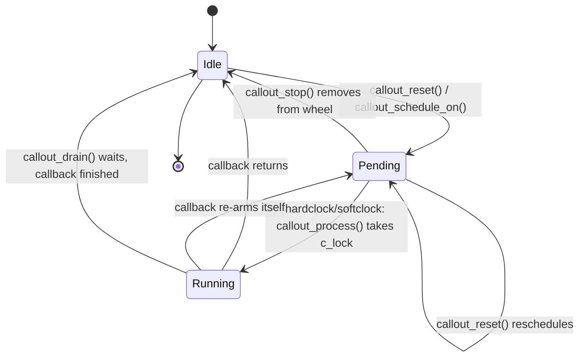

# Callouts, Taskqueues, and Kernel Time — Deferred Execution
<!-- This file is auto-generated by generate-doc.py -- do not edit manually -->

---
**Navigation:**
  **Up:** [Kernel Core — Structure and Entry Point](../README.md) ▸ [Source Tree — Layout and Conventions](../../README_internals.md)
  **Related:** [Locking Primitives — Mutexes, sx, rmlocks, and Atomics](README_locking.md) | [Device Driver Framework — newbus and devclass](README_driver.md) | [Interrupt Handling — Threads, Filters, and Dispatch](README_intr.md)
  **All chapters:** [Source Tree — Layout and Conventions](../../README_internals.md) | [Boot Process — UEFI Bootloader to Kernel Handoff](../../stand/efi/loader/README.md) | [Kernel Core — Structure and Entry Point](../README.md) | [Build System — buildworld and buildkernel](../../share/mk/README.md) | [System Calls and Image Activation — Entry, sysent, and exec](README_syscall.md) | [Kernel Modules and the Linker — KLD, SYSINIT, and linker sets](README_kld.md) | [Virtual Memory Subsystem — vm_page, UMA, and Pagers](../vm/README.md) | [Process Management — Scheduling and Lifecycle](README_process.md) ...
---


## Quick Summary

Kernel code often cannot do its real work in the context it is called from. An
interrupt filter runs with interrupts masked and may not sleep; a device's
detach path must guarantee that no callback is still touching its memory; a
subsystem needs to clean itself up when the system shuts down without the
caller knowing its name. FreeBSD answers these with three cooperating
mechanisms: **callouts** let a piece of code run once, after a delay, on a
specified CPU; **taskqueues** let a piece of code run later on a [thread](README_process.md#glossary) that is
free to sleep and take heavy locks; and **EVENTHANDLER** lets a subsystem
subscribe to a named lifecycle event so it is invoked in priority order when
that event fires.

Callouts are the timer. A driver stores a `struct callout` in its [softc](README_driver.md#glossary), arms
it with `callout_reset()`, and the kernel's per-CPU "callout wheel" — scanned
by the softclock thread and the hardclock interrupt — dequeues it when its time
arrives and runs the driver's callback. Because the callback can run from
interrupt context or from a kernel thread, and because `callout_stop()` does not
wait for a callback that has already started, the classic teardown race lives
right here: stop the wrong way and a freed softc is dereferenced.

Taskqueues are the work-deferral. An interrupt filter that has more work than it
can finish before re-enabling interrupts enqueues a `struct task` on a
taskqueue and returns; a kernel thread (or the software-interrupt path) later
runs the task in a context where sleeping and `sx` locks are legal. This is
FreeBSD's split of what Linux divides into softirq (fast, interrupt context)
and workqueue (thread context).

EVENTHANDLER is the in-kernel publish/subscribe bus. A subsystem registers a
handler on a named list (`shutdown`, `mountroot`, `lowmem`, process-exit, and
many more); the code that owns the event calls the `EVENTHANDLER_INVOKE` macro,
which walks the list by priority and calls each handler. No caller hard-codes a
list of subsystems to notify.

All three ride on the same heartbeat. The timecounter machinery converts raw
hardware counter reads into nanoseconds; `hardclock()` fires at `hz` and advances
the [callout](../netinet/README_transport.md#glossary) wheel and does per-thread accounting; `statclock()` fires more
slowly and does the slower bookkeeping. Understanding what advances a callout is
understanding what makes all of deferred execution tick.

## Architecture

The callout subsystem lives in `sys/kern/kern_timeout.c`, with its public
interface in `sys/sys/callout.h` (which pulls in `sys/sys/_callout.h` for the
`struct callout` layout). Each CPU owns a `struct callout_cpu` (defined in
`kern_timeout.c`); `callout_cpu_init()` builds it and `callout_cpu_switch()`
rebuilds the per-CPU [state](../netpfil/pf/README.md#glossary) when a thread migrates. The per-CPU wheel is indexed
by time: `callout_hash()` computes a hash of a callout, `callout_get_bucket()`
maps an absolute expiration time to a wheel bucket, and `callout_cc_add()`
inserts the callout into that bucket under the per-CPU `cc_lock`. When time
advances, `callout_process()` walks the wheel from the current bucket forward,
collects every callout whose time has passed, and runs their callbacks.
`callout_schedule()` / `callout_schedule_on()` are the internal entry points that
`callout_reset_sbt_on()` calls after computing the absolute target time;
`callout_when()` returns the time a pending callout will fire.

The wheel exists for a specific engineering reason. A driver can have many
timers, and the whole system can have tens of thousands of pending callouts. A
sorted linked list would make every `callout_reset()` an O(n) insert and every
tick an O(n) scan of everything that has not expired. A wheel turns both into
cheap operations: scheduling is a hash into a bucket (O(1)), and processing only
examines the buckets from "now" onward, not the entire pending set. Making the
wheel per-CPU removes a global lock from the fast path — `callout_reset()` on
CPU 0 never touches CPU 1's wheel — which is why the migration case
(`callout_cpu_switch()`, the `CALLOUT_DFRMIGRATION` flag) is the one path that
needs extra care.

Taskqueues live in `sys/kern/subr_taskqueue.c`, with the interface in
`sys/sys/taskqueue.h` and the task type in `sys/sys/_task.h`. A `struct
taskqueue` owns a lock-protected queue of `struct task`, a mutex
(`tq_mutex`), a sequence counter (`tq_seq`) used to implement cancel/drain, and
a pointer to the kernel threads that service it (`tq_threads`). The four global
queues are created at boot: `taskqueue_swi` (fast, software-interrupt context),
`taskqueue_fast` (fast, interrupt context), `taskqueue_thread` (a real kernel
thread), and `taskqueue_slow` (slow, threaded). A driver can also build its own
private queue with `taskqueue_create()` and start dedicated threads with
`taskqueue_start_threads()`.

EVENTHANDLER lives in `sys/kern/subr_eventhandler.c`, with the interface in
`sys/sys/eventhandler.h` and the base entry type in `sys/sys/_eventhandler.h`.
A global list of `struct eventhandler_list`, each keyed by a name string, is
guarded by `eventhandler_mutex`; `eventhandler_find_or_create_list()` locates or
creates the list for a name, and `eventhandler_register()` inserts a handler at
the right priority. The `EVENTHANDLER_INVOKE` macro (in the header) walks the
list and calls each handler, dropping the list lock around each call so a
handler may take other locks.

The timekeeping substrate is in `sys/kern/kern_clock.c` (the `hardclock()` /
`statclock()` tick handlers and CPU-time accounting), `sys/kern/kern_tc.c`
(the timecounter, `struct timehands`), and `sys/kern/kern_clocksource.c` (the
event-timer hardware abstraction, `struct eventtimer`). The event timer either
runs in periodic mode (fire every `timerperiod`) or one-shot mode (re-arm for
the next nearest event, `getnextevent()`), and each interrupt calls
`handleevents()` which in turn drives `hardclock()` and, at the right cadence,
`statclock()`.

## Key Data Structures

`struct callout` (`sys/sys/_callout.h`) is the unit a driver embeds in its
softc. Note the union of three list entries — a callout is simultaneously
capable of sitting on the wheel's per-bucket list, on the per-CPU expiry
queue, or on a processing list, depending on its current state:

```c
struct callout {
	union {
		LIST_ENTRY(callout) le;
		SLIST_ENTRY(callout) sle;
		TAILQ_ENTRY(callout) tqe;
	} c_links;
	__sbintime_t c_time;			/* ticks to the event */
	__sbintime_t c_precision;		/* delta allowed wrt opt */
	void	*c_arg;				/* function argument */
	callout_func_t *c_func;			/* function to call */
	struct lock_object *c_lock;		/* lock to handle */
	short	c_flags;			/* User State */
	short	c_iflags;			/* Internal State */
	volatile int c_cpu;			/* CPU we're scheduled on */
};
```

`c_flags` and `c_iflags` are deliberately split: `c_flags` holds the
caller-visible state (the driver's own flags, e.g. `CALLOUT_DIRECT`), while
`c_iflags` holds the internal state the callout subsystem depends on (e.g.
`CALLOUT_PENDING`, `CALLOUT_ACTIVE`, `CALLOUT_PROCESSED`) and is only touched
under the internal locks. The relevant flags, verbatim from `sys/sys/callout.h`:

```c
#define	CALLOUT_TRYLOCK		0x0001 /* try semantic in softclock_call_cc */
#define	CALLOUT_ACTIVE		0x0002 /* callout is currently active */
#define	CALLOUT_PENDING		0x0004 /* callout is waiting for timeout */
#define	CALLOUT_MPSAFE		0x0008 /* deprecated */
#define	CALLOUT_RETURNUNLOCKED	0x0010 /* handler returns with mtx unlocked */
#define	CALLOUT_SHAREDLOCK	0x0020 /* callout lock held in shared mode */
#define	CALLOUT_DFRMIGRATION	0x0040 /* callout in deferred migration mode */
#define	CALLOUT_PROCESSED	0x0080 /* callout in wheel or processing list? */
#define	CALLOUT_DIRECT 		0x0100 /* allow exec from hw int context */
```

`struct callout_cpu` (`sys/kern/kern_timeout.c`) is the per-CPU state. Its
fields, as extracted from the source, are `cc_lock`, `cc_exec_entity[2]`,
`cc_next`, `cc_callwheel`, `cc_expireq`, `cc_firstevent`, `cc_lastscan`,
`cc_thread`, and `cc_bucket`. `cc_callwheel` holds the wheel; `cc_expireq` is
the queue of callouts pulled out for the current processing pass; `cc_thread`
is the softclock thread that drains it; `cc_firstevent` / `cc_lastscan` record
how far the wheel has been scanned so the next pass does not re-examine
already-expired buckets.

`struct task` (`sys/sys/_task.h`) is the unit enqueued on a taskqueue. The
`(q)` / `(c)` comments mark fields protected by the queue lock versus constant
after init:

```c
typedef void task_fn_t(void *context, int pending);

struct task {
	STAILQ_ENTRY(task) ta_link;	/* (q) link for queue */
	uint16_t ta_pending;		/* (q) count times queued */
	uint8_t	ta_priority;		/* (c) Priority */
	uint8_t	ta_flags;		/* (c) Flags */
	task_fn_t *ta_func;		/* (c) task handler */
	void	*ta_context;		/* (c) argument for handler */
};
```

`struct timeout_task` (`sys/sys/_task.h`) fuses a callout and a task so a task
can be scheduled "run this task once, after a delay":

```c
struct timeout_task {
	struct taskqueue *q;
	struct task t;
	struct callout c;
	int    f;
};
```

`struct taskqueue` (`sys/kern/subr_taskqueue.c`) fields, as extracted, are
`tq_queue`, `tq_active`, `tq_hint`, `tq_seq`, `tq_callouts`, `tq_mutex`,
`tq_enqueue`, `tq_context`, `tq_name`, and `tq_threads`. The companion
`struct taskqueue_busy` (`tb_running`, `tb_seq`, `tb_canceling`, `tb_wanted`,
`tb_link`) is the per-task record used to implement `taskqueue_cancel()` and
`taskqueue_drain()` without a global lock: the `tb_seq` sequence number lets a
draining thread detect whether a task is currently executing.

`struct eventhandler_entry` (`sys/sys/_eventhandler.h`) is the base of every
handler; each named event defines a derived struct, appending its own
function pointer (see `EVENTHANDLER_DECLARE`):

```c
struct eventhandler_entry {
	TAILQ_ENTRY(eventhandler_entry)	ee_link;
	int				ee_priority;
#define	EHE_DEAD_PRIORITY	(-1)
	void				*ee_arg;
};

typedef struct eventhandler_entry	*eventhandler_tag;
```

`struct eventhandler_list` (`sys/sys/eventhandler.h`) is one named event:

```c
struct eventhandler_list {
	char				*el_name;
	u_int				el_deadcount;
	u_int				el_runcount;
	struct mtx			el_lock;
	TAILQ_ENTRY(eventhandler_list)	el_link;
	TAILQ_HEAD(,eventhandler_entry)	el_entries;
};
```

`el_deadcount` and `el_runcount` implement deferred deletion: a handler that is
deregistered while the list is being invoked is not freed immediately; it is
marked dead (`ee_priority = EHE_DEAD_PRIORITY`) and pruned only after the
current invocation finishes, so a running `EVENTHANDLER_INVOKE` never walks a
freed entry.

`struct eventtimer` (from [`eventtimers(9)`](../../share/man/man9/eventtimers.9)) is the hardware timer abstraction
used by `kern_clocksource.c`:

```c
struct eventtimer {
SLIST_ENTRY(eventtimer)	et_all;
char			*et_name;
int			et_flags;
#define ET_FLAGS_PERIODIC	1
#define ET_FLAGS_ONESHOT	2
#define ET_FLAGS_PERCPU		4
#define ET_FLAGS_C3STOP		8
#define ET_FLAGS_POW2DIV	16
int			et_quality;
int			et_active;
uint64_t		et_frequency;
sbintime_t		et_min_period;
sbintime_t		et_max_period;
et_start_t		*et_start;
et_stop_t		*et_stop;
et_event_cb_t		*et_event_cb;
et_deregister_cb_t	*et_deregister_cb;
void 			*et_arg;
void			*et_priv;
struct sysctl_oid	*et_sysctl;
};
```

`struct timehands` (`sys/kern/kern_tc.c`) is the cached, lock-free time state
that `getmicrouptime()` / `getnanouptime()` read without taking the timecounter
lock; its fields, as
extracted, are `th_counter`, `th_adjustment`, `th_scale`, `th_large_delta`,
`th_offset_count`, `th_tai_offset`, `th_offset`, `th_bintime`, `th_microtime`,
and `th_nanotime`.

## Deep Dive

### Arming a callout

A driver arms a callout with `callout_reset()` (a wrapper over
`callout_reset_sbt_on()`, which takes an absolute `sbintime_t` and a target
CPU). The path is: `callout_reset_sbt_on()` computes the absolute target time,
calls `callout_schedule_on()` to pick the CPU and the per-CPU
`struct callout_cpu`, and that calls `callout_cc_add()` to insert the callout
into the wheel. `callout_hash()` and `callout_get_bucket()` decide which bucket
the callout lands in; `c_time` is set to the target and `c_iflags` is marked
`CALLOUT_PENDING | CALLOUT_PROCESSED`. The whole insert is under the per-CPU
`cc_lock`, so it is short and does not contend with other CPUs.

The `C_PREL(x)` / `C_PRELGET(x)` macros in `callout.h` encode a small relative
offset into a field with a sign bit, used to keep the wheel compact for
near-term events; `C_HARDCLOCK` aligns a callout to the `hardclock()` tick, and
`C_ABSOLUTE` / `C_PRECALC` tell the scheduler the time is already absolute or
pre-computed.

### Firing a callout: direct vs deferred

When the timer interrupt fires, `kern_clocksource.c` runs `handleevents()`,
which calls `hardclock()`. `hardclock()` advances the per-CPU wheel and calls
`callout_process()` to pull out every callout that has expired. Each expired
callout is moved from the wheel onto `cc_expireq`, and then one of two things
happens:

- **Direct** (`CALLOUT_DIRECT` / `C_DIRECT_EXEC`): the callback runs in the
  hardclock interrupt context itself. This is the low-latency path — the timer
  fires and the work happens immediately, with no thread switch. It is only
  safe for callbacks that are short and cannot sleep.
- **Deferred**: the expired callout is left on `cc_expireq` and the per-CPU
  softclock thread (the `cc_thread`, woken by the tick) runs it. The
  `softclock_thread()` function (static in `kern_timeout.c`) is the deferred
  executor. This is the default and the safe path: the callback runs in a
  kernel thread that may take locks and, depending on its flags, may even be
  allowed to sleep.

`callout_process()` acquires the callout's `c_lock` (the lock the driver passed
to `callout_init_mtx()`) around the callback unless `CALLOUT_RETURNUNLOCKED`
says the handler returns with it already unlocked. The SDT probes in
`kern_timeout.c` bracket each execution so DTrace can observe every callout:

```c
SDT_PROVIDER_DEFINE(callout_execute);
SDT_PROBE_DEFINE1(callout_execute, , , callout__start, "struct callout *");
SDT_PROBE_DEFINE1(callout_execute, , , callout__end, "struct callout *");
```

### The callout_stop-versus-callout_drain race

This is the teardown bug that has taken down more drivers than any other
single mechanism. The two stop paths are one macro apart
(`sys/sys/callout.h`):

```c
#define callout_stop(c)		_callout_stop_safe(c, 0)
#define callout_drain(c)	_callout_stop_safe(c, CS_DRAIN)
```

`callout_stop()` removes the callout from the wheel *if it is still pending*.
It does not wait. Consider a driver detach:

1. The softclock thread has already dequeued `sc->c` from the wheel and is
   about to call `sc->timeout_cb(sc->arg)`, or is already inside it.
2. The detach path, holding the device lock, calls `callout_stop(&sc->c)`.
   The callout is no longer in the wheel (it is `CALLOUT_ACTIVE`), so
   `callout_stop()` finds nothing to remove and returns.
3. Detach concludes the timer is stopped, frees `sc`, and returns.
4. The softclock thread, still executing `sc->timeout_cb()`, dereferences the
   freed `sc`. Use-after-free; memory corruption; a panic later, in an
   unrelated place.

`callout_drain()` closes the window. It sets a flag and, if the callback is
currently running (`CALLOUT_ACTIVE`), waits until it returns before returning
itself. After `callout_drain()` returns, the callback is guaranteed not to be
executing, so it is safe to free the softc. The FreeBSD Device Drivers book
states this directly: "The callout_drain function is identical to callout_stop
except that if the callout function is currently executing, it waits for the
callout function to finish before returning."

There is a deadlock trap on the other side. `callout_drain()` waits for the
callback to finish, but if the callback needs a lock that the draining thread
is already holding exclusively, the two wait on each other forever. The book's
warning: "If the callout function that you're trying to stop requires a lock
and you're exclusively holding that lock while calling callout_drain, deadlock
will result." The discipline is: a driver's detach path should call
`callout_drain()` *before* it takes the lock the callback wants, or the
callback must not require the lock the drain holds.

### Why a taskqueue lets you sleep

An interrupt filter runs in a context where sleeping is illegal and where
taking an `sx` lock (which can block) is not allowed. A network driver's filter
that receives a burst of packets cannot, in that context, allocate memory with
`M_WAITOK` (a [malloc(9)](../../share/man/man9/malloc.9) flag that allows the caller to sleep until memory is
available, as opposed to M_NOWAIT which returns NULL immediately), take the
driver's `sx` lock, or call anything that might block.
Instead it does the minimum — pull the descriptor, record that work is
pending — and calls `taskqueue_enqueue(queue, &sc->task)`, then returns so
interrupts can be re-enabled promptly.

The `taskqueue_enqueue_fn` passed to `taskqueue_create()` (the `tq_enqueue`
field) is what actually wakes the executor: for the threaded queues it wakes
the kernel thread in `tq_threads`; for `taskqueue_swi` it schedules the
software interrupt. The executor later calls the task's `ta_func` with
`ta_context` and the `ta_pending` count. Because the executor is a normal
kernel thread, `ta_func` may sleep, take `sx` locks, and allocate with
`M_WAITOK`. That is the entire point of the deferral: the *filter* stays fast
and non-sleepable, and the *work* runs where sleeping and heavy locks are
legal.

The cancel/drain machinery mirrors the callout one. `taskqueue_cancel()` uses
the per-task `struct taskqueue_busy` (`tb_seq`, `tb_canceling`) to detect
whether a task is mid-execution; `taskqueue_drain()` waits until a specific
task is no longer running, and `taskqueue_drain_all()` waits for the whole
queue to quiesce. `taskqueue_poll_is_busy()` lets a thread check without
blocking. `taskqueue_enqueue_timeout()` / `taskqueue_enqueue_timeout_sbt()`
schedule a task after a delay by embedding it in a `struct timeout_task`
(callout + task), which is exactly the bridge between the two mechanisms.

### EVENTHANDLER: publish/subscribe

A subsystem that must react to a lifecycle event does not find the event's
owner and call it; it registers a handler on a named list. `eventhandler_init()`
([SYSINIT](README_kld.md#glossary), `SI_SUB_EVENTHANDLER`) creates the global list and its mutex.
`eventhandler_register()` (via `eventhandler_register_internal()`) inserts a
handler at the right priority — the insertion is an O(n) priority scan that
degenerates to O(1) when all priorities are equal, as the source comment notes.
The owner of the event calls the `EVENTHANDLER_INVOKE(name, ...)` macro, which
expands to `_EVENTHANDLER_INVOKE` in `sys/sys/eventhandler.h`.

Two details matter. First, the list lock is dropped around each `eh_func` call,
so a handler may take any other lock without deadlocking against the list
mutex. Second, the `el_runcount` / `el_deadcount` pair defers freeing: a
handler deregistered during an invocation is marked dead and pruned by
`eventhandler_prune_list()` only after the invocation completes, so the
`TAILQ_FOREACH` never touches freed memory. For high-frequency events the
`EVENTHANDLER_LIST_DEFINE` / `EVENTHANDLER_DIRECT_INVOKE` macros let the caller
skip the locked name lookup entirely.

### What advances a callout and charges CPU time

The heartbeat is produced by the event-timer hardware, abstracted by
`kern_clocksource.c`. At boot, `et_find()` selects a `struct eventtimer` (the
`timer` static, chosen by the `kern.eventtimer.timer` tunable), and the kernel
runs in either periodic mode (the timer fires every `timerperiod`, set by
`setuptimer()`) or one-shot mode (each interrupt re-arms the hardware for the
next nearest event via `getnextevent()` / `getnextcpuevent()`). Each interrupt
calls `handleevents()`, which calls `hardclock()`.

`hardclock()` (in `kern_clock.c`) does the fast per-tick work: it advances the
per-CPU callout wheel (so `callout_process()` has something to drain), updates
the DPCPU `hardclocktime` (declared in `kern_clock.c` as
`DPCPU_DECLARE(sbintime_t, hardclocktime)`), and, when a thread is running,
charges that thread's CPU time. The `sched:tick` SDT [probe](README_driver.md#glossary)
(`SDT_PROBE_DEFINE2(sched, , , tick, "struct thread *", "struct proc *")`)
marks each tick for DTrace.

`statclock()` runs at a slower cadence (historically `10 * hz`) and does the
slower accounting that must not run every tick: updating `cp_time` (the
per-CPU-state counters exposed by the `kern.cp_time` sysctl), the load average,
and per-process statistics. The split between `hardclock()` and `statclock()`
is the same fast/slow division as the callout's direct/deferred split and the
taskqueue's interrupt/thread split: do the cheap, every-tick work in the
interrupt, and batch the expensive work at a lower frequency.

The timecounter, implemented in `kern_tc.c` (`struct timehands`), is what turns a raw hardware
counter read into a wall-clock or uptime value. `hardclock()` and the
`getmicrouptime()` / `getnanouptime()` path read the counter, apply
`th_adjustment` / `th_scale` /
`th_offset`, and update the cached `th_bintime` / `th_nanotime` so that the
common case of reading the time is a lock-free read of `struct timehands`.
This is the substrate that makes `c_time` (a `sbintime_t`) meaningful: a
callout's expiration is a value in the same timebase the tick advances.

## Flow / Diagram

The lifecycle of a single callout, and where the stop/drain race lives. The
dangerous window is between `Pending` and `Running`: once the softclock has
dequeued the callout, `callout_stop()` can no longer find it in the wheel, so
only `callout_drain()` can guarantee the callback is finished before the
softc is freed.



## Advanced Notes

**Debugging callouts with DTrace.** The `callout_execute` provider (defined in
`kern_timeout.c`) fires `callout__start` and `callout__end` around every
callback, each with the `struct callout *`. A DTrace script can join these to
attribute callback latency and to catch a callback that runs after its owner
has detached: probe `callout_execute:::callout__start` and record the argument,
then check whether the owning softc is still valid. The `sched:tick` probe
(`kern_clock.c`) lets you correlate a slow tick with a long-running callout.
The profiling sysctls in `kern_timeout.c` — `debug.to_avg_depth`,
`debug.to_avg_gcalls`, `debug.to_avg_lockcalls`, `debug.to_avg_mpcalls`, and
`debug.to_avg_depth_dir` (built when `CALLOUT_PROFILING` is set) — expose the
average number of wheel items examined and callouts executed per softclock
pass, which is the first number to look at when the softclock thread is burning
CPU.

**The softclock thread and CPU migration.** Because the wheel is per-CPU, a
callout is pinned to the CPU it was scheduled on (`c_cpu`). When the thread that
owns a callout migrates, `callout_cpu_switch()` must rebuild the per-CPU state;
the `CALLOUT_DFRMIGRATION` flag marks callouts that are in the middle of that
migration. If a driver arms a callout on CPU A and then the relevant thread
moves to CPU B, the deferred path is what keeps the callback from being lost —
the direct path, by contrast, is tied to the CPU whose timer fired, which is
one reason `CALLOUT_DIRECT` is the exception rather than the rule.

**Choosing among the three.** The decision is about context and timing:

- **Callout** when the work is *time-based* ("run once in N ticks") and short
  enough to run in interrupt or softclock context. Cost: a per-CPU wheel insert
  and a lock around the callback. The callback runs on the CPU the callout was
  scheduled on, in interrupt (direct) or softclock-thread (deferred) context.
- **Taskqueue** when the work is *event-based* ("run this when you get a
  chance") and needs to sleep or take an `sx` lock. Cost: a queue insert plus a
  thread wake (or software interrupt). The work runs in a kernel thread
  (threaded queues) or the software-interrupt path (`taskqueue_swi`).
- **Direct ithread work** when the work is short, must run promptly, and needs
  no sleeping — the interrupt filter itself does it. Cost: time with
  interrupts masked; the filter must stay short or it starves other
  interrupts.

A common pattern is to combine them: the filter does the minimum and enqueues a
task (taskqueue), and the task — now in a thread — arms a callout if it needs
to re-check later, or uses a `struct timeout_task` to defer the re-check
entirely.

**Pitfalls.** (1) Stopping a callout with `callout_stop()` in a detach path is
the use-after-free described above; use `callout_drain()`. (2) Calling
`callout_drain()` while holding the exclusive lock the callback needs deadlocks.
(3) Enqueuing a task from a context that cannot sleep but on a queue whose
enqueue path sleeps will fault. (4) Registering an EVENTHANDLER before
`SI_SUB_EVENTHANDLER` has run trips the `eventhandler registered too early`
KASSERT in `eventhandler_register_internal()`. (5) Assuming a callout callback
runs in a sleepable context when it was armed `CALLOUT_DIRECT` — it runs in the
hardclock interrupt and must not block.

**Connection to OS theory.** Tanenbaum and Bos describe the general problem: a
kernel cannot let an interrupt handler do unbounded work, because interrupts
are disabled for the handler's duration and the handler cannot block. The
standard resolution is to defer: record that work is pending in the interrupt
handler and do the work in a context that can be preempted and can block.
FreeBSD's taskqueue is exactly that deferral, and its split into
`taskqueue_swi` (interrupt context, fast) and the threaded queues (thread
context, may sleep) is the same split Linux makes between softirq and
workqueue. The callout wheel is the same idea applied to *time*: instead of a
sorted list of pending timers that is O(n) to update and scan, a per-CPU wheel
indexed by time makes both O(1) amortized, at the cost of the migration and
stop/drain bookkeeping that the wheel's per-CPU ownership introduces. The
timecounter and the `hardclock()`/`statclock()` split are the substrate that
makes all of it measurable: the tick is what advances the wheel, and the
fast/slow split keeps the per-tick path cheap while still doing the slower
accounting that `cp_time` and the load average require.

## See Also
- [Interrupt Handling — Threads, Filters, and Dispatch](README_intr.md)
- [Locking Primitives — Mutexes, sx, rmlocks, and Atomics](README_locking.md)
- [Device Driver Framework — newbus and devclass](README_driver.md)


- [`sys/kern/kern_timeout.c`](kern_timeout.c) — the callout wheel, `callout_process()`,
  `softclock_thread()`, and the stop/drain logic.
- [`sys/kern/subr_taskqueue.c`](subr_taskqueue.c) — taskqueue enqueue/cancel/drain and the global
  queues.
- [`sys/kern/subr_eventhandler.c`](subr_eventhandler.c) — EVENTHANDLER registration and invocation.
- [`sys/kern/kern_clock.c`](kern_clock.c) — `hardclock()`, `statclock()`, and CPU-time
  accounting.
- [`sys/kern/kern_tc.c`](kern_tc.c) — the timecounter and `struct timehands`.
- [`sys/kern/kern_clocksource.c`](kern_clocksource.c) — the event-timer hardware abstraction and
  periodic vs one-shot mode.
- Related chapters: Interrupt Handling (interrupt filters vs ithreads — this
  chapter covers work deferred *out of* those contexts), Locking (sleepqueue /
  `msleep` — the timeout that `statclock()` and the timecounter ultimately
  time out).
- Man pages: [`callout(9)`](../../share/man/man9/callout.9), [`eventtimers(9)`](../../share/man/man9/eventtimers.9), [`mutex(9)`](../../share/man/man9/mutex.9), [`sx(9)`](../../share/man/man9/sx.9), `msleep(9)`.

---

> _Generated by [DaemonDocs](https://github.com/ocochard/DaemonDocs) on 2026-08-29 02:16 UTC using model `Qwen3.8-27B-Q8_0` (llama.cpp build `b10553-cd26896c1`). AI-generated content — verify against source before relying on it._
