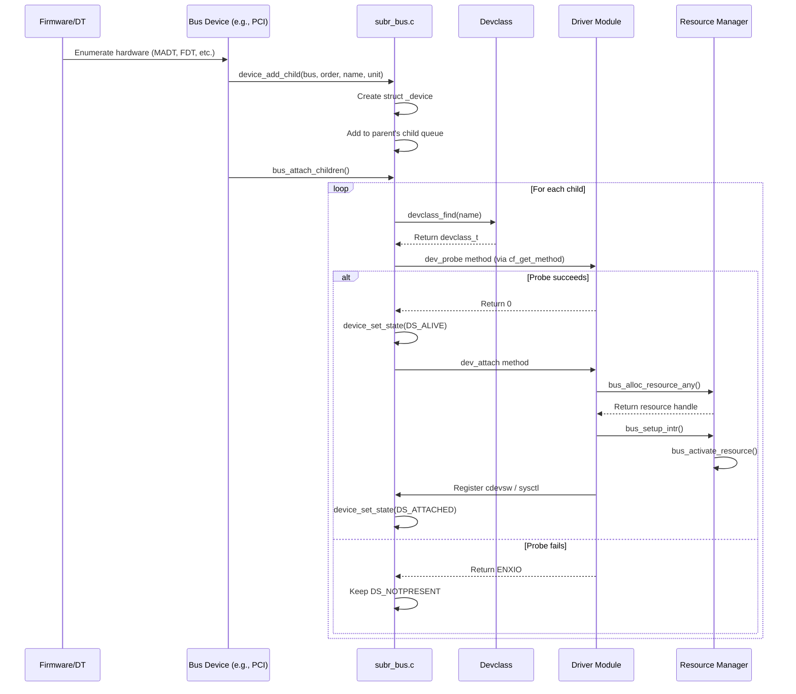

# Device Driver Framework — newbus and devclass
<!-- This file is auto-generated by generate-doc.py -- do not edit manually -->

---
**Navigation:**
  **Up:** [Kernel Core — Structure and Entry Point](../README.md) ▸ [Source Tree — Layout and Conventions](../../README_internals.md)
  **Related:** [CAM — Common Access Method Storage Stack](../cam/README.md) | [Interrupt Handling — Threads, Filters, and Dispatch](README_intr.md) | [NIC Drivers — from if_vr to iflib to if_cxgbe](../dev/README_nic_drivers.md)
  **All chapters:** [Source Tree — Layout and Conventions](../../README_internals.md) | [Boot Process — UEFI Bootloader to Kernel Handoff](../../stand/efi/loader/README.md) | [Kernel Core — Structure and Entry Point](../README.md) | [Build System — buildworld and buildkernel](../../share/mk/README.md) | [Virtual Memory Subsystem — vm_page, UMA, and Pagers](../vm/README.md) | [Process Management — Scheduling and Lifecycle](README_process.md) | [Locking Primitives — Mutexes, sx, rmlocks, and Atomics](README_locking.md) | [Buffer Cache — Block I/O Subsystem](../vm/README_bcache.md) ...
---


> ⚠ **UNVERIFIED DRAFT** — reviewer did not explicitly approve this draft; fact-check revision failed — paths/structs may be hallucinated. Treat claims as suspect until manually reviewed.


## Quick Summary

The FreeBSD device driver framework, known as *newbus*, provides a hierarchical model for discovering, enumerating, and managing hardware devices. At its core, newbus represents the system's hardware topology as a tree: a root "nexus" device represents the motherboard or system bus, and child devices attach to parents representing physical buses such as PCI, USB, or ISA. Each device node in this tree carries state about whether it has been probed (identified), attached (its driver bound), and enabled for operation. This tree structure allows the kernel to reason about resource dependencies — for example, a PCI network card depends on the PCI bus controller, which in turn depends on the system I/O APIC.

Drivers register themselves with the framework by declaring a driver structure and calling `DRIVER_MODULE()`. When the framework discovers a potential device — either through firmware tables, device tree blobs, or bus-specific enumeration — it searches the registered drivers for a match based on the device's vendor, device ID, and compatible strings. The first matching driver's `probe` method is called to confirm the device is actually supported; if the probe succeeds, the driver's `attach` method is called to initialize the device and make it available to the rest of the system.

Resource management in newbus is handled through the `rman` subsystem, integrated with bus-specific operations. Drivers request resources — memory regions, I/O ports, and interrupt lines — through bus functions like `bus_alloc_resource_any()` and `bus_setup_intr()`. The bus layer mediates these requests, ensuring that resources are not double-allocated and that parent buses are consulted when a child bus cannot satisfy a request directly. This resource hierarchy is critical on platforms like Alpha or ARM, where interrupt controllers and bus bridges require explicit programming to route resources correctly.

The `devclass` subsystem maintains the mapping between device types and their driver instances. Each devclass represents a logical class of devices (for example, all "ahci" controllers form one devclass), and stores an array of device pointers indexed by unit number. This structure allows drivers to look up other devices of the same type, and provides the foundation for userspace tools like `devinfo` and `pciconf` to enumerate the system's hardware.

## Architecture

The newbus framework lives primarily in `sys/kern/subr_bus.c`, with public interfaces declared in `sys/sys/bus.h`. The core data structures are `_device` (the internal device node) and `devclass` (the driver-to-device mapping). These are defined in `subr_bus.c` rather than in a header to prevent external code from depending on internal layout.

### The Device Tree

Every device in the tree is represented by `struct _device`, defined in `sys/kern/subr_bus.c`. The structure contains:

```c
struct _device {
    /*
     * A device is an object in the hierarchy.
     */
    kobj_object_t the;
    TAILQ_ENTRY(_device) hierarchy;
    device_t parent;
    device_t child;
    TAILQ_HEAD(, _device) children;
    devclass_t devclass;
    const char *name;
    int unit;
    int flags;
    device_state_t state;
    void *softc;
    LIST_HEAD(, device_prop_elm) props;
    resource_list_t resources;
};
```

The `hierarchy` field links devices into their parent's child list, while `parent` points to the bus device that discovered this device. The `softc` field is driver-private data, allocated during `attach` and freed during `detach`. The `state` field tracks the device's lifecycle through the `device_state_t` enum defined in `sys/sys/bus.h`:

```c
typedef enum device_state {
    DS_NOTPRESENT = 10,
    DS_ALIVE = 20,
    DS_ATTACHING = 25,
    DS_ATTACHED = 30,
} device_state_t;
```

Devices start in `DS_NOTPRESENT`, transition to `DS_ALIVE` after a successful `probe`, and reach `DS_ATTACHED` after `attach` completes.

### Devclass and Driver Registration

A `devclass` represents a logical grouping of devices that share the same driver type. It is defined in `sys/kern/subr_bus.c`:

```c
struct devclass {
    TAILQ_ENTRY(devclass) link;
    devclass_t parent;
    driver_list_t drivers;
    char *name;
    device_t *devices;
    int maxunit;
    int flags;
    struct sysctl_oid *sysctl_tree;
};
```

The `devices` array is indexed by unit number, allowing drivers to look up peers by unit. The `drivers` list holds `driverlink` entries — each representing a driver class registered with this devclass. When a driver calls `devclass_add_driver()`, its class is added to the devclass's driver list.

Drivers register using the `DRIVER_MODULE()` macro, which creates a module descriptor and invokes `devclass_add_driver()` at load time. The driver's `probe` and `attach` methods are stored in the driver's method table, accessible via `cf_get_method()` from the configuration framework.

### Resource Management

Resources are managed through the `rman` subsystem, integrated with bus operations. Each device maintains a `resource_list_t` containing `resource_list_entry` structures. When a driver calls `bus_alloc_resource()`, the bus searches its child devices' resource lists and, if necessary, delegates to the parent bus.

The bus interface provides generic implementations for resource operations. Functions like `bus_generic_alloc_resource()` and `bus_generic_rl_alloc_resource()` walk the device tree, consulting parent buses when a child cannot satisfy a request. Interrupt setup uses `bus_setup_intr()`, which binds an interrupt handler to a specific resource and manages the activation/deactivation lifecycle through `bus_activate_resource()` and `bus_deactivate_resource()`.

The `bus_space` abstraction, defined in `machine/bus.h` and `sys/bus.h`, provides a uniform interface for memory-mapped and I/O-port access. The `bus_space_tag_t` and `bus_space_handle_t` types abstract away platform-specific access patterns, allowing drivers to use `bus_space_map()`, `bus_space_read_4()`, and similar functions without knowing the underlying hardware details.

DMA resources are managed through a separate subsystem using `bus_dma_tag_t` and `bus_dmamap_t` types. Drivers create a DMA tag with `bus_dma_tag_create()` to specify alignment, boundary, and maximum transfer size constraints. The tag is then used to allocate DMA maps via `bus_dmamap_create()`, which are populated with physical mappings through `bus_dmamap_load()`. This two-level abstraction allows the bus layer to handle IOMMU translation, bounce buffering, and scatter-gather list construction transparently. DMA maps are unloaded with `bus_dmamap_unload()` and destroyed with `bus_dma_tag_destroy()`.

## Key Data Structures

### struct _device (sys/kern/subr_bus.c)

The internal device node, named `_device` to avoid conflicts with user-space `struct device`. Key fields:

- `the` — The kobj_object base, enabling object-oriented method dispatch
- `parent` — Pointer to the parent bus device
- `children` — Tail queue of child devices
- `devclass` — Pointer to the devclass this device belongs to
- `name` — Device name (e.g., "eth0", "ahci0")
- `unit` — Unit number within the devclass
- `state` — Current lifecycle state (DS_NOTPRESENT, DS_ALIVE, DS_ATTACHING, DS_ATTACHED)
- `softc` — Driver-allocated private data
- `resources` — Resource list managed by rman

The name `_device` was chosen to prevent type confusion with other subsystems that define their own `struct device`.

### struct devclass (sys/kern/subr_bus.c)

Maps device types to their driver instances:

- `name` — Devclass name (e.g., "ahci", "pci")
- `devices` — Array of device_t pointers, indexed by unit number
- `maxunit` — Size of the devices array
- `drivers` — List of driverlink entries for registered drivers
- `sysctl_tree` — Sysctl interface for userspace enumeration

### struct u_device (sys/sys/bus.h)

Exported device information for userspace via `sysctl hw.bus`:

```c
struct u_device {
    uintptr_t dv_handle;
    uintptr_t dv_parent;
    uint32_t dv_devflags;
    uint16_t dv_flags;
    device_state_t dv_state;
    char dv_fields[BUS_USER_BUFFER];
};
```

The `dv_fields` buffer contains NUL-separated strings: name, description, driver name, PnP info, and location. This compact format allows userspace tools to enumerate the entire device tree with a single sysctl call.

### struct u_businfo (sys/sys/bus.h)

```c
struct u_businfo {
    int ub_version;
    int ub_generation;
};
```

The `ub_generation` counter increments whenever the device tree changes, allowing userspace to detect additions or removals without rescanning the entire tree.

### device_state_t (sys/sys/bus.h)

```c
typedef enum device_state {
    DS_NOTPRESENT = 10,
    DS_ALIVE = 20,
    DS_ATTACHING = 25,
    DS_ATTACHED = 30,
} device_state_t;
```

State transitions: `DS_NOTPRESENT` → `DS_ALIVE` (probe success) → `DS_ATTACHING` → `DS_ATTACHED`. Failed probes return the device to `DS_NOTPRESENT`.

## Deep Dive

### Device Discovery and Enumeration

Device discovery begins with the bus that connects to the root nexus. On x86_64, the ACPI subsystem creates device nodes for PCI devices from the MADT and MCFG tables. On ARM, the device tree parser creates nodes from the flattened device tree (FDT). Each bus device implements a `bus_child_present()` method that checks for hardware at specific addresses or configuration spaces.

When a bus discovers a potential child, it calls `device_add_child()`:

```c
device_t device_add_child(device_t bus, int order, const char *name, int unit)
```

This function creates a new `_device` structure, sets its parent to `bus`, and adds it to the parent's child queue. The `order` parameter controls probe priority — lower-order devices are probed first. The `name` parameter specifies the devclass to search for matching drivers.

After all children are added, `bus_attach_children()` is called. This function iterates over the child queue and calls `device_probe_and_attach()` for each device.

### Probe and Attach Lifecycle

The probe-attach sequence follows a strict order:

1. **Probe**: `device_probe()` calls the driver's `dev_probe` method. The driver checks vendor/device IDs, compatible strings, and registers. If the device is supported, the driver returns 0 and may call `device_set_desc()` to set a description string.

2. **Attach**: `device_attach()` calls the driver's `dev_attach` method. The driver allocates its softc via `device_get_softc()`, requests resources via `bus_alloc_resource_any()`, sets up interrupts via `bus_setup_intr()`, and registers character device switches if applicable.

The generic implementations in `subr_bus.c` provide fallback behavior:

```c
int bus_generic_probe(device_t dev)
{
    /* Check if any driver claims this device */
    /* Return 0 if a driver matches, ENXIO otherwise */
}

int bus_generic_attach(device_t dev)
{
    /* Call child attach methods */
}
```

`bus_generic_probe()` iterates over the devclass's driver list, calling each driver's probe method in turn. The first driver to return 0 wins. If no driver matches, the device remains in `DS_NOTPRESENT`.

### Resource Allocation

Drivers request resources through the bus interface. The `bus_alloc_resource()` function takes a device, resource type (SYS_RES_IRQ, SYS_RES_MEMORY, SYS_RES_IOPORT), and a resource specification. The bus searches its own resource list and, if necessary, delegates to the parent bus.

For PCI devices, the `pcib` bus driver reads configuration space to determine available resources, then programs the BAR registers during attach. For ISA devices, the `isa` bus driver uses the system's resource map to allocate from predefined ranges.

Interrupt setup uses `bus_setup_intr()`, which:

1. Activates the resource via `bus_activate_resource()`
2. Calls the driver's `intr_routines->setup()` method
3. Registers the handler with the interrupt controller

The `bus_teardown_intr()` function reverses this process, called during detach or suspend.

### The devclass System

Devclasses are created with `devclass_create()`, which allocates a `devclass` structure and registers it with the framework. The `devclass_find()` function looks up a devclass by name, allowing drivers to reference peer devices:

```c
devclass_t dc = devclass_find("ahci");
device_t dev = devclass_get_device(dc, unit);
```

The `devclass_get_softc()` function returns the softc of a peer device, enabling drivers to access shared state.

## Flow / Diagram

The following sequence diagram shows the device discovery and attachment flow:



## Advanced Notes

### Debugging with DTrace

Newbus provides SDT probes for key lifecycle events. The `newbus` provider includes probes such as `device-probe-start`, `device-probe-done`, `device-attach-start`, and `device-attach-done`. These probes carry the device name, unit number, and return code, allowing you to trace the entire attachment sequence:

```
dtrace -n 'newbus$target::device-probe-done { printf("%s%d: probe returned %d", arg0, arg1, arg2); }'
```

The `devclass_get_devices()` function can be called from DTrace to enumerate all devices in a devclass, useful for tracking down missing drivers.

### Performance Considerations

The device tree is traversed during probe and attach, which can be slow on systems with many devices. The `pass` field in `driverlink` controls probe ordering — drivers can register with different passes to ensure that bus drivers are probed before their children. The `DF_DEFERRED_PROBE` flag allows drivers to defer probing until a dependency is satisfied.

The `device_busy()` and `device_unbusy()` functions provide reference counting for devices during suspend/resume and hotplug operations. These functions prevent detachment while a device is in use, avoiding use-after-free bugs.

### Suspend and Resume

During system suspend, `bus_generic_suspend()` is called on each device, which in turn calls the driver's `dev_suspend` method. The driver should save device state, disable interrupts, and mark the device as suspended (DF_SUSPENDED flag). During resume, `bus_generic_resume()` reverses this process. The `bus_suspend_intr()` and `bus_resume_intr()` functions handle interrupt state specially, ensuring that interrupts are not delivered to suspended drivers.

### Common Pitfalls

1. **Resource leaks**: Drivers that allocate resources in `attach` but fail to free them in `detach` will cause resource exhaustion. Always pair `bus_alloc_resource()` with `bus_free_resource()` in the detach path.

2. **Softc lifetime**: The softc is allocated by `device_get_softc()` during attach and freed during detach. Accessing softc after detach is a use-after-free bug.

3. **Probe ordering**: If a driver depends on another device being attached first, it should use `device_add_child_ordered()` with an appropriate order value, or defer probing with `DF_DEFERRED_PROBE`.

4. **Interrupt handling**: Drivers must call `bus_setup_intr()` to register interrupt handlers and `bus_teardown_intr()` to unregister them. Calling `bus_setup_intr()` directly bypasses the bus framework and can cause resource conflicts.

## See Also
- [Interrupt Handling — Threads, Filters, and Dispatch](README_intr.md)
- [NIC Drivers — from if_vr to iflib to if_cxgbe](../dev/README_nic_drivers.md)
- [CAM — Common Access Method Storage Stack](../cam/README.md)


**Source directories:**
- [`sys/kern/subr_bus.c`](subr_bus.c) — Core newbus implementation
- [`sys/sys/bus.h`](../sys/bus.h) — Public newbus interfaces
- [`sys/kern/kern_conf.c`](kern_conf.c) — Character device management
- [`sys/kern/kern_devctl.c`](kern_devctl.c) — Device control and hotplug events
- [`sys/kern/subr_rman.c`](subr_rman.c) — Resource manager
- `sys/dev/pci/pcib.c` — PCI bus implementation
- `sys/dev/isa/isa_bus.c` — ISA bus implementation
- [`sys/arm64/arm64/nexus.c`](../arm64/arm64/nexus.c) — ARM64 platform bus

**Related documentation:**
- FreeBSD man9: `driver.9`, `device.9`, `device_probe_and_attach.9`
- FreeBSD Handbook: Chapter 14. Newbus

---

> _Generated by [DaemonDocs](https://github.com/ocochard/DaemonDocs) on 2026-05-04 02:17 UTC using model `Qwen3.6-35B-A3B-UD-Q8_K_XL` (llama.cpp build `b8985-27aef3dd9`). AI-generated content — verify against source before relying on it._
