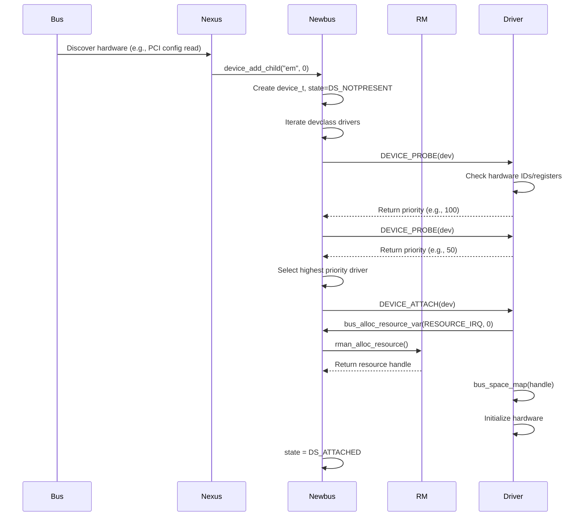

# Device Driver Framework
<!-- This file is auto-generated by generate-doc.py -- do not edit manually -->

---
**Navigation:**
  **Related:** [CAM — Common Access Method Storage Stack](../cam/README.md) | [Interrupt Handling — Threads, Filters, and Dispatch](README_intr.md) | [NIC Drivers — from if_vr to iflib to if_cxgbe](../dev/README_nic_drivers.md)
  **All chapters:** [Source Tree — Layout and Conventions](../../README_internals.md) | [Boot Process — UEFI Bootloader to Kernel Handoff](../../stand/efi/loader/README.md) | [Kernel Core — Structure and Entry Point](../README.md) | [Build System — buildworld and buildkernel](../../share/mk/README.md) | [Virtual Memory Subsystem — vm_page, UMA, and Pagers](../vm/README.md) | [Process Management — Scheduling and Lifecycle](README_process.md) | [Locking Primitives — Mutexes, sx, rmlocks, and Atomics](README_locking.md) | [Buffer Cache — Block I/O Subsystem](../vm/README_bcache.md) ...
---


## Quick Summary

Newbus is the FreeBSD device driver framework that manages hardware enumeration, driver attachment, and resource allocation through a hierarchical tree. It separates hardware discovery from driver initialization, allowing the kernel to support diverse bus architectures—PCI, USB, ISA, and virtual devices—using a uniform API. The framework operates in two distinct phases: probing and attaching. During probing, the kernel queries hardware to determine compatibility with registered drivers. Once a match is established, the attaching phase initializes the device, allocates system resources, and registers the driver's services with the rest of the kernel.

Resource management is a core component of Newbus. The framework integrates with the resource manager (`rman`) to handle I/O ports, memory regions, interrupt requests (IRQ), and DMA (Direct Memory Access) resources. This ensures that multiple drivers do not claim the same hardware resource simultaneously. DMA resources are managed through a separate API: drivers create DMA tags (`bus_dma_tag_create`) that describe memory requirements, allocate DMA memory (`bus_dmamem_alloc`), create DMA maps (`bus_dmamap_create`), and load mappings (`bus_dmamap_load`) to establish bus-mastering capabilities. The DMA tagging system abstracts IOMMU and cache-coherency details, allowing drivers to use consistent function calls like `bus_dmamap_load_mbuf()` and `bus_dmamap_load_uio()` regardless of the underlying hardware architecture. Additionally, Newbus provides the `bus_space` abstraction, which normalizes access to memory-mapped and port-mapped I/O across different CPU architectures. By encapsulating these details, driver authors can write portable code that works across x86, ARM64, and other platforms.

The framework relies on a tree structure where each node represents a device. The root of the tree is the system's main bus, often referred to as the nexus device. Child devices are attached to their parent buses, forming a hierarchy that mirrors the physical connections on the motherboard. For example, a PCI network card is a child of the PCI bus, which is a child of the nexus. This hierarchy allows parent buses to manage resources for their children and to propagate power management events down the tree.

Newbus is implemented primarily in `sys/kern/subr_bus.c`, with public APIs defined in `sys/sys/bus.h`. The framework uses KObjects for method dispatch, allowing drivers to define custom behaviors for probe, attach, detach, and shutdown operations. This design enables the kernel to dynamically load and unload device drivers as modules, making the system adaptable to changing hardware configurations without requiring a reboot.

## Architecture

The core of Newbus resides in `sys/kern/subr_bus.c`, which implements the logic for device enumeration, driver attachment, and resource allocation. The framework uses a tree structure where each node is a `device_t` object, defined in `sys/sys/bus.h`. The root of the tree is typically the nexus device, which represents the system's primary bus. Child devices are created using `device_add_child()` and attached to their parent buses, forming a hierarchy that mirrors the physical connections on the motherboard.

Driver registration occurs through the `driver_t` structure, which contains function pointers for `match` and `attach`. When a device is created, the framework iterates through the list of registered drivers for that device's class (stored in a `devclass` structure), calling the `match` function to determine compatibility. If a driver matches, it is added to the device's list of candidates. The driver that returns the highest non-error value from `DEVICE_PROBE()` wins the election and attaches to the device.

Resource allocation is handled by the resource manager (`rman`), located in `sys/kern/subr_rman.c`. The `bus_alloc_resource_var()` function serves as the primary interface for drivers to request I/O ports, memory regions, or interrupts. The resource manager maintains a global view of available resources and ensures that allocations are non-overlapping and correctly mapped. Parent buses typically manage resource allocation for their children, as seen in the `BUS_ALLOC_RESOURCE()` method defined in `sys/kern/bus_if.m`.

DMA resource allocation follows a different pattern. Drivers use the bus DMA API to create DMA tags that describe memory alignment and size requirements, allocate DMA memory, create DMA maps, and load mappings. The DMA system handles the translation between CPU-visible addresses and bus-masterable addresses, which is essential for devices that perform direct memory transfers. This API is defined in `sys/sys/_bus_dma.h` and implemented in architecture-specific files under `sys/arm64/` or `sys/x86/`.

The `bus_space` abstraction, defined in `machine/bus.h` and `sys/sys/bus.h`, provides a uniform interface for accessing device registers. It separates the bus tag (`bus_space_tag_t`), which describes the bus type and access methods, from the bus handle (`bus_space_handle_t`), which represents a specific memory or I/O region. This separation allows drivers to use consistent function calls like `bus_space_read_4()` and `bus_space_write_4()` regardless of the underlying hardware architecture.

## Key Data Structures

The Newbus framework uses several key structures to manage the device tree and driver lifecycle. These are defined in `sys/sys/bus.h` and `sys/kern/subr_bus.c`.

`struct _device` represents a single device node in the tree:
```c
struct _device {
    kobj_t the;                 /* KObject base for method dispatch */
    device_t parent;            /* Parent device or NULL for nexus */
    devclass_t devclass;        /* Devclass containing this device */
    char *name;                 /* Driver name (e.g., "em") */
    int unit;                   /* Unit number (e.g., 0, 1) */
    device_state_t state;       /* Current state (DS_ALIVE, DS_ATTACHED) */
    driver_t *driver;           /* Winning driver structure */
    struct resource_list resources; /* List of allocated resources */
    void *softc;                /* Driver-private data */
    /* ... hierarchy, sysctl, properties ... */
};
```

`struct devclass` manages the list of drivers and devices for a specific bus type:
```c
struct devclass {
    TAILQ_ENTRY(devclass) link;           /* Link in global devclass list */
    driver_list_t drivers;                /* List of candidate drivers */
    char *name;                           /* Devclass name (e.g., "pci") */
    device_t *devices;                    /* Array of devices indexed by unit */
    int maxunit;                          /* Size of devices array */
    struct sysctl_ctx_list sysctl_ctx;    /* Sysctl tree for /dev/* */
};
```

`struct rman` defines a resource manager that tracks available resources:
```c
struct rman {
    struct resource_list rm_resources;    /* List of allocated resources */
    rman_res_t rm_start;                  /* Start of managed range */
    rman_res_t rm_end;                    /* End of managed range */
    rman_res_t rm_size;                   /* Size of managed range */
    enum rman_type rm_type;               /* RMAN_GAUGE or RMAN_ARRAY */
    struct mtx rm_mtx;                    /* Mutex protecting the resource list */
    /* ... lock, statistics ... */
};
```

`struct resource` represents an allocated hardware resource:
```c
struct resource {
    struct resource_i *__r_i;             /* Internal resource info */
    bus_space_tag_t r_bustag;             /* Bus space tag for register access */
    bus_space_handle_t r_bushandle;       /* Mapped I/O handle */
};
```

## Deep Dive

The device attachment process begins when a bus driver calls `device_add_child()` to create a new device node. This function allocates a `struct _device`, assigns it a name and unit number, and adds it to the parent's child list. The device is initially placed in the `DS_NOTPRESENT` state.

Once the device node exists, the framework calls `device_probe_and_attach()`. This function iterates through the drivers registered in the device's `devclass`. For each driver, it calls the `match` method (exposed as `DEVICE_PROBE()`). The `match` method typically reads hardware registers or checks PCI configuration space to verify that the driver supports the device. If the driver matches, it returns a priority value. The framework tracks the highest priority returned and selects the corresponding driver.

After a driver wins the election, the framework transitions the device to the `DS_ATTACHING` state and calls the `attach` method (`DEVICE_ATTACH()`). During attachment, the driver requests resources using `bus_alloc_resource_var()`. This function queries the parent bus's resource manager to find available I/O ports, memory regions, or IRQs. If the allocation succeeds, the driver maps the resources using `bus_space_map()` and initializes the device hardware. Finally, the driver registers its services with the kernel (e.g., registering a network interface or a disk device) and transitions the device to the `DS_ATTACHED` state.

DMA resource allocation occurs during the attach phase for devices that require bus mastering. The driver creates a DMA tag using `bus_dma_tag_create()`, specifying alignment, size, and other constraints. It then allocates DMA memory with `bus_dmamem_alloc()`, creates a DMA map with `bus_dmamap_create()`, and loads the mapping with `bus_dmamap_load()` or `bus_dmamap_load_mbuf()`. The DMA system translates CPU addresses to bus addresses, handling IOMMU translation and cache coherency as needed.

The `bus_if.m` interface defines methods that bus drivers must implement to support child devices. For example, `BUS_ALLOC_RESOURCE()` is responsible for allocating resources for children. In a PCI driver, this method might look up the device's BARs (Base Address Registers) and request the corresponding memory or I/O regions from the system resource manager. Similarly, `BUS_ADD_CHILD()` creates child devices for buses that support hot-plugging or dynamic device discovery.

Resource cleanup is handled by the `detach` method (`DEVICE_DETACH()`). When a device is detached, the framework calls the driver's detach function, which releases allocated resources, unregisters device services, and frees the driver's private data (`softc`). The `bus_generic_detach()` function in `subr_bus.c` provides a default implementation that iterates through the device's resource list and releases each resource. DMA resources are also freed during detachment using `bus_dmamap_unload()` and `bus_dma_tag_destroy()`.

## Flow / Diagram



## Advanced Notes

Debugging Newbus issues often involves examining the device tree and resource allocation. The `devinfo` utility (or `sysctl hw.bus`) provides a detailed view of the device hierarchy, driver attachments, and resource usage.

Performance considerations arise in systems with thousands of devices. The `devclass` structure uses a sorted driver list to speed up probe elections, and the `device_t` array is indexed by unit number for fast lookup. However, probing every driver for every device can be slow on systems with many PCI devices. FreeBSD mitigates this by using the `DL_DEFERRED_PROBE` flag, which delays probing until the system is ready, and by organizing drivers into probe passes to batch similar operations.

A common pitfall is resource leaks during probe failures. If a driver allocates temporary resources during `DEVICE_PROBE()` and returns an error, it must free those resources before returning. The framework does not automatically rollback probe-time allocations. Another pitfall is forgetting to call `device_set_ivar_data()` and `device_get_ivar_data()` correctly. These functions allow buses to pass bus-specific data (like PCI configuration space offsets) to child devices. Incorrect usage can lead to silent data corruption or kernel panics.

Thread safety is managed through `device_lock` (a mutex) which protects the device tree during modifications. However, driver `attach` and `probe` methods are called with interrupts disabled or with specific lock ordering constraints. Drivers must avoid acquiring locks that could cause deadlocks, such as holding `device_lock` while calling into subsystems that might acquire it recursively. The `DF_QUIET` flag can be used to suppress verbose attach messages for devices that are known to be present but do not require user interaction.

DMA-related pitfalls include failing to call `bus_dmamap_unload()` before destroying a DMA tag, which can leak DMA mappings. Additionally, drivers must be careful with cache coherency when using DMA—data transferred via DMA may not be visible to the CPU cache until explicitly invalidated. The `bus_dmamap_sync()` function is used to flush or invalidate caches as needed.

## Comparison

Linux implements device management through a combination of Device Tree, ACPI, and bus-specific frameworks (like PCI). The core structures are `struct device` and `struct device_driver`, which are similar to FreeBSD's `device_t` and `driver_t`. Linux uses a reference counting model for device lifetime, whereas FreeBSD relies on the driver's `detach` method and explicit unloading. Linux's probe function returns an integer where `0` indicates success and negative values indicate errors, contrasting with FreeBSD's election mechanism where the highest non-error value wins.

NetBSD and OpenBSD use a similar hierarchical model but with different naming conventions. NetBSD uses `struct device` and `struct cfdriver` (config driver), and resource management is handled by `rman` as well. OpenBSD's approach is closely related but emphasizes stricter resource tracking and early hardware validation. macOS/XNU uses the I/O Kit framework, which is object-oriented and heavily relies on property lists for device configuration, differing significantly from FreeBSD's code-driven driver registration.

FreeBSD's `bus_space` abstraction is more explicitly separated from the resource manager compared to Linux, where I/O access is often handled through `ioremap` and `readl`/`writel` macros. FreeBSD's `rman` provides a more centralized and configurable resource tracking system, allowing buses to define custom allocation policies and priority rules. FreeBSD's DMA API (`bus_dma_tag_create`, `bus_dmamap_load`, etc.) is similar in concept to Linux's `dma_alloc_coherent()` and `dma_map_single()`, but FreeBSD provides a more granular tagging system that allows fine-grained control over alignment and size constraints.

## See Als
- [Network Stack Architecture](../../../sys/net/README.md)
- [Interrupt Handling](../../../sys/kern/README_intr.md)
o

- `sys/kern/subr_rman.c` — Resource manager implementation
- `sys/kern/subr_bus.c` — Core Newbus logic including devclass management
- `sys/dev/pci/pci.c` — PCI bus driver implementation
- `sys/dev/usb/usb_busdma.c` — USB bus resource and DMA management
- `man 9 driver` — Driver interface manual page
- `man 9 bus_alloc_resource` — Resource allocation manual page

---

> _Generated by [DaemonDocs](https://github.com/ocochard/DaemonDocs) on 2026-04-29 00:39 UTC using model `Qwen3.6-35B-A3B-UD-Q4_K_XL` (llama.cpp build `b8929-9d34231bb`). AI-generated content — verify against source before relying on it._
