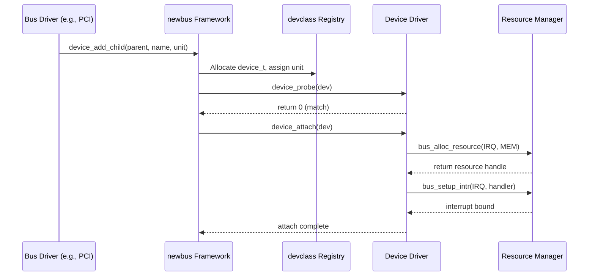

# Device Driver Framework — newbus and devclass
<!-- This file is auto-generated by generate-doc.py -- do not edit manually -->

---
**Navigation:**
  **Up:** [Kernel Core — Structure and Entry Point](../README.md) ▸ [Source Tree — Layout and Conventions](../../README_internals.md)
  **Related:** [CAM — Common Access Method Storage Stack](../cam/README.md) | [Interrupt Handling — Threads, Filters, and Dispatch](README_intr.md) | [NIC Drivers — from if_vr to iflib to if_cxgbe](../dev/README_nic_drivers.md)
  **All chapters:** [Source Tree — Layout and Conventions](../../README_internals.md) | [Boot Process — UEFI Bootloader to Kernel Handoff](../../stand/efi/loader/README.md) | [Kernel Core — Structure and Entry Point](../README.md) | [Build System — buildworld and buildkernel](../../share/mk/README.md) | [Virtual Memory Subsystem — vm_page, UMA, and Pagers](../vm/README.md) | [Process Management — Scheduling and Lifecycle](README_process.md) | [Locking Primitives — Mutexes, sx, rmlocks, and Atomics](README_locking.md) | [Buffer Cache — Block I/O Subsystem](../vm/README_bcache.md) ...
---


> ⚠ **UNVERIFIED DRAFT** — revisions regressed; kept revision 1 (8/9 criteria) over revision 3 (7/9); reviewer did not explicitly approve this draft. Treat claims as suspect until manually reviewed.


## Quick Summary
FreeBSD's device driver framework, known as newbus, provides a uniform abstraction for hardware enumeration and driver attachment. Instead of hardware being hardcoded into the kernel, newbus discovers devices on the system bus (PCI, USB, ACPI, etc.) and matches them with available drivers. This decoupling allows drivers to be compiled as loadable modules, enabling dynamic hardware support without a full kernel rebuild. The framework manages the entire lifecycle of a device, from initial detection and driver probing to resource allocation (memory, interrupts, I/O ports) and eventual detachment.

At its core, newbus relies on a hierarchical tree of `device_t` objects, each representing a hardware component and its associated driver. The framework coordinates these objects through `devclass` structures, which group devices of the same type and maintain lists of candidate drivers. When a new device is added, newbus iterates through the driver list, invoking a `probe` method to verify compatibility. If successful, the `attach` method is called to initialize the driver and request system resources. This model ensures that drivers only claim hardware they support and that system resources are allocated without conflicts.

Resource management is tightly integrated into the framework. Drivers request memory ranges, IRQ lines, and DMA handles through a resource manager (`rman`), which guarantees exclusive access and handles conflicts. Interrupt handling is abstracted via `bus_setup_intr`, allowing drivers to register interrupt handlers that are automatically bound to the correct CPU and priority. The framework also supports suspend and resume operations, ensuring that devices and their drivers can safely transition between power states. By standardizing these interactions, newbus simplifies driver development and provides a consistent interface for both kernel developers and system administrators.

## Architecture
The implementation of newbus resides primarily in `sys/kern/subr_bus.c`, with public interfaces declared in `sys/sys/bus.h`. The framework is initialized early in the boot process via the `sysinit` subsystem, ensuring that bus topology and device trees are ready before higher-level I/O subsystems request hardware access. Newbus uses a layered architecture where each bus type (PCI, ACPI, etc.) implements a `bus_methods` structure that defines how child devices are enumerated, resources are allocated, and interrupts are routed.

Drivers register themselves using the `DRIVER_MODULE` macro, which creates a `driver_module_data` structure containing pointers to the driver's methods and its associated `devclass`. During boot, `devclass_add_driver` links the driver to its `devclass`, making it available for device matching. The framework employs a "generic" fallback mechanism: if a bus driver does not override a method, `bus_generic_probe` or `bus_generic_attach` is invoked. These generic methods provide default behavior, such as allocating a software context (`softc`) or iterating through child devices.

Resource allocation is handled by the resource manager (`sys/kern/subr_rman.c`), which is tightly coupled with newbus. Newbus uses `resource_list_entry` structures to track requested resources (type, start, count, flags) before they are allocated. When `device_probe` or `device_attach` runs, it calls `bus_alloc_resource` to request hardware resources. The bus driver's implementation of `bus_generic_alloc_resource` translates these requests into bus-specific operations, such as configuring PCI configuration space registers or ACPI `_CRS` methods. The `bus_space` abstraction further isolates drivers from bus-specific I/O and memory mapping details, allowing drivers to use uniform `bus_space_handle_t` and `bus_space_tag_t` types regardless of the underlying hardware.

## Key Data Structures
The heart of the framework is the `devclass` structure, which acts as a registry for a specific device type and its candidate drivers. From `sys/kern/subr_bus.c`:
```c
struct devclass {
	TAILQ_ENTRY(devclass) link;
	devclass_t	parent;		/* parent in devclass hierarchy */
	driver_list_t	drivers;	/* bus devclasses store drivers for bus */
	char		*name;
	device_t	*devices;	/* array of devices indexed by unit */
	int		maxunit;	/* size of devices array */
	int		flags;
#define DC_HAS_CHILDREN		1
	struct sysctl_ctx_list sysctl_ctx;
	struct sysctl_oid *sysctl_tree;
};
```
Each `devclass` maintains a linked list of `driverlink` structures, which point to `kobj_class_t` driver objects. The `devices` array is allocated dynamically to provide O(1) lookup by unit number, solving the problem of quickly accessing a specific device instance without traversing the entire device tree.

Drivers are tracked via `driverlink`, defined in `sys/kern/subr_bus.c`:
```c
struct driverlink {
	kobj_class_t	driver;
	TAILQ_ENTRY(driverlink) link;	/* list of drivers in devclass */
	int		pass;
	int		flags;
#define DL_DEFERRED_PROBE	1	/* Probe deferred on this */
	TAILQ_ENTRY(driverlink) passlink;
};
```
The `pass` field controls the order in which drivers are probed, allowing critical drivers to run before others. The `DL_DEFERRED_PROBE` flag indicates that probing was postponed, typically due to missing resources or a parent device not being ready, preventing race conditions during early boot.

Devices themselves are represented by `_device` (aliased as `device_t`). While the full definition is extensive, it contains a `resource_list` to track hardware requests, a pointer to its `devclass`, and a `softc` pointer allocated during attachment. For userspace visibility, `sys/sys/bus.h` defines `struct u_device`, which exports device state and metadata through the `devctl` interface:
```c
struct u_device {
	uintptr_t	dv_handle;
	uintptr_t	dv_parent;
	uint32_t	dv_devflags;		/**< @brief API Flags for device */
	uint16_t	dv_flags;		/**< @brief flags for dev state */
	device_state_t	dv_state;		/**< @brief State of attachment */
	char		dv_fields[BUS_USER_BUFFER]; /**< @brief NUL terminated fields */
	/* name (name of the device in tree) */
	/* desc (driver description) */
	/* drivername (Name of driver without unit number) */
	/* pnpinfo (Plug and play information from bus) */
	/* location (Location of device on parent */
	/* NUL */
};
```

## Deep Dive
The device attachment lifecycle begins when a bus driver discovers a new hardware component. The bus driver calls `device_add_child(parent, name, unit)` to create a new `device_t` object. This function allocates the device, assigns it a unit number from its `devclass`, and inserts it into the parent's child list. If the unit number is wildcard (`-1`), `devclass_alloc_unit` finds the next available slot.

Once the device is created, the framework initiates the probe phase by calling `device_probe(dev)`. This function iterates through the `devclass`'s `driverlink` list, invoking each driver's `probe` method. The probe method checks hardware registers or ACPI tables to verify compatibility. If it returns 0, the driver is considered a match. If multiple drivers match, the one with the lowest `pass` value wins, or the first one in the list if passes are equal. A probe failure returns a positive error code, signaling newbus to try the next driver.

After a driver is selected, `device_attach(dev)` is called. The default implementation, `bus_generic_attach`, allocates a `softc` structure using `UMA` (if not provided externally) and calls the driver's `attach` method. The driver then requests resources using `bus_alloc_resource(dev, rid, start, end, count, flags)`. For example, a network driver might request an I/O port range and an IRQ. The resource manager checks for conflicts and maps the memory if requested. The `resource_list_entry` structures track these requests before they are committed, allowing rollback if allocation fails.

Interrupt handling is set up via `bus_setup_intr(dev, res, flags, handler, arg, &cookiep)`. This function binds the driver's interrupt handler to the allocated IRQ, configuring the CPU's interrupt controller and setting the handler's priority. During detach, the reverse occurs: `bus_teardown_intr` removes the handler, `bus_release_resource` frees hardware resources, and the driver's `detach` method cleans up driver-specific state. `device_busy()` and `device_unbusy()` are used to prevent detachment while I/O operations are in progress.

## Flow / Diagram


## Advanced Notes
Debugging newbus issues often involves examining `dmesg` output for probe failures or resource conflicts. The `devinfo` command provides a userspace view of the device tree, mapping to the `u_device` structure. The `sysctl hw.bus.disable_failed_devices` tunable can be used to prevent the system from retrying attachment on devices that fail during the first boot attempt, which is useful for isolating flaky hardware.

A common pitfall is resource starvation: if a driver requests a resource range that overlaps with another driver's allocation, `bus_alloc_resource` fails. Developers must ensure that resource requests are flexible (e.g., using `RF_ACTIVE` flags and wide ranges) or use ACPI `_CRS` methods to let the BIOS provide the correct layout. Another issue is deferred probing: if a driver depends on a device that hasn't attached yet, it must return `EPROBE_DEFER` from `probe`, causing newbus to retry later. Overuse of deferral can mask initialization order bugs and significantly slow down boot times.

Performance-wise, newbus minimizes overhead by using `UMA` for `softc` allocation and caching device lookups in the `devclass` array. However, iterating through long `driverlink` lists during probe can slow down boot on systems with many devices. The `pass` field mitigates this by allowing critical drivers to be probed first, failing fast on incompatible hardware. The `bus_topo_mtx` lock protects the device tree during topology changes, but drivers should avoid holding it during long-running operations to prevent deadlocks.

## Comparison
Linux uses a similar hierarchical model but implements it differently. FreeBSD's `devclass` directly maps to a device type and maintains the driver list, whereas Linux separates concerns into `struct device` (hardware entity), `struct driver` (code), and `struct bus_type` (enumeration). Linux drivers register via `driver_register` and match using `of_match_table` or `pci_device_id` arrays, while FreeBSD uses the `DRIVER_MODULE` macro and `kobj_class_t` method tables. Linux's resource management uses `request_region` and `request_irq`, which are less tightly integrated into the core driver model than FreeBSD's `bus_alloc_resource`.

macOS/XNU's I/O Kit takes a more object-oriented approach, using `IOService` and `IOServiceMatching` for driver matching. Instead of a simple probe/attach lifecycle, I/O Kit relies on `registerService` and `start` methods, with a complex property tree for configuration. NetBSD and OpenBSD share similarities with FreeBSD's newbus, as they all evolved from BSD's device driver framework, but NetBSD uses a more generic `config` system that abstracts bus-specific details further. OpenBSD has simplified newbus over time, removing some of the more complex deferred probing mechanisms to improve reliability.

## See Also
- [Interrupt Handling — Threads, Filters, and Dispatch](README_intr.md)
- [NIC Drivers — from if_vr to iflib to if_cxgbe](../dev/README_nic_drivers.md)
- [CAM — Common Access Method Storage Stack](../cam/README.md)


- `sys/kern/subr_bus.c`
- `sys/sys/bus.h`
- `sys/kern/subr_rman.c`

---

> _Generated by [DaemonDocs](https://github.com/ocochard/DaemonDocs) on 2026-05-01 03:13 UTC using model `Qwen3.6-35B-A3B-UD-Q4_K_XL` (llama.cpp build `b8985-27aef3dd9`). AI-generated content — verify against source before relying on it._
