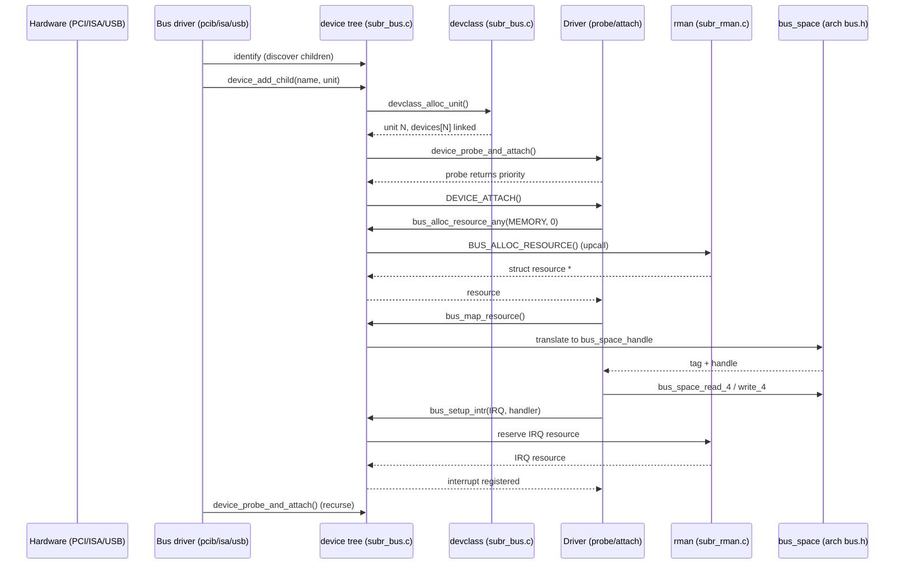

# Device Driver Framework — newbus and devclass
<!-- This file is auto-generated by generate-doc.py -- do not edit manually -->

---
**Navigation:**
  **Up:** [Kernel Core — Structure and Entry Point](../README.md) ▸ [Source Tree — Layout and Conventions](../../README_internals.md)
  **Related:** [CAM — Common Access Method Storage Stack](../cam/README.md) | [Interrupt Handling — Threads, Filters, and Dispatch](README_intr.md) | [NIC Drivers — from if_vr to iflib to if_cxgbe](../dev/README_nic_drivers.md)
  **All chapters:** [Source Tree — Layout and Conventions](../../README_internals.md) | [Boot Process — UEFI Bootloader to Kernel Handoff](../../stand/efi/loader/README.md) | [Kernel Core — Structure and Entry Point](../README.md) | [Build System — buildworld and buildkernel](../../share/mk/README.md) | [System Calls and Image Activation — Entry, sysent, and exec](README_syscall.md) | [Kernel Modules and the Linker — KLD, SYSINIT, and linker sets](README_kld.md) | [Virtual Memory Subsystem — vm_page, UMA, and Pagers](../vm/README.md) | [Process Management — Scheduling and Lifecycle](README_process.md) ...
---


## Quick Summary

FreeBSD does not hand every piece of hardware its own bespoke bookkeeping. Instead it hangs every device it knows about off a single, uniform tree — a hierarchy of *devices* (a `device_t`, really a `struct _device`) linked to their parent, their siblings, and their children. The top of that tree is a *[nexus](#glossary)* device; below it sit bus devices (PCI, ISA, USB, …) and, beneath those, the end-point drivers that actually move data. This tree is the thing the kernel walks to discover hardware, and it is the thing `dmesg` prints when the machine boots. Understanding it explains why a driver for a network card and a driver for a serial port can be written against the same small set of entry points.

A second structure runs alongside the tree: the *[devclass](#glossary)*. A devclass is a named collection of all devices of one kind — every `uart` on the system belongs to the `uart` devclass, every `em` to the `em` devclass. It is not the same as a driver, although the two are tightly coupled. The devclass owns the unit numbers (so that two UARTs become `uart0` and `uart1`), it keeps an array of the live devices indexed by unit, and it is the object that a loaded driver module registers itself against. When a [KLD](../../share/mk/README.md#glossary) (kernel loadable module) is loaded or unloaded, the devclass is what decides which devices get probed again or detached.

The third pillar is *resources*. A device is useless unless the kernel hands it the IRQ line, the I/O port range, or the memory-mapped register window it needs to talk to the hardware. That hand-off is done through the resource manager (`rman`) and the `bus_space`/`bus_tag` accessors, and it is deliberately mediated: an end-driver never pokes a physical address directly. It asks its parent bus to allocate a resource and to give it a `bus_space_handle`, and the parent is the one that knows how to reach that address on the real bus. This indirection is what lets the same driver code run unmodified on a machine where the device sits behind a PCI bridge, a memory-mapped window, or an IOMMU.

Together these three pieces — the device tree, the devclass, and the resource manager — implement the *[newbus](#glossary)* framework. A driver author writes a `probe` method (does this hardware match me?), an `attach` method (claim my resources and start working), and a `detach` method (give it all back), declares them in a method table, and registers the whole thing with a single `DRIVER_MODULE` macro. The framework does the [enumeration](../dev/usb/README.md#glossary), the unit allocation, the driver election, and the resource bookkeeping around those three callbacks.

## Glossary

**newbus** — The FreeBSD bus/device/driver framework: the combination of the device tree, the devclass registry, and the `bus_space`/`rman` resource machinery introduced to replace the older, per-bus device registration schemes.

**devclass** — A named collection of all devices of one type (e.g. `uart`, `em`); it allocates unit numbers, keeps an array of live devices indexed by unit, and is the object a driver module registers against.

**device_t** — The kernel's handle to a single device node in the tree; it is a pointer to the private `struct _device`, accessed only through accessor functions so the layout can change without breaking drivers.

**probe** — The driver method that decides whether a given device matches this driver; several drivers may probe the same device and the one returning the largest non-error value wins.

**attach** — The driver method called once probe succeeds; it is where the driver claims its resources, registers its interrupt, and starts doing real work.

**softc** — The driver's private per-device state structure, allocated by the framework to the size the driver declared; the driver reaches it with `device_get_softc()`.

**bus_space / bus_tag** — The machine- and bus-dependent access layer through which a driver reads and writes device registers; a `bus_space_tag_t` selects the access method and a `bus_space_handle_t` names the specific resource within it.

**rman** — The resource manager that tracks which IRQs, I/O ports, and memory windows are free and hands them out to drivers on behalf of their parent bus.

**nexus** — The root device of the tree on a given architecture; it represents the machine itself and is the parent of the top-level bus devices.

## Architecture

The framework is split across a small number of files in `sys/kern` and `sys/sys`. The device tree, the devclass registry, the driver-link lists, and the generic (default) method implementations all live in `sys/kern/subr_bus.c`. The public API — the `device_t` accessors, the `bus_*` resource functions, the `bus_space` prototypes, the `DRIVER_MODULE` macro, and the `u_device`/`u_businfo` structures exported to userland — is declared in `sys/sys/bus.h`. The resource manager itself, with `struct rman` and `struct resource_i`, is in `sys/kern/subr_rman.c` and declared in `sys/sys/rman.h`. The machine-specific `bus_space` implementations and the `bus_space_tag_t`/`bus_space_handle_t` typedefs live under each architecture, for example `sys/amd64/include/_bus.h` and `sys/x86/include/bus.h`.

Two generated interface files define the method tables a driver can implement. `sys/kern/device_if.m` declares the `device` interface — the methods every driver may provide: `probe`, `attach`, `detach`, `shutdown`, `suspend`, `resume`, `quiesce`, and so on. `sys/kern/bus_if.m` declares the `bus` interface — the methods a driver provides *because it has children*: `print_child`, `read_ivar`/`write_ivar`, `alloc_resource`, `map_resource`, `setup_intr`, `get_rman`, and `add_child`. The `.m` files are preprocessed into C by the build into `*_if.h` headers, which is why a driver source includes `<dev/uart/if_uart.h>`-style generated headers. Each interface provides a `bus_generic_*` or `device` default implementation, so a driver only overrides the methods it actually cares about.

Enumeration is pull-based and top-down. At boot, the machine-specific `nexus` device attaches, and `device_probe_and_attach()` is called on it. That function first invokes the device's `identify` method, which discovers the physical children (by reading PCI config space, scanning an ISA I/O port, walking a USB descriptor, etc.) and calls `device_add_child()` for each one it finds. `device_add_child()` (in `sys/kern/subr_bus.c`) allocates a `struct _device`, asks the parent's devclass for a free unit number, links the new node into both the parent's child list and its devclass's device array, and then schedules a [probe](#glossary). The probe/[attach](#glossary) pass is driven by `device_probe_and_attach()`, which walks the candidate drivers registered against the devclass, calls each driver's `probe`, and attaches the winner. Once a bus has attached, `device_probe_and_attach()` recurses into its new children (each child's `identify` runs first, then its probe and attach), so the whole tree is built and probed in a single depth-first walk.

Resource management is deliberately indirect. When a driver's `attach` method needs its IRQ or register window, it calls `bus_alloc_resource_any()` (or the ranged `bus_alloc_resource()`). That is a KObj upcall: it invokes the *parent's* `BUS_ALLOC_RESOURCE()` method, which for a PCI bridge means reaching into the bridge's `rman` for that bus and reserving a range, then returning a `struct resource *` to the child. The child never sees a physical address at this point. To actually read the registers it then calls `bus_map_resource()`, which asks the parent to translate the resource into a `bus_space_handle` and a `bus_space_tag`, and only then does it use `bus_space_read_4(tag, handle, offset)`-style accessors. The `rman` (`sys/kern/subr_rman.c`) is the accounting engine behind the bus methods: it maintains, per resource type, a linked list of allocated ranges (`struct resource_i`) and answers "is this range free, and can I share it?" The source file `sys/kern/subr_rman.c` spells out the two resource kinds it models — `RMAN_ARRAY` (numbered, individually-allocatable objects like IRQs and port ranges) and `RMAN_GAUGE` (fungible budgets, e.g. power) — and notes that sharing is only permitted for identical ranges, a constraint that keeps the bookkeeping a simple list rather than a bitmap.

The devclass layer is what makes the framework dynamic. `struct devclass` (defined at line 103 of `sys/kern/subr_bus.c`) holds the devclass's name, its parent in the devclass hierarchy, a `driver_list_t` of the drivers registered against it, and a `device_t *devices` array indexed by unit with a `maxunit` bound. When a driver module is loaded, `devclass_add_driver()` links it into that list and `devclass_driver_added()` triggers a re-probe of any devices in the class that had not yet matched. When the module is unloaded, `devclass_quiesce_driver()` and `devclass_delete_driver()` detach the affected devices. This is the mechanism that lets `kldload` bring a whole class of hardware online without a reboot.

## Key Data Structures

The devclass, defined verbatim at line 103 of `sys/kern/subr_bus.c`:

```c
struct devclass {
	TAILQ_ENTRY(devclass) link;
	devclass_t	parent;		/* parent in devclass hierarchy */
	driver_list_t	drivers;	/* bus devclasses store drivers for bus */
	char		*name;
	device_t	*devices;	/* array of devices indexed by unit */
	int		maxunit;	/* size of devices array */
	int		flags;
#define DC_HAS_CHILDREN		1

	struct sysctl_ctx_list sysctl_ctx;
	struct sysctl_oid *sysctl_tree;
};
```

The `devices` array is the reason a devclass can answer "give me `uart3`" in O(1): the unit number is the index, and `maxunit` is the array's high-water mark. The `drivers` list is what `DRIVER_MODULE` appends to. The `sysctl_tree` is the `/dev/<class>` sysctl node that userland tools read to enumerate a class.

Drivers are linked into a devclass through `struct driverlink`, also in `sys/kern/subr_bus.c`:

```c
struct driverlink {
	kobj_class_t	driver;
	TAILQ_ENTRY(driverlink) link;	/* list of drivers in devclass */
	int		pass;
	int		flags;
#define DL_DEFERRED_PROBE	1	/* Probe deferred on this */
	TAILQ_ENTRY(driverlink) passlink;
};
```

The `pass` field is the ordering knob: drivers are probed in increasing `pass`, and a lower `pass` driver is tried first. The `passlink` entry lets the same driver appear in a per-pass list so that a deferred probe (the `DL_DEFERRED_PROBE` flag) can be retried later without rescanning the whole class.

The device node itself is `struct _device`, whose implementation begins at line 135 of `sys/kern/subr_bus.c`. It is named with a leading underscore, as the source comment explains, to avoid colliding with a `struct device` that some other subsystem (notably the USB and ACPI code) defines:

```c
/**
 * @brief Implementation of _device.
 *
 * The structure is named "_device" instead of "device" to avoid type confusion
 * caused by other subsystems defining a (struct device).
 */
struct _device {
	/*
	 * A device
... (fields continue; see sys/kern/subr_bus.c)
```

The structure opens with the `KOBJ_FIELDS` block (the method pointer table inherited from the kobj object system — this is how `device_probe()` becomes a virtual call) and then carries the tree and identity [state](../netpfil/pf/README.md#glossary): the parent pointer, the `device_list_t` of children, the sibling links, the `unit` number, the `device_state_t` state, the `desc` string, the attached `driver`, the owning `devclass`, the `softc` pointer, and a reference count. All of these are reached only through the accessor functions declared in `sys/sys/bus.h` (`device_get_unit()`, `device_get_state()`, `device_get_softc()`, `device_get_children()`, etc.), which is what keeps the field layout a private detail.

The state machine is small and is the `device_state_t` enum in `sys/sys/bus.h`:

```c
typedef enum device_state {
	DS_NOTPRESENT = 10,		/**< @brief not probed or probe failed */
	DS_ALIVE = 20,			/**< @brief probe succeeded */
	DS_ATTACHING = 25,		/**< @brief currently attaching */
	DS_ATTACHED = 30,		/**< @brief attach method called */
} device_state_t;
```

The gap between the values (10, 20, 25, 30) is deliberate: it leaves room to insert new states without renumbering, and it lets code test "is this at least alive?" with a single comparison.

The resource side is split between a public, ABI-stable header and a private implementation. The public `struct resource` in `sys/sys/rman.h` is deliberately tiny and is marked as a frozen ABI:

```c
struct resource {
	struct resource_i	*__r_i;
	bus_space_tag_t		r_bustag; /* bus_space tag */
	bus_space_handle_t	r_bushandle;	/* bus_space handle */
};
```

The comment above it in the header warns that changing the offset, size, or type of these fields breaks the device-driver ABI and is "strongly FORBIDDEN." The real per-range state — start, end, flags, the sharing list — lives in the private `struct resource_i` in `sys/kern/subr_rman.c`, which `struct resource` points to through `__r_i`. The flags are the `RF_*` bits in `sys/sys/rman.h` (`RF_ALLOCATED`, `RF_ACTIVE`, `RF_SHAREABLE`, `RF_PREFETCHABLE`, `RF_OPTIONAL`, `RF_UNMAPPED`, and the `RF_ALIGNMENT_LOG2()` packing), and the resource *types* are architecture-defined in `sys/amd64/include/resource.h`:

```c
#define	SYS_RES_IRQ	1	/* interrupt lines */
#define	SYS_RES_DRQ	2	/* isa dma lines */
#define	SYS_RES_MEMORY	3	/* i/o memory */
#define	SYS_RES_IOPORT	4	/* i/o ports */
#define	PCI_RES_BUS	5	/* PCI bus numbers */
```

The `bus_space` types are likewise thin, machine-defined typedefs. In `sys/amd64/include/_bus.h` they are both 64-bit integers:

```c
typedef uint64_t bus_addr_t;
typedef uint64_t bus_size_t;
typedef	uint64_t bus_space_tag_t;
typedef	uint64_t bus_space_handle_t;
```

On a bus where a tag is a pointer to a per-bus context (a PCI bridge, a memory window), the same typedef is instead a pointer type — the driver code does not change, because it only ever passes the tag and handle opaquely to the `bus_space_*` accessors.

Finally, the structures exported to userland, in `sys/sys/bus.h`, mirror the kernel objects so that tools like `devinfo` and the `/dev` sysctl tree can describe the tree without a kernel copy:

```c
struct u_businfo {
	int	ub_version;		/**< @brief interface version */
#define BUS_USER_VERSION	2
	int	ub_generation;		/**< @brief generation count */
};

struct u_device {
	uintptr_t	dv_handle;
	uintptr_t	dv_parent;
	uint32_t	dv_devflags;		/**< @brief API Flags for device */
	uint16_t	dv_flags;		/**< @brief flags for dev state */
	device_state_t	dv_state;		/**< @brief State of attachment */
	char		dv_fields[BUS_USER_BUFFER]; /**< @brief NUL terminated fields */
};
```

## Deep Dive

**Registration.** A driver ends with a `DRIVER_MODULE` call. The macro is defined in `sys/sys/bus.h` and takes the driver name, the bus name, the driver object, a [module event](README_kld.md#glossary) handler, and an argument:

```c
#define DRIVER_MODULE(name, busname, driver, evh, arg)
```

It wraps the driver in a `struct driver_module_data` (also in `sys/sys/bus.h`, whose fields are `dmd_driver`, `dmd_busname`, `dmd_devclass`, `dmd_pass`, and the module event [hook](../netgraph/README.md#glossary)) and registers it as a loadable module. When the module is loaded — at boot for a built-in driver, or on `kldload` for a [KLD](README_kld.md#glossary) — the framework calls `devclass_add_driver()`, which links a `struct driverlink` into the target devclass's `drivers` list and then calls `devclass_driver_added()`. That callback is the trigger that says "a new candidate just appeared; go re-probe every device in this class that is still `DS_NOTPRESENT`." This is why loading a driver module can bring hardware online without touching the device tree by hand.

**Enumeration and unit allocation.** When a bus driver wants to add a child, it calls `device_add_child()` (or the ordered variant `device_add_child_ordered()`), both in `sys/kern/subr_bus.c`. The function allocates a `struct _device`, then asks the parent's devclass for a unit number. That is `devclass_alloc_unit()` (with `devclass_find_free_unit()` doing the scan of the `devices` array up to `maxunit`), which grows the array if the requested unit is past `maxunit`. The new node is linked into the parent's child list, its `devclass` pointer is set, its `state` is initialized, and it is registered with the `devctl` event system (`devctl_attach_handler()` in `sys/kern/kern_devctl.c`) so that userland sees the new node appear. Only after the node is fully linked does the framework schedule the probe.

**Probe and attach.** The actual matching is `device_probe_and_attach()` in `sys/kern/subr_bus.c`. It takes the device, walks the devclass's driver list in `pass` order, and calls each driver's `DEVICE_PROBE()` method. The election rule (documented in `sys/kern/device_if.m`) is that the driver returning the largest non-error value wins; a return of zero short-circuits the election and attaches that driver immediately. The losing drivers are expected to have freed anything they allocated during probe, because probe is allowed to be called on hardware that will not end up theirs. Once a winner is chosen, its `DEVICE_ATTACH()` method runs, the device's `state` moves from `DS_ALIVE` through `DS_ATTACHING` to `DS_ATTACHED`, and the attach message is printed. If the bus has children of its own, `device_probe_and_attach()` recurses into them.

**Resource allocation.** Inside `attach`, a typical driver does this:

```c
error = bus_alloc_resource_any(dev, SYS_RES_MEMORY, 0, &res);
if (error != 0)
    return (error);
mem = bus_space_map(bus_get_bus_tag(dev),
    bus_space_handle_of(res), bus_space_size_of(res), 0, &map);
```

`bus_alloc_resource_any()` is a macro in `sys/sys/bus.h` that expands into a KObj upcall to the parent's `BUS_ALLOC_RESOURCE()` method. For a PCI device, that method reaches the bridge's `rman` and reserves a range, returning a `struct resource *`. The driver then calls `bus_map_resource()` (or the convenience `bus_space_map` path) to get a `bus_space_handle` it can pass to the accessors. The accessors themselves — `bus_space_read_1/2/4/8`, `bus_space_write_1/2/4/8`, `bus_space_read_multi_*`, and friends — are implemented per architecture (e.g. `sys/x86/include/bus.h` for x86) and dispatch on the tag. This is the layer that turns "read offset 0x10 of my BAR 0 (Base Address Register)" into the right physical-memory or I/O-port access for whatever bus the device is actually behind.

**Interrupts.** Interrupts follow the same upcall pattern. `bus_setup_intr()` (declared in `sys/sys/bus.h`, with a default `bus_generic_setup_intr()` in `sys/kern/subr_bus.c`) asks the parent to allocate an IRQ resource and to register the handler with the interrupt subsystem (`sys/kern/kern_intr.c`). The parent is the one that knows the interrupt's routing, so the end-driver stays bus-agnostic. Tearing down is symmetric: `bus_teardown_intr()` and, at the end of `detach`, `bus_release_resource()` for each resource the driver claimed.

**DMA (Direct Memory Access).** DMA — the mechanism by which a device reads or writes system memory directly, without CPU intervention — is not the register-access path above; that path is only how a driver talks to a device's control registers, not how it obtains memory that the device will move in bulk. For that, the driver uses the `bus_dma` layer (declared in `sys/sys/bus_dma.h`, with per-architecture implementations). First it calls `bus_dma_tag_create()` to set up a [DMA tag](../dev/README_nic_drivers.md#glossary) that captures the device's constraints — the alignment, the alignment offset, the boundary (the largest contiguous transfer the device can issue), and whether addresses must be power-of-two aligned. It then calls `bus_dmamem_alloc()` to allocate DMA-coherent memory — a buffer the CPU and the device can both touch without cache-coherency juggling — which hands back a kernel virtual address together with a `bus_dmamap_t`; it then loads that map (via the `bus_dmamem_load_*()` / `bus_dmamap_load_*()` family) to translate the buffer into the device's address space, yielding the `bus_dmamap_t` that the device is told to use. The reason this is a separate mechanism from `bus_space` is that DMA requires physically contiguous, or IOMMU-mapped, memory that the device can address directly; `bus_space` merely mediates register reads and writes and says nothing about the bulk memory the device will move.

**Detach.** The reverse path is `device_detach()` in `sys/kern/subr_bus.c`. It first calls the driver's `DEVICE_DETACH()` method (the driver releases its resources and unregisters its interrupt), then removes the node from its parent's child list and from its devclass's `devices` array, and finally frees the `struct _device`. A bus that is being detached calls `device_detach()` on each of its children first (from its own `detach` method), so the tree is torn down bottom-up.

## Flow / Diagram



## Advanced Notes

**Locking.** The whole tree is protected by the bus [topology lock](../netgraph/README.md#glossary), `bus_topo_mtx()` in `sys/kern/subr_bus.c`, taken with `bus_topo_lock()` / released with `bus_topo_unlock()`. The `bus_topo_assert()` helper is for debugging: it verifies the caller already holds the lock. Any operation that can add, remove, or re-probe a device — `device_add_child()`, `device_detach()`, `devclass_add_driver()` — must hold it. A common driver bug is calling a tree-mutating accessor from an interrupt handler or from a context that has not taken the topo lock; the [witness](README_kdb.md#glossary) and lockdebug facilities will flag the mismatch, and in the worst case the tree is corrupted silently.

**Debugging with DTrace and dmesg.** The framework emits a `devctl` event for every attach, detach, and nomatch (`devctl_notify()` in `sys/kern/kern_devctl.c`), which is what `devinfo` and the `/dev` sysctl tree consume. The same events are the raw material for a DTrace provider that lets you trace device attach/detach in userland without recompiling. For a first look, `dmesg` is the cheapest tool: every successful attach prints a line in the form `name@bus: <desc>` produced by the bus's `print_child` method, and every failure to match a driver produces a `device_probe` nomatch line. The `device_state_t` of each node is readable through the `u_device` export, so a stuck device (one that is `DS_ALIVE` but never reached `DS_ATTACHED`) is visible without a debugger.

**Probe discipline.** The probe contract is easy to violate and hard to debug. Because several drivers may probe the same device, a probe that allocates memory, opens a resource, or sets a bit in a hardware register must undo all of it before returning, since the driver that loses the election may never be asked to clean up. The `disable_failed_devices` sysctl (defined in `sys/kern/subr_bus.c` under `hw.bus`) changes the retry behavior: when set, a device whose `attach` returned an error is not retried, which is useful when a flaky driver is spamming the console at boot.

**Resource sharing and the array-vs-gauge distinction.** The `rman` only permits sharing of *identical* ranges, as the header comment in `sys/kern/subr_rman.c` states. This is a deliberate simplification: it means the allocator can keep a per-range linked list (`struct resource_i` with `r_sharelink` and `r_sharehead`) instead of a bitmap, and it means two drivers that want overlapping-but-different windows of the same BAR will not silently alias each other. The `RMAN_GAUGE` type, reserved for fungible budgets like power, is declared but not implemented, so a driver should not assume a gauge resource will behave like an array.

**Connection to OS theory.** Textbook I/O chapters (e.g. the device-driver layer in Silberschatz, Galvin, and Gagne, or Tanenbaum and Bos) describe the device-independent layer as the thing that hides hardware specifics behind a uniform interface and that mediates resource allocation. newbus is a concrete realization of that layer: the device tree is the uniform interface, the `devclass` is the device-independent registry, and the `bus_space`/`rman` pair is the resource mediator. The one place FreeBSD goes further than the textbook picture is the *dynamic* devclass: because drivers are modules and the devclass re-probes on load, the set of recognized devices is not fixed at boot, which is what makes hot-pluggable buses (USB, Thunderbolt) and field-upgradable drivers possible without a reboot.

## See Also
- [Interrupt Handling — Threads, Filters, and Dispatch](README_intr.md)
- [NIC Drivers — from if_vr to iflib to if_cxgbe](../dev/README_nic_drivers.md)
- [CAM — Common Access Method Storage Stack](../cam/README.md)


- [`sys/kern/subr_bus.c`](subr_bus.c) — the device tree, devclass registry, and generic method implementations.
- [`sys/kern/subr_rman.c`](subr_rman.c) — the resource manager (`struct rman`, `struct resource_i`).
- [`sys/sys/bus.h`](../sys/bus.h) — the public newbus API, `DRIVER_MODULE`, and the `u_device`/`u_businfo` exports.
- [`sys/sys/rman.h`](../sys/rman.h) — `struct resource`, the `RF_*` flags, and the `rman` public declarations.
- [`sys/kern/device_if.m`](device_if.m) and [`sys/kern/bus_if.m`](bus_if.m) — the `device` and `bus` interface method tables.
- [`sys/kern/kern_devctl.c`](kern_devctl.c) — the userland-visible attach/detach event system.
- [`sys/x86/include/bus.h`](../x86/include/bus.h) and [`sys/amd64/include/_bus.h`](../amd64/include/_bus.h) — the x86 `bus_space` implementation and tag/handle typedefs.
- Man pages: [`bus_space(9)`](../../share/man/man9/bus_space.9), [`device(9)`](../../share/man/man9/device.9), [`devclass(9)`](../../share/man/man9/devclass.9), [`rman(9)`](../../share/man/man9/rman.9), [`DRIVER_MODULE(9)`](../../share/man/man9/DRIVER_MODULE.9), [`bus_dma(9)`](../../share/man/man9/bus_dma.9), `device_probe(9)`, `device_attach(9)`, [`device_add_child(9)`](../../share/man/man9/device_add_child.9), `device_detach(9)`, [`bus_alloc_resource(9)`](../../share/man/man9/bus_alloc_resource.9), `bus_setup_intr(9)`.
- Related chapters: [Kernel Modules and the Linker — KLD, SYSINIT (the kernel's function-pointer-based initialization mechanism), and linker sets](../kern/README_kld.md) (how `DRIVER_MODULE` becomes a loadable module), [Locking Primitives — Mutexes, sx, rmlocks, and Atomics](../kern/README_locking.md) (the `bus_topo_mtx` lock), [Virtual Memory Subsystem — vm_page, UMA (the kernel's unified memory allocator), and Pagers](../vm/README.md) (the `bus_dma` coherent-memory path).

---

> _Generated by [DaemonDocs](https://github.com/ocochard/DaemonDocs) on 2026-09-02 03:46 UTC using model `Qwen3.8-27B-Q8_0` (llama.cpp build `b10553-cd26896c1`). AI-generated content — verify against source before relying on it._
