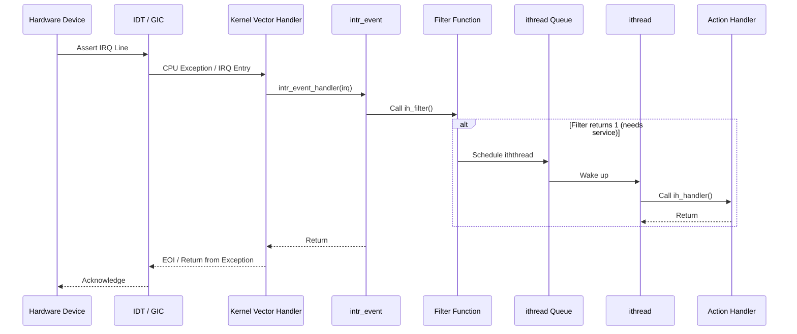

# Interrupt Handling — Threads, Filters, and Dispatch
<!-- This file is auto-generated by generate-doc.py -- do not edit manually -->

---
**Navigation:**
  **Up:** [Kernel Core — Structure and Entry Point](../README.md) ▸ [Source Tree — Layout and Conventions](../../README_internals.md)
  **Related:** [Process Management — Scheduling and Lifecycle](README_process.md) | [Locking Primitives — Mutexes, sx, rmlocks, and Atomics](README_locking.md) | [Device Driver Framework — newbus and devclass](README_driver.md)
  **All chapters:** [Source Tree — Layout and Conventions](../../README_internals.md) | [Boot Process — UEFI Bootloader to Kernel Handoff](../../stand/efi/loader/README.md) | [Kernel Core — Structure and Entry Point](../README.md) | [Build System — buildworld and buildkernel](../../share/mk/README.md) | [Virtual Memory Subsystem — vm_page, UMA, and Pagers](../vm/README.md) | [Process Management — Scheduling and Lifecycle](README_process.md) | [Locking Primitives — Mutexes, sx, rmlocks, and Atomics](README_locking.md) | [Buffer Cache — Block I/O Subsystem](../vm/README_bcache.md) ...
---

> ⚠ **UNVERIFIED DRAFT** — reviewer did not explicitly approve this draft. Treat claims as suspect until manually reviewed.

## Quick Summary
FreeBSD's interrupt handling subsystem bridges the gap between unpredictable hardware signals and deterministic software execution. When a device asserts an interrupt line, the kernel must respond quickly to acknowledge the signal while deferring complex processing to a safer execution context. To achieve this, FreeBSD splits interrupt handling into two phases: a fast, non-blocking filter that runs in interrupt context to check device registers, and a threaded action that runs in a dedicated kernel thread to perform the actual work. This design prevents drivers from blocking the CPU or holding locks for extended periods, which could otherwise starve other interrupts or deadlock the system.

On symmetric multiprocessing (SMP) systems, FreeBSD routes interrupt events to specific CPUs to minimize cross-CPU cache invalidation and improve locality. The framework maintains a list of interrupt events, each associated with a dedicated kernel thread and a set of registered handlers. Drivers register their filter and action functions through the `bus_setup_intr` interface, which binds them to an `intr_event`. The kernel's interrupt dispatcher then executes filters synchronously and schedules the threaded actions asynchronously, ensuring that high-frequency devices do not overwhelm the scheduler.

The architecture separates machine-independent logic from hardware-specific vector handling. Machine-dependent code translates CPU exception vectors or GIC interrupt IDs into a common `intr_event` structure. This abstraction allows the core scheduling logic to remain portable across x86, ARM64, and RISC-V platforms. By decoupling the low-level acknowledgment of hardware signals from high-level driver processing, FreeBSD maintains system stability even under heavy I/O loads.

## Architecture
The core of the interrupt framework resides in `sys/kern/kern_intr.c`, which implements the `intr_event` and `intr_thread` abstractions. During boot, the `sysinit` framework initializes the interrupt subsystem at `SI_SUB_INTR` level, creating the global `event_list` and the `event_lock` mutex that protects handler registration. Machine-dependent code, such as `sys/x86/x86/intr_machdep.c` for x86 architectures and `sys/arm64/arm64/gic_v3.c` for ARM64, provides the low-level vector handlers. On x86, the Interrupt Descriptor Table (IDT) points to assembly stubs that invoke the generic `intr_event_handler`. On ARM64, the Generic Interrupt Controller (GICv3) routes peripheral interrupts through `arm_gic_v3_intr`, which translates hardware IRQ numbers into FreeBSD interrupt sources.

When an interrupt fires, the machine-dependent code looks up the corresponding `intr_event` and calls its dispatcher. The dispatcher iterates over the event's handler list, invoking each registered filter function. If a filter returns a non-zero value indicating the device needs service, the framework marks the event as needing an `ithread` and schedules it via `intr_event_schedule_thread`. The `ithread` runs in process context, allowing it to sleep, acquire locks, and call the driver's action handler without risking interrupt storms or priority inversion.

SMP routing is handled by the `assign_cpu` hook, which binds an `intr_event` to a specific CPU or domain. This binding ensures that the interrupt handler runs on the same CPU that processed the initial filter, preserving cache locality. The `event_lock` serializes modifications to the global event list, while per-event locks protect the handler chains during concurrent registration and removal. This layered locking strategy prevents race conditions when drivers load or unload dynamically.

## Key Data Structures
The interrupt framework relies on three primary structures defined in `sys/sys/interrupt.h` and `sys/kern/kern_intr.c`. The `intr_handler` structure represents a single driver callback:

```c
struct intr_handler {
	driver_filter_t	*ih_filter;	/* Filter handler function. */
	driver_intr_t	*ih_handler;	/* Threaded handler function. */
	void		*ih_argument;	/* Argument to pass to handlers. */
	int		 ih_flags;
	char		 ih_name[MAXCOMLEN + 1]; /* Name of handler. */
	struct intr_event *ih_event;	/* Event we are connected to. */
	int		 ih_need;	/* Needs service. */
	CK_SLIST_ENTRY(intr_handler) ih_next; /* Next handler for this event. */
	u_char		 ih_pri;	/* Priority of this handler. */
};
```

The `ih_next` field uses a custom lock-free single-linked list entry (`CK_SLIST_ENTRY`) to allow safe concurrent iteration during interrupt dispatch. The `ih_need` flag acts as a lightweight signal that the threaded action should run, avoiding the overhead of waking a kernel thread for every single interrupt pulse.

The `intr_thread` structure represents the kernel thread dedicated to servicing a specific interrupt event:

```c
struct intr_thread {
	struct intr_event *it_event;
	struct thread *it_thread;	/* Kernel thread. */
	int	it_flags;		/* (j) IT_* flags. */
	int	it_need;		/* Needs service. */
	int	it_waiting;		/* Waiting in the runq. */
};
```

This structure tracks the state of the `ithread`. The `it_waiting` field indicates whether the thread is currently blocked in the run queue, which prevents the scheduler from attempting to wake it redundantly. The `it_need` field is set by the interrupt dispatcher when a filter requests threaded processing.

## Deep Dive
The registration process begins when a driver calls `bus_setup_intr`. This function looks up or creates an `intr_event` for the given interrupt source. If no event exists, the framework calls `intr_event_create`, which allocates the event structure, initializes its lock, and creates the dedicated `ithread` kernel thread. The driver's filter and action functions are wrapped in an `intr_handler` structure and linked into the event's handler list using `CK_SLIST_INSERT_HEAD`.

During dispatch, the machine-dependent vector handler calls `intr_event_handler`, passing the interrupt vector or IRQ number. The dispatcher acquires the event's lock and iterates through the handler list. For each handler, it calls `ih_filter`. The filter function checks device status registers and returns `0` if nothing requires attention, or `1` if the device needs service. If any filter returns `1`, the framework sets `it_need` on the corresponding `intr_thread` and calls `intr_event_schedule_thread`. This function checks `it_waiting` and only enqueues the thread if it is not already scheduled, effectively coalescing multiple interrupt pulses into a single thread wakeup.

The `ithread` runs as a standard kernel thread with `PRI_MAX` priority. When woken, it calls `ih_handler` (the action function) for each active handler. Because the action runs in process context, it can safely acquire sleep locks, access user memory, or block on I/O without risking system deadlock. After processing, the `ithread` returns to sleep, and the interrupt controller receives an End-Of-Interrupt (EOI) signal via the `post_ithread` hook.

## Flow / Diagram


## Advanced Notes
Debugging interrupt latency requires tracing the transition from filter to action. FreeBSD provides KTR tracing points in the interrupt framework, which allow administrators to measure filter execution time and identify handlers that exceed acceptable thresholds. Performance tuning involves monitoring `hw.intr_storm_threshold`; when a device asserts interrupts faster than the kernel can process them, the framework temporarily disables the interrupt line to prevent CPU starvation. Administrators can adjust this threshold via `sysctl` to balance responsiveness against system stability.

A common pitfall is writing blocking code inside a filter function. Filters execute with interrupts disabled on the current CPU and cannot sleep or acquire sleep locks. Violating this rule triggers a `PANIC` with a `sleeping function called` error. Another frequent issue is cache coherency when sharing data between filter and action contexts. Since the filter runs in interrupt context and the action runs in thread context, explicit atomic operations or memory barriers are required to prevent stale reads. The `IH_MPSAFE` flag indicates that a handler does not require the legacy Giant lock, which is essential for SMP scalability.

## Comparison
Linux implements interrupt handling using `struct irqaction` and threaded IRQs (`irq_thread`). Unlike FreeBSD's `ithread` framework, which uses a dedicated kernel thread per event, Linux often shares a single `ksoftirqd` or `threadirq` across multiple events to reduce thread overhead. FreeBSD's approach provides stronger isolation per device, simplifying debugging and priority management at the cost of higher context-switch overhead on heavily interrupting systems. Linux also relies more heavily on `softirq` and `tasklet` mechanisms for deferred processing, whereas FreeBSD delegates almost all deferred work to the `ithread` scheduler.

NetBSD and OpenBSD use a similar filter/action split but implement deferred processing differently. NetBSD relies on `softint()` for software interrupts, while OpenBSD uses `spl()` masks with its own soft interrupt queues, rather than a unified `intr_thread` scheduler. Their interrupt handling priorities interact with their respective scheduler mechanisms—NetBSD employs turnstile-based priority inheritance, whereas OpenBSD uses `spl`-based priority masking. Unlike FreeBSD's dedicated `ithread` per event, both systems share deferred processing resources across multiple interrupt sources. macOS/XNU abstracts interrupts through the I/O Kit's `IOInterruptEventSource`, which bridges hardware vectors to Objective-C dispatch queues, sacrificing low-level kernel visibility for user-space driver integration.

## See Also
- [Device Driver Framework — newbus and devclass](README_driver.md)
- [Process Management — Scheduling and Lifecycle](README_process.md)
- [Locking Primitives — Mutexes, sx, rmlocks, and Atomics](README_locking.md)

- Source directories: `sys/kern/`, `sys/x86/x86/`, `sys/arm64/arm64/`

---

> _Generated by [DaemonDocs](https://github.com/ocochard/DaemonDocs) on 2026-05-01 03:47 UTC using model `Qwen3.6-35B-A3B-UD-Q4_K_XL` (llama.cpp build `b8985-27aef3dd9`). AI-generated content — verify against source before relying on it._
