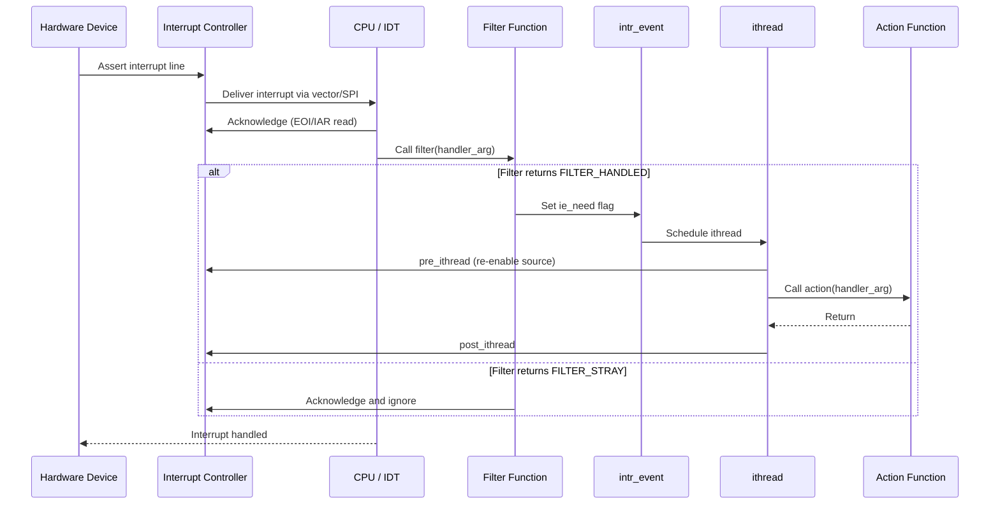

# Interrupt Handling — Threads, Filters, and Dispatch
<!-- This file is auto-generated by generate-doc.py -- do not edit manually -->

---
**Navigation:**
  **Related:** [Process Management — Scheduling and Lifecycle](README_process.md) | [Locking Primitives — Mutexes, sx, rmlocks, and Atomics](README_locking.md) | [Device Driver Framework — newbus and devclass](README_driver.md)
  **All chapters:** [Source Tree — Layout and Conventions](../../README_internals.md) | [Boot Process — UEFI Bootloader to Kernel Handoff](../../stand/efi/loader/README.md) | [Kernel Core — Structure and Entry Point](../README.md) | [Build System — buildworld and buildkernel](../../share/mk/README.md) | [Virtual Memory Subsystem — vm_page, UMA, and Pagers](../vm/README.md) | [Process Management — Scheduling and Lifecycle](README_process.md) | [Locking Primitives — Mutexes, sx, rmlocks, and Atomics](README_locking.md) | [Buffer Cache — Block I/O Subsystem](../vm/README_bcache.md) ...
---


## Quick Summary

When a hardware device needs the CPU's attention, it asserts an interrupt line that the interrupt controller routes to one or more processors. FreeBSD's interrupt framework turns this hardware event into a structured sequence of function calls, split between a fast path that runs with interrupts disabled and a slow path that runs as a normal kernel thread with interrupts re-enabled. This split — the filter/action model — ensures that device drivers can quickly acknowledge and clear the hardware while deferring expensive processing to a context where blocking, sleeping, and locking are safe.

The framework is built around three concepts: interrupt sources (`intr_irqsrc`), interrupt events (`intr_event`), and interrupt handlers (`intr_handler`). An interrupt source represents a physical or virtual interrupt line — a GIC SPI on ARM, an I/O APIC pin on x86, or an MSI message. An interrupt event groups all handlers that share the same source. Each handler installs a filter function (which runs immediately and decides whether the device actually needs attention) and an action function (which runs later in a dedicated kernel thread, called an ithread).

In a multiprocessor system, FreeBSD balances interrupt load across CPUs. The PIC (Programmable Interrupt Controller) layer — implemented per-architecture as I/O APIC on x86 or GIC on ARM — determines which CPU receives the interrupt. The `intrbalance` sysctl controls automatic re-balancing. On ARM64, the GIC distributes interrupts via its redistributors and supports Large Physical Interrupts (LPIs) through the ITS (Interrupt Translation Service), where affinities are programmed into tables rather than pinned to fixed CPUs. The result is a unified model where device drivers call `bus_setup_intr()` to register handlers, and the kernel transparently manages the fast/slow split, CPU affinity, and interrupt storm protection.

## Architecture

FreeBSD's interrupt handling spans three layers: the hardware-specific PIC, the common interrupt dispatch framework, and the driver-facing registration API. The PIC layer (`sys/sys/intr.h` `struct intr_pic`) provides methods for enabling, disabling, mapping, and acknowledging interrupts. On x86, `sys/x86/x86/intr_machdep.c` implements this through multiple PICs — the legacy 8259A PIC, the I/O APIC, and MSI — each registered with the interrupt framework. On ARM64, `sys/arm64/arm64/gic_v3.c` implements the PIC interface for the GICv3, with methods like `gic_v3_disable_intr`, `gic_v3_enable_intr`, `gic_v3_map_intr`, and `gic_v3_setup_intr`.

The common framework lives in `sys/kern/kern_intr.c`. It maintains a global list of interrupt events (`event_list`) protected by `event_lock`. When an interrupt fires, the PIC's dispatch routine calls `intr_isrc_dispatch()` on the corresponding `intr_irqsrc`, which in turn invokes the filter chain. If a filter returns `FILTER_STRAY`, the interrupt is acknowledged and the action is deferred. If a filter returns `FILTER_HANDLED`, the action thread is scheduled via `intr_event_schedule_thread()`. The action runs in an ithread — a kernel thread created per event — which executes all registered action handlers.

The driver API is in `sys/x86/include/bus.h` and `sys/arm/include/intr.h`. Drivers call `bus_setup_intr()` to register a filter and action. The BUS layer translates this into calls to `intr_isrc_register()` and `intr_pic_add_handler()`. The framework supports multiple handlers per event, chained via `ih_next` in `struct intr_handler`. The `ih_flags` field includes `IH_NET` for network interrupts (which get special scheduling treatment), `IH_EXCLUSIVE` for handlers that should not share the event, and `IH_MPSAFE` for handlers that do not require the Giant lock.

SMP support is built into every layer. On x86, the I/O APIC routes interrupts to CPUs via destination mode (logical or physical). The `intrbalance` sysctl (in `sys/x86/x86/intr_machdep.c`) triggers periodic rebalancing of interrupt affinities. On ARM64, the GIC redistributors associate each CPU with a range of interrupts, and the GICv3 ITS supports LPIs where affinities are dynamically programmed. The `sgi_to_ipi` array in `gic_v3.c` maps Software Generated Interrupts (SGIs) to IPI handlers.

## Key Data Structures

The interrupt source definition (`sys/sys/intr.h`):

```c
struct intr_irqsrc {
	device_t		isrc_dev;	/* where isrc is mapped */
	u_int			isrc_irq;	/* unique identificator */
	u_int			isrc_flags;
	char			isrc_name[INTR_ISRC_NAMELEN];
	cpuset_t		isrc_cpu;	/* on which CPUs is enabled */
	u_int			isrc_index;
	u_long *		isrc_count;
	u_int			isrc_handlers;
	struct intr_event *	isrc_event;
#ifdef INTR_SOLO
	intr_irq_filter_t *	isrc_filter;
	void *			isrc_arg;
#endif
	/* Used by MSI interrupts to store the iommu details */
	void *			isrc_iommu;
};
```

The interrupt handler (`sys/sys/interrupt.h`):

```c
struct intr_handler {
	driver_filter_t	*ih_filter;	/* Filter handler function. */
	driver_intr_t	*ih_handler;	/* Threaded handler function. */
	void		*ih_argument;	/* Argument to pass to handlers. */
	int		 ih_flags;
	char		 ih_name[MAXCOMLEN + 1]; /* Name of handler. */
	struct intr_event *ih_event;	/* Event we are connected to. */
	int		 ih_need;	/* Needs service. */
	CK_SLIST_ENTRY(intr_handler) ih_next; /* Next handler for this event. */
	u_char		 ih_pri;	/* Priority of this handler. */
};
```

The interrupt event (`sys/sys/interrupt.h`):

```c
struct intr_event {
	TAILQ_HEAD(, intr_handler) ie_handlers;
	struct mtx	ie_lock;
	char		 ie_name[MAXCOMLEN + 1];
	struct intr_thread *ie_thread;
	int		 ie_flags;
	int		 ie_need;
	int		 ie_count;
	int		 ie_stray;
	/* MD hooks */
	int		 (*ie_pre_ithread)(void *arg);
	void		 (*ie_post_ithread)(void *arg);
	int		 (*ie_post_filter)(void *arg);
	int		 (*ie_assign_cpu)(void *arg, int cpu);
};
```

The interrupt thread (`sys/kern/kern_intr.c`):

```c
struct intr_thread {
	struct intr_event *it_event;
	struct thread *it_thread;	/* Kernel thread. */
	int	it_flags;		/* (j) IT_* flags. */
	int	it_need;		/* Needs service. */
	int	it_waiting;		/* Waiting in the runq. */
};
```

The x86 interrupt source (`sys/x86/include/intr_machdep.h`):

```c
struct intsrc {
	struct pic		*is_pic;
	struct intr_event	*is_event;
	u_long			*is_count;
	u_long			*is_straycount;
	int			 is_index;
	int			 is_handlers;
	int			 is_domain;
	int			 is_cpu;
};
```

The I/O APIC source (`sys/x86/x86/io_apic.c`):

```c
struct ioapic_intsrc {
	struct intsrc		io_intsrc;
	int			io_irq;
	u8			io_intpin:8;
	u8			io_vector:8;
	int			io_cpu;
	u8			io_activehi:1;
	u8			io_edgetrigger:1;
	u8			io_masked:1;
	u8			io_valid:1;
	u8			io_bus:4;
};
```

The GICv3 softc (`sys/arm64/arm64/gic_v3_var.h`):

```c
struct gic_v3_softc {
	/* ... GICv3 register base, redistributor info ... */
};
```

## Deep Dive

### Registration Flow

When a driver probes and attaches, it calls `bus_setup_intr()` to register an interrupt handler. This function, defined in the BUS layer, takes the device, resource, flags, filter function, action function, argument, and lock. The BUS layer translates this into:

1. **Lookup or create the `intr_irqsrc`**: If the resource has an associated `intr_irqsrc` (from FDT or ACPI parsing), it is reused. Otherwise, a new source is created.

2. **Create or link the `intr_event`**: The `intr_event` is created if it does not exist for this source. The event holds the list of `intr_handler` entries and the ithread.

3. **Register the handler**: `intr_handler` is allocated and linked into `ie_handlers` via `ih_next`. The filter and action pointers are stored along with the argument.

4. **PIC-level setup**: The PIC's `map_intr` method is called to translate the logical interrupt number into a hardware-specific representation. On x86, this involves selecting an I/O APIC pin and vector. On ARM64, the GICv3 PIC interface's `map_intr` method programs the GIC with the SPI number and attributes.

### Dispatch Path

When hardware asserts an interrupt, the following sequence occurs on x86:

1. **IDT entry**: The CPU jumps to the IDT entry for the interrupt vector. This is assembly stub code in `sys/x86/x86/locore.S` that saves the trap frame and calls the interrupt dispatch framework.

2. **Vector lookup**: `intr_machdep.c` maintains an array `interrupt_sources[]` indexed by vector. The stub looks up the `intsrc` for this vector.

3. **PIC pre_ithread**: If this is a level-triggered interrupt, `pre_ithread` disables further interrupts from this source to prevent storms. On x86, this masks the I/O APIC pin.

4. **Filter chain**: Each handler's filter is called in priority order. The filter receives the interrupt argument and decides whether the device actually needs attention. Filters return `FILTER_HANDLED`, `FILTER_STRAY`, `FILTER_NONE`, or `FILTER_RUN`.

5. **Action scheduling**: If any filter returns `FILTER_HANDLED`, the ithread is scheduled. The `ie_need` flag is set and `intr_event_schedule_thread()` wakes the ithread.

6. **ithread execution**: The ithread, a kernel thread created per event, runs with interrupts enabled. It calls `pre_ithread` (which on x86 acknowledges the interrupt via EOI), then iterates all handlers calling their action functions. After all actions complete, `post_ithread` re-enables the interrupt source.

On ARM64 with GICv3, the flow differs at the hardware level:

1. **GIC dispatch**: The GICv3 delivers the interrupt to the appropriate redistributor, which forwards it to the CPU interface. The CPU enters EL1 exception mode.

2. **GIC acknowledgment**: The GICv3 entry code in `sys/arm64/arm64/locore.S` reads the IAR register to identify the interrupt, then calls the dispatch framework.

3. **LPI handling**: For Large Physical Interrupts, the GICv3 ITS has already translated the message to an SPI and programmed the affinity. The redistributor delivers directly to the target CPU.

4. **Filter/action**: Same as x86 — filters run with interrupts disabled on that CPU, actions run in the ithread.

### SMP Interrupt Routing

FreeBSD supports interrupt balancing on SMP systems. On x86, the `intrbalance` sysctl (in `sys/x86/x86/intr_machdep.c`) sets a timer that periodically scans interrupt sources and reassigns them to less-loaded CPUs. The `assign_cpu` hook in `intr_event` is called to select the new CPU, and the PIC is updated accordingly.

On ARM64, the GIC redistributors naturally distribute interrupts across CPUs. The `sgi_to_ipi` array maps SGIs to IPI handlers. The GICv3 ITS supports dynamic affinity changes for LPIs by updating the LPI configuration table.

### Interrupt Storm Protection

FreeBSD monitors interrupt rates and can throttle storms. The `intr_storm_threshold` sysctl (in `sys/kern/kern_intr.c`) sets the number of consecutive interrupts before protection engages. When triggered, the framework reduces the rate at which ithreads are scheduled, preventing a single device from monopolizing a CPU.

The `intr_epoch_batch` sysctl limits the number of handler executions before re-entering `epoch_enter()`/`epoch_exit()`, ensuring that network and other time-sensitive work gets scheduled promptly.

## Flow / Diagram



## Advanced Notes

### Debugging with DTrace

FreeBSD's DTrace provides probes for interrupt activity. The `intr:::dispatch` probe fires when an interrupt event is dispatched. The `intr:::filter` and `intr:::action` probes fire at each handler invocation. To trace network interrupts:

```
dtrace -n 'intr:::action { printf("%s: %d", execname, arg0); }'
```

The `intrcnt` array tracks interrupt counts per source. Access via `sysctl hw.intrcnt` or in DTrace via the `intrnames` variable.

### Performance Implications

The filter/action split has significant performance implications. Filters run with interrupts disabled on the local CPU, so they must be fast — typically just checking a device register and returning. Actions run in the ithread context and can sleep, lock, and block. Network drivers often set `IH_NET` to give their ithreads higher scheduling priority.

On high-throughput systems, interrupt coalescing (deferring the interrupt to batch multiple packets) reduces interrupt rate at the cost of latency. FreeBSD's `dev.icx.coal_usecs` and similar tunables control this behavior.

### Race Conditions

The `event_lock` protects the `ie_handlers` list during registration and unregistration. However, filters can run concurrently with registration on SMP systems — the `ih_need` flag and `CK_SLIST` operations are designed to be lock-free for the fast path. The `IH_CHANGED` flag indicates that handler state has been modified and the list may need rebuilding.

When tearing down an interrupt, the framework sets `IH_DEAD` on each handler before removing it from the list. The filter checks this flag and returns `FILTER_STRAY` for dead handlers, preventing use-after-free.

### Pitfalls

1. **Sleeping in a filter**: Filters run with interrupts disabled. Sleeping, locking with sleepable locks, or calling functions that may block will panic the system.

2. **Long-running actions**: Actions run in the ithread context. If an action takes too long, the iththread blocks other interrupts on that CPU. Use `taskqueue` or kernel threads to defer work.

3. **Interrupt affinity changes**: Changing CPU affinity requires updating both the `isrc_cpu` mask and the PIC configuration. On x86, this means reprogramming the I/O APIC routing table. On ARM64, it means updating the GIC redistributor configuration or LPI affinity table.

4. **MSI/MSI-X vectors**: Each MSI/MSI-X vector is a separate interrupt source. Misconfiguring the vector count can leave devices non-functional. The `msi.c` driver on x86 handles vector allocation and the `gicv3_its.c` driver on ARM64 handles ITS table management.

## Comparison

### Linux

Linux uses a different model called "top half / bottom half". The top half runs in interrupt context (with interrupts disabled or masked), and the bottom half runs in softirq or tasklet context. Unlike FreeBSD's dedicated ithread per event, Linux reuses a pool of softirq contexts. Linux's `struct irq_desc` is analogous to FreeBSD's `intr_event`, but the handler registration API (`request_irq`) does not separate filter and action — the driver must manually split work if desired. Linux's `irq_domain` framework is similar to FreeBSD's PIC layer but uses a hierarchical domain tree rather than a flat PIC list.

### macOS/XNU

XNU uses the IOKit framework with `IOInterruptSource` objects. Interrupts are handled by "interrupt handlers" that can be configured as fast or slow. XNU's interrupt threading model is less explicit — the kernel decides whether to defer work based on heuristics rather than a strict filter/action split. The GIC support in XNU (for Apple Silicon) follows similar principles but uses a platform-specific device tree implementation.

### NetBSD/OpenBSD

NetBSD and OpenBSD use a model closer to FreeBSD's, with `intr_event` and `intr_handler` structures. However, NetBSD's filter/action split is implemented differently — filters are called in interrupt context and can return a value to control scheduling, but the ithread model is less prominent. OpenBSD emphasizes security and uses strict interrupt isolation, with some platforms supporting per-CPU interrupt domains.

## See Also
- [Device Driver Framework — newbus and devclass](../../../sys/kern/README_driver.md)
- [Process Management — Scheduling and Lifecycle](../../../sys/kern/README_process.md)
- [Locking Primitives — Mutexes, sx, rmlocks, and Atomics](../../../sys/kern/README_locking.md)


- `sys/kern/kern_intr.c` — Main interrupt dispatch framework
- `sys/x86/x86/intr_machdep.c` — x86 machine-dependent interrupt code
- `sys/x86/x86/io_apic.c` — I/O APIC driver
- `sys/x86/x86/msi.c` — MSI interrupt support
- `sys/arm64/arm64/gic_v3.c` — GICv3 interrupt controller driver
- `sys/arm64/arm64/gicv3_its.c` — GICv3 Interrupt Translation Service
- `sys/sys/intr.h` — Primary interrupt framework header
- `sys/sys/interrupt.h` — Legacy ithread framework header
- `dev/fdt/fdt_intr.c` — FDT interrupt parsing
- `dev/acpica/acpi_intr.c` — ACPI interrupt parsing

---

> _Generated by [DaemonDocs](https://github.com/ocochard/DaemonDocs) on 2026-04-30 01:36 UTC using model `Qwen3.6-35B-A3B-UD-Q4_K_XL` (llama.cpp build `b8961-f42e29fdf`). AI-generated content — verify against source before relying on it._
