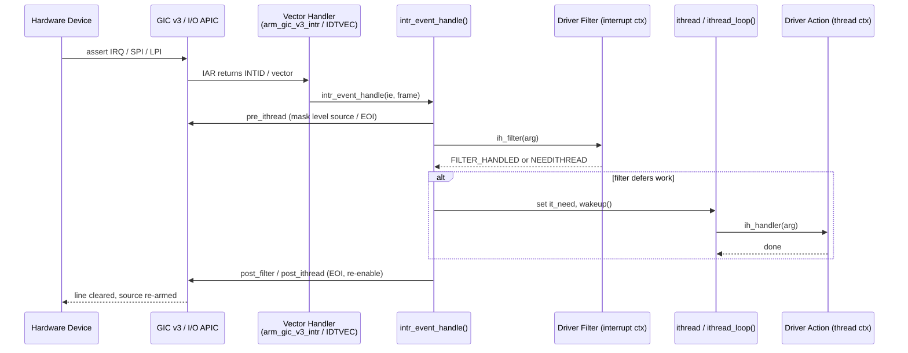

# Interrupt Handling — Threads, Filters, and Dispatch
<!-- This file is auto-generated by generate-doc.py -- do not edit manually -->

---
**Navigation:**
  **Up:** [Kernel Core — Structure and Entry Point](../README.md) ▸ [Source Tree — Layout and Conventions](../../README_internals.md)
  **Related:** [Process Management — Scheduling and Lifecycle](README_process.md) | [Locking Primitives — Mutexes, sx, rmlocks, and Atomics](README_locking.md) | [Device Driver Framework — newbus and devclass](README_driver.md)
  **All chapters:** [Source Tree — Layout and Conventions](../../README_internals.md) | [Boot Process — UEFI Bootloader to Kernel Handoff](../../stand/efi/loader/README.md) | [Kernel Core — Structure and Entry Point](../README.md) | [Build System — buildworld and buildkernel](../../share/mk/README.md) | [System Calls and Image Activation — Entry, sysent, and exec](README_syscall.md) | [Kernel Modules and the Linker — KLD, SYSINIT, and linker sets](README_kld.md) | [Virtual Memory Subsystem — vm_page, UMA, and Pagers](../vm/README.md) | [Process Management — Scheduling and Lifecycle](README_process.md) ...
---


## Quick Summary

An interrupt is the hardware's way of interrupting the CPU to say "something finished" or "something needs attention." Because a CPU is orders of magnitude faster than the devices it drives, the kernel cannot afford to sit in a loop polling each device. Instead, the device raises a signal, the interrupt controller routes it to a CPU, and that CPU jumps into a small piece of kernel code. The operating-system textbooks frame this around three hardware requirements: a way to defer handling during critical sections, a fast dispatch to the right handler without polling every device, and a priority mechanism so urgent work preempts non-urgent work. FreeBSD meets all three, but it adds a layer on top that the textbook diagram hides: the split between a *filter* that runs in raw interrupt context and an *action* (the "ithread") that runs in a normal kernel [thread](README_process.md#glossary).

The reason for that split is an engineering trade-off. Acknowledging an interrupt — reading a status register, clearing a bit, re-enabling the line — must happen quickly and cannot sleep, so it runs in a tight filter function. But the actual work, such as walking a network receive ring or copying a block of disk data, is slow and may need to sleep on memory or locks. If that slow work ran in interrupt context it would hold the interrupt line closed and starve every other device. FreeBSD therefore defers the slow part to a dedicated kernel thread, one per interrupt source, that sleeps until the filter wakes it. The filter does the few-microsecond critical part; the thread does everything else.

The glue is the `struct intr_event` framework in `sys/kern/kern_intr.c`. Each hardware or software interrupt source is represented by one `struct intr_event`, which owns an ordered list of `struct intr_handler` records (each pairing a filter and an action) plus a small set of machine-dependent hooks. Those hooks — `pre_ithread`, `post_ithread`, `post_filter`, and `assign_cpu` — let the same machine-independent dispatch code talk to a legacy 8259 PIC, an I/O APIC (Advanced Programmable Interrupt Controller, in its I/O form; each CPU also has a local APIC), an MSI (Message-Signaled Interrupt), or an ARM GIC without knowing the details of any of them. The controller-specific driver fills in the hooks; the framework calls them at the right moments.

On a multi-processor machine the framework also decides *which* CPU handles an interrupt. The `assign_cpu` [hook](../netgraph/README.md#glossary), combined with per-source CPU assignment and an optional auto-balancer, lets FreeBSD pin a device's interrupts to one core for cache locality, spread them across cores for throughput, or migrate them when load shifts. The result is a single, portable interrupt model: hardware raises a line, the controller delivers a vector or INTID, `intr_event_handle` runs the filters, and — only when the filter asks for it — a kernel thread picks up the heavy lifting.

## Architecture

The machine-independent core lives in `sys/kern/kern_intr.c`, with the public API declared in `sys/sys/interrupt.h` and documented in [`intr_event(9)`](../../share/man/man9/intr_event.9). The machine-dependent half is split per architecture: `sys/x86/x86/intr_machdep.c` (with the `struct pic` and `struct intsrc` types in `sys/x86/include/intr_machdep.h`) for x86, and `sys/arm64/arm64/gic_v3.c` (with `sys/arm64/include/intr.h`) for ARM64. The two meet at exactly one boundary: a controller driver implements a small set of `pic_*` methods and the four `struct intr_event` hooks, and the framework in `kern_intr.c` drives them.

**x86 path.** The CPU's IDT (Interrupt Descriptor Table) holds one entry per interrupt vector. The first 16 ISA IRQs get fixed vectors; every other device interrupt — I/O APIC pins, MSI, MSI-X — allocates an IDT vector on demand. The header comment in `sys/x86/include/intr_machdep.h` documents the layout:

```c
/*
 * The first 16 IRQs (0 - 15) are reserved for ISA IRQs.  Interrupt
 * pins on I/O APICs for non-ISA interrupts use IRQ values starting at
 * IRQ 17.  This layout matches the GSI numbering used by ACPI so that
 * IRQ values returned by ACPI methods such as _CRS can be used
 * directly by the ACPI bus driver.
 *
 * MSI interrupts allocate a block of interrupts starting at the end
 * of the I/O APIC range.
 */
```

When a vector fires, the assembly entry builds a `struct trapframe`, looks up the `struct intsrc` for that vector via `intr_lookup_source()` (in `sys/x86/x86/intr_machdep.c`), and calls `intr_event_handle()` on the associated event. The `intsrc` knows which `struct pic` owns it, so the EOI (End of Interrupt) and enable/disable operations dispatch to the right controller — 8259, I/O APIC, or MSI.

**ARM64 path.** ARM64 uses the GIC (Generic Interrupt Controller). The vector handler `arm_gic_v3_intr()` (in `sys/arm64/arm64/gic_v3.c`) reads the GIC's IAR (interrupt acknowledge register) to learn the INTID (Interrupt ID), maps that INTID to a `struct gic_v3_irqsrc`, and calls `intr_event_handle()`. The GIC v3 driver registers the same four hooks as x86: `gic_v3_pre_ithread`, `gic_v3_post_ithread`, `gic_v3_post_filter`, and a CPU-assignment hook. `sys/arm64/include/intr.h` defines the interrupt space: `NIRQ` (16384) and the two root vectors `INTR_ROOT_IRQ` (0) and `INTR_ROOT_FIQ` (1). For newer GICv5 and for LPIs (locality-specific peripheral interrupts, the GIC's answer to MSI), the ITS (interrupt translation service) driver `sys/arm64/arm64/gicv3_its.c` builds command queues and translation tables so a device can target a specific CPU directly.

**The registration path.** A driver never touches the IDT or the GIC directly. It calls `bus_setup_intr()` (declared in `sys/sys/bus.h`, documented in `bus_setup_intr(9)`):

```c
int
bus_setup_intr(device_t dev, struct resource *r, int flags,
    driver_filter_t filter, driver_intr_t ithread, void *arg,
    void **cookiep);
```

The bus method routes that to the controller's `pic_setup_intr`, which calls `intr_event_create()` to allocate the event (if not already present) and `intr_event_add_handler()` to append the filter/action pair. `bus_teardown_intr()` removes the handler and, when the last handler leaves, destroys the event.

## Key Data Structures

The handler record is the unit a driver registers. It is defined in `sys/sys/interrupt.h`:

```c
/*
 * Describe a hardware interrupt handler.
 *
 * Multiple interrupt handlers for a specific event can be chained
 * together.
 */
struct intr_handler {
	driver_filter_t	*ih_filter;	/* Filter handler function. */
	driver_intr_t	*ih_handler;	/* Threaded handler function. */
	void		*ih_argument;	/* Argument to pass to handlers. */
	int		 ih_flags;
	char		 ih_name[MAXCOMLEN + 1]; /* Name of handler. */
	struct intr_event *ih_event;	/* Event we are connected to. */
	int		 ih_need;	/* Needs service. */
	CK_SLIST_ENTRY(intr_handler) ih_next; /* Next handler for this event. */
	u_char		 ih_pri;	/* Priority of this handler. */
};
```

Both `ih_filter` and `ih_handler` are optional; a handler may supply either or both. The handler list is a `CK_SLIST` (a lock-free singly-linked list from `sys/ck.h`) ordered by `ih_pri`, so the highest-priority filter runs first. The flags are:

```c
#define	IH_NET		0x00000001	/* Network. */
#define	IH_EXCLUSIVE	0x00000002	/* Exclusive interrupt. */
#define	IH_ENTROPY	0x00000004	/* Device is a good entropy source. */
#define	IH_DEAD		0x00000008	/* Handler should be removed. */
#define	IH_SUSP		0x00000010	/* Device is powered down. */
#define	IH_CHANGED	0x40000000	/* Handler state is changed. */
#define	IH_MPSAFE	0x80000000	/* Handler does not need Giant. */
```

`IH_MPSAFE` matters on SMP (Symmetric Multi-Processing): a handler that is not marked `IH_MPSAFE` runs with the [Giant](README_locking.md#glossary) lock held — Giant is FreeBSD's coarse kernel-wide lock, held to protect code not yet made SMP-safe — which serializes it against a large part of the kernel. Marking a handler `IH_MPSAFE` (the default for most new drivers) lets it run without Giant.

The interrupt thread is the kernel thread that runs the slow action. There is one per event, defined at the top of `sys/kern/kern_intr.c`:

```c
/*
 * Describe an interrupt thread.  There is one of these per interrupt event.
 */
struct intr_thread {
	struct intr_event *it_event;
	struct thread *it_thread;	/* Kernel thread. */
	int	it_flags;		/* (j) IT_* flags. */
	int	it_need;		/* Needs service. */
	int	it_waiting;		/* Waiting in the runq. */
};

/* Interrupt thread flags kept in it_flags */
#define	IT_DEAD		0x000001	/* Thread is waiting to exit. */
#define	IT_WAIT		0x000002	/* Thread is waiting for completion. */
```

The `it_need` and `it_waiting` pair is the coalescing mechanism: when a filter finds work, it sets `it_need` and wakes the thread; if the thread is already running, a second interrupt just leaves `it_need` set, so the thread drains the backlog on its next pass rather than spawning a second thread.

The event itself is the per-source container. Its full definition sits in `sys/sys/interrupt.h`, behind a long comment that documents the machine-dependent hooks. A level-triggered source stays asserted as long as the device's status bit is set, so it will re-fire until the filter clears that bit — unlike an edge-triggered source that fires once per transition. That comment is the contract the controller drivers implement:

```c
/*
 * Describe an interrupt event.  An event holds a list of handlers.
 * The 'pre_ithread', 'post_ithread', 'post_filter', and 'assign_cpu'
 * hooks are used to invoke MD code for certain operations.
 *
 * The 'pre_ithread' hook is called when an interrupt thread for
 * handlers without filters is scheduled.  It is responsible for
 * ensuring that 1) the system won't be swamped with an interrupt
 * storm from the associated source while the ithread runs and 2) the
 * current CPU is able to receive interrupts from other interrupt
 * sources.  The first is usually accomplished by disabling
 * level-triggered interrupts until the ithread completes.  The second
 * is accomplished on some platforms by acknowledging the interrupt
 * via an EOI.
 *
 * The 'post_ithread' hook is invoked when an ithread finishes.  It is
 * responsible for ensuring that the associated interrupt source will
 * trigger an interrupt when it is asserted in the future.  Usually
 * this is implemented by enabling a level-triggered interrupt that
 * was previously disabled via the 'pre_ithread' hook.
 *
 * The 'post_filter' hook is invoked when a filter handles an
 * interrupt.  It is responsible for ensuring that the current CPU is
 * able to receive interrupts again.  On some platforms this is done
 * by acknowledging the interrupts via an EOI.
 */
```

The event's fields (per the header and the `intr_event_create()` signature) include the handler list head `ie_list`, the event lock `ie_lock`, the machine-dependent source pointer, the IRQ number, a priority, the thread count, and the four hook function pointers. The four hooks are the entire surface the controller must implement: `pre_ithread` (disable level-triggered source / EOI before the thread runs), `post_ithread` (re-enable it after), `post_filter` (EOI after a filter-only interrupt), and `assign_cpu` (pick the CPU that will own the source).

On x86 the controller side is described by `struct pic` in `sys/x86/include/intr_machdep.h`, a table of function pointers the framework calls:

```c
struct pic {
	void (*pic_register_sources)(struct pic *);
	void (*pic_enable_source)(struct intsrc *);
	void (*pic_disable_source)(struct intsrc *, int);
	void (*pic_eoi_source)(struct intsrc *);
	void (*pic_enable_intr)(struct intsrc *);
	void (*pic_disable_intr)(struct intsrc *);
	int (*pic_vector)(struct intsrc *);
	int (*pic_source_pending)(struct intsrc *);
	void (*pic_suspend)(struct pic *);
	void (*pic_resume)(struct pic *, bool suspend_cancelled);
	int (*pic_config_intr)(struct intsrc *, enum intr_trigger,
	    enum intr_polarity);
	int (*pic_assign_cpu)(struct intsrc *, u_int apic_id);
	void (*pic_reprogram_pin)(struct intsrc *);
	TAILQ_ENTRY(pic) pics;
};
```

Each concrete controller — the 8259 (`atpic`), the I/O APIC (`io_apic.c`), and MSI (`msi.c`) — fills in one of these. The `pic_assign_cpu` method is what makes x86 SMP routing possible: it programs the I/O APIC redirection entry (or the MSI message) so the source targets a specific APIC ID.

## Deep Dive

**Registration.** When a driver's `attach` routine calls `bus_setup_intr()`, the bus dispatches to the controller's `pic_setup_intr`. That function calls `intr_event_create()` to obtain the event for the IRQ (creating it the first time) and then `intr_event_add_handler()` to append the filter/action pair. The signatures, from [`intr_event(9)`](../../share/man/man9/intr_event.9), are:

```c
int
intr_event_create(struct intr_event **event, void *source, int flags,
    int irq, void (*pre_ithread)(void *), void (*post_ithread)(void *),
    void (*post_filter)(void *), int (*assign_cpu)(void *, int),
    const char *fmt, ...);

int
intr_event_add_handler(struct intr_event *ie, const char *name,
    driver_filter_t filter, driver_intr_t handler, void *arg, u_char pri,
    enum intr_type flags, void **cookiep);
```

`intr_event_create()` stores the source pointer, the IRQ, and the four hooks, and inserts the new event into a global `event_list` protected by `event_lock`. `intr_event_add_handler()` allocates a `struct intr_handler`, copies in the filter, action, argument, priority, and flags, and splices it into the event's `CK_SLIST` in priority order. If the handler supplies an action (and the event has no thread yet), a kernel thread is created and parked in `ithread_loop()`. The `cookiep` out-parameter returns an opaque handle the driver later passes to `intr_event_remove_handler()`.

**Dispatch.** When the hardware fires, the architecture entry (`arm_gic_v3_intr()` on ARM64, the IDT vector stub on x86) resolves the source to an event and calls:

```c
int
intr_event_handle(struct intr_event *ie, struct trapframe *frame);
```

`intr_event_handle()` walks the event's handler list. For each handler that has a filter, it calls the handler's filter (`ih->ih_filter(ih->ih_argument)`) in the current (interrupt) context. The filter's return value decides what happens next: a filter that fully handled the interrupt (returning `FILTER_HANDLED`, defined as `0x02` in `sys/sys/bus.h`) means no thread is needed for that handler; a filter that found work to defer wakes the event's ithread. Because the list is a `CK_SLIST`, the walk is lock-free and safe even while another CPU is adding or removing a handler — removal is done by marking the handler `IH_DEAD` and letting the next dispatch skip it.

**The ithread.** The kernel thread created for an event spins in `ithread_loop()` (in `sys/kern/kern_intr.c`). It sleeps on the event until a filter sets `it_need` and calls `wakeup()`. When woken, it runs each handler's action (`ih->ih_handler(ih->ih_argument)`) in normal thread context — where it may take sleep mutexes, allocate memory, and block. A recent change (visible in the git history of `kern_intr.c`) allows some ithreads to be marked sleepable, which matters for handlers that must hold a sleep mutex, for example when calling ACPI methods. When the loop finds no more work, it clears `it_need` and sleeps again.

**The MD hooks in action.** Consider a level-triggered interrupt on x86. Before the ithread runs, `intr_event_handle()` invokes the `pre_ithread` hook, which masks the source in the I/O APIC so the level line cannot re-fire while the thread is busy (an interrupt storm would otherwise keep the line asserted). After the thread finishes, `post_ithread` re-enables the source. For a filter-only (fast) interrupt, `post_filter` issues the EOI so the CPU can accept the next interrupt. On ARM64 the GIC v3 driver implements the same three hooks with GIC register writes: `gic_v3_pre_ithread`, `gic_v3_post_ithread`, and `gic_v3_post_filter` program the GIC's priority and EOI registers for the current CPU's redistributor.

**SMP routing.** The `assign_cpu` hook is called when the framework needs to choose a CPU for a source. On x86, `intr_assign_cpu()` (in `sys/x86/x86/intr_machdep.c`) calls the controller's `pic_assign_cpu`, which programs the I/O APIC redirection entry or the MSI message to target the chosen APIC ID. The `hw.intrbalance` sysctl (default 0, disabled) controls an auto-balancer that periodically migrates sources across CPUs to even out load; when nonzero it is the reprogram interval in seconds. On ARM64 the GIC v3 driver exposes `gic_v3_ipi_send()` and `gic_v3_ipi_setup()` for inter-processor interrupts, mapping SGIs (software-generated interrupts) to IPIs so one CPU can signal another.

## Flow / Diagram



## Advanced Notes

**Debugging.** The kernel exposes two [DDB](README_kdb.md#glossary) (the kernel debugger) commands for live inspection: `db_dump_intr_event` and `db_dump_intrhand` (both in `sys/kern/kern_intr.c`). In DDB, dumping a `struct intr_event` shows its handler list, priorities, and which handlers are marked `IH_DEAD` or `IH_SUSP`; dumping a single `intr_handler` shows its filter and action function pointers and argument. This is the fastest way to confirm that a driver's handler is actually registered on the IRQ you expect. The `hw.intr_storm_threshold` sysctl (default 0, disabled) caps the number of consecutive interrupts from one source before the framework disables it and logs a warning — a useful tripwire when a misbehaving device is saturating a CPU. `hw.intr_epoch_batch` (default 1000) limits how many handler executions run before the code re-enters the [epoch(9)](../../share/man/man9/epoch.9) mechanism, which bounds how long a burst of interrupts can defer [epoch](../netinet/README_ip.md#glossary)-based reclamation.

**Performance and locking.** The filter runs in interrupt context, so it may only use spin mutexes and must not sleep; that is why filters are short and why the heavy work is pushed to the ithread. The `IH_MPSAFE` flag is the main lever: a handler that is not `IH_MPSAFE` runs under Giant, which serializes it against much of the kernel and is a common source of SMP contention. New drivers should mark their handlers `IH_MPSAFE` and avoid Giant. The `CK_SLIST` handler list is lock-free precisely so that a hot dispatch path never takes a lock while walking it; handler add/remove instead uses reference counting and the `IH_DEAD` flag, which is why a removed handler can briefly still appear in the list.

**Pitfalls.** Three failure modes recur. First, a level-triggered source whose filter fails to clear the status bit will re-fire immediately after the EOI, producing an interrupt storm — the `pre_ithread` masking exists to contain exactly this, and `hw.intr_storm_threshold` will eventually disable the source. Second, sleeping in a filter (taking a sleep mutex, allocating with a flag that may sleep) is a lock-ordering and liveness bug; sleep belongs in the action. Third, on SMP, forgetting that an interrupt may land on a different CPU than the one that programmed it means per-CPU [state](../netpfil/pf/README.md#glossary) in a driver must be indexed by the running CPU, not assumed.

**Connection to textbook theory.** Silberschatz and others describe the interrupt-driven I/O cycle: the device raises a line, the interrupt controller dispatches to the handler, the handler services the device, and the CPU resumes the interrupted task. FreeBSD's filter/action split is a direct answer to the "fast dispatch" and "priority" requirements: the filter is the fast dispatch (a few register reads, no sleep), and the per-source thread plus the priority-ordered `CK_SLIST` provide the priority and [preemption](README_process.md#glossary) behavior the hardware alone cannot give a slow driver. The `pre_ithread`/`post_ithread` hook pair is the software's version of the hardware's "defer handling during critical sections" requirement, letting the kernel mask a source around a long-running thread.

## See Also
- [Device Driver Framework — newbus and devclass](README_driver.md)
- [Process Management — Scheduling and Lifecycle](README_process.md)
- [Locking Primitives — Mutexes, sx, rmlocks, and Atomics](README_locking.md)


- [`sys/kern/kern_intr.c`](kern_intr.c) — the machine-independent `struct intr_event` framework: `intr_event_create()`, `intr_event_add_handler()`, `intr_event_handle()`, `ithread_loop()`, and the DDB dump commands.
- [`sys/sys/interrupt.h`](../sys/interrupt.h) — `struct intr_handler`, `struct intr_event`, and the `IH_*` flags.
- [`sys/x86/x86/intr_machdep.c`](../x86/x86/intr_machdep.c) and [`sys/x86/include/intr_machdep.h`](../x86/include/intr_machdep.h) — x86 `struct pic`/`struct intsrc`, `intr_lookup_source()`, `intr_assign_cpu()`, and the IRQ/vector allocation scheme.
- [`sys/x86/x86/io_apic.c`](../x86/x86/io_apic.c), [`sys/x86/x86/msi.c`](../x86/x86/msi.c), [`sys/x86/x86/local_apic.c`](../x86/x86/local_apic.c) — the concrete x86 controllers.
- [`sys/arm64/arm64/gic_v3.c`](../arm64/arm64/gic_v3.c) — the GIC v3 driver: `arm_gic_v3_intr()`, `gic_v3_setup_intr()`, and the `gic_v3_pre_ithread`/`post_ithread`/`post_filter` hooks.
- [`sys/arm64/arm64/gicv3_its.c`](../arm64/arm64/gicv3_its.c) and [`sys/arm64/arm64/gicv5.c`](../arm64/arm64/gicv5.c) — LPI/ITS translation and GICv5 routing.
- [`sys/sys/bus.h`](../sys/bus.h) — `bus_setup_intr()` / `bus_teardown_intr()` and `FILTER_HANDLED`.
- Man pages: [`intr_event(9)`](../../share/man/man9/intr_event.9), `bus_setup_intr(9)`, [`swi(9)`](../../share/man/man9/swi.9), [`epoch(9)`](../../share/man/man9/epoch.9), [`lock(9)`](../../share/man/man9/lock.9).
- Related chapters: [Kernel Core — Structure and Entry Point](../README.md) (how `SI_SUB_INTR` orders interrupt-controller startup), [Process Management — Scheduling and Lifecycle](README_process.md) (the ithread is a kernel thread on the same run queues as user processes), [Locking Primitives — Mutexes, sx, rmlocks, and Atomics](README_locking.md) (spin vs. sleep mutexes, and why filters may only use the former).

---

> _Generated by [DaemonDocs](https://github.com/ocochard/DaemonDocs) on 2026-08-27 19:17 UTC using model `Qwen3.8-27B-Q8_0` (llama.cpp build `b10553-cd26896c1`). AI-generated content — verify against source before relying on it._
