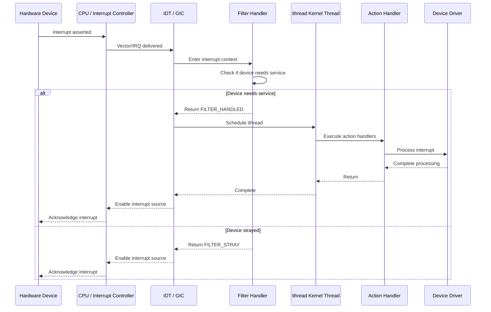

# Interrupt Handling — Threads, Filters, and Dispatch
<!-- This file is auto-generated by generate-doc.py -- do not edit manually -->

---
**Navigation:**
  **Up:** [Kernel Core — Structure and Entry Point](../README.md) ▸ [Source Tree — Layout and Conventions](../../README_internals.md)
  **Related:** [Process Management — Scheduling and Lifecycle](README_process.md) | [Locking Primitives — Mutexes, sx, rmlocks, and Atomics](README_locking.md) | [Device Driver Framework — newbus and devclass](README_driver.md)
  **All chapters:** [Source Tree — Layout and Conventions](../../README_internals.md) | [Boot Process — UEFI Bootloader to Kernel Handoff](../../stand/efi/loader/README.md) | [Kernel Core — Structure and Entry Point](../README.md) | [Build System — buildworld and buildkernel](../../share/mk/README.md) | [Virtual Memory Subsystem — vm_page, UMA, and Pagers](../vm/README.md) | [Process Management — Scheduling and Lifecycle](README_process.md) | [Locking Primitives — Mutexes, sx, rmlocks, and Atomics](README_locking.md) | [Buffer Cache — Block I/O Subsystem](../vm/README_bcache.md) ...
---


## Quick Summary

When a hardware device asserts an interrupt line, the CPU must respond quickly to acknowledge the event and defer potentially expensive processing. FreeBSD implements a two-tier interrupt model that separates the immediate, minimal work from the full device driver callback. The first tier — the filter handler — runs in interrupt context with interrupts disabled, performs just enough work to determine whether the device actually needs attention, and returns `FILTER_STRAY` if nothing needs doing or `FILTER_HANDLED` if it does. The second tier — the action handler — runs in a dedicated kernel thread context, where it can safely sleep, lock, and perform the full I/O processing without holding up other interrupts.

This threaded interrupt model, called the "ithread framework," was introduced to address a fundamental problem: traditional BSD interrupt handlers ran entirely in interrupt context, which meant that slow device drivers could starve the system of CPU time during interrupt storms. By moving the bulk of interrupt processing into kernel threads, FreeBSD achieves better latency for high-priority interrupts while still providing full driver functionality. Each interrupt event — a unique hardware interrupt source identified by its vector on x86 or its IRQ number on ARM64 — gets its own ithread that runs on a designated CPU.

In an SMP system, FreeBSD supports interrupt affinity, allowing administrators to pin specific interrupt events to specific CPUs. This is critical for NUMA systems where memory access latency varies by CPU, and for high-performance networking where keeping interrupt processing and the corresponding network queues on the same CPU reduces cache misses. The framework also includes interrupt storm protection, which automatically disables level-triggered interrupts when they fire too rapidly, preventing a single misbehaving device from locking up the entire system.

## Architecture

The interrupt framework spans three architectural layers: the machine-dependent interrupt controller code, the common ithread dispatch framework, and the device driver registration API. On x86, the machine-dependent layer lives in `sys/x86/x86/intr_machdep.c` and handles the Interrupt Descriptor Table (IDT), the 8259A PIC, the I/O APIC, and MSI/MSI-X support. On ARM64, the equivalent code lives in `sys/arm64/arm64/gic_v3.c` and implements the Generic Interrupt Controller (GIC) v3 interface, including SPI (Shared Peripheral Interrupts), PPI (Private Peripheral Interrupts), and SGI (Software Generated Interrupts) routing.

The common framework in `sys/kern/kern_intr.c` manages `struct intr_event` objects, each representing a unique interrupt source. When an interrupt fires, the machine-dependent code looks up the corresponding `intr_event` and invokes the filter handlers in sequence. If any filter returns `FILTER_HANDLED`, the framework schedules the ithread for that event, which in turn runs all registered action handlers. The ithread is a kernel thread created during boot, with one thread per interrupt event, managed by the `struct intr_thread` structure.

Interrupt registration happens through the `BUS_SETUP_INTR` function, which is implemented by each bus subsystem (PCI, FDT, ACPI). Drivers call `BUS_SETUP_INTR` with a filter function, an action function, and an argument pointer. The bus code creates an `intr_event` if one does not already exist for that interrupt source, then adds a new `intr_handler` to the event's handler list. The `intr_handler` structure contains function pointers to both the filter and action handlers, along with a priority field that determines execution order.

On x86, interrupt sources are indexed by vector in the `interrupt_sources` array defined in `sys/x86/x86/intr_machdep.c`. The `intsrc` structure (interrupt source) describes which PIC the source belongs to and includes methods to mask, unmask, and acknowledge that source. The `pics` TAILQ maintains a list of all registered PICs (8259A, I/O APIC, etc.), and the `intrpic_lock` mutex protects modifications to this list. On ARM64, the GIC provides its own mapping between IRQ numbers and interrupt handlers through the `gic_map_intr` and `gic_setup_intr` callbacks.

## Key Data Structures

```c
/* From sys/sys/interrupt.h */
struct intr_handler {
	driver_filter_t	*ih_filter;	/* Filter handler function. */
	driver_intr_t	*ih_handler;	/* Threaded handler function. */
	void		*ih_argument;	/* Argument to pass to handlers. */
	int		 ih_flags;
	char		 ih_name[MAXCOMLEN + 1]; /* Name of handler. */
	struct intr_event *ih_event;	/* Event we are connected to. */
	int		 ih_need;	/* Needs service. */
	CK_SLIST_ENTRY(intr_handler) ih_next; /* Next handler for this event. */
	u_char		 ih_pri;	/* Priority of this handler. */
};
```

The `intr_handler` structure describes a single interrupt handler entry. The `ih_filter` and `ih_handler` function pointers distinguish between the two execution tiers. The `ih_argument` pointer is passed to both functions when they are invoked. The `ih_flags` field contains per-handler configuration, including `IH_NET` for network devices (which receive special scheduling treatment), `IH_EXCLUSIVE` for devices that should not share their interrupt line, `IH_ENTROPY` to mark the device as a good entropy source for the random number generator, and `IH_MPSAFE` indicating the handler does not require the Giant mutex.

```c
/* From sys/sys/interrupt.h */
struct intr_thread {
	struct intr_event *it_event;
	struct thread *it_thread;	/* Kernel thread. */
	int	it_flags;		/* (j) IT_* flags. */
	int	it_need;		/* Needs service. */
	int	it_waiting;		/* Waiting in the runq. */
};
```

The `intr_thread` structure describes the kernel thread responsible for servicing a given interrupt event. The `it_thread` field points to the actual `struct thread` representing the kernel thread. The `it_need` field is set by the filter path when an interrupt requires action handler execution, and `it_waiting` indicates whether the thread is currently queued in the run queue. The `IT_DEAD` flag signals that the thread is waiting to exit, and `IT_WAIT` indicates the thread is blocking on a completion event.

```c
/* From sys/x86/x86/intr_machdep.c */
static struct intsrc **interrupt_sources;
static TAILQ_HEAD(pics_head, pic) pics;
u_long *intrcnt;
char *intrnames;
int nintrcnt;
```

On x86, `interrupt_sources` is an array indexed by interrupt vector, pointing to `struct intsrc` objects that describe each interrupt source. The `pics` TAILQ maintains the list of all PICs (Programmable Interrupt Controllers) registered in the system. The `intrcnt` array holds per-source interrupt counters for statistics, and `intrnames` holds the human-readable names for each source. The `nintrcnt` variable tracks the total number of interrupt sources.

## Deep Dive

### Interrupt Registration Flow

When a device driver probes its hardware and discovers an interrupt line, it calls `BUS_SETUP_INTR` to register its handlers. On x86, this function is implemented in `sys/x86/x86/intr_machdep.c`. The flow begins with the bus code looking up or creating an `intr_event` for the given interrupt vector. If the event does not exist, `intr_event_create` is called to allocate and initialize it.

```c
/* From sys/kern/kern_intr.c */
struct intr_event *clk_intr_event;
struct proc *intrproc;

static MALLOC_DEFINE(M_ITHREAD, "ithread", "Interrupt Threads");
```

The `clk_intr_event` global points to the system clock interrupt event, which is created early during boot. The `intrproc` variable references the process context used for ithread management. The `M_ITHREAD` malloc type is used to allocate `intr_thread` structures.

Once the `intr_event` exists, `BUS_SETUP_INTR` allocates a new `intr_handler` structure and adds it to the event's handler list. The handler's priority (`ih_pri`) determines the order in which handlers are invoked during filter and action execution. Higher priority handlers run first. The filter handler is called first with interrupts disabled; if it returns `FILTER_HANDLED`, the action handler will be scheduled for execution in the ithread context.

### The ithread Scheduling Path

When a filter returns `FILTER_HANDLED`, the framework must schedule the corresponding ithread. This happens in `intr_event_schedule_thread` in `sys/kern/kern_intr.c`. The function checks whether the ithread is already running or waiting; if not, it sets the `it_need` flag and wakes the thread.

```c
/* From sys/kern/kern_intr.c */
static int intr_storm_threshold = 0;
SYSCTL_INT(_hw, OID_AUTO, intr_storm_threshold, CTLFLAG_RWTUN,
    &intr_storm_threshold, 0,
    "Number of consecutive interrupts before storm protection is enabled");
static int intr_epoch_batch = 1000;
SYSCTL_INT(_hw, OID_AUTO, intr_epoch_batch, CTLFLAG_RWTUN, &intr_epoch_batch,
    0, "Maximum interrupt handler executions without re-entering epoch(9)");
```

The `intr_storm_threshold` sysctl controls interrupt storm protection. When set to a non-zero value, the framework tracks consecutive interrupts on the same event. If the count exceeds the threshold, the interrupt source is temporarily disabled to prevent system lockup. The `intr_epoch_batch` sysctl controls how many times the [epoch(9)](../../share/man/man9/epoch.9) mechanism can be re-entered before the framework yields, preventing long-running interrupt handlers from starving other work.

### Machine-Dependent Interrupt Dispatch

On x86, the IDT entry for each interrupt vector points to a machine-dependent assembly stub that saves the processor state, pushes the trapframe, and calls into C code. The stub in `sys/x86/x86/intr_machdep.c` looks up the `intsrc` for the vector, invokes the pre_ithread hook (which disables the interrupt source for level-triggered devices), then dispatches to the filter handlers.

```c
/* From sys/x86/x86/intr_machdep.c */
static struct intsrc **interrupt_sources;
static struct sx intrsrc_lock;
static struct mtx intrpic_lock;
static struct mtx intrcnt_lock;
```

The `interrupt_sources` array maps interrupt vectors to `struct intsrc` objects. The `intrsrc_lock` (shared/exclusive lock) protects modifications to the interrupt source table, while `intrpic_lock` protects the PIC list and `intrcnt_lock` protects the interrupt counter arrays.

On ARM64, the GIC v3 interrupt controller handles interrupt delivery through the `gic_v3.c` driver. The GIC provides methods for disabling, enabling, mapping, setting up, and tearing down interrupts through function pointers in the PIC structure:

```c
/* From sys/arm64/arm64/gic_v3.c */
static pic_disable_intr_t gic_v3_disable_intr;
static pic_enable_intr_t gic_v3_enable_intr;
static pic_map_intr_t gic_v3_map_intr;
static pic_setup_intr_t gic_v3_setup_intr;
static pic_teardown_intr_t gic_v3_teardown_intr;
static pic_post_filter_t gic_v3_post_filter;
static pic_post_ithread_t gic_v3_post_ithread;
static pic_pre_ithread_t gic_v3_pre_ithread;
static pic_bind_intr_t gic_v3_bind_intr;
```

The `gic_v3_pre_ithread` hook is called before the iththread runs, ensuring the interrupt controller acknowledges the interrupt and prevents re-entry. The `gic_v3_post_ithread` hook is called when the iththread completes, re-enabling the interrupt for future events. The `gic_v3_bind_intr` hook allows the GIC driver to assign the interrupt to a specific CPU.

### SMP Interrupt Routing

FreeBSD supports interrupt affinity through the `BUS_BIND_INTR` function. On x86, the I/O APIC redirection table can be programmed to route interrupts to specific CPUs. On ARM64, the GIC distributor registers can be configured to direct interrupts to specific CPU interfaces.

```c
/* From sys/x86/x86/intr_machdep.c */
#ifdef SMP
static struct intsrc **interrupt_sorted;
static int intrbalance;
SYSCTL_INT(_hw, OID_AUTO, intrbalance, CTLFLAG_RWTUN, &intrbalance, 0,
    "Interrupt auto-balance interval (seconds).  Zero disables.");
static struct timeout_task intrbalance_task;
#endif
```

The `intrbalance` sysctl enables automatic interrupt rebalancing. When set to a non-zero interval (in seconds), the framework periodically redistributes interrupts across CPUs to prevent hotspots. The `interrupt_sorted` array is used during the rebalancing process. On ARM64, the `sgi_to_ipi` array maps Software Generated Interrupts (SGIs) to Inter-Processor Interrupts (IPIs) for SMP communication:

```c
/* From sys/arm64/arm64/gic_v3.c */
#ifdef SMP
static u_int sgi_to_ipi[GIC_LAST_SGI - GIC_FIRST_SGI + 1];
static u_int sgi_first_unused = GIC_FIRST_SGI;
#endif
```

## Flow / Diagram



## Advanced Notes

### Debugging with DDB and DTrace

FreeBSD's debugger (DDB) provides commands for inspecting the interrupt subsystem. The `db_dump_intr_event` and `db_dump_intrhand` functions, declared in `sys/kern/kern_intr.c`, allow kernel developers to dump the state of interrupt events and handlers from the debugger. The `intr_event` list is protected by `event_lock`, so these operations must be performed carefully to avoid deadlocks.

For runtime debugging, the `ktr` (kernel trace) framework can be used to trace interrupt dispatch. The `KTR_INTR` trace point logs filter and action handler invocations, which can be viewed with `dtrace -n 'syscall:::entry { trace(args[0]); }'` or through the `ktr` sysctl interface.

### Performance Considerations

The ithread model introduces a context switch between the filter and action paths. For high-frequency interrupts like network reception, this overhead can be significant. FreeBSD mitigates this through several mechanisms: the `IH_NET` flag causes network ithreads to be scheduled with higher priority, and the `intr_epoch_batch` sysctl controls how often the framework yields to other work. On systems with many network interfaces, administrators can use `sysctl hw.intr_storm_threshold` to fine-tune storm protection and `sysctl hw.intrbalance` to enable automatic interrupt rebalancing.

The [epoch(9)](../../share/man/man9/epoch.9) mechanism interacts with interrupt handling through the `intr_epoch_batch` sysctl. When an ithread runs for many consecutive invocations without returning to epoch, the framework forces a reschedule point to prevent starvation of other kernel work. This is particularly important for network drivers that may process many packets in a single interrupt context.

### Common Pitfalls

One common mistake when writing interrupt handlers is assuming that the filter and action handlers run on the same CPU. While this is typically the case due to interrupt affinity, it is not guaranteed — the framework can migrate an ithread to a different CPU if the original CPU is overloaded. Drivers must not assume CPU-local storage will be consistent between filter and action invocations.

Another pitfall is forgetting to return `FILTER_STRAY` from a filter when the device does not need service. If a filter returns `FILTER_HANDLED` unnecessarily, the framework will schedule the action handler, wasting CPU time and potentially causing unnecessary lock contention. Filters should always check the device's interrupt status register before returning `FILTER_HANDLED`.

Level-triggered interrupts require special care. Unlike edge-triggered interrupts, level-triggered interrupts remain asserted until the device clears the interrupt condition. The `pre_ithread` and `post_ithread` hooks handle this by disabling the interrupt source before the ithread runs and re-enabling it afterward. Drivers must ensure they clear the device's interrupt status register before returning from the action handler, or the interrupt will re-fire immediately.

### Connection to OS Theory

FreeBSD's threaded interrupt model embodies the classic operating systems principle of separating interrupt handling into fast and slow paths. The filter handler corresponds to the "top half" in Linux terminology — minimal work done with interrupts disabled. The action handler corresponds to the "bottom half" — full processing done in process context where sleeping is allowed. This separation allows the system to maintain low interrupt latency while still providing the full functionality that device drivers require.

The framework also illustrates the trade-off between interrupt coherence and CPU utilization. By keeping all handlers for a given interrupt event on the same CPU (when possible), FreeBSD reduces cache thrashing and lock contention. However, this can create hotspots on multi-core systems, which is why the interrupt balancing feature exists. The `intrbalance` sysctl allows administrators to choose between maximum cache coherence (by pinning interrupts) and maximum load distribution (by rebalancing).

## See Also
- [Device Driver Framework — newbus and devclass](README_driver.md)
- [Process Management — Scheduling and Lifecycle](README_process.md)
- [Locking Primitives — Mutexes, sx, rmlocks, and Atomics](README_locking.md)


- [`sys/kern/kern_intr.c`](kern_intr.c) — Core interrupt thread framework implementation
- [`sys/x86/x86/intr_machdep.c`](../x86/x86/intr_machdep.c) — x86 machine-dependent interrupt code
- [`sys/arm64/arm64/gic_v3.c`](../arm64/arm64/gic_v3.c) — ARM64 GIC v3 interrupt controller driver
- [`sys/sys/interrupt.h`](../sys/interrupt.h) — Interrupt framework header with struct and function declarations
- `man9 intr_event` — Manual page for interrupt event management
- `man9 BUS_SETUP_INTR` — Manual page for interrupt registration API
- `man9 swi` — Manual page for software interrupt (swi) framework
- [`sys/kern/kern_clock.c`](kern_clock.c) — Clock interrupt handling
- [`sys/dev/fdt/fdt_intr.h`](../dev/fdt/fdt_intr.h) — Device tree interrupt handling

---

> _Generated by [DaemonDocs](https://github.com/ocochard/DaemonDocs) on 2026-05-04 01:28 UTC using model `Qwen3.6-35B-A3B-UD-Q8_K_XL` (llama.cpp build `b8985-27aef3dd9`). AI-generated content — verify against source before relying on it._
