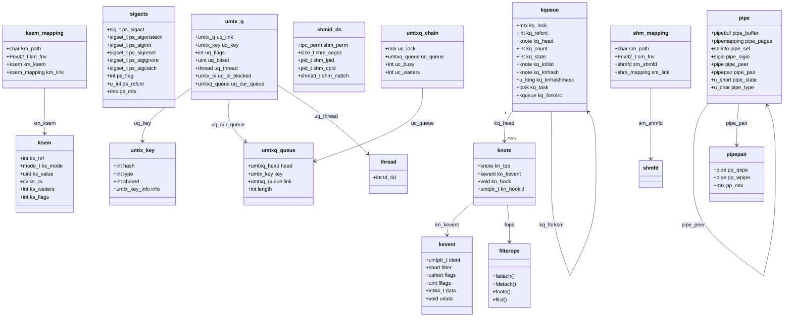

# Signals, kqueue, and IPC — Process Communication and Notification
<!-- This file is auto-generated by generate-doc.py -- do not edit manually -->

---
**Navigation:**
  **Up:** [Kernel Core — Structure and Entry Point](../README.md) ▸ [Source Tree — Layout and Conventions](../../README_internals.md)
  **Related:** [Process Management — Scheduling and Lifecycle](README_process.md) | [VFS — Virtual File System Layer](../fs/README.md) | [The Socket Layer — sockets, sockbuf, and UNIX-domain](README_socket.md)
  **All chapters:** [Source Tree — Layout and Conventions](../../README_internals.md) | [Boot Process — UEFI Bootloader to Kernel Handoff](../../stand/efi/loader/README.md) | [Kernel Core — Structure and Entry Point](../README.md) | [Build System — buildworld and buildkernel](../../share/mk/README.md) | [System Calls and Image Activation — Entry, sysent, and exec](README_syscall.md) | [Kernel Modules and the Linker — KLD, SYSINIT, and linker sets](README_kld.md) | [Virtual Memory Subsystem — vm_page, UMA, and Pagers](../vm/README.md) | [Process Management — Scheduling and Lifecycle](README_process.md) ...
---


## Quick Summary

A process can never be sure that another process, a device, or a timer will interrupt it at a convenient moment. The kernel's signal machinery turns that asynchrony into a well-defined contract: a signal is *posted* into a pending set, and it is *delivered* only when the [thread](README_process.md#glossary) next returns to userland at a safe boundary. This chapter follows that contract from the [`sigaction(2)`](../../lib/libsys/sigaction.2) disposition table through the posting path and the AST-based delivery path, and explains the small set of signals that the kernel refuses to let a program catch or block.

Event notification is the same problem in a different shape. The old [`select(2)`](../../lib/libsys/select.2)/[`poll(2)`](../../lib/libsys/poll.2) interface asks the kernel to scan a flat array of descriptors on every call, which does not scale once a server watches thousands of file descriptors. [`kqueue(2)`](../../lib/libsys/kqueue.2)/`kevent(2)` inverts the model: the kernel keeps a persistent list of *knotes* — one per watched object — and a single `kevent(2)` call returns only the knotes that actually changed. This is what lets a single-threaded event loop multiplex a large fd count without re-scanning everything.

Inter-process communication (IPC) in FreeBSD is a family of small, purpose-built objects rather than one general mechanism. Anonymous pipes and named FIFOs move byte streams; the System V shared-memory, message-queue, and semaphore trio and their POSIX counterparts (`shm_open(3)` for shared memory and the POSIX named semaphores) share [state](../netpfil/pf/README.md#glossary) across process boundaries; and `umtx(2)` is the kernel assist that makes userland pthread mutexes and condition variables fast when uncontended and correct when they are not. Each primitive solves a different problem, and choosing the right one is the main engineering decision this chapter is about.

## Architecture

The three subsystems live together in `sys/kern` because they all reduce to the same underlying question: *how does one thread wake, or notify, another?* Signals are handled in `sys/kern/kern_sig.c`, kqueue in `sys/kern/kern_event.c`, the legacy select/poll path in `sys/kern/sys_generic.c`, pipes and FIFOs in `sys/kern/sys_pipe.c`, the System V objects in `sys/kern/sysv_shm.c` (with `sysv_msg.c` and `sysv_sem.c` for the message queues and semaphores), the POSIX objects in `sys/kern/uipc_shm.c` and `sys/kern/uipc_sem.c`, and umtx in `sys/kern/kern_umtx.c`. Their kernel-side state is described by headers in `sys/sys`: `signalvar.h`, `event.h` and `eventvar.h`, `pipe.h`, `shm.h`, `ksem.h`, and `umtxvar.h`.

**Signals.** A process's signal dispositions and masks live in a shared `struct sigacts` (see `sys/sys/signalvar.h`), reached through the process structure. `sigacts` holds one entry per signal number: the handler, the mask to apply while the handler runs, and a set of bitmaps that record which signals are caught, ignored, interruptible, reset-once-caught, and so on. Posting a signal goes through `postsig()` (and the group variant `killpg1()`), which appends a `siginfo_t` to the thread's pending set (`td_siglist`) under the process lock and marks the thread to be woken. Delivery is deferred: when the thread is about to return to userland, the AST (asynchronous trap) path calls `issignal()` to decide whether anything is pending and unmasked, and `cursig()` to choose which one to run. The AST entry points are `ast_sig()` and `ast_sigsuspend()`. The kernel records signal-post and signal-catch transitions as ktrace events, which is what makes signal tracing practical.

**kqueue.** A `struct kqueue` (in `sys/sys/eventvar.h`) owns a mutex, a reference count, a TAILQ of *pending* knotes (`kq_head`), and — the important part for scaling — a hash table (`kq_knhash`) of *all* registered knotes, so that a filter can find and update the right knote in O(1) without the consumer being involved. Each `struct knote` (in `sys/sys/event.h`) embeds a `struct kevent` (the data the user sees), a pointer to the object it watches (`kn_hook`), and an id (`kn_hookid`). The behavior of a knote is defined by a `struct filterops` table of function pointers — the [attach](README_driver.md#glossary), detach, note, and list operations — so that `EVFILT_READ`, `EVFILT_VNODE`, `EVFILT_PROC`, `EVFILT_SIGNAL`, `EVFILT_TIMER`, and the rest are just different filterops instances. When an event occurs, the filter's note routine marks the knote and enqueues it on `kq_head`; a `kqueue_task` on the `kqueue_ctx` taskqueue wakes the sleeping consumer.

**select/poll.** The older path in `sys/kern/sys_generic.c` still exists for compatibility. It walks the caller's descriptor list, asking each file operation whether it is ready, and parks waiters on the file's `selinfo` structure; `doselwakeup()` is the wake-up side. Pipes carry a `selinfo` (`pipe_sel`) for exactly this reason. The design cannot grow with the fd count because the caller re-sends the whole set on every call.

**Pipes and FIFOs.** `sys_pipe.c` implements a high-performance pipe that switches between a small kernel-buffered mode and a *direct write* mode. When a write is large enough (at or above `PIPE_MINDIRECT`), the writer pins its own pages and the reader copies straight out of them, avoiding a kernel copy; the pinned-page state is described by `struct pipemapping`. Named FIFOs are the same object with `PIPE_TYPE_NAMED` set, backed by a `fifoinfo` in `sys/fs/fifofs/fifo_vnops.c`.

**IPC objects.** The System V shared-memory segment is described by `struct shmid_ds` (in `sys/sys/shm.h`) and managed in `sysv_shm.c`. The POSIX `shm_open(3)` object is different in kind: it is a swap-backed anonymous `vm_object` reached through a `struct shm_mapping` in `sys/kern/uipc_shm.c`, keyed by an FNV hash of the path in a global dictionary. POSIX named semaphores are `struct ksem` objects (in `sys/sys/ksem.h`) managed in `sys/kern/uipc_sem.c`, again keyed by a path hash in a dictionary. umtx (`sys/kern/kern_umtx.c`) is the kernel half of userland locking: it maps a userland address to a `struct umtx_key`, buckets waiters into per-key `umtx_q` entries, and stores those in hashed `umtxq_chain` structures so that a contending thread sleeps on a kernel wait queue instead of spinning.

## Key Data Structures

The signal disposition table is shared per process and is the single source of truth for what each signal does. From `sys/sys/signalvar.h`:

```c
struct sigacts {
	sig_t	ps_sigact[_SIG_MAXSIG];	/* Disposition of signals. */
	sigset_t ps_catchmask[_SIG_MAXSIG];	/* Signals to be blocked. */
	sigset_t ps_sigonstack;		/* Signals to take on sigstack. */
	sigset_t ps_sigintr;		/* Signals that interrupt syscalls. */
	sigset_t ps_sigreset;		/* Signals that reset when caught. */
	sigset_t ps_signodefer;		/* Signals not masked while handled. */
	sigset_t ps_siginfo;		/* Signals that want SA_SIGINFO args. */
	sigset_t ps_sigignore;		/* Signals being ignored. */
	sigset_t ps_sigcatch;		/* Signals being caught by user. */
	sigset_t ps_freebsd4;		/* Signals using freebsd4 ucontext. */
	sigset_t ps_osigset;		/* Signals using <= 3.x osigset_t. */
	sigset_t ps_usertramp;		/* SunOS compat; libc sigtramp. XXX */
	int	ps_flag;
	u_int	ps_refcnt;
	struct mtx ps_mtx;
};
```

The comment above the struct in the header explains the design: the mapping between `sigacts` and `proc` is 1:1 *except* for `rfork()` processes that masquerade as threads, which share one structure across the group. The reference count and the mutex are deliberately last so that a `bcopy` in `sigacts_copy()` works. `ps_flag` carries the `PS_NOCLDWAIT`, `PS_NOCLDSTOP`, and `PS_CLDSIGIGN` bits.

A pending signal is a `siginfo_t` queued on the thread's pending-signal list (`td_siglist` in `struct thread`), together with a list link, a set of flags, and a back-pointer to the queue it sits on. Pending signals are held as a list of these on the thread; delivery consumes them one at a time.

The kqueue object, from `sys/sys/eventvar.h`, shows the two-list design that makes it scale:

```c
struct kqueue {
	struct		mtx kq_lock;
	int		kq_refcnt;
	TAILQ_ENTRY(kqueue)	kq_list;
	TAILQ_HEAD(, knote)	kq_head;	/* list of pending event */
	int		kq_count;		/* number of pending events */
	struct		selinfo kq_sel;
	struct		sigio *kq_sigio;
	struct		filedesc *kq_fdp;
	int		kq_state;
#define KQ_SEL		0x01
#define KQ_SLEEP	0x02
#define KQ_FLUXWAIT	0x04			/* waiting for a in flux kn */
#define KQ_ASYNC	0x08
#define KQ_CLOSING	0x10
#define	KQ_TASKSCHED	0x20			/* task scheduled */
#define	KQ_TASKDRAIN	0x40			/* waiting for task to drain */
#define	KQ_CPONFORK	0x80
	int		kq_knlistsize;		/* size of knlist */
	struct		knote **kq_knlist;	/* list of knotes */
	u_long		kq_knhashmask;		/* size of knhash */
	struct		knote **kq_knhash;	/* hash table for knotes */
	struct		task kq_task;
	struct		ucred *kq_cred;
	struct		kqueue *kq_forksrc;
};
```

`kq_head` holds only the knotes that are currently *ready*; `kq_knhash` holds *all* registered knotes so a filter can update one in O(1). The `kq_state` bits track whether the kqueue is in select mode (`KQ_SEL`), asleep (`KQ_SLEEP`), or waiting on an in-flux knote (`KQ_FLUXWAIT`). The constants `KQ_NEVENTS` (8) and `KQEXTENT` (256) bound how many events are copied per `kevent(2)` call and how fast the knote hash grows.

The user-visible event, from `sys/sys/event.h`:

```c
struct kevent {
	__uintptr_t	ident;		/* identifier for this event */
	short		filter;		/* filter for event */
	unsigned short	flags;		/* action flags for kqueue */
	unsigned int	fflags;		/* filter flag value */
	__int64_t	data;		/* filter data value */
	void		*udata;		/* opaque user data identifier */
	__uint64_t	ext[4];		/* extensions */
};
```

A `struct knote` (in `sys/sys/event.h`) embeds one of these as `kn_kevent` and adds a list entry `kn_tqe`, a pointer to the watched object `kn_hook`, and an identifier `kn_hookid`. Notably, `kn_flags` is not a separate field — it is a macro that aliases `kn_kevent.flags`, so the action flags the user set and the state the kernel tracks live in the same word that gets copied back out. The filter identifiers are negative: `EVFILT_READ` is -1, `EVFILT_WRITE` -2, `EVFILT_VNODE` -4, `EVFILT_PROC` -5, `EVFILT_SIGNAL` -6, `EVFILT_TIMER` -7, with `EVFILT_SYSCOUNT` at 15.

The pipe, from `sys/sys/pipe.h`, is the clearest example of a structure that exists to avoid a copy:

```c
struct pipe {
	struct	pipebuf pipe_buffer;	/* data storage */
	struct	pipemapping pipe_pages;	/* wired pages for direct I/O */
	struct	selinfo pipe_sel;	/* for compat with select */
	struct	timespec pipe_atime;	/* time of last access */
	struct	timespec pipe_mtime;	/* time of last modify */
	struct	timespec pipe_ctime;	/* time of status change */
	struct	sigio *pipe_sigio;	/* information for async I/O */
	struct	pipe *pipe_peer;	/* link with other direction */
	struct	pipepair *pipe_pair;	/* container structure pointer */
	u_short	pipe_state;		/* pipe status info */
	u_char	pipe_type;		/* pipe type info */
	u_char	pipe_present;		/* still present? */
	int	pipe_waiters;		/* pipelock waiters */
	int	pipe_busy;		/* busy flag, mostly to handle rundown sanely */
	int	pipe_wgen;		/* writer generation for named pipe */
	ino_t	pipe_ino;		/* fake inode for stat(2) */
};
```

`pipe_buffer` (a `struct pipebuf` with `cnt`, `in`, `out`, `size`, and a kernel `buffer`) is used for small writes. `pipe_pages` (a `struct pipemapping` with `cnt`, `pos`, `npages`, and an array of pinned `vm_page_t`) is used for direct writes. Two `pipe` structures are linked by `pipe_peer` and wrapped in a `struct pipepair` (`pp_rpipe`, `pp_wpipe`, `pp_mtx`) to form a bidirectional pipe. The size constants are `PIPE_SIZE` 16384, `BIG_PIPE_SIZE` 64 KiB, `SMALL_PIPE_SIZE` one page, and `PIPE_MINDIRECT` 8192 — the threshold above which direct write kicks in.

The System V segment descriptor, from `sys/sys/shm.h`:

```c
struct shmid_ds {
	struct ipc_perm shm_perm;	/* operation permission structure */
	size_t          shm_segsz;	/* size of segment in bytes */
	pid_t           shm_lpid;   /* process ID of last shared memory op */
	pid_t           shm_cpid;	/* process ID of creator */
	shmatt_t        shm_nattch;	/* number of current attaches */
	/* ...timestamps follow... */
};
```

The POSIX `shm_open(3)` object is a different animal — a path-keyed mapping to a swap-backed object, from `sys/kern/uipc_shm.c`:

```c
struct shm_mapping {
	char		*sm_path;
	Fnv32_t		sm_fnv;
	struct shmfd	*sm_shmfd;
	LIST_ENTRY(shm_mapping) sm_link;
};
```

The POSIX named semaphore, from `sys/sys/ksem.h`, is a counter with a kernel condition variable that waiters sleep on:

```c
struct ksem {
	int		ks_ref;		/* number of references */
	mode_t		ks_mode;	/* protection bits */
	uid_t		ks_uid;		/* creator uid */
	gid_t		ks_gid;		/* creator gid */
	unsigned int	ks_value;	/* current value */
	struct cv	ks_cv;		/* waiters sleep here */
	int		ks_waiters;	/* number of waiters */
	int		ks_flags;
	/* ...timestamps and MAC label follow... */
};
```

The umtx key, from `sys/sys/umtxvar.h`, is how the kernel turns a userland address into a stable identity. It is a union so the same key works for locks in private (process) address space and in shared (`vm_object`-backed) memory:

```c
struct umtx_key {
	int	hash;
	int	type;
	int	shared;
	union {
		struct {
			struct vm_object *object;
			uintptr_t	offset;
		} shared;
		struct {
			struct vmspace	*vs;
			uintptr_t	addr;
		} private;
		struct {
			void		*a;
			uintptr_t	b;
		} both;
	} info;
};
```

The `type` field selects among `TYPE_SIMPLE_WAIT`, `TYPE_CV`, `TYPE_SEM`, `TYPE_SIMPLE_LOCK`, `TYPE_NORMAL_UMUTEX`, `TYPE_PI_UMUTEX`, `TYPE_PP_UMUTEX`, `TYPE_RWLOCK`, `TYPE_FUTEX`, `TYPE_SHM`, and the mutex variants that carry a recovery list. `shared` is one of `THREAD_SHARE`, `PROCESS_SHARE`, or `AUTO_SHARE`. A waiting thread is a `struct umtx_q` (with `uq_key`, `uq_thread`, `uq_bitset`, and queue links), and the per-key wait queues are `struct umtxq_queue` objects bucketed into `struct umtxq_chain` structures — there are `UMTX_CHAINS` (512) of them, each guarded by its own mutex, so that contention on one lock does not serialize every other lock in the system.

## Deep Dive

### Posting and delivering a signal

The disposition path is straightforward: `sys_sigaction` (and the legacy `osigaction`) updates `struct sigacts` under `ps_mtx`, installing the handler in `ps_sigact`, the blocked-while-handling mask in `ps_catchmask`, and the relevant bits in `ps_sigcatch`/`ps_sigignore`/`ps_sigreset`. `sys_sigsuspend` is the only call that both changes the mask and sleeps, which is what makes the classic "block, wait, unblock" idiom race-free.

Posting is where the design decisions show up. `postsig()` in `sys/kern/kern_sig.c` is the single funnel that every signal source — a [`kill(2)`](../../lib/libsys/kill.2)/[`sigqueue(2)`](../../lib/libsys/sigqueue.2) syscall, a device driver, a timer, or the scheduler — goes through. It takes the process lock, builds or reuses a `siginfo_t` for the target, appends it to the pending list, and records a signal-post ktrace event. Group signals (`killpg`, `SIGCONT` to a stopped group) route through `killpg1()`. Once a signal is pending, the kernel does *not* run the handler in place; it sets the thread's state so that the next return to userland notices it.

Delivery happens on the AST path. When a thread is about to return to userland (and the kernel determines an AST is owed), `ast_sig()` runs. It calls `issignal()`, which checks whether any pending signal is both unmasked and catchable; if so, `cursig()` picks the highest-priority one, applies the `ps_catchmask`, and arranges for the userland [trampoline](../../stand/efi/loader/README.md#glossary) to run the handler. The handler itself runs in user mode on a (possibly alternate) stack — the kernel only sets up the frame. Signals that are being *ignored* are dropped; ones that are consumed are cleared from the pending list. `reschedule_signals()` re-evaluates the pending set after the mask changes, and `sigprop()` classifies a signal number into its category (fatal, stop, ignore-by-default) which is what drives the uncatchable cases: `SIGKILL` and `SIGSTOP` cannot be caught, blocked, or ignored, and the kernel enforces this in the posting path rather than trusting userland.

### Registering and scanning a kqueue

`sys_kqueue` allocates a `struct kqueue`; `sys_kevent` is the workhorse. On a registration call, `kqueue_register()` looks up (or creates, via `kqueue_expand()`) the knote for the `(filter, ident)` pair in `kq_knhash`, calls the filter's attach operation, and stores the user's `kevent` fields in `kn_kevent`. The hash is what makes registration O(1) in the number of *watched* objects rather than the number of *ready* ones — that is the core reason kqueue scales where select/poll does not.

On the event side, a filter's note routine marks its knote ready and calls `knote_enqueue()` to push it onto `kq_head`. If the consumer is asleep, a `kqueue_task` is scheduled on the `kqueue_ctx` taskqueue, which wakes the thread. When the consumer calls `kevent(2)` to read, `kqueue_scan()` walks `kq_head`, respects `EV_ONESHOT`/`EV_CLEAR`/`EV_DISABLE`, and copies out at most `KQ_NEVENTS` events per pass via `kevent_copyout()`. Because the pending list only ever holds knotes that actually fired, a server watching ten thousand descriptors pays for the handful that changed, not for all ten thousand.

### The select/poll contrast

`sys_generic.c` implements the legacy path. For each descriptor in the caller's set it asks the file's operations whether it is readable/writable and parks the thread on the file's `selinfo` (the same `pipe_sel` field a pipe carries). `doselwakeup()` is the wake-up side. The structural weakness is that the *caller* owns the descriptor list and must resend it on every call, so the kernel's work grows linearly with the set size on every iteration of the event loop. kqueue moves that state into the kernel (`kq_knhash`) so the per-call work is proportional to the number of events, not the number of watches. This is why high-fd-count servers reached for kqueue and left select/poll behind.

### Direct-write pipes

`sys_pipe.c` chooses its mode per write. A write smaller than `PIPE_MINDIRECT` goes into the kernel `pipe_buffer`. A larger one sets `PIPE_DIRECTW`: the writer pins its own pages into `pipe_pages` and the reader copies directly from them, so there is no intermediate kernel copy. If the writer receives a signal and its address space changes, the pipe code falls back to copying into a pageable kernel buffer. Resource use is bounded by the `kern.ipc.maxpipekva` sysctl (with `kern.ipc.pipekva` tracking current use); as that limit is approached, new pipes are given smaller backing and existing pipes are shrunk. Named FIFOs are the same `struct pipe` with `PIPE_TYPE_NAMED`, attached to a `fifoinfo` in `sys/fs/fifofs/fifo_vnops.c` that tracks reader/writer generations so that the classic "open a FIFO for reading blocks until a writer arrives" behavior works.

### umtx: the kernel half of a userland mutex

A pthread mutex is, in the uncontended case, a single atomic compare-and-swap on a userland word — no kernel involvement. The problem is the contended case: a thread that loses the CAS cannot just spin, or it will burn a CPU core and starve everyone else, but it also cannot sleep on a userland object because there is no kernel wait queue attached to it. umtx solves exactly this. When a thread finds the lock held, it enters the umtx kernel path, which maps the userland address to a `struct umtx_key`, finds (or creates) the `umtxq_chain` bucket for that key, enqueues a `struct umtx_q` on the per-key `umtxq_queue`, and sleeps on a kernel wait queue. The lock owner's `unlock` path does a matching `kern_umtx_wake()`. `do_lock_umutex()`, `do_cv_wait()`, `do_cv_signal()`, `do_sem_wait()`, `do_sem_wake()`, and the `do_rw_*` read/write-lock helpers are the per-type entry points; the `__umtx_op_*` functions are the syscall-visible wrappers. Priority-inheritance mutexes (`do_lock_pi()`) additionally track the owner via `struct umtx_pi` so a high-priority waiter can boost the lock holder. The `UPRI()` macro deliberately clamps time-sharing priorities so a PI mutex cannot be abused to permanently boost a busy thread.

## Flow / Diagram



## Advanced Notes

**Tracing signals with ktrace.** The signal-post and signal-catch ktrace events in `kern_sig.c` are the right hooks for understanding *why* a process is dying or being stopped. A blocked signal is not caught; it sits pending until the mask changes, while a signal that is ignored is dropped before it is ever caught. Because delivery is deferred to the AST boundary, the timestamp gap between post and catch is a direct measure of how long the signal sat pending, which is useful when debugging latency spikes in signal-driven servers.

**kqueue pitfalls.** The `EV_CLEAR` and `EV_ONESHOT` flags change the level/edge semantics in ways that are easy to get wrong. A plain (level triggered) `EVFILT_READ` keeps firing as long as the descriptor is readable, so a busy loop that fails to drain the buffer will see the same knote re-enqueued on every `kevent(2)`. `EVFILT_PROC` interacts with the run-queue and sleepqueue machinery (covered in the Process Management and Locking chapters): a `NOTE_EXIT` fires when the watched process is actually reaped, not when it calls `exit()`, so a reaper that does not `waitpid()` must be careful not to double count. The `KQ_FLUXWAIT` state exists precisely for knotes that are in the middle of a state transition; reading a kqueue while a flux knote is pending blocks until the transition settles.

**umtx and priority inheritance.** The `UPRI()` clamp in `kern_umtx.c` is a deliberate security decision, not an optimization: without it, a low-priority thread could acquire a PI mutex, a high-priority thread could block on it, and priority propagation would boost the low-priority holder permanently while it burns the CPU. The trade-off is that PI only boosts within the real-time priority band. When debugging a "stuck" PI mutex, check `struct umtx_pi` (`pi_owner`, `pi_blocked`) via [DDB](README_kdb.md#glossary) or `procstat(8)` — a non-null `pi_owner` with an empty `pi_blocked` list is the signature of a holder that exited without unlocking, which is what the mutex types with a recovery list (`TYPE_PI_ROBUST_UMUTEX`) are meant to recover from.

**Choosing the primitive.** The decision is about the lifetime and shape of the data, not raw speed. Byte streams between related processes: anonymous pipe. A stream that must survive the creating process or be discovered by name: named FIFO. Shared structured state with no kernel copy per access: POSIX `shm_open(3)` (swap-backed, name-based) for new code, System V [`shmget(2)`](../../lib/libsys/shmget.2) only for compatibility. Cross-process counting or admission control: a POSIX named semaphore (created via the `ksem_open(2)` syscall) for a named, persistent semaphore, or a shared-memory counter guarded by umtx when the semaphore overhead is not needed. Intra-process thread synchronization: umtx-backed pthread primitives, never a kernel semaphore. And for multiplexing I/O readiness across many descriptors: kqueue, unambiguously — select/poll remain only for ports of old code.

**Theory connection.** Textbooks describe the futex as the resolution of a fundamental tension: spinning is right under light contention but wastes CPU under heavy contention, while always sleeping is the opposite. umtx is FreeBSD's version of that idea — the userland CAS is the fast path, and the kernel wait queue (the `umtxq_chain`/`umtx_q` structures) is the slow path entered only when the CAS loses. The same level/edge distinction that kqueue exposes through `EV_CLEAR`/`EV_ONESHOT` is the distinction between "state is true" and "state just changed," and it is why an edge-triggered loop must always drain a descriptor to EOF before parking.

## See Also
- [Process Management — Scheduling and Lifecycle](README_process.md)
- [The Socket Layer — sockets, sockbuf, and UNIX-domain](README_socket.md)
- [VFS — Virtual File System Layer](../fs/README.md)


- **Process Management — Scheduling and Lifecycle** ([`sys/kern/README_process.md`](README_process.md)): the run queues and the `exit()`/reap path that `EVFILT_PROC` and the uncatchable-signal handling depend on.
- **Locking Primitives — Mutexes, sx, rmlocks, and Atomics** ([`sys/kern/README_locking.md`](README_locking.md)): the sleepqueue/turnstile wakeup machinery that `knote_enqueue()`, `doselwakeup()`, and the umtx wait queues all build on.
- **System Calls and Image Activation** ([`sys/kern/README_syscall.md`](README_syscall.md)): the `sys_sigaction`, `sys_kevent`, and `shm_open` entries in [`sys/kern/init_sysent.c`](init_sysent.c) that this chapter's kernel functions serve.
- **Virtual Memory Subsystem** ([`sys/vm/README.md`](../vm/README.md)): the `vm_object`/swap pager backing behind POSIX `shm_open(3)` and the shared-memory case of a `umtx_key`.
- Source: [`sys/kern/kern_sig.c`](kern_sig.c), [`sys/kern/kern_event.c`](kern_event.c), [`sys/kern/sys_generic.c`](sys_generic.c), [`sys/kern/sys_pipe.c`](sys_pipe.c), [`sys/kern/sysv_shm.c`](sysv_shm.c), [`sys/kern/uipc_shm.c`](uipc_shm.c), [`sys/kern/uipc_sem.c`](uipc_sem.c), [`sys/kern/kern_umtx.c`](kern_umtx.c), and the headers [`sys/sys/signalvar.h`](../sys/signalvar.h), [`sys/sys/event.h`](../sys/event.h), [`sys/sys/eventvar.h`](../sys/eventvar.h), [`sys/sys/pipe.h`](../sys/pipe.h), [`sys/sys/shm.h`](../sys/shm.h), [`sys/sys/ksem.h`](../sys/ksem.h), [`sys/sys/umtxvar.h`](../sys/umtxvar.h).
- Man pages: `signal(5)`, [`sigaction(2)`](../../lib/libsys/sigaction.2), [`sigsuspend(2)`](../../lib/libsys/sigsuspend.2), [`kqueue(2)`](../../lib/libsys/kqueue.2), `kevent(2)`, [`select(2)`](../../lib/libsys/select.2), [`poll(2)`](../../lib/libsys/poll.2), [`pipe(2)`](../../lib/libsys/pipe.2), `mkfifo(3)`, [`shmget(2)`](../../lib/libsys/shmget.2), [`shmat(2)`](../../lib/libsys/shmat.2), `shm_open(3)`, `umtx(2)`, `knote(9)`, `filterops(9)`.

---

> _Generated by [DaemonDocs](https://github.com/ocochard/DaemonDocs) on 2026-08-25 18:26 UTC using model `Qwen3.8-27B-UD-Q8_K_XL` (llama.cpp build `b10553-cd26896c1`). AI-generated content — verify against source before relying on it._
