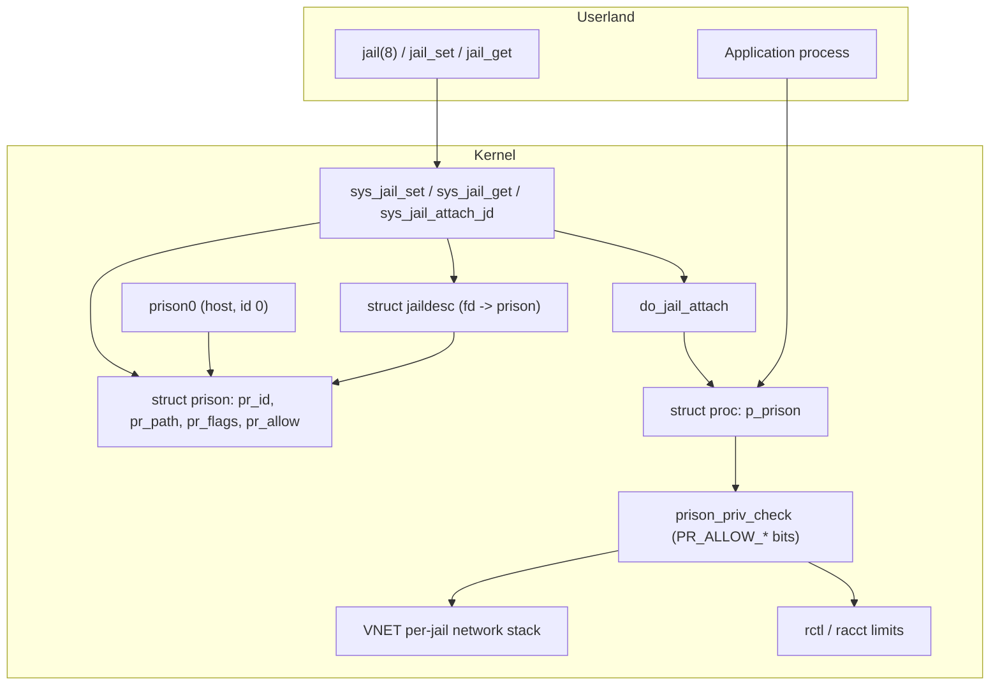

# Jails — OS-level Isolation
<!-- This file is auto-generated by generate-doc.py -- do not edit manually -->

---
**Navigation:**
  **Up:** [Kernel Core — Structure and Entry Point](../README.md) ▸ [Source Tree — Layout and Conventions](../../README_internals.md)
  **Related:** [Kernel Core — Structure and Entry Point](../README.md) | [Process Management — Scheduling and Lifecycle](README_process.md) | [VNET — Virtual Network Stacks](../net/README_vnet.md) | [Capsicum — Capability Mode and Sandboxing](README_capsicum.md)
  **All chapters:** [Source Tree — Layout and Conventions](../../README_internals.md) | [Boot Process — UEFI Bootloader to Kernel Handoff](../../stand/efi/loader/README.md) | [Kernel Core — Structure and Entry Point](../README.md) | [Build System — buildworld and buildkernel](../../share/mk/README.md) | [System Calls and Image Activation — Entry, sysent, and exec](README_syscall.md) | [Kernel Modules and the Linker — KLD, SYSINIT, and linker sets](README_kld.md) | [Virtual Memory Subsystem — vm_page, UMA, and Pagers](../vm/README.md) | [Process Management — Scheduling and Lifecycle](README_process.md) ...
---


## Quick Summary

A FreeBSD jail is a boundary that lets one process tree see a different "root" of the
system than the rest of the machine. Where [`chroot(2)`](../../lib/libsys/chroot.2) only changes where a process's
relative pathnames resolve, a jail also confines that process's view of hosts, network
addresses, and (optionally) its own network stack, and it gates the privileged system
calls the process may make. The kernel object at the heart of this is the *[prison](README_cred.md#glossary)*:
every process carries a pointer to the `struct prison` it belongs to, and the host
itself is just the special prison with id 0, called `prison0`. Because the host is
represented as a prison too, the same code paths that confine a jail apply uniformly to
everything, and a "is this a real jail?" test reduces to checking whether the prison id is 0.

Jails solve a concrete engineering problem: a multi-tenant server needs to hand out
root privileges to untrusted tenants without letting one tenant's root become the
machine's root. The jail gives each tenant its own hostname, its own IP address, its
own root directory, and a reduced set of privileges, while the tenants share the same
kernel and the same physical memory. This is lighter than a virtual machine because
there is no second kernel and no paravirtualized hardware; the cost of a jail is a
single structure per tenant plus a handful of checks on the system calls that would
otherwise escape the boundary.

The configuration is split into two kinds of parameters. Structural parameters — the
root path, the hostname, the IP addresses, the CPU set, and whether the jail has its
own network stack — describe *what the jail is*. The `allow.*` parameters describe
*what the jail is permitted to do*: each one is a single bit in a privilege mask that
the kernel consults before letting a jailed process perform a sensitive operation such
as setting the time, mounting a filesystem, or creating a raw socket. Turning a bit on
opens a specific door; leaving it off makes the corresponding system call fail with
`EPERM`, even for a root process inside the jail.

This chapter traces the jail from the userland `jail_set` / `jail_get` system calls
through the kernel's `struct prison`, shows how `do_jail_attach` binds a process to a
jail, and explains the three isolation axes — the root directory, the per-jail network
stack (VNET), and the privilege gate — together with the resource limits that [`rctl(8)`](../../usr.bin/rctl/rctl.8)
imposes on a jail as a whole.

## Architecture

The implementation lives almost entirely in `sys/kern/kern_jail.c`, with the shared
types in `sys/sys/jail.h` and the descriptor type in `sys/sys/jaildesc.h`. Three
objects work together:

- **`struct prison`** (defined in the `_KERNEL` section of `sys/sys/jail.h`) is the
  kernel's record of a jail: its id, name, root path, hostname, IP addresses, flags,
  the `pr_allow` privilege mask, a child limit, and a `pr_mtx` mutex that serializes
  changes to it.
- **`struct jaildesc`** (defined in `sys/sys/jaildesc.h`) is a file-descriptor wrapper
  around a prison. It exists so that a jail can be named by a file descriptor that can
  be passed between processes, watched for events, and — when marked owning — removed
  when the descriptor is closed. Each prison keeps a `LIST_HEAD` of the descriptors
  that point at it.
- **`struct proc`** carries a `p_prison` pointer. A process "is in" jail *N* when
  `p->p_prison` points at that prison. Attachment is what changes this pointer.

The host is not a special case. `kern_jail.c` defines a statically initialized
`prison0` with `pr_id = 0`, `pr_path = "/"`, and the `PR_HOST` flag set. Processes
that are never put in a jail still point at `prison0`, so every privilege and address
check can be written against a prison without a branch for "the host".

Userland talks to the kernel with a versioned, `iovec`-based API that mirrors
[`sysctl(3)`](../../lib/libc/gen/sysctl.3). The legacy `struct jail` (version 2, `JAIL_API_VERSION`) and the newer
`struct xprison` (version 3, `XPRISON_VERSION`) are passed to `jail_set(2)` and
`jail_get(2)` as a scatter-gather of name/value pairs. `jail_set(2)` accepts the flags
shown below; `JAIL_CREATE`, `JAIL_UPDATE`, and `JAIL_ATTACH` are the important ones,
and the `JAIL_*_DESC` flags operate on a descriptor rather than on a jail id.

```c
/* From sys/sys/jail.h */
#define	JAIL_CREATE	0x01	/* Create jail if it doesn't exist */
#define	JAIL_UPDATE	0x02	/* Update parameters of existing jail */
#define	JAIL_ATTACH	0x04	/* Attach to jail upon creation */
#define	JAIL_DYING	0x08	/* Allow getting a dying jail */
#define JAIL_USE_DESC	0x10	/* Get/set jail in descriptor */
#define JAIL_AT_DESC	0x20	/* Find/add jail under descriptor */
#define	JAIL_GET_DESC	0x40	/* Return a new jail descriptor */
#define	JAIL_OWN_DESC	0x80	/* Return a new owning jail descriptor */
#define	JAIL_SET_MASK	0xff	/* JAIL_DYING is deprecated/ignored here */
#define	JAIL_GET_MASK	0xf8
```

The kernel keeps the jail list and the `prison0` bookkeeping under a global
`allprison` lock plus each prison's own `pr_mtx`. The `M_PRISON` and
`M_PRISON_RACCT` malloc classes (defined at the top of `kern_jail.c`) back the
prison and the per-jail resource-accounting structures.

## Key Data Structures

The userland-facing `struct jail` is a thin, versioned view of a prison. It is what
`jail_set(2)`/`jail_get(2)` read and write; the kernel copies the fields it understands
into the corresponding `struct prison`:

```c
/* From sys/sys/jail.h */
struct jail {
	uint32_t	version;
	char		*path;
	char		*hostname;
	char		*jailname;
	uint32_t	ip4s;
	uint32_t	ip6s;
	struct in_addr	*ip4;
	struct in6_addr	*ip6;
};
#define	JAIL_API_VERSION	2
```

The newer `struct xprison` replaces the pointer-based IP fields with fixed-size
arrays and adds a CPU-set id and a [state](../netpfil/pf/README.md#glossary) field, so a single structure can be copied
out to userland without a second round trip:

```c
/* From sys/sys/jail.h */
struct xprison {
	int		 pr_version;
	int		 pr_id;
	int		 pr_state;
	cpusetid_t	 pr_cpusetid;
	char		 pr_path[MAXPATHLEN];
	char		 pr_host[MAXHOSTNAMELEN];
	char		 pr_name[MAXHOSTNAMELEN];
	uint32_t	 pr_ip4s;
	uint32_t	 pr_ip6s;
#if 0
	/*
	 * sizeof(xprison) will be malloced + size needed for all
	 * IPv4 and IPv6 addesses. Offsets are based numbers of addresses.
	 */
	struct in_addr	 pr_ip4[];
	struct in6_addr	 pr_ip6[];
#endif
};
#define	XPRISON_VERSION		3
```

The `pr_state` field is one of three values that drive the jail's visibility and
lifetime:

```c
/* From sys/sys/jail.h */
enum prison_state {
    PRISON_STATE_INVALID = 0,	/* New prison, not ready to be seen */
    PRISON_STATE_ALIVE,		/* Current prison, visible to all */
    PRISON_STATE_DYING		/* Removed but holding resources, */
};				/* optionally visible. */
```

A prison moves `INVALID → ALIVE` when it is fully initialized and ready for a process
to [attach](README_driver.md#glossary), and `ALIVE → DYING` when it is removed but still holds resources (open file
descriptors, a network stack, resource-accounting state). The `DYING` state is what
lets a jail be torn down gracefully instead of while processes are still inside it.

The descriptor is deliberately small. It exists so a jail can be represented as a file
descriptor — passable over a socket, pollable via select/poll, and closable — rather
than only an integer id:

```c
/* From sys/sys/jaildesc.h */
struct jaildesc {
	LIST_ENTRY(jaildesc) jd_list;	/* (d,p) this prison's descs */
	struct prison	*jd_prison;	/* (d) the prison */
	struct mtx	 jd_lock;
	struct selinfo	 jd_selinfo;	/* (d) event notification */
	unsigned	 jd_flags;	/* (d) JDF_* flags */
};

#define	JDF_REMOVED	0x00000002	/* jail was removed */
#define	JDF_OWNING	0x00000004	/* closing descriptor removes jail */
```

The kernel's `struct prison` is initialized for the host as `prison0`. This initializer
is the most compact map of the kernel fields, because it names each one:

```c
/* From sys/kern/kern_jail.c */
/* prison0 describes what is "real" about the system. */
struct prison prison0 = {
	.pr_id		= 0,
	.pr_name	= "0",
	.pr_ref		= 1,
	.pr_uref	= 1,
	.pr_path	= "/",
	.pr_securelevel	= -1,
	.pr_devfs_rsnum = 0,
	.pr_state	= PRISON_STATE_ALIVE,
	.pr_childmax	= JAIL_MAX,
	.pr_hostuuid	= DEFAULT_HOSTUUID,
	.pr_children	= LIST_HEAD_INITIALIZER(prison0.pr_children),
#ifdef VIMAGE
	.pr_flags	= PR_HOST|PR_VNET|_PR_IP_SADDRSEL,
#else
	.pr_flags	= PR_HOST|_PR_IP_SADDRSEL,
#endif
	.pr_allow	= PR_ALLOW_PRISON0,
};
_Static_assert((PR_ALLOW_PRISON0 & ~PR_ALLOW_ALL_STATIC) == 0,
    "Bits enabled in PR_ALLOW_PRISON0 that are not statically reserved");
```

Reading the initializer: `pr_ref` is the kernel reference count and `pr_uref` the
userland reference count, so a prison is freed only when both drop to zero. `pr_path`
is the root the jail sees; `pr_securelevel` lets a jail inherit a minimum securelevel;
`pr_childmax` caps how many processes the jail may hold (bounded by `JAIL_MAX`,
999999); `pr_children` is the list of child prisons; `pr_flags` carries the structural
bits `PR_HOST` and `PR_VNET` plus the IP source-address-selection bits; and `pr_allow`
is the privilege mask. The `PR_*_SADDRSEL` bits are folded into a single
`_PR_IP_SADDRSEL` macro so the initializer stays readable across `INET`/`INET6`
configurations:

```c
/* From sys/kern/kern_jail.c */
/* Keep struct prison prison0 and some code in kern_jail_set() readable. */
#ifdef INET
#ifdef INET6
#define	_PR_IP_SADDRSEL	PR_IP4_SADDRSEL|PR_IP6_SADDRSEL
#else
#define	_PR_IP_SADDRSEL	PR_IP4_SADDRSEL
#endif
#else /* !INET */
#ifdef INET6
#define	_PR_IP_SADDRSEL	PR_IP6_SADDRSEL
#else
#define	_PR_IP_SADDRSEL	0
#endif
#endif
```

Per-jail resource accounting is hung off the prison by a `struct prison_racct`, which
links the jail name to a `struct racct` that [`rctl(8)`](../../usr.bin/rctl/rctl.8) uses to enforce limits:

```c
/* struct prison_racct, from sys/sys/jail.h */
/* fields: prr_next, prr_name[MAXHOSTNAMELEN], prr_refcount, *prr_racct */
```

Finally, `kern_jail.c` uses a small table to map the boolean `allow.*` strings to the
`pr_allow` bits they set; each row names the "on" and "off" spellings and the flag
address:

```c
/* From sys/kern/kern_jail.c */
struct bool_flags {
	const char	*name;
	const char	*noname;
	volatile u_int	 flag;
};
```

## Deep Dive

### Creating and configuring a jail

`jail_set(2)` is implemented by `sys_jail_set` in `sys/kern/kern_jail.c`. It walks the
caller's `iovec` of name/value pairs. A name of `path` sets the root, `host` sets the
hostname, `ip4`/`ip6` (and their `s` counts) set the address lists, `children` sets
`pr_childmax`, and a name beginning with `allow.` toggles a bit in `pr_allow` through
the `bool_flags` table. With `JAIL_CREATE`, the kernel allocates a `struct prison` from
`M_PRISON`, fills it in, and — once it is fully populated — flips `pr_state` to
`PRISON_STATE_ALIVE` so it becomes visible. With `JAIL_UPDATE` it finds an existing
prison by id and rewrites the named fields under `pr_mtx`. The `JAIL_*_DESC` flags
instead resolve a descriptor with `jaildesc_find` and operate on the prison it points
at, and `JAIL_GET_DESC`/`JAIL_OWN_DESC` allocate a `struct jaildesc` (via
`jaildesc_alloc`) and return its file descriptor to the caller.

`jail_get(2)` is the mirror image: `sys_jail_get` reads the same parameter names back
out. This is how [`jail(8)`](../../usr.sbin/jail/jail.8) and the `jail` command in `rc.conf` inspect a running jail,
and it is the same mechanism a monitoring tool uses to enumerate every jail on the
host.

### Attaching a process

[`jail(8)`](../../usr.sbin/jail/jail.8) ultimately calls `jail_attach(2)` (and the descriptor variant
`jail_attach_jd(2)`), which funnel into `do_jail_attach` in `sys/kern/kern_jail.c`.
Attachment is what turns a configuration into a confinement: it changes the calling
process's root directory to the jail's `pr_path` and rewrites the process credentials
so that `p->p_prison` points at the target prison. From that moment on, every
pathname the process resolves is relative to the jail root, and every privilege check
is evaluated against the jail's `pr_allow` mask rather than the host's.

Because attachment rewrites credentials and the root directory, it must hold the
`allprison` lock and the prison's `pr_mtx` at the right moments; a later commit
specifically hardened this against two threads attaching to the same jail at once.
That is the single most important locking invariant in the subsystem: a process's
`p_prison` and its root must change together, and two attachments must not interleave
halfway.

### The privilege gate

The `allow.*` parameters are not a list of syscalls that are blocked; they are a mask
of *privileges* that a jailed root may exercise. The kernel's privilege-checking
infrastructure (see [`priv(9)`](../../share/man/man9/priv.9)) asks, for a given privilege, whether the calling
process's prison permits it. That decision is made in `prison_priv_check` in
`sys/kern/kern_jail.c`: it looks at the process's prison and the `PR_ALLOW_*` bit for
the privilege in question, and returns success only if the bit is set (or the process
is in `prison0`, whose `pr_allow` is `PR_ALLOW_PRISON0`, the full static set).

The practical effect is that a system call which is normally gated on a privilege —
setting the wall-clock time, mounting a filesystem, creating a raw socket, changing
the hostname, manipulating SysV IPC — succeeds inside a jail only if the matching
`allow.*` bit was turned on. The verified kernel bits and their userland `allow.*`
names include:

| userland parameter | kernel bit | gates |
|---|---|---|
| `allow.sethostname` | `PR_ALLOW_SET_HOSTNAME` | `sethostname(2)` |
| `allow.raw_sockets` | `PR_ALLOW_RAW_SOCKETS` | raw [`socket(2)`](../../lib/libsys/socket.2) / `packet` |
| `allow.socket_af` | `PR_ALLOW_SOCKET_AF` | creating sockets of new address families |
| `allow.settime` | `PR_ALLOW_SETTIME` | `settimeofday(2)` / `clock_settime(2)` |
| `allow.sysvipc` | `PR_ALLOW_SYSVIPC` | SysV `shm`/`sem`/`msg` |
| `allow.chflags` | `PR_ALLOW_CHFLAGS` | [`chflags(2)`](../../lib/libsys/chflags.2) |
| `allow.mount` | `PR_ALLOW_MOUNT` | [`mount(2)`](../../lib/libsys/mount.2) / `umount(2)` |
| `allow.setaudit` | `PR_ALLOW_SETAUDIT` | audit session state |

So the difference between the jail parameters is this: `path`, `host`, `ip4`,
`ip6`, `children`, and `cpuset` describe the jail's *identity* (what it is), while
`allow.*` describe its *authority* (what it may do). A jail with `allow.mount` on can
mount filesystems into its own root; the same jail with `allow.settime` off cannot
move the clock even though it runs as root.

### Network isolation

Two network modes exist. Without `PR_VNET`, the jail shares the host's network stack
but is pinned to its configured IP addresses: `prison_check` and `prison_check_af` in
`sys/kern/kern_jail.c` validate that a socket's local address belongs to the jail, so
a jailed process cannot bind to or spoof an address outside its allocation. With
`PR_VNET` set (the kernel is built with `VIMAGE`), each jail gets its own network
stack — its own interfaces, routing table, and socket state — exactly as described by
[`VNET(9)`](../../share/man/man9/VNET.9). This is the difference between "a jail that can only talk from its IP" and
"a jail that has its own `lo0`, its own `rt_tables`, and its own firewall."

### Filesystem isolation

FreeBSD jails do not use per-jail mount namespaces the way Linux does. Instead, the
isolation is the root directory: `do_jail_attach` points the process's root at
`pr_path`, and the process is confined to that tree. The host mounts the filesystems a
jail needs *into* that tree before the jail starts (for example, a `devfs` for
`/dev`, a `procfs` for `/proc`, and the jail's own root filesystem). The jail sees a
normal mount tree, but rooted elsewhere, and it cannot walk up past its root. This is
why the `allow.mount` bit matters: without it, a jailed root cannot add or remove
mounts even inside its own root.

## Flow / Diagram



The left column is the control plane: [`jail(8)`](../../usr.sbin/jail/jail.8) drives `sys_jail_set`/`sys_jail_get`,
which create and configure a `struct prison` and, when asked, wrap it in a
`struct jaildesc`. The right column is the data plane: once `do_jail_attach` points a
process's `p_prison` at a prison, that process's privileged system calls are filtered
by `prison_priv_check`, its sockets are checked by the VNET / `prison_check` path, and
its aggregate resource use is bounded by `rctl`/`racct`.

## Advanced Notes

**Debugging.** The [DDB](README_kdb.md#glossary) command `db_show_prison` (referenced from `kern_jail.c` under
`#ifdef DDB`) prints a prison's fields at the crash prompt, which is the fastest way to
confirm which jail a dead process belonged to. From userland, `jail_get(2)` (via the
`jail` command) enumerates every `ALIVE` prison and its parameters; a `DYING` prison
that refuses to disappear is usually one whose `pr_ref` or `pr_uref` has not dropped —
something still holds a descriptor or a process is still attached. The `jaildesc`
`jd_selinfo` field is what makes a descriptor pollable, so a supervisor can be woken
when the jail it owns is removed.

**Locking and races.** The subsystem has two locks: the global `allprison` lock that
guards the list of prisons and id allocation, and each prison's `pr_mtx` that guards
its fields. The historical bug class here is an attach that changes the root directory
and the credentials as two separate steps; if two threads attach to the same prison at
once, they can interleave so one process ends up with the other's root. The fix holds
the locks so that root and credentials change atomically. If you are adding a new
`allow.*` parameter, set the bit under `pr_mtx` and make sure any reader of `pr_allow`
that matters for ordering takes the same lock.

**Reference counting.** A prison is freed only when both `pr_ref` (kernel) and
`pr_uref` (userland) reach zero. A common operational pitfall is a jail that cannot be
removed because a `jaildesc` with `JDF_OWNING` is still open, or a process is still
inside it; the prison then parks in `PRISON_STATE_DYING`, holding its VNET stack and
its `prison_racct` until the last reference goes away. The `M_PRISON` and
`M_PRISON_RACCT` classes let you watch these allocations grow and leak with
`vmstat`/`malloc` statistics.

**Resource limits.** [`rctl(8)`](../../usr.bin/rctl/rctl.8) enforces per-jail limits through the `struct
prison_racct` that each prison carries. The rule syntax is
`rctl -a jail:<jailname>:resource:action=amount/percentage`; for example
`rctl -a jail:classic:memoryuse:deny=2G` caps a jail's memory, and
`jail:classic:memoryuse:deny=2G/jail` makes it persistent via `/etc/rctl.conf`. This is
the mechanism that stops one tenant's memory or CPU use from starving the host, and it
is orthogonal to the `allow.*` privilege gate: `allow.*` decides what a jailed root
*may do*, while `rctl` decides how much of a resource it *may use*.

**Theory connection.** Textbooks describe OS security in terms of least privilege and
capability-based access control (see the security chapters in Tanenbaum & Bos, and the
[`priv(9)`](../../share/man/man9/priv.9) man page for FreeBSD's privilege model). A jail is a concrete instance of
that: it does not give a tenant the full root capability, it gives a *reduced*
capability set, encoded as the `pr_allow` mask and checked at each privileged system
call by `prison_priv_check`. The root-directory confinement is the same idea as
[`chroot(2)`](../../lib/libsys/chroot.2) extended into a persistent, multi-process domain, and the VNET stack is
FreeBSD's answer to the network-namespace problem. The `allow.*` bits are, in effect,
a coarse-grained capability set per tenant, which is why the kernel keeps them separate
from the structural `pr_flags`: one describes the jail's shape, the other its
authority.

## See Also
- [Process Management — Scheduling and Lifecycle](README_process.md)
- [VNET — Virtual Network Stacks](../net/README_vnet.md)
- [Capsicum — Capability Mode and Sandboxing](README_capsicum.md)
- [Kernel Core — Structure and Entry Point](../README.md)


- Source: [`sys/kern/kern_jail.c`](kern_jail.c) (prison lifecycle, `do_jail_attach`, `prison_priv_check`, `sys_jail_set`/`sys_jail_get`), [`sys/sys/jail.h`](../sys/jail.h) (`struct jail`, `struct xprison`, `struct prison`, the `JAIL_*` flags), [`sys/sys/jaildesc.h`](../sys/jaildesc.h) (`struct jaildesc`).
- Related subsystems: [`sys/vm`](../vm) and the process management chapter for `struct proc` and `p_prison`; the virtual memory chapter for how a jail's processes share the host's address-space machinery; the locking chapter for the `pr_mtx`/`allprison` two-lock scheme.
- Man pages: [`jail(8)`](../../usr.sbin/jail/jail.8), `jail_set(2)`, `jail_get(2)`, `jail_attach(2)`, `jail_remove(2)`, [`VNET(9)`](../../share/man/man9/VNET.9), [`priv(9)`](../../share/man/man9/priv.9), [`rctl(8)`](../../usr.bin/rctl/rctl.8), `racct(4)`, [`chroot(2)`](../../lib/libsys/chroot.2), [`mount(2)`](../../lib/libsys/mount.2).

---

> _Generated by [DaemonDocs](https://github.com/ocochard/DaemonDocs) on 2026-08-29 04:19 UTC using model `Qwen3.8-27B-Q8_0` (llama.cpp build `b10553-cd26896c1`). AI-generated content — verify against source before relying on it._
