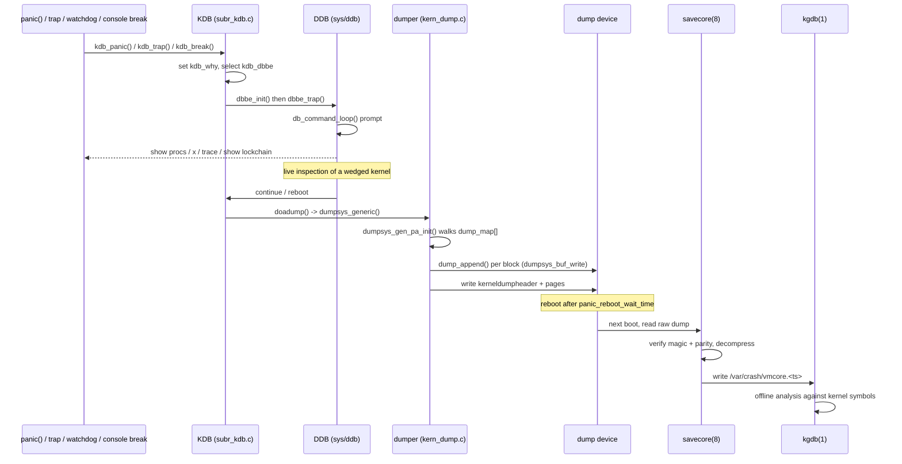

# Kernel Debugging and Crash Analysis — KDB, DDB, dumps, and KTR
<!-- This file is auto-generated by generate-doc.py -- do not edit manually -->

---
**Navigation:**
  **Up:** [Kernel Core — Structure and Entry Point](../README.md) ▸ [Source Tree — Layout and Conventions](../../README_internals.md)
  **Related:** [Kernel Core — Structure and Entry Point](../README.md) | [Locking Primitives — Mutexes, sx, rmlocks, and Atomics](README_locking.md) | [DTrace — Dynamic Tracing Framework](../cddl/dev/dtrace/README.md)
  **All chapters:** [Source Tree — Layout and Conventions](../../README_internals.md) | [Boot Process — UEFI Bootloader to Kernel Handoff](../../stand/efi/loader/README.md) | [Kernel Core — Structure and Entry Point](../README.md) | [Build System — buildworld and buildkernel](../../share/mk/README.md) | [System Calls and Image Activation — Entry, sysent, and exec](README_syscall.md) | [Kernel Modules and the Linker — KLD, SYSINIT, and linker sets](README_kld.md) | [Virtual Memory Subsystem — vm_page, UMA, and Pagers](../vm/README.md) | [Process Management — Scheduling and Lifecycle](README_process.md) ...
---


## Quick Summary

When a FreeBSD kernel wedges, deadlocks, or takes a fatal trap, the ordinary
userland tools are gone: there is no [`ps(1)`](../../bin/ps/ps.1), no [`top(1)`](../../usr.bin/top/top.1), and often no
responsive console. The kernel still has a console, a symbol table, and the
live contents of memory, and a small set of in-kernel facilities is built
exactly to exploit that. This chapter documents that toolchain: **[KDB](#glossary)**
(`sys/kern/subr_kdb.c`), the machine-independent framework that decides *that*
a debugger should run and *which* one; **[DDB](#glossary)** (`sys/ddb/`), the interactive
in-kernel debugger that gives a developer a prompt at the console; the
**panic and crash-dump path** (`sys/kern/kern_shutdown.c` and
`sys/kern/kern_dump.c`) that captures memory to a dump device before rebooting;
and **[KTR](#glossary)** (`sys/kern/kern_ktr.c`), a low-overhead ring-buffer event tracer
for reconstructing the moments just before a hang.

The division of labor is worth stating up front because it is the whole reason
this chapter exists. **DTrace** is the tool for a *healthy, running* system: it
instruments live code paths with probes and lets you observe behavior without
stopping the machine. **DDB, the crash dump, and KTR** are the tools for a
*broken* system: DDB lets you inspect and even poke a wedged kernel, a crash
dump lets you dissect a dead one with `kgdb(1)`, and KTR lets you read back a
timeline of events that a running tracer might never have caught because the
system stopped responding. DTrace can see what a healthy system is doing; this
chapter is about what a broken system did, and how to find out.

The mental model is three layers. At the bottom, KDB is a thin, backend-driven
dispatcher: it is called from `panic()`, from a fatal trap, from a console
break, or from the watchdog, and it hands control to one registered backend. In
the default configuration that backend is DDB. DDB itself is a classic
command-line debugger — a lexer, an expression parser, a symbol table, a memory
examiner, and a set of `show` commands that decode live kernel [state](../netpfil/pf/README.md#glossary) such as
processes, threads, and locks. Above both sits the post-mortem path: when the
kernel cannot be saved, it writes a dump, reboots, and a developer later runs
[`savecore(8)`](../../sbin/savecore/savecore.8) and `kgdb(1)` against the resulting `vmcore`.

## Glossary

**KDB** — the Kernel Debugger *backend* framework (`sys/kern/subr_kdb.c`); it decides whether to enter a debugger and which registered backend to run, but contains no debugger of its own.

**DDB** — the interactive in-kernel debugger in `sys/ddb/`; the default KDB backend that presents a command prompt at the console.

**vmcore** — the on-disk crash-dump file (typically `/var/crash/vmcore.<timestamp>`) produced by the dump path and consumed by [`savecore(8)`](../../sbin/savecore/savecore.8) and `kgdb(1)`.

**minidump** — a kernel crash dump that captures only the memory pages the kernel uses, rather than all of physical memory; the default dump type.

**textdump** — a compact dump that stores captured DDB output, the kernel config, the message buffer, and the panic string as text files instead of raw memory.

**KTR** — the Kernel Trace Recorder (`sys/kern/kern_ktr.c`), a fixed-size ring buffer of timestamped events used to reconstruct what happened before a hang.

**dot** — DDB's "current location" pointer (`db_dot`), analogous to gdb's `$pc`; commands like `x` and `b` operate relative to it.

**WITNESS** — the kernel lock-ordering verifier; its state is surfaced through DDB's `show lockchain` and `show alllocks` commands (its mechanism is covered in the Locking chapter).

**savecore** — the userland [`savecore(8)`](../../sbin/savecore/savecore.8) utility that runs after reboot, reads the raw dump from the dump device, and writes out the `vmcore` and a metadata file.

**kgdb** — the userland `kgdb(1)` front end that drives GDB (GNU Debugger) over a kernel symbol table and a `vmcore` for offline analysis.

## Architecture

The subsystem is organized around a clean separation between the *decision* to
debug and the *act* of debugging. `sys/kern/subr_kdb.c` implements the decision.
It is machine-independent: it knows how to be called from a panic, a trap, a
console break, or the watchdog, and it knows how to select and invoke a backend,
but it does not print a backtrace or parse a command. The backends register
themselves through a [linker set](README_kld.md#glossary). The null backend is always present:

```c
/* sys/kern/subr_kdb.c */
KDB_BACKEND(null, NULL, NULL, NULL, NULL);
```

and DDB registers itself the same way from `sys/ddb/db_main.c`:

```c
/* sys/ddb/db_main.c */
KDB_BACKEND(ddb, db_init, db_trace_self_wrapper, db_trace_thread_wrapper,
    db_trap);
```

The `KDB_BACKEND` macro (in `sys/sys/kdb.h`) builds a `struct kdb_dbbe` and
drops it into the `kdb_dbbe_set` [linker set](../README.md#glossary), so the set of available backends is
discovered at link time rather than maintained in a central table. This is why
the same `panic()` path works whether the operator wants an interactive console
debugger, a remote GDB session over a serial line (selected via
`kdb_alt_break_gdb`), or nothing at all on a production machine (the `null`
backend). The currently selected backend is the global `struct kdb_dbbe
*kdb_dbbe`, and the sysctls `debug.kdb.available` and `debug.kdb.current` (both
defined in `subr_kdb.c`) list and select it at runtime.

Four entry points feed KDB, and each one tags *why* it is entering so DDB can
name the moment. The tag is the global `const char *volatile kdb_why`, whose
values are defined in `sys/sys/kdb.h`:

```c
/* sys/sys/kdb.h */
#define	KDB_WHY_UNSET		NULL		/* No reason set. */
#define	KDB_WHY_PANIC		"panic"		/* panic() was called. */
#define	KDB_WHY_KASSERT		"kassert"	/* kassert failed. */
#define	KDB_WHY_TRAP		"trap"		/* Fatal trap. */
#define	KDB_WHY_SYSCTL		"sysctl"	/* Sysctl entered debugger. */
```

The comment in `kdb.h` notes that these values are deliberately short
alpha-numeric strings "as they will be used to construct DDB(4) script names" —
a small but telling coupling: the reason a debugger was entered becomes the name
of the DDB script that can be pre-loaded for it. The four paths are:

- **Panic.** `panic()`/`vpanic()` in `sys/kern/kern_shutdown.c` call
  `kdb_panic()`, which sets `kdb_why = KDB_WHY_PANIC` and calls `kdb_enter()`.
  Whether a panic actually drops into the debugger is controlled by
  `debugger_on_panic` (a KDB global in `kern_shutdown.c`, defaulting to `1`
  unless `KDB_UNATTENDED` is set).
- **Fatal trap.** The architecture trap handler calls `kdb_trap(int, int,
  struct trapframe *)`, gated by `debugger_on_trap`.
- **Console break.** `kdb_break()` (and `kdb_alt_break()` /
  `kdb_alt_break_gdb()`) are wired to a key sequence — by default Alt+Break —
  and are enabled by the `BREAK_TO_DEBUGGER` / `ALT_BREAK_TO_DEBUGGER` kernel
  options, which `subr_kdb.c` reads into `kdb_break_to_debugger` and
  `kdb_alt_break_to_debugger`.
- **Watchdog.** A CPU that has been spinning without making progress is detected
  by the watchdog (`sys/watchdog.h`, included by both `kern_shutdown.c` and
  `db_command.c`), which forces a panic and therefore a KDB entry. DDB also
  exposes a `watchdog` command for inspecting that state.

Once `kdb_enter()` has picked a backend, it invokes that backend's `dbbe_init`
and `dbbe_trap` hooks. For DDB those lead into `db_command_loop()` in
`sys/ddb/db_command.c`, which is the prompt. From there the developer has the
console and the full live kernel: registers, memory, every process and [thread](README_process.md#glossary),
and the lock state. The `kdb_active` byte (exported from `subr_kdb.c`) is
non-zero for the whole time the debugger owns the console, and it is the flag
other subsystems check to know that normal output is suspended.

The crash-dump path is a separate, deliberately dumb pipeline. After the
debugger hands control back (or when `KDB_UNATTENDED` skips it), `vpanic()`
calls `doadump()` in `kern_shutdown.c`, which drives the generic dumper in
`sys/kern/kern_dump.c`. The dumper walks the physical memory ranges, writes each
block through `dump_append()` to the configured dump device, and then the kernel
reboots (after `panic_reboot_wait_time`, default 15 seconds, a sysctl in
`kern_shutdown.c`). On the next boot, [`savecore(8)`](../../sbin/savecore/savecore.8) reads the raw dump, verifies
its header, and writes out the `vmcore`. KTR is orthogonal to all of this: it is
a ring buffer that is written to by `ktr_tracepoint()` throughout normal
operation and dumped to the console or the dump on demand, so it survives the
panic and can be read either live in DDB or offline from the `vmcore`.

`sys/kern/subr_prf.c` is the plumbing that makes all of the above legible: it
implements the kernel `printf`/`vprintf`, the [`dmesg(8)`](../../sbin/dmesg/dmesg.8) message buffer, and the
routing of output to the console, the tty, and the log. It matters to this
chapter for two reasons — the message buffer is one of the things a [textdump](#glossary) and
a `vmcore` preserve, and because `printf` is *unsafe* in exactly the contexts
where a debugger is most needed (interrupts, held locks, panic), which is why
DDB uses its own `db_printf()` instead of the normal console path.

## Key Data Structures

**`struct kdb_dbbe`** (`sys/sys/kdb.h`) — one registered debugger backend. The
function-pointer fields are the entire contract between the KDB framework and a
backend: `dbbe_init` runs once when the backend is first selected,
`dbbe_trace`/`dbbe_trace_thread` produce a backtrace of the current thread or a
named one, and `dbbe_trap` is entered with the reason and code of a trap.

```c
/* sys/sys/kdb.h */
struct kdb_dbbe {
	const char	*dbbe_name;
	dbbe_init_f	*dbbe_init;
	dbbe_trace_f	*dbbe_trace;
	dbbe_trace_thread_f *dbbe_trace_thread;
	dbbe_trap_f	*dbbe_trap;
	int		dbbe_active;
};
```

The registration macro that builds one of these and adds it to the linker set:

```c
/* sys/sys/kdb.h */
#define	KDB_BACKEND(name, init, trace, trace_thread, trap) 	static struct kdb_dbbe name##_dbbe = {				.dbbe_name = #name,					.dbbe_init = init,					.dbbe_trace = trace,					.dbbe_trace_thread = trace_thread,			.dbbe_trap = trap				};							DATA_SET(kdb_dbbe_set, name##_dbbe)
```

**`struct db_command`** (`sys/ddb/ddb.h`) — one entry in a DDB command table.
DDB does not use a big `switch`; it uses linked lists of these. `name` is the
command word, `fcn` is the handler (or NULL for a sub-table), `flag` carries
syntax hints, and `more` points at a sub-table when this entry is itself a
command group such as `show`.

```c
/* sys/ddb/ddb.h */
struct db_command {
	char *name;		/* command name */
	db_cmdfcn_t *fcn;	/* function to call */
	int flag;
#define	CS_OWN		0x1	/* non-standard syntax */
#define	CS_MORE		0x2	/* standard syntax, but may have other words
				 * at end */
#define	CS_SET_DOT	0x100	/* set dot */
	struct db_command_table *more;
};
```

Every handler has the same signature, `db_cmdfcn_t`, which is why a single
dispatcher can drive them all:

```c
/* sys/ddb/ddb.h */
typedef void db_cmdfcn_t(db_expr_t addr, bool have_addr, db_expr_t count,
	    char *modif);
```

`CS_SET_DOT` (used by `x`/`examine` and `w`/`write`) tells the dispatcher to
update `db_dot` after the command; `DB_CMD_MEMSAFE` (used by `show`, `set`, and
`dump`) marks commands that are still meaningful even if the heap is corrupt —
exactly the commands you want when a panic has already trashed memory.

**`struct db_breakpoint`** (`sys/ddb/db_break.h`) — a hardware or software
breakpoint. The saved instruction `bkpt_inst` is the original instruction that
was patched with a trap; `init_count`/`count` implement "break after N hits".

```c
/* sys/ddb/db_break.h */
struct db_breakpoint {
	vm_map_t map;			/* in this map */
	db_addr_t address;		/* set here */
	int	init_count;		/* number of times to skip bkpt */
	int	count;			/* current count */
	int	flags;			/* flags: */
#define	BKPT_SINGLE_STEP	0x2	    /* to simulate single step */
#define	BKPT_TEMP		0x4	    /* temporary */
	BKPT_INST_TYPE bkpt_inst;	/* saved instruction at bkpt */
	struct db_breakpoint *link;	/* link in in-use or free chain */
};
```

**`struct ktr_entry`** (`sys/sys/ktr.h`) — one record in the KTR ring. Note that
there is no variable-length payload: there are exactly `KTR_PARMS` (6) fixed
`u_long` slots, which is what keeps the record a constant size and the ring a
simple index-and-overwrite structure. The timestamp is a cycle count
(`KTR_TIME` defaults to `get_cyclecount()`), not a wall-clock time.

```c
/* sys/sys/ktr.h */
struct ktr_entry {
	u_int64_t ktr_timestamp;
	int	ktr_cpu;
	int	ktr_line;
	const	char *ktr_file;
	const	char *ktr_desc;
	struct	thread *ktr_thread;
	u_long	ktr_parms[KTR_PARMS];
};
```

**`struct kerneldumpheader`** (`sys/sys/kerneldump.h`) — the 512-byte,
self-describing header that makes a dump usable without the original kernel.
`magic` distinguishes a full dump from a textdump from a cleared one,
`compression` and the separate key record select gzip/zstd and AES/ChaCha20, and
`parity` lets [`savecore(8)`](../../sbin/savecore/savecore.8) reject a torn write. `CTASSERT(sizeof(struct
kerneldumpheader) == 512);` in `kern_dump.c` pins the size.

```c
/* sys/sys/kerneldump.h */
struct kerneldumpheader {
	char		magic[20];
#define	KERNELDUMPMAGIC		"FreeBSD Kernel Dump"
#define	TEXTDUMPMAGIC		"FreeBSD Text Dump"
#define	KERNELDUMPMAGIC_CLEARED	"Cleared Kernel Dump"
	char		architecture[12];
	uint32_t	version;
#define	KERNELDUMPVERSION		4
	uint64_t	dumplength;		/* excl headers */
	uint64_t	dumptime;
	uint32_t	dumpkeysize;
	uint32_t	blocksize;
	char		hostname[64];
	char		versionstring[192];
	char		panicstring[175];
	uint8_t		compression;
	uint64_t	dumpextent;
	char		unused[4];
	uint32_t	parity;
};
```

**`struct msgbuf`** (`sys/sys/msgbuf.h`) — the circular kernel log that backs
[`dmesg(8)`](../../sbin/dmesg/dmesg.8) and is preserved in a textdump. The read/write sequence numbers
(`msg_rseq`/`msg_wseq`) and the `MSGBUF_WRAP` flag are what let a reader tell
that the buffer has wrapped and therefore that the oldest lines are gone.

```c
/* sys/sys/msgbuf.h */
struct msgbuf {
	char	   *msg_ptr;		/* pointer to buffer */
#define	MSG_MAGIC	0x063062
	u_int	   msg_magic;
	u_int	   msg_size;		/* size of buffer area */
	u_int	   msg_wseq;		/* write sequence number */
	u_int	   msg_rseq;		/* read sequence number */
	u_int	   msg_cksum;		/* checksum of contents */
	u_int	   msg_seqmod;		/* range for sequence numbers */
	int	   msg_lastpri;		/* saved priority value */
	u_int      msg_flags;
#define MSGBUF_NEEDNL	0x01	/* set when newline needed */
#define MSGBUF_WRAP	0x02	/* buffer has wrapped around */
	struct mtx msg_lock;		/* mutex to protect the buffer */
};
```

**`struct ddb_script`** (`sys/ddb/db_script.c`) — a named, stored list of DDB
commands. This is the mechanism behind `script`/`run`: the `kdb_why` strings
from above become script names, so a kernel can be configured to run a canned
set of `show` commands the instant it enters DDB for a given reason.

```c
/* sys/ddb/db_script.c */
struct ddb_script {
	char	ds_scriptname[DB_MAXSCRIPTNAME];
	char	ds_script[DB_MAXSCRIPTLEN];
};
```

## Deep Dive

### Entering the debugger

`subr_kdb.c` keeps the debugger's working state in a small set of globals:
`kdb_active` (zero unless the debugger owns the console), `kdb_dbbe` (the chosen
backend), `kdb_thread`, `kdb_thrctx` (a `struct pcb *`, the process context
block that holds the saved register state), `kdb_frame` (the
`struct trapframe *` for trap entries), and a private `struct pcb kdb_pcb`. When
`panic()` runs, the chain is `panic()` → `vpanic()` → (if `debugger_on_panic`)
`kdb_panic()`, which sets `kdb_why` and calls `kdb_enter()`. `kdb_enter()`
selects `kdb_dbbe` (from `debug.kdb.current`), calls its `dbbe_init` once, and
then calls `dbbe_trap`. For DDB, `db_trap` in `db_main.c` ultimately drops into
`db_command_loop()`.

The symbol table is the other half of the setup. DDB needs the kernel's ELF
symbol and string tables to turn addresses into names; these are the globals
`ksymtab`, `kstrtab`, `ksymtab_size`, and `ksymtab_relbase` declared in `ddb.h`.
`db_fetch_ksymtab()` (in `db_main.c`) loads them, and the `X_db_*` functions in
the same file are the backend's answers to the framework's questions about
symbols:

```c
/* sys/ddb/db_main.c */
c_db_sym_t
X_db_lookup(db_symtab_t *symtab, const char *symbol)
{
	c_linker_sym_t lsym;
	Elf_Sym *sym;

	if (symtab->private == NULL) {
		return ((c_db_sym_t)((!linker_ddb_lookup(symbol, &lsym))
			? lsym : NULL));
	} else {
		...
	}
}
```

When `symtab->private` is NULL the symbol is resolved through the live linker
set (`linker_ddb_lookup`), which is how DDB finds symbols in loaded KLDs as well
as in the base kernel; otherwise it walks a raw ELF symtab supplied by a
non-native boot loader.

### Command dispatch

`db_command.c` holds the top-level command table and the loop. The table is a
linked list of `struct db_command`; the built-in entries are declared with the
`DB_CMD` and `DB_TABLE` macros, where `DB_TABLE` names a sub-table (the `more`
field) rather than a function:

```c
/* sys/ddb/db_command.c */
static struct db_command db_show_cmds[] = {
	DB_TABLE("active",	&db_show_active_table),
	DB_TABLE("all",		&db_show_all_table),
	DB_CMD("registers",	db_show_regs,		DB_CMD_MEMSAFE),
	DB_CMD("breaks",	db_listbreak_cmd,	DB_CMD_MEMSAFE),
	DB_CMD("threads",	db_show_threads,	DB_CMD_MEMSAFE),
};
struct db_command_table db_show_table = LIST_HEAD_INITIALIZER(db_show_table);

static struct db_command db_cmds[] = {
	DB_TABLE("show",	&db_show_table),
	DB_CMD("print",		db_print_cmd,		0),
	DB_CMD("p",		db_print_cmd,		0),
	DB_CMD("examine",	db_examine_cmd,		CS_SET_DOT),
	DB_CMD("x",		db_examine_cmd,		CS_SET_DOT),
	DB_CMD("search",	db_search_cmd,		CS_OWN|CS_SET_DOT),
	DB_CMD("set",		db_set_cmd,		CS_OWN|DB_CMD_MEMSAFE),
	DB_CMD("write",		db_write_cmd,		CS_MORE|CS_SET_DOT),
	DB_CMD("w",		db_write_cmd,		CS_MORE|CS_SET_DOT),
	DB_CMD("delete",	db_delete_cmd,		0),
	DB_CMD("d",		db_delete_cmd,		0),
	DB_CMD("dump",		db_dump,		DB_CMD_MEMSAFE),
	...
```

The four built-in tables are declared in `ddb.h` — `db_cmd_table` (top level,
shown by `help`), `db_show_table`, `db_show_all_table`, and
`db_show_active_table` — and the `DB_SHOW_COMMAND` / `DB_SHOW_ALL_COMMAND`
macros in `ddb.h` are how *other* files add to the `show` and `show all` tables
without editing `db_command.c`. That is the key design point: a subsystem that
wants a `show foo` command just registers one, so `show procs` comes from
`db_ps.c`, `show lockchain` and `show alllocks` come from the [WITNESS](#glossary) verifier
(`sys/kern/subr_witness.c`), and [mbuf](../sys/README_mbuf.md#glossary) (the kernel's network packet buffer) decoding
comes from the network stack — none of it is hard-wired into the dispatcher.
The dispatcher itself is `db_command_loop()` (read a line via the lexer in
`db_lex.c`, tokenize it, look the command up in the table, and call `fcn`),
with `db_command_register()` / `db_command_unregister()` maintaining the list
and `db_cmd_match()` / `db_cmd_search()` doing prefix matching.

### Examining memory

`db_examine.c` implements `x`/`examine`. The format string is remembered across
calls in `db_examine_format` (default `"x"`), and each character selects a size
and a rendering. The size letters `b`/`h`/`l`/`g` pick 1/2/4/8 bytes; the
rendering letters then interpret the fetched value:

```c
/* sys/ddb/db_examine.c */
static void
db_examine(db_addr_t addr, char *fmt, int count)
{
	...
	while (--count >= 0 && !db_pager_quit) {
	    fp = fmt;
	    size = 4;
	    while ((c = *fp++) != 0) {
		switch (c) {
		    case 'b': size = 1; break;
		    case 'h': size = 2; break;
		    case 'l': size = 4; break;
		    case 'g': size = 8; break;
		    case 'a':	/* address */
			size = sizeof(void *);
			...
			db_printsym(addr, DB_STGY_ANY);
			db_printf(":	");
			break;
		    default:
			...
			switch (c) {
			    case 'x':	/* unsigned hex */
				value = db_get_value(addr, size, false);
				addr += size;
				db_printf("%-*lx", width, (long)value);
				break;
			    ...
```

Two things stand out. Memory is read through `db_get_value()` (in
`db_access.c`), which is the *only* place DDB touches kernel memory for reads —
and it is written through `db_put_value()`. Concentrating all memory access in
two functions is what lets the kernel keep DDB usable even when a page is
unmapped or the address is bogus: the access is fault-checked rather than
assumed valid. Second, every line of output goes through `db_printf()` (in
`db_output.c`), which is DDB's own pager-aware printer, not the kernel's
`printf()`. The `db_pager_quit` check in the loop is what lets the operator
scroll a long listing one screen at a time.

### Decoding live state: `show procs`

`db_ps.c` is the model `show` command. It registers itself into the `show all`
table with a one-line wrapper, then walks the live process list:

```c
/* sys/ddb/db_ps.c */
DB_SHOW_ALL_COMMAND(procs, db_procs_cmd)
{
	db_ps(addr, have_addr, count, modif);
}

void
db_ps(db_expr_t addr, bool hasaddr, db_expr_t count, char *modif)
{
	struct proc *p;
	int i;

	ps_mode = modif[0] == 'a' ? PRINT_ARGS : PRINT_NONE;

#ifdef __LP64__
	db_printf("  pid  ppid  pgrp   uid  state   wmesg   wchan               cmd
");
#else
	db_printf("  pid  ppid  pgrp   uid  state   wmesg   wchan       cmd
");
#endif

	if (!LIST_EMPTY(&allproc))
		p = LIST_FIRST(&allproc);
	else
		p = &proc0;
	for (; p != NULL && !db_pager_quit; p = LIST_NEXT(p, p_list))
		db_ps_proc(p);

	/*
	 * Processes such as zombies not in allproc.
	 */
	for (i = 0; i <= pidhash && !db_pager_quit; i++) {
		LIST_FOREACH(p, &pidhashtbl[i], p_has...
```

The column layout (`pid ppid pgrp uid state wmesg wchan cmd`) is the same as
[`ps(1)`](../../bin/ps/ps.1), and the `wmesg`/`wchan` fields are the ones that matter for a wedge:
`wchan` is the symbol a thread is blocked in, and `wmesg` is the message. For a
multi-threaded process, `db_ps_proc()` calls `dumpthread()` for each thread, so
you see every thread's state and wait channel. Reading `show procs` on a wedged
system is usually the first move: a [cluster](../sys/README_mbuf.md#glossary) of threads all parked in the same
`wchan` is the signature of a lock or a CV they are all waiting on.

### The panic-to-dump path

`kern_shutdown.c` owns `panic()`, `vpanic()`, and `doadump()`. The relevant
knobs live at the top of the file:

```c
/* sys/kern/kern_shutdown.c */
#ifndef PANIC_REBOOT_WAIT_TIME
#define PANIC_REBOOT_WAIT_TIME 15 /* default to 15 seconds */
#endif
static int panic_reboot_wait_time = PANIC_REBOOT_WAIT_TIME;
SYSCTL_INT(_kern, OID_AUTO, panic_reboot_wait_time, CTLFLAG_RWTUN,
    &panic_reboot_wait_time, 0,
    "Seconds to wait before rebooting after a panic");
...
#ifdef KDB
#ifdef KDB_UNATTENDED
int debugger_on_panic = 0;
#else
int debugger_on_panic = 1;
```

So the sequence after a panic is: print the message, enter the debugger (unless
`KDB_UNATTENDED`), and on the way out call `doadump()` to write the dump, then
reboot after `panic_reboot_wait_time`. The actual writing is in `kern_dump.c`,
whose entry point for the generic dumper is `dumpsys_generic()`, reached on x86
through the thin wrapper in `sys/x86/include/dump.h`:

```c
/* sys/x86/include/dump.h */
static inline int
dumpsys(struct dumperinfo *di)
{

	return (dumpsys_generic(di));
}
```

`kern_dump.c` buffers the output in `di->blockbuf` (a `KERNELDUMP_BUFFER_SIZE`,
i.e. 4096-byte, block) and only calls `dump_append()` when a block is full —
see `dumpsys_buf_write()` and `dumpsys_buf_flush()`. The physical ranges come
from `dump_map[]`, built by `dumpsys_gen_pa_init()` from the `dump_avail`
pairs; `dumpsys_gen_pa_next()` walks them. Each range is handed to
`dumpsys_cb_dumpdata()`, which maps a chunk, writes it, and unmaps it
(`dumpsys_gen_unmap_chunk()`), so the dumper never holds more than one chunk of
physical memory mapped at a time. The header written first is the
`struct kerneldumpheader` from the Key Data Structures section, and the
compression/encryption selection (`KERNELDUMP_COMP_GZIP`/`ZSTD`,
`KERNELDUMP_ENC_AES_256_CBC`/`CHACHA20`) is what the crypto includes at the top
of `kern_shutdown.c` (`chacha.h`, `rijndael-api-fst.h`, `sha256.h`) back.

On reboot, [`savecore(8)`](../../sbin/savecore/savecore.8) reads the dump device, checks the `magic` and `parity`
in the header, decompresses/decrypts if needed, and writes
`vmcore.<timestamp>` plus a metadata file to the dumpdir (default
`/var/crash`). The handbook is
explicit that `savecore` must run *before* the swap device is mounted, because
the dump device may be a swap partition — and that `/var/crash` is sensitive,
since a dump can contain passwords and keys.

### Post-mortem analysis with kgdb

The dump is only half the job: the other half is reading it. `kgdb(1)` is a
thin wrapper around GDB (GNU Debugger) that knows how to load a FreeBSD kernel
and its `vmcore` together, so that the ELF debug info in the kernel maps every
address in the dump back to a function name, source file, and line number. The
launch command is:

```
# kgdb /boot/kernel/kernel /var/crash/vmcore.0
```

The first argument is the exact `kernel` binary that produced the panic (it
must match the `vmcore`'s `versionstring`); the second is the dump file
[`savecore(8)`](../../sbin/savecore/savecore.8) wrote out. Once loaded, [kgdb](#glossary) stops at the panic point, with the
registers and stack frame of the panicking thread already in place.

A typical post-mortem session starts with `bt` (backtrace), which prints the
call stack from the panic point upward. This is the single most informative
command: it tells you *where* the kernel died, and the frames below the panic
call are the code that was running when the fatal condition was hit.

```
(kgdb) bt
#0  0xffffffff802c8a1b in panic at /usr/src/sys/kern/kern_shutdown.c:531
#1  0xffffffff802c8b2c in vpanic at /usr/src/sys/kern/kern_shutdown.c:558
#2  0xffffffff803a1f03 in witness_debugger at /usr/src/sys/kern/subr_witness.c:1102
#3  0xffffffff803a2011 in witness_checkorder at /usr/src/sys/kern/subr_witness.c:1345
#4  0xffffffff802c9d44 in __mtx_lock_flags at /usr/src/sys/kern/kern_mutex.c:268
#5  0xffffffff80412309 in ugen_probe at /usr/src/sys/dev/usb/usb_device.c:412
```

To inspect a specific stack frame, use `frame <N>` to select it, then examine
the local variables in that frame. Here frame 4 is the lock acquisition that
triggered the WITNESS violation:

```
(kgdb) frame 4
#4  0xffffffff802c9d44 in __mtx_lock_flags at /usr/src/sys/kern/kern_mutex.c:268
268     if (mtx_owned(mtx))
(kgdb) p mtx
$1 = (struct mtx *) 0xffffffff81234567
(kgdb) p *mtx
$2 = {mtx_lock = 0xffffffff81234567, mtx_type = 1, mtx_flags = 0, ...}
```

`p <variable>` (print) reads the value of any named kernel variable or
expression, using the ELF debug info to find its address and type. `x`
(examine) reads raw memory at an address, e.g. `x/8gx 0xffffffff81234567` dumps
eight 8-byte words starting there. `info threads` lists every thread captured
in the dump, which is the post-mortem equivalent of DDB's `show procs`:

```
(kgdb) info threads
  Id   Target Id         Frame
* 1    LWP 0 (swi0)      0xffffffff802c8a1b in panic ()
  2    LWP 10 (usb0)     0xffffffff80412309 in ugen_probe ()
  3    LWP 42 (nfs4io)   0xffffffff80388f21 in nfsrpc_getattr1 ()
```

The asterisk marks the thread kgdb is currently examining (the one that
panicked). You can switch to any other thread with `thread <N>` and then run
`bt` on it, which is the post-mortem equivalent of DDB's `trace <pid>`.

**Correlating with live DDB output.** The panic backtrace from kgdb should
correlate directly with what you would have gotten live in DDB: the `bt` frames
below `vpanic` are the same call stack that DDB's `trace` command prints, and
the `info threads` list is the same process/thread table that `show procs`
displays, with each thread's top frame corresponding to its `wchan`. If you had
a console at the time of the panic, the DDB `show procs` / `trace` output is a
faster first look; kgdb is what you use after the fact when the machine has
already rebooted and only the `vmcore` remains. The two views should agree —
if they do not, the `vmcore` was not produced by the kernel binary you pointed
kgdb at (see the symbol-table pitfall in Advanced Notes).

### KTR: the ring buffer

`kern_ktr.c` is small and allocation-free, which is the whole point. The buffer
is a fixed array indexed by a single volatile counter:

```c
/* sys/kern/kern_ktr.c */
volatile int	ktr_idx = 0;
uint64_t ktr_mask = KTR_MASK;
uint64_t ktr_compile = KTR_COMPILE;
int	ktr_entries = KTR_BOOT_ENTRIES;
int	ktr_version = KTR_VERSION;
struct	ktr_entry ktr_buf_init[KTR_BOOT_ENTRIES];
struct	ktr_entry *ktr_buf = ktr_buf_init;
cpuset_t ktr_cpumask = CPUSET_T_INITIALIZER(KTR_CPUMASK);
```

`ktr_buf` starts as a static boot-time array (`ktr_buf_init`,
`KTR_BOOT_ENTRIES` = 1024) and can be grown at runtime up to `KTR_ENTRIES_MAX`
(8 MB) via the `debug.ktr.*` sysctls. `ktr_mask` is the runtime filter,
`ktr_compile` is the compile-time mask of which event classes were built in, and
`ktr_cpumask` selects which CPUs record. The recording side is the `CTR0`–`CTR6`
macros in `sys/sys/ktr.h`, which expand to `ktr_tracepoint()` only if the class
was compiled in:

```c
/* sys/sys/ktr.h */
#define CTR6(m, format, p1, p2, p3, p4, p5, p6) do {				if (KTR_COMPILE & (m))								ktr_tracepoint((m), __FILE__, __LINE__, format,				    (u_long)(p1), (u_long)(p2), (u_long)(p3),				    (u_long)(p4), (u_long)(p5), (u_long)(p6));			} while (0)
```

Because a tracepoint is a single store into a pre-allocated slot (no malloc, no
lock, no console I/O), the overhead is a few instructions and it is safe in the
tight contexts — interrupts, locked sections — where a real tracer would be
forbidden. That is precisely the regime a hang lives in, which is why KTR is the
right tool for "what was the last thing this CPU did before it stopped making
progress."

### The message buffer and why printf is unsafe

`subr_prf.c` routes kernel output along three flags — `TOCONS` (0x01), `TOTTY`
(0x02), `TOLOG` (0x04) — combining console, tty, and the message buffer. The
buffer itself is the `struct msgbuf` above, guarded by `msg_lock`. Two globals
gate it: `msgbufp` (the buffer pointer) and `msgbufmapped`, which the source
comments describe as "Set when safe to use msgbuf". The reason printf is unsafe
in some contexts is now concrete: writing to the log takes `msg_lock`, and
writing to the console/tty can block. If you are in an interrupt, holding the
lock that `msg_lock`'s owner needs, or already inside `panic()`, taking that
mutex or sleeping is exactly what will deadlock the machine. DDB therefore never
calls the kernel `printf`; it uses `db_printf()` and the pager in `db_output.c`,
and the crash path captures the *already-written* message buffer (via
`msgbuf_copy()`/`msgbuf_getbytes()`) into the dump rather than trying to print
new output. The `BOOT_TAG` string `"---<<BOOT>>---"` in `subr_prf.c` is the
marker [`dmesg(8)`](../../sbin/dmesg/dmesg.8) uses to find the start of the current boot in a wrapped
buffer.

## Flow / Diagram

The diagram below traces the two halves of the chapter: the live path (how a
fault reaches the DDB prompt) and the post-mortem path (how memory becomes a
`vmcore` that `kgdb(1)` can read).



KTR sits outside this sequence: it is written to by `ktr_tracepoint()` during
normal operation and is read either live (a DDB command) or offline from the
`vmcore`, so it does not appear as a step in the fault-to-dump flow but rather
as a side channel that records the lead-up to it.

## Advanced Notes

**Choosing the right tool.** The decision tree is about *state*, not about
preference. If the system is still responsive, DTrace is the tool: it can [attach](README_driver.md#glossary)
probes to a running kernel, sample, and report without stopping anything, and it
can be left enabled in production. If the system has wedged but a console still
answers, DDB is the tool — you can `show procs`, `trace`, set breakpoints, and
single-step, none of which a post-mortem dump can do. If the system has panicked
and rebooted, the `vmcore` and `kgdb(1)` are the tool: you get the full ELF
debug information and can script the analysis. KTR is the tie-breaker for the
hardest case — a hang where the console is dead and there is no dump, or a race
you can only see as a sequence of events — because it is the only one of the
four that records *before* the failure and survives being in an interrupt or
holding a lock.

**Reading a deadlock.** The standard DDB sequence for a suspected lock inversion
is: `show procs` to find the threads and their `wchan`, `trace <pid>` to see the
call stack of the blocked thread, and then `show lockchain` / `show alllocks`
to see which [lock object](README_locking.md#glossary) is held and by whom. The first two are DDB's own
(`db_ps.c`, `db_stack_trace()`); the last two are registered by WITNESS, and
this chapter deliberately does not re-derive how WITNESS builds its lock
chains — see the Locking chapter for that. What matters here is that the *state*
WITNESS maintains is exposed through the same `DB_SHOW_COMMAND` mechanism as
`show procs`, so a verifier and a debugger share one command surface.

**Why DDB can touch memory safely but printf cannot.** The asymmetry is the
single most important subtlety in this chapter. `db_get_value()`/`db_put_value()`
(`db_access.c`) route every DDB memory access through a fault-checked path, so a
bad pointer degrades to an error message instead of a second panic. The kernel
`printf()` (`subr_prf.c`) takes `msg_lock` and may block on the console; doing
that while holding the very lock the console driver needs, or from an interrupt,
or after a panic has already torn down the world, is how a debugging aid becomes
the bug. This is why the panic path *captures* the message buffer rather than
printing, and why DDB has its own `db_printf()`.

**Dump size and type.** A [minidump](#glossary) (the default) writes only kernel-resident
pages, which is why it is small enough to fit on a swap partition and why it
captures essentially everything needed for a kernel bug — kernel state lives in
kernel memory. A full dump writes all of physical memory and is rarely needed
for a kernel panic but is the only way to inspect user state. A textdump
(`db_textdump.c`) is the opposite extreme: it writes captured DDB output, the
kernel config, the message buffer, and the panic string as a set of text files
wrapped in `ustar_header` archives, so you can read the crash without a matching
`kgdb(1)` or even the original kernel binary. The `magic` field in
`struct kerneldumpheader` is what tells [`savecore(8)`](../../sbin/savecore/savecore.8) which of the three it is
looking at.

**Performance and pitfalls.** KTR's cost is a single indexed store per
tracepoint, but the buffer is a fixed ring: if the event rate exceeds the
buffer's capacity, the oldest entries are silently overwritten, so a long,
quiet, then-busy period can leave only the tail. Size it with `debug.ktr.*`
before you need it. DDB has no real memory protection — a `write` to the wrong
address can corrupt the live kernel, so treat DDB as a live-wire tool. And
remember the dump is only as good as its symbol table: `kgdb(1)` needs the exact
kernel that produced the `vmcore`; if you booted a different kernel after the
panic, you must point [`savecore(8)`](../../sbin/savecore/savecore.8) at the right one, or the addresses will not
resolve.

**Theory connection.** The split between a live debugger and a core dump is the
same split that exists in every userland debugger: `gdb(1)` attached to a
running process versus `gdb(1)` on a core file. FreeBSD's contribution is doing
it in-kernel, where the "process" is the whole machine and the "core file" is
physical memory. KTR is the analogue of a userspace trace or `strace(1)` that
keeps running when the process stops responding — a bounded, lock-free log of
what the kernel was doing, rather than a live [probe](README_driver.md#glossary) that requires the kernel to
cooperate.

## See Also
- [DTrace — Dynamic Tracing Framework](../cddl/dev/dtrace/README.md)
- [Kernel Core — Structure and Entry Point](../README.md)
- [Locking Primitives — Mutexes, sx, rmlocks, and Atomics](README_locking.md)


- **Locking chapter** ([`sys/kern/README_locking.md`](README_locking.md)) — the WITNESS lock
  verifier's mechanism; this chapter only shows how its state is surfaced via
  `show lockchain` and `show alllocks`.
- **DTrace** — the complementary *live/dynamic* tracing tool for a healthy
  running system; this chapter covers the *broken* system.
- **Process Management** ([`sys/kern/README_process.md`](README_process.md)) — the `struct proc` /
  `struct thread` layout that `db_ps.c` walks.
- **Virtual Memory** ([`sys/vm/README.md`](../vm/README.md)) — the page and object state that a
  `vmcore` preserves and `kgdb(1)` inspects.

Key source directories: `sys/ddb/` (the debugger), `sys/kern/subr_kdb.c` (the
backend framework), `sys/kern/kern_shutdown.c` and `sys/kern/kern_dump.c` (the
panic and dump path), `sys/kern/kern_ktr.c` (KTR), and `sys/kern/subr_prf.c`
(the message buffer). Man pages: [`ddb(4)`](../../share/man/man4/ddb.4), `kgdb(1)`, [`savecore(8)`](../../sbin/savecore/savecore.8), `kdb(4)`,
`msgbuf(9)`, `ddb(9)`.

---

> _Generated by [DaemonDocs](https://github.com/ocochard/DaemonDocs) on 2026-09-01 05:24 UTC using model `Qwen3.8-27B-Q8_0` (llama.cpp build `b10553-cd26896c1`). AI-generated content — verify against source before relying on it._
