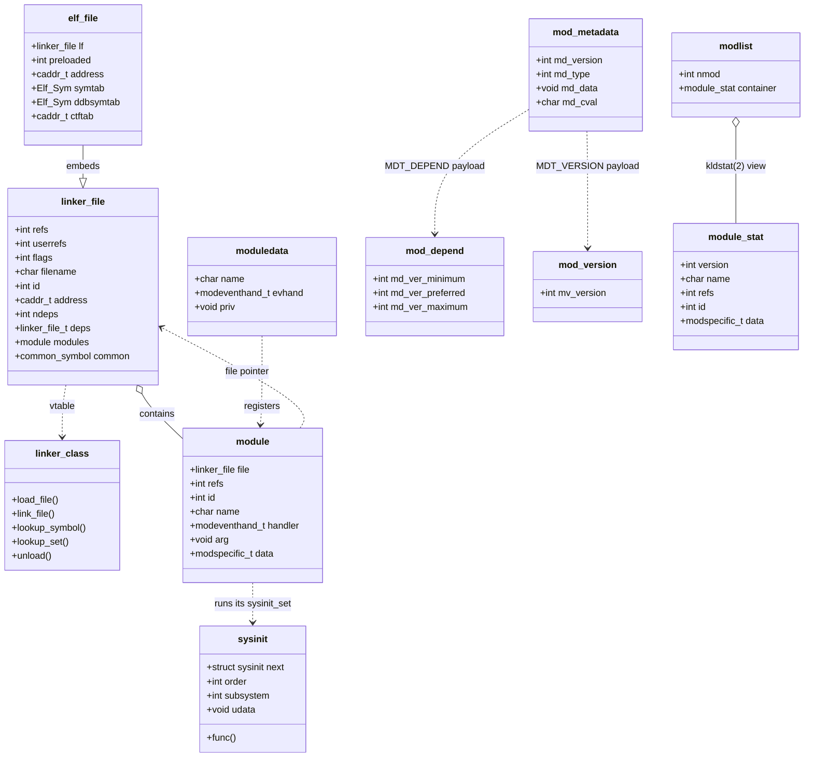

# Kernel Modules and the Linker — KLD, SYSINIT, and linker sets
<!-- This file is auto-generated by generate-doc.py -- do not edit manually -->

---
**Navigation:**
  **Up:** [Kernel Core — Structure and Entry Point](../README.md) ▸ [Source Tree — Layout and Conventions](../../README_internals.md)
  **Related:** [Kernel Core — Structure and Entry Point](../README.md) | [System Calls and Image Activation — Entry, sysent, and exec](README_syscall.md) | [Device Driver Framework — newbus and devclass](README_driver.md)
  **All chapters:** [Source Tree — Layout and Conventions](../../README_internals.md) | [Boot Process — UEFI Bootloader to Kernel Handoff](../../stand/efi/loader/README.md) | [Kernel Core — Structure and Entry Point](../README.md) | [Build System — buildworld and buildkernel](../../share/mk/README.md) | [System Calls and Image Activation — Entry, sysent, and exec](README_syscall.md) | [Virtual Memory Subsystem — vm_page, UMA, and Pagers](../vm/README.md) | [Process Management — Scheduling and Lifecycle](README_process.md) | [Locking Primitives — Mutexes, sx, rmlocks, and Atomics](README_locking.md) ...
---

## Quick Summary

FreeBSD can add code to a running kernel without rebooting. The mechanism is the
*dynamic kernel linker* ([KLD](#glossary)), the successor to the old LKM facility. A KLD is a
small [relocatable object](#glossary) file (a `.ko`) that the kernel maps into its own address
space, resolves against the symbols the kernel already exports, and then runs.
The whole thing is built on one abstraction: the *[linker file](#glossary)*. A linker file is
an in-kernel object that represents "something that has been loaded and can be
queried for symbols, sets, and modules." The kernel image itself is a linker
file, and every `.ko` you load becomes one. Because they all speak the same
interface, the rest of the kernel does not care whether a symbol came from the
statically-linked kernel or from a module you just loaded.

On top of the linker file sits the *module registry*. A linker file may contain
zero or more *modules*, each of which is a named unit of functionality with a
single event handler. The handler is called with `MOD_LOAD` when the module
comes up and `MOD_UNLOAD` when it goes away; it returns `0` on success or an
error, and a non-zero `MOD_UNLOAD` is what stops the file from being unloaded
while it is still in use. Modules are reference-counted, and a module can declare
that it depends on another module with a particular version range, so the linker
will not load a driver until the bus it needs is present.

Two declarative mechanisms make all of this work without any hand-edited call
chains. The first is the *[linker set](#glossary)*: a way for independently-compiled files to
contribute entries to one shared table — sysctls, `SYSINIT`s, device methods —
that the linker assembles into a contiguous block of memory at link time. The
second is `SYSINIT`/`SYSUNINIT`: a framework that records a startup function
together with a numeric *subsystem* and *order* key, so that initialization runs
in a deterministic dependency order. A loadable module uses the same `SYSINIT`
macro as the static kernel, and when the module is loaded its `SYSINIT`s are
processed so the module can slot its initialization in at exactly the right point
relative to subsystems that are already running.

The boot loader is involved before any of this runs. When you tell the loader to
[preload](#glossary) a module, it does not load the module itself — it emits a small metadata
record (the *preload* list) that the kernel walks at boot. The kernel reads that
list, finds each preloaded `.ko`, and links it in as a normal linker file. So
"preloading" is really just "here is a list of files the kernel should link
early," and the kernel's own module-loading code does the rest.

## Glossary

**KLD** — Kernel Loadable Driver; a FreeBSD relocatable object (`.ko`) that the dynamic kernel linker maps into the running kernel and resolves against kernel symbols.
**linker file** — the in-kernel object (`struct linker_file`) that represents any loaded ELF image, whether it is the kernel itself or a `.ko`; it is the unit the kernel queries for symbols, sets, and modules.
**linker class** — the vtable (`struct linker_class`) of load/link/lookup methods for one object format; there is an ELF class for the kernel image and a second one for relocatable objects.
**relocatable object** — an ELF file of type `ET_REL` whose code and data are not at their final addresses; the linker fills in the real addresses from relocations at load time.
**relocation** — a record saying "at this offset, add the address of this symbol"; the linker applies it when it knows where the symbol actually lives.
**linker set** — a named collection of pointers that the linker assembles into one contiguous segment (bounded by `__start_set_`/`__stop_set_` symbols) so independently-compiled files can contribute entries to a shared table.
**SYSINIT** — a macro that registers a startup function with a numeric `subsystem` and `order` key; the kernel sorts all registrations and calls them in ascending order.
**preload** — the metadata block the boot loader passes to the kernel listing modules to link early; the kernel (not the loader) actually loads them.
**module event** — one of `MOD_LOAD`, `MOD_UNLOAD`, `MOD_SHUTDOWN`, `MOD_QUIESCE`; the four states the module registry drives a module's event handler through.
**common symbol** — an ELF symbol with no assigned section (an uninitialized global); the linker must allocate storage for it when it links a relocatable object.

## Architecture

The subsystem is split across a small number of files in `sys/kern/`, with the
public interfaces in `sys/sys/`.

`sys/kern/kern_linker.c` is the format-agnostic core. It owns the global [state](../netpfil/pf/README.md#glossary):
the list of loaded `linker_file`s (`linker_files`), the list of registered
`linker_class`es (`classes`), the next file id, and a load counter (`loadcnt`)
that clients use to detect that a file has been replaced. It is protected by a
single `sx` lock, `kld_sx`, plus a `kld_busy` counter and `kld_busy_owner`
[thread](README_process.md#glossary) pointer that serialize the load/unload critical section. The [`kldload(2)`](../../lib/libsys/kldload.2),
[`kldunload(2)`](../../lib/libsys/kldunload.2), [`kldstat(2)`](../../lib/libsys/kldstat.2), and [`kldfind(2)`](../../lib/libsys/kldfind.2) syscalls all funnel through this
file. It also exposes `kld_off_address`, `kld_off_filename`,
`kld_off_pathname`, and `kld_off_next` — the `offsetof` values the kernel
debuggers ([DDB](README_kdb.md#glossary), the kernel's built-in debugger, accessible via a serial console
or Ctrl+At, and GDB) need to walk the file list without hardcoding the struct
layout.

`sys/kern/link_elf.c` and `sys/kern/link_elf_obj.c` are the two ELF backends.
Both define their own `struct elf_file` that begins with a `struct linker_file
lf;` member (the common fields), and both register a `linker_class` whose
methods implement the load, link, symbol-lookup, set-lookup, and unload
operations. `link_elf.c` handles the statically-linked kernel image and
preloaded linked images: it resolves symbols through the image's own dynamic
symbol table (`DT_SYMTAB`, `DT_STRTAB`, `DT_HASH`) and applies the image's
relocations (`DT_REL`/`DT_RELA`, `DT_JMPREL`) through the GOT/PLT.
`link_elf_obj.c` handles relocatable `.ko` objects: it walks the section
headers, maps the sections into a VM object, allocates a load address, and
applies per-section relocations (`relatab`/`reltab`) resolved against the
kernel's symbols, allocating storage for common symbols as it goes.

`sys/kern/kern_module.c` is the module registry. It maintains a `TAILQ` of
`struct module` protected by `modules_sx`, a `nextid` counter, and a
`modevent_nop` default handler. It is initialized by a `SYSINIT` at
`SI_SUB_KLD`, and it registers a `shutdown_final` event handler
(`module_shutdown`) so that every module's `MOD_SHUTDOWN` runs at reboot. The
`DECLARE_MODULE` macro (defined in `sys/sys/module.h`) is what a module uses to
publish itself; the linker's module-registration pass turns each declaration
into a `struct module` and calls the handler with `MOD_LOAD`.

`sys/kern/subr_module.c` implements the *preload* support. It walks the
metadata block the loader handed the kernel (`preload_metadata`), matching
records by name (`preload_search_by_name`) or by type
(`preload_search_by_type`), and exposes the type tags `preload_modtype`,
`preload_kerntype`, and `preload_modtype_obj` so the kernel can tell a module
record from a kernel record. The kernel calls into these to find preloaded
files and link them in early.

`sys/sys/linker_set.h` and `sys/sys/kernel.h` provide the two declarative
mechanisms. `linker_set.h` defines `DATA_SET`, `TEXT_SET`, `SET_DECLARE`,
`SET_BEGIN`, `SET_LIMIT`, `SET_FOREACH`, and `SET_COUNT`. `kernel.h` defines the
`SI_SUB_*` subsystem enum and the `SYSINIT`/`SYSUNINIT` macros. The Kernel Core
chapter covers the full boot-time ordering of the static kernel; here we treat
`SYSINIT` as the [hook](../netgraph/README.md#glossary) a *module* uses to insert its own initialization.

## Key Data Structures

The loadable-file abstraction lives in `sys/sys/linker.h`. The central object is
`struct linker_file`:

```c
struct linker_file {
    KOBJ_FIELDS;
    int			refs;		/* reference count */
    int			userrefs;	/* kldload(2) count */
    int			flags;
#define LINKER_FILE_LINKED	0x1	/* file has been fully linked */
#define LINKER_FILE_MODULES	0x2	/* file has >0 modules at preload */
    TAILQ_ENTRY(linker_file) link;	/* list of all loaded files */
    char*		filename;	/* file which was loaded */
    char*		pathname;	/* file name with full path */
    int			id;		/* unique id */
    caddr_t		address;	/* load address */
    size_t		size;		/* size of file */
    caddr_t		ctors_addr;	/* address of .ctors/.init_array */
    size_t		ctors_size;	/* size of .ctors/.init_array */
    enum {
	    LF_NONE = 0,
	    LF_CTORS,
	    LF_DTORS,
    } ctors_invoked;			/* have we run ctors yet? */
    caddr_t		dtors_addr;	/* address of .dtors/.fini_array */
    size_t		dtors_size;	/* size of .dtors/.fini_array */
    int			ndeps;		/* number of dependencies */
    linker_file_t*	deps;		/* list of dependencies */
    STAILQ_HEAD(, common_symbol) common; /* list of common symbols */
    TAILQ_HEAD(, module) modules;	/* modules in this file */
    TAILQ_ENTRY(linker_file) loaded;	/* preload dependency support */
    int			loadcnt;	/* load counter value */
    ...
};
```

The `refs` field is the kernel's internal reference count (held by the linker
while the file is being linked and by dependent files); `userrefs` counts the
explicit [`kldload(2)`](../../lib/libsys/kldload.2) references from userland. A file is only freed when both
drop to zero. The `ndeps`/`deps` pair records the *reverse* dependency list —
which files depend on this one — which is what makes [`kldunload(2)`](../../lib/libsys/kldunload.2) refuse to
remove a file that is still needed. The `common` list holds the common symbols
the relocatable-object backend had to allocate. The `modules` list is the set of
modules declared in this file. The `ctors_invoked` enum tracks whether the file's
`.ctors`/`.init_array` (and later `.dtors`/`.fini_array`) have been run, which
matters for C++ modules and for SDT probes.

The format vtable is `struct linker_class`; the method set is declared in
`sys/kern/linker_if.m` (compiled into `linker_if.h`). The load-time methods are
`load_file`, `link_file`, `link_preload`, and `link_preload_finish`; the
query methods are `lookup_symbol`, `lookup_debug_symbol`, `symbol_values`,
`search_symbol`, `each_function_name`, `each_function_nameval`, and
`lookup_set`; and `unload` releases the file. Both ELF backends fill in one of
these.

The module registry's record is `struct module` in `sys/kern/kern_module.c`:

```c
struct module {
	TAILQ_ENTRY(module)	link;	/* chain together all modules */
	TAILQ_ENTRY(module)	flink;	/* all modules in a file */
	struct linker_file	*file;	/* file which contains this module */
	int			refs;	/* reference count */
	int 			id;	/* unique id number */
	char 			*name;	/* module name */
	modeventhand_t 		handler;	/* event handler */
	void 			*arg;	/* argument for handler */
	modspecific_t 		data;	/* module specific data */
};
```

There are two list links: `link` chains *all* modules in the kernel (used at
shutdown to walk them in reverse), and `flink` chains the modules that belong to
one `linker_file` (used when the file is unloaded). `refs` is the module's own
reference count, incremented by `module_hold` and by dependents. `data` is the
`modspecific_t` union a module can stuff with a value that [`kldstat(2)`](../../lib/libsys/kldstat.2) reports
to userland.

The declarations a module author writes come from `sys/sys/module.h`. The event
types and the event-handler type are:

```c
typedef enum modeventtype {
	MOD_LOAD,
	MOD_UNLOAD,
	MOD_SHUTDOWN,
	MOD_QUIESCE
} modeventtype_t;

typedef struct module *module_t;
typedef int (*modeventhand_t)(module_t, int /* modeventtype_t */, void *);
```

The static registration record is `moduledata_t`, and the metadata records are
`mod_depend`, `mod_version`, and `mod_metadata`:

```c
typedef struct moduledata {
	const char	*name;		/* module name */
	modeventhand_t  evhand;		/* event handler */
	void		*priv;		/* extra data */
} moduledata_t;

struct mod_depend {
	int	md_ver_minimum;
	int	md_ver_preferred;
	int	md_ver_maximum;
};

struct mod_version {
	int	mv_version;
};

struct mod_metadata {
	int		md_version;	/* structure version MDTV_* */
	int		md_type;	/* type of entry MDT_* */
	const void	*md_data;	/* specific data */
	const char	*md_cval;	/* common string label */
};
```

`mod_metadata` is the common envelope for every kind of module metadata;
`md_type` is one of `MDT_DEPEND`, `MDT_MODULE`, `MDT_VERSION`, or `MDT_PNP_INFO`,
and `md_data` points at the type-specific payload (a `mod_depend`, a
`moduledata_t`, a `mod_version`, or a `mod_pnp_match_info`). All of these are
gathered into the `modmetadata_set` linker set, which is why a module's
`MODULE_DEPEND` and `MODULE_VERSION` need no central registration.

The `SYSINIT` record is `struct sysinit` in `sys/sys/kernel.h`, populated by the
`SYSINIT` macro:

```c
struct sysinit {
	void		(*func)(void *);
	struct sysinit	*next;
	int		order;
	int		subsystem;
	void		*udata;
};
```

The `subsystem` and `order` fields are the sort key; the kernel sorts all
`sysinit`s by `(subsystem, order)` before calling them. A module's `SYSINIT`s
land in the module's own `sysinit_set`, which the linker processes when the
module is loaded.

## Deep Dive

### Loading a file: [`kldload(2)`](../../lib/libsys/kldload.2) and the linker class

[`kldload(2)`](../../lib/libsys/kldload.2) in `sys/kern/kern_linker.c` takes a path, searches the configured
search path for the file, and asks the appropriate `linker_class` to load it.
The class's `load_file` method maps the file into kernel memory and returns a
fresh `linker_file`. The core then takes the file through a fixed sequence:

1. **Link.** The class's `link_file` method resolves the file's relocations and
   symbols. For the kernel-image backend this means walking the dynamic symbol
   table; for the relocatable-object backend it means applying per-section
   relocations against the kernel's symbols. On success the
   `LINKER_FILE_LINKED` flag is set.
2. **Run constructors.** If the file has a `.ctors`/`.init_array` section, the
   linker calls each constructor and records it in `ctors_invoked`.
3. **Register modules.** The linker reads the file's `modmetadata_set` (via the
   class's `lookup_set` method) and, for each `MDT_MODULE` record, creates a
   `struct module` and drives its handler with `MOD_LOAD`. This is where
   `DECLARE_MODULE` actually takes effect.
4. **Process the module's sets.** The file's `sysinit_set` is walked and each
   `SYSINIT` is run, so the module's initialization runs at load time. Its
   sysctls, device methods, and other sets become visible to the rest of the
   kernel.
5. **Reference it.** `userrefs` is incremented and the file is added to the
   `linker_files` list.

The whole sequence runs with `kld_sx` held and `kld_busy` incremented so that a
concurrent unload cannot race the load.

### The two ELF backends, and how they resolve symbols

Both backends start from the same `struct linker_file lf;` and expose the same
`linker_class`, but they differ in the ELF type they accept and in how they
resolve symbols.

`link_elf.c` handles the kernel image and preloaded linked images. Its
`struct elf_file` caches the dynamic linking information the image carries with
it:

```c
typedef struct elf_file {
	struct linker_file lf;		/* Common fields */
	int		preloaded;	/* Was file pre-loaded */
	caddr_t	address;	/* Relocation address */
	...
	Elf_Dyn		*dynamic;	/* Symbol table etc. */
	Elf_Hashelt	nbuckets;	/* DT_HASH info */
	Elf_Hashelt	nchains;
	const Elf_Hashelt *buckets;
	const Elf_Hashelt *chains;
	caddr_t	hash;
	caddr_t	strtab;		/* DT_STRTAB */
	int		strsz;		/* DT_STRSZ */
	const Elf_Sym	*symtab;		/* DT_SYMTAB */
	Elf_Addr	*got;		/* DT_PLTGOT */
	const Elf_Rel	*pltrel;	/* DT_JMPREL */
	...
	const Elf_Rel	*rel;		/* DT_REL */
	int		relsize;		/* DT_RELSZ */
	const Elf_Rela	*rela;		/* DT_RELA */
	int		relasize;	/* DT_RELASZ */
	...
} *elf_file_t;
```

Because the image is already a linked executable, its symbols are found through
its own `DT_HASH` table (the `buckets`/`chains` arrays) over `DT_SYMTAB` and
`DT_STRTAB`. The `got`, `pltrel`, `rel`, and `rela` fields are the [relocation](#glossary)
targets the linker patches in place. Symbol lookup here is a hash-table walk
over a table the image shipped with.

`link_elf_obj.c` handles `.ko` relocatable objects, which are `ET_REL`: they
have *no* final addresses and no dynamic symbol table. Its `struct elf_file`
instead caches the section-header view of the object:

```c
typedef struct {
	void		*addr;
	void		*origaddr; /* Used by debuggers. */
	Elf_Off		size;
	int		flags;	/* Section flags. */
	int		sec;	/* Original section number. */
	char		*name;
} Elf_progent;

typedef struct {
	Elf_Rel		*rel;
	int		nrel;
	int		sec;
} Elf_relent;

typedef struct {
	Elf_Rela	*rela;
	int		nrela;
	int		sec;
} Elf_relaent;

typedef struct elf_file {
	struct linker_file lf;		/* Common fields */

	int		preloaded;
	caddr_t	address;	/* Relocation address */
	vm_object_t	object;		/* VM object to hold file pages */

	Elf_Sym		*ddbsymtab;	/* The symbol table we are using */
	long		ddbsymcnt;	/* Number of symbols */
	caddr_t		ddbstrtab;	/* String table */
	long		ddbstrcnt;	/* number of bytes in string table */

	caddr_t		ctftab;		/* CTF table */
	long		ctfcnt;		/* number of bytes in CTF table */
	caddr_t		ctfoff;		/* CTF offset table */
	...
} *elf_file_t;
```

The `progtab` (an array of `Elf_progent`) maps each loadable section to its
chosen in-kernel `addr` and its original `origaddr`; the `relatab`/`reltab`
arrays group the relocations by section so they can be applied in order. At link
time the backend resolves each relocation's symbol reference against the kernel
(and other loaded files), writes the resulting address into the object's memory,
and allocates storage for any common symbols (recording them in the file's
`common` list). That is the essential difference: the kernel-image backend
*looks up* symbols in a table the image already has, while the relocatable-object
backend *resolves* relocations against the kernel and *builds* the addresses the
object is missing. A `.ko` is relocatable precisely so that one compiled module
works against any kernel build, whatever addresses that build happened to use.

### `DECLARE_MODULE` and the module event contract

A module publishes itself with `DECLARE_MODULE(name, data, sub, order)` from
`sys/sys/module.h`. The macro emits a `moduledata_t` and a `SYSINIT` that runs
at `sub`/`order` and calls `module_register_init` with that record. When the
linker's module-registration pass (or the static-kernel `SYSINIT`) invokes
`module_register_init`, it looks the module up by name in the registry, then
drives the handler with `MOD_LOAD`:

```c
static void
module_register_init(const void *arg)
{
	const moduledata_t *data = (const moduledata_t *)arg;
	int error;
	module_t mod;

	mtx_lock(&Giant);
	MOD_SLOCK();
	mod = module_lookupbyname(data->name);
	if (mod == NULL)
		panic("module_register_init: module named %s not found\n",
		    data->name);
	MOD_SUNLOCK();
	error = MOD_EVENT(mod, MOD_LOAD);
	if (error) {
		MOD_EVENT(mod, MOD_UNLOAD);
		...
	}
	...
}
```

The contract of the event handler (`modeventhand_t`) is simple and worth
memorizing, because it is the only interface between the registry and a module:

- `MOD_LOAD` — the module is being brought up. Return `0` on success, or an
  error (typically `ENODEV` if the hardware is absent) to fail the load. The
  registry rolls the load back with `MOD_UNLOAD` on failure.
- `MOD_UNLOAD` — the module is being removed. Return `0` to allow it, or
  `EBUSY` to refuse while the module still has work in flight. This is the
  mechanism that keeps [`kldunload(2)`](../../lib/libsys/kldunload.2) from pulling out a busy driver.
- `MOD_SHUTDOWN` — the kernel is shutting down; the module must release
  resources. `module_shutdown` walks the module list in reverse and calls this
  on every module.
- `MOD_QUIESCE` — the module is being quiesced (e.g. for a live update); it
  should stop accepting new work.

A module that does nothing on load/unload can use the registry's default
`modevent_nop`, which returns `0` for `MOD_LOAD` and `EBUSY` for `MOD_UNLOAD`
— i.e. it loads but can never be unloaded. `MODULE_VERSION(module, version)`
records the module's version (an `MDT_VERSION` metadata record), and
`MODULE_DEPEND(module, mdepend, vmin, vpref, vmax)` records a dependency
(an `MDT_DEPEND` record carrying a `mod_depend`). The linker checks these before
loading: a dependent module will not load until its dependency is present at a
compatible version, which is how a driver waits for its bus.

`DRIVER_MODULE(name, busname, driver, evh, arg)` (from `sys/sys/bus.h`) is a
specialized form of `DECLARE_MODULE` for [newbus](README_driver.md#glossary) drivers. It is a *consumer* of
the same `moduledata_t`/`MOD_LOAD` mechanism described here; the driver
attachment that follows `MOD_LOAD` is covered by the Device Driver Framework
chapter, so we name the link and stop.

### Linker sets: how scattered entries become one table

A linker set solves a real problem: the kernel is built from hundreds of
independently-compiled files, and many of them need to contribute an entry to a
shared table — a sysctl, a `SYSINIT`, a device method — but no single file is
allowed to maintain that list. `sys/sys/linker_set.h` solves it with the linker
itself. The core macro is:

```c
#define __MAKE_SET_QV(set, sym, qv)			\
	__WEAK(__CONCAT(__start_set_,set));		\
	__WEAK(__CONCAT(__stop_set_,set));		\
	static void const * qv				\
	__NOASAN						\
	__set_##set##_sym_##sym __section("set_" #set)	\
	__used = &(sym)
#define __MAKE_SET(set, sym)	__MAKE_SET_QV(set, sym, __MAKE_SET_CONST)

#define TEXT_SET(set, sym)	__MAKE_SET(set, sym)
#define DATA_SET(set, sym)	__MAKE_SET(set, sym)
...
#define SET_DECLARE(set, ptype)					\
	extern ptype __weak_symbol *__CONCAT(__start_set_,set);	\
	extern ptype __weak_symbol *__CONCAT(__stop_set_,set)

#define SET_BEGIN(set)						\
	(&__CONCAT(__start_set_,set))
#define SET_LIMIT(set)						\
	(&__CONCAT(__stop_set_,set))

#define SET_FOREACH(pvar, set)					\
	for (pvar = SET_BEGIN(set); pvar < SET_LIMIT(set); pvar++)

#define SET_COUNT(set)						\
	(SET_LIMIT(set) - SET_BEGIN(set))
```

Each contributor places a pointer to its object in a dedicated section named
`set_<name>` (via `__section("set_" #set)`). The linker collects every
`set_<name>` section from every object file into one contiguous segment and
emits two boundary symbols, `__start_set_<name>` and `__stop_set_<name>`, that
bracket it. `SET_DECLARE` imports those two symbols; `SET_FOREACH` then walks
the segment one pointer at a time; `SET_COUNT` computes its length. There is no
central list and no registration call — the *linker* is what assembles the
table, which is exactly why the mechanism is named after it.

`SYSINIT` is built directly on this. The `[SYSINIT](#glossary)(uniquifier, subsystem, order,
func, ident)` macro emits a `struct sysinit` and a `DATA_SET(sysinit_set, ...)`
so that every `SYSINIT` in the kernel (and in every module) lands in the
`sysinit_set` segment. The Kernel Core chapter shows the static kernel sorting
and dispatching that set during boot. For a *module*, the same set lives inside
the module's own image, and the linker processes it when the module is loaded —
which is how a module inserts its initialization at the right point relative to
subsystems that are already running: it just picks a `subsystem`/`order` key
that sorts after the subsystems it depends on and before the ones that depend
on it. `SYSUNINIT` is the teardown counterpart, recording a function to run in
reverse order.

### Preloading: the loader's handoff

When the loader is told to preload a module, it does not load it. It emits a
metadata record into the preload list and passes the list's address to the
kernel at boot. `sys/kern/subr_module.c` walks that list. The records are a
simple flat format — each is a pair of `uint32_t` (a tag and a length) followed
by data, terminated by a zero pair — and the code matches them by name or type:

```c
caddr_t
preload_search_by_name(const char *name)
{
    caddr_t	curp;
    uint32_t	*hdr;
    int		next;

    if (preload_metadata != NULL) {
	curp = preload_metadata;
	for (;;) {
	    hdr = (uint32_t *)curp;
	    if (hdr[0] == 0 && hdr[1] == 0)
		break;

	    /* Search for a MODINFO_NAME field */
	    if ((hdr[0] == MODINFO_NAME) &&
		!strcmp(name, curp + sizeof(uint32_t) * 2))
		return(curp);

	    /* skip to next field */
	    next = sizeof(uint32_t) * 2 + hdr[1];
	    next = roundup(next, sizeof(u_long));
	    curp += next;
	}
    }
    return(NULL);
}
```

`preload_search_by_type` does the same match on `MODINFO_TYPE`, using the type
tags `preload_modtype` (a module), `preload_kerntype` (the kernel), and
`preload_modtype_obj` (a relocatable object) to tell the record kinds apart. The
kernel uses these to find each preloaded `.ko` and link it in through the normal
`linker_class` path, so a preloaded module is indistinguishable from one loaded
later with [`kldload(2)`](../../lib/libsys/kldload.2) — the only difference is *when* it is linked.

## Flow / Diagram



## Advanced Notes

**Locking and races.** The linker core is guarded by `kld_sx` plus the
`kld_busy`/`kld_busy_owner` pair, which implements a load/unload critical
section: a load cannot complete while an unload is in flight and vice versa.
The module registry is separately guarded by `modules_sx` (with `MOD_SLOCK`,
`MOD_XLOCK`, etc. wrapping it) and, in a few paths, `Giant`. A classic pitfall
is a module that returns `0` from `MOD_UNLOAD` while it still has threads or
device state alive; the registry will then free the file and the module's
handlers will run on freed memory. The correct pattern is to return `EBUSY`
until the module has quiesced, and to drain work in `MOD_QUIESCE`.

**Reference counting has two layers.** `linker_file.refs`/`userrefs` count file
references (kernel-internal and [`kldload(2)`](../../lib/libsys/kldload.2)), while `module.refs` counts module
references (dependents and `module_hold`). A file will not unload while any
module in it has a dependent, because the dependent holds a reference on the
module, which holds one on the file. [`kldstat(2)`](../../lib/libsys/kldstat.2) reports both the file's
`refs` and each module's `refs`, which is how you diagnose "why won't this
unload" — the answer is almost always a non-zero module `refs` from a dependent
or a held reference.

**Debugging.** DDB and GDB walk the loaded-file list using the `kld_off_*`
offsets exported by `kern_linker.c` (`kld_off_address`, `kld_off_filename`,
`kld_off_pathname`, `kld_off_next`), so `show files` in DDB and the GDB
`info files`-style commands do not hardcode the struct. The `KLD_DEBUG` option
turns on `kld_debug`, a `_debug.kld_debug` sysctl that raises the verbosity of
the linker's `printf`s — useful for watching a load fail at the link or
module-registration step. For symbol-level questions, `link_elf.c` and
`link_elf_obj.c` both keep a `ddbsymtab`/`ddbstrtab` (and, when built with
`DDB_CTF`, a CTF table) so the debugger can resolve symbols in a module the way
it does in the kernel.

**Performance.** Linking a `.ko` is the expensive step: the relocatable-object
backend walks every section, maps it into a VM object, and applies every
relocation, resolving each against the kernel's symbol table. That is why
preloading (linking at boot, single-threaded, before the system is under load)
is preferred for modules you always need — it moves the cost out of the
steady-state path. The `linker_class` vtable indirection is one extra pointer
chase per lookup, which is negligible against the cost of the lookup itself, but
it is why the kernel caches the file's dynamic-symbol-table pointers
(`buckets`, `chains`, `symtab`, `strtab`) in `struct elf_file` rather than
re-deriving them.

**Common pitfalls.** (1) Forgetting `MODULE_DEPEND` means a driver can load
before its bus and fail with `ENODEV` at `MOD_LOAD`; the dependency record is
what makes the linker wait. (2) A `SYSINIT` with a `subsystem`/`order` key that
sorts *before* the subsystem it uses will run too early and fault; pick the key
relative to what you depend on, not what you are. (3) A module that registers a
sysctl or a device method but never quiesces them on `MOD_UNLOAD` leaks the
registration; the set entries are owned by the file and vanish when it is freed,
but any state the module itself allocated must be released by the handler. (4)
Confusing the two ELF backends: a file that is an `ET_EXEC` goes through
`link_elf.c` (dynamic-symbol-table lookup), one that is an `ET_REL` goes
through `link_elf_obj.c` (relocation resolution); a miscompiled module that is
the wrong type will fail at the class-selection step.

**Connection to OS theory.** This is the same design as the loadable-module
facility in the Linux kernel described in *Operating System Concepts*: the
kernel keeps an internal symbol table, a module's references to kernel symbols
are resolved against it at load time, and the module is reference-counted so it
cannot be removed while in use. FreeBSD's distinguishing features are the
*linker-file abstraction* (the kernel image and modules share one interface and
one set of query methods) and the *linker set* (tables assembled by the linker
rather than by a runtime registry), which together let a module contribute
sysctls, `SYSINIT`s, and device methods without any central list. The
`SYSINIT`/`SI_SUB` ordering is the same "sort a list of (level, order) keys and
dispatch in ascending order" idea the Kernel Core chapter uses for the static
kernel; the module mechanism reuses it so that runtime-loaded code can slot into
the same deterministic order.

## See Also
- [Kernel Core — Structure and Entry Point](../README.md)
- [Device Driver Framework — newbus and devclass](README_driver.md)
- [System Calls and Image Activation — Entry, sysent, and exec](README_syscall.md)


- Source: [`sys/kern/kern_linker.c`](kern_linker.c), [`sys/kern/kern_module.c`](kern_module.c), [`sys/kern/link_elf.c`](link_elf.c), [`sys/kern/link_elf_obj.c`](link_elf_obj.c), [`sys/kern/subr_module.c`](subr_module.c), [`sys/kern/linker_if.m`](linker_if.m), [`sys/sys/linker.h`](../sys/linker.h), [`sys/sys/module.h`](../sys/module.h), [`sys/sys/kernel.h`](../sys/kernel.h), [`sys/sys/linker_set.h`](../sys/linker_set.h).
- Man pages: [`kldload(2)`](../../lib/libsys/kldload.2), [`kldunload(2)`](../../lib/libsys/kldunload.2), [`kldstat(2)`](../../lib/libsys/kldstat.2), [`kldfind(2)`](../../lib/libsys/kldfind.2), [`kenv(2)`](../../lib/libsys/kenv.2), [`module(9)`](../../share/man/man9/module.9), `linker_set(9)`.

---

> _Generated by [DaemonDocs](https://github.com/ocochard/DaemonDocs) on 2026-08-31 21:07 UTC using model `Qwen3.8-27B-Q8_0` (llama.cpp build `b10553-cd26896c1`). AI-generated content — verify against source before relying on it._
