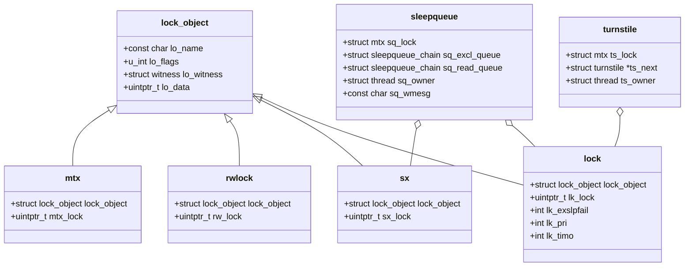

# Locking Primitives — Mutexes, sx, rmlocks, and Atomics
<!-- This file is auto-generated by generate-doc.py -- do not edit manually -->

---
**Navigation:**
  **Up:** [Kernel Core — Structure and Entry Point](../README.md) ▸ [Source Tree — Layout and Conventions](../../README_internals.md)
  **Related:** [Kernel Core — Structure and Entry Point](../README.md) | [Process Management — Scheduling and Lifecycle](README_process.md) | [Interrupt Handling — Threads, Filters, and Dispatch](README_intr.md)
  **All chapters:** [Source Tree — Layout and Conventions](../../README_internals.md) | [Boot Process — UEFI Bootloader to Kernel Handoff](../../stand/efi/loader/README.md) | [Kernel Core — Structure and Entry Point](../README.md) | [Build System — buildworld and buildkernel](../../share/mk/README.md) | [Virtual Memory Subsystem — vm_page, UMA, and Pagers](../vm/README.md) | [Process Management — Scheduling and Lifecycle](README_process.md) | [Buffer Cache — Block I/O Subsystem](../vm/README_bcache.md) | [GEOM — Storage Framework](../geom/README.md) ...
---

> ⚠ **UNVERIFIED DRAFT** — revisions regressed; kept revision 2 (8/9 criteria) over revision 3 (7/9); reviewer did not explicitly approve this draft. Treat claims as suspect until manually reviewed.

## Quick Summary
The FreeBSD kernel manages concurrent access to shared data structures using a hierarchy of locking primitives. When multiple threads execute simultaneously on different CPUs, the kernel must serialize access to mutable state to prevent data corruption and race conditions. The four primary primitives are the mutex (`mtx`), the reader/writer lock (`rwlock`), the shared/exclusive lock (`sx`), and the legacy `lockmgr` used heavily in the VFS layer. Each primitive expresses a different trade-off between mutual exclusion, concurrency, and overhead.

A mutex enforces strict mutual exclusion. It comes in two flavors: spin mutexes, which busy-wait on the CPU and are used in interrupt or interrupt-disabled contexts, and sleep mutexes, which block the calling thread on a wait queue when contended. Reader/writer locks allow multiple concurrent readers but block writers, while `sx` locks improve upon this by guaranteeing deterministic granting behavior to prevent writer starvation. The underlying infrastructure separates the blocking mechanism from the lock itself: turnstiles handle priority propagation for sleepable locks to prevent priority inversion, and sleep queues manage the actual thread blocking for condition variables and sleep calls. Finally, WITNESS acts as a runtime verifier to detect lock-ordering violations that static analysis cannot catch.

## Architecture
FreeBSD's locking subsystem is built around a common base structure, `struct lock_object`, defined in `sys/sys/_lock.h`. This structure holds metadata such as the lock name, flags, and a pointer to a witness verifier. Every lock primitive embeds this structure as its first member, allowing the kernel to treat all locks uniformly through the `lock_object` interface.

Mutex implementation lives in `sys/kern/kern_mutex.c` with headers in `sys/sys/mutex.h`. The `mtx` structure contains a single atomic word, `mtx_lock`, which encodes both the owner thread pointer and state flags like `MTX_WAITERS` or `MTX_RECURSED`. When a sleep mutex is contended, it does not maintain its own wait queue. Instead, it uses a turnstile located in `sys/kern/subr_turnstile.c`. Turnstiles are allocated per-thread and lent to locks upon contention. This design avoids bloating every lock structure with embedded queue headers and allows the kernel to track which thread owns a lock that is currently blocking others. Priority propagation walks the turnstile chain, temporarily boosting the priority of the lock holder so it runs to completion faster, defeating priority inversion.

Reader/writer locks are implemented in `sys/kern/kern_rwlock.c` and declared in `sys/sys/rwlock.h`. The `rwlock` structure uses an atomic word, `rw_lock`, to encode reader counts, writer ownership, and waiter flags. It supports adaptive spinning before falling back to a sleep queue.

Shared/exclusive locks (`sx`) are implemented in `sys/kern/kern_sx.c` and declared in `sys/sys/_sx.h`. The `sx` lock uses a similar atomic word, `sx_lock`, but enforces a strict alternation between shared and exclusive acquisition phases. This prevents writer starvation, a common problem in traditional reader/writer locks. Like `rwlock`, it falls back to the sleep queue mechanism when contended.

The legacy `lockmgr` system is implemented in `sys/kern/kern_lock.c` and declared in `sys/sys/lockmgr.h`. It is heavily used in the VFS for vnode and mount point locking. It supports shared and exclusive modes, priority propagation, and deadlock resolution via the `LK_CAN_SHARE` logic.

Sleep queues, managed in `sys/kern/subr_sleepqueue.c` and declared in `sys/sys/sleepqueue.h`, back `sx`, `lockmgr`, and condition variables. They are hashed into chains to avoid locking the entire queue system. Each thread carries a sleep queue structure that it lends to a wait channel when blocking. This decouples the wait mechanism from the lock, allowing multiple wait channels (like `msleep` and `cv_wait`) to share the same underlying queue infrastructure without embedding queue heads in every lock.

WITNESS, implemented in `sys/kern/subr_witness.c`, provides runtime lock-order verification. It records the lock acquisition order in a per-thread hash table. When a thread attempts to acquire a lock that is already held by another thread, WITNESS checks the global lock order graph. If the new acquisition would create a cycle, it panics the kernel. This catches deadlocks that only manifest under specific timing conditions, which static analysis misses.

## Key Data Structures
The following structures are defined in the kernel headers and form the backbone of the locking subsystem.

**Common Lock Header**
```c
struct lock_object {
	const char *		lo_name;
	u_int			lo_flags;
	struct witness *	lo_witness;
	uintptr_t		lo_data;
};
```
*Explanation:* The universal header for all lock types. `lo_name` stores the lock identifier for debugging. `lo_flags` indicates lock class (sleepable, spin, recursable). `lo_witness` points to the runtime verifier state.

**Mutex**
```c
struct mtx {
	struct lock_object	lock_object;
	volatile __uintptr_t	mtx_lock;
};
```
*Explanation:* Defined in `sys/sys/_mutex.h`. The `mtx_lock` field encodes the owner thread address. If the mutex is unlocked, it holds `MTX_UNOWNED`. If contended, it sets the `MTX_WAITERS` flag and uses a turnstile for blocking.

**Reader/Writer Lock**
```c
struct rwlock {
	struct lock_object	lock_object;
	volatile __uintptr_t	rw_lock;
};
```
*Explanation:* Defined in `sys/sys/_rwlock.h`. The `rw_lock` field encodes reader counts in the upper bits, a read lock flag in the lowest bit, and waiter indicators. Writers must acquire exclusive ownership, while readers increment the count atomically.

**Shared/Exclusive Lock**
```c
struct sx {
	struct lock_object	lock_object;
	volatile __uintptr_t	sx_lock;
};
```
*Explanation:* Defined in `sys/sys/_sx.h`. The `sx_lock` field tracks exclusive ownership and shared reader counts. It enforces a strict phase alternation to guarantee that writers are not starved by a continuous stream of readers.

**Lock Manager (VFS)**
```c
struct lock {
	struct lock_object	lock_object;
	volatile uintptr_t	lk_lock;
	u_short			lk_exslpfail;
	u_short			lk_pri;
	int			lk_timo;
#ifdef DEBUG_LOCKS
	struct stack		lk_stack;
#endif
};
```
*Explanation:* Defined in `sys/sys/_lockmgr.h`. Used primarily by the VFS. `lk_lock` holds the state, `lk_pri` tracks the highest priority waiter for propagation, and `lk_timo` handles timeout-based sleeping.

**Turnstile**
```c
struct turnstile {
	struct mtx		ts_lock;
	struct turnstile	*ts_next;
	struct thread *		ts_owner;
};
```
*Explanation:* Defined in `sys/sys/turnstile.h`. Turnstiles are allocated from a UMA zone and attached to threads. When a thread blocks on a lock, it lends its turnstile to the lock. This allows the kernel to track which thread is blocking on which lock without embedding queues in the lock itself. The `ts_next` pointer links turnstiles in the hash chain.

**Sleep Queue**
```c
struct sleepqueue {
	struct mtx		sq_lock;
	struct sleepqueue_chain	sq_excl_queue;
	struct sleepqueue_chain	sq_read_queue;
	struct thread *		sq_owner;
	const char *		sq_wmesg;
};
```
*Explanation:* Defined in `sys/kern/subr_sleepqueue.c`. Sleep queues manage threads blocked on wait channels. They support timeouts, signal interruption, and priority-based wakeup ordering.

## Deep Dive
When a thread calls `_mtx_lock(&m)`, the kernel first attempts a fast path using `atomic_cmpset_ptr` to atomically swap `MTX_UNOWNED` with the current thread's ID. If the CAS succeeds, the lock is acquired and execution continues. If it fails, the kernel calls `_mtx_lock_flags` in `sys/kern/kern_mutex.c`.

The actual implementation in `_mtx_lock_flags` follows this pattern:

```c
/* From sys/kern/kern_mutex.c */
static void
_mtx_lock(struct mtx *m, u_int opts, const char *file, int line)
{
	struct thread *td = curthread;
	uintptr_t new, old;

	/* Fast path: try to acquire without going through the full path */
	for (;;) {
		old = m->mtx_lock;
		if (mtx_unowned(m)) {
			new = td | opts;
			if (atomic_cmpset_ptr(&m->mtx_lock, old, new))
				return;
		}
		/* Slow path: need to block or spin */
		_mtx_lock_slow(m, opts, file, line);
	}
}
```

For a sleep mutex, `_mtx_lock_flags` checks if the lock is recursable and if the current thread already owns it. If not, it checks for priority inversion by calling `turnstile_claim`. The turnstile system looks up the lock's address in a hash table to find the associated turnstile chain. If the lock is held, the current thread lends its turnstile to the lock. The kernel then calls `turnstile_wait`, which adds the thread to the turnstile's exclusive queue and calls `mi_switch` to yield the CPU. The turnstile system automatically adjusts the priority of the lock holder via `turnstile_adjust`, ensuring the holder runs faster and releases the lock sooner.

For `_sx_xlock(&sx)`, the implementation in `sys/kern/kern_sx.c` uses adaptive spinning. The `sx_xlock()` macro expands to `_sx_xlock((sx), LOCK_FILE, LOCK_LINE)`, which calls `_sx_xlock` internally. The function attempts to acquire `sx_lock` using `atomic_cmpset_ptr` in a tight loop, yielding the CPU occasionally to avoid wasting cycles. If spinning fails, it checks `__sx_can_read` to see if a shared lock is possible. If not, it calls `sleepq_lock` to acquire the sleep queue chain lock, adds itself to the exclusive sleep queue via `sleepq_add`, and calls `sleepq_wait`. The `sleepq_wait` function sets the thread state to `TS_SLEEPING`, updates the sleep queue's owner, and switches to another thread.

When the lock holder calls `sx_xunlock`, it clears `sx_lock` and calls `sleepq_remove` to wake the highest-priority thread in the exclusive queue. The woken thread is marked pending, and the unlocker calls `turnstile_unpend` to complete the priority transfer and resume the waiting thread.

WITNESS operates differently. When `mtx_lock_flags` is called with `MTX_NOWITNESS` not set, `__mtx_lock_flags` invokes `witness_checkorder`. This function queries a global hash table of lock classes to find the lock's class ID. It then checks the per-thread acquisition stack. If the lock is already held by another thread, WITNESS compares the order of acquisition. If thread A holds Lock X and tries to acquire Lock Y, while thread B holds Lock Y and tries to acquire Lock X, WITNESS detects the cycle and triggers a `KDB_WITNESS` panic, dumping the thread stacks to identify the deadlock.

## Flow / Diagram


## Advanced Notes
**Priority Inversion and Turnstiles**
Priority inversion occurs when a high-priority thread is blocked by a low-priority thread holding a lock, which is itself blocked by a medium-priority thread. FreeBSD's turnstile system implements priority inheritance. When a high-priority thread blocks on a turnstile, it calls `turnstile_adjust`, which walks the `ts_owner` chain and temporarily boosts the priority of the owning thread (and potentially its owner) until the lock is released. This ensures the low-priority holder runs at the highest blocked priority, minimizing the inversion window.

The turnstile adjustment code walks the chain:

```c
/* From sys/kern/subr_turnstile.c */
void
turnstile_adjust(struct thread *td, u_char pri)
{
	struct thread *owner;
	struct turnstile *ts;

	/* Walk the turnstile chain, boosting each owner's priority */
	while ((ts = td->td_turnstile) != NULL) {
		owner = ts->ts_owner;
		if (owner != NULL && owner->td_priority < pri) {
			/* Boost the owner's priority */
			sched_prio(owner, pri);
		}
		td = owner;
	}
}
```

**DTrace and Lockstat**
The kernel integrates SDT probes and `lockstat` DTrace providers to monitor locking behavior in production. Probes like `lockstat:mutex:acquire` and `lockstat:turnstile:priority` fire when locks are contended. Administrators can use `lockstat -m` to profile lock contention and identify hot locks causing latency spikes. The `lock_profile` subsystem in `sys/sys/lock_profile.h` provides additional sampling for lock hold times and contention counts.

**WITNESS Pitfalls**
WITNESS is invaluable for development but adds overhead. It is typically disabled in production kernels. When enabled, it can produce false positives if locks are legitimately acquired in different orders under different conditions (e.g., interrupt context vs. process context). Deadlocks detected by WITNESS manifest as kernel panics with the message `WITNESS: order reversal detected`. The panic dump includes the lock class names and thread stacks, allowing developers to trace the exact code paths that violated the lock order graph.

**Spin vs Sleep Mutexes**
Spin mutexes (`MTX_SPIN`) disable interrupts and busy-wait. They are required in interrupt handlers, soft contexts, and when holding other spin locks, because sleeping requires the scheduler to run, which is disabled when interrupts are off. Sleep mutexes (`MTX_DEF`) allow the scheduler to run, making them appropriate for most kernel code. Using a sleep mutex in an interrupt handler will cause a panic or deadlock because the scheduler cannot switch threads.

**Adaptive Spinning**
FreeBSD uses adaptive spinning for `mtx`, `rwlock`, and `sx`. Before blocking, the kernel spins for a short duration, checking if the lock holder releases the lock. This avoids the overhead of context switching and queue manipulation for short critical sections. The spin duration is tunable via `sysctl kern.lock_adaptive` and adapts based on recent contention history.

## Comparison
Linux uses `spin_lock` and `mutex` for mutual exclusion, similar to FreeBSD's `mtx`. However, Linux's `rw_semaphore` is heavily optimized for read-heavy workloads and uses a different queuing mechanism. FreeBSD's `sx` lock is distinct from Linux's `rw_semaphore` because `sx` guarantees strict alternation between shared and exclusive phases, eliminating writer starvation entirely. Linux relies on priority inheritance via `rt_mutex`, while FreeBSD implements it generically across all sleepable locks via turnstiles.

macOS/XNU uses `os_unfair_lock` for high-performance locking, which is largely spin-based with adaptive backoff and implements priority inheritance through its Mach thread scheduling primitives. Unlike FreeBSD's turnstile system which is a separate infrastructure layer, XNU integrates priority inheritance directly into the Mach scheduler's thread priority management. Specifically, XNU's `os_unfair_lock` uses a spin loop with exponential backoff when contended, and priority inheritance is handled through the Mach kernel's `thread_set_priority` mechanism rather than a separate turnstile data structure. NetBSD and OpenBSD share similarities with FreeBSD's `mtx` and `rwlock` but differ in their sleep queue implementations and WITNESS-like deadlock detection (OpenBSD uses `INVARIANTS` lock debugging, while NetBSD relies on `lkdebug`).

## See Also
- [Process Management — Scheduling and Lifecycle](README_process.md)
- [Interrupt Handling — Threads, Filters, and Dispatch](README_intr.md)
- [Kernel Core — Structure and Entry Point](../README.md)


- `sys/kern/kern_mutex.c`
- `sys/kern/kern_sx.c`
- `sys/kern/subr_turnstile.c`
- `sys/kern/subr_witness.c`

---

> _Generated by [DaemonDocs](https://github.com/ocochard/DaemonDocs) on 2026-05-01 01:19 UTC using model `Qwen3.6-35B-A3B-UD-Q4_K_XL` (llama.cpp build `b8985-27aef3dd9`). AI-generated content — verify against source before relying on it._
