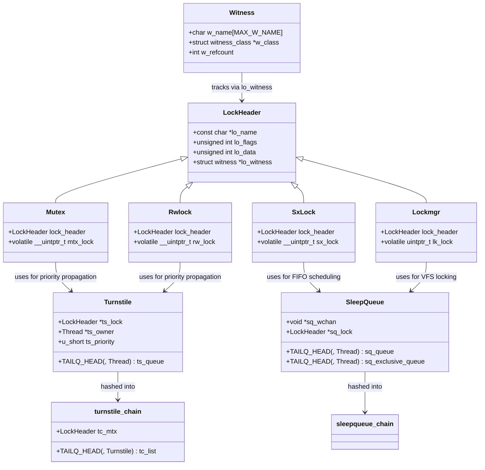

# Locking Primitives — Mutexes, sx, rmlocks, and Atomics
<!-- This file is auto-generated by generate-doc.py -- do not edit manually -->

---
**Navigation:**
  **Up:** [Kernel Core — Structure and Entry Point](../README.md) ▸ [Source Tree — Layout and Conventions](../../README_internals.md)
  **Related:** [Kernel Core — Structure and Entry Point](../README.md) | [Process Management — Scheduling and Lifecycle](README_process.md) | [Interrupt Handling — Threads, Filters, and Dispatch](README_intr.md)
  **All chapters:** [Source Tree — Layout and Conventions](../../README_internals.md) | [Boot Process — UEFI Bootloader to Kernel Handoff](../../stand/efi/loader/README.md) | [Kernel Core — Structure and Entry Point](../README.md) | [Build System — buildworld and buildkernel](../../share/mk/README.md) | [Virtual Memory Subsystem — vm_page, UMA, and Pagers](../vm/README.md) | [Process Management — Scheduling and Lifecycle](README_process.md) | [Buffer Cache — Block I/O Subsystem](../vm/README_bcache.md) | [GEOM — Storage Framework](../geom/README.md) ...
---

> ⚠ **UNVERIFIED DRAFT** — reviewer did not explicitly approve this draft. Treat claims as suspect until manually reviewed.

## Quick Summary

Every concurrent system must coordinate access to shared data. FreeBSD provides a layered toolkit of locking primitives that map different concurrency patterns to different performance characteristics. At the base are atomic operations — single-instruction CPU primitives like compare-and-swap — that form the building blocks for all higher-level synchronization. Above those sit mutexes (both spin and sleep variants), reader/writer locks, and shared/exclusive (sx) locks, each designed for a specific access pattern. A legacy lockmgr primitive, inherited from 4.4BSD, remains in use for VFS operations but is being phased out.

The key design decision for each primitive is whether it can sleep or must spin. Spin locks disable interrupts on the current CPU and busy-wait until the lock is released; they are appropriate only for very short critical sections where the holder is guaranteed to release quickly. Sleep locks, by contrast, put the contending thread to sleep on a wait queue and allow the scheduler to run other work. Sleep locks must never be held across operations that might sleep (like I/O), but they are the correct choice for longer-held locks.

When sleep locks are contended, FreeBSD provides two distinct queuing mechanisms: turnstiles and sleep queues. Turnstiles, used by mutexes and rwlocks, support priority propagation — if a high-priority thread blocks on a lock, the thread holding that lock temporarily inherits the higher priority, so it runs faster and releases the lock sooner. Sleep queues, used by sx locks and condition variables, do not propagate priority but provide deterministic FIFO ordering for shared and exclusive waiters, preventing writer starvation in reader-heavy workloads.

A runtime verifier called WITNESS tracks lock acquisition order and detects deadlocks and lock-order reversals at runtime. This is not a static analysis tool — it runs during actual execution and prints warnings when code violates the established lock ordering. Together, these primitives and mechanisms form the backbone of FreeBSD's concurrency model, appearing in every subsystem from the virtual memory manager to the network stack.

## Architecture

The locking subsystem is organized around a common abstraction layer: every lock primitive embeds a lock header structure (defined in `sys/sys/_lock.h`), which holds the lock's name, flags, class-specific data, and a pointer to a witness structure for ordering verification. This common header allows unified debugging infrastructure like the `show mtx` and `show rwlock` DDB commands, and enables the witness subsystem to track any lock regardless of its underlying type.

The four main primitives are implemented in separate source files under `sys/kern/`:

- **`sys/kern/kern_mutex.c`** — Sleep and spin mutex implementation. Sleep mutexes use turnstiles for priority propagation; spin mutexes disable interrupts and busy-wait. The mutex implementation (defined in `sys/sys/_mutex.h`) contains a lock header and a `mtx_lock` field that encodes the owner thread pointer and state flags (`MTX_RECURSED`, `MTX_WAITERS`, `MTX_DESTROYED`).

- **`sys/kern/kern_rwlock.c`** — Reader/writer lock implementation. The rwlock implementation (defined in `sys/sys/_rwlock.h`) uses an atomic word where the low bit distinguishes read from write mode, bits 1-2 indicate read/write waiters, and the remaining bits encode either a writer thread pointer (exclusive mode) or a reader count (shared mode). Rwlocks use turnstiles for priority propagation and support lock upgrading from read to write.

- **`sys/kern/kern_sx.c`** — Shared/exclusive lock implementation. The sx lock implementation (defined in `sys/sys/_sx.h`) has a similar bit layout to rwlock but uses sleep queues instead of turnstiles. This means sx locks provide deterministic scheduling — shared and exclusive waiters are maintained in separate FIFO queues — but do not support priority inheritance. The sx lock was introduced to address writer starvation in rwlocks under heavy read contention.

- **`sys/kern/kern_lock.c`** — Legacy lockmgr implementation. Used primarily by the VFS for vnode and mount point locks. The lockmgr lock (defined in `sys/sys/_lockmgr.h`) supports shared and exclusive modes with a complex flag set including `LK_EXCLUSIVE`, `LK_SHARED`, `LK_NOWAIT`, and `LK_INTERLOCK`. Lockmgr uses sleep queues and supports recursive locking.

The queuing infrastructure consists of two parallel systems:

- **Turnstiles** (`sys/kern/subr_turnstile.c`) — A hash table of turnstile chains, where each chain is protected by a spin mutex and contains a linked list of turnstile structures. Each thread carries a turnstile that it "lends" to the lock it blocks on. The turnstile holds a queue of waiting threads and supports priority propagation: when a high-priority thread blocks, its priority is propagated up to the lock holder through the turnstile chain. This prevents priority inversion, a classic real-time scheduling problem.

- **Sleep queues** (`sys/kern/subr_sleepqueue.c`) — A hash table of sleep queue chains, similarly structured but without priority propagation. Each sleep queue is associated with a wait channel (a pointer used as a hash key) and holds threads waiting on that channel. Sleep queues support timeouts and signal interruption. They are used by sx locks, condition variables, and the sleep/wakeup APIs.

The **WITNESS** subsystem (`sys/kern/subr_witness.c`) runs alongside all lock operations when compiled with `options WITNESS` or `options INVARIANTS`. It maintains a hash table of lock orders and checks each lock acquisition against the established ordering. If a thread acquires lock B while holding lock A, WITNESS records the A→B ordering. If a different thread later acquires B while holding A, WITNESS detects the reversal and prints a panic or warning. Special rules exist for the Giant lock: Giant must be acquired before any other mutex, and must be released before blocking on a sleepable lock.

## Key Data Structures

### Lock Header — Common Lock Properties

```c
# From sys/sys/_lock.h
struct lock_object {
	const	char *lo_name;		/* Individual lock name. */
	unsigned int lo_flags;
	unsigned int lo_data;		/* General class specific data. */
	struct	witness *lo_witness;	/* Data for witness. */
};
```

Every lock primitive embeds this header structure as its first member. The `lo_name` is set during initialization and appears in debug output. The `lo_flags` encode properties like `LO_QUIET` (suppress logging) and `LO_DUPOK` (allow duplicate acquisition without logging). The `lo_witness` pointer connects the lock to the WITNESS verifier.

### Mutex — Sleep and Spin Locks

```c
# From sys/sys/_mutex.h
struct mtx {
	struct lock_object	lock_object;	/* Common lock properties. */
	volatile __uintptr_t	mtx_lock;	/* Owner and flags. */
};
```

The `mtx_lock` field encodes different information depending on whether this is a sleep or spin mutex. For sleep mutexes, the low bits are state flags: `MTX_UNOWNED` (0, lock is free), `MTX_RECURSED` (bit 0, lock has been acquired recursively by the owner), `MTX_WAITERS` (bit 1, threads are blocked on this lock), and `MTX_DESTROYED` (bit 2, lock has been destroyed). The upper bits store the pointer to the owning thread. For spin mutexes, `mtx_lock` simply holds the owner thread pointer; interrupts are disabled on the calling CPU and the thread busy-waits in a loop.

### Rwlock — Reader/Writer Lock

```c
# From sys/sys/_rwlock.h
struct rwlock {
	struct lock_object	lock_object;
	volatile __uintptr_t	rw_lock;
};
```

The `rw_lock` field uses a packed encoding: bit 0 is `RW_LOCK_READ` (1 = read mode, 0 = write mode), bit 1 is `RW_LOCK_READ_WAITERS`, bit 2 is `RW_LOCK_WRITE_WAITERS`, bit 3 is `RW_LOCK_WRITE_SPINNER` (adaptive spinning), and bit 4 is `RW_LOCK_WRITER_RECURSED`. In write mode, the remaining bits hold the writer thread pointer. In read mode, the remaining bits hold a reader count shifted left by `RW_READERS_SHIFT` (5 bits, allowing up to 31 readers in the count field). The unlocked state is `RW_UNLOCKED` (0 readers, no waiters).

### SX Lock — Shared/Exclusive Lock

```c
# From sys/sys/_sx.h
struct sx {
	struct lock_object	lock_object;
	volatile __uintptr_t	sx_lock;
};
```

The `sx_lock` encoding mirrors rwlock: bit 0 is `SX_LOCK_SHARED` (1 = shared mode, 0 = exclusive mode), bit 1 is `SX_LOCK_SHARED_WAITERS`, bit 2 is `SX_LOCK_EXCLUSIVE_WAITERS`, bit 3 is `SX_LOCK_WRITE_SPINNER`, and bit 4 is `SX_LOCK_RECURSED`. The remaining bits hold either the exclusive owner thread pointer or a sharer count shifted by `SX_SHARERS_SHIFT` (5 bits). The unlocked state is `SX_LOCK_UNLOCKED`.

### Turnstile — Priority Propagation Queue

```c
# From sys/kern/subr_turnstile.c
struct turnstile {
	struct lock_object *ts_lock;	/* Lock this turnstile is attached to. */
	struct thread *ts_owner;	/* Thread currently holding the lock. */
	TAILQ_HEAD(, thread) ts_queue;	/* Queue of blocked threads. */
	u_short ts_priority;		/* Highest priority in the queue. */
	u_short ts_wlock_depth;		/* Writer lock depth for sx/rwlocks. */
};
```

Turnstiles are allocated from a UMA zone and attached to threads. When a thread blocks on a lock, it lends its turnstile to the lock. The turnstile's `ts_queue` holds threads waiting for the lock, and `ts_priority` tracks the highest priority among waiters for propagation to the owner.

### Sleep Queue — Sleep Wait Queue

```c
# From sys/kern/subr_sleepqueue.c
struct sleepqueue {
	void *sq_wchan;		/* Wait channel (hash key). */
	struct lock_object *sq_lock;	/* Lock being waited on. */
	TAILQ_HEAD(, thread) sq_queue;	/* Queue of blocked threads. */
	TAILQ_HEAD(, thread) sq_exclusive_queue; /* Exclusive waiters. */
};
```

Sleep queues are similar to turnstiles but lack priority propagation. They maintain separate queues for exclusive waiters (`sq_exclusive_queue`) and shared waiters, enabling the sx lock's deterministic scheduling.

### Thread — Kernel Execution Context

```c
# From sys/proc.h
struct thread {
	struct	lwp *td_lwp;		/* Pointer to associated lwp. */
	int	td_flags;			/* TDF_* flags. */
	int	td_pflags;			/* TD_PF_* flags. */
	int	td_pri;				/* Thread priority. */
	int	td_state;			/* TDS_* state. */
	structturnstile *td_turnstile;	/* Turnstile for this thread. */
	structsleepqueue *td_sleepqueue;	/* Sleep queue for this thread. */
	/* ... many more fields ... */
};
```

The `thread` structure is the core kernel execution context. Each kernel thread (or LWP in the FreeBSD model) has a `struct thread` that tracks its state, priority, scheduling information, and references to its turnstile and sleep queue.

### Witness — Lock Ordering Verifier

```c
# From sys/kern/subr_witness.c
struct witness {
	char w_name[MAX_W_NAME];
	struct witness_class *w_class;
	int w_refcount;
	/* Additional fields for lock ordering tracking */
};
```

The WITNESS verifier uses `struct witness` to track lock ordering information. Each lock class has an associated `witness` structure that WITNESS uses to detect lock-order violations at runtime. The `w_name` field holds the lock class name as a string, `w_class` points to the witness class definition, and `w_refcount` tracks references to this witness structure.

## Deep Dive

### Mutex Locking: Sleep vs Spin

The mutex implementation in `sys/kern/kern_mutex.c` provides two fundamentally different locking modes controlled by the `MTX_SPIN` flag passed to `_mtx_init()`.

**Sleep mutexes** (`MTX_DEF`, the default) use turnstiles for queuing. When a thread calls `_mtx_lock()`, it first attempts an atomic compare-and-swap (`atomic_cmpset_acq_ptr`) to acquire the lock without blocking. If the lock is held, the thread checks for adaptive spinning: on SMP systems, it may spin a small number of times (controlled by `locks_delay_retries` and `locks_delay.max` sysctls) hoping the holder releases quickly. If spinning fails or is disabled, the thread calls `turnstile_wait()` to block on the turnstile queue. The turnstile machinery propagates the blocking thread's priority to the lock holder, then the thread is put to sleep on the scheduler's run queue.

**Spin mutexes** (`MTX_SPIN`) disable interrupts on the calling CPU and busy-wait. They are used in interrupt handlers and other contexts where sleeping is forbidden. Spin locks are acquired by calling `splhigh()` which disables interrupts and then spinning on `mtx_lock` until the atomic CAS succeeds. Since interrupts are disabled, no other thread on the same CPU can run, making spin locks safe for short critical sections but dangerous if held too long (they effectively halt that CPU).

### Rwlock: Bit-Packed State and Lock Upgrading

The rwlock implementation in `sys/kern/kern_rwlock.c` uses a clever bit-packed encoding in `rw_lock` to minimize memory footprint while supporting multiple readers. The key insight is that the lock state can be encoded in a single atomic word, allowing lock acquisition and release to proceed without blocking in the common case.

For **write locking**, the thread atomically compares `rw_lock` with `RW_UNLOCKED` and swaps in its thread pointer. If the CAS fails (another thread holds the lock), it calls `turnstile_wait()` with the `LK_EXCLUSIVE` flag. The turnstile queues the thread and propagates its priority.

For **read locking**, the thread increments the reader count atomically. If the count was zero (no previous readers), it sets the `RW_LOCK_READ` bit. The reader count is stored in bits 5-31 (shifted by 5), allowing up to 31 concurrent readers in the fast path. If contention occurs, the thread blocks on the turnstile.

Lock upgrading allows a reader to convert its read lock to a write lock without releasing the read lock first. This is useful when a thread initially reads a data structure but then needs to modify it. The upgrade mechanism in `kern_rwlock.c` checks that no other readers are active and no write waiters are queued (to prevent writer starvation), then atomically transitions to write mode. If upgrading fails, the thread must release the read lock and acquire a write lock normally.

### SX Locks: Deterministic Scheduling Without Priority Propagation

The sx lock was introduced in FreeBSD 7 to address writer starvation in rwlocks. In an rwlock, when readers are continuously arriving, writers may never get a chance to acquire the lock because the rwlock's turnstile queue does not distinguish between shared and exclusive waiters — it simply wakes the highest-priority thread, which could be another reader.

The sx lock solves this by maintaining **separate FIFO queues** for shared and exclusive waiters, implemented via sleep queues. When an exclusive waiter is queued, new shared requests are blocked until the exclusive waiter is granted. This ensures that writers are not starved, at the cost of potentially delaying some readers.

The sx lock uses sleep queues rather than turnstiles, which means **no priority propagation**. This is a deliberate trade-off: sx locks are designed for user-space-style concurrency where fairness matters more than real-time priority. The comment in `kern_sx.c` explicitly states: "Priority propagation will not generally raise the priority of lock holders, so should not be relied upon in combination with sx locks."

### Turnstiles: Priority Propagation Against Priority Inversion

Priority inversion occurs when a high-priority thread blocks on a lock held by a low-priority thread, and a medium-priority thread preempts the low-priority holder, preventing it from running and releasing the lock. This is a classic real-time scheduling problem.

FreeBSD's turnstile system defeats priority inversion through **priority inheritance**. When a thread blocks on a lock with a turnstile, the turnstile's `ts_priority` field is set to the blocking thread's priority. The lock holder's priority is then raised to match `ts_priority`. When the holder releases the lock, its priority is restored.

Turnstiles are looked up in a hash table (`turnstile_hash`) indexed by the lock's address. The hash uses the lower 8 bits of the address masked out (shift of 8), giving 256 chains. Each chain is protected by a spin mutex. When a thread blocks on a lock, it looks up or creates a turnstile for that lock, adds itself to the turnstile's queue, and propagates its priority to the owner.

### Sleep Queues: Timeout and Signal Support

Sleep queues, implemented in `sys/kern/subr_sleepqueue.c`, provide a more feature-rich queuing mechanism than turnstiles. They support:

1. **Timeouts**: Each sleeping thread can specify a timeout. If the thread is not woken before the timeout expires, it is resumed and the sleep returns an error. The timeout is implemented using a per-thread callout.

2. **Signal interruption**: If a signal is delivered to a sleeping thread, `sleepq_abort()` is called to remove the thread from the queue and resume it. This allows interruptible sleeps.

3. **Assertion checking**: Sleep queues verify that the same lock is used consistently for synchronization with a given wait channel. Mixing lock/unlock with cv_wait/cv_signal on the same wait channel is not allowed.

### WITNESS: Runtime Lock-Order Verification

WITNESS is a runtime verifier that detects lock-order violations and potential deadlocks. It is enabled by `options WITNESS` or `options INVARIANTS` in the kernel configuration. WITNESS operates by maintaining a hash table of lock orders: when thread T1 acquires lock B while holding lock A, WITNESS records the ordering A→B. If thread T2 later acquires A while holding B, WITNESS detects the reversal and prints a warning or panic.

WITNESS has special rules for the Giant lock (the legacy global kernel lock):

1. Giant must be acquired before any other mutexes.
2. Giant must be released when blocking on a sleepable lock.
3. Giant may be acquired before or after sleepable locks.

These rules ensure that Giant does not participate in deadlock cycles with other locks. The first rule prevents Giant from being held while acquiring a finer-grained lock that might be held by another thread also acquiring Giant. The second rule prevents deadlock when a thread blocks on a sleepable lock while holding Giant — the blocking thread releases Giant, allowing other threads to make progress.

## Flow / Diagram



## Advanced Notes

### Performance Implications

The choice between mutex, rwlock, and sx has significant performance implications:

- **Mutex vs rwlock**: Rwlocks allow multiple concurrent readers, which is beneficial for read-heavy workloads. However, the rwlock's bit-packed encoding and turnstile management add overhead per operation. For write-heavy workloads, a simple mutex is faster because it avoids the reader-count management.

- **sx vs rwlock**: sx locks have higher per-operation overhead due to sleep queue management and separate shared/exclusive queues. However, they guarantee fairness — writers are not starved. In read-heavy workloads with occasional writers, rwlocks may appear faster because readers can proceed concurrently, but under sustained read pressure, writers in an rwlock may never make progress, causing indefinite latency for write operations.

- **Spin vs sleep mutex**: Spin mutexes avoid the overhead of context switching but waste CPU cycles if contention is high. They are appropriate only for critical sections shorter than the context-switch latency (typically a few microseconds). Sleep mutexes have higher overhead per acquisition (context switch, scheduler invocation) but are correct for longer-held locks.

### Debugging with DTrace and DDB

FreeBSD provides several debugging hooks for the locking subsystem:

- **DTrace probes**: The `lockstat` framework provides DTrace probes for lock operations. Use `lockstat -l` to list available probes, and `lockstat -m` to see lock contention metrics. The `lockstat` probes are available for mtx, rwlock, sx, and lockmgr operations.

- **DDB commands**: The DDB debugger provides commands to inspect lock state:
  - `show mtx <address>` — Display the state of a mutex
  - `show rwlock <address>` — Display the state of an rwlock
  - `show sx <address>` — Display the state of an sx lock
  - `show lockmgr <address>` — Display the state of a lockmgr lock

- **WITNESS output**: When WITNESS detects a lock-order violation, it prints a detailed warning including the lock names, the acquiring thread, and the stack trace. These warnings appear on the console and in the kernel log. Use `options WITNESS` in the kernel configuration to enable WITNESS (it adds significant overhead and should not be used in production).

### Common Pitfalls

1. **Holding a spin lock across a sleeping operation**: Spin locks disable interrupts on the calling CPU. If code holding a spin lock calls a function that might sleep (like kernel memory allocation or sleep/wakeup APIs), the system will panic. Always use sleep locks in process context and spin locks only in interrupt handlers or other non-sleeping contexts.

2. **Deadlock via lock ordering**: The most common cause of deadlocks is inconsistent lock ordering. If thread T1 acquires lock A then B, and thread T2 acquires B then A, a deadlock occurs. WITNESS detects this at runtime, but only if compiled with `options WITNESS`. Establish a global lock ordering convention and document it.

3. **Writer starvation in rwlocks**: Under sustained read pressure, writers in an rwlock may never make progress because new readers can always acquire the lock before a writer is granted. Use sx locks if writer fairness is important.

4. **Priority inversion with sx locks**: SX locks do not support priority propagation. If a high-priority thread blocks on an sx lock held by a low-priority thread, the low-priority holder will not inherit the higher priority, potentially causing significant latency. Use mutexes or rwlocks for real-time-critical code.

5. **Double initialization**: Initializing a lock that has already been initialized is undefined behavior and may corrupt the lock state. Use `MTX_NEW` flag to prevent double initialization, or use `_mtx_init()` only once per lock.

### Connection to OS Theory

The FreeBSD locking primitives implement classic synchronization mechanisms from operating systems theory:

- **Mutexes** implement the mutual exclusion primitive from Dijkstra's semaphore theory, with the addition of recursive locking (a thread can acquire the same lock multiple times without deadlocking).

- **Reader/writer locks** implement the read-write semaphore pattern, allowing multiple concurrent readers but exclusive access for writers. This pattern is described in "Operating System Concepts" by Silberschatz, Galvin, and Gagne.

- **Priority inheritance** (via turnstiles) implements the priority inheritance protocol from real-time scheduling theory, which prevents priority inversion. This protocol is described in "Real-Time Systems" by Jane W. S. Liu.

- **Sleep queues** implement the monitor pattern from Hoare's monitor theory, where threads wait on condition variables for specific conditions to become true.

The turnstile and sleep queue systems are inspired by Solaris's implementation, as described in "Solaris Internals" by Jim Mauro and Richard McDougall. FreeBSD's adaptation differs in using a hash table of chains rather than embedding queue heads in the lock structures, reducing memory overhead for locks that are rarely contended.

## See Also
- [Process Management — Scheduling and Lifecycle](README_process.md)
- [Interrupt Handling — Threads, Filters, and Dispatch](README_intr.md)
- [Kernel Core — Structure and Entry Point](../README.md)


- [`sys/kern/kern_mutex.c`](kern_mutex.c) — Sleep and spin mutex implementation
- [`sys/kern/kern_rwlock.c`](kern_rwlock.c) — Reader/writer lock implementation
- [`sys/kern/kern_sx.c`](kern_sx.c) — Shared/exclusive lock implementation
- [`sys/kern/kern_lock.c`](kern_lock.c) — Legacy lockmgr implementation
- [`sys/kern/subr_turnstile.c`](subr_turnstile.c) — Turnstile priority propagation
- [`sys/kern/subr_sleepqueue.c`](subr_sleepqueue.c) — Sleep queue implementation
- [`sys/kern/subr_witness.c`](subr_witness.c) — WITNESS lock-order verifier
- [`sys/sys/mutex.h`](../sys/mutex.h) — Mutex API and data structures
- [`sys/sys/rwlock.h`](../sys/rwlock.h) — Rwlock API and data structures
- [`sys/sys/sx.h`](../sys/sx.h) — SX lock API and data structures

---

> _Generated by [DaemonDocs](https://github.com/ocochard/DaemonDocs) on 2026-05-03 11:22 UTC using model `Qwen3.6-35B-A3B-UD-Q8_K_XL` (llama.cpp build `b8985-27aef3dd9`). AI-generated content — verify against source before relying on it._
