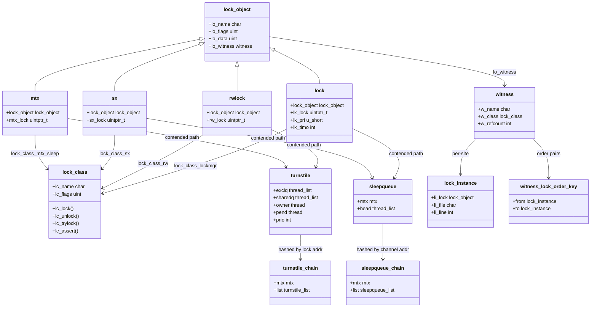

# Locking Primitives — Mutexes, sx, rmlocks, and Atomics
<!-- This file is auto-generated by generate-doc.py -- do not edit manually -->

---
**Navigation:**
  **Up:** [Kernel Core — Structure and Entry Point](../README.md) ▸ [Source Tree — Layout and Conventions](../../README_internals.md)
  **Related:** [Kernel Core — Structure and Entry Point](../README.md) | [Process Management — Scheduling and Lifecycle](README_process.md) | [Interrupt Handling — Threads, Filters, and Dispatch](README_intr.md)
  **All chapters:** [Source Tree — Layout and Conventions](../../README_internals.md) | [Boot Process — UEFI Bootloader to Kernel Handoff](../../stand/efi/loader/README.md) | [Kernel Core — Structure and Entry Point](../README.md) | [Build System — buildworld and buildkernel](../../share/mk/README.md) | [System Calls and Image Activation — Entry, sysent, and exec](README_syscall.md) | [Kernel Modules and the Linker — KLD, SYSINIT, and linker sets](README_kld.md) | [Virtual Memory Subsystem — vm_page, UMA, and Pagers](../vm/README.md) | [Process Management — Scheduling and Lifecycle](README_process.md) ...
---

> **Note:** the automated reviewer withheld approval of this chapter (7/8
> criteria) on a single accuracy objection: that it contradicts itself about
> turnstile allocation. That objection was checked against the source and is
> incorrect. Turnstiles really are both allocated one per thread
> (`kern_thread.c`, `struct thread.td_turnstile`) and looked up by lock address
> through a chain hash (`subr_turnstile.c`, `TC_LOOKUP`): a blocking thread
> donates its own turnstile to the lock it blocks on, and the hash finds
> whichever turnstile is currently attached to a given lock. The remaining
> seven criteria passed. Reviewed by hand 2026-09-04.

## Quick Summary

Every piece of shared kernel [state](../netpfil/pf/README.md#glossary) in FreeBSD is protected by one of a small
family of locking primitives, and this chapter is the single place to learn
what each one actually does. The toolkit has four main members: the mutex
(`mtx`), the workhorse mutual-exclusion lock that comes in two forms — a
*sleep* mutex that parks the [thread](README_process.md#glossary) on a [turnstile](#glossary) when contended, and a
*spin* mutex that busy-waits with interrupts disabled; the reader/writer lock
(`rwlock`), which lets many readers in at once but gives a writer exclusive
access and supports upgrading a read lock to a write lock; the shared/exclusive
lock (`sx`), a sleep-based read/write lock that is the default for most
subsystems; and the lock manager (`lockmgr`, the `lock` type), a legacy
read/write lock with priority and timeout that VFS still relies on for vnode
locking. All four share a common embedded descriptor, `struct lock_object`,
which carries the name, flags, and the [hook](../netgraph/README.md#glossary) that [WITNESS](#glossary) (a runtime lock-order
verifier that panics on ordering violations) uses to track every acquisition.

The choice between them is a trade-off a developer makes once, at the design
of the data structure. A mutex is the right answer when the critical section
is a single owner's business and there is no read/write split. An `sx` or
`rwlock` is the right answer when most accesses are reads and you want readers
to proceed in parallel, paying a small tax on the writer. A spin mutex is
forced on you by context: inside an interrupt handler, inside a CPU-local
critical section, or anywhere the scheduler cannot run, the thread cannot
sleep, so the only option is to spin. Getting this choice wrong is the most
common source of kernel lock bugs — a sleep mutex held in an interrupt context
is a hang, and a spin mutex held across a long critical section is a latency
spike.

Two subsystems sit underneath the four primitives and give them their hard
guarantees. The first is the *turnstile* mechanism, which is how a contended
sleep mutex and rwlock queue waiters and, critically, propagates priority so
that a high-priority thread blocked behind a low-priority holder does not get
starved. The second is the *[sleep queue](#glossary)*, which backs `sx` locks, condition
variables, and the classic `sleep`/`wakeup` pair; it is a simpler queue that
deliberately does not do priority propagation. On top of both sits WITNESS, a
runtime verifier that records the order in which locks are actually acquired
and panics the kernel the moment a thread violates the ordering, turning a
silent deadlock into an immediate, diagnosable crash.

Finally, all of these primitives are built on the `atomic_*` operations in
`sys/amd64/include/atomic.h` (and its per-architecture siblings). The lock
cookie — the single machine word in `mtx_lock`, `rw_lock`, `sx_lock`, or
`lk_lock` — is manipulated with compare-and-swap instructions so that the
fast path of every lock operation is a single atomic instruction that never
takes a cache-line exclusive lock on the cookie itself.

## Glossary

**turnstile** — A per-lock queue of blocked threads that lives outside the
lock structure (looked up in a hash table by lock address) so that the lock
itself stays small; it exists to propagate priority from blocked high-priority
threads to the low-priority holder, defeating priority inversion.

**sleep queue** — A per-wait-channel queue of threads that backs `sx` locks,
condition variables, and `sleep`/`wakeup`; unlike turnstiles it does not do
priority propagation, which is why `sx` can be held while sleeping without
the inversion risk that a plain mutex would have.

**lock cookie** — The single machine word (`mtx_lock`, `rw_lock`, `sx_lock`,
`lk_lock`) that encodes both the owner and the state flags of a lock; all
fast-path lock operations are atomic compare-and-swap on this word.

**priority inversion** — The situation where a low-priority thread holds a
lock that a high-priority thread needs, and a medium-priority thread
preempts the low-priority holder, so the high-priority thread is effectively
blocked by the medium-priority one; turnstiles fix this by temporarily
boosting the holder to the highest blocked waiter's priority.

**WITNESS** — A runtime lock-order verifier compiled into debug kernels that
records every lock acquisition and panics the kernel when a thread acquires a
lock in an order that could deadlock with another thread's acquisition order.

**adaptive mutex** — A spin mutex that, on SMP systems, first spins for a
short bounded time before falling back to sleeping on a turnstile, so that
brief contention is resolved without a context switch.

**sleepable lock** — A lock (sleep mutex, `sx`, `rwlock`, `lockmgr`) that may
be held while the thread is descheduled; the opposite of a spin lock, which
must never be held across a context switch.

**lock class** — A per-type descriptor (`struct lock_class`) that tells the
scheduler and WITNESS how to lock, unlock, and inspect a given family of
locks; each of the four primitives registers its own class at boot.

## Architecture

The four locking primitives live in four source files under `sys/kern/`:

| Primitive | Header | Implementation | Queue mechanism |
|-----------|--------|---------------|-----------------|
| `mtx` (sleep) | `sys/sys/mutex.h`, `sys/sys/_mutex.h` | `sys/kern/kern_mutex.c` | turnstile |
| `mtx` (spin) | same | same | turnstile (adaptive) |
| `rwlock` | `sys/sys/rwlock.h`, `sys/sys/_rwlock.h` | `sys/kern/kern_rwlock.c` | turnstile |
| `sx` | `sys/sys/sx.h`, `sys/sys/_sx.h` | `sys/kern/kern_sx.c` | sleep queue |
| `lockmgr` | `sys/sys/lockmgr.h`, `sys/sys/_lockmgr.h` | `sys/kern/kern_lock.c` | sleep queue |

Every lock embeds a `struct lock_object` as its first member. This is the
common interface that WITNESS, the scheduler's `sleep`/`cv_wait` paths, and
the [DDB](README_kdb.md#glossary) (the kernel debugger) `show lock` command all operate on. The
`lock_object` carries four
fields: `lo_name` (a human-readable string for diagnostics), `lo_flags` (a
bitmask of `LO_*` and `LC_*` flags), `lo_data` (class-specific scratch, used
by `sx` and `rwlock` for recursion counts), and `lo_witness` (a pointer to a
per-lock WITNESS data structure, valid only when WITNESS is compiled in).

```c
/* From sys/sys/_lock.h */
struct lock_object {
    const   char *lo_name;        /* Individual lock name. */
    unsigned int lo_flags;
    unsigned int lo_data;         /* General class specific data. */
    struct  witness *lo_witness;  /* Data for witness. */
};
```

Each lock type registers a `struct lock_class` at boot. The class tells the
scheduler how to re-acquire the lock after a `sleep` or `cv_wait` (via
`lc_lock`/`lc_unlock`), how to assert ownership for `assert_*` macros, and
how to dump state in DDB. In `sys/kern/kern_mutex.c`, two classes are
defined:

```c
/* From sys/kern/kern_mutex.c */
struct lock_class lock_class_mtx_sleep = {
    .lc_name = "sleep mutex",
    .lc_flags = LC_SLEEPLOCK | LC_RECURSABLE,
    .lc_assert = assert_mtx,
#ifdef DDB
    .lc_ddb_show = db_show_mtx,
#endif
    .lc_lock = lock_mtx,
    .lc_trylock = trylock_mtx,
    .lc_unlock = unlock_mtx,
};

struct lock_class lock_class_mtx_spin = {
    .lc_name = "spin mutex",
    .lc_flags = LC_SPINLOCK | LC_RECURSABLE,
    .lc_assert = assert_mtx,
#ifdef DDB
    .lc_ddb_show = db_show_mtx,
#endif
    .lc_lock = lock_spin,
    .lc_trylock = trylock_spin,
    .lc_unlock = unlock_spin,
};
```

The `LC_SLEEPLOCK` and `LC_SPINLOCK` flags in `lc_flags` are what the
scheduler checks to decide whether a thread may sleep while holding the lock.
A thread holding a `LC_SPINLOCK` that attempts to sleep will panic; a thread
holding a `LC_SLEEPLOCK` that attempts to spin will also panic.

### The lock cookie

All four primitives encode their state in a single `volatile __uintptr_t`
word. The low bits are flags; the high bits are either a pointer to the
owning thread (for exclusive locks) or a count of shared holders (for shared
locks). This encoding lets the fast path be a single `atomic_cmpset_acq_ptr`
or `atomic_fcmpset_acq_ptr` call.

For a **mutex** (`sys/sys/mutex.h`), the state bits are:

```c
#define MTX_UNOWNED     0x00000000  /* Cookie for free mutex */
#define MTX_RECURSED    0x00000001  /* lock recursed (for MTX_DEF only) */
#define MTX_WAITERS     0x00000002  /* lock has waiters (for MTX_DEF only) */
#define MTX_DESTROYED   0x00000004  /* lock destroyed */
```

For an **rwlock** (`sys/sys/rwlock.h`), the encoding is:

```c
#define RW_LOCK_READ            0x01  /* 0 = write lock, 1 = read lock */
#define RW_LOCK_READ_WAITERS    0x02
#define RW_LOCK_WRITE_WAITERS   0x04
#define RW_LOCK_WRITE_SPINNER   0x08
#define RW_LOCK_WRITER_RECURSED 0x10
#define RW_READERS_SHIFT        5
#define RW_UNLOCKED             RW_READERS_LOCK(0)
```

The `sx` and `lockmgr` encodings are structurally identical to `rwlock`, with
`SX_LOCK_SHARED` / `LK_SHARE` in place of `RW_LOCK_READ`.

### Turnstiles vs. sleep queues

The two queueing mechanisms differ in one critical respect: **priority
propagation**. A turnstile is a queue of blocked threads that is *attached to
a specific lock owner*. When a high-priority thread blocks on a turnstile, it
*borrows* its priority to the owner via `turnstile_adjust()`, which raises
the owner's scheduling priority to that of the highest-priority blocked
waiter. When the owner releases the lock, `turnstile_unpend()` drops the
borrowed priority and wakes the highest-priority waiter.

A sleep queue, by contrast, is a queue of threads blocked on a *wait channel*
(a pointer, not a lock). It has no concept of an owner to boost, so it does
not do priority propagation. This is why `sx` locks, which use sleep queues,
can be held across a `sleep()` call without the inversion risk that a plain
sleep mutex would have — the `sx` is not the thing being waited on in the
inversion sense; the condition variable or sleep channel is.

Both mechanisms use a hash table to avoid embedding a queue in every lock
structure. Turnstiles are hashed by lock address in a table of
`turnstile_chain` entries, each protected by a spin mutex. Sleep queues are
hashed by wait-channel address in a table of `sleepqueue_chain` entries, also
protected by a spin mutex. The hash shift (`TC_SHIFT` for turnstiles, the
same value for sleep queues) ignores the low 8 bits of the address, giving a
reasonable distribution for kernel pointers.

### WITNESS

WITNESS is a runtime lock-order verifier. At each lock acquisition, it
records the pair (lock already held, lock being acquired) in a per-thread
stack. If the reverse pair (lock being acquired, lock already held) has been
observed on another thread, WITNESS panics with a lock-order reversal
diagnostic. This is a *runtime* check rather than a static one because the
set of lock acquisitions depends on the dynamic path through the kernel —
which subsystems are loaded, which code paths are taken, which interrupts
fire — and no static analysis can enumerate all of them.

WITNESS data is stored in `struct lock_object.lo_witness`, which points to a
`struct witness` (the per-lock-instance record) and, transitively, to
`struct lock_instance` entries (one per acquisition site, keyed by file and
line). The global state lives in `struct witness_hash` (a hash table of
`struct witness` by name) and `struct witness_lock_order_hash` (a hash table
of observed lock-order pairs). The `struct witness_lock_order_key` is a
`(from, to)` pair of lock instances.

## Key Data Structures

### struct mtx

```c
/* From sys/sys/_mutex.h */
struct mtx {
    struct lock_object  lock_object;    /* Common lock properties. */
    volatile __uintptr_t mtx_lock;      /* Owner and flags. */
};
```

`mtx_lock` is the [lock cookie](#glossary). When the mutex is free, it equals
`MTX_UNOWNED` (zero). When held, the high bits contain the address of the
owning thread and the low bits contain `MTX_RECURSED` and/or
`MTX_WAITERS`. The `MTX_WAITERS` bit is set the first time a thread blocks on
the mutex, and it is what causes the unlock path to look up the turnstile.

`struct mtx_padalign` is identical but cache-line aligned, to avoid false
sharing when multiple mutexes are embedded in a hot structure.

### struct sx

```c
/* From sys/sys/_sx.h */
struct sx {
    struct lock_object  lock_object;
    volatile __uintptr_t sx_lock;
};
```

`sx_lock` uses the same encoding as `rw_lock`: the low bit distinguishes
shared (`SX_LOCK_SHARED`) from exclusive, the next three bits are waiter and
spinner flags, and the high bits hold either the owner pointer (exclusive) or
a shifted reader count (shared). The `sx_recurse` macro aliases
`lock_object.lo_data` for the exclusive recursion count.

### struct rwlock

```c
/* From sys/sys/_rwlock.h */
struct rwlock {
    struct lock_object  lock_object;
    volatile __uintptr_t rw_lock;
};
```

Identical in shape to `struct sx`. The `rw_recurse` macro aliases
`lock_object.lo_data` for the writer recursion count. The key functional
difference from `sx` is that `rwlock` uses turnstiles (with priority
propagation) for its blocked threads, while `sx` uses sleep queues.

### struct lock (lockmgr)

```c
/* From sys/sys/_lockmgr.h */
struct lock {
    struct lock_object  lock_object;
    volatile uintptr_t  lk_lock;
    u_short             lk_exslpfail;
    u_short             lk_pri;
    int                 lk_timo;
#ifdef DEBUG_LOCKS
    struct stack        lk_stack;
#endif
};
```

`lk_lock` uses the same shared/exclusive encoding as `sx_lock`. The extra
fields are what make `lockmgr` distinct: `lk_pri` is the priority at which
the lock will be acquired (allowing a caller to request a lower-priority
sleep), `lk_timo` is a timeout in ticks (allowing a timed lock acquisition),
and `lk_exslpfail` counts consecutive exclusive sleep failures (used to
decide when to spin instead of sleep). These fields exist because VFS needs
to lock vnodes at a priority that matches the calling thread's scheduling
priority and to time out on busy vnodes, neither of which `sx` or `rwlock`
support.

### struct lock_class

```c
/* From sys/sys/lock.h */
struct lock_class {
    const   char *lc_name;
    u_int   lc_flags;
    void    (*lc_assert)(const struct lock_object *lock, int what);
    void    (*lc_ddb_show)(const struct lock_object *lock);
    void    (*lc_lock)(struct lock_object *lock, uintptr_t how);
    int     (*lc_owner)(const struct lock_object *lock,
                    struct thread **owner);
    uintptr_t (*lc_unlock)(struct lock_object *lock);
    int     (*lc_trylock)(struct lock_object *lock, uintptr_t how);
};
```

The `lc_lock` and `lc_unlock` function pointers are the critical ones: they
are called by [`sleep(9)`](../../share/man/man9/sleep.9) and `cv_wait(9)` to drop and re-acquire the lock
while the thread is blocked. The return value of `lc_unlock` is passed back
to `lc_lock` on resume, allowing the lock to communicate state (for example,
the `MTX_WAITERS` flag) across the sleep.

### struct turnstile (interface)

The `struct turnstile` is defined in `sys/kern/subr_turnstile.c` and is not
exported in a public header. From the interface comment in
`sys/sys/turnstile.h`:

> Each turnstile contains two sub-queues: one for threads waiting for a
> shared, or read, lock, and one for threads waiting for an exclusive, or
> write, lock.

The turnstile is looked up in a hash table of `struct turnstile_chain`
entries, indexed by the lock's address. Each chain is protected by a spin
mutex. A thread allocates a `struct turnstile` at thread creation via
`turnstile_alloc()` and releases it at thread destruction via
`turnstile_free()`. The key API functions, all declared in
`sys/sys/turnstile.h`, are:

- `turnstile_wait()` — block the current thread on the turnstile
- `turnstile_signal()` — mark the highest-priority blocked thread for wakeup
- `turnstile_broadcast()` — mark all blocked threads for wakeup
- `turnstile_lookup()` — find the turnstile for a given lock
- `turnstile_claim()` — take ownership of a turnstile after acquiring a
  contended lock
- `turnstile_unpend()` — wake pending threads and release the turnstile
- `turnstile_disown()` — release the turnstile without waking waiters
- `turnstile_adjust()` — adjust the owner's priority to the highest blocked
  waiter's priority (the priority-propagation step)

### struct sleepqueue (interface)

The `struct sleepqueue` is defined in `sys/kern/subr_sleepqueue.c`. The
interface comment in `sys/sys/sleepqueue.h` describes the API:

- `sleepq_lock()` — lock the sleep-queue chain for a wait channel
- `sleepq_add()` — enqueue the current thread on the sleep queue
- `sleepq_wait()` / `sleepq_timedwait()` — block the current thread
- `sleepq_signal()` — wake the highest-priority thread on the queue
- `sleepq_broadcast()` — wake all threads on the queue
- `sleepq_abort()` — interrupt an interruptible sleep
- `sleepq_alloc()` / `sleepq_free()` — per-thread allocation

The sleep-queue type is encoded in the low bits of the wait-channel pointer
via the `SLEEPQ_TYPE` mask: `SLEEPQ_SLEEP` (0x00), `SLEEPQ_CONDVAR` (0x01),
`SLEEPQ_PAUSE` (0x02), `SLEEPQ_SX` (0x03), `SLEEPQ_LK` (0x04). This lets the
sleep-queue code distinguish between a plain `sleep`/`wakeup` channel, a
condition variable, and an `sx` or `lockmgr` lock without an extra pointer.

### WITNESS structures

The WITNESS data structures are defined in `sys/kern/subr_witness.c`:

- `struct witness` — per-lock-instance record, keyed by name; contains
  `w_name`, `w_class`, `w_refcount`, and a list of `struct lock_instance`
  entries for each acquisition site.
- `struct lock_instance` — one per (lock, file, line) triple; contains
  `li_lock`, `li_file`, `li_line`, `li_flags`.
- `struct lock_list_entry` — a node in the per-thread lock stack; contains
  `ll_next`, `ll_children[]`, `ll_count`.
- `struct witness_lock_order_key` — a `(from, to)` pair of lock instances,
  used as the key in the lock-order hash table.
- `struct witness_lock_order_data` — the value in the lock-order hash table;
  contains `wlod_stack` (the call stack at first observation), `wlod_key`,
  and `wlod_next`.
- `struct witness_hash` — the global hash table of `struct witness` by name.
- `struct witness_lock_order_hash` — the global hash table of observed
  lock-order pairs.
- `struct witness_blessed` — a pair of lock instances (`b_lock1`, `b_lock2`)
  that have been manually blessed (exempted from ordering checks).
- `struct verbose_tracker` — per-thread state for the `witness_verbose`
  sysctl; tracks the current lock pair, call stack, and recursion depth.

## Deep Dive

### mtx_lock: the fast path

The public `mtx_lock()` macro expands to `__mtx_lock_flags()`, which inlines
the fast path and calls the slow path only on contention. The fast path is a
single atomic compare-and-swap on `mtx_lock`:

```c
/* From sys/sys/mutex.h (simplified) */
#define mtx_lock(mtx) \
    __mtx_lock_flags((mtx), MTX_DUPOK, LOCK_FILE, LOCK_LINE)
```

`__mtx_lock_flags()` (in `sys/kern/kern_mutex.c`) does the following:

1. Read `mtx_lock`. If it is `MTX_UNOWNED`, attempt
   `atomic_cmpset_acq_ptr(&mtx->mtx_lock, MTX_UNOWNED, td)`. On success, the
   lock is acquired and the function returns. This is the uncontended fast
   path — one atomic instruction, no cache-line transfer beyond the read.

2. On failure (the lock is held), the function enters the slow path. For a
   sleep mutex, it sets the `MTX_WAITERS` bit in `mtx_lock` (via an atomic
   OR), looks up or creates the turnstile for this lock, and calls
   `turnstile_wait()` to block the thread. Before blocking, it calls
   `turnstile_adjust()` to propagate the current thread's priority to the
   lock owner.

3. On wakeup, the thread re-enters `__mtx_lock_flags()` and retries the
   compare-and-swap. If it wins, it calls `turnstile_claim()` to take
   ownership of the turnstile (so that it can wake the next waiter when it
   unlocks). If it loses, it goes back to sleep.

The unlock path (`__mtx_unlock_flags()`) is symmetric:

1. If the `MTX_WAITERS` bit is not set, the fast path is a single
   `atomic_cmpset_rel_ptr(&mtx->mtx_lock, td, MTX_UNOWNED)`. No turnstile
   lookup, no wakeup.

2. If the `MTX_WAITERS` bit is set, the function looks up the turnstile,
   calls `turnstile_signal()` to mark the highest-priority waiter for
   wakeup, and then calls `turnstile_unpend()` to actually wake the thread
   and release the turnstile. The `MTX_WAITERS` bit is cleared as part of
   the unlock.

### sx_slock: the shared-lock path

`_sx_slock_int()` (in `sys/kern/kern_sx.c`) acquires a shared lock. The fast
path is an `atomic_fcmpset_acq_ptr` that increments the reader count in
`sx_lock` without changing the low bits (which remain `SX_LOCK_SHARED`). If
the lock is currently exclusive (low bit is 0), the compare-and-swap fails
and the function enters the slow path.

The slow path for a shared lock:

1. Set the `SX_LOCK_SHARED_WAITERS` bit.
2. Look up the sleep queue for this `sx` (using the `SLEEPQ_SX` type).
3. Call `sleepq_add()` to enqueue the thread, then `sleepq_wait()` to block.
4. On wakeup, retry the shared acquire. If the lock is now shared or
   unlocked, the thread acquires it. If it is still exclusive, the thread
   goes back to sleep.

The exclusive-lock path (`__sx_xlock()`) is similar but sets
`SX_LOCK_EXCLUSIVE_WAITERS` and, on the fast path, attempts to atomically
transition from `SX_LOCK_UNLOCKED` to the exclusive state (owner pointer in
the high bits, low bit cleared).

The key difference from `rwlock` is that the slow path uses `sleepq_wait()`
rather than `turnstile_wait()`. This means no priority propagation: a
high-priority thread blocked on an `sx` exclusive lock will not boost the
low-priority shared-lock holder. This is a deliberate trade-off — `sx` is
used in contexts (VFS, VM) where the critical sections are long enough that
the overhead of priority propagation is not worth the complexity, and where
the locks are typically not held across a `sleep()` call in a way that would
cause a dangerous inversion.

### The turnstile hash table

The turnstile hash table is initialized by `init_turnstiles()` at boot. The
table has `TC_TABLESIZE` entries (a power of two), indexed by
`(lock_address >> TC_SHIFT) & (TC_TABLESIZE - 1)`. Each entry is a
`struct turnstile_chain` containing a spin mutex and a list of
`struct turnstile` entries. The spin mutex is held while the chain is
traversed, so the chain lookup is O(1) on average but serializes all
turnstile operations for locks that hash to the same bucket.

When a thread blocks on a lock for the first time, it allocates a turnstile
(from a [UMA zone](../sys/README_mbuf.md#glossary)) and inserts it into the chain. If the lock already has a
turnstile, the new thread's turnstile is added to the existing turnstile's
free list. When a thread is woken and is the last waiter, it reclaims the
turnstile and removes it from the hash table, so the table does not grow
unboundedly.

### WITNESS: detecting a lock-order reversal

WITNESS is enabled by the `WITNESS` kernel option (and `INVARIANTS`). When
enabled, every `mtx_lock`, `sx_slock`, `sx_xlock`, `rw_rlock`, `rw_wlock`,
and `lockmgr_lock_flags` call goes through a WITNESS check before the actual
lock operation.

The check works as follows:

1. The current thread's lock stack (a `TAILQ` of `struct lock_list_entry`)
   is scanned. Each entry records a lock instance (identified by file and
   line, not just by address, so that the same lock object acquired at two
   different call sites is treated as two distinct instances).

2. For each lock already held by the thread, WITNESS checks whether the pair
   (held_lock, new_lock) has been observed. If it has, the acquisition is
   allowed. If it has not, WITNESS checks whether the reverse pair
   (new_lock, held_lock) has been observed on *any* thread. If it has, this
   is a lock-order reversal and WITNESS panics with a diagnostic showing both
   call stacks.

3. If neither pair has been seen, WITNESS records the new pair in the
   `struct witness_lock_order_hash` table and allows the acquisition.

The panic message includes the names of both locks, the file and line of the
acquisition, and the call stacks of both the current thread and the thread
that first observed the reverse pair. This makes it possible to identify the
two code paths that are in conflict and to reorder one of them.

WITNESS also tracks recursion: if a thread acquires the same lock instance
twice without unlocking, WITNESS panics with a "recursive lock" diagnostic
(unless the lock was initialized with `MTX_RECURSE` or `LK_RECURSE`).

### Spin mutexes and adaptive behavior

A spin mutex (`MTX_SPIN`) differs from a sleep mutex (`MTX_DEF`) in two
ways:

1. **Interrupts are disabled** while the lock is held. This prevents the
   thread from being preempted by a hardware interrupt that might try to
   acquire the same lock.

2. **The thread spins** rather than sleeps when the lock is contended. On a
   single-CPU system, spinning is pointless (the holder cannot run while the
   spinner is running), so the spin mutex falls back to sleeping on a
   turnstile. On an SMP system, the thread spins for a bounded number of
   iterations before falling back to sleep. This is the *adaptive* behavior
   controlled by the `ADAPTIVE_MUTEXES` option (enabled by default on SMP
   systems without `NO_ADAPTIVE_MUTEXES`).

The adaptive spin count is tuned so that the thread spins for roughly the
time it takes for the lock holder to finish a typical short critical
section. If the holder is still running after the spin budget is exhausted,
the thread sleeps on the turnstile, which also triggers priority
propagation.

## Flow / Diagram



## Advanced Notes

### Debugging with DDB

The DDB `show lock` command dumps the state of every lock in the system,
using the `lc_ddb_show` function pointer from each lock's `struct lock_class`.
For a mutex, `db_show_mtx()` (in `sys/kern/kern_mutex.c`) prints the owner,
the `MTX_WAITERS` and `MTX_RECURSED` flags, and the turnstile state if the
lock is contended. For an `sx`, `db_show_sx()` prints the owner or reader
count, the waiter flags, and the sleep-queue state.

The `show mutex` command in DDB (via `db_show_mtx`) shows the owner's thread
ID and the file/line where the lock was last acquired (when `LOCK_DEBUG` is
enabled). This is the first thing to run when a system is hung on a lock.

### Debugging with WITNESS

WITNESS is the primary tool for finding lock-order bugs before they become
production deadlocks. Build the kernel with `options WITNESS` and
`options INVARIANTS`. WITNESS will panic the kernel the first time a
lock-order reversal is detected, and the panic message includes:

- The names of the two locks in conflict.
- The file and line of the current acquisition.
- The call stack of the current thread.
- The call stack of the thread that first observed the reverse pair.

To suppress a known-benign ordering (for example, a pair of locks that are
never held simultaneously in practice but are acquired in different orders on
different rare paths), use the `witness_blessed` mechanism: add the pair to
the blessed list at boot. The `blessed()` function in
`sys/kern/subr_witness.c` checks the blessed list before panicking.

### Performance considerations

The fast path of every lock operation is a single atomic compare-and-swap on
the lock cookie. On x86_64, this is a `lock cmpxchg` instruction, which
acquires the cache line in exclusive state. The cost of the fast path is
therefore dominated by the cache-line transfer, not by the atomic operation
itself. This is why `mtx_padalign` and `rwlock_padalign` exist: they prevent
two frequently-acquired locks from sharing a cache line, which would cause
every acquisition of one lock to invalidate the other's cache line.

The slow path (contention) is where the choice of queue mechanism matters.
Turnstiles are more expensive than sleep queues because they do priority
propagation (an extra `turnstile_adjust()` call per wakeup) and because the
turnstile hash table lookup adds an extra spin-mutex acquisition. Sleep
queues are cheaper but do not prevent [priority inversion](#glossary). The practical
guideline is: use a sleep mutex (turnstile) when the lock is held across a
`sleep()` call and the holder's priority can be lower than the waiter's; use
an `sx` (sleep queue) when the lock is held for a long critical section and
priority inversion is not a concern.

### Common pitfalls

1. **Holding a sleep mutex in interrupt context.** A sleep mutex can be held
   while the thread sleeps. If the thread is an interrupt handler (or is
   running with interrupts disabled), it cannot sleep, and the kernel will
   panic with a "sleeping with interrupts disabled" diagnostic. Use a spin
   mutex in interrupt context.

2. **Holding a spin mutex across a `malloc`.** A spin mutex disables
   interrupts (on SMP, it also disables [preemption](README_process.md#glossary)). A `malloc` can sleep
   (if the page allocator needs to free pages), which is not allowed while
   holding a spin mutex. Pre-allocate memory before taking the spin lock, or
   use a sleep mutex.

3. **Lock-order reversal.** Acquiring lock A then lock B on one path, and
   lock B then lock A on another path, is a deadlock waiting to happen.
   WITNESS will catch this in a debug kernel, but in a production kernel the
   deadlock will manifest as a hang. Always establish a global lock order and
   acquire locks in that order.

4. **Recursive lock on a non-recursive mutex.** Acquiring a mutex that is
   already held by the current thread will deadlock (the thread will sleep
   waiting for itself to release the lock). Initialize the mutex with
   `MTX_RECURSE` if recursion is needed, or restructure the code to avoid it.

5. **Using `sx` where priority propagation is needed.** An `sx` lock does not
   do priority propagation. If a high-priority thread can block on an `sx`
   held by a low-priority thread, and the low-priority thread can be
   preempted by a medium-priority thread, the high-priority thread will be
   starved. Use a sleep mutex or `rwlock` (both use turnstiles) in this
   situation.

### Connection to OS theory

The turnstile mechanism is a direct implementation of the *priority
inheritance protocol* described in real-time systems literature. In the
classic formulation, when a high-priority task blocks on a resource held by
a low-priority task, the low-priority task inherits the high-priority task's
priority until it releases the resource. FreeBSD's `turnstile_adjust()` does
exactly this: it raises the owner's priority to the highest blocked
waiter's priority. The difference from the textbook formulation is that
FreeBSD's turnstile handles the case where multiple threads are blocked on
the same lock, and where the lock can be shared (the `SX_LOCK_SHARED` /
`RW_LOCK_READ` case), which the classic protocol does not address.

WITNESS is an implementation of *dynamic lock-order checking*, as opposed to
the static analysis approaches used by tools like Helgrind (Valgrind) or
ThreadSanitizer. The dynamic approach is more precise (it only flags
orderings that are actually observed) but less complete (it cannot flag an
ordering that has not yet been observed). The static approach can flag all
potential orderings but produces many false positives. FreeBSD chose the
dynamic approach because the kernel's lock graph is too large and too
dynamically loaded (modules) for static analysis to be practical.

The `atomic_*` operations that underpin all four primitives are a direct
implementation of the *compare-and-swap* (CAS) instruction, which is the
fundamental primitive for lock-free data structures. The lock cookie
encoding (owner pointer in the high bits, flags in the low bits) is a
standard technique for *tagged pointers*, which allows a single CAS to
simultaneously check the owner and set/clear flags without a separate
atomic operation.

## See Also
- [Process Management — Scheduling and Lifecycle](README_process.md)
- [Interrupt Handling — Threads, Filters, and Dispatch](README_intr.md)
- [Kernel Core — Structure and Entry Point](../README.md)


  the scheduler that turnstiles interact with via `turnstile_adjust()`;
  thread priorities and the `TD_ONRUNQ`/`TD_SLEEPING` states.
  the UMA zone allocator used by `turnstile_alloc()` and `sleepq_alloc()`;
  the VM subsystem is the heaviest user of `sx` locks.
  the context in which spin mutexes are required; ithread creation and the
  `SCHED_OTHER`/`SCHED_REALTIME` policies.
  `mtx_lock`/`mtx_unlock` pairs that protect the file descriptor table and
  the process structure during a system call.
- [`sys/kern/kern_mutex.c`](kern_mutex.c) — the mutex implementation, including the
  adaptive spin logic.
- [`sys/kern/kern_sx.c`](kern_sx.c) — the `sx` implementation.
- [`sys/kern/kern_rwlock.c`](kern_rwlock.c) — the `rwlock` implementation.
- [`sys/kern/kern_lock.c`](kern_lock.c) — the `lockmgr` implementation.
- [`sys/kern/subr_turnstile.c`](subr_turnstile.c) — the turnstile hash table and
  priority-propagation logic.
- [`sys/kern/subr_sleepqueue.c`](subr_sleepqueue.c) — the sleep-queue hash table.
- [`sys/kern/subr_witness.c`](subr_witness.c) — the WITNESS lock-order verifier.
- [`sys/sys/lock.h`](../sys/lock.h) — the `struct lock_class` definition and the `LO_*` /
  `LC_*` flag definitions.
- [`sys/sys/turnstile.h`](../sys/turnstile.h) — the turnstile API.
- [`sys/sys/sleepqueue.h`](../sys/sleepqueue.h) — the sleep-queue API.
- Man pages: [`lock(9)`](../../share/man/man9/lock.9), [`mutex(9)`](../../share/man/man9/mutex.9), [`sx(9)`](../../share/man/man9/sx.9), [`rwlock(9)`](../../share/man/man9/rwlock.9), `lockmgr(9)`,
  `turnstile(9)`, [`sleepqueue(9)`](../../share/man/man9/sleepqueue.9), [`witness(4)`](../../share/man/man4/witness.4), [`atomic(9)`](../../share/man/man9/atomic.9).

---

> _Generated by [DaemonDocs](https://github.com/ocochard/DaemonDocs) on 2026-09-03 02:15 UTC using model `Qwen3.8-27B-Q8_0` (llama.cpp build `b10553-cd26896c1`). AI-generated content — verify against source before relying on it._
