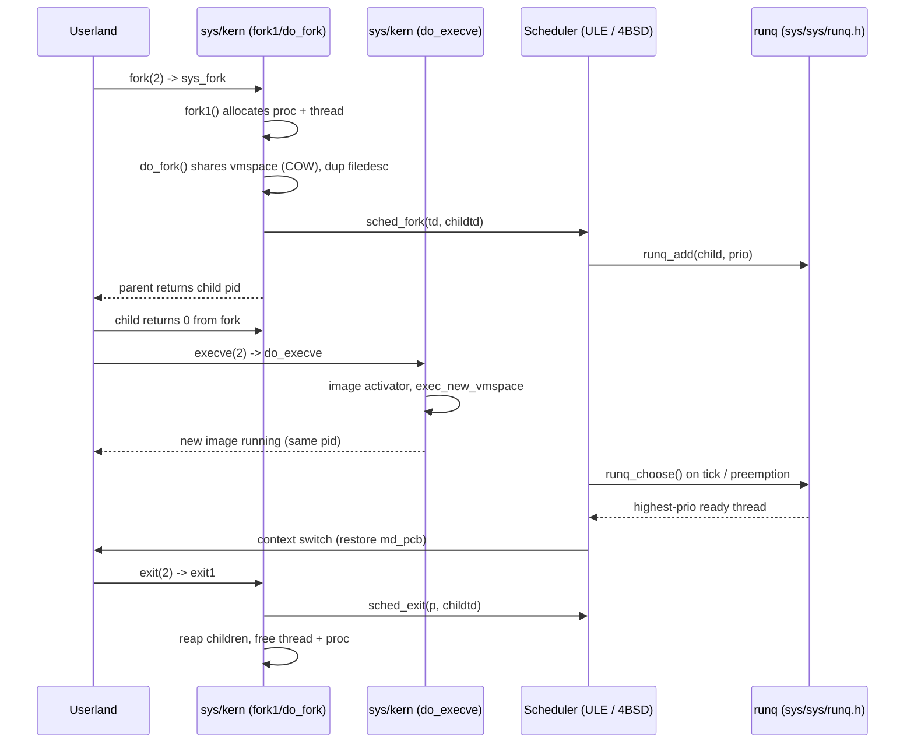

# Process Management — Scheduling and Lifecycle
<!-- This file is auto-generated by generate-doc.py -- do not edit manually -->

---
**Navigation:**
  **Up:** [Kernel Core — Structure and Entry Point](../README.md) ▸ [Source Tree — Layout and Conventions](../../README_internals.md)
  **Related:** [Kernel Core — Structure and Entry Point](../README.md) | [Locking Primitives — Mutexes, sx, rmlocks, and Atomics](README_locking.md) | [Interrupt Handling — Threads, Filters, and Dispatch](README_intr.md) | [Jails — OS-level Isolation](README_jail.md)
  **All chapters:** [Source Tree — Layout and Conventions](../../README_internals.md) | [Boot Process — UEFI Bootloader to Kernel Handoff](../../stand/efi/loader/README.md) | [Kernel Core — Structure and Entry Point](../README.md) | [Build System — buildworld and buildkernel](../../share/mk/README.md) | [System Calls and Image Activation — Entry, sysent, and exec](README_syscall.md) | [Kernel Modules and the Linker — KLD, SYSINIT, and linker sets](README_kld.md) | [Virtual Memory Subsystem — vm_page, UMA, and Pagers](../vm/README.md) | [Locking Primitives — Mutexes, sx, rmlocks, and Atomics](README_locking.md) ...
---

## Quick Summary

A FreeBSD process is the unit of address space, open files, credentials, and a process group; a [thread](#glossary) is the unit of execution that the CPU actually runs. The kernel keeps these two ideas separate but bound together: `struct proc` (defined in `sys/sys/proc.h`) holds everything shared by a process, while `struct thread` (also in `sys/sys/proc.h`) holds the per-thread [state](../netpfil/pf/README.md#glossary) — a kernel stack, the saved register frame, a state, and a priority. Every schedulable entity in the kernel, including the idle thread and interrupt threads, is a `struct thread`, so the scheduler never has to special-case kernel work. The relationship is one-to-many: a `struct thread` points at its owning `struct proc` through `td_proc`, and a single-threaded process is a process with exactly one thread.

Creating a process is a two-step act. [`fork(2)`](../../lib/libsys/fork.2) duplicates the parent's `struct proc` and its single thread, sharing the parent's address space copy-on-write (pages are shared read-only and duplicated only when either process writes to them), and returns a new process that initially runs the same code. [`execve(2)`](../../lib/libsys/execve.2) then tears down the old address space and loads a new program image into it. The entry points are `sys_fork` and `sys_pdfork` in `sys/kern/kern_fork.c`, which funnel into `fork1` and then `do_fork`; the exec path is `do_execve` in `sys/kern/kern_exec.c`. Tearing a process down is handled by `exit1` in `sys/kern/kern_exit.c`, which walks the process tree, reaps children, and frees the thread and process structures.

Choosing which thread runs next is the job of the scheduler, and FreeBSD ships two of them behind a single `sched(9)` KPI (Kernel Programming Interface). The default on `amd64` and `arm64` is ULE (`sys/kern/sched_ule.c`), which keeps an independent [run queue](#glossary) on every CPU, scores each thread's [interactivity](#glossary) from its voluntary-sleep-to-run ratio, and periodically rebalances threads across CPUs with an eye to their [cpuset](#glossary) and topology. The historical 4BSD scheduler (`sys/kern/sched_4bsd.c`) keeps a single global run queue and uses a simpler priority-decay model based on estimated CPU usage and sleep time. Both implement the same `sched(9)` entry points — `sched_switch`, `sched_add`, `sched_load`, and friends — so the rest of the kernel does not know which one is present; the choice is made at build time.

This chapter walks the lifecycle from [`fork(2)`](../../lib/libsys/fork.2) through [`execve(2)`](../../lib/libsys/execve.2) to `exit(2)`, dissects the `struct proc` / `struct thread` pair and the scheduler-private `td_sched` extension, and contrasts ULE's per-CPU queues and interactivity scoring with 4BSD's single global queue. It closes with the run-queue data structures both schedulers share and the CPU-assignment and time-slicing logic that turns a ready thread into a running one.

## Glossary

**thread** — The schedulable unit of execution: a kernel stack, a saved register frame, a state, and a priority, all held in `struct thread`. A process is made of one or more threads.

**run queue** — A priority-ordered list of threads that are ready to run but not currently on a CPU. ULE keeps one per CPU; 4BSD keeps a single global one.

**time slice** — The number of clock ticks a thread may run before the scheduler preempts it and may pick another. Held in `ts_slice` on `struct td_sched`.

**interactivity** — A heuristic score of how I/O-bound (and therefore how latency-sensitive) a thread is, derived from the ratio of time it voluntarily slept to time it ran. ULE uses it to boost interactive threads.

**CPU affinity** — A bias that keeps a thread on the same CPU it last ran on, so its working set stays in that CPU's caches. ULE tracks it via `ts_cpu` and `ts_rltick`.

**cpuset** — A named set of CPUs that a thread is allowed to run on, enforced through `td_cpuset`. It is the mechanism behind [`cpuset(9)`](../../share/man/man9/cpuset.9) and task isolation.

**load balancing** — The periodic migration of threads from an over-loaded CPU to an under-loaded one so that no CPU idles while another is saturated. ULE does this across its per-CPU queues.

**nice value** — A user-adjustable offset (from `nice(2)`) that shifts a timesharing thread's base priority; a higher nice value means lower priority.

**preemption** — The scheduler forcibly removing a running thread from the CPU before it blocks, to run a higher-priority thread that just became ready.

**estcpu** — 4BSD's estimate of a thread's CPU usage, used to decay the priority of threads that keep consuming CPU.

## Architecture

The process/thread pair lives in `sys/sys/proc.h`. `struct proc` is the per-process object: it carries the process ID (`p_pid`), the flags word (`p_flag`), the command name (`p_comm`), the credentials (`p_cred`), the file descriptor table (`p_fd`), the process-group link (`p_pgrp`), the parent pointer (`p_pptr`), and a machine-dependent sub-struct. On `amd64` that sub-struct is `struct mdproc` (in `sys/amd64/include/proc.h`), which holds the process's local descriptor table (`md_ldt`) and per-process flags such as `P_MD_KPTI` and `P_MD_LA48`. `struct thread` is the per-execution object: it carries the thread ID (`td_tid`), the state (`td_state`), the priority (`td_priority`), the pointer to its process (`td_proc`), the kernel stack (`td_kstack`), the cpuset the thread may run on (`td_cpuset`), a pin flag (`td_pinned`), and the machine-dependent register frame (`td_md`, which on `amd64` is `struct mdthread`).

The scheduler is deliberately decoupled from the thread object. A scheduler must keep private bookkeeping for every thread — its remaining [time slice](#glossary), its last CPU, its interactivity counters — but the kernel allocates threads before it knows which scheduler will be built in. FreeBSD solves this with `struct thread0_storage` (in `sys/sys/proc.h`), which embeds a `struct thread` plus a fixed-size byte array `t0st_sched[MAX_SCHED_SIZE]`. The active scheduler's `struct td_sched` is laid over that array, so each scheduler can grow its per-thread state without changing the size of `struct thread` or forcing every thread to know its scheduler. ULE's `td_sched` and 4BSD's `td_sched` are both different layouts of the same underlying space, and both are protected by the thread lock.

The shared run-queue machinery is in `sys/sys/runq.h`. A `struct runq` is an array of `RQ_NQS` priority queues (`rq_queues[]`) plus a `struct rq_status` bit-array (`rq_sw[]`) that records which queues are non-empty. Priorities run from `RQ_MAX_PRIO` (255) down to 0, and with `RQ_PPQ` of 1 each priority maps to exactly one queue, so a `runq` is effectively 256 FIFO lists indexed by priority. The status bit-array lets a scheduler find the highest-priority non-empty queue with a single `ffsl` scan instead of walking 256 lists. Both schedulers build on these primitives; they differ in how many `runq` structures exist and how threads are placed on and chosen from them.

The `sched(9)` KPI, declared in `sys/sys/sched.h`, is the contract both schedulers fulfill. It exposes system-wide queries (`sched_load`, `sched_runnable`, `sched_rr_interval`), per-thread placement (`sched_switch`, `sched_add`), and lifecycle hooks (`sched_fork`, `sched_exit`, `sched_fork_exit`, `sched_class`, `sched_nice`). The kernel calls these entry points and never touches a scheduler's internals. ULE implements them in `sys/kern/sched_ule.c` (with per-CPU state in `struct tdq` and load-balancing helpers like `sched_switch_migrate`, `tdq_runq_add`, `tdq_load_add`), and 4BSD implements them in `sys/kern/sched_4bsd.c` (with its global [queue set](../dev/README_nic_drivers.md#glossary) up by `setup_runqs`). The build selects one of the two by compiling exactly one of the two files into the kernel, driven by the machine's `GENERIC` config option; `amd64` and `arm64` default to ULE, while 4BSD remains selectable for platforms and developers that request it.

## Key Data Structures

The scheduler-private thread state is the cleanest way to see how the two schedulers differ, because both define a `struct td_sched` that overlays the same `t0st_sched` space. ULE's version (from `sys/kern/sched_ule.c`) is built around a sliding time window and interactivity counters:

```c
/* From sys/kern/sched_ule.c — per-thread state, protected by the thread lock. */
struct td_sched {
	short		ts_flags;	/* TSF_* flags. */
	int		ts_cpu;		/* CPU we are on, or were last on. */
	u_int		ts_rltick;	/* Real last tick, for affinity. */
	u_int		ts_slice;	/* Ticks of slice remaining. */
	u_int		ts_ftick;	/* %CPU window's first tick */
	u_int		ts_ltick;	/* %CPU window's last tick */
	/* All ticks count below are stored shifted by SCHED_TICK_SHIFT. */
	u_int		ts_slptime;	/* Number of ticks we vol. slept */
	u_int		ts_runtime;	/* Number of ticks we were running */
	u_int		ts_ticks;	/* pctcpu window's running tick count */
#ifdef KTR
	char		ts_name[TS_NAME_LEN];
#endif
};
```

The fields `ts_cpu` and `ts_rltick` implement [CPU affinity](#glossary): `ts_cpu` remembers the last CPU, and `ts_rltick` records the real tick it ran on so the scheduler can decide whether the thread has "drifted" far enough to justify a migration. The window pair `ts_ftick`/`ts_ltick` bounds the interval over which `ts_slptime` (voluntary sleep ticks) and `ts_runtime` (running ticks) are measured; their ratio is the interactivity score. `ts_slice` is the remaining time slice. The flags `TSF_BOUND` (thread cannot migrate) and `TSF_XFERABLE` (thread was added as transferable) gate migration.

4BSD's version (from `sys/kern/sched_4bsd.c`) is smaller and keeps the classic 4BSD decay state:

```c
/* From sys/kern/sched_4bsd.c — per-thread state, protected by the scheduler lock. */
struct td_sched {
	fixpt_t		ts_pctcpu;	/* %cpu during p_swtime. */
	u_int		ts_estcpu;	/* Estimated cpu utilization. */
	int		ts_cpticks;	/* Ticks of cpu time. */
	int		ts_slptime;	/* Seconds !RUNNING. */
	int		ts_slice;	/* Remaining part of time slice. */
	int		ts_flags;
	int		ts_rqcpu;	/* That CPU's runq or NOCPU => global */
#ifdef KTR
	char		ts_name[TS_NAME_LEN];
#endif
};
```

Here `ts_estcpu` is the estimated CPU utilization and `ts_slptime` is the number of seconds the thread has not been running; together they drive the priority decay. `ts_rqcpu` records which CPU's queue the thread is on, or `NOCPU` for the global queue. The flags `TDF_DIDRUN`, `TDF_BOUND`, and `TDF_SLICEEND` track whether the thread ran, whether it is bound to a CPU, and whether its slice expired.

The shared run queue (from `sys/sys/runq.h`) is what both schedulers enqueue threads on:

```c
/* From sys/sys/runq.h */
#define	RQ_MAX_PRIO	(255)	/* Maximum priority (minimum is 0). */
#define	RQ_PPQ		(1)	/* Priorities per queue. */
#define	RQ_NQS	(howmany(RQ_MAX_PRIO + 1, RQ_PPQ)) /* Number of run queues. */
#define	RQ_PRI_TO_QUEUE_IDX(pri) ((pri) / RQ_PPQ) /* Priority to queue index. */

TAILQ_HEAD(rq_queue, thread);

struct rq_status {
	rqsw_t rq_sw[RQSW_NB];
};

struct runq {
	struct rq_status	rq_status;
	struct rq_queue		rq_queues[RQ_NQS];
};
```

Because `RQ_PPQ` is 1, `RQ_NQS` is 256 and each priority is its own `TAILQ`. The `rq_status` bit-array is the optimization that makes "find the highest-priority ready thread" cheap: `runq_choose` scans `rq_sw` for the first set bit and descends into that one queue.

The machine-dependent thread frame on `amd64` (from `sys/amd64/include/proc.h`) is what `td_md` points at:

```c
/* From sys/amd64/include/proc.h */
struct mdthread {
	int	md_spinlock_count;	/* (k) */
	register_t md_saved_flags;	/* (k) */
	register_t md_spurflt_addr;	/* (k) Spurious page fault address. */
	struct pmap_invl_gen md_invl_gen;
	register_t md_efirt_tmp;	/* (k) */
	int	md_efirt_dis_pf;	/* (k) */
	struct pcb md_pcb;
	void *md_stack_base;
	void *md_usr_fpu_save;
};
```

`md_pcb` is the saved processor context (the register set) that a context switch restores; `md_stack_base` is the top of the kernel stack; `md_usr_fpu_save` points at the lazy FPU state. The `pmap_invl_gen` field participates in the TLB invalidation-generation scheme so a thread can be woken only after pending TLB shootdowns (the process of invalidating stale translation-lookaside-buffer entries on other CPUs after a page-table change) on its address space have drained.

The kernel pins the layout of `struct thread` and `struct proc` with compile-time asserts (from `sys/kern/kern_thread.c`), which is a useful map of where the key KBI (Kernel Binary Interface — the set of struct field offsets that loadable kernel modules depend on) fields sit on `amd64`:

```c
/* From sys/kern/kern_thread.c */
#ifdef __amd64__
_Static_assert(offsetof(struct thread, td_flags) == 0x108,
    "struct thread KBI td_flags");
_Static_assert(offsetof(struct thread, td_pflags) == 0x114,
    "struct thread KBI td_pflags");
_Static_assert(offsetof(struct thread, td_frame) == 0x4e8,
    "struct thread KBI td_frame");
_Static_assert(offsetof(struct thread, td_emuldata) == 0x700,
    "struct thread KBI td_emuldata");
_Static_assert(offsetof(struct proc, p_flag) == 0xb8,
    "struct proc KBI p_flag");
_Static_assert(offsetof(struct proc, p_pid) == 0xc4,
    "struct proc KBI p_pid");
_Static_assert(offsetof(struct proc, p_filemon) == 0x3c8,
    "struct proc KBI p_filemon");
_Static_assert(offsetof(struct proc, p_comm) == 0x3e4,
    "struct proc KBI p_comm");
_Static_assert(offsetof(struct proc, p_emuldata) == 0x4d0,
    "struct proc KBI p_emuldata");
#endif
```

These asserts exist because kernel modules are compiled against the header but linked into a running kernel; if a maintainer moves a field, the assert fails at build time rather than corrupting a module at run time. New fields are conventionally appended to the end of the structures so the offsets of existing KBI fields stay stable.

## Deep Dive

### [fork(2)](../../lib/libsys/fork.2): from `sys_fork` to a new thread

The [`fork(2)`](../../lib/libsys/fork.2) entry point is `sys_fork` in `sys/kern/kern_fork.c`. It fills a `struct fork_req` with the flags `RFFDG | RFPROC` (duplicate the file descriptor table and create a real process) and a pointer to receive the new PID, then calls `fork1`:

```c
/* From sys/kern/kern_fork.c */
int
sys_fork(struct thread *td, struct fork_args *uap)
{
	struct fork_req fr;
	int error, pid;

	bzero(&fr, sizeof(fr));
	fr.fr_flags = RFFDG | RFPROC;
	fr.fr_pidp = &pid;
	error = fork1(td, &fr);
	if (error == 0) {
		td->td_retval[0] = pid;
		td->td_retval[1] = 0;
	}
	return (error);
}
```

The `struct fork_req` (from `sys/sys/proc.h`) is the single argument that carries the whole fork policy down to `do_fork`:

```c
/* From sys/sys/proc.h */
struct fork_req {
	int		fr_flags;
	...
	pid_t		*fr_pidp;
	struct proc	**fr_procp;
	int		*fr_pd_fd;
	int		fr_pd_flags;
	...
};
```

`fork1` performs the shared setup that is independent of the exact fork variant: it reserves the child's kernel stack, allocates the child `struct proc` and its initial `struct thread`, and sets up the parent-child links. `do_fork` then does the heavy lifting: it duplicates the file descriptor table when `RFFDG` is set, shares the address space so the child's pages are copy-on-write (the child gets a new `vm_map` whose objects point back at the parent's), copies the credentials and signal state, and assigns the child its PID and thread ID. The copy-on-write sharing is the key cost-avoidance: [`fork(2)`](../../lib/libsys/fork.2) does not copy the parent's memory, it only duplicates the page-table mappings, so a `fork` followed immediately by `execve` is cheap because the shared pages are never faulted in by the child.

Once the child thread is constructed, the scheduler [hook](../netgraph/README.md#glossary) `sched_fork(td, childtd)` is called so the new thread's `td_sched` is initialized and (on ULE) it is placed on a run queue. The child is left in a state where it will run `ret0` to return from [`fork(2)`](../../lib/libsys/fork.2) with a return value of 0, while the parent returns with the child's PID. The `SDT` [probe](README_driver.md#glossary) `proc:::create` fires here, which is what DTrace's `pidof` and process-creation providers key off.

### [execve(2)](../../lib/libsys/execve.2): replacing the image

[`execve(2)`](../../lib/libsys/execve.2) is the second half of process creation. `do_execve` (in `sys/kern/kern_exec.c`) validates the new image, calls the [image activator](README_syscall.md#glossary) (`exec_elf_imgact` for ELF, `exec_shell_imgact` for scripts, `exec_aout_imgact` for a.out), and then swaps the process's address space. The exec path allocates the argument and environment strings (`exec_copyin_args`), builds the new `vmspace` (`exec_new_vmspace`), maps the program's text and data (`exec_map_stack`, `exec_map_first_page`), and finally replaces the old address space. Because exec keeps the same `struct proc` and the same thread, the PID is preserved; only the address space, file-descriptor flags (`FD_CLOEXEC`), and signal dispositions change. The `proc:::exec` SDT probe marks the transition.

### The thread/process relationship

A `struct thread` is always owned by exactly one `struct proc`, reachable via `td_proc`. The reverse is not one-to-one: a process can have many threads (created by [`kthread(9)`](../../share/man/man9/kthread.9) in the kernel or `pthread_create` in userland), all sharing `p_fd`, `p_cred`, `p_pgrp`, and the address space, but each with its own `td_kstack`, `td_md`, `td_state`, and `td_priority`. A single-threaded process — the common case after `fork`/`exec` — is a process whose thread list has exactly one entry. The thread states live in `td_state`: a thread is `TD_RUN` when it is on a CPU, `TD_SLEEP` when it is blocked on a lock or I/O, `TD_CANRUN` when it is ready and on a run queue, `TD_ZOMBIE` when it has exited but not been reaped, and `TD_QUEUED`/`TD_UNUSED` in the transition states. The scheduler only ever looks at threads in `TD_CANRUN`.

### ULE: per-CPU run queues and interactivity

ULE keeps one `struct runq` per CPU, stored inside a per-CPU `struct tdq` (thread domain queue) along with that CPU's load. The per-CPU design is the core engineering decision: on an SMP machine a single global run queue is a single lock that every context switch and every wake-up must take, so it becomes a contention point exactly when the system is busiest. By giving each CPU its own queue, ULE makes the common case — a thread waking on the CPU that blocked it — a local operation that never touches another CPU's lock. The price is that threads can pile up on one CPU while another idles; ULE pays that price back with periodic [load balancing](#glossary).

When a CPU needs a thread, ULE calls `runq_choose` on its local `runq`, which dispatches to a priority class: `runq_choose_realtime` for the real-time range, `runq_choose_timeshare` for the timesharing range, and `runq_choose_idle` for the idle range. The timesharing path is where interactivity scoring happens. Over the window bounded by `ts_ftick` and `ts_ltick`, ULE has accumulated `ts_slptime` (ticks the thread voluntarily slept) and `ts_runtime` (ticks it ran). A thread that sleeps a lot relative to its running is I/O-bound and interactive — think a shell waiting on a keypress — so ULE raises its effective priority; a thread that runs continuously is a CPU hog, so its priority is held low. This is the same goal as the multilevel feedback queue in textbook schedulers, but computed from an explicit sleep/run ratio rather than a fixed set of aging queues.

CPU assignment in ULE is driven by affinity and cpuset. `ts_cpu` and `ts_rltick` record where and when the thread last ran, so the scheduler prefers to keep it there while its cache-warm working set is still valuable. The `ts_flags` bit `TSF_BOUND` (set when `td_pinned` is nonzero, tested by `THREAD_CAN_MIGRATE`) forbids migration, and `THREAD_CAN_SCHED` checks the thread's `td_cpuset->cs_mask` to ensure a CPU is permitted. When ULE's load balancer decides the local CPU is over-loaded relative to a neighbor, `sched_switch_migrate` moves a transferable thread (`TSF_XFERABLE`) to the other CPU's `runq`, and `tdq_load_add`/`tdq_load_rem` keep each CPU's load count accurate so the next balancing decision is informed.

### 4BSD: one global queue and priority decay

4BSD keeps a single global `struct runq` (set up by `setup_runqs`), so every ready thread on the machine is on the same 256-priority structure. There is no per-CPU queue and no load balancing in the ULE sense; a CPU that finishes a slice just asks the global queue for the next thread. The priority model is the classic 4BSD decay. Each thread carries `ts_estcpu` (an estimate of its CPU usage, kept as a fixed-point fraction) and `ts_slptime` (seconds not running). A thread that has been sleeping gets its effective priority raised (it is presumably waiting on I/O and will be interactive when it resumes), while a thread that keeps running has its priority decayed so it does not starve the others. The decay is bounded by `ESTCPULIM`, and the [nice value](#glossary) enters through `NICE_WEIGHT` (one priority step per nice level) and `INVERSE_ESTCPU_WEIGHT`, which maps the estimated-CPU range onto the timesharing priority band between `PRI_MIN_TIMESHARE` and `PRI_MAX_TIMESHARE`.

```c
/* From sys/kern/sched_4bsd.c */
#define	INVERSE_ESTCPU_WEIGHT	8	/* 1 / (priorities per estcpu level). */
#define	NICE_WEIGHT		1	/* Priorities per nice level. */
#define	ESTCPULIM(e)							\
	min((e), INVERSE_ESTCPU_WEIGHT *				\
	    (PRI_MAX_TIMESHARE - PRI_MIN_TIMESHARE -			\
	    (PRIO_MAX - PRIO_MIN) * NICE_WEIGHT)			\
	    + INVERSE_ESTCPU_WEIGHT - 1)
```

The priority bands themselves are fixed for all of FreeBSD and live in `sys/sys/priority.h`:

```c
/* From sys/sys/priority.h */
#define	PRI_MIN			(0)		/* Highest priority. */
#define	PRI_MAX			(255)		/* Lowest priority. */
#define	PRI_MIN_TIMESHARE	(56)
#define	PRI_MAX_TIMESHARE	(PRI_MIN_IDLE - 1)
```

So interrupt threads occupy 0–7, real-time threads 8–39, top-half kernel threads 40–55, timesharing threads 56–223, and idle threads 224–255. Both schedulers honor these bands; they only differ in how a thread moves within the timesharing band and where its ready state is queued.

### Time slicing and CPU assignment

Both schedulers decrement `ts_slice` once per tick while a thread runs. When `ts_slice` reaches zero the thread is preempted: ULE sets its slice and re-queues it, and 4BSD raises `TDF_SLICEEND` so the next `runq_choose` will not return the same thread. ULE's default slice is short (on the order of a single tick) so interactivity is responsive; 4BSD's default slice is longer (several ticks) because its single global queue makes frequent [preemption](#glossary) more expensive relative to its simpler model. On a context switch the kernel saves the outgoing thread's `md_pcb` and restores the incoming thread's, and the `pmap_invl_gen` check ensures any pending [TLB shootdown](../vm/README.md#glossary) for the incoming address space has completed before the thread resumes.

## Flow / Diagram



## Advanced Notes

**Debugging with DTrace.** The `proc` SDT provider (declared in `sys/kern/kern_fork.c` and `sys/kern/kern_exit.c`) exposes `proc:::create` and `proc:::exit`, and the exec path fires `proc:::exec`. A script on `proc:::create`/`proc:::exit` gives a live view of process churn; correlating the argument `struct proc *` with the process ID shows exactly when a PID is born and reaped. To watch the scheduler itself, the ULE and 4BSD files are built with `KTR` support (`KTR_ULE` in `sched_ule.c`), and [`ktr(4)`](../../share/man/man4/ktr.4) records the `td_sched.ts_name` strings so you can trace a specific thread's queue movements. The `SCHED_STATS` option, when built in, adds per-CPU scheduling counters visible through the `sched` sysctl tree.

**Performance implications.** ULE's per-CPU queues trade a little load imbalance for a large reduction in lock contention on the fast path: a thread that sleeps and wakes on the same CPU never takes a global lock. The load balancer is the mechanism that bounds the imbalance, and its aggressiveness is the main tuning knob — too aggressive and you thrash caches by migrating warm threads, too passive and one CPU saturates while another idles. 4BSD's single global queue is the opposite: the fast path always takes the one global lock, but there is no imbalance to correct, which is why it still behaves predictably on small and single-CPU systems.

**Race conditions and pitfalls.** The `td_sched` fields are only valid under the thread lock (ULE) or the scheduler lock (4BSD); reading them from [DDB](README_kdb.md#glossary) or a probe without the lock can observe a thread mid-migration. The `THREAD_CAN_MIGRATE` and `THREAD_CAN_SCHED` guards exist precisely because a migration that ignores `td_pinned` or `td_cpuset` will place a thread on a CPU it is not allowed to use, which shows up as a stuck or mis-scheduled kernel thread. The `pmap_invl_gen` check on wake is a subtle correctness gate: skipping it lets a thread resume before a TLB shootdown on its address space has drained, which corrupts page-table visibility across CPUs.

**Connection to textbook theory.** The textbook multilevel feedback queue — where a process starts in a high-priority queue and is demoted as it consumes CPU, and boosted when it blocks on I/O — is the abstract model that both schedulers instantiate. 4BSD is the literal, single-queue version: `ts_estcpu` is the "how much CPU have you used" signal and `ts_slptime` is the "you blocked, so you are probably interactive" signal, combined into one decaying priority. ULE is the distributed, per-CPU version of the same idea, where the feedback is an explicit sleep/run ratio over a sliding window and the queues are sharded across CPUs. The priority bands in `sys/sys/priority.h` (real-time 8–39, timesharing 56–223, idle 224–255) are the fixed multilevel structure both schedulers sit on top of, and the POSIX `SCHED_FIFO`/`SCHED_RR` policies map into the real-time band via [`rtprio(2)`](../../lib/libsys/rtprio.2).

**When 4BSD is still selected.** ULE is the default in the `GENERIC` config on `amd64` and `arm64`. 4BSD remains the scheduler on platforms whose default config does not select ULE, and it is always available to a developer who sets the 4BSD scheduler option in a custom kernel config. Because both schedulers satisfy the same `sched(9)` KPI, choosing one is a pure build-time decision: exactly one of `sys/kern/sched_ule.c` and `sys/kern/sched_4bsd.c` is compiled in, and the rest of the kernel is unchanged.

## See Also
- [Kernel Core — Structure and Entry Point](../README.md)
- [Interrupt Handling — Threads, Filters, and Dispatch](README_intr.md)
- [Locking Primitives — Mutexes, sx, rmlocks, and Atomics](README_locking.md)
- [Jails — OS-level Isolation](README_jail.md)


- [`sys/kern/kern_fork.c`](kern_fork.c) — `sys_fork`, `sys_pdfork`, `fork1`, `do_fork`, and the [`fork(2)`](../../lib/libsys/fork.2)/[`vfork(2)`](../../lib/libsys/vfork.2) entry points.
- [`sys/kern/kern_exec.c`](kern_exec.c) — `do_execve` and the image-activation path for [`execve(2)`](../../lib/libsys/execve.2).
- [`sys/kern/kern_exit.c`](kern_exit.c) — `exit1`, `proc_realparent`, and process-tree reaping.
- [`sys/kern/kern_thread.c`](kern_thread.c) — thread creation and the `struct thread`/`struct proc` KBI layout asserts.
- [`sys/kern/sched_ule.c`](sched_ule.c) — the ULE scheduler: per-CPU `struct tdq`, interactivity scoring, and load balancing.
- [`sys/kern/sched_4bsd.c`](sched_4bsd.c) — the 4BSD scheduler: global run queue and priority decay.
- [`sys/sys/runq.h`](../sys/runq.h) — the shared `struct runq`, `struct rq_status`, and `runq_choose` primitives.
- [`sys/sys/sched.h`](../sys/sched.h) — the `sched(9)` KPI both schedulers implement.
- [`sys/sys/proc.h`](../sys/proc.h) — `struct proc`, `struct thread`, `struct session`, `struct pgrp`, and `struct fork_req`.
- [`sys/sys/priority.h`](../sys/priority.h) — the priority classes and bands (`PRI_MIN_TIMESHARE`, `PRI_MAX_TIMESHARE`).
- Man pages: `sched(9)`, `thread(9)`, `proc(9)`, `runq(9)`, [`kthread(9)`](../../share/man/man9/kthread.9), [`cpuset(9)`](../../share/man/man9/cpuset.9), [`fork(2)`](../../lib/libsys/fork.2), [`execve(2)`](../../lib/libsys/execve.2), `exit(2)`, [`rtprio(2)`](../../lib/libsys/rtprio.2), `nice(2)`, [`wait(2)`](../../lib/libsys/wait.2).

---

> _Generated by [DaemonDocs](https://github.com/ocochard/DaemonDocs) on 2026-09-02 16:31 UTC using model `Qwen3.8-27B-Q8_0` (llama.cpp build `b10553-cd26896c1`). AI-generated content — verify against source before relying on it._
