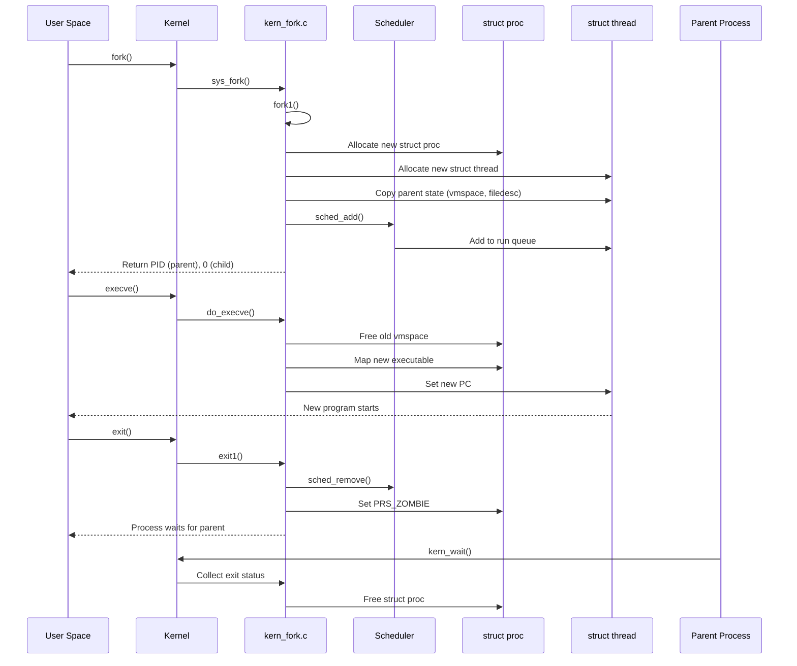

# Process Management — Scheduling and Lifecycle
<!-- This file is auto-generated by generate-doc.py -- do not edit manually -->

---
**Navigation:**
  **Related:** [Kernel Core — Structure and Entry Point](../README.md) | [Locking Primitives — Mutexes, sx, rmlocks, and Atomics](README_locking.md) | [Interrupt Handling — Threads, Filters, and Dispatch](README_intr.md) | [Jails — OS-level Isolation](README_jail.md)
  **All chapters:** [Source Tree — Layout and Conventions](../../README_internals.md) | [Boot Process — UEFI Bootloader to Kernel Handoff](../../stand/efi/loader/README.md) | [Kernel Core — Structure and Entry Point](../README.md) | [Build System — buildworld and buildkernel](../../share/mk/README.md) | [Virtual Memory Subsystem — vm_page, UMA, and Pagers](../vm/README.md) | [Locking Primitives — Mutexes, sx, rmlocks, and Atomics](README_locking.md) | [Buffer Cache — Block I/O Subsystem](../vm/README_bcache.md) | [GEOM — Storage Framework](../geom/README.md) ...
---


> ⚠ **UNVERIFIED DRAFT** — reviewer did not explicitly approve this draft. Treat claims as suspect until manually reviewed.


## Quick Summary
In FreeBSD, a process is the fundamental unit of work. It is not merely a container for memory but a distinct entity with its own address space, file descriptors, and execution context. However, the kernel does not schedule "processes" directly; it schedules threads. Every process must have at least one thread of execution, which carries the actual CPU state (registers, stack, and program counter) and scheduling metadata. This separation allows a single process to execute multiple tasks concurrently, much like threads in a user-space library, but with full kernel privileges and isolation.

The lifecycle of a process begins with creation, typically via the `fork()` system call. This operation duplicates the calling process, creating a child that inherits the parent's memory, open files, and environment. The child then usually calls `execve()` to replace its memory image with a new program. When a process finishes its work, it enters an exit state where it cleans up its resources and waits for its parent to collect its exit status, a mechanism that prevents "zombie" processes from consuming system resources indefinitely.

Scheduling in FreeBSD is handled by the kernel's scheduler, which decides which thread gets to run on which CPU. The classic 4BSD scheduler uses a time-sharing algorithm that estimates a thread's CPU usage and adjusts its priority dynamically. More recent implementations, such as the ULE (Urgent Level Exponential) scheduler, use per-CPU run queues to reduce lock contention and improve interactive performance on multi-core systems. Together, these mechanisms ensure that the system remains responsive while fairly distributing CPU time among competing processes.

## Architecture
The process management subsystem is distributed across several core files in `sys/kern`. The creation of new processes is orchestrated by `sys/kern/kern_fork.c`, which implements `sys_fork()` and the internal `fork1()` function. Process termination and cleanup are handled in `sys/kern/kern_exit.c`, particularly by the `exit1()` function. The lifecycle of threads is managed in `sys/kern/kern_thread.c`, which handles thread creation (`kthread_add()`) and destruction.

Scheduling is implemented through a modular architecture. The generic scheduling interface is defined in `sys/kern/sched.h`, while specific algorithms are implemented in scheduler modules. The classic 4BSD scheduler is found in `sys/kern/sched_4bsd.c`, and the ULE scheduler is in `sys/kern/sched_ule.c`. These modules manage per-CPU run queues directly within their respective implementation files.

The kernel maintains a global list of all processes, accessible via the `allproc` list, which can be traversed using `LIST_FOREACH(p, &allproc, p_list)`. Each process contains a list of its threads, accessible via `LIST_FOREACH(td, &p->p_threads, td_threadq)`. The proctree lock (`proctree_lock`) protects the parent-child and session/process group relationships, while per-thread locks protect individual thread state.

## Key Data Structures
The two primary structures in FreeBSD process management are `struct proc` and `struct thread`.

`struct proc` (defined in `sys/sys/proc.h`) represents the process as a whole. Key fields include:
- `p_state`: The current state of the process (e.g., `PRS_ZOMBIE`, `PRS_RUNNING`).
- `p_pid`: The process identifier.
- `p_pptr`: Pointer to the parent process.
- `p_vmspace`: Pointer to the virtual memory space.
- `p_filedesc`: Pointer to the file descriptor table.
- `p_threads`: A list of threads belonging to the process.

`struct thread` (defined in `sys/sys/proc.h`) represents a single execution context. Key fields include:
- `td_state`: The current state of the thread (e.g., `TS_RUN`, `TS_WAIT`).
- `td_proc`: Pointer to the owning process.
- `td_frame`: The kernel trap frame, containing the CPU registers when the thread was last in the kernel.
- `td_pcb`: The process control block, containing machine-specific context (e.g., stack pointer).
- `td_flags`: Flags indicating thread state, such as `TDF_RUNNING` or `TDF_SLEEPING`.
- `td_sched`: A scheduler-specific extension structure.

For the 4BSD scheduler, `struct td_sched` (defined in `sys/kern/sched_4bsd.c`) contains:
```c
struct td_sched {
	fixpt_t		ts_pctcpu;	/* %cpu during p_swtime. */
	u_int		ts_estcpu;	/* Estimated cpu utilization. */
	int		ts_cpticks;	/* Ticks of cpu time. */
	int		ts_slptime;	/* Seconds !RUNNING. */
	int		ts_slice;	/* Remaining part of time slice. */
	int		ts_flags;
	struct runq	*ts_runq;	/* runq the thread is currently on */
};
```
The `struct runq` (defined in `sys/kern/sched_4bsd.c`) is a set of priority queues:
```c
struct runq {
	struct rq_status	rq_status;
	rq_queue		rq_queues[RQ_NQS];
};
```
It uses a bit array (`rq_status`) to quickly find the highest-priority non-empty queue.

## Deep Dive
### Process Creation: `sys_fork()` / `fork1()`
When a user-space program calls `fork()`, the kernel's `sys_fork()` function in `sys/kern/kern_fork.c` is invoked. It allocates a new process structure and prepares flags like `RFFDG` (share file descriptors) and `RFPROC` (create a process), then calls `fork1()`.

The kernel-side implementation from `sys/kern/kern_fork.c`:
```c
int
sys_fork(struct thread *td, struct fork_args *uap)
{
	struct proc *p2;
	int error, pid;

	error = fork1(td, &p2, &pid, RFFDG | RFPROC, NULL);
	if (error == 0) {
		td->td_retval[0] = pid;
		td->td_retval[1] = 0;
	}
	return (error);
}
```

`fork1()` is the core of the fork operation. It performs several critical steps:
1. **Resource Limits**: Checks if the process has exceeded system limits for the number of processes or memory.
2. **Memory Allocation**: Allocates a new `struct proc` and `struct thread` from the kernel's UMA zones.
3. **State Copying**: Duplicates the parent's address space (`vmspace`), file descriptor table (`filedesc`), signal handlers, and other resources. This is a "copy-on-write" operation; the child initially shares the parent's physical memory pages.
4. **Scheduling**: The child thread is placed on a run queue, ready to execute.
5. **Return Values**: The function sets the return value for the child thread to `0`, while the parent receives the child's PID.

### Process Execution: `do_execve()`
After `fork()`, the child typically calls `execve()` to run a new program. This is handled by `do_execve()` in `sys/kern/kern_exec.c` (for ELF binaries). `execve()` is more destructive than `fork()`; it replaces the process's memory space entirely. Note that `execve()` is the user-space libc wrapper; the kernel entry point is `sys_execve()`.

The kernel-side declaration from `sys/kern/kern_exec.c`:
```c
static int do_execve(struct thread *td, struct image_args *args,
    struct mac *mac_p, struct vmspace *oldvmspace);
```

The `do_execve()` flow involves:
1. **Argument Parsing**: The kernel copies the command-line arguments and environment variables from user space into a kernel virtual address (`exec_args_kva`).
2. **Image Activation**: The `imgact_elf` module identifies the binary format and loads the executable. It maps the new program's segments into the process's virtual address space.
3. **Stack Setup**: A new user-space stack is created, and the arguments/environment are copied onto it.
4. **Execution**: The thread's program counter is set to the entry point of the new binary, and it resumes execution in user mode.

### Process Termination: `exit1()`
When a process calls `exit()` or returns from `main()`, the kernel's `exit1()` function in `sys/kern/kern_exit.c` is called. Note that `exit()` is the user-space libc wrapper; the kernel entry point is `sys_exit()`. This function:
1. **Sends Signals**: Notifies the parent process (if any) via `SIGCHLD`.
2. **Frees Resources**: Closes all file descriptors, releases memory (`vmspace`), and detaches from the terminal.
3. **Zombie State**: The process is not immediately destroyed. It enters the `PRS_ZOMBIE` state, retaining its `struct proc` to store its exit status. This allows the parent to call `kern_wait()` to retrieve the status.
4. **Reparenting**: If the parent is gone, the process is reparented to `init` (PID 1).

### Scheduling: The 4BSD Algorithm
The 4BSD scheduler (`sys/kern/sched_4bsd.c`) uses a time-sharing approach. Each thread has an estimated CPU usage (`ts_estcpu`) and a sleep time (`ts_slptime`). The scheduler dynamically adjusts priorities:
- **Interactive Boost**: Threads that sleep frequently (e.g., waiting for I/O) are given higher priority to improve responsiveness.
- **CPU Hog Detection**: Threads that run for long periods without sleeping have their priority reduced.
- **Time Slicing**: Each thread is allocated a time slice (measured in clock ticks). When the slice expires, the thread is placed back on the run queue, and the next highest-priority thread is scheduled.

The ULE scheduler (`sys/kern/sched_ule.c`) improves on this by using per-CPU run queues (`struct tdq`). This reduces lock contention because each CPU can manage its own queue independently. ULE also supports thread migration, allowing a thread to run on a different CPU if it becomes idle, provided it is not pinned to a specific CPU.

## Flow / Diagram
The following Mermaid diagram illustrates the lifecycle of a process from creation to termination:



## Advanced Notes
### Debugging with DTrace
FreeBSD provides DTrace probes for process management. The `proc:::create` probe fires when a new process is created, providing pointers to the parent and child `struct proc`. The `proc:::exit` probe fires when a process enters the zombie state. These probes are defined in `sys/kern/kern_fork.c` and `sys/kern/kern_exit.c` using `SDT_PROBE_DEFINE`.

Example DTrace script to trace process creation:
```c
proc:::create
{
    printf("PID %d created by PID %d
", arg0->p_pid, arg1->p_pid);
}
```

### Performance Implications
The choice of scheduler has a significant impact on system performance. The 4BSD scheduler, with its single global run queue, can suffer from lock contention on multi-core systems. The ULE scheduler mitigates this by using per-CPU run queues, allowing for better scalability. However, thread migration between CPUs can cause cache misses, which is why ULE tries to keep threads on their "home" CPU when possible.

### Common Pitfalls
- **Zombie Processes**: If a parent process does not call `kern_wait()`, its children will remain in the zombie state, consuming kernel resources. This is a common issue in long-running daemon processes that fork children but do not reap them.
- **Resource Leaks**: Failure to close file descriptors or release memory in `exit1()` can lead to resource exhaustion. The kernel's resource management handles cleanup automatically, but user-space bugs can still cause issues.
- **Priority Inversion**: In real-time systems, a high-priority thread waiting for a low-priority thread to release a lock can cause priority inversion. FreeBSD's mutexes support priority inheritance to mitigate this.

## Comparison
FreeBSD's process management differs significantly from Linux. Linux uses a single `task_struct` to represent both processes and threads, whereas FreeBSD uses separate `struct proc` and `struct thread` structures. This separation allows FreeBSD to have a cleaner abstraction for multi-threaded processes.

Linux's Completely Fair Scheduler (CFS) uses a red-black tree to manage run queues, focusing on fairness and minimizing latency. FreeBSD's 4BSD scheduler uses a set of priority queues with dynamic priority adjustment, which is simpler but can be less predictable under heavy load. The ULE scheduler brings FreeBSD closer to CFS in terms of performance but retains the queue-based approach.

macOS/XNU, derived from FreeBSD, also uses a similar process/thread model but has a more complex scheduler that integrates real-time and user-space priorities. NetBSD and OpenBSD share many similarities with FreeBSD but have their own scheduling algorithms and process management details.

## See Also
- [Kernel Core — Structure and Entry Point](../../sys/README.md)
- [Interrupt Handling — Threads, Filters, and Dispatch](../../../sys/kern/README_intr.md)
- [Locking Primitives — Mutexes, sx, rmlocks, and Atomics](../../../sys/kern/README_locking.md)
- [Jails — OS-level Isolation](../../../sys/kern/README_jail.md)


- [Virtual Memory Subsystem — vm_page, UMA, and Pagers](vm/README.md)
- [Locking Primitives — Mutexes, sx, rmlocks, and Atomics](kern/README_locking.md)
- [Source Tree — Layout and Conventions](../README_internals.md)
- `sys/kern/kern_fork.c`
- `sys/kern/kern_exit.c`
- `sys/kern/sched_4bsd.c`
- `sys/kern/sched_ule.c`
- `sys/sys/proc.h`
- `sys/kern/sched.h`

---

> _Generated by [DaemonDocs](https://github.com/ocochard/DaemonDocs) on 2026-04-30 13:24 UTC using model `Qwen3.6-35B-A3B-UD-Q4_K_XL` (llama.cpp build `b8985-27aef3dd9`). AI-generated content — verify against source before relying on it._
