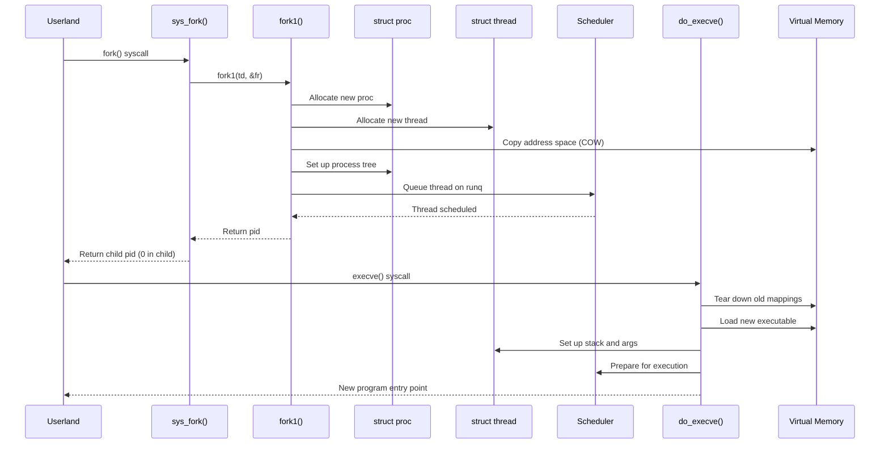

# Process Management — Scheduling and Lifecycle
<!-- This file is auto-generated by generate-doc.py -- do not edit manually -->

---
**Navigation:**
  **Up:** [Kernel Core — Structure and Entry Point](../README.md) ▸ [Source Tree — Layout and Conventions](../../README_internals.md)
  **Related:** [Kernel Core — Structure and Entry Point](../README.md) | [Locking Primitives — Mutexes, sx, rmlocks, and Atomics](README_locking.md) | [Interrupt Handling — Threads, Filters, and Dispatch](README_intr.md) | [Jails — OS-level Isolation](README_jail.md)
  **All chapters:** [Source Tree — Layout and Conventions](../../README_internals.md) | [Boot Process — UEFI Bootloader to Kernel Handoff](../../stand/efi/loader/README.md) | [Kernel Core — Structure and Entry Point](../README.md) | [Build System — buildworld and buildkernel](../../share/mk/README.md) | [Virtual Memory Subsystem — vm_page, UMA, and Pagers](../vm/README.md) | [Locking Primitives — Mutexes, sx, rmlocks, and Atomics](README_locking.md) | [Buffer Cache — Block I/O Subsystem](../vm/README_bcache.md) | [GEOM — Storage Framework](../geom/README.md) ...
---


> ⚠ **UNVERIFIED DRAFT** — reviewer did not explicitly approve this draft. Treat claims as suspect until manually reviewed.


## Quick Summary

FreeBSD manages processes and threads through a carefully designed set of data structures and algorithms that trace their lineage to the original 4BSD scheduler while incorporating modern enhancements like the ULE scheduler. At the heart of this system are two primary structures: `struct proc`, which represents a process and its resources, and `struct thread`, which represents an execution context that runs on a CPU. Each process can have multiple threads, though the most common case is a single-threaded process. The scheduler decides which thread runs next based on priority, estimated CPU usage, and fairness considerations.

Process creation in FreeBSD follows the traditional fork/exec model. When a process calls `fork()`, the kernel creates a new `struct proc` and `struct thread` that are nearly identical to the parent's, sharing most resources through copy-on-write semantics. The child process then typically calls `execve()` to replace its memory image with a new program. During `execve()`, the kernel tears down the old memory mappings, loads the new executable, sets up the stack and argument strings, and prepares the thread to begin execution at the new program's entry point.

The 4BSD scheduler, preserved for compatibility, uses a time-sharing algorithm with dynamic priority adjustment. Threads are placed on run queues indexed by priority, and the scheduler selects the highest-priority runnable thread on each CPU. The ULE scheduler, which is FreeBSD's default, improves on this with independent per-CPU run queues, better interactive performance, and fine-grained locking. Both schedulers use the concept of time slices — each thread gets a quantum of CPU time before being preempted or voluntarily yielding.

Process termination involves cleaning up resources: closing file descriptors, releasing memory mappings, and sending signals to parent processes. The `exit1()` function in `kern_exit.c` handles this cleanup, eventually reaping the process so its exit status can be collected by the parent via `wait()`. Throughout this lifecycle, FreeBSD maintains process accounting, supports debugging via ptrace, and provides mechanisms for process groups and sessions to manage related processes.

## Architecture

The process management subsystem spans several files in `sys/kern/` and `sys/sys/`. The key files are:

- **`sys/kern/kern_fork.c`**: Implements `sys_fork()`, `sys_vfork()`, and the internal `fork1()` function that creates new processes. This file handles process duplication, file descriptor inheritance, and the initial setup of the child thread.

- **`sys/kern/kern_exec.c`**: Implements `sys_execve()` and the internal `do_execve()` function. This file handles loading new program images, setting up the stack, and preparing the process for execution. It works with image activators (imgact) to support different binary formats like ELF and a.out.

- **`sys/kern/kern_exit.c`**: Implements `exit1()` and related functions for process termination. This file handles resource cleanup, signal delivery to the parent, and process reaping.

- **`sys/kern/kern_thread.c`**: Contains thread-related functions including thread creation and management. This file includes KBI (Kernel Binary Interface) assertions that verify the layout of `struct thread` and `struct proc` for module compatibility.

- **`sys/kern/sched_4bsd.c`**: Implements the legacy 4BSD scheduler. This file defines `struct td_sched` with fields for CPU time estimation, slice management, and run queue tracking.

- **`sys/kern/sched_ule.c`**: Implements the ULE scheduler, FreeBSD's default. This file also defines `struct td_sched` but with different fields optimized for the ULE algorithm.

The header files `sys/sys/proc.h`, `sys/sys/sched.h`, and `sys/sys/runq.h` define the core data structures and function prototypes. The `struct proc` and `struct thread` definitions are spread across multiple headers, with architecture-specific fields in `sys/amd64/include/proc.h` or similar machine-dependent headers.

```c
/* From sys/sys/proc.h */
struct session {
	u_int		s_count;	/* Ref cnt; pgrps in session - atomic. */
	struct proc	*s_leader;	/* (m + e) Session leader. */
	struct vnode	*s_ttyvp;	/* (m) Vnode of controlling tty. */
	struct cdev_priv *s_ttydp;	/* (m) Device of controlling tty.  */
	struct tty	*s_ttyp;	/* (e) Controlling tty. */
	pid_t		s_sid;		/* (c) Session ID. */
	char		s_login[roundup(MAXLOGNAME, sizeof(long))];
	struct mtx	s_mtx;		/* Mutex to protect members. */
};

struct pgrp {
	LIST_ENTRY(pgrp) pg_hash;	/* (e) Hash chain. */
	LIST_HEAD(, proc) pg_members;	/* (m + e) Pointer to pgrp members. */
	struct session	*pg_session;	/* (c) Pointer to session. */
sigiolst	pg_sigiolst;	/* (m) List of sigio sources. */
	pid_t		pg_id;		/* (c) Process group id. */
	struct mtx	pg_mtx;		/* (m) Protects pg_members. */
};
```

The `struct session` represents a controlling terminal session, while `struct pgrp` represents a process group. These structures help organize processes for job control and signal delivery. The `s_leader` field in `struct session` points to the session leader process, and `pg_members` contains a list of all processes in the group.

```c
/* From sys/sys/runq.h */
struct runq {
	struct rq_status	rq_status;
	rq_queue		rq_queues[RQ_NQS];
};

struct rq_status {
	rqsw_t rq_sw[RQSW_NB];
};

TAILQ_HEAD(rq_queue, thread);
```

The run queue structure `struct runq` contains an array of thread queues (`rq_queues`) indexed by priority, and a status word array (`rq_status`) that tracks which queues are non-empty. This allows the scheduler to quickly find the highest-priority runnable thread without scanning all queues.

```c
/* From sys/kern/sched_4bsd.c */
struct td_sched {
	fixpt_t		ts_pctcpu;	/* %cpu during p_swtime. */
	u_int		ts_estcpu;	/* Estimated cpu utilization. */
	int		ts_cpticks;	/* Ticks of cpu time. */
	int		ts_slptime;	/* Seconds !RUNNING. */
	int		ts_slice;	/* Remaining part of time slice. */
	int		ts_flags;
	struct runq	*ts_runq;	/* runq the thread is currently on */
#ifdef KTR
	char		ts_name[TS_NAME_LEN];
#endif
};
```

The `struct td_sched` in the 4BSD scheduler tracks per-thread scheduling state. The `ts_estcpu` field estimates CPU utilization for priority adjustment, `ts_slice` tracks the remaining time slice, and `ts_runq` points to the run queue where the thread is currently queued.

```c
/* From sys/kern/sched_ule.c */
struct td_sched {
	short		ts_flags;	/* TSF_* flags. */
	int		ts_cpu;		/* CPU we are on, or were last on. */
	u_int		ts_rltick;	/* Real last tick, for affinity. */
	u_int		ts_slice;	/* Ticks of slice remaining. */
	u_int		ts_ftick;	/* %CPU window's first tick */
	u_int		ts_ltick;	/* %CPU window's last tick */
	u_int		ts_slptime;	/* Number of ticks we vol. slept */
	u_int		ts_runtime;	/* Number of ticks we were running */
	u_int		ts_ticks;	/* pctcpu window's running tick count */
#ifdef KTR
	char		ts_name[TS_NAME_LEN];
#endif
};
```

The ULE scheduler's `struct td_sched` has different fields optimized for its algorithm. The `ts_cpu` field tracks the current or last CPU, `ts_slice` tracks the remaining time slice, and `ts_runtime`/`ts_slptime` track execution time for fairness calculations. The `TSF_BOUND` flag indicates a thread that cannot migrate between CPUs.

## Key Data Structures

### struct proc

The `struct proc` represents a process and its resources. Key fields (from KBI assertions in `kern_thread.c`):

```c
/* From sys/kern/kern_thread.c */
_Static_assert(offsetof(struct proc, p_flag) == 0xb8,
    "struct proc KBI p_flag");
_Static_assert(offsetof(struct proc, p_pid) == 0xc4,
    "struct proc KBI p_pid");
_Static_assert(offsetof(struct proc, p_filemon) == 0x3c8,
    "struct proc KBI p_filemon");
_Static_assert(offsetof(struct proc, p_comm) == 0x3e0,
    "struct proc KBI p_comm");
```

- `p_flag`: Process flags (e.g., P_TRACED, P_STOPPEDSIG)
- `p_pid`: Process ID
- `p_comm`: Command name (truncated to MAXCOMLEN)
- `p_filemon`: File monitoring data

The process structure is embedded in `struct thread` via the `td_proc` pointer, establishing the one-to-many relationship between processes and threads.

### struct thread

The `struct thread` represents an execution context. Key fields (from KBI assertions in `kern_thread.c`):

```c
/* From sys/kern/kern_thread.c */
_Static_assert(offsetof(struct thread, td_flags) == 0x108,
    "struct thread KBI td_flags");
_Static_assert(offsetof(struct thread, td_pflags) == 0x114,
    "struct thread KBI td_pflags");
_Static_assert(offsetof(struct thread, td_frame) == 0x4e8,
    "struct thread KBI td_frame");
_Static_assert(offsetof(struct thread, td_emuldata) == 0x6f0,
    "struct thread KBI td_emuldata");
```

- `td_flags`: Thread flags (e.g., TDF_RUNNING, TDF_SLEEPING)
- `td_pflags`: Private thread flags
- `td_frame`: Machine-dependent register state (userland context)
- `td_emuldata`: Emulation-specific data

The `td_frame` field contains the saved register state when the thread is not running, allowing the scheduler to switch between threads by swapping this context.

### struct runq

The run queue structure from `sys/sys/runq.h`:

```c
/* From sys/sys/runq.h */
#define	RQ_MAX_PRIO	(255)	/* Maximum priority (minimum is 0). */
#define	RQ_PPQ		(1)	/* Priorities per queue. */
#define	RQ_NQS	(howmany(RQ_MAX_PRIO + 1, RQ_PPQ)) /* Number of run queues. */
```

The run queue uses a bit array (`rq_sw`) to track which priority queues are non-empty, allowing O(1) selection of the highest-priority runnable thread. Each queue (`rq_queue`) is a tail queue of threads at that priority level.

## Deep Dive

### Process Creation: fork1()

The `sys_fork()` syscall in `sys/kern/kern_fork.c` sets up a request structure and calls `fork1()`:

```c
/* From sys/kern/kern_fork.c */
int
sys_fork(struct thread *td, struct fork_args *uap)
{
	int error, pid;
	struct fork_req fr;  /* Defined in sys/sys/proc.h */

	bzero(&fr, sizeof(fr));
	fr.fr_flags = RFFDG | RFPROC;
	fr.fr_pidp = &pid;
	error = fork1(td, &fr);
	if (error == 0) {
		td->td_retval[0] = pid;
		td->td_retval[1] = 0;
	}
	return (error);
}
```

The `fork1()` function performs the actual process creation. It:

1. Allocates a new `struct proc` and `struct thread` via `fork_exit()` and related functions
2. Copies the parent's address space using copy-on-write (COW) semantics
3. Duplicates the file descriptor table (with `RFFDG` flag)
4. Sets up the child's register state so it returns 0 from `fork()`
5. Inserts the child into the process tree
6. Schedules the child thread

The SDT probe `proc:::create` fires when a new process is created:

```c
/* From sys/kern/kern_fork.c */
SDT_PROVIDER_DECLARE(proc);
SDT_PROBE_DEFINE3(proc, , , create, "struct proc *", "struct proc *", "int");
```

### Program Execution: do_execve()

The `sys_execve()` syscall in `sys/kern/kern_exec.c` calls `do_execve()`:

```c
static int do_execve(struct thread *td, struct image_args *args,
    struct mac *mac_p, struct vmspace *oldvmspace);
```

The `do_execve()` function:

1. Validates the executable file and permissions
2. Uses image activators (imgact) to determine the binary format (ELF, a.out, etc.)
3. Allocates a new virtual memory space via `exec_new_vmspace()`
4. Maps the executable and shared libraries
5. Sets up the stack with argument strings and environment variables
6. Calls `sched_fork_exit()` to prepare the thread for execution
7. Returns to userland at the new program's entry point

The SDT probe `proc:::exec` fires when exec succeeds:

```c
/* From sys/kern/kern_exec.c */
SDT_PROVIDER_DECLARE(proc);
SDT_PROBE_DEFINE1(proc, , , exec, "char *");
SDT_PROBE_DEFINE1(proc, , , exec__failure, "int");
SDT_PROBE_DEFINE1(proc, , , exec__success, "char *");
```

### Process Termination: exit1()

The `exit1()` function in `sys/kern/kern_exit.c` handles process termination:

1. Calls `sched_exit()` to remove the thread from the scheduler
2. Closes all file descriptors
3. Releases memory mappings
4. Sends `SIGCHLD` to the parent
5. Changes the process state to `ZOMBIE`
6. Updates accounting data via `acct_process()`

The SDT probe `proc:::exit` fires on process exit:

```c
/* From sys/kern/kern_exit.c */
SDT_PROVIDER_DECLARE(proc);
SDT_PROBE_DEFINE1(proc, , , exit, "int");
```

### The 4BSD Scheduler

The 4BSD scheduler in `sys/kern/sched_4bsd.c` uses a time-sharing algorithm with dynamic priority adjustment. Key parameters:

```c
/* From sys/kern/sched_4bsd.c */
#define	INVERSE_ESTCPU_WEIGHT	(8 * smp_cpus)
#define	NICE_WEIGHT		1
#define	ESTCPULIM(e)					min((e), INVERSE_ESTCPU_WEIGHT *					    (NICE_WEIGHT * (PRIO_MAX - PRIO_MIN) +					    PRI_MAX_TIMESHARE - PRI_MIN_TIMESHARE)					    + INVERSE_ESTCPU_WEIGHT - 1)
```

The scheduler maintains `ts_estcpu` for each thread, which is updated based on CPU usage. Threads that sleep frequently get higher priority (lower `ts_estcpu`), while CPU-bound threads get lower priority. The `ts_slice` field tracks the remaining time slice, and when it reaches zero, the thread is preempted.

Thread flags in the 4BSD scheduler:

```c
/* From sys/kern/sched_4bsd.c */
#define TDF_DIDRUN	TDF_SCHED0	/* thread actually ran. */
#define TDF_BOUND	TDF_SCHED1	/* Bound to one CPU. */
#define	TDF_SLICEEND	TDF_SCHED2	/* Thread time slice is over. */
```

### The ULE Scheduler

The ULE scheduler in `sys/kern/sched_ule.c` improves on 4BSD with:

- Independent per-CPU run queues
- Better interactive performance
- Fine-grained locking
- CPU affinity tracking

```c
/* From sys/kern/sched_ule.c */
#define	TSF_BOUND	0x0001		/* Thread can not migrate. */
#define	TSF_XFERABLE	0x0002		/* Thread was added as transferable. */

#define	THREAD_CAN_MIGRATE(td)	((td)->td_pinned == 0)
#define	THREAD_CAN_SCHED(td, cpu)	    CPU_ISSET((cpu), &(td)->td_cpuset->cs_mask)
```

The `THREAD_CAN_MIGRATE()` macro checks if a thread can move between CPUs, while `THREAD_CAN_SCHED()` checks if a CPU is in the thread's cpuset. The ULE scheduler uses `ts_runtime` and `ts_slptime` to track execution time for fairness, and `ts_cpu` to track the current CPU for affinity.

## Flow / Diagram



## Advanced Notes

### Debugging with DTrace

FreeBSD uses SDT (Static DTrace Tracing) probes in process management:

- `proc:::create` - Fires when a new process is created, with arguments for parent and child proc pointers
- `proc:::exec` - Fires on successful exec, with the executable path
- `proc:::exec__failure` - Fires when exec fails, with the error code
- `proc:::exec__success` - Fires on successful exec, with the executable path
- `proc:::exit` - Fires on process exit, with the exit status

These probes can be used with DTrace to trace process lifecycle events:

```
dtrace -n 'proc:::create { printf("Fork: parent=%d child=%d\n", arg0->p_pid, arg1->p_pid); }'
dtrace -n 'proc:::exec { printf("Exec: %s\n", copyinstr(arg0)); }'
dtrace -n 'proc:::exit { printf("Exit: pid=%d status=%d\n", arg0->p_pid, arg1); }'
```

### Performance Implications

The 4BSD scheduler's `ts_estcpu` calculation uses a decay function that gives more weight to recent CPU usage. This means interactive processes (which sleep frequently) get higher priority, while CPU-bound processes get lower priority. The ULE scheduler improves on this with more sophisticated fairness calculations using `ts_runtime` and `ts_slptime`.

The run queue's bit array (`rq_sw`) allows O(1) selection of the highest-priority runnable thread. The `RQSW_BSF()` macro uses `ffsl()` to find the first set bit, which is a single CPU instruction on most architectures.

### Race Conditions and Pitfalls

The KBI assertions in `kern_thread.c` verify that `struct thread` and `struct proc` layouts are stable for module compatibility. Changes to these structures must be accompanied by updates to these assertions. On stable branches after KBI freeze, field offsets must not change.

The `proctree_lock` sx-lock protects the process tree, while per-process mutexes protect individual process data. Deadlocks can occur if locks are acquired in inconsistent order. The lock annotations in `proc.h` (e.g., `(m)` for mutex, `(e)` for sx) help document the locking discipline.

The `td_frame` field contains the saved register state when a thread is not running. If this is corrupted (e.g., by a buggy kernel module), the thread may execute with invalid register state, leading to unpredictable behavior. The KBI assertions help catch such issues during development.

### Connection to OS Theory

The 4BSD scheduler implements the classic time-sharing algorithm described in "The Design and Implementation of the 4.3BSD UNIX Operating System" by Leffler et al. The scheduler uses a decay function to estimate CPU usage:

```
estcpu = estcpu * decay + usage * (1 - decay)
```

This gives more weight to recent usage, allowing the scheduler to adapt to changing process behavior. The ULE scheduler extends this with per-CPU run queues and better fairness calculations, addressing the limitation of the 4BSD scheduler where all CPUs share a single run queue, causing contention on multiprocessor systems.

The fork/exec model is a classic UNIX design pattern that separates process creation from program loading. This allows `fork()` to be fast (just duplicating resources) while `execve()` handles the more complex task of loading a new program. The copy-on-write semantics for address space duplication make `fork()` efficient by avoiding eager copying of memory pages.

## See Also
- [Kernel Core — Structure and Entry Point](../README.md)
- [Interrupt Handling — Threads, Filters, and Dispatch](README_intr.md)
- [Locking Primitives — Mutexes, sx, rmlocks, and Atomics](README_locking.md)
- [Jails — OS-level Isolation](README_jail.md)


Key source directories:
- [`sys/kern/`](.) - Core kernel process management code
- [`sys/sys/proc.h`](../sys/proc.h) - Process and thread structure definitions
- [`sys/sys/sched.h`](../sys/sched.h) - Scheduler interface definitions
- [`sys/sys/runq.h`](../sys/runq.h) - Run queue data structures
- [`sys/kern/sched_4bsd.c`](sched_4bsd.c) - 4BSD scheduler implementation
- [`sys/kern/sched_ule.c`](sched_ule.c) - ULE scheduler implementation

---

> _Generated by [DaemonDocs](https://github.com/ocochard/DaemonDocs) on 2026-05-03 09:09 UTC using model `Qwen3.6-35B-A3B-UD-Q8_K_XL` (llama.cpp build `b8985-27aef3dd9`). AI-generated content — verify against source before relying on it._
