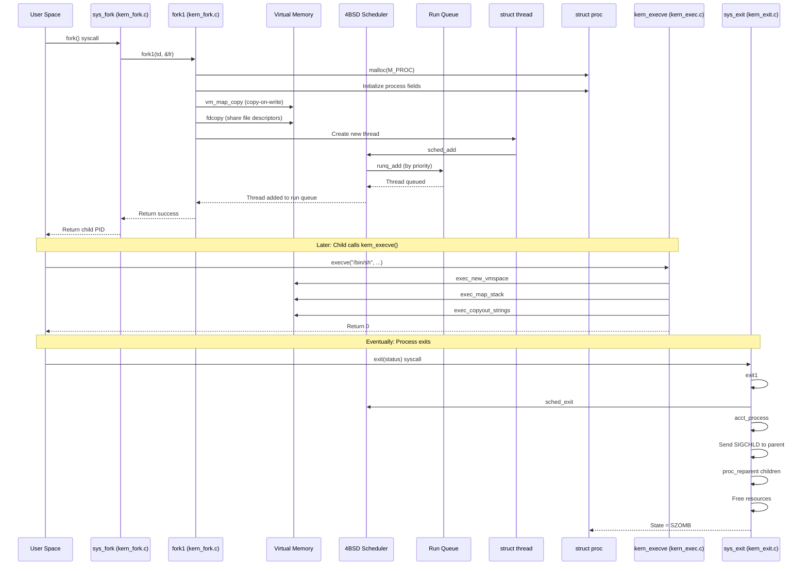

# Process Management — Scheduling and Lifecycle
<!-- This file is auto-generated by generate-doc.py -- do not edit manually -->

---
**Navigation:**
  **Up:** [Kernel Core — Structure and Entry Point](../README.md) ▸ [Source Tree — Layout and Conventions](../../README_internals.md)
  **Related:** [Kernel Core — Structure and Entry Point](../README.md) | [Locking Primitives — Mutexes, sx, rmlocks, and Atomics](README_locking.md) | [Interrupt Handling — Threads, Filters, and Dispatch](README_intr.md) | [Jails — OS-level Isolation](README_jail.md)
  **All chapters:** [Source Tree — Layout and Conventions](../../README_internals.md) | [Boot Process — UEFI Bootloader to Kernel Handoff](../../stand/efi/loader/README.md) | [Kernel Core — Structure and Entry Point](../README.md) | [Build System — buildworld and buildkernel](../../share/mk/README.md) | [Virtual Memory Subsystem — vm_page, UMA, and Pagers](../vm/README.md) | [Locking Primitives — Mutexes, sx, rmlocks, and Atomics](README_locking.md) | [Buffer Cache — Block I/O Subsystem](../vm/README_bcache.md) | [GEOM — Storage Framework](../geom/README.md) ...
---

> ⚠ **UNVERIFIED DRAFT** — reviewer did not explicitly approve this draft. Treat claims as suspect until manually reviewed.

## Quick Summary
FreeBSD manages processes and threads through a layered architecture that separates the concept of a process (a unit of resource ownership) from a thread (a unit of CPU execution). When a program calls the `fork()` library function, the C library wrapper issues the `sys_fork` syscall, which enters the kernel and creates a new process that initially shares the parent's memory through copy-on-write semantics. Each process contains one or more threads, each representing an independent flow of execution with its own register state and kernel stack. The kernel's 4BSD scheduler places runnable threads into priority-based run queues and dispatches them to available CPUs using time-sliced round-robin scheduling within each priority level.

Process creation is a multi-stage operation. The `sys_fork` entry point in `sys/kern/kern_fork.c` delegates to `fork1`, which allocates a new process structure, duplicates the parent's file descriptor table and virtual memory map, creates a new thread, and places it on a run queue. The `kern_execve()` function then replaces the process's memory image with a new program. When a process terminates via `exit`, the kernel reaps its resources, notifies the parent, and potentially re-parents any remaining child processes to init.

The 4BSD scheduler, implemented in `sys/kern/sched_4bsd.c`, uses a hierarchical priority scheme that combines static priority (user-settable nice value, range -20 to 19) with dynamic priority based on CPU usage estimates. Threads are organized into run queues indexed by priority, with each queue holding threads at the same priority level. The scheduler performs round-robin dispatch within each queue, giving each thread a time slice that shrinks as the thread's estimated CPU usage increases. This design ensures that interactive processes receive responsive scheduling while CPU-bound processes do not starve I/O-bound ones.

CPU assignment in FreeBSD is managed through the cpuset framework, which allows threads and processes to be bound to specific subsets of CPUs. The `cpuset` syscalls (`cpuset_setaffinity`, `cpuset_getaffinity`) manipulate these CPU masks, and the scheduler respects them when placing threads on CPUs. On SMP systems, each CPU maintains its own run queue, and the scheduler can steal threads from other CPUs' queues to balance load. The relationship between `struct proc` and `struct thread` is fundamental: a process is a container for resources (memory, file descriptors, signals), while threads are the actual schedulable entities that execute code.

## Architecture
The process management subsystem spans several source files in `sys/kern/`, each responsible for a distinct phase of the process lifecycle:

- **`sys/kern/kern_fork.c`**: Implements `sys_fork`, `sys_vfork`, `sys_clone`, and `sys_pdfork`. The entry point `sys_fork` prepares fork flags and calls `fork1(td, &fr)`, where the internal request structure is populated with flags like `RFFDG` (share file descriptors) and `RFPROC` (create process). The `fork1` function allocates a new `struct proc`, duplicates the file descriptor table via `fdcopy`, copies the virtual memory map via `vm_map_copy`, and creates a new thread via `fork_exit`. An SDT probe `proc:::create` fires for DTrace instrumentation.

- **`sys/kern/kern_exit.c`**: Implements process termination. The `sys_exit` syscall calls `exit1`, which performs accounting (`acct_process`), sends `SIGCHLD` to the parent, detaches the thread from the process, and calls `sched_exit` to notify the scheduler. If the process has children, they are re-parented to the real parent via `proc_reparent`. The function `proc_realparent` walks the process tree under `proctree_lock` to find the correct ancestor.

- **`sys/kern/kern_thread.c`**: Manages thread lifecycle. This file contains KBI (Kernel Binary Interface) assertions that verify the layout of `struct thread` and `struct proc` for module compatibility. It defines thread creation via `fork_exit` and thread teardown. The file includes `sys/sys/turnstile.h` for priority inheritance and `sys/sys/sleepqueue.h` for sleep/wakeup synchronization.

- **`sys/kern/sched_4bsd.c`**: Implements the 4BSD timeshare scheduler. It defines `struct td_sched` which extends `struct thread` with scheduling metadata including `ts_estcpu` (estimated CPU usage), `ts_slptime` (seconds not running), `ts_slice` (remaining time slice), and `ts_pctcpu` (percentage CPU during sleep time). The scheduler uses `struct runq` from `sys/sys/runq.h` to organize threads by priority.

- **`sys/kern/init_main.c`**: Contains `mi_startup`, the kernel's initialization loop that iterates the `sysinit` framework, and `initproc`, which initializes `proc0` (the idle process) and spawns `/sbin/init`.

The `sysinit` framework in `init_main.c` uses ELF linker sets (`__start_set_sysinit`/`__stop_set_sysinit`) to register initialization functions in priority order. `mi_startup` calls `sysinit_compar` to sort entries by `si_sub` and `si_order`, then invokes each function. This ensures that virtual memory initialization (`SI_SUB_VM`) completes before process management (`SI_SUB_RUNCPU`) begins.

## Key Data Structures

### struct proc (from sys/sys/proc.h)
The process structure represents a unit of resource ownership. Key fields include:

```c
struct proc {
    LIST_ENTRY(proc) p_list;    /* List of all processes. */
    struct session *p_session;  /* Pointer to session. */
    struct pgrp *p_pgrp;        /* Pointer to process group. */
    struct thread *p_threads;   /* List of threads. */
    void *p_sysmsg;             /* System call processing state. */
    pid_t p_pid;                /* Process identifier. */
    pid_t p_ppid;               /* Parent process id. */
    struct proc *p_pptr;        /* Pointer to parent process. */
    struct proc *p_oppid;       /* Saved p_pid of parent. */
    struct filedesc *p_fd;      /* Open file information. */
    struct vmspace *p_vmspace;  /* Address space. */
    int p_flag;                 /* P_* flags. */
    int p_stat;                 /* S* process status. */
    char p_comm[MAXCOMLEN + 1]; /* Name, for p_comm. */
    /* ... many more fields ... */
};
```

The `p_stat` field tracks process state: `SSLEEP` (sleeping), `SRUN` (runnable), `SZOMB` (zombie), `SSTOP` (stopped), and `SSIDL` (initializing). The `p_flag` field contains flags like `P_SA` (signal async), `P_TRACED` (being debugged), and `P_WEXIT` (exiting). The `proctree_lock` sx-lock protects the parent-child relationship in the process tree.

### struct thread (from sys/sys/proc.h)
The thread structure represents a schedulable execution context:

```c
struct thread {
    struct proc *td_proc;       /* Back pointer to "current" proc. */
    struct mdthread td_md;      /* Machine-dependent thread state. */
    struct td_sched td_sched;   /* Scheduler-specific state. */
    u_long td_flags;            /* TDF_* flags. */
    struct pcb *td_pcb;         /* Process control block. */
    caddr_t td_kstack;          /* Kernel stack. */
    caddr_t td_sp;              /* Thread stack pointer. */
    struct trapframe *td_frame; /* Kernel trap frame. */
    /* ... many more fields ... */
};
```

The `td_flags` field includes `TDF_RUNNING` (currently executing), `TDF_RUNQ` (on a run queue), `TDF_SLEEPING` (sleeping), and `TDF_SINTR` (interruptible sleep). The `td_sched` substructure contains the 4BSD scheduler's per-thread state. Each thread has its own kernel stack (`td_kstack`) and stack pointer (`td_sp`).

### struct td_sched (from sys/kern/sched_4bsd.c)
The 4BSD scheduler extends each thread with scheduling metadata:

```c
struct td_sched {
    fixpt_t     ts_pctcpu;      /* %cpu during p_swtime. */
    u_int       ts_estcpu;      /* Estimated cpu utilization. */
    int         ts_cpticks;     /* Ticks of cpu time. */
    int         ts_slptime;     /* Seconds !RUNNING. */
    int         ts_slice;       /* Remaining part of time slice. */
    int         ts_flags;
    struct runq *ts_runq;       /* runq the thread is currently on */
#ifdef KTR
    char        ts_name[TS_NAME_LEN];
#endif
};
```

The `ts_estcpu` field tracks estimated CPU usage, computed from `ts_cpticks` (ticks of CPU time) over a decay window. The `ts_slptime` field counts seconds since the thread last ran, which reduces its dynamic priority. The `ts_slice` field is the remaining portion of the thread's time slice; when it reaches zero, the `TDF_SLICEEND` flag is set and the thread is rescheduled.

### struct runq (from sys/sys/runq.h)
The run queue structure organizes threads by priority:

```c
struct runq {
    struct rq_status    rq_status;
    struct rq_queue     rq_queues[RQ_NQS];
};
```

`RQ_NQS` is the number of run queues, computed as `(RQ_MAX_PRIO + 1) / RQ_PPQ` where `RQ_MAX_PRIO` is 255 and `RQ_PPQ` is 1 (priority per queue). The `rq_status` field is a bit array (`rq_sw[RQSW_NB]`) that tracks which queues are non-empty, enabling O(1) finding of the highest-priority runnable thread via `RQSW_BSF` (bit scan first set). Each `rq_queue` is a `TAILQ_HEAD(rq_queue, thread)` — a TAILQ list of `struct thread` pointers at that priority level, defined as a typedef rather than a custom struct.

## Deep Dive

### Process Creation: From sys_fork to a Runnable Thread

When a user-space process calls the `fork()` library function, the C library wrapper issues the `sys_fork` syscall, which enters the kernel through the system call dispatch mechanism. In `sys/kern/kern_fork.c`, the `sys_fork` function is the entry point:

```c
int
sys_fork(struct thread *td, struct fork_args *uap)
{
    struct fork_req fr;
    int error, pid;

    bzero(&fr, sizeof(fr));
    fr.fr_flags = RFFDG | RFPROC;
    fr.fr_pidp = &pid;
    error = fork1(td, &fr);
    if (error == 0) {
        td->td_retval[0] = pid;
        td->td_retval[1] = 0;
    }
    return (error);
}
```

The function initializes an internal request structure with `RFFDG` (share file descriptors with parent) and `RFPROC` (create a process). It passes the address of `pid` to receive the child's PID. The actual work happens in `fork1`, which performs these steps:

1. **Allocate a new process**: `malloc(sizeof(struct proc), M_PROC, M_WAITOK)` allocates a `struct proc` from the `M_PROC` malloc type.

2. **Initialize the process**: The new process inherits the parent's session, process group, credentials, and resource limits. The file descriptor table is duplicated via `fdcopy`, which creates a new `struct filedesc` with references to the same underlying `struct file` objects.

3. **Copy the virtual memory map**: `vm_map_copy` creates a copy-on-write copy of the parent's `vm_map`. This is efficient because pages are not physically duplicated; instead, they are marked read-only and a fault handler duplicates them on write.

4. **Create a new thread**: `fork_exit` creates a new `struct thread` with its own kernel stack. The thread's register state is set up to return from the `fork` syscall with the child PID (0 for the child, parent PID for the parent).

5. **Set up scheduling**: The new thread's `td_sched` structure is initialized with `ts_estcpu = 0`, `ts_slptime = 0`, and `ts_slice` based on the current time slice. The thread is placed on the run queue via `sched_add`.

6. **Fire SDT probe**: `SDT_PROBE(proc, , , create, parent, child, pid)` fires a DTrace probe for process creation tracing.

7. **Return**: The parent's `sys_fork` returns the child PID in `td->td_retval[0]`.

The child thread becomes runnable and will be dispatched by the scheduler on the next clock tick or when the parent yields.

### Thread Representation and the 4BSD Scheduler

The 4BSD scheduler in `sys/kern/sched_4bsd.c` implements a priority-based, time-sliced scheduling algorithm. The key insight is that threads are organized into run queues indexed by priority, and each queue uses a TAILQ for FIFO ordering within the same priority.

The scheduler tracks estimated CPU usage through `ts_estcpu`, which is updated in `statclock` (the periodic clock interrupt handler). The formula for `ts_estcpu` uses an exponential moving average:

```c
#define INVERSE_ESTCPU_WEIGHT (8 * smp_cpus)
#define NICE_WEIGHT 1
#define ESTCPULIM(e)     min((e), INVERSE_ESTCPU_WEIGHT *         (NICE_WEIGHT * (PRIO_MAX - PRIO_MIN) +          PRI_MAX_TIMESHARE - PRI_MIN_TIMESHARE)         + INVERSE_ESTCPU_WEIGHT - 1)
```

The `ts_estcpu` value ranges from 0 to `ESTCPULIM`, and the dynamic priority is computed as:

```
dynamic_priority = static_priority - (ts_estcpu / INVERSE_ESTCPU_WEIGHT)
```

This means that as a thread uses more CPU, its estimated usage increases, and its dynamic priority decreases (higher number = lower priority). The `ts_slptime` field tracks how long a thread has been sleeping, and sleeping threads get a priority boost:

```c
ts->ts_slptime++;
if (ts->ts_slptime > 4) {
    /* Give sleeping threads a priority boost */
}
```

This boost ensures that interactive processes (which sleep waiting for I/O) remain responsive.

When a thread is added to the run queue via `sched_add`, the scheduler:

1. Computes the thread's priority based on `ts_estcpu`, `ts_slptime`, and the nice value.
2. Calls `runq_add(&tdq->tdq_runq, td, 0)` to add the thread to the appropriate run queue.
3. Sets the `TDF_RUNQ` flag on the thread.
4. If this is the highest-priority thread on the CPU, it may trigger a context switch via `cpu_ast` (asynchronous system trap).

The `runq_add` function in `sys/sys/runq.h` adds the thread to the TAILQ at the computed priority index and updates the status word:

```c
void
runq_add(struct runq *rq, struct thread *td, int _flags)
{
    int idx;
    idx = RQ_PRI_TO_QUEUE_IDX(td->td_priority);
    runq_add_idx(rq, td, idx, _flags);
}
```

The `RQ_PRI_TO_QUEUE_IDX` macro converts a priority value to a queue index:

```c
#define RQ_PRI_TO_QUEUE_IDX(pri) ((pri) / RQ_PPQ)
```

### Process Termination: From sys_exit to Resource Reaping

When a process calls `exit()`, the kernel performs the following steps in `sys/kern/kern_exit.c`:

1. **`sys_exit` entry**: The system call entry point receives the exit status code.

2. **`exit1` function**: The main exit routine performs:
   - `acct_process`: Writes accounting information if enabled.
   - `exit_onexit`: Calls any registered exit handlers.
   - `sched_exit`: Notifies the scheduler that the thread is exiting.
   - Sends `SIGCHLD` to the parent process.
   - Detaches the thread from the process.
   - Re-parents any children to the real parent via `proc_reparent`.
   - Frees the process's resources (memory, file descriptors, etc.).
   - Sets the process state to `SZOMB` (zombie).

3. **`proc_reparent`**: Walks the process tree under `proctree_lock` and re-parents orphaned children to their real parent (the parent's parent, or init if the parent was init).

4. **Zombie state**: The process remains in `SZOMB` state until the parent calls the user-space `wait()` library function (described in `man 2 wait`) to reap it. The zombie's exit status is stored in the process structure.

The `proc_realparent` function in `kern_exit.c` finds the correct parent:

```c
struct proc *
proc_realparent(struct proc *child)
{
    struct proc *p, *parent;

    sx_assert(&proctree_lock, SX_LOCKED);
    if ((child->p_treeflag & P_TREE_ORPHANED) == 0)
        return (child->p_pptr->p_pid == child->p_oppid ?
            child : child->p_pptr);
    /* ... handle orphaned case ... */
}
```

## Flow / Diagram



## Advanced Notes

### Debugging with DTrace

FreeBSD's 4BSD scheduler exposes several SDT (Static DTrace Tr probes for debugging:

- **`proc:::create`**: Fires when a new process is created. Arguments: parent proc, child proc, child PID.
- **`proc:::exit`**: Fires when a process exits. Argument: exit status.
- **`proc:::exec`**: Fires when a process executes a new program. Argument: path.

To trace process creation:
```
dtrace -n 'proc:::create { printf("Created PID %d from PID %d\n", arg2, arg1); }'
```

To trace process execution:
```
dtrace -n 'proc:::exec { printf("Exec: %s\n", str(arg0)); }'
```

### Performance Implications

The 4BSD scheduler's use of a bit-array status word (`rq_sw`) for run queue status enables O(1) finding of the highest-priority runnable thread. The `RQSW_BSF` macro uses `ffsl` (find first set bit) to scan the status word:

```c
#define RQSW_BSF(word) __extension__ ({     int _res = ffsl((long)(word));     MPASS(_res > 0);     _res - 1; })
```

This is significantly faster than iterating through all queues. On x86_64, `ffsl` compiles to the `bsf` instruction, which returns the index of the first set bit in a single cycle.

The time slice calculation in the 4BSD scheduler is designed to balance interactivity and throughput. Interactive processes that sleep frequently get a priority boost proportional to their sleep time, up to a maximum boost. This ensures that GUI applications and interactive shells remain responsive even under heavy CPU load.

The `ts_estcpu` field uses an exponential moving average with a decay factor that depends on the number of CPUs (`INVERSE_ESTCPU_WEIGHT = 8 * smp_cpus`). This means that on multi-CPU systems, the estimation window is longer, which smooths out short-term fluctuations in CPU usage.

### Race Conditions and Locking

The scheduler uses several locks to protect its data structures:

- **`sched_lock`**: A mutex that protects the run queues and `td_sched` fields. All run queue operations (`runq_add`, `runq_remove`) acquire this lock.
- **`proctree_lock`**: An sx-lock that protects the parent-child relationship in the process tree. Used by `proc_reparent` and `proc_realparent`.
- **`td->td_lock`**: A per-thread lock that protects thread-specific fields.

A common pitfall is deadlocking when acquiring multiple locks in inconsistent order. The kernel enforces a strict lock ordering: `sched_lock` must be acquired before `proctree_lock`, and both must be acquired before `td->td_lock`.

Another pitfall is the "thundering herd" problem when many threads wake up simultaneously. The scheduler mitigates this by using turnstiles (from `sys/sys/turnstile.h`) for priority inheritance and wakeup optimization.

### Connection to OS Theory

The 4BSD scheduler implements a variant of the Multilevel Feedback Queue (MLFQ) algorithm, as described in Silberschatz, Galvin, and Gagne's "Operating System Concepts". The key differences from the textbook MLFQ are:

1. **Priority decay**: Instead of demoting threads to lower queues after using their time slice, the 4BSD scheduler adjusts the dynamic priority based on `ts_estcpu`, which is a continuous function of CPU usage.

2. **Sleep priority boost**: The 4BSD scheduler gives sleeping threads a priority boost proportional to their sleep time, which is not explicitly described in the basic MLFQ algorithm.

3. **Nice value integration**: The nice value is integrated into the priority calculation as an offset, rather than as a separate queue level.

These modifications make the 4BSD scheduler more suitable for interactive systems while maintaining throughput for batch jobs.

### ULE Scheduler Overview (from sys/kern/sched_ule.c)

FreeBSD also includes the ULE (last three letters of "schedule") scheduler in `sys/kern/sched_ule.c`, which provides an alternative scheduling policy. Unlike the 4BSD scheduler that uses a single `struct td_sched` embedded in `struct thread`, ULE defines its own `struct td_sched` with different fields:

```c
struct td_sched {
    short       ts_flags;       /* TSF_* flags. */
    int         ts_cpu;         /* CPU we are on, or were last on. */
    u_int       ts_rltick;      /* Real last tick, for affinity. */
    u_int       ts_slice;       /* Ticks of slice remaining. */
    u_int       ts_ftick;       /* %CPU window's first tick */
    u_int       ts_ltick;       /* %CPU window's last tick */
    u_int       ts_slptime;     /* Number of ticks we vol. slept */
    u_int       ts_runtime;     /* Number of ticks we were running */
    u_int       ts_ticks;       /* pctcpu window's running tick count */
#ifdef KTR
    char        ts_name[TS_NAME_LEN];
#endif
};
```

Key differences between 4BSD and ULE:

- **Tick-based accounting**: ULE tracks `ts_runtime` and `ts_slptime` in ticks rather than seconds, providing finer-grained scheduling decisions.
- **Affinity tracking**: ULE maintains `ts_rltick` (real last tick) for CPU affinity decisions, allowing threads to be pinned or migrated based on recent execution history.
- **Flag-based binding**: The `TSF_BOUND` flag (`0x0001`) indicates a thread cannot migrate, while `TSF_XFERABLE` (`0x0002`) marks threads eligible for transfer between CPUs.
- **Independent CPU run queues**: ULE supports independent per-CPU run queues with fine-grain locking, providing superior interactive performance under load even on uni-processor systems.

The ULE scheduler is the default scheduler on FreeBSD 6.x and later, while the 4BSD scheduler remains available for compatibility and comparison purposes.

## Comparison

### FreeBSD vs Linux

FreeBSD's process model differs from Linux's in several key ways:

- **Process vs Thread**: FreeBSD has a clear separation between `struct proc` (resource container) and `struct thread` (execution context). Linux uses `task_struct` for both, with threads being lightweight processes (`CLONE_THREAD`). This makes FreeBSD's model more explicit about resource ownership.

- **Scheduler**: FreeBSD's 4BSD scheduler uses priority-based run queues with time-sliced round-robin within each queue. Linux's CFS (Completely Fair Scheduler) uses a red-black tree keyed on virtual runtime, providing finer-grained fairness. FreeBSD's approach is simpler and has lower overhead, while CFS provides more predictable latency.

- **Run Queues**: FreeBSD maintains per-CPU run queues (`struct runq`), while Linux uses per-CPU runqueues (`struct rq`) with additional load-balancing mechanisms. FreeBSD's run queue status word (`rq_sw`) enables O(1) priority finding, while Linux's red-black tree provides O(log n) operations.

- **Memory Management**: FreeBSD uses UMA (Uniform Memory Allocator) for kernel object allocation, while Linux uses SLUB. FreeBSD's `vm_map` uses a red-black tree with `struct vm_map_entry` nodes that contain both `left` and `right` pointers for tree navigation, whereas Linux's `vm_area_struct` uses a simple linked list (`vm_next`/`vm_prev`) for its address space entries. FreeBSD's copy-on-write implementation shares `vm_object` structures between parent and child after `fork()`.

### FreeBSD vs NetBSD/OpenBSD

NetBSD and OpenBSD share similar process management concepts with FreeBSD but differ in implementation details:

- **NetBSD** uses a scheduler similar to 4BSD but with different priority calculations. NetBSD's `struct proc` includes `p_vnet` (a pointer to `struct vnode` for virtual network namespace state) and `p_cred` with separate `p_ucred` for user credentials and `p_racct` for resource accounting fields that FreeBSD keeps in separate structures.

- **OpenBSD** emphasizes security and has simplified the process model. OpenBSD's `struct proc` in `sys/sys/proc.h` uses `LIST_ENTRY(proc) p_list` for the process list (same as FreeBSD) but defines `struct pcpu` per-CPU data differently. OpenBSD's scheduler in `sys/kern/sched_mbi.c` uses a simpler priority scheme with 128 priority levels (vs FreeBSD's 256) and calculates priority as `PRI_TIMESHARE + p_nice` without the exponential moving average decay that FreeBSD's `ts_estcpu` provides. OpenBSD also lacks the `struct td_sched` extension — scheduling metadata is stored directly in `struct thread` without a separate embedded structure.

- **macOS/XNU**: XNU uses the Mach microkernel's `task` and `thread` abstraction where `struct mach_task_basic` contains a `thread_act_array_t` of threads, and scheduling is handled by `bsd_sched` which maps BSD priorities to Mach `policy_priority_t`. Unlike FreeBSD's `struct proc`/`struct thread` split, XNU's `struct proc` contains a pointer to `struct task` which contains the thread list. XNU's scheduler uses `thread_t` with `thread_policy_t` for real-time scheduling (`SCHED_RR`, `SCHED_FIFO`) and `bsd_sched` for BSD timeshare, providing both Mach-level real-time and BSD-level scheduling in a single framework.

## See Also
- [Kernel Core — Structure and Entry Point](../README.md)
- [Interrupt Handling — Threads, Filters, and Dispatch](README_intr.md)
- [Locking Primitives — Mutexes, sx, rmlocks, and Atomics](README_locking.md)
- [Jails — OS-level Isolation](README_jail.md)

- [Source Tree — Layout and Conventions](../../README_internals.md)
- [Virtual Memory Subsystem — vm_page, UMA, and Pagers](../vm/README.md)
- `sys/kern/kern_fork.c` — Process creation
- `sys/kern/kern_exit.c` — Process termination
- `sys/kern/kern_thread.c` — Thread management
- `sys/kern/sched_4bsd.c` — 4BSD scheduler
- `sys/kern/sched_ule.c` — ULE scheduler (alternative)
- `sys/sys/proc.h` — Process and thread structure definitions
- `sys/sys/runq.h` — Run queue definitions
- `sys/sys/sched.h` — Scheduler interface
- `sys/kern/kern_cpuset.c` — CPU set management

---

> _Generated by [DaemonDocs](https://github.com/ocochard/DaemonDocs) on 2026-04-30 22:08 UTC using model `Qwen3.6-35B-A3B-UD-Q4_K_XL` (llama.cpp build `b8985-27aef3dd9`). AI-generated content — verify against source before relying on it._
