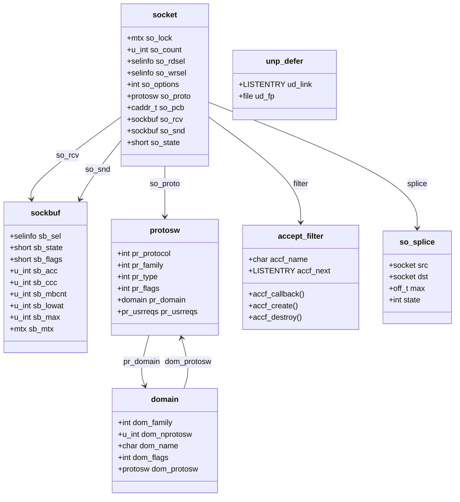

# The Socket Layer — sockets, sockbuf, and UNIX-domain
<!-- This file is auto-generated by generate-doc.py -- do not edit manually -->

---
**Navigation:**
  **Up:** [Kernel Core — Structure and Entry Point](../README.md) ▸ [Source Tree — Layout and Conventions](../../README_internals.md)
  **Related:** [Signals, kqueue, and IPC — Process Communication and Notification](README_ipc.md) | [Network Stack — Architecture and Packet Flow](../net/README.md) | [Transport Protocols — inpcb, tcpcb, TCP State Machine, UDP](../netinet/README_transport.md)
  **All chapters:** [Source Tree — Layout and Conventions](../../README_internals.md) | [Boot Process — UEFI Bootloader to Kernel Handoff](../../stand/efi/loader/README.md) | [Kernel Core — Structure and Entry Point](../README.md) | [Build System — buildworld and buildkernel](../../share/mk/README.md) | [System Calls and Image Activation — Entry, sysent, and exec](README_syscall.md) | [Kernel Modules and the Linker — KLD, SYSINIT, and linker sets](README_kld.md) | [Virtual Memory Subsystem — vm_page, UMA, and Pagers](../vm/README.md) | [Process Management — Scheduling and Lifecycle](README_process.md) ...
---


## Quick Summary

A socket is the kernel's single endpoint object for every kind of communication a program can have: a TCP connection to a web server, a UDP datagram to a DNS resolver, a pipe between two threads, or a UNIX-domain socket that lets two processes on the same machine pass file descriptors to each other. From userland the difference is invisible — the same [`read(2)`](../../lib/libsys/read.2)/[`write(2)`](../../lib/libsys/write.2)/`recvmsg(2)` calls work on all of them. Inside the kernel, that uniformity is produced by one object, `struct socket` (in `sys/sys/socketvar.h`), which holds two byte buffers (one for data going out, one for data coming in), a pointer to the protocol that actually moves the bytes, and the [state](../netpfil/pf/README.md#glossary) that tells the rest of the system what the socket is doing.

The two buffers are the heart of the layer. They are `struct sockbuf` objects (`sys/sys/sockbuf.h`), implemented in `sys/kern/uipc_sockbuf.c`. Every byte a program sends or receives passes through one of them. The buffer is what implements flow control: when it is full, the sender is told to wait; when it drains, the receiver that was sleeping is woken. The same buffer is what [`select(2)`](../../lib/libsys/select.2), [`poll(2)`](../../lib/libsys/poll.2), and [`kqueue(2)`](../../lib/libsys/kqueue.2) watch, so a single piece of state — "how many bytes are available" — drives all of the kernel's I/O-multiplexing machinery.

The reason one `struct socket` can talk to TCP, UDP, or UNIX-domain is a table of function pointers called the protocol switch, `struct protosw` (`sys/sys/protosw.h`). The socket layer never calls a protocol directly; it looks up the right entry in the switch and calls it. A new address family is added by registering a `struct domain` (`sys/sys/domain.h`) that points at a set of `protosw` entries — no change to the socket code itself. UNIX-domain sockets (`sys/kern/uipc_usrreq.c`) are just one such registered family, and they are the one this chapter treats in depth, because they are where the socket layer does something no network protocol can: hand a live file descriptor from one process to another.

This chapter owns the socket abstraction: the socket object, its two buffers, the protocol-switch indirection, and the UNIX-domain protocol. It does not re-explain the TCP or UDP state machines, nor the path a network packet takes from the NIC — those are the Transport and Network chapters. The socket buffer is exactly the seam where that network path ends on receive and begins on send.

## Architecture

The socket layer sits between the file-descriptor layer (`sys/kern/kern_descrip.c`, which turns an integer fd into a `struct file`) and the protocol stacks. When a program calls [`socket(2)`](../../lib/libsys/socket.2), the kernel allocates a `struct socket`, picks the right `protosw` entry for the requested family/type/protocol, and calls that protocol's `PRU_ATTACH` routine. From then on, every operation on the socket is dispatched through the same two objects: the socket itself, and the protocol switch it points at.

**The socket object.** `struct socket` is defined in `sys/sys/socketvar.h`. Its first fields are the lock, a reference count, and two `struct selinfo` objects that record which process is blocked waiting for data or for room:

```c
/* From sys/sys/socketvar.h */
TAILQ_HEAD(accept_queue, socket);
struct socket {
	struct mtx	so_lock;
	volatile u_int	so_count;	/* (b / refcount) */
	struct selinfo	so_rdsel;	/* (b/cr) for so_rcv/so_comp */
	struct selinfo	so_wrsel;	/* (b/cs) for so_snd */
	int	so_options;		/* (b)
```

The locking key in the comment above the struct is the contract every caller must honor. Each field is annotated with the lock that protects it: `(b)` means `SOCK_LOCK(so)` (defined as `mtx_lock(&(so)->so_lock)`), `(cr)` means the receive-buffer lock, `(cs)` means the send-buffer lock, `(e)` means the listening socket's accept-queue lock, `(f)` means no lock is needed because the read/write is an atomic integer, and `(g)` means the field is only ever used as a sleep/wakeup address. Two buffers plus the socket's own mutex is the whole locking story, and it is why the socket layer can be fast: a [thread](README_process.md#glossary) reading from a socket locks only that socket, never a global.

The remaining fields (not shown above, but the load-bearing ones) are `so_proto` (the `struct protosw *` that selects the protocol), `so_pcb` (a `caddr_t` that the protocol uses to keep its own private state — for TCP this is the `tcpcb`, for UNIX-domain the `unpcb`), `so_rcv` and `so_snd` (the two `struct sockbuf` objects), `so_state` (the socket-level state: unconnected, connected, listening, closed), `so_family`, `so_type`, and `so_error`. The accept-queue state is kept in `so_qlen` and `so_incqlen` (the completed and incomplete connection queues on a listening socket). The `xsocket` structure, used to copy a socket out to userland, mirrors these: it carries `xso_protocol`, `xso_family`, `so_qlen`, `so_incqlen`, and `so_oobmark`.

**The two buffers.** `struct sockbuf` is defined in `sys/sys/sockbuf.h` and implemented in `sys/kern/uipc_sockbuf.c`. The comment in the header explains the design: the buffer begins with the fields that I/O-multiplexing APIs (select, kqueue, AIO) read, and those are shared across buffer implementations and protected by the owning socket's buffer lock. The first fields are:

```c
/* From sys/sys/sockbuf.h */
struct sockbuf {
	struct	selinfo *sb_sel;	/* process selecting read/write */
	short	sb_state;		/* socket state on sockbuf */
	short	sb_flags;		/* flags, see above */
	u_int	sb_acc;			/* available chars in buffer */
	u_int	sb_ccc;		/* claimed chars in buffer */
	u_int	sb_mbcnt;		/* chars of mbufs used
```

`sb_acc` is the number of bytes a reader can take; `sb_cc` (just below the truncation point) is the number of bytes actually queued; `sb_ccc` is the number of bytes a writer has *claimed* but not yet appended — this is how a sender reserves room before it has filled it, which is what makes `sbreserve()` possible. `sb_lowat` is the low-water mark: a blocking read does not return until at least this many bytes are available (or an error/EOF). `sb_max` is the hard ceiling, and `sb_hiwat` is the high-water mark used for flow control. The buffer stores its data as a chain of `mbuf`s ([`mbuf(9)`](../../share/man/man9/mbuf.9)), and `sb_mbcnt` tracks how many bytes of [mbuf](../sys/README_mbuf.md#glossary) storage are in use.

The `sb_flags` field is a bitmap that records who is interested in the buffer:

```c
/* From sys/sys/sockbuf.h */
#define	SB_WAIT		0x04		/* someone is waiting for data/space */
#define	SB_SEL		0x08		/* someone is selecting */
#define	SB_ASYNC	0x10		/* ASYNC I/O, need signals */
#define	SB_UPCALL	0x20		/* someone wants an upcall */
#define	SB_AUTOLOWAT	0x40		/* sendfile(2) may autotune sb_lowat */
#define	SB_AIO		0x80		/* AIO operations queued */
#define	SB_KNOTE	0x100		/* kernel note attached */
#define	SB_NOCOALESCE	0x200		/* don't coalesce new data into existing mbufs */
#define	SB_AUTOSIZE	0x800		/* automatically size socket buffer */
```

and the shutdown state bits:

```c
#define	SBS_CANTSENDMORE	0x0010	/* can't send more data to peer */
#define	SBS_CANTRCVMORE		0x0020	/* can't receive more data from peer */
#define	SBS_RCVATMARK		0x0040	/* at mark on input */
```

These flags are why one buffer can wake a blocked thread *and* a kqueue note *and* an AIO (asynchronous I/O) callback *and* an upcall at the same time — the buffer does not know or care which consumers exist; it just sets the bits, and the wakeup path checks each one.

**The protocol switch.** `struct protosw` (`sys/sys/protosw.h`) is the dispatch table. The header's own comment is worth quoting because it states the design intent:

```c
/* From sys/sys/protosw.h */
/*
 * Protocol switch table.
 *
 * Each protocol has a handle initializing one of these structures,
 * which is used for protocol-protocol and system-protocol communication.
 *
 * In retrospect, it would be a lot nicer to use an interface
 * similar to the vnode VOP interface.
 */
```

Each `protosw` entry carries the protocol number, the address family, the socket type, a flag word, a back-pointer to its `struct domain`, and — the field this chapter is about — `pr_usrreqs`, an array of function pointers indexed by a `PRU_*` request code. The socket KPI (kernel programming interface) in `sys/kern/uipc_socket.c` translates a system call into a `PRU_*` code and calls the right slot. The request codes (verified from `sys/netinet/in_kdtrace.h`) are:

```c
#define PRU_ATTACH 0	/* attach protocol to up */
#define PRU_DETACH 1	/* detach protocol from up */
#define PRU_BIND 2	/* bind socket to address */
#define PRU_LISTEN 3	/* listen for connection */
#define PRU_CONNECT 4	/* establish connection to peer */
#define PRU_ACCEPT 5	/* accept connection from peer */
#define PRU_SHUTDOWN 7	/* won't send any more data */
#define PRU_RCVD 8	/* have taken data; more room now */
#define PRU_SEND 9	/* send this data */
#define PRU_ABORT 10	/* abort (fast DISCONNECT, DETATCH) */
#define PRU_SENSE 12	/* return status into m */
```

The send-path flags passed alongside a `PRU_SEND` are a small enum:

```c
/* From sys/sys/protosw.h */
typedef enum {
	PRUS_OOB =		0x1,
	PRUS_EOF =		0x2,
	PRUS_MORETOCOME =	0x4,
	PRUS_NOTREADY =		0x8,
	PRUS_IPV6 =		0x10,
} pr_send_flags_t;
```

`PRUS_NOTREADY` is the one the socket buffer cares about: it lets a protocol (notably TCP with KTLS (Kernel TLS) offload) hand the buffer an mbuf whose data is not yet readable, and the buffer keeps those mbufs from being read until the protocol calls back to ready them.

**The domain.** A `struct domain` (`sys/sys/domain.h`) groups the `protosw` entries for one address family. It is the unit that gets registered at boot:

```c
/* From sys/sys/domain.h */
struct domain {
	SLIST_ENTRY(domain) dom_next;
	int	dom_family;		/* AF_xxx */
	u_int	dom_nprotosw;		/* length of dom_protosw[] */
	char	*dom_name;
	int	dom_flags;
	int	(*dom_probe)(void);	/* check for support (optional) */
	struct rib_head *(*dom_rtattach)	/* initialize routing table */
		(uint32_t);
	void	(*dom_rtdetach)		/* clean up routing table */
		(struct rib_head *);
	struct	protosw *dom_protosw[];
};
```

Registration is a one-liner macro that hooks into the `SYSINIT` (kernel boot-time initialization) framework the boot chapter described:

```c
/* From sys/sys/domain.h */
#define	DOMAIN_SET(name)						\
	SYSINIT(domain_add_ ## name, SI_SUB_PROTO_DOMAIN,		\
	    SI_ORDER_FIRST, domain_add, & name ## domain);		\
	SYSUNINIT(domain_remove_ ## name, SI_SUB_PROTO_DOMAIN,		\
	    SI_ORDER_FIRST, domain_remove, & name ## domain);
```

`domain_add()` (in `sys/kern/uipc_domain.c`) appends the domain to the global `SLIST_HEAD(domainhead, domain) domains` list under `dom_mtx`. That is the entire mechanism by which a new address family becomes usable: build a `protosw` array, wrap it in a `domain`, call `DOMAIN_SET`, and the socket layer will find it. `sys/kern/uipc_domain.c` also provides the `pr_*_notsupp` stubs — `pr_accept_notsupp`, `pr_bind_notsupp`, `pr_connect_notsupp`, `pr_listen_notsupp`, `pr_send_notsupp`, and so on — which a protocol leaves in its `pr_usrreqs` table for operations it does not support, so the socket layer always has a valid function pointer to call and gets `EOPNOTSUPP` back.

## Key Data Structures

The four structures that define the layer are `struct socket`, `struct sockbuf`, `struct protosw`, and `struct domain`, plus the UNIX-domain private state.

`struct socket` (quoted above from `sys/sys/socketvar.h`) is the per-socket object. The fields the socket KPI touches most are `so_proto` (the protocol switch entry), `so_pcb` (protocol-private state), `so_rcv`/`so_snd` (the two buffers), `so_state` (socket state), and `so_error`. The accept-queue length fields `so_qlen` and `so_incqlen` are what `select()`/`kqueue` test to decide whether an [`accept(2)`](../../lib/libsys/accept.2) would block.

`struct sockbuf` (quoted above from `sys/sys/sockbuf.h`) is the per-direction byte queue. The fields that matter for flow control and wakeup are `sb_acc` (available), `sb_cc` (queued), `sb_ccc` (claimed), `sb_lowat` (low-water mark), `sb_max`/`sb_hiwat` (ceiling and flow-control high-water mark), `sb_flags` (who is waiting), and `sb_sel` (the `selinfo` of the process currently selecting on it). The buffer's data is a chain of `mbuf`s.

`struct protosw` (from `sys/sys/protosw.h`) is the dispatch table. Its user-visible half is `pr_usrreqs`, an array of the `pr_*_t` function-pointer types the header defines — `pr_attach_t`, `pr_bind_t`, `pr_connect_t`, `pr_listen_t`, `pr_accept_t`, `pr_send_t`, `pr_soreceive_t`, `pr_ctloutput_t`, `pr_shutdown_t`, `pr_abort_t`, `pr_detach_t`, and the rest. The kernel packet-path half of the switch (the input and timer routines that handle arriving packets and periodic housekeeping) is where the network path from the NIC terminates; that is the Network chapter's territory, and this chapter only notes that the socket buffer is where it lands.

`struct domain` (quoted above from `sys/sys/domain.h`) is the per-address-family container: `dom_family` (the `AF_xxx` value), `dom_nprotosw` (how many `protosw` entries follow), and the flexible `dom_protosw[]` array.

For UNIX-domain sockets, the protocol-private state is the `unpcb` (referenced through `so_pcb`), and the one auxiliary structure worth naming is `struct unp_defer` (in `sys/kern/uipc_usrreq.c`), which the resolver confirms has fields `ud_link` (a list entry) and `ud_fp` (a `struct file *`). It is used to defer closing a file descriptor that is still referenced by a connected peer — the same reference-counting idea that makes `SCM_RIGHTS` safe.

Accept filters are described by `struct accept_filter` (in `sys/sys/socketvar.h`), whose fields are `accf_name[16]`, an `accf_callback` function pointer, an `accf_create` function pointer, an `accf_destroy` function pointer, and `accf_next`. The user-visible argument is `struct accept_filter_arg` (`af_name[16]`, `af_arg[256-16]`).

Finally, `struct so_splice` (in `sys/sys/socketvar.h`) is the state for a `splice(2)` operation that moves bytes from one socket buffer to another without copying through userland:

```c
/* From sys/sys/socketvar.h */
struct so_splice {
	struct socket *src;
	struct socket *dst;
	off_t max;		/* maximum bytes to splice, or -1 */
	struct mtx mtx;
	unsigned int wq_index;
	enum so_splice_state {
		SPLICE_INIT,	/* embryonic state, don't queue work yet */
		SPLICE_IDLE,	/* waiting for work to arrive */
		SPLICE_QUEUED,	/* a wakeup has queued some work */
		SPLICE_RUNNING,	/* currently transferring data */
		SPLICE_CLOSING,	/* waiting for work to drain */
		SPLICE_CLOSED,	/* unsplicing, terminal state */
		SPLICE_EXCEPTION, /* I/O error or limit, implicit unsplice */
	} state;
	struct timeout_task timeout;
	STAILQ_ENTRY(so_splice) next;
};
```

## Deep Dive

### Creating a socket and choosing a protocol

[`socket(2)`](../../lib/libsys/socket.2) ends in `socreate()` in `sys/kern/uipc_socket.c`. It allocates a `struct socket`, zero-fills it, and takes `SOCK_LOCK(so)`. It then walks the `domains` list to find the `struct domain` whose `dom_family` matches the requested `AF_xxx`, and within that domain finds the `protosw` entry whose `pr_type` matches the requested socket type (`SOCK_STREAM`, `SOCK_DGRAM`, `SOCK_SEQPACKET`). It stores that entry in `so->so_proto` and calls `so->so_proto->pr_usrreqs[PRU_ATTACH](so, domain, td)`. From that call onward the socket layer does not know whether it is talking to TCP, UDP, or UNIX-domain — it only knows the `protosw` entry it was handed. This is the whole point of the indirection: `socreate` is identical for every family.

The reverse lookup is how [`bind(2)`](../../lib/libsys/bind.2), [`connect(2)`](../../lib/libsys/connect.2), and [`listen(2)`](../../lib/libsys/listen.2) work. Each of them is a thin wrapper in `sys/kern/uipc_socket.c` that copies the `sockaddr` from userland and then calls `so->so_proto->pr_usrreqs[PRU_BIND]`, `[PRU_CONNECT]`, or `[PRU_LISTEN]` respectively. For a protocol that does not support the operation, the slot holds the corresponding `pr_*_notsupp` stub from `sys/kern/uipc_domain.c` and the call returns `EOPNOTSUPP` — the socket layer never has to special-case a missing operation.

### The send path and flow control

A [`write(2)`](../../lib/libsys/write.2)/[`send(2)`](../../lib/libsys/send.2) on a socket ends in `sosend()` in `sys/kern/uipc_socket.c`. For a stream socket it loops, taking chunks of the user buffer and asking the protocol to send them via `pr_usrreqs[PRU_SEND]`. The protocol (for UNIX-domain, the routine in `sys/kern/uipc_usrreq.c`) appends the data to the *peer's* receive buffer. The buffer-append primitive is `sbappend()` in `sys/kern/uipc_sockbuf.c`, with per-socket-type variants `sbappendstream()`, `sbappendrecord()`, `sbappendaddr()`, and `sbappendcontrol()`.

`sbappend()` is where flow control is enforced. It takes the buffer lock and checks whether the new data would push `sb_cc` past `sb_max`; if so it returns `ENOBUFS` (or, for a blocking sender, the caller loops in `sbwait()` until space appears). When it fits, it appends the mbuf chain, increments `sb_cc` and `sb_acc`, and — critically — calls the buffer's wakeup path. That path looks at `sb_flags`: if `SB_WAIT` is set it wakes the thread sleeping in `sbwait()`; if `SB_KNOTE` is set it signals the attached `knote`s; if `SB_ASYNC` is set it posts an AIO completion; if `SB_UPCALL` is set it invokes the socket's upcall. One append, four possible consumers, decided by a bitmap. That is the answer to "how does a socket buffer wake a blocked or kqueue-registered reader": it does not wake a specific reader, it raises the bits and lets the wakeup fan out.

`sbwait()` is the blocking half. A reader with fewer than `sb_lowat` bytes available calls it; it sets `SB_WAIT`, drops the buffer lock, and sleeps on the buffer as the sleep address (the `(g)` locking key). When `sbappend()` on the other side appends data and sees `SB_WAIT`, it wakes exactly that sleeper. The low-water mark is what makes `SB_AUTOLOWAT` meaningful: [`sendfile(2)`](../../lib/libsys/sendfile.2) may raise `sb_lowat` so that a single wake delivers a full burst instead of waking the reader byte by byte.

`sbreserve()` is the claim-without-fill primitive. A sender that needs room before it knows how much it will write calls it to bump `sb_ccc` (claimed chars) up to the amount it intends to use, so that no other sender can take that space. If the buffer cannot honor the claim it returns `ENOBUFS`. The buffer's efficiency parameter, `sb_efficiency` (initialized to 8 in `sys/kern/uipc_sockbuf.c`), governs how aggressively the buffer rounds the claim up to whole-mbuf boundaries so that the subsequent append does not fragment.

The space/availability queries are `sbspace()` (how many more bytes fit) and `sbavail()` (how many bytes are readable), both in `sys/kern/uipc_sockbuf.c`. `soreceive()` in `sys/kern/uipc_socket.c` uses `sbavail()` to decide whether a blocking read must sleep, and the protocol's `pr_soreceive_t` routine pulls the actual bytes out of the buffer.

### The receive path and the network seam

On receive, the network path (NIC → driver → `netisr` → protocol input) is the Network chapter's concern. The socket layer's concern begins at the last hop: the protocol's input routine appends the packet's payload to the socket's `so_rcv` buffer via `sbappend()`. That single call is the seam. Everything the socket layer knows about "data arrived" is the change in `sb_acc` plus the wakeup bits that `sbappend()` raises. `soreceive()` then copies out of the buffer, and when the reader has consumed enough to free space it calls `pr_usrreqs[PRU_RCVD]` so the protocol knows it may send more (for TCP this is the credit that advances the window). `SB_AUTOSIZE` lets the buffer grow `sb_max` under sustained load so a fast sender is not throttled by a small default.

### UNIX-domain sockets and SCM_RIGHTS

UNIX-domain sockets are registered exactly like any other family: a `struct domain` for `AF_UNIX` whose `dom_protosw[]` points at the `protosw` entries for `SOCK_STREAM`, `SOCK_DGRAM`, and `SOCK_SEQPACKET`, each with its `pr_usrreqs` table filled in by the routines in `sys/kern/uipc_usrreq.c`. The protocol-private state is the `unpcb` in `so_pcb`. Because there is no network, the "send" of a stream segment is a direct copy into the peer's `so_rcv` buffer (the peer is another `struct socket` on the same machine), and there is no address to route to — the peer is found by the connection the `unpcb` already holds. `unp_disconnect()` (verified present in `sys/kern/uipc_usrreq.c`) is the teardown path; it walks the connected peers and, for any file descriptor that is still referenced across the connection, parks it in a `struct unp_defer` (`ud_link`, `ud_fp`) so the close is deferred until the last reference drops.

The capability that makes UNIX-domain sockets the unifying IPC (inter-process communication) endpoint is `SCM_RIGHTS`, the control message that passes a file descriptor from one process to another over a `sendmsg(2)`/`recvmsg(2)`. The mechanism is pure reference counting on the file-descriptor table (`sys/kern/kern_descrip.c`):

1. The sender's `sendmsg(2)` carries a `SCM_RIGHTS` control message listing fd numbers. For each, the kernel calls `fget()` (in `sys/kern/kern_descrip.c`) to look up the `struct file` and *increment its reference count*. The fd number is then copied into a control mbuf that travels with the message. The sender's own fd is untouched — it still owns its descriptor; the kernel has merely guaranteed the underlying open file will not be destroyed.
2. The message (data mbuf plus control mbuf) is appended to the peer's `so_rcv` buffer by the UNIX-domain send routine, just like any other byte.
3. The receiver's `recvmsg(2)` pulls the control mbuf out. For each fd number in it, the kernel allocates a *new* fd in the receiver's own file-descriptor table, pointing at the same `struct file` the sender's `fget()` had pinned. The receiver now has its own integer that refers to the shared open file.
4. The kernel drops the reference the sender's `fget()` had taken. The open file stays alive as long as either process holds a descriptor to it.

The net effect: two processes that share no address space now share an open file, each with its own fd number. The socket layer did nothing protocol-specific here — it moved an mbuf from one buffer to another. The file-descriptor magic is entirely in the `SCM_RIGHTS` handling, which is why it is owned by this chapter (the socket/IPC layer) and not by the VFS or the transport. This is the concrete reason a program can `read()`/`write()` the same way on a pipe, a regular file, and a TCP connection: in every case the fd resolves to a `struct file`, and for a socket that `struct file` is a thin wrapper around a `struct socket` whose buffers and protocol switch do the real work.

### Accept filters

An accept filter lets a listening socket defer handing a connection to userland until the connection is actually ready — for example, until the first bytes of an HTTP request have arrived, so the server is not woken for a connection that is still mid-handshake. The socket layer supports this through `struct accept_filter` (`sys/sys/socketvar.h`): a name, an `accf_callback` (called as data arrives on the pending connection, returning a flag that says "ready" or "not yet"), an `accf_create` (called when the filter is attached, to set up per-connection state), and an `accf_destroy`. The management routines are in `sys/kern/uipc_accf.c`: `accept_filt_add()` and `accept_filt_del()` register and unregister filters, `accept_filt_get()` looks one up by name, and `accept_filt_getopt()`/`accept_filt_setopt()` read and write the per-socket filter state via [`getsockopt(2)`](../../lib/libsys/getsockopt.2)/`setsockopt(2)`. When a connection completes on a listening socket that has a filter attached, the socket layer calls `accf_callback` instead of immediately queueing the connection as completed; only when the callback reports ready does the connection move from `so_incqlen` to `so_qlen` and wake the [`accept(2)`](../../lib/libsys/accept.2). This is the socket layer's extensibility [hook](../netgraph/README.md#glossary): a new "readiness" policy is added by registering a filter, with no change to the accept path.

## Flow / Diagram



The arrows read as the layer's dependencies: a `socket` owns two `sockbuf`s and points at one `protosw`; that `protosw` points back at its `domain`, and the `domain` points forward at the array of `protosw` entries it registered. `accept_filter` and `so_splice` are the two extensibility objects a socket may carry.

## Advanced Notes

**Debugging.** The socket layer is one of the most DTrace-instrumented parts of the kernel. The `socket` provider (declared in `sys/netinet/in_kdtrace.h`) fires a [probe](README_driver.md#glossary) at each `PRU_*` transition, so a one-line script like `dtrace -n 'socket*:pru-*{printf("%s %d", probefunc, arg0)}'` traces every socket operation with its request code. Because the probes are keyed on the `PRU_*` codes listed earlier, the trace reads as a protocol-independent history of what happened to each socket. For buffer pressure, watch `sb_acc` versus `sb_max` and the `SB_WAIT`/`SB_KNOTE` bits: a socket that is constantly full has `SB_WAIT` set on its send buffer and a sleeping sender, which is the signature of a slow reader, not a slow network. The `xsocket` structure exists precisely so that `sockstat(8)`-style tooling can copy a socket's state out to userland without the kernel locking the live object.

**Performance.** The single most important property is that the buffer is a chain of `mbuf`s, not a contiguous array. `sbappend()` coalesces small appends into the trailing mbuf when there is room (controlled by `SB_NOCOALESCE`, which disables it for protocols that need mbuf boundaries preserved), so a burst of small [`write(2)`](../../lib/libsys/write.2)s does not produce a burst of mbufs. `sb_efficiency` (8) rounds reserved space to whole-mbuf boundaries to avoid fragmentation. `SB_AUTOSIZE` grows `sb_max` under sustained load, which is what lets a high-throughput TCP socket exceed the 8 MiB `SB_MAX` default in practice. `splice(2)` (`struct so_splice`) moves bytes between two socket buffers through a kernel workqueue without a userland copy — the `SPLICE_*` state machine in the struct is the lifecycle of that transfer.

**Locking and races.** The locking key in `sys/sys/socketvar.h` is the contract. The classic bug is touching a field under the wrong lock: `so_rcv`'s counters are protected by the receive-buffer lock (`(cr)`), not `SOCK_LOCK`, so a reader that holds only `SOCK_LOCK` and reads `sb_acc` is racing. The `SOCKBUF_LOCK_ASSERT()` macro (defined in `sys/sys/sockbuf.h` as `mtx_assert(SOCKBUF_MTX(_sb), MA_OWNED)`) is the kernel's way of catching exactly that in debug builds. The `(f)` fields — atomic integer reads/writes — are the ones safe to read without any lock, which is how `select()` can test `so_qlen` cheaply. The `so_count` reference count (`(b)`) is what lets a protocol keep a socket alive across an asynchronous callback (a KTLS upcall, a splice workqueue [item](../netgraph/README.md#glossary)) after the last [`close(2)`](../../lib/libsys/close.2) has returned.

**Pitfalls.** The `PRUS_NOTREADY` flag is the subtler one: a protocol may hand the buffer an mbuf it has not finished producing, and the buffer must not let a reader copy from it until the protocol calls back to ready it. Getting that ordering wrong is a use-after-free on the mbuf. On the `SCM_RIGHTS` side, the pitfall is forgetting that the receiver's new fd and the sender's original fd refer to the *same* open file, so file offsets and locks are shared between the two processes unless the underlying file gives each descriptor its own — a source of surprising behavior when a passed fd is a regular file. And on accept filters, the failure mode is a filter whose `accf_callback` never reports ready: the connection sits in `so_incqlen` forever and the [`accept(2)`](../../lib/libsys/accept.2) never wakes, so a buggy filter looks exactly like a hung server.

**Theory connection.** The socket layer is the textbook "communication subsystem" of an OS (the chapter on communication protocols in the standard OS texts) made concrete. The `protosw` table is the same pattern as the vnode `vop` table the header's comment alludes to — a uniform interface with per-implementation function pointers — which is why the comment wistfully notes it "would be a lot nicer to use an interface similar to the vnode VOP interface." The two-buffer design is the classic full-duplex channel: each direction has its own buffer, its own flow-control high-water mark, and its own set of waiters, which is what makes a socket a true bidirectional endpoint rather than a pair of unidirectional pipes.

## See Also
- [Network Stack — Architecture and Packet Flow](../net/README.md)
- [Transport Protocols — inpcb, tcpcb, TCP State Machine, UDP](../netinet/README_transport.md)
- [Signals, kqueue, and IPC — Process Communication and Notification](README_ipc.md)


- [`sys/kern/uipc_socket.c`](uipc_socket.c) — the socket KPI: `socreate`, `soreceive`, `sosend`, and the `PRU_*` dispatch.
- [`sys/kern/uipc_sockbuf.c`](uipc_sockbuf.c) — `sbappend`, `sbwait`, `sbreserve`, `sbavail`, `sbspace`, and the wakeup path.
- [`sys/kern/uipc_usrreq.c`](uipc_usrreq.c) — the UNIX-domain protocol, `unp_disconnect`, `struct unp_defer`, and `SCM_RIGHTS` handling.
- [`sys/kern/uipc_domain.c`](uipc_domain.c) — `domain_add`, the `pr_*_notsupp` stubs, and the `domains` list.
- [`sys/kern/uipc_accf.c`](uipc_accf.c) — `accept_filt_add`, `accept_filt_get`, and the accept-filter management.
- [`sys/kern/kern_descrip.c`](kern_descrip.c) — the file-descriptor table that `SCM_RIGHTS` reference-counts.
- [`sys/sys/socketvar.h`](../sys/socketvar.h), [`sys/sys/sockbuf.h`](../sys/sockbuf.h), [`sys/sys/protosw.h`](../sys/protosw.h), [`sys/sys/domain.h`](../sys/domain.h) — the four defining headers.
- The Transport chapter for the TCP/UDP state machines and `tcpcb`/`inpcb` that live in `so_pcb`.
- The Network Stack chapter for the NIC-to-`netisr` path that terminates at the socket buffer.
- Man pages: [`socket(2)`](../../lib/libsys/socket.2), `sendmsg(2)`, `recvmsg(2)`, [`accept(2)`](../../lib/libsys/accept.2), [`bind(2)`](../../lib/libsys/bind.2), [`connect(2)`](../../lib/libsys/connect.2), [`listen(2)`](../../lib/libsys/listen.2), [`shutdown(2)`](../../lib/libsys/shutdown.2), [`select(2)`](../../lib/libsys/select.2), `kevent(2)`, `splice(2)`, [`socket(9)`](../../share/man/man9/socket.9), `sockbuf(9)`, `protosw(9)`, [`mbuf(9)`](../../share/man/man9/mbuf.9), [`mutex(9)`](../../share/man/man9/mutex.9), `file(9)`, `sdt(9)`.

---

> _Generated by [DaemonDocs](https://github.com/ocochard/DaemonDocs) on 2026-08-27 10:45 UTC using model `Qwen3.8-27B-Q8_0` (llama.cpp build `b10553-cd26896c1`). AI-generated content — verify against source before relying on it._
