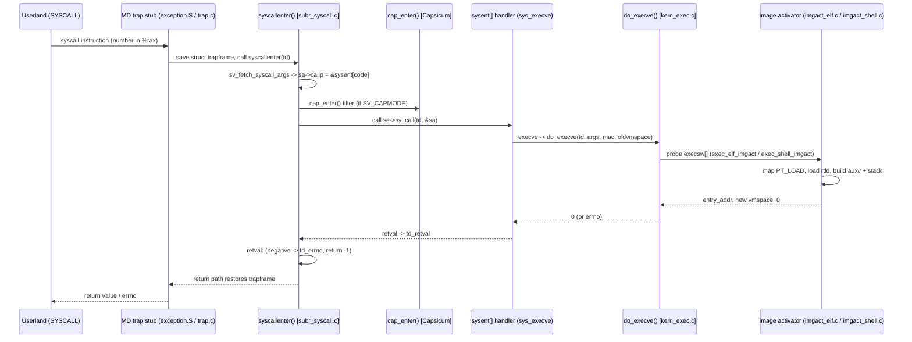

# System Calls and Image Activation — Entry, sysent, and exec
<!-- This file is auto-generated by generate-doc.py -- do not edit manually -->

---
**Navigation:**
  **Up:** [Kernel Core — Structure and Entry Point](../README.md) ▸ [Source Tree — Layout and Conventions](../../README_internals.md)
  **Related:** [Kernel Core — Structure and Entry Point](../README.md) | [Process Management — Scheduling and Lifecycle](README_process.md) | [Capsicum — Capability Mode and Sandboxing](README_capsicum.md)
  **All chapters:** [Source Tree — Layout and Conventions](../../README_internals.md) | [Boot Process — UEFI Bootloader to Kernel Handoff](../../stand/efi/loader/README.md) | [Kernel Core — Structure and Entry Point](../README.md) | [Build System — buildworld and buildkernel](../../share/mk/README.md) | [Kernel Modules and the Linker — KLD, SYSINIT, and linker sets](README_kld.md) | [Virtual Memory Subsystem — vm_page, UMA, and Pagers](../vm/README.md) | [Process Management — Scheduling and Lifecycle](README_process.md) | [Locking Primitives — Mutexes, sx, rmlocks, and Atomics](README_locking.md) ...
---


## Quick Summary

Every time a userland program asks the kernel to do something — read a file, open a socket, spawn a child — it executes a single privileged instruction: `SYSCALL` on amd64 (or `INT 0x80` on the legacy path). That instruction is the only door from the unprivileged world into the kernel. This chapter traces what happens between that instruction and the C function that actually implements the call, and then follows one of the most consequential calls, `execve`, all the way to the point where a new program image replaces the caller's address space.

The machine-independent dispatch lives in `sys/kern/subr_syscall.c`. The syscall number that the user placed in a register is used to index a fixed table, `sysent[]`. Each entry in that table is a `struct sysent` that names the implementing function, the number of arguments, the audit event, and the DTrace [probe](README_driver.md#glossary) IDs. The arguments are copied from user memory into a per-[thread](README_process.md#glossary) `struct syscall_args`, the handler is invoked, and its integer result is either a return value or a negative `errno` that is propagated back to userland. A separate, machine-dependent stub does the register save/restore; the rest is shared by every architecture.

The table itself is not hand-maintained. It is generated at build time from a single declarative source, `sys/kern/syscalls.master`, which also produces the syscall number header and the libc stubs, so the three can never drift apart. Loadable kernel modules can add new system calls at runtime by claiming one of the reserved `lkmnosys` slots through the `SYSCALL_MODULE` mechanism, using the special `NO_SYSCALL` offset to let the kernel pick the first free slot.

The second half of the chapter covers image activation. `execve` is itself a system call, but unlike most it does not merely read or write — it rebuilds the calling process's entire address space. `sys/kern/kern_exec.c` walks a list of registered image activators; the ELF activator (`sys/kern/imgact_elf.c`) maps the program's `PT_LOAD` segments, pulls in the dynamic linker (rtld) for dynamically-linked binaries, and lays down the auxiliary vector and initial stack. The shell activator (`sys/kern/imgact_shell.c`) handles `#!` scripts by rewriting the argument vector so the named interpreter runs the script. Connecting the two halves: `execve` is the system call that turns a file on disk into the very program that will next issue system calls.

## Glossary

**sysent** — The per-architecture array of `struct sysent` entries that maps a numeric syscall number to its implementing function, argument count, audit event, and DTrace probe IDs.

**sysentvec** — The per-binary-format vector (`struct sysentvec`) that bundles a `sysent` table with the stack-fixup, signal-delivery, and core-dump helpers a given ABI needs.

**image activator** — A registered `struct execsw` entry whose `ex_imgact` function knows how to turn one specific binary format (ELF, a.out, a `#!` script) into a running address space.

**PT_LOAD** — An ELF program-header segment that describes a contiguous region of the file to be mapped into the new process's address space, with its virtual address, file size, memory size, and protection.

**rtld (dynamic linker)** — The userland interpreter (`/libexec/ld-elf.so.1`) that the kernel maps and jumps into so that shared-library relocations are resolved in user mode rather than in the kernel.

**auxiliary vector (auxv)** — A machine-word array placed on the initial user stack that carries ABI facts (page size, entry point, random seed, `AT_*` entries) from the kernel to the program and its rtld.

**NO_SYSCALL** — A sentinel offset value a loadable module passes to `SYSCALL_MODULE` meaning "assign me the next free `lkmnosys` slot in `sysent[]`."

**copyin / copyinstr** — The kernel's safe user-to-kernel memory copy primitives; `copyin` copies a fixed-size object, `copyinstr` copies a NUL-terminated string, both validating the user address before touching it.

## Architecture

The boundary between user and kernel is enforced by the CPU's privilege modes. A userland `SYSCALL` instruction causes a transition into kernel mode with the syscall number in `%rax` (amd64) and the arguments in the standard register set. The machine-dependent trap stub — `sys/amd64/amd64/exception.S` for amd64 — saves the user registers into a `struct trapframe`, switches to a kernel stack, and hands control to the machine-independent entry, `syscallenter()` in `sys/kern/subr_syscall.c`. The exact save sequence is architecture-specific and is deliberately out of scope here; everything from `syscallenter()` on is shared.

`syscallenter()` (in `sys/kern/subr_syscall.c`) does the dispatch. It first calls the per-ABI `sv_fetch_syscall_args` [hook](../netgraph/README.md#glossary), which reads the syscall number and up to eight arguments out of the `trapframe` and stashes them in the thread's `struct syscall_args` (`td->td_sa`). That hook also sets `sa->callp` to point at the `sysent` table entry for that number. The number is then used to index `sysent[]`; the handler is `se->sy_call`, a pointer of type `sy_call_t` (`int (*)(struct thread *, void *)`). Before the call, the code consults KTrace and (when built with Capsicum) the capability-mode filter at the `cap_enter()` interposition point, gated by the `SV_CAPMODE` flag on the `sysentvec` — see the Capsicum chapter for the filtering rules. After the handler returns, the integer result is placed in `td->td_retval`; if it is negative it is reinterpreted as an `errno` (stored in `td->td_errno` and the user sees `-1`), otherwise it is the value returned to userland. The machine-dependent return path restores the `trapframe` and executes the return-to-user instruction.

`sysent[]` is a generated artifact. Its source is `sys/kern/syscalls.master`, a declarative table whose columns are `number`, `audit`, `type`, `name`, and optional `alt{name,tag,rtyp}`. The build's `sysent` generation pass consumes this one file to emit `sys/kern/init_sysent.c` (the table initializer), `sys/sys/syscall.h` (the `SYS_*` number macros), and the libc stubs under `lib/libc/sys/`. Because all three come from the same master file, adding a call in one place updates the kernel table, the number, and the userspace prototype together. New calls are appended at the bottom of the master file. The `type` column controls what is emitted: `STD` is always included; `COMPATn` is included only when the matching `COMPAT_FREEBSDn` option is set; `OBSOL`/`RESERVED`/`UNIMPL` are placeholders that reserve a number; and `NOSTD` marks a call that ships as a loadable module, so its `sysent` slot is pre-filled with `lkmressys` and the `SYSCALL_MODULE` macro can later claim it.

Dynamic registration lives in `sys/kern/kern_syscalls.c`. The table is seeded with `lkmnosys`/`lkmressys` placeholder entries (both call `kern_nosys()`). When a module built with `SYSCALL_MODULE` loads, `kern_syscall_register()` is called; if the module declared `static int offset = NO_SYSCALL;`, the function scans `sysent[]` for the first slot whose `sy_call` is `lkmnosys` and assigns it. A reference count (`sy_thrcnt`) protects the slot so a module cannot be unloaded while a thread is inside its call: `syscall_thread_enter()`/`syscall_thread_exit()` increment/decrement it, and `syscall_thread_drain()` spins until it reaches zero before the slot is released.

Image activation is driven by `do_execve()` in `sys/kern/kern_exec.c`. It opens the target vnode (the kernel's per-file object that represents an open file or directory in the VFS layer), maps in the first page, and then walks the `execsw` array of registered image activators, calling each `ex_imgact` until one returns success. The ELF activator (`imgact_elf.c`, compiled once per word size via the `__elfN`/`__CONCAT` macros and the thin `imgact_elf32.c`/`imgact_elf64.c` wrappers) validates the header, maps `PT_LOAD` segments, loads the interpreter if present, builds the auxiliary vector, and sets the entry point. The shell activator (`imgact_shell.c`) matches the `#!` magic and rewrites argv so the named interpreter runs the script. Once an activator succeeds, `do_execve()` tears down the old vmspace, installs the new one, and the process resumes at the new entry point — having, in effect, replaced itself.

## Key Data Structures

`struct sysent` — one row of the dispatch table. Quoted verbatim from `sys/sys/sysent.h`:

```c
struct sysent {			/* system call table */
	sy_call_t *sy_call;	/* implementing function */
	systrace_args_func_t sy_systrace_args_func;
			/* optional argument conversion function. */
	u_int8_t sy_narg;	/* number of arguments */
	u_int8_t sy_flags;	/* General flags for system calls. */
	au_event_t sy_auevent;	/* audit event associated with syscall */
	u_int32_t sy_entry;	/* DTrace entry ID for systrace. */
	u_int32_t sy_return;	/* DTrace return ID for systrace. */
	u_int32_t sy_thrcnt;
};
```

`sy_call` is the handler; `sy_narg` tells the fetch hook how many registers to pull; `sy_flags` carries `SYF_CAPENABLED` (the call is permitted in [capability mode](README_cred.md#glossary)); `sy_auevent` is the audit event; `sy_entry`/`sy_return` are the DTrace probe IDs; and `sy_thrcnt` is the in-flight reference count used by the dynamic-registration path (its low bits encode `SY_THR_STATIC`, `SY_THR_INCR`, `SY_THR_DRAINING`, `SY_THR_ABSENT`).

`struct syscall_args` — the per-thread scratch area the fetch hook fills. From `sys/sys/proc.h` (field names verified):

```c
struct syscall_args {
	int		code;		/* syscall number */
	int		original_code;	/* number before any remap */
	sy_call_t	*callp;	/* &sysent[code] */
	uint64_t	args[8];	/* up to eight arguments */
};
```

`code` is the (possibly remapped) number, `original_code` is what the user actually issued, `callp` points at the resolved `sysent` row, and `args[8]` holds the register arguments. This is why the ABI caps a call at eight arguments.

`struct sysentvec` — the per-ABI bundle. The leading fields, verbatim from `sys/sys/sysent.h`:

```c
struct sysentvec {
	int		sv_size;	/* number of entries */
	struct sysent	*sv_table;	/* pointer to sysent */
	int		(*sv_fixup)(uintptr_t *, struct image_params *);
				/* stack fixup function */
	void		(*sv_sendsig)(void (*)(int), struct ksiginfo *, struct __sigset *);
			/* send signal */
	const char 	*sv_sigcode;	/* start of sigtramp code */
	int 		*sv_szsigcode;	/* size of sigtramp code */
	int		sv_sigcodeoff;
	char		*sv_name;	/* name of binary type */
	int		(*sv_coredump)(struct thread *, struct coredump_writer *,
		    off_t, int);
		/* function to dump core, or NULL */
	int		sv_elf_core_osabi;
	const char	*sv_elf_core_abi_vendor;
	void		(*sv_elf_core_prepare_notes)(struct thread *,
		    struct note_info_list *, size_t *);
};
```

The struct continues with the hooks the dispatch and exec paths use: `sv_fetch_syscall_args` (called by `syscallenter()` to populate `struct syscall_args`), `sv_stack` (the stack-fixup entry used by `sv_fixup`), `sv_psstringssz` and `sv_shared_page_obj` (used by the `PROC_PS_STRINGS(p)` and `PROC_HAS_SHP(p)` macros in `sys/sys/exec.h`), and the `SV_CAPMODE`-related fields that gate the Capsicum filter. A process points at its `sysentvec` through `p->p_sysent`, which is how the same kernel serves native and compatibility ABIs.

`struct image_args` — the kernel-side copy of the argv/envv strings, built up during exec. Verbatim from `sys/sys/imgact.h`:

```c
struct image_args {
	char *buf;		/* pointer to string buffer */
	void *bufkva;		/* cookie for string buffer KVA */
	char *begin_argv;	/* beginning of argv in buf */
	char *begin_envv;	/* (interal use only) beginning of envv in buf,
				* access with exec_args_get_begin_envv(). */
	char *endp;		/* current `end' pointer of arg & env strings */
	char *fname;            /* pointer to filename of executable (system space) */
	char *fname_buf;	/* pointer to optional malloc(M_TEMP) buffer */
	int stringspace;	/* space left in arg & env buffer */
	int argc;		/* count of argument strings */
	int envc;		/* count of environment strings */
	int fd;			/* file descriptor of the executable */
};
```

`buf` is a single contiguous kernel buffer that holds every argument and environment string; `begin_argv` and `begin_envv` mark where each region starts; `endp` is the write cursor. The `exec_args_add_*` helpers append strings here, and `fd` is set for `fexecve` so the same path can exec an already-open descriptor.

`struct image_params` — the working [state](../netpfil/pf/README.md#glossary) shared by every [image activator](#glossary). The leading fields, verbatim from `sys/sys/imgact.h`:

```c
struct image_params {
	struct proc *proc;		/* our process */
	struct thread *td;
	struct label *execlabel;	/* optional exec label */
	struct vnode *vp;		/* pointer to vnode of file to exec */
	struct vm_object *object;	/* The vm object for this vp */
	struct vattr *attr;		/* attributes of file */
	const char *image_header;	/* header of file to exec */
	unsigned long entry_addr;	/* entry address of target executable */
	unsigned long reloc_base;	/* load address of image */
	unsigned long et_dyn_addr;	/* PIE load base */
	char *interpreter_name;		/* name of the interpreter */
	void *auxargs;			/* ELF Auxinfo structure pointer */
	struct sf_buf *firstpage;	/* first page that we mapped */
	void *ps_strings;		/* pointer to ps_string (user space) */
	struct image_args *args;	/* system call arguments */
	struct sysentvec *sysent;	/* system entry vector */
	void *argv;			/* pointer to argv (user space) */
	void *envv;			/* pointer to envv (user space) */
	char *execpath;
	void *execpathp;
	char *freepath;
	void *canary;
	int canarylen;
	void *pagesizes;
	int pagesizeslen;
	vm_prot_t stack_prot;
	u_long stack_sz;
	struct ucred *newcred;		/* new credentials if changing */
#define IMGACT_SHELL	0x1
#define IMGACT_BINMISC	0x2
#define IMGACT_INTERP_ELF 0x4		/* only used within the ELF activator */
	unsigned char interpreted;	/* mask of interpreters that have run */
	bool credential_setid;		/* true if becoming setid */
	bool vmspace_destroyed;		/* we've blown away original vm space */
	bool opened;			/* we have opened executable vnode */
	bool textset;
};
```

`entry_addr`, `reloc_base`, and `et_dyn_addr` are set by the activator and consumed by the stack-fixup; `interpreter_name` and `auxargs` are the ELF-specific outputs; `args` links back to the `image_args`; and the `IMGACT_*` bits in `interpreted` record which interpreters have already run, which is how the kernel bounds the depth of nested interpreters (a shell script that execs another script that execs a binary).

`struct execsw` — one row of the image-activator registry. Verbatim from `sys/sys/exec.h`:

```c
struct execsw {
	int (*ex_imgact)(struct image_params *);
	const char *ex_name;
};
```

`ex_imgact` is the probe function (e.g. `exec_elf_imgact`, `exec_shell_imgact`, `exec_aout_imgact`); `ex_name` is a short label. Activators are added with `exec_register()` and removed with `exec_unregister()`, both declared in `sys/sys/exec.h`.

`struct ps_strings` — the legacy header placed at the top of the new user stack so that [`ps(1)`](../../bin/ps/ps.1) can find argv/envv. Verbatim from `sys/sys/exec.h`:

```c
struct ps_strings {
	char	**ps_argvstr;	/* first of 0 or more argument strings */
	unsigned int ps_nargvstr; /* the number of argument strings */
	char	**ps_envstr;	/* first of 0 or more environment strings */
	unsigned int ps_nenvstr; /* the number of environment strings */
};
```

## Deep Dive

### Entry: from `SYSCALL` to the handler

On amd64 the user executes `syscall`. The machine-dependent stub in `sys/amd64/amd64/exception.S` saves the user registers into a `struct trapframe`, moves to the kernel stack, and calls into the machine-independent `syscallenter()` in `sys/kern/subr_syscall.c`. The first thing `syscallenter()` does is the per-ABI argument fetch:

```c
error = (p->p_sysent->sv_fetch_syscall_args)(td);
se = sa->callp;
```

`sv_fetch_syscall_args` reads the syscall number and the argument registers out of the `trapframe`, fills `td->td_sa` (the `struct syscall_args`), and points `sa->callp` at the resolved `sysent` row. The number in `sa->code` is what indexes `sysent[]`. If the fetch itself fails (a bad number), `syscallenter()` sets `td->td_errno = error;` and jumps to the `retval:` label, skipping the call entirely.

The dispatch is then a single indirect call:

```c
	/* ... after cap_enter() and tracing ... */
	error = (se->sy_call)(td, sa);
```

`se->sy_call` has type `sy_call_t` (`int (*)(struct thread *, void *)`), so every handler has the same signature: it takes the current thread and a pointer to the `struct syscall_args`, and returns an `int`. That uniformity is what makes the table-driven dispatch possible — the kernel never needs to know the arity or the names of the arguments, only the row.

### Argument copy-in and result copy-out

The `struct syscall_args` holds raw register values. A handler that needs to dereference a user pointer must do so with the safe copy primitives. For example, `execve`'s arguments arrive as `struct execve_args` (fields `*fname`, `**argv`, `**envv`, per `sys/sys/sysproto.h`); the kernel does not trust those pointers. `exec_copyin_args()` in `sys/kern/kern_exec.c` walks the user argv/envv arrays, `copyinstr`-ing each string into the `image_args` buffer (via the `exec_args_add_*` helpers), and `copyin`-ing the `fname`. This is the "arguments are copied in" half of the chapter's focus: user memory is never dereferenced directly, and a bad pointer yields `EFAULT` rather than a kernel crash.

On the way out, the handler's `int` return is the whole story. A value of `0` or positive is the syscall's return value; a negative value is an `errno`. In the exit path (the `retval:` label and the return-to-user sequence in `sys/kern/subr_syscall.c`, with the machine-dependent restore), a negative `td->td_retval` is split: the magnitude becomes `td->td_errno` and the user-visible return is set to `-1`. That is the "errno propagates back" half — the kernel's positive error codes become the user's `errno` and the conventional `-1` return.

### `syscalls.master` as the single source of truth

`sys/kern/syscalls.master` is the file a developer edits to add a call. Its header comment states the contract directly:

```
; System call name/number master file.
; Processed to created init_sysent.c, syscalls.c and syscall.h.
;
; New FreeBSD system calls should be added to the bottom of this file.
;
; Columns: number audit type name alt{name,tag,rtyp}/comments
```

Each data row is `number audit type name`. The `type` column is what varies the generated output. The master file documents the types inline; the ones that matter for this chapter:

```
;	STD	always included
;	COMPAT	included on COMPAT #ifdef
;	OBSOL	obsolete, not included in system, only specifies name
;	RESERVED reserved for local or vendor use (not for FreeBSD)
;	UNIMPL	not implemented, placeholder only
;	NOSTD	implemented but as a lkm that can be statically
;		compiled in; sysent entry will be filled with lkmressys
;		so the SYSCALL_MODULE macro works
;	NOARGS	same as STD except do not create structure in sys/sysproto.h
;	NODEF	same as STD except only have the entry in the syscall table
;	NOPROTO	same as STD except do not create structure or
```

The build's `sysent` generation pass reads this one file and emits three artifacts: `sys/kern/init_sysent.c` (the `sysent` table initializer, marked "DO NOT EDIT— this file is automatically generated"), `sys/sys/syscall.h` (the `SYS_*` number macros — e.g. `#define SYS_read 3`, `#define SYS_write 4`), and the libc stubs under `lib/libc/sys/`. Because the number, the kernel row, and the userspace prototype all derive from the same master row, they cannot drift: bump the number once and all three regenerate. The `COMPATn` types let the same master file describe multiple ABI generations, so a compatibility kernel (built with `COMPAT_FREEBSDn`) gets the older rows while a native build does not.

We do not paste the generated `init_sysent.c` table here; the point is that it is a *consequence* of `syscalls.master`, not a source. To see a call's row, read the master file; to see the number, read `sys/sys/syscall.h`.

### Dynamic registration: `SYSCALL_MODULE` and `NO_SYSCALL`

A statically built kernel has a fixed `sysent[]`, but FreeBSD also allows a loadable module to introduce a new system call. The mechanism is in `sys/kern/kern_syscalls.c`. The table is seeded with placeholder entries so that free slots are recognizable:

```c
int
lkmnosys(struct thread *td, struct nosys_args *args)
{

	return (kern_nosys(td, 0));
}

int
lkmressys(struct thread *td, struct nosys_args *args)
{

	return (kern_nosys(td, 0));
}
```

`lkmnosys` marks a slot reserved for a module that has not yet loaded; `lkmressys` marks a `NOSTD` slot that *will* be claimed by a `SYSCALL_MODULE`. When a module built with `SYSCALL_MODULE` is loaded, `kern_syscall_register()` runs. If the module declared `static int offset = NO_SYSCALL;`, the function finds the first free slot:

```c
	if (*offset == NO_SYSCALL) {
		for (i = 1; i < SYS_MAXSYSCALL; ++i)
			if (sysents[i].sy_call == (sy_call_t *)lkmnosys)
				break;
		if (i == SYS_MAXSYSCALL)
			return (ENFILE);
		*offset = i;
	}
```

This is why `NO_SYSCALL` exists: a loadable module cannot know its number at build time (the number depends on which other modules are already loaded), so it asks the kernel to hand it the first `lkmnosys` slot. The slot is then swapped to the module's real `sysent`.

The swap must be safe against threads already inside the call, which is why each `sysent` carries `sy_thrcnt`. `syscall_thread_enter()` refuses to enter a slot that is draining or absent (falling back to `nosys_sysent`) and otherwise increments the count; `syscall_thread_exit()` decrements it; and `syscall_thread_drain()` sets `SY_THR_DRAINING` and spins until the count reaches `SY_THR_ABSENT` before the slot is released:

```c
static void
syscall_thread_drain(struct sysent *se)
{
	uint32_t cnt, oldcnt;

	do {
		oldcnt = se->sy_thrcnt;
		KASSERT((oldcnt & SY_THR_STATIC) == 0,
		    ("drain on static syscall"));
		cnt = oldcnt | SY_THR_DRAINING;
	} while (atomic_cmpset_acq_32(&se->sy_thrcnt, oldcnt, cnt) == 0);
	while (atomic_cmpset_32(&se->sy_thrcnt, SY_THR_DRAINING,
	    SY_THR_ABSENT) == 0)
		pause("scdrn", hz/2);
}
```

The `SY_THR_STATIC` bit marks slots that are baked in and can never be drained; the assertion enforces that a drain is only ever attempted on a dynamic slot.

### Image activation: probing the activators

`do_execve()` in `sys/kern/kern_exec.c` (declared `static int do_execve(struct thread *td, struct image_args *args, struct mac *mac_p, struct vmspace *oldvmspace)`) is the heart of exec. After opening the target vnode, grabbing its `vattr`, and mapping the first page with `exec_map_first_page()`, it walks the `execsw` registry, calling each activator's `ex_imgact` until one returns `0`:

```c
	for (i = 0; i < nexecsw; i++) {
		error = execsw[i].ex_imgact(&imgp);
		if (error != ENOEXEC)
			break;
	}
```

An activator returns `ENOEXEC` to say "not my format, try the next one." This is why a single `execve` can launch an ELF binary, an a.out binary, or a `#!` script without the caller knowing which it is: the kernel probes in registration order. The ELF activator is `exec_elf_imgact` (built by the `__CONCAT(exec_, __elfN(imgact))` macro in `sys/kern/imgact_elf.c`); the shell activator is `exec_shell_imgact` in `sys/kern/imgact_shell.c`; the legacy a.out activator is `exec_aout_imgact` in `sys/kern/imgact_aout.c`.

The ELF activator is compiled once per word size. `sys/kern/imgact_elf64.c` is a thin wrapper:

```c
#define __ELF_WORD_SIZE 64
#include <kern/imgact_elf.c>
```

and `imgact_elf32.c` does the same with `32`. Inside, the `__elfN(name)` and `__CONCAT(exec_, __elfN(imgact))` macros expand to `elf64_...` / `elf32_...` names, so one source file serves both ABIs. The key steps, in order: `check_header` validates the `Elf_Ehdr`; the program headers are scanned and each `PT_LOAD` segment is mapped by `load_section` (which maps the file-backed portion and zero-fills the gap between `p_filesz` and `p_memsz`); if there is a `PT_INTERP`, `load_interp_file` maps the dynamic linker and makes *it* the effective entry point; `get_brandinfo`/`check_note` inspect brand notes (e.g. FreeBSD OS-release and the FCTL0 note); and the auxiliary vector is built and the initial stack is laid down. On success the activator sets `imgp->entry_addr`, `imgp->reloc_base`, `imgp->auxargs`, and (for a dynamically-linked binary) `imgp->interpreter_name`.

The auxiliary vector is the kernel-to-user ABI handshake. It is a machine-word array of `(type, value)` pairs placed just above the environment and argv on the new stack, terminated by `AT_NULL`. It carries the facts the rtld and the program need that only the kernel knows: the page size, the entry point, the random seed (`AT_RANDOM`), the `AT_PHDR`/`AT_PHENT`/`AT_PHNUM` program-header descriptors, and the `AT_EXECFN` program name. The rtld reads it first; the program's C runtime reads it too.

For a dynamically-linked binary the kernel does *not* do the relocations. It maps the `PT_LOAD` segments of the executable and of the interpreter, sets the entry point to the rtld's entry, and returns. The rtld then resolves the shared libraries and relocations in user mode and finally jumps to the program's `main`-bearing entry. This is a deliberate division of labor: keeping the dynamic linker in userland means the kernel never has to understand the ELF [relocation](README_kld.md#glossary) machinery, and a buggy library cannot take down the kernel.

The shell activator, `exec_shell_imgact` in `sys/kern/imgact_shell.c`, handles `#!` scripts. It matches the two-byte magic (`SHELLMAGIC`, `0x2123` little-endian, i.e. `#!`), reads the interpreter name and any extra tokens from the first line, and rewrites the argument vector so that the named interpreter runs the script. The resulting argv is: `arg[0]` is the interpreter name, `arg[1]` (only if extra tokens were present) is the remainder of the first line, then the full pathname of the script, then the original command-line arguments. This matches the behavior described in [`execve(2)`](../../lib/libsys/execve.2) and is what lets `#!/bin/sh -x` work. The `interpreted` mask in `struct image_params` bounds how many interpreter layers can nest, so a script that execs a script that execs a binary terminates.

### The connection: `execve` rebuilds the caller

Tying the two halves together: `execve` is a system call that, unlike `read` or `write`, does not return to the caller in the ordinary sense. It reuses the *already-created* process — the same `struct proc`, the same file descriptors (those marked `O_CLOEXEC` are closed), the same credentials (modulo setid rules) — and replaces its address space. `do_execve()` tears down the old vmspace (`vmspace_destroyed`), installs the new one built by the activator, fixes up the stack, and the process resumes at the new `entry_addr`. From the process's point of view it never returned from `execve`; it is now a different program. This is the "exec does to an already-created process's address space" boundary the chapter owns: the process identity is preserved, the image is not. (How the process was created, how threads are managed, and how the scheduler picks it are covered in the Process Management chapter.)

## Flow / Diagram



## Advanced Notes

**Tracing the dispatch.** With KTrace enabled, `syscallenter()` emits a `KTR_SYSCALL` record via `ktrsyscall()` and a `KTR_START4(KTR_SYSC, ...)` event naming the call and its first arguments; the matching `KTR_SYSC` return event is emitted on the way out. [`ktr(4)`](../../share/man/man4/ktr.4) and `kdump(8)` surface these. With DTrace, the `sy_entry`/`sy_return` IDs in each `sysent` row are what the `syscall:entry`/`syscall:return` probes key off — so a probe like `syscall::read:return { ... }` is resolved through the same table the kernel dispatches on. The `systrace_args_func` field is the optional hook that lets a per-call function format the arguments for the systrace probe.

**The eight-argument ceiling.** `struct syscall_args` has `args[8]`, so the ABI supports at most eight arguments. A call that needs more (rare, e.g. some `struct`-passing calls) passes a pointer to a user struct instead and the handler `copyin`s it. When you write a new call, keep the argument count at or below eight and prefer passing a pointer to a struct over a long argument list.

**Capability-mode interposition.** The `cap_enter()` filter, gated by the `SV_CAPMODE` flag on the `sysentvec`, is the single choke point where a process in capability mode has its syscall number rewritten or rejected. The `SYF_CAPENABLED` flag in `sysent.sy_flags` marks the calls that are allowed at all. The rules for which calls map to which capability rights are out of scope here — see the Capsicum chapter. The point for this chapter is that the filter sits *between* the `sysent[]` lookup and the `sy_call` invocation, so it can remap `sa->code` (hence the `original_code` field in `struct syscall_args`).

**Pitfalls.** (1) Never dereference a user pointer in a handler without `copyin`/`copyinstr`; a wild pointer is `EFAULT`, not a panic. (2) A negative return from a handler is an `errno`, not a value — returning `-1` as a legitimate value is ambiguous and must be avoided. (3) A `SYSCALL_MODULE` must declare `static int offset = NO_SYSCALL;` (or a fixed number) and must not be unloaded while a thread is inside it; the `sy_thrcnt` drain in `syscall_thread_drain()` is what makes unloading safe, and the `SY_THR_STATIC` assertion will trip if you try to drain a built-in slot. (4) An image activator must return `ENOEXEC` (not `0` and not some other error) to decline a format, or the probe loop stops on the first non-`ENOEXEC` result.

**OS theory connection.** The table-driven dispatch is the classic "system call table" from the textbooks: the number is an index, the table holds function pointers, and the kernel does a single indirect call. The `sysentvec` generalizes this to multiple ABIs, which is why a FreeBSD kernel can serve native amd64 and a 32-bit compatibility ABI from the same `syscallenter()`. The user/kernel mode transition that the `SYSCALL` instruction triggers is exactly the mode-bit trap the operating-systems texts describe: the CPU switches to kernel mode, the stub saves the user context, and the return path restores it and switches back. The ELF dynamic-linking split — kernel maps, userland rtld resolves — is the same division the texts draw between the loader (kernel) and the dynamic linker (user), and it is what keeps the relocation machinery out of the kernel.

**Performance.** The dispatch path is deliberately branch-light: `__predict_false` guards the traced, ptrace, and error paths so the common case is a fetch, a capability check, and an indirect call. The `td->td_cowgen`/`p->p_cowgen` check at the top of `syscallenter()` is a cheap way to notice that a copy-on-write update is pending without taking a lock. The `exec` path is the expensive one — it maps whole segments and, for a dynamically-linked binary, defers the heavy lifting to the rtld — which is why `exec` is the syscall you profile when a program is slow to *start* rather than slow to *run*.

## See Also
- [Kernel Core — Structure and Entry Point](../README.md)
- [Process Management — Scheduling and Lifecycle](README_process.md)
- [Capsicum — Capability Mode and Sandboxing](README_capsicum.md)


- Process Management — Scheduling and Lifecycle ([`sys/kern/README_process.md`](README_process.md)): how the process that exec acts on is created, and how threads and the scheduler work. This chapter covers only what exec does to an *already-created* process's address space.
- Capsicum — capability-mode syscall filtering: the `cap_enter()` / `SV_CAPMODE` interposition point in depth, and the capability-rights model.
- Virtual Memory Subsystem — `vm_page`, UMA (the kernel's unified memory allocator), and pagers ([`sys/vm/README.md`](../vm/README.md)): the `vm_map`/`vm_object` (the kernel's in-memory representation of a file's pages) machinery that `load_section` and `exec_new_vmspace` build on.
- Kernel Modules and the Linker — KLD (loadable kernel module), SYSINIT (the kernel's static initialization macro), and linker sets ([`sys/kern/README_kld.md`](README_kld.md)): how a `SYSCALL_MODULE` KLD is loaded and how its entry point is invoked.
- Source directories: [`sys/kern/subr_syscall.c`](subr_syscall.c), [`sys/kern/kern_syscalls.c`](kern_syscalls.c), [`sys/kern/init_sysent.c`](init_sysent.c), [`sys/kern/syscalls.master`](syscalls.master), [`sys/kern/kern_exec.c`](kern_exec.c), [`sys/kern/imgact_elf.c`](imgact_elf.c), [`sys/kern/imgact_shell.c`](imgact_shell.c), [`sys/kern/imgact_aout.c`](imgact_aout.c), [`sys/sys/sysent.h`](../sys/sysent.h), [`sys/sys/imgact.h`](../sys/imgact.h), [`sys/sys/exec.h`](../sys/exec.h), [`sys/sys/sysproto.h`](../sys/sysproto.h), [`sys/sys/syscall.h`](../sys/syscall.h).
- Man pages: [`execve(2)`](../../lib/libsys/execve.2), [`exec(3)`](../../lib/libc/gen/exec.3), [`symlink(7)`](../../bin/ln/symlink.7), [`elf(5)`](../../share/man/man5/elf.5), [`ktr(4)`](../../share/man/man4/ktr.4), `kdump(8)`, [`procstat(1)`](../../usr.bin/procstat/procstat.1), [`kldload(8)`](../../sbin/kldload/kldload.8), [`sysctl(8)`](../../sbin/sysctl/sysctl.8).

---

> _Generated by [DaemonDocs](https://github.com/ocochard/DaemonDocs) on 2026-09-01 10:58 UTC using model `Qwen3.8-27B-Q8_0` (llama.cpp build `b10553-cd26896c1`). AI-generated content — verify against source before relying on it._
