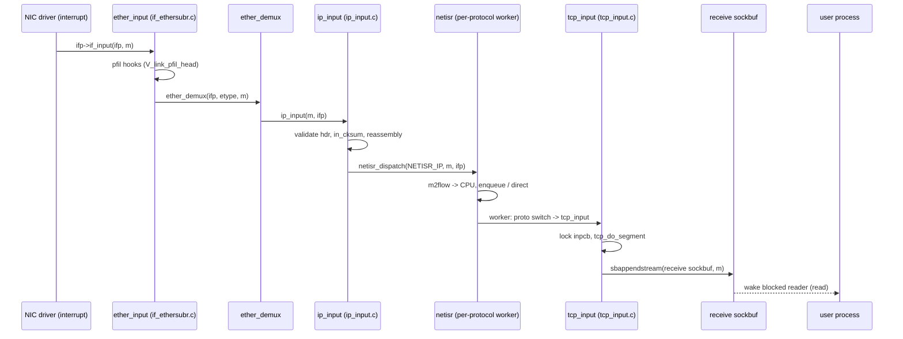
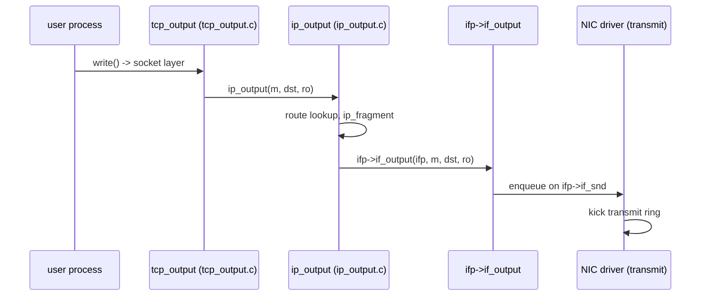

# Network Stack — Architecture and Packet Flow
<!-- This file is auto-generated by generate-doc.py -- do not edit manually -->

---
**Navigation:**
  **Up:** [Kernel Core — Structure and Entry Point](../README.md) ▸ [Source Tree — Layout and Conventions](../../README_internals.md)
  **Related:** [VFS — Virtual File System Layer](../fs/README.md) | [VNET — Virtual Network Stacks](README_vnet.md) | [pf — OpenBSD-derived Packet Filter](../netpfil/pf/README.md) | [Device Driver Framework — newbus and devclass](../kern/README_driver.md) | [NIC Drivers — from if_vr to iflib to if_cxgbe](../dev/README_nic_drivers.md)
  **All chapters:** [Source Tree — Layout and Conventions](../../README_internals.md) | [Boot Process — UEFI Bootloader to Kernel Handoff](../../stand/efi/loader/README.md) | [Kernel Core — Structure and Entry Point](../README.md) | [Build System — buildworld and buildkernel](../../share/mk/README.md) | [System Calls and Image Activation — Entry, sysent, and exec](../kern/README_syscall.md) | [Kernel Modules and the Linker — KLD, SYSINIT, and linker sets](../kern/README_kld.md) | [Virtual Memory Subsystem — vm_page, UMA, and Pagers](../vm/README.md) | [Process Management — Scheduling and Lifecycle](../kern/README_process.md) ...
---


## Quick Summary

The FreeBSD network stack is the machinery that turns a raw frame on a wire
into bytes a user process can `read()`, and turns bytes a user process
`write()`s into a frame the NIC transmits. The central idea is a strict
separation between two kinds of work. The NIC's interrupt handler must be
short: it copies the frame's bytes into a chain of `struct mbuf` objects and
hands the chain to the interface's input callback, then returns. Everything
else — validating headers, reassembling fragments, walking the TCP [state](../netpfil/pf/README.md#glossary)
machine, taking locks — happens later, in a context where the kernel may
sleep. This is the same interrupt-driven I/O cycle described in operating
systems textbooks (the "interrupt handler processes data, returns" loop),
but FreeBSD refines it with a dedicated subsystem called [netisr](../netinet/README_ip.md#glossary) that decides
*when* and *on which CPU* the deferred work actually runs.

Netisr (the network interrupt service routine) is the answer to a problem the
old BSD software-interrupt facility could not solve. The classic design ran
all deferred network work on one software-interrupt [thread](../kern/README_process.md#glossary) per CPU, so every
protocol on that CPU was serialized behind every other. Netisr instead keeps
an independent queue per protocol per CPU, called a *[workstream](#glossary)*, and lets
each protocol choose a *policy* that maps packets to CPUs. A TCP connection,
for example, is hashed so that all of its packets are processed on the same
CPU. That keeps the connection's state in one cache line and stops the
connection lock from bouncing between CPUs, which is where most of the real
cost of a high-throughput connection lives.

The path ends at the **socket buffer**. When the transport layer (TCP or UDP)
has a payload for a destination socket, it calls `sbappendstream()` to append
the [mbuf](../sys/README_mbuf.md#glossary) chain to the socket's receive buffer, a `struct sockbuf`. The [sockbuf](#glossary)
is a double-ended mbuf queue with high and low watermarks that decouple the
network stack (the producer, running in interrupt or worker context) from the
user process (the consumer, running in process context). Appending to the
buffer and waking a blocked reader is the hand-off point of this chapter: from
that moment on, the data belongs to the socket layer, which has its own
chapter.

The output path runs the same ideas in reverse. User data is gathered into
mbufs, the routing subsystem picks a next hop, `ip_output()` builds the
outgoing header, and the frame is enqueued on the interface's output queue
(`ifp->if_snd`) for the driver to transmit. Throughout, the stack supports
VNET (virtual network stacks), so each jail or VM gets its own routing tables,
socket namespace, and per-CPU netisr state without duplicating the whole
kernel.

## Glossary

**workstream** — a per-protocol, per-CPU queue of pending mbufs inside a netisr worker; it is the unit that a policy uses to keep one flow's packets ordered on one CPU.

**m2flow** — a protocol-supplied callback that maps an untagged mbuf to a flow identifier (for TCP, a hash of the 4-tuple), so netisr can place the packet on the CPU that already owns the flow.

**pfil hook** — a `pfil_head(9)` list of observer functions (firewalls, BPF (Berkeley Packet Filter, a kernel facility for capturing and filtering raw packets), netgraph) that a packet walks through at a fixed point in the stack before or after protocol dispatch.

**direct dispatch** — a netisr mode in which the calling context runs the protocol handler inline instead of enqueueing it, used when the call is already in a safe context and avoids a queue round-trip.

**hybrid dispatch** — a netisr mode that dispatches inline only when the target workstream is idle and the current CPU is the right one, otherwise defers; it trades a little ordering for lower latency.

**ifnet** — the per-interface control structure (`struct ifnet`) that holds the driver's function pointers (`if_input`, `if_output`), the output queue, and the link-layer state; one per network device.

**inpcb** — the "Internet Protocol Control Block" (`struct inpcb`) that represents one endpoint (a socket bound to an IP address and port); it is the object the transport layer looks up and locks before delivering a segment.

**sockbuf** — a `struct sockbuf`, the double-ended mbuf queue with watermarks that backs a socket's receive or send buffer and is the producer/consumer hand-off point between the stack and userland.

## Architecture

The input path has three distinct layers, and the boundaries between them are
where the interesting design decisions live.

**Layer 1: the driver and the fast path.** When the NIC signals that a frame
arrived, the driver's interrupt handler walks the DMA (direct memory access —
a mechanism that lets the NIC move data to/from memory without CPU
involvement) receive descriptors, allocates mbufs (`m_get(M_NOWAIT, MT_DATA)`
/ `m_gethdr(...)`), where `M_NOWAIT` is a flag meaning the allocation must not
sleep — if no mbuf is available, return `NULL` immediately, which is exactly
what the interrupt handler needs since it cannot block — builds the mbuf
chain, and calls `ifp->if_input(ifp, m)`. For Ethernet, `if_input` is
`ether_input()` in `sys/net/if_ethersubr.c`. `ether_input()` does a small
amount of work — updating the `struct if_data` counters (`ifi_ipackets`,
`ifi_ibytes`), running the [`pfil(9)`](../../share/man/man9/pfil.9) [hook](../netgraph/README.md#glossary) list (`V_link_pfil_head`) so that
firewalls and BPF can observe or drop the frame — and then calls
`ether_demux()`, which dispatches on the EtherType. IP frames are passed to
`ip_input()`, ARP frames to the ARP input path (`arpintr()` / `arpresolve()`
in `sys/netinet/if_ether.c`), and everything else is counted in
`ifi_noproto` and dropped.

**Layer 2: netisr and the deferred worker.** `ip_input()` in
`sys/netinet/ip_input.c` validates the header, checks the checksum, and
handles reassembly, but it does not walk the protocol switch table inline.
Instead it hands the mbuf to `netisr_dispatch(NETISR_IP, m, ifp)`. Netisr
consults the protocol's *policy* to decide which CPU's workstream should
process the packet, and then either runs the handler inline (direct/hybrid)
or enqueues the mbuf on that CPU's `struct netisr_work` queue and lets the
per-CPU netisr worker thread pick it up later. This is the key decoupling: the interrupt context never holds the
connection lock, and the connection's packets are serialized on one CPU.

**Layer 3: protocol dispatch up to the socket.** The netisr worker runs the
IP protocol handler, which walks the IPv4 protocol switch table and calls the
transport's input routine — `tcp_input()` for TCP, `udp_input()` for UDP, the
ICMP handler for ICMP. `tcp_input()` (in `sys/netinet/tcp_input.c`) looks up
the `struct inpcb` for the destination, takes the connection lock, validates
the segment, and — if it carries payload — calls `tcp_do_segment()`, which
appends the mbuf chain to the socket's receive buffer via `sbappendstream()`
and wakes any blocked reader. That append is the hand-off: the data now lives
in a `struct sockbuf` owned by the socket layer.

**The output path.** A user `write()` enters the socket layer, which for TCP
hands the data to `tcp_output()` in `sys/netinet/tcp_output.c`. TCP builds the
TCP header and calls `ip_output()` in `sys/netinet/ip_output.c`. `ip_output()`
builds the IP header, performs a route lookup (via `rtrequest`), handles
fragmentation (`ip_fragment()`), and finally calls `ifp->if_output(ifp, m,
dst, ro)`. The driver's `if_output` enqueues the frame on `ifp->if_snd`, a
`struct ifaltq` output queue, for transmission. The same pfil hooks that
observe the input path also observe the output path at the link boundary.

## Key Data Structures

The interface control structure, `struct ifnet` (defined in
`sys/net/if_private.h`), is the [anchor](../netpfil/pf/README.md#glossary) of the whole path. The driver's
function pointers live here; the fast path calls `if_input`, the slow path
writes to `if_snd`. The lifecycle of these structures is managed in
`sys/net/if.c`: `if_alloc()` builds a new `struct ifnet` and `if_attach()`
registers it in the global interface list and initializes its output queue.

```c
struct ifnet {
	/* General book keeping of interface lists. */
	CK_STAILQ_ENTRY(ifnet) if_link; 	/* all ifnets are chained (CK_) */
	LIST_ENTRY(ifnet) if_clones;	/* interfaces of a cloner */
	CK_STAILQ_HEAD(, ifg_list) if_groups; /* linked list of groups per if (CK_) */
	u_char	if_alloctype;		/* if_type at time of allocation */
	uint8_t	if_numa_domain;		/* NUMA domain of device */
	/* Driver and protocol specific information that remains stable. */
	void	*if_softc;		/* pointer to driver state */
	void	*if_llsoftc;		/* link layer softc */
	void	*if_l2com;		/* pointer to protocol bits */
	const char *if_dname;		/* driver name */
	int	if_dunit;		/* unit or IF_DUNIT_NONE */
	u_short	if_index;		/* numeric abbreviation for this if  */
	u_short	if_idxgen;		/* ... and its generation count */
	char	if_xname[IFNAMSIZ];	/* external name (name + unit) */
	char	*if_description;	/* interface description */
	int	if_flags;		/* up/down, broadcast, etc. */
	int	if_drv_flags;		/* driver-managed status flags */
	/* ... capabilities, link state, mtu, stats ... */
	struct  ifaltq if_snd;		/* output queue (includes altq) */
	struct	task if_linktask;	/* task for link change events */
	/* ... if_input / if_output function pointers, ifaddr lists ... */
};
```

The per-interface statistics that `ether_input()` updates live in
`struct if_data` (`sys/net/if.h`). These are the counters `netstat -i` and
`kstat` report:

```c
	/* volatile statistics */
	uint64_t	ifi_ipackets;	/* packets received on interface */
	uint64_t	ifi_ierrors;	/* input errors on interface */
	uint64_t	ifi_opackets;	/* packets sent on interface */
	uint64_t	ifi_oerrors;	/* output errors on interface */
	uint64_t	ifi_collisions;	/* collisions on csma interfaces */
	uint64_t	ifi_ibytes;	/* total number of octets received */
	uint64_t	ifi_obytes;	/* total number of octets sent */
	uint64_t	ifi_imcasts;	/* packets received via multicast */
	uint64_t	ifi_omcasts;	/* packets sent via multicast */
	uint64_t	ifi_iqdrops;	/* dropped on input */
	uint64_t	ifi_oqdrops;	/* dropped on output */
	uint64_t	ifi_noproto;	/* destined for unsupported protocol */
```

The netisr control structures are private (`sys/net/netisr_internal.h`) but
are the heart of the deferred path. Each protocol is described by
`struct netisr_proto`, which holds the handler and the *policy* callbacks:

```c
struct netisr_proto {
	const char	*np_name;	/* Character string protocol name. */
	netisr_handler_t *np_handler;	/* Protocol handler. */
	netisr_m2flow_t	*np_m2flow;	/* Query flow for untagged packet. */
	netisr_m2cpuid_t *np_m2cpuid;	/* Query CPU to process packet on. */
	netisr_drainedcpu_t *np_drainedcpu; /* Callback when drained a queue. */
	u_int		 np_qlimit;	/* Maximum per-CPU queue depth. */
	u_int		 np_policy;	/* Work placement policy. */
	u_int		 np_dispatch;	/* Work dispatch policy. */
};
```

`np_m2flow` is the field that makes flow ordering possible: it is the
callback netisr calls to turn an untagged mbuf into a flow id. Each
per-CPU, per-protocol queue is a `struct netisr_work`, linked by
`m_nextpkt`:

```c
struct netisr_work {
	/*
	 * Packet queue, linked by m_nextpkt.
	 */
	struct mbuf	*nw_head;
	struct mbuf	*nw_tail;
	u_int		 nw_len;
	u_int		 nw_qlimit;
	u_int		 nw_watermark;

	/*
	 * Statistics -- written unlocked, but mostly from curcpu.
	 */
	u_int64_t	 nw_dispatched; /* Number of direct dispatches. */
	u_int64_t	 nw_hybrid_dispatched; /* "" hybrid dispatches. */
	u_int64_t	 nw_qdrops;	/* "" drops. */
	u_int64_t	 nw_queued;	/* "" enqueues. */
	u_int64_t	 nw_handled;	/* "" handled in worker. */
};
```

A `struct netisr_workstream` bundles one `netisr_work` per protocol
(`nws_work[NETISR_MAXPROT]`) and is pinned to a single CPU's worker thread.
The policy and dispatch constants that drive all of this are in
`sys/net/netisr.h`:

```c
#define	NETISR_IP	1
#define	NETISR_IGMP	2		/* IGMPv3 output queue */
#define	NETISR_ROUTE	3		/* routing socket */
#define	NETISR_ARP	4		/* same as AF_LINK */
#define	NETISR_ETHER	5		/* ethernet input */
#define	NETISR_IPV6	6
#define	NETISR_IP_DIRECT	9	/* direct-dispatch IPv4 */

#define	NETISR_POLICY_SOURCE	1	/* Maintain source ordering. */
#define	NETISR_POLICY_FLOW	2	/* Maintain flow ordering. */
#define	NETISR_POLICY_CPU	3	/* Protocol determines CPU placement. */

#define	NETISR_DISPATCH_DEFAULT		0	/* Use global default. */
#define	NETISR_DISPATCH_DEFERRED	1	/* Always defer dispatch. */
#define	NETISR_DISPATCH_HYBRID		2	/* Allow hybrid dispatch. */
#define	NETISR_DISPATCH_DIRECT		3	/* Always direct dispatch. */
```

The IP header that `ip_input()` validates is `struct ip`
(`sys/netinet/ip.h`); note the bit-packed version/header-length field:

```c
struct ip {
#if BYTE_ORDER == LITTLE_ENDIAN
	u_char	ip_hl:4,		/* header length */
		ip_v:4;			/* version */
#endif
#if BYTE_ORDER == BIG_ENDIAN
	u_char	ip_v:4,			/* version */
		ip_hl:4;		/* header length */
#endif
	u_char	ip_tos;			/* type of service */
	u_short	ip_len;			/* total length */
	u_short	ip_id;			/* identification */
	u_short	ip_off;			/* fragment offset field */
#define	IP_RF 0x8000			/* reserved fragment flag */
#define	IP_DF 0x4000			/* dont fragment flag */
#define	IP_MF 0x2000			/* more fragments flag */
	/* ... shost, dhost, proto, sum ... */
};
```

The link-layer header that `ether_demux()` reads is `struct ether_header`
(`sys/net/ethernet.h`); the `ether_type` field is the dispatch key:

```c
struct ether_header {
	u_char	ether_dhost[ETHER_ADDR_LEN];
	u_char	ether_shost[ETHER_ADDR_LEN];
	u_short	ether_type;
} __packed;
```

The hand-off structure, `struct sockbuf` (`sys/sys/sockbuf.h`), starts with
the fields that I/O-multiplexing APIs read (select, kevent, AIO) and then
continues into a union holding the mbuf queue and the watermarks:

```c
#define	SB_MAX		(8*1024*1024)	/* default for max chars in sockbuf */

struct sockbuf {
	struct	selinfo *sb_sel;	/* process selecting read/write */
	short	sb_state;		/* socket state on sockbuf */
	short	sb_flags;		/* flags, see above */
	u_int	sb_acc;			/* available chars in buffer */
	u_int	sb_ccc;			/* claimed chars in buffer */
	u_int	sb_mbcnt;		/* chars of mbufs used ... */
	/* ... union: mbuf TAILQ head, hi/lo watermarks, lock ... */
};
```

## Deep Dive

**Step 1 — the driver hands off an mbuf chain.** A NIC interrupt handler
has already moved bytes from DMA into mbufs. The
mbufs themselves come from the allocation helpers in `sys/kern/uipc_mbuf.c`:
`m_get()` returns a bare header mbuf, `m_gethdr()` returns a header with
reserved space for the link and protocol headers, and `m_getcl()` attaches a
data [cluster](../sys/README_mbuf.md#glossary) for the payload. Both the driver's fast path and `ip_input()`
rely on these, and they honor the `M_NOWAIT` flag so the interrupt handler
never sleeps:

```c
	m = m_gethdr(M_NOWAIT, MT_DATA);		/* header + link/protocol space */
	if (m != NULL)
		m = m_getcl(m, MT_DATA, MCLBYTES, M_NOWAIT);	/* + data cluster */
```

It calls the interface's input callback, which for an Ethernet device is
`ether_input()`. The relevant body lives in `sys/net/if_ethersubr.c`. The
function bumps `ifp->if_data.ifi_ipackets` and `ifi_ibytes`, then walks the
link-level pfil hooks so that `pf`, BPF, and netgraph can see or drop the
frame:

```c
	/*
	 * Process the mbuf through the link-level pfil hooks, then demux.
	 */
	PFIL_HOOK_RUN_FAST(V_link_pfil_head, ifp, AF_UNSPEC,
	    PFIL_DIR_INPUT, m, ifp);
	ether_demux(ifp, etype, m);
```

If a hook consumed the mbuf, `ether_demux()` is never reached and the frame
is gone. This is the single most common reason a packet "disappears" between
the wire and the protocol stack.

**Step 2 — EtherType dispatch.** `ether_demux()` (also in
`sys/net/if_ethersubr.c`) switches on `ether_type`. `ETHERTYPE_IP` calls
`ip_input()`, `ETHERTYPE_ARP` enters the ARP path, and unknown types are
counted in `ifi_noproto`. The dispatch is a small switch plus a lookup of the
link-layer protocol table, so it is cheap enough to run in interrupt context.

**Step 3 — ip_input() and the netisr hand-off.** `ip_input()` in
`sys/netinet/ip_input.c` does the validation that must happen before any
protocol sees the packet: it checks the version and header length
(`ip_v`/`ip_hl`), the total length against the mbuf, the header checksum via
`in_cksum()` (`sys/netinet/in_cksum.c`), and handles IP reassembly for
fragmented datagrams. Once the packet is a valid, whole IP datagram, it does
not walk the protocol switch inline. Instead it calls
`netisr_dispatch(NETISR_IP, m, ifp)`.

`netisr_dispatch()` (in `sys/net/netisr.c`) is where the policy machinery
kicks in. It looks up the `struct netisr_proto` for `NETISR_IP`, asks the
protocol's `np_m2flow` callback for the flow id (for TCP this hashes the
source/destination IP and port pair), and maps that flow to a CPU. It then
checks the *dispatch* policy:

- `NETISR_DISPATCH_DEFERRED` always enqueues the mbuf on the target CPU's
  `struct netisr_work` (`nw_head`/`nw_tail`) and returns. The pinned per-CPU
  worker drains the queue later.
- `NETISR_DISPATCH_HYBRID` runs the handler inline only if the target
  workstream is idle *and* the current CPU already owns the flow; otherwise
  it defers. This is the default for most traffic and is what gives netisr
  its low-latency behavior on the common path.
- `NETISR_DISPATCH_DIRECT` always runs inline (used by the `NETISR_IP_DIRECT`
  path).

The ordering guarantee comes from the fact that a given flow always maps to
the same CPU, and a single workstream is drained by a single thread. Two
packets of the same TCP connection can therefore never be processed
concurrently, which is exactly what the TCP state machine requires.

**Step 4 — the worker runs the protocol handler.** When the netisr worker
drains the queue, it calls the protocol handler, which for IPv4 ultimately
reaches the IPv4 protocol switch dispatch in `sys/netinet/ip_input.c`. That
dispatch looks up the `struct protosw` entry for the IP protocol number and
invokes its `pr_input` function pointer directly — there is no separate
"walker" function; the table entry's `pr_input` is the transport's input
routine. For TCP that is `tcp_input()` (with the port, in
`sys/netinet/tcp_input.c`).

**Step 5 — tcp_input() to the socket buffer.** `tcp_input()` looks up the
`struct inpcb` for the destination address/port, takes the connection lock,
and runs the TCP receive state machine: it validates the sequence number,
handles retransmissions and out-of-order segments, and calls the congestion
control hooks (`cc_ack_received`, `cc_cong_signal` in
`sys/netinet/tcp_input.c`). When the segment carries in-window payload, it
calls `tcp_do_segment()`, which strips the TCP header and appends the
remaining mbuf chain to the socket's receive buffer:

```c
	/* Hand the payload to the socket layer. */
	error = soisconnected(so);
	/* ... on success, append to the socket's receive sockbuf ... */
	sbappendstream(rcv, m);	/* rcv: the socket's receive sockbuf */
```

`sbappendstream()` (in `sys/kern/uipc_sockbuf.c`) appends the mbuf chain to
the `struct sockbuf`, updates the buffer's byte and mbuf counts, and checks
whether a reader is blocked (`SB_WAIT`) or selecting (`SB_SEL`). If so, it
wakes the waiting thread. **This append-and-wake is the hand-off point of
this chapter.** From here on the bytes belong to the socket layer; the
network stack has done its job.

`sbappendstream()` writes into the socket's receive sockbuf, one of two `struct sockbuf`
members owned by the socket object itself. `struct socket` is defined in
`sys/sys/socketvar.h` and allocated and managed by the socket layer in
`sys/kern/uipc_socket.c`; the receive and send sockbufs are embedded directly
in it, which is why the transport layer can append straight into the socket's
buffer without an extra indirection:

```c
struct socket {
	/* ... */
};
```

The socket layer owns these sockbufs; `sbappendstream()` is the last touch
the network stack has to them.

**Step 6 — the output path in reverse.** A user `write()` on a TCP socket
enters the socket layer and reaches `tcp_output()` in
`sys/netinet/tcp_output.c`, which builds the TCP header and checksum. It
calls `ip_output()` in `sys/netinet/ip_output.c`, which builds the IP
header, performs a route lookup to find the next hop and outgoing interface,
fragments if the datagram exceeds the path MTU (`ip_fragment()`), and finally
calls `ifp->if_output(ifp, m, dst, ro)`. The driver's `if_output` enqueues
the frame on `ifp->if_snd` (the `struct ifaltq` output queue) and kicks the
transmit ring. The output path also runs the link-level pfil hooks in the
`PFIL_DIR_OUTPUT` direction, so the same firewalls and BPF taps that saw the
input see the output.

## Flow / Diagram

Input path, from the NIC interrupt up to the socket buffer:



Output path, from the socket layer down to the transmit queue:



## Advanced Notes

**Observing the path with DTrace and kstat.** The network stack is heavily
instrumented. The `inet` DTrace provider (defined in
`sys/netinet/in_kdtrace.h`) exposes probes at the `ip_input`/`tcp_input`/
`udp_input` and output boundaries, so you can [attach](../kern/README_driver.md#glossary) to the input path and
correlate a packet's arrival with its delivery to a socket. For steady-state
counters, `netstat -i` reads the `struct if_data` fields shown above
(`ifi_ipackets`, `ifi_iqdrops`, `ifi_noproto`), and `netstat -s` reports the
per-protocol statistics. Netisr exposes its own accounting through the
`net.isr.proto` sysctl (backed by `struct sysctl_netisr_proto`), which shows
each protocol's queue limit, policy, and dispatch mode, and the per-CPU
`struct netisr_work` counters (`nw_qdrops`, `nw_queued`, `nw_handled`) let
you see whether a workstream is dropping under load.

**Performance: why flow ordering matters.** The single biggest cost in a
high-throughput TCP connection is the connection lock bouncing between CPUs.
If packet 1 of a flow is handled on CPU 0 and packet 2 on CPU 3, the
`inpcb`'s lock migrates and both CPUs invalidate each other's cache lines
holding the connection state. Netisr's `NETISR_POLICY_FLOW` plus the
`np_m2flow` hash prevents this: every packet of a flow lands on the same
CPU, so the lock and the connection state stay in one cache line. This is the
same lock-contention problem textbook treatments of multiprocessor systems
describe (a spin lock held across a context switch (the kernel's action of
saving one thread's state and restoring another's, switching which thread
runs on the CPU), or a hot lock shared by many CPUs), and netisr is
FreeBSD's answer to it at the network layer.

**Pitfalls and race conditions.**
- *Drops in the fast path.* A frame consumed by a [pfil hook](#glossary) (pf, BPF,
  netgraph) never reaches `ether_demux()`. When a packet "vanishes," check
  the link-level pfil hooks before suspecting the protocol stack.
- *Workstream drops.* If a flow's `struct netisr_work` exceeds `nw_qlimit`,
  netisr drops the mbuf and bumps `nw_qdrops`. A burst on a single hot flow
  can saturate one CPU's workstream even when the box is otherwise idle;
  watch `net.isr.proto` and the per-CPU drop counters.
- *Reentrance.* The header comment in `sys/net/netisr.c` is explicit about
  why [direct dispatch](#glossary) is sometimes forbidden: dispatching a netisr handler
  inline can cause lock recursion (entering the socket code from the socket
  code) or recursive processing (decapsulating several wrapped tunnel
  layers). When in doubt, defer.
- *Checksum offload.* If the NIC offloads the IP/TCP checksum, `ip_input()`
  must not recompute it; the `m_flags` carry the offload state, and getting
  this wrong produces "bad checksum" drops that are invisible in the
  driver counters.

**Connecting to OS theory.** The interrupt-driven I/O cycle from
textbooks — device raises an interrupt, the handler does minimal work and
returns, and the real processing happens in a context that may block — is
exactly the split between the NIC handler and the netisr worker. Netisr adds
two refinements the textbook model leaves out: a *per-protocol* queue (so one
protocol's burst cannot starve another's) and a *flow-to-CPU* policy (so a
connection's state stays cache-local). Both are direct responses to the
multiprocessor problems — lock migration and cache-line bouncing — that
general OS texts raise when discussing spin locks and NUMA.

## See Also
- [VFS — Virtual File System Layer](../fs/README.md)
- [Device Driver Framework — newbus and devclass](../kern/README_driver.md)
- [VNET — Virtual Network Stacks](README_vnet.md)
- [pf — OpenBSD-derived Packet Filter](../netpfil/pf/README.md)
- [NIC Drivers — from if_vr to iflib to if_cxgbe](../dev/README_nic_drivers.md)


- Source directories to explore next: [`sys/net`](.) (ifnet, netisr, pfil, BPF), [`sys/netinet`](../netinet) (ip_input, ip_output, tcp_input, in_pcb), [`sys/kern`](../kern) (uipc_sockbuf, uipc_socket — the hand-off and the socket KPI).
- Man pages: [`mbuf(9)`](../../share/man/man9/mbuf.9), [`pfil(9)`](../../share/man/man9/pfil.9), `sockbuf(9)`, [`swi(9)`](../../share/man/man9/swi.9), `ifmedia(9)`, `route(9)`.

---

> _Generated by [DaemonDocs](https://github.com/ocochard/DaemonDocs) on 2026-09-03 21:52 UTC using model `Qwen3.8-27B-Q8_0` (llama.cpp build `b10788-e107984bc`). AI-generated content — verify against source before relying on it._
