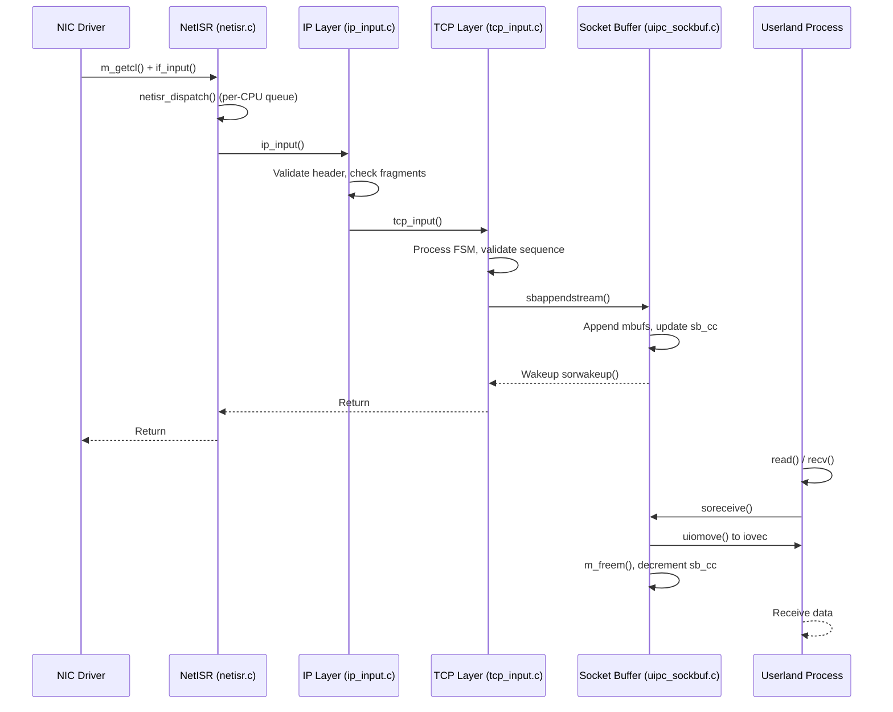

# Network Stack — Architecture and Packet Flow
<!-- This file is auto-generated by generate-doc.py -- do not edit manually -->

---
**Navigation:**
  **Up:** [Kernel Core — Structure and Entry Point](../README.md) ▸ [Source Tree — Layout and Conventions](../../README_internals.md)
  **Related:** [VFS — Virtual File System Layer](../fs/README.md) | [VNET — Virtual Network Stacks](README_vnet.md) | [pf — OpenBSD-derived Packet Filter](../netpfil/pf/README.md) | [Device Driver Framework — newbus and devclass](../kern/README_driver.md) | [NIC Drivers — from if_vr to iflib to if_cxgbe](../dev/README_nic_drivers.md)
  **All chapters:** [Source Tree — Layout and Conventions](../../README_internals.md) | [Boot Process — UEFI Bootloader to Kernel Handoff](../../stand/efi/loader/README.md) | [Kernel Core — Structure and Entry Point](../README.md) | [Build System — buildworld and buildkernel](../../share/mk/README.md) | [Virtual Memory Subsystem — vm_page, UMA, and Pagers](../vm/README.md) | [Process Management — Scheduling and Lifecycle](../kern/README_process.md) | [Locking Primitives — Mutexes, sx, rmlocks, and Atomics](../kern/README_locking.md) | [Buffer Cache — Block I/O Subsystem](../vm/README_bcache.md) ...
---

> ⚠ **UNVERIFIED DRAFT** — reviewer did not explicitly approve this draft. Treat claims as suspect until manually reviewed.

## Quick Summary
The FreeBSD network stack bridges hardware interrupts and user-level sockets through a strictly layered pipeline. When a network interface card (NIC) receives a frame, its driver constructs a chain of `struct mbuf` objects from DMA descriptors and hands them to the interface's input callback. This callback does not process the packet itself; instead, it queues the mbuf to `netisr` — the network interrupt service routine subsystem — for deferred execution. Netisr was introduced to replace the older BSD software interrupt mechanism, providing per-CPU queues, flow-based load balancing, and configurable dispatch policies that keep stateful protocol data on a single CPU to minimize lock contention and cache misses.

Once netisr dispatches a packet, the kernel walks the protocol stack. The IP layer validates headers, performs reassembly if fragments are present, and hands the payload to the appropriate transport protocol. For TCP, the segment is processed through its finite state machine. When application data becomes available, the transport layer appends payload mbufs to the socket's receive buffer using `sbappendstream()`. The socket receive buffer is a `struct sockbuf` — a double-ended mbuf queue with configurable watermarks and size limits that decouple the network stack producer from the userland consumer.

When a user process calls `soreceive()` or `read()` on a socket, the kernel invokes `soreceive()`, which walks the mbuf chain, copies data to user-provided `iovec` structures via `uiomove()`, and updates the buffer's character count. The output path works in reverse: userland data is collected into mbuf chains, the routing subsystem selects a path, and `ip_output()` constructs the outgoing packet. The output path enqueues the packet for transmission through the NIC driver's `if_output` function. This architecture enforces a fundamental operating systems principle: interrupt handlers remain fast and minimal, while complex processing, locking, and memory allocation occur in software threads that can safely sleep.

The network stack supports VNET (virtual network stacks) for multiple isolated network namespaces. Each VNET maintains its own copies of protocol state, including routing tables, socket buffers, and connection tracking. This design originated from the need to support virtualization and jail environments without duplicating the entire kernel, and it uses the `VNET_DEFINE` macro to declare per-instance variables that are automatically routed to the correct namespace based on the calling thread's context.

## Architecture
The input path begins in a NIC driver's interrupt handler. The driver processes DMA descriptors, allocates `struct mbuf` objects via `m_get(M_NOWAIT, MT_DATA)` or `m_gethdr(M_NOWAIT, MT_DATA)`, and calls `ifp->if_input(ifp, m)`. This callback is registered during driver initialization and points to a function that queues the mbuf to netisr. The actual queuing is performed by `netisr_dispatch()` in `sys/net/netisr.c`. Netisr maintains per-CPU queues for each registered protocol type. When `netisr_dispatch()` is called, the system checks whether direct dispatch is safe and whether the calling CPU is the designated owner for this flow. If direct dispatch is permitted, the registered handler runs immediately. Otherwise, the mbuf is queued to a software interrupt thread associated with the target CPU.

The IP input handler, `ip_input()` in `sys/netinet/ip_input.c`, is registered for `NETISR_IP`. It validates the IP header length and checksum, handles fragments, and dispatches the payload to the next protocol based on `ip->ip_p`. For TCP, `tcp_input()` in `sys/netinet/tcp_input.c` processes the segment, advancing the connection's state machine. Once a complete TCP segment is assembled and acknowledged, the data is transferred to the socket receive buffer via `sbappendstream()` in `sys/kern/uipc_sockbuf.c`.

The socket layer, implemented in `sys/kern/uipc_socket.c`, manages the `struct socket` object. Each socket contains two `struct sockbuf` instances (`so_rcv` and `so_snd`), which act as bounded queues of mbufs. When a process reads from a socket, `soreceive()` extracts data from the receive buffer, handles mbuf cluster boundary crossings, and copies the payload to user space. The output path begins with `sosend()`, which collects user data into mbuf chains, and concludes with `ip_output()` in `sys/netinet/ip_output.c`, which performs routing lookups and invokes the interface's `if_output` function to transmit the frame.

## Key Data Structures
**`struct mbuf`** (`sys/sys/mbuf.h`): The fundamental unit of network data. An mbuf consists of a fixed-size header (`MSIZE` bytes) followed by a data area (`m_dat`). For small packets, data fits inline; for larger payloads, a memory cluster (`MCLBYTES`) is allocated and attached. Mbufs are linked into chains to represent multi-part packets. The `m_nextpkt` field chains packets within a queue, while `m_next` chains data segments.

**`struct sockbuf`** (`sys/sys/socketvar.h`): A double-ended buffer managing mbuf chains for a socket's send or receive side. It tracks the total byte count (`sb_cc`), allocated bytes (`sb_mbmem`), and high/low watermarks (`sb_hiwat`, `sb_lowat`). The buffer uses `sbappend()` family functions to add data and `sbcompress()` to coalesce small mbufs, ensuring efficient memory usage and predictable latency.

**`struct socket`** (`sys/sys/socketvar.h`): The kernel's representation of a network socket. It holds references to the protocol control block (`so_proto`), the associated file descriptor flags (`so_state`), and the two `sockbuf` structures. The socket acts as the boundary between kernel protocol stacks and userland, managing accept queues (`so_comp`) for listening sockets and handling `selinfo` structures for `select()`/`poll()` notifications.

**`struct inpcb`** (`sys/netinet/in_pcb.h`): The Internet Protocol Control Block. It stores the local and foreign addresses, ports, and protocol-specific state (e.g., TCP control block). PCBs are organized in hash tables managed by `struct inpcbinfo`, allowing fast lookups based on the 4-tuple (source IP, destination IP, source port, destination port).

**`struct ifnet`** (`sys/net/if.h`): The interface control block representing a network interface. It contains function pointers for `if_input` (receiving packets), `if_output` (transmitting packets), and `if_start` (driving the transmit queue). The `if_addrlist` maintains attached addresses, and the `if_mtu` field defines the maximum transmission unit.

## Deep Dive
Tracing a packet from the wire to userland reveals the careful choreography of FreeBSD's network stack.

**1. Driver and Netisr (`sys/net/if.c`, `sys/net/netisr.c`):**
When a NIC completes a DMA transfer, its interrupt handler calls `m_getcl(M_NOWAIT, MT_DATA, 0)` to allocate an mbuf with a cluster, copies the frame data into the cluster, and passes it to `ifp->if_input(ifp, m)`. In `if_input()`, the kernel checks if BPF (Berkeley Packet Filter) is attached; if so, it taps the packet via `bpf_mtap()`. The packet is then dispatched to netisr using `netisr_dispatch()`. Netisr uses a flow-based hashing mechanism to ensure that packets belonging to the same connection (identified by the 5-tuple) consistently map to the same CPU, preserving ordering and reducing cross-CPU locking.

**2. IP Input and Dispatch (`sys/netinet/ip_input.c`):**
The netisr handler `ip_input()` receives the mbuf. It validates the IP header, checks for fragmentation, and calls `ip_reass()` if fragments are present. Once the complete datagram is assembled, `ip_input()` examines the `ip_p` field to call the appropriate protocol handler. For TCP, it invokes `tcp_input()`.

**3. TCP Processing (`sys/netinet/tcp_input.c`):**
`tcp_input()` locates the matching `struct tcpcb` and `struct inpcb` using the connection's 4-tuple. It validates sequence numbers, processes flags (SYN, ACK, FIN), and updates the TCP state machine. When data is ready for the application, `tcp_input()` calls `sbappendstream()` to append the payload mbufs to the socket's receive buffer. If the buffer was previously full, it wakes up sleeping readers using `sorwakeup()`.

**4. Socket Buffer Management (`sys/kern/uipc_sockbuf.c`):**
`sbappendstream()` locks the socket buffer, appends the new mbufs to the tail, updates `sb_cc` (character count), and checks if the buffer has crossed the high watermark. If so, it may notify the sender to throttle back. The `sbcompress()` function is used when incoming mbufs are smaller than the available space at the end of the buffer, copying data into the trailing mbuf to reduce the total mbuf count and improve cache locality.

**5. Userland Read (`sys/kern/uipc_socket.c`):**
When a process invokes `read()` on a socket file descriptor, the kernel calls `soreceive()`. This function locks the receive buffer, iterates over the mbuf chain, and uses `uiomove()` to copy data into the user-supplied `iovec` structures. If the data spans multiple mbufs, `soreceive()` handles the boundary crossings transparently. Once the requested bytes are copied, the mbufs are released back to the UMA zone via `m_freem()`, and the buffer's `sb_cc` is decremented.

The output path mirrors this flow in reverse. `sosend()` collects user data into mbufs, `sosetopt()` handles socket options, and `ip_output()` performs the routing lookup. `ip_output()` calls `rtalloc()` to find the next hop, attaches the appropriate link-layer header (e.g., Ethernet), and enqueues the packet for transmission via `ifp->if_output()`. The driver's `if_start()` function then moves the packet from the software transmit queue to the hardware.

## Flow / Diagram

## Advanced Notes
**DTrace and SDT Probes:** FreeBSD's network stack exposes numerous Static DTrace Probes (SDT) for performance analysis. In `sys/kern/uipc_mbuf.c`, probes like `m__init`, `m__get`, and `m__free` allow tracking of mbuf allocation and deallocation. In `sys/netinet/tcp_input.c`, TCP state transitions and segment processing are instrumented. Using `dtrace -n 'sdt::m__get{ printf("New mbuf: %p", arg0); }'` provides real-time visibility into memory pressure.

**Netisr Policy and CPU Affinity:** By default, netisr uses a flow-based policy (`NETISR_POLICY_HASH`) to assign incoming packets to CPUs. This ensures that all packets for a given TCP connection are processed by the same CPU, maintaining sequence ordering and keeping the associated `inpcb` and `tcpcb` in the CPU's L1 cache. Administrators can tune `netisr_dispatch_policy` and use `domainset` to pin network threads to specific CPUs, which is critical for high-throughput, low-latency applications.

**Socket Buffer Tuning:** The `sb_max` variable (`sys/kern/uipc_sockbuf.c`) caps the total memory the network stack can allocate for socket buffers. It can be tuned via `sysctl kern.ipc.sb_max`. If `sb_max` is too low, the stack drops packets when buffers fill up; if too high, it can starve other kernel memory consumers. The `sb_efficiency` parameter influences the initial allocation size in `sbreserve()`, balancing between memory overhead and the frequency of cluster allocations.

**VNET and Isolation:** With VNET enabled, every network namespace (`struct vnet`) maintains its own `ifnet` lists, routing tables, and protocol state. This allows jails and virtual machines to have completely independent network stacks. The `VNET()` macro transparently redirects all network operations to the correct namespace. When debugging, ensure you are examining the correct VNET context, especially when using DTrace or DDB on multi-VNET systems.

## See Also
- [VFS — Virtual File System Layer](../fs/README.md)
- [Device Driver Framework — newbus and devclass](../kern/README_driver.md)
- [VNET — Virtual Network Stacks](README_vnet.md)
- [pf — OpenBSD-derived Packet Filter](../netpfil/pf/README.md)
- [NIC Drivers — from if_vr to iflib to if_cxgbe](../dev/README_nic_drivers.md)

- [`sys/net/netisr.c`](netisr.c) — Network interrupt service routines
- [`sys/kern/uipc_socket.c`](../kern/uipc_socket.c) — Socket primitives and lifecycle
- [`sys/kern/uipc_sockbuf.c`](../kern/uipc_sockbuf.c) — Socket buffer management
- [`sys/netinet/ip_input.c`](../netinet/ip_input.c) — IPv4 input processing
- [`sys/netinet/tcp_input.c`](../netinet/tcp_input.c) — TCP segment processing
- [`sys/sys/mbuf.h`](../sys/mbuf.h) — Mbuf data structure definitions
- [`sys/sys/socketvar.h`](../sys/socketvar.h) — Socket and sockbuf definitions

---

> _Generated by [DaemonDocs](https://github.com/ocochard/DaemonDocs) on 2026-05-03 16:11 UTC using model `Qwen3.6-35B-A3B-UD-Q8_K_XL` (llama.cpp build `b8985-27aef3dd9`). AI-generated content — verify against source before relying on it._
