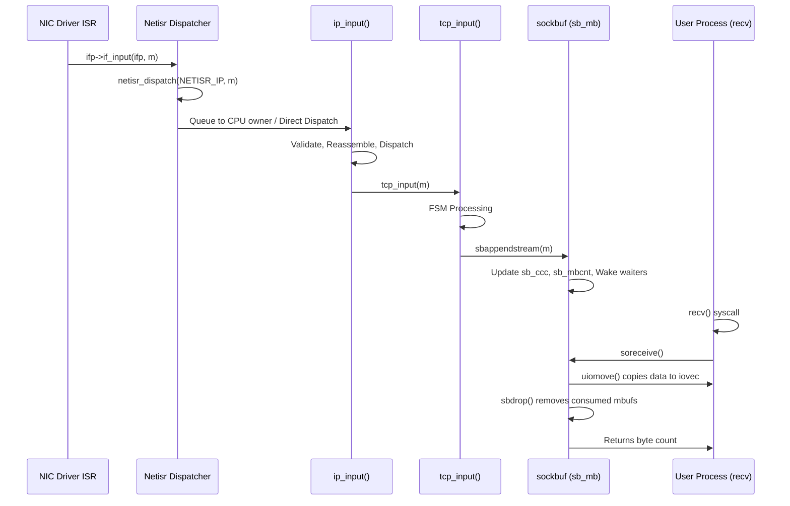

# Network Stack — Architecture and Packet Flow
<!-- This file is auto-generated by generate-doc.py -- do not edit manually -->

---
**Navigation:**
  **Related:** [VFS — Virtual File System Layer](../fs/README.md) | [VNET — Virtual Network Stacks](README_vnet.md) | [pf — OpenBSD-derived Packet Filter](../netpfil/pf/README.md) | [Device Driver Framework — newbus and devclass](../kern/README_driver.md) | [NIC Drivers — from if_vr to iflib to if_cxgbe](../dev/README_nic_drivers.md)
  **All chapters:** [Source Tree — Layout and Conventions](../../README_internals.md) | [Boot Process — UEFI Bootloader to Kernel Handoff](../../stand/efi/loader/README.md) | [Kernel Core — Structure and Entry Point](../README.md) | [Build System — buildworld and buildkernel](../../share/mk/README.md) | [Virtual Memory Subsystem — vm_page, UMA, and Pagers](../vm/README.md) | [Process Management — Scheduling and Lifecycle](../kern/README_process.md) | [Locking Primitives — Mutexes, sx, rmlocks, and Atomics](../kern/README_locking.md) | [Buffer Cache — Block I/O Subsystem](../vm/README_bcache.md) ...
---


> ⚠ **UNVERIFIED DRAFT** — revisions regressed; kept revision 2 (7/8 criteria) over revision 3 (5/8); reviewer did not explicitly approve this draft. Treat claims as suspect until manually reviewed.


## Quick Summary
The FreeBSD network stack bridges hardware interrupts and user-level sockets through a strictly layered pipeline. When a network interface card (NIC) receives a frame, its driver constructs a chain of `struct mbuf` objects from DMA descriptors and hands them to the interface's input callback. This callback does not process the packet itself; instead, it queues the mbuf to `netisr` — the network interrupt service routine subsystem — for deferred execution. Netisr was introduced to replace the older BSD software interrupt mechanism, providing per-CPU queues, flow-based load balancing, and configurable dispatch policies that keep stateful protocol data on a single CPU to minimize lock contention and cache misses.

Once netisr dispatches a packet, the kernel walks the protocol stack. The IP layer validates headers, performs reassembly if fragments are present, and hands the payload to the appropriate transport protocol. For TCP, the segment is processed through its finite state machine. When application data becomes available, the transport layer appends payload mbufs to the socket's receive buffer using `sbappendstream()`. The socket receive buffer is a `struct sockbuf` — a double-ended mbuf queue with configurable watermarks and size limits that decouple the network stack producer from the userland consumer.

When a user process calls `recv()` or `read()` on a socket, the kernel invokes `soreceive()`, which walks the mbuf chain, copies data to user-provided `iovec` structures via `uiomove()`, and updates the buffer's character count. The output path works in reverse: userland data is collected into mbuf chains, the routing subsystem selects a path, and `ip_output()` constructs the outgoing packet. The output path enqueues the packet for transmission through the NIC driver's `if_output` function. This architecture enforces a fundamental operating systems principle: interrupt handlers remain fast and minimal, while complex processing, locking, and memory allocation occur in software threads that can safely sleep.

## Architecture
The input path begins in a NIC driver's interrupt handler. The driver processes DMA descriptors, allocates `struct mbuf` objects via `m_get2(M_NOWAIT, MT_DATA)` or `m_getm(NULL, 0, M_NOWAIT | M_PKTHDR, MT_DATA)`, and calls `ifp->if_input(ifp, m)`. This callback is registered during driver initialization and points to a function that queues the mbuf to netisr. The actual queuing is performed by `netisr_dispatch()` in `sys/net/netisr.c`. Netisr maintains per-CPU queues for each registered protocol type. When `netisr_dispatch()` is called, the system checks whether direct dispatch is safe and whether the calling CPU is the designated owner for this flow. If direct dispatch is permitted, the registered handler runs immediately. Otherwise, the mbuf is queued to a software interrupt thread associated with the target CPU.

The IP input handler, `ip_input()` in `sys/netinet/ip_input.c`, is registered for `NETISR_IP`. It validates the IP header length and checksum, handles fragments, and dispatches to the appropriate transport protocol. For TCP, `tcp_input()` in `sys/netinet/tcp_input.c` processes the segment through its finite state machine. When data is available, it appends payload mbufs to the socket's receive buffer using `sbappendstream()`, which is defined in `sys/kern/uipc_sockbuf.c`. The `struct sockbuf` maintains `sb_mb` (the mbuf queue), `sb_ccc` (claimed characters), and `sb_mbcnt` (mbuf memory usage).

Userland interaction occurs through `soreceive()` in `sys/kern/uipc_socket.c`. When a process waits for data, `soreceive()` checks `sb_ccc`. If zero, the calling thread is placed on the socket's `selinfo` wait queue (`sb_sel`). When data arrives, `sbappend()` updates `sb_ccc` and wakes any sleeping threads via the socket buffer's wakeup mechanism. The socket layer then calls `uiomove()` to copy data from the kernel mbuf chain to user space.

The output path begins with `sosend()` in `sys/kern/uipc_socket.c`. Userland data is collected into mbuf chains using `sbappend()` or `sbappendrecord()`. The routing subsystem selects a path, and `ip_output()` in `sys/netinet/ip_output.c` constructs the outgoing packet. It checks for fragmentation, updates checksums, and enqueues the packet for transmission by calling `ifp->if_output(ifp, m, dst, ro)`. The driver's output function places the mbuf into the NIC's transmit ring and starts the hardware queue.

## Key Data Structures
The network stack relies on several core data structures that manage packet memory, interface state, and socket buffers.

**`struct mbuf`** (`sys/sys/mbuf.h`)
Mbufs are the fundamental packet storage units. They contain a header and a data area. If the payload exceeds `MLEN` bytes, the mbuf attaches a cluster of `MCLBYTES` (typically 2048 bytes) to avoid repeated `malloc()` calls. The header tracks the chain length, protocol flags, and next pointer. Allocation functions like `m_get2()` and `m_getm()` draw from UMA zones to maintain cache locality and reduce fragmentation.

**`struct if_data`** (`sys/net/if.h`)
This structure holds volatile statistics and configuration for a network interface. It is used by management tools and the routing subsystem.
```c
struct if_data {
	uint8_t	ifi_type;		/* ethernet, tokenring, etc */
	uint8_t	ifi_physical;		/* e.g., AUI, Thinnet, 10base-T, etc */
	uint8_t	ifi_addrlen;		/* media address length */
	uint8_t	ifi_hdrlen;		/* media header length */
	uint8_t	ifi_link_state;		/* current link state */
	uint8_t	ifi_vhid;		/* carp vhid */
	uint16_t	ifi_datalen;	/* length of this data struct */
	uint32_t	ifi_mtu;	/* maximum transmission unit */
	uint32_t	ifi_metric;	/* routing metric (external only) */
	uint64_t	ifi_baudrate;	/* linespeed */
	uint64_t	ifi_ipackets;	/* packets received on interface */
	uint64_t	ifi_ierrors;	/* packets received on interface */
	uint64_t	ifi_opackets;	/* packets sent on interface */
	uint64_t	ifi_oerrors;	/* output errors on interface */
	uint64_t	ifi_collisions;	/* collisions on csma interfaces */
	uint64_t	ifi_ibytes;	/* total number of octets received */
	uint64_t	ifi_obytes;	/* total number of octets sent */
	uint64_t	ifi_imcasts;	/* packets received via multicast */
	uint64_t	ifi_omcasts;	/* packets sent via multicast */
	uint64_t	ifi_iqdrops;	/* dropped on input */
	uint64_t	ifi_oqdrops;	/* dropped on output */
	uint64_t	ifi_noproto;	/* destined for unsupported protocol */
	uint64_t	ifi_hwassist;	/* HW offload capabilities, see IFCAP */
};
```

**`struct sockbuf`** (`sys/sys/sockbuf.h`)
The socket buffer decouples the network stack from userland I/O. It maintains a linked list of mbufs and tracks watermarks to prevent buffer bloat. Socket buffer space is reserved and allocated via `sbreserve()`, which sets the maximum buffer size (`sb_mbmax`) based on `SO_RCVBUF`/`SO_SNDBUF` socket options and system tunables. `sbreserve()` accounts for reserved space in the socket's `so_reserved` count and adjusts `sb_mbcnt` accordingly. When `sbreserve()` is called with a new limit, it may shrink or grow the buffer, and if shrinking, it truncates excess data. This reservation mechanism ensures that socket buffers do not consume unbounded kernel memory.
```c
struct sockbuf {
	struct	selinfo *sb_sel;	/* process selecting read/write */
	short	sb_state;		/* socket state on sockbuf */
	short	sb_flags;		/* flags, see above */
	u_int	sb_acc;			/* available chars in buffer */
	u_int	sb_ccc;			/* claimed chars in buffer */
	u_int	sb_mbcnt;		/* chars of mbufs used */
	u_int	sb_mbmax;		/* max chars of mbufs */
	u_long	sb_lowat;		/* low water mark */
	u_long	sb_timeo;		/* timeout to wake up */
	u_long	sb_flags2;
	union {
		struct {
			struct mbuf *sb_mb;	/* mbuf queue of data */
			struct mbuf *sb_last;	/* last mbuf in queue */
		} mbuf;
		struct {
			struct mbuf **sb_mb;	/* mbuf queue of data */
			struct mbuf **sb_last;	/* last mbuf in queue */
		} mbptr;
	} sb_u;
#define	sb_mb	sb_u.mbuf.sb_mb
#define	sb_last	sb_u.mbuf.sb_last
};
```

**`struct in_conninfo`** (`sys/netinet/in_pcb.h`)
The protocol control block (PCB) stores endpoint information for IPv4/IPv6 sockets. It is hashed in `inpcbinfo` for fast lookup.
```c
struct in_endpoints {
	uint16_t	ie_fport;		/* foreign port */
	uint16_t	ie_lport;		/* local port */
	union in_dependaddr ie_dependfaddr;	/* foreign host table entry */
	union in_dependaddr ie_dependladdr;	/* local host table entry */
#define	ie_faddr	ie_dependfaddr.id46_addr.ia46_addr4
#define	ie_laddr	ie_dependladdr.id46_addr.ia46_addr4
	uint32_t	ie6_zoneid;		/* scope zone id */
};

struct in_conninfo {
	uint8_t		inc_flags;
	uint8_t		inc_len;
	uint16_t	inc_fibnum;	/* XXX was pad, 16 bits is plenty */
	struct in_endpoints inc_ie;
};
```

## Deep Dive
Tracing a packet from hardware to userland reveals how FreeBSD defers work, maintains ordering, and manages memory.

**1. Driver to Netisr**
A NIC driver's interrupt handler processes receive descriptors. It allocates an mbuf cluster and copies the frame payload. The driver calls `ifp->if_input(ifp, m)`. Inside `netisr_dispatch()` (`sys/net/netisr.c`), the kernel checks the `NETISR_POLICY_FLOW` or `NETISR_POLICY_CPU` setting. If the calling CPU matches the flow's designated CPU and direct dispatch is allowed, the handler runs immediately. Otherwise, the mbuf is queued to the target CPU's software interrupt queue. This design ensures that all segments for a given TCP connection are processed on the same CPU, keeping the connection's locks and cache lines local.

**2. Protocol Dispatch**
`ip_input()` in `sys/netinet/ip_input.c` receives the mbuf. It verifies the IP version, header length, and checksum. If fragmentation is detected, it passes the mbuf to the reassembly code. Once the complete datagram is assembled, `ip_input()` examines the `ip_p` field to select the next-layer handler. For TCP, it calls `tcp_input()`.

**3. TCP State Machine and Buffering**
`tcp_input()` processes the segment through the TCP finite state machine. When data is present, it calls `sbappendstream()` (`sys/kern/uipc_sockbuf.c`). This function locks the socket buffer, appends the mbuf chain to `sb_mb`, updates `sb_ccc` with the byte count, and adds to `sb_mbcnt`. If `sb_ccc` exceeds `sb_lowat`, the buffer's `SB_WAIT` flag is cleared, and any threads sleeping on `sb_sel` are woken.

**4. Userland Consumption**
A user process calling `recv()` triggers `soreceive()` in `sys/kern/uipc_socket.c`. The function checks `sb_ccc`. If data is available, it iterates through `sb_mb`, calling `uiomove()` to copy bytes into the user-provided `iovec` array. After copying, it calls `sbdrop()` to remove the consumed mbufs and update `sb_ccc` and `sb_mbcnt`. If the buffer drops below `sb_lowat`, blocked writers are woken. The socket's `so_count` is decremented, and if it reaches zero, `sofree()` tears down the socket and its PCB.

**5. Output Path**
`sosend()` segments user data into mbufs and appends them to the send buffer. `ip_output()` (`sys/netinet/ip_output.c`) selects the route, handles fragmentation, and calculates checksums. It calls `ifp->if_output()` to hand the mbuf to the driver. The driver places the mbuf in the TX ring and triggers the hardware.

## Flow / Diagram


## Advanced Notes
**DTrace and SDT Probes**
FreeBSD exposes detailed telemetry via Static DTrace probes. In `sys/kern/uipc_mbuf.c`, probes like `m__init`, `m__get`, `m__getcl`, and `m__free` fire on mbuf lifecycle events. You can trace mbuf allocation rates and fragmentation with:
`dtrace -n 'sdt:::m__get { @count = count(); }'`
Socket buffer management is tracked indirectly through socket and mbuf probes, allowing you to measure buffer pressure and identify applications that exhaust socket buffers without blocking.

**Performance and Pitfalls**
Netisr's flow-based dispatch (`NETISR_POLICY_FLOW`) prevents lock migration but can cause CPU imbalance if a single connection dominates traffic. The `net.isr.direct` sysctl controls whether direct dispatch is allowed. Setting it to `0` forces all packets through SWI queues, which increases latency but simplifies debugging. Socket buffers use `SB_AUTOSIZE` by default, dynamically scaling `sb_mbmax` based on available memory. However, on high-throughput links, misconfigured `SO_RCVBUF` can lead to `sb_ccc` exhaustion, causing TCP window scaling to collapse and throughput to plummet. Always monitor `net.inet.tcp.sendspace` and `recvspace` alongside interface statistics.

**OS Theory Connection**
FreeBSD's netisr implements the "bottom half" interrupt model popularized by Linux softirqs. Unlike Linux, which uses `napi` polling and `sk_buff` ring buffers, FreeBSD maintains strict per-CPU software interrupt threads (`swi_net`) that run at a fixed priority. This avoids the complexity of lock-free ring management but requires careful tuning of `netisr` policies to prevent softirq starvation under heavy interrupt loads. The `struct sockbuf` implements a producer-consumer queue with explicit watermark signaling, a pattern found in classic Unix IPC but adapted for zero-copy mbuf chains.

## Comparison
Linux uses `sk_buff` instead of `struct mbuf`. While FreeBSD's mbuf uses a fixed-size header with an optional cluster, Linux's `sk_buff` embeds a linear data area and a `frag_list` for page fragments, allowing more flexible memory mapping but increasing pointer chasing. Linux's network input path relies on NAPI (New API), which combines interrupt-driven reception with polling to reduce interrupt overhead under load. FreeBSD historically avoided NAPI, relying instead on `iflib` and `netisr` software threads, though modern drivers increasingly use polling modes.

OpenBSD shares the `struct mbuf` heritage and `sockbuf` design with FreeBSD, but diverges in its packet filter (`pf`) integration and stricter memory accounting. OpenBSD's `netisr` implementation is simpler, using a single queue per protocol without the flow-affinity policies that FreeBSD introduced in 2007. macOS/XNU also uses `struct mbuf` and clusters, but its socket layer (`sockbuf`) integrates tightly with the `kqueue` event system and `libkern` memory zones, resulting in different watermark behavior and AIO integration. NetBSD's network stack closely mirrors FreeBSD's but maintains older `sbappend` semantics and lacks the `splice_wq` zero-copy data transfer mechanism introduced in FreeBSD 13.

## See Also
- [VFS — Virtual File System Layer](../../../sys/fs/README.md)
- [Device Driver Framework — newbus and devclass](../../../sys/kern/README_driver.md)
- [VNET — Virtual Network Stacks](../../../sys/net/README_vnet.md)
- [pf — OpenBSD-derived Packet Filter](../../../../sys/netpfil/pf/README.md)
- [NIC Drivers — from if_vr to iflib to if_cxgbe](../../../sys/dev/README_nic_drivers.md)


- [VNET — Virtual Network Stacks](README_vnet.md)
- [pf — OpenBSD-derived Packet Filter](../netpfil/pf/README.md)
- [NIC Drivers — from if_vr to iflib to if_cxgbe](../dev/README_nic_drivers.md)
- [Locking Primitives — Mutexes, sx, rmlocks, and Atomics](../kern/README_locking.md)
- [Virtual Memory Subsystem — vm_page, UMA, and Pagers](../vm/README.md)
- Source directories: `sys/net/`, `sys/netinet/`, `sys/kern/uipc_*`, `sys/sys/sockbuf.h`

---

> _Generated by [DaemonDocs](https://github.com/ocochard/DaemonDocs) on 2026-04-30 15:23 UTC using model `Qwen3.6-35B-A3B-UD-Q4_K_XL` (llama.cpp build `b8985-27aef3dd9`). AI-generated content — verify against source before relying on it._
