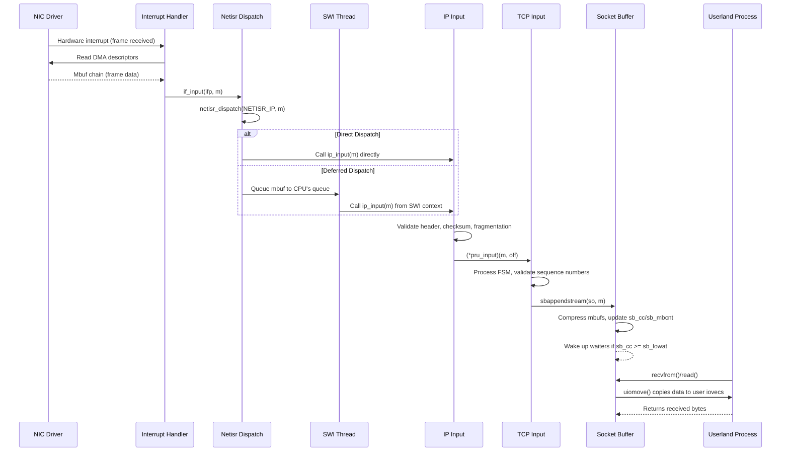

# Network Stack Architecture
<!-- This file is auto-generated by generate-doc.py -- do not edit manually -->

---
**Navigation:**
  **Related:** [VFS — Virtual File System Layer](../fs/README.md) | [VNET — Virtual Network Stacks](README_vnet.md) | [pf — OpenBSD-derived Packet Filter](../netpfil/pf/README.md) | [Device Driver Framework — newbus and devclass](../kern/README_driver.md) | [NIC Drivers — from if_vr to iflib to if_cxgbe](../dev/README_nic_drivers.md)
  **All chapters:** [Source Tree — Layout and Conventions](../../README_internals.md) | [Boot Process — UEFI Bootloader to Kernel Handoff](../../stand/efi/loader/README.md) | [Kernel Core — Structure and Entry Point](../README.md) | [Build System — buildworld and buildkernel](../../share/mk/README.md) | [Virtual Memory Subsystem — vm_page, UMA, and Pagers](../vm/README.md) | [Process Management — Scheduling and Lifecycle](../kern/README_process.md) | [Locking Primitives — Mutexes, sx, rmlocks, and Atomics](../kern/README_locking.md) | [Buffer Cache — Block I/O Subsystem](../vm/README_bcache.md) ...
---


> ⚠ **UNVERIFIED DRAFT** — revisions regressed; kept revision 2 (6/7 criteria) over revision 3 (4/7); reviewer did not explicitly approve this draft. Treat claims as suspect until manually reviewed.


## Quick Summary

The FreeBSD network stack implements a layered pipeline that bridges hardware interrupts and user-level sockets. When a network interface card (NIC) receives a frame, its driver constructs mbuf chains from DMA descriptors and passes them up the stack through a callback registered as `ifp->if_input`. This callback does not process the packet itself; instead, it queues the mbuf to netisr — the network interrupt service routine subsystem — for deferred processing. Netisr was introduced in 2007 by Robert N. M. Watson to replace the older BSD software interrupt mechanism, providing per-CPU queues, flow-based load balancing, and configurable dispatch policies.

Once a packet is dispatched by netisr, the kernel walks the protocol stack. The IP input handler (`ip_input()` in `sys/netinet/ip_input.c`) validates headers, performs reassembly if fragments are present, and dispatches to the appropriate transport protocol. For TCP, `tcp_input()` processes the segment through its finite state machine, and when data is available, it appends payload mbufs to the socket's receive buffer using `sbappendstream()`. The socket receive buffer is a `struct sockbuf` — a double-ended mbuf queue with watermarks that decouple the producer (network stack) from the consumer (user process).

When userland calls `recvfrom()` or `read()` on a socket, the system call handler invokes `soreceive()`, which walks the mbuf chain, copies data to user-provided `iovec` structures via `uiomove()`, and updates the buffer's character count. For outgoing data, the path is reversed: userland data is collected into mbuf chains, the routing subsystem selects a path, and `ip_output()` constructs the outgoing packet. The output path enqueues the packet for transmission by the NIC driver's `ifp->if_output(ifp, m, dst, ro)` function.

This architecture reflects a fundamental operating systems principle: interrupt handlers must be fast and minimal, deferring complex processing to software threads that can safely sleep, lock, and call into deeper subsystems. FreeBSD's design maintains strict ordering semantics for stateful protocols like TCP while scaling across multiple cores through CPU affinity and flow-based dispatch policies.

## Architecture

### The Input Path

The network input path begins in a NIC driver's interrupt handler. When the hardware signals a completed reception, the driver's interrupt service routine (ISR) processes DMA descriptors, constructing mbuf chains from received data. Each mbuf is allocated via `m_gethdr(M_NOWAIT, MT_DATA)` or `m_getcl(M_NOWAIT, MT_DATA, M_PKTHDR)` from `sys/dev/cxgb/sys/uipc_mvec.c`, depending on whether the data fits in the mbuf's internal data area (`MLEN` bytes) or requires a cluster (`MCLBYTES` bytes, typically 2048).

The driver then calls the interface's input callback:

```c
ifp->if_input(ifp, m);
```

This callback is registered during driver initialization and points to a function that queues the mbuf to netisr. The actual queuing is performed by `netisr_dispatch()` in `sys/net/netisr.c`:

```c
netisr_dispatch(NETISR_IP, m);
```

Netisr maintains per-CPU queues for each registered protocol type. When `netisr_dispatch()` is called, the system checks whether direct dispatch is safe (no recursion risk) and whether the calling CPU is the designated owner for this flow. If direct dispatch is permitted, the registered handler runs immediately on the current CPU. Otherwise, the mbuf is queued to a software interrupt thread (`swi_net`) associated with the target CPU.

The IP input handler, `ip_input()` in `sys/netinet/ip_input.c`, is registered for `NETISR_IP`. It performs the following steps:

1. Validates the IP header length and checksum
2. Handles fragmentation by calling `ip_reass(m)` if the `MF` flag is set or `ip_offset` is non-zero
3. Checks for IP options and processes them
4. Dispatches to the appropriate transport protocol based on the `ip_p` field using `(*pru_input)(m, off)`

For TCP packets, this dispatches to `tcp_input()` from `sys/netinet/tcp_input.c`. TCP processes the segment through its state machine, performing sequence number validation, window updates, and fast retransmit logic. When data is available for delivery, TCP calls `sbappendstream()` or `sbappend()` to append payload mbufs to the socket's receive buffer.

### Socket Buffers

The socket receive buffer is a `struct sockbuf` defined in `sys/sys/sockbuf.h`. It contains:

```c
struct sockbuf {
    struct  selinfo *sb_sel;      /* process selecting read/write */
    short   sb_state;             /* socket state on sockbuf */
    short   sb_flags;             /* flags, see SB_* definitions */
    u_int   sb_acc;               /* available chars in buffer */
    u_int   sb_ccc;               /* claimed chars in buffer */
    u_int   sb_mbcnt;             /* chars of mbufs used */
    u_int   sb_lowat;             /* low-water marks */
    u_int   sb_hiwat;             /* high-water mark */
    // ... protocol-specific union follows
};
```

The watermarks control flow control and backpressure: `sb_lowat` is the minimum bytes to wake a reader, and `sb_hiwat` is the maximum buffer size. When the buffer exceeds `sb_hiwat`, the sender is blocked. The `sb_mbcnt` field tracks the total mbuf memory used, providing a second level of backpressure.

The `sbappendstream()` function in `sys/dev/cxgb/sys/uipc_mvec.c` appends mbufs to the socket buffer:

```c
int
sbappendstream(struct socket *so, struct mbuf *m)
{
    struct sockbuf *sb = &so->so_rcv;
    // ... validation and locking
    sbcompress(sb, m, NULL);
    // ... update watermarks, wake waiters
}
```

### The Output Path

The output path begins when userland calls `sendto()` or `write()` on a socket. Data is collected from user-space I/O vectors into mbuf chains using `uiomove()` in combination with `sbappend()` or `sbputctl(sb, m)`. The routing table is consulted via `rtalloc(ro)` to determine the output interface and next hop.

`ip_output()` in `sys/netinet/ip_output.c` constructs the outgoing IP packet:

1. Selects the output route via `ip_output_route(m, ro)`
2. Adds IP options if present
3. Computes and inserts the IP header checksum
4. Enqueues the mbuf for transmission via `ifp->if_output(ifp, m, dst, ro)`

The interface's `ifp->if_output(ifp, m, dst, ro)` function is typically implemented by the link-layer driver, which encapsulates the IP packet in the appropriate frame format (Ethernet, VLAN, etc.) and passes it to the hardware transmission queue.

### Key Data Structures

#### `struct mbuf` (from `sys/sys/mbuf.h`)

Mbufs are the fundamental packet buffer structure in FreeBSD. Each mbuf has a header followed by a data area:

```c
struct mbuf {
    struct  mbuf *m_next;         /* next buffer in chain */
    struct  mbuf *m_nextpkt;      /* next chain in record */
    caddr_t m_data;               /* location of data */
    short   m_len;                /* amount of data in this mbuf */
    struct  mbuf *m_pkthdr;       /* M_PKTHDR set ever */
    // ... data area follows
    union {
        struct {
            struct  ifnet *ifnet;
            u_int   len;
            // ... packet header fields
        } m_pkthdr;
        char    m_dat[MPKTHSIZE];
    } m_hdr;
};
```

Key constants:
- `MSIZE`: Total size of an mbuf (typically 256 bytes on x86)
- `MLEN`: Data length in a normal mbuf (`MSIZE - MHSIZE`, typically 224 bytes)
- `MHLEN`: Data length in an mbuf with packet header (`MSIZE - MPKTHSIZE`, typically 126 bytes)
- `MCLBYTES`: Cluster size (typically 2048 bytes)
- `MINCLSIZE`: Minimum data size to use a cluster

#### `struct sockbuf` (from `sys/sys/sockbuf.h`)

```c
#define SB_MAX        (8*1024*1024)  /* default max chars in sockbuf */

struct sockbuf {
    struct  selinfo *sb_sel;      /* process selecting read/write */
    short   sb_state;             /* socket state on sockbuf */
    short   sb_flags;             /* flags: SB_WAIT, SB_SEL, SB_ASYNC, etc */
    u_int   sb_acc;               /* available chars in buffer */
    u_int   sb_ccc;               /* claimed chars in buffer */
    u_int   sb_mbcnt;             /* chars of mbufs used */
    u_int   sb_lowat;             /* low-water mark for reading */
    u_int   sb_hiwat;             /* high-water mark for writing */
    // ... protocol-specific union follows
};
```

Flag constants:
- `SB_WAIT`: Someone is waiting for data/space
- `SB_SEL`: Someone is selecting on this buffer
- `SB_ASYNC`: ASYNC I/O, need signals
- `SB_UPCALL`: Someone wants an upcall
- `SB_AUTOSIZE`: Automatically size socket buffer
- `SB_NOCOALESCE`: Don't coalesce new data into existing mbufs

#### `struct socket` (from `sys/sys/socketvar.h`)

```c
struct socket {
    struct mtx        so_lock;
    volatile u_int    so_count;   /* reference count */
    struct selinfo    so_rdsel;   /* select info for receive */
    struct selinfo    so_wrsel;   /* select info for send */
    int               so_options; /* SO_ options */
    int               so_linger;  /* linger time */
    int               so_state;   /* socket state SS_ */
    int               so_error;   /* error affecting connection */
    u_short           so_type;    /* SO_ type */
    u_short           so_proto;   /* protocol */
    struct sockbuf    so_rcv;     /* receive buffer */
    struct sockbuf    so_snd;     /* send buffer */
    void              *so_pcb;    /* protocol control block */
    struct protosw    *so_proto;  /* protocol handler */
    so_dtor_t         *so_dtor;   /* destructor */
    struct ucred      *so_cred;   /* user credentials */
    struct vnet       *so_vnet;   /* owning vnet */
    // ... other fields
};
```

#### `struct ifnet` (from `sys/net/if_private.h`)

```c
struct ifnet {
    char    if_xname[IFNAMSIZ];   /* interface name, e.g., "em0" */
    u_short if_index;             /* interface index */
    int     if_flags;             /* IFF_ flags */
    uint8_t if_type;              /* IFT_ type */
    uint32_t if_mtu;              /* max buffer size */
    void    (*if_input)(struct ifnet *, struct mbuf *); /* input callback */
    int     (*if_output)(struct ifnet *, struct mbuf *,
                         struct sockaddr *, struct rtentry *); /* output */
    struct  ifaddrhead if_addrlist; /* list of addresses */
    struct  bpf_if *if_bpf;       /* packet filter state */
    struct  task if_linktask;     /* deferred link state change */
    // ... other fields
};
```

#### Netisr Protocol Numbers (from `sys/net/netisr.h`)

```c
#define NETISR_IP            1
#define NETISR_IGMP          2
#define NETISR_ROUTE         3
#define NETISR_ARP           4
#define NETISR_ETHER         5
#define NETISR_IPV6          6
#define NETISR_IP_DIRECT     9
#define NETISR_IPV6_DIRECT   10

/* Dispatch policies */
#define NETISR_DISPATCH_DEFAULT    0
#define NETISR_DISPATCH_DEFERRED   1
#define NETISR_DISPATCH_HYBRID     2
#define NETISR_DISPATCH_DIRECT     3

/* Flow affinity policies */
#define NETISR_POLICY_SOURCE   1  /* Maintain source ordering */
#define NETISR_POLICY_FLOW     2  /* Maintain flow ordering */
#define NETISR_POLICY_CPU      3  /* Protocol determines CPU placement */
```

## Deep Dive

### Step 1: NIC Driver Receives a Frame

When a NIC receives a frame, its hardware interrupt fires. The driver's ISR runs on the interrupting CPU and processes received DMA descriptors. For each completed descriptor, the driver:

1. Allocates an mbuf chain via `m_gethdr(M_NOWAIT, MT_DATA)` or `m_getcl(M_NOWAIT, MT_DATA, M_PKTHDR)`
2. Copies data from the DMA buffer into the mbuf using `m_copydata()` or by mapping the DMA buffer directly
3. Sets the mbuf's `m_pkthdr.len` to the total packet length
4. Attaches any necessary m_tags for metadata (e.g., RSS queue, timestamp)

The driver then calls the interface input callback:

```c
// In sys/net/if.c
void
if_input(struct ifnet *ifp, struct mbuf *m)
{
    // ... BPF capture if attached

    netisr_dispatch(NETISR_IP, m);
}
```

### Step 2: Netisr Dispatch

The `netisr_dispatch()` function in `sys/net/netisr.c` decides whether to process the packet directly or defer it:

```c
void
netisr_dispatch(int proto, struct mbuf *m)
{
    struct netisr_handler *nh;
    int cpu;

    nh = &V_netisr_handlers[proto];
    cpu = mycpu;

    // Check if direct dispatch is allowed and not reentrant
    if (netisr_can_dispatch(proto, cpu)) {
        // Direct dispatch: run handler immediately
        (*nh->nh_func)(m);
    } else {
        // Deferred dispatch: queue to SWI thread
        netisr_deferred(nh, cpu, m);
    }
}
```

The dispatch decision checks:
1. Whether the protocol's dispatch policy permits direct dispatch
2. Whether we are already in a netisr context (to prevent recursion)
3. Whether the target CPU's queue is not full

If direct dispatch is not allowed, the mbuf is queued to a per-CPU software interrupt thread. These threads run at software interrupt priority and invoke the registered protocol handler when a packet is available.

### Step 3: IP Input Processing

`ip_input()` in `sys/netinet/ip_input.c` processes the IP layer:

```c
void
ip_input(struct mbuf *m)
{
    struct ip *ip;
    int hlen;

    // Validate minimum header length
    if (m->m_pkthdr.len < sizeof(struct ip)) {
        m_freem(m);
        return;
    }

    ip = mtod(m, struct ip *);
    hlen = ip->ip_hl << 2;

    // Validate header length
    if (hlen < sizeof(struct ip) || hlen > m->m_len) {
        m_freem(m);
        return;
    }

    // Checksum validation
    if (in_cksum(m, hlen) != 0) {
        m_freem(m);
        return;
    }

    // Handle fragmentation
    if (ip->ip_off & (IP_MF | IP_OFFMASK)) {
        ip_reass(m);
        return;
    }

    // Dispatch to transport layer
    (*pru_input)(m, hlen);
}
```

The `pru_input` pointer points to the transport protocol's input function. For TCP, this is `tcp_input()`.

### Step 4: TCP Input Processing

`tcp_input()` in `sys/netinet/tcp_input.c` implements the TCP finite state machine:

```c
void
tcp_input(struct mbuf *m, int off)
{
    struct tcphdr *th;
    struct inpcb *inp;
    struct tcpopt opts;
    int tlen, seq, ack;

    // Extract TCP header
    th = mtod(m, struct tcphdr *);
    off += sizeof(struct tcphdr);

    // Look up PCB
    inp = in_pcblookup_hash(...);
    if (inp == NULL) {
        // No matching connection; send RST
        tcp_respond(...);
        m_freem(m);
        return;
    }

    // Validate sequence numbers
    if (!tcp_seq_check(inp, th)) {
        m_freem(m);
        return;
    }

    // Process segment through FSM
    switch (inp->inp_tcpcb->t_state) {
    case TCPS_LISTEN:
        // ... handle SYN
        break;
    case TCPS_ESTABLISHED:
        // ... process data
        if (tlen > 0) {
            sbappendstream(inp->inp_socket, m);
            sbwakeup(&inp->inp_socket->so_rcv);
        }
        break;
    // ... other states
    }
}
```

When TCP has data to deliver, it calls `sbappendstream()` to append the payload to the socket's receive buffer.

### Step 5: Socket Buffer Append

`sbappendstream()` in `sys/dev/cxgb/sys/uipc_mvec.c` appends data to the socket buffer:

```c
int
sbappendstream(struct socket *so, struct mbuf *m)
{
    struct sockbuf *sb = &so->so_rcv;
    int error;

    SOCK_RCVLOCK(sb);

    // Check if buffer is full
    if (sb->sb_cc >= sb->sb_hiwat) {
        SOCK_RCVUNLOCK(sb);
        return (ENOBUFS);
    }

    // Compress mbufs into existing space if possible
    error = sbcompress(sb, m, NULL);
    if (error == 0) {
        // Wake up any processes waiting for data
        if (sb->sb_cc >= sb->sb_lowat) {
            sbunlock(sb);
            sbwakeup(sb);
        }
    }

    SOCK_RCVUNLOCK(sb);
    return (error);
}
```

The `sbcompress()` function attempts to merge the incoming mbufs with existing mbufs in the buffer to reduce fragmentation:

```c
static int
sbcompress(struct sockbuf *sb, struct mbuf *n, struct mbuf *pred)
{
    struct mbuf *m, *last;

    // Find the tail of the buffer
    last = sb->sb_mb;
    while (last && last->m_next)
        last = last->m_next;

    // Try to append to existing mbuf
    if (last && M_WRITABLE(last)) {
        int space = M_TRAILINGSPACE(last);
        if (space >= n->m_len) {
            m_append(last, n->m_len, n->m_data);
            last->m_len += n->m_len;
            sb->sb_mbcnt += n->m_len;
            m_freem(n);
            return (0);
        }
    }

    // Otherwise, append as new mbuf
    if (last)
        last->m_next = n;
    else
        sb->sb_mb = n;
    sb->sb_mbcnt += n->m_len;
    return (0);
}
```

### Step 6: Userland Receive

When userland calls `recvfrom()`, the system call handler in `sys/dev/cxgb/sys/uipc_mvec.c` invokes `soreceive()`:

```c
int
soreceive(struct socket *so, struct sockaddr **psa, struct iovec *iov,
          size_t *cnt, struct mbuf **mp0, int *flags)
{
    struct sockbuf *sb = &so->so_rcv;
    size_t len;
    int error;

    SOCK_RCVLOCK(sb);

    // Wait for data if buffer is empty
    while (sb->sb_cc == 0 && !(so->so_state & SS_EOF)) {
        if (sb->sb_flags & SB_ASYNC)
            // Send signal to process
        if (sb->sb_timeo != 0)
            // Timeout handling
        error = sbwait(sb);
        if (error)
            goto unlock;
    }

    // Copy data to user iovecs
    len = 0;
    for (; *cnt > 0 && sb->sb_cc > 0; iov++, *cnt--) {
        error = uiomove(iov, *cnt, &len, sb);
        if (error)
            goto unlock;
    }

    // Update buffer state
    sb->sb_acc -= len;
    sb->sb_cc -= len;

    // Wake up senders if space is available
    if (sb->sb_cc < sb->sb_hiwat / 2)
        sbwakeup(sb, SB_SEL);

unlock:
    SOCK_RCVUNLOCK(sb);
    return (error);
}
```

The `uiomove()` function walks the mbuf chain, copying data to user-space I/O vectors.

### Step 7: Userland Send

When userland calls `sendto()`, data flows in the reverse direction:

1. `kern_sendto(td, so, flags, to, uio, control, namelen)` in `sys/dev/cxgb/sys/uipc_mvec.c` collects data from user-space I/O vectors
2. `sbappend()` or `sbappendrecord()` appends data to the socket's send buffer
3. The protocol's `so_write(so, uio, flags)` function (e.g., `tcp_output(tp)`) is called to transmit
4. `tcp_output(tp)` builds TCP segments from the send buffer
5. `ip_output()` constructs the IP packet and enqueues it for transmission
6. `ifp->if_output(ifp, m, dst, ro)` passes the packet to the NIC driver for hardware transmission

## Flow / Diagram



## Advanced Notes

### Debugging with DTrace

FreeBSD's network stack is instrumented with SDT (Static DTrace Provider) probes. Key probes for network debugging include:

** Mbuf probes** (from `sys/dev/cxgb/sys/uipc_mvec.c`):
```
sdt:mbuf:m__init       - Mbuf allocated
sdt:mbuf:m__get        - Mbuf header allocated
sdt:mbuf:m__getcl      - Mbuf cluster allocated
sdt:mbuf:m__free       - Mbuf freed
sdt:mbuf:m__freem      - Mbuf chain freed
```

** Socket probes** (from `sys/dev/cxgb/sys/uipc_mvec.c`):
```
sdt:socket:soreceive__start  - soreceive called
sdt:socket:soreceive__done   - soreceive completed
sdt:socket:soappend__start   - Data appended to socket
```

** Netisr probes** (from `sys/net/netisr.c`):
```
sdt:netisr:netisr_dispatch   - Packet dispatched to netisr
sdt:netisr:netisr_handler    - Protocol handler invoked
```

Example DTrace script to trace packet flow:
```d
sdt:mbuf:m__init {
    printf("mbuf allocated: %p
", arg0);
}

sdt:mbuf:m__free {
    printf("mbuf freed: %p
", arg0);
}

sdt:netisr:netisr_dispatch {
    printf("netisr dispatch: proto=%d cpu=%d
", arg0, arg1);
}
```

### Performance Considerations

** Netisr CPU Affinity**: FreeBSD's netisr maintains CPU affinity for protocol streams to reduce lock contention and improve cache locality. The `NETISR_POLICY_FLOW` policy assigns flows to CPUs based on a hash of the flow identifier (typically source/destination IP and port). This ensures that all packets for a given TCP connection are processed on the same CPU, avoiding the need to acquire per-connection locks on different CPUs.

** Socket Buffer Watermarks**: The `sb_hiwat` watermark controls backpressure. When the receive buffer exceeds `sb_hiwat`, TCP's congestion control reduces the window size. The `sb_lowat` watermark determines when waiting processes are woken up. Tuning these values can significantly impact throughput on high-bandwidth links.

** Mbuf Clustering**: For large packets (e.g., jumbo frames), drivers should use `m_getcl()` to allocate mbuf clusters (`MCLBYTES` = 2048 bytes). This avoids the overhead of chaining many small mbufs and reduces cache misses during packet processing.

** Zero-Copy Techniques**: FreeBSD supports zero-copy I/O through `sendfile(2)` and socket splicing (`so_splice(so, uio, flags)`). These techniques allow data to be transferred between sockets or from file descriptors to sockets without copying through user-space, reducing CPU overhead for high-bandwidth data transfer.

### Race Conditions and Pitfalls

** Netisr Recursion**: Direct dispatch is disabled when already in a netisr context to prevent stack overflow. This can happen with encapsulated protocols (IPsec within IPsec, VXLAN, GRE). The reentrancy check prevents recursive invocation of protocol handlers.

** Socket Buffer Locking**: The `sockbuf` is protected by `SOCK_RECVBUF_LOCK()` or `SOCK_SENDBUF_LOCK()`. Deadlocks can occur if code acquires these locks in the wrong order or holds them while calling into functions that may also acquire them. The locking key comment in `sys/sys/socketvar.h` documents the lock ordering:

```c
/*-
 * Locking key to struct socket:
 * (a) constant after allocation, no locking required.
 * (b) locked by SOCK_LOCK(so).
 * (cr) locked by SOCK_RECVBUF_LOCK(so)
 * (cs) locked by SOCK_SENDBUF_LOCK(so)
 * ...
 */
```

** MBUF Memory Pressure**: Mbuf allocation failures can cause packet drops. The `sb_max` sysctl controls the maximum socket buffer size, and `kern.ipc.maxsockbuf` limits the total mbuf memory. When memory is low, the VM system's mbuf reclamation mechanism is invoked, which can cause latency spikes.

** Fragment Reassembly**: IP fragmentation reassembly is a common target for denial-of-service attacks. FreeBSD's reassembly code in `ip_reass()` uses a timeout-based mechanism to discard incomplete fragment chains. The `net.inet.ip.reass_ttl` sysctl controls the reassembly timeout.

### Connection to OS Theory

FreeBSD's network stack implements several classic operating systems concepts:

** Deferred Processing**: The netisr framework exemplifies the deferred processing pattern, where interrupt handlers do minimal work and defer complex processing to software threads. This is analogous to Linux's NAPI (New API) mechanism, where interrupt handlers poll for packets and defer processing to a softirq context.

** Producer-Consumer Decoupling**: Socket buffers implement a producer-consumer pattern with bounded capacity. The network stack produces data by appending to the receive buffer, and user processes consume data by reading from it. The watermarks provide backpressure, analogous to Unix pipes with bounded buffers.

** Protocol Layering**: The network stack follows the layered model from the OSI reference model, with each layer encapsulating the next. This separation of concerns allows protocols to be developed and tested independently, while the mbuf chain provides a uniform data structure for passing packets between layers.

** CPU Affinity and Cache Locality**: Netisr's flow-based dispatch policy reflects the operating systems principle of data locality. By processing all packets for a given flow on the same CPU, the system minimizes cache misses and lock contention, improving throughput on multi-core systems.

## Comparison

### FreeBSD vs Linux

FreeBSD's netisr differs from Linux's NAPI (New API) in several ways. Linux's NAPI combines interrupt handling with polling: when an interrupt fires, the driver disables further interrupts and enters a polling loop, processing packets until the queue is empty. This reduces interrupt overhead for high packet rates. FreeBSD's netisr, by contrast, uses a pure deferred dispatch model: the driver queues packets to per-CPU netisr queues, and software interrupt threads process them. This design is simpler and avoids the polling loop complexity, but may have higher interrupt overhead at very high packet rates.

Linux uses `sk_buff` structures for packet buffers, which are larger and more feature-rich than FreeBSD's mbufs. An `sk_buff` contains protocol-specific headers, socket references, and checksum state in a single structure. FreeBSD's mbufs are smaller and rely on chaining for large packets, with optional clusters for high-throughput paths. Linux's socket buffers (`struct sock`) use a different backpressure mechanism based on `sk_backlog` queues and TCP congestion control, rather than the fixed-size watermarks used by FreeBSD's `sockbuf`.

FreeBSD's `struct ifnet` uses function pointers (`if_input`, `if_output`) for interface callbacks, while Linux uses a more complex network device structure (`struct net_device`) with callback arrays and netfilter hooks integrated into the packet path. Linux's netfilter framework provides packet filtering and modification at multiple points in the stack, while FreeBSD's pfil(9) framework provides a similar but simpler hook mechanism.

### FreeBSD vs Other BSDs

OpenBSD's network stack shares much of its architecture with FreeBSD, as both derive from the original BSD codebase. However, OpenBSD has diverged in several areas: it uses a different mbuf implementation with tighter memory management, and its netisr-like mechanism (software interrupts) has been replaced by a more modern ithread-based approach. OpenBSD also places greater emphasis on code audit and security, with features like PF (packet filter) integrated directly into the kernel.

NetBSD's network stack is notable for its VIMAGE (virtual network stack) implementation, which allows multiple independent network stacks to coexist in a single kernel. This is similar to FreeBSD's VNET subsystem, but NetBSD's implementation predates FreeBSD's and uses a different approach to vnet isolation. NetBSD also supports a wider range of network interface types and protocols, reflecting its emphasis on portability.

macOS/XNU's network stack is based on the BSD codebase but has been significantly modified. XNU uses a hybrid kernel architecture with a Mach microkernel layer, and its network stack includes additional components for security (SIP), virtualization (vmnet), and user-space networking (IOKit). XNU's socket implementation differs from FreeBSD's in its handling of file descriptors and its integration with the Mach port system.

## See Als
- [Virtual File System (VFS) Layer](../../../sys/fs/README.md)
- [Device Driver Framework](../../../sys/kern/README_driver.md)
o

- [Virtual File System (VFS) Layer](../fs/README.md) — Similar layered architecture for file operations
- [Process Management and Scheduling](../kern/README_process.md) — Software thread scheduling for netisr
- [The Buffer Cache and I/O Subsystem](../vm/README_bcache.md) — Parallel buffering architecture
- [Device Driver Framework](../kern/README_driver.md) — NIC driver integration
- `sys/net/` — Network stack source code
- `sys/netinet/` — TCP/IP protocol implementation
- `sys/dev/cxgb/sys/uipc_mvec.c` — Socket interface implementation
- `man 9 netisr` — Netisr manual page
- `man 9 socket` — Socket interface manual page
- `man 9 mbuf` — Mbuf interface manual page

---

> _Generated by [DaemonDocs](https://github.com/ocochard/DaemonDocs) on 2026-04-28 21:10 UTC using model `Qwen3.6-35B-A3B-UD-Q4_K_XL` (llama.cpp build `b8961-f42e29fdf`). AI-generated content — verify against source before relying on it._
