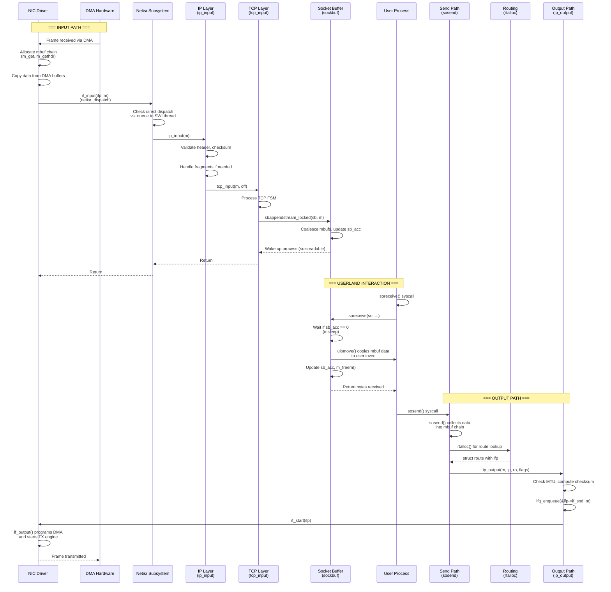

# Network Stack — Architecture and Packet Flow
<!-- This file is auto-generated by generate-doc.py -- do not edit manually -->

---
**Navigation:**
  **Up:** [Kernel Core — Structure and Entry Point](../README.md) ▸ [Source Tree — Layout and Conventions](../../README_internals.md)
  **Related:** [VFS — Virtual File System Layer](../fs/README.md) | [VNET — Virtual Network Stacks](README_vnet.md) | [pf — OpenBSD-derived Packet Filter](../netpfil/pf/README.md) | [Device Driver Framework — newbus and devclass](../kern/README_driver.md) | [NIC Drivers — from if_vr to iflib to if_cxgbe](../dev/README_nic_drivers.md)
  **All chapters:** [Source Tree — Layout and Conventions](../../README_internals.md) | [Boot Process — UEFI Bootloader to Kernel Handoff](../../stand/efi/loader/README.md) | [Kernel Core — Structure and Entry Point](../README.md) | [Build System — buildworld and buildkernel](../../share/mk/README.md) | [Virtual Memory Subsystem — vm_page, UMA, and Pagers](../vm/README.md) | [Process Management — Scheduling and Lifecycle](../kern/README_process.md) | [Locking Primitives — Mutexes, sx, rmlocks, and Atomics](../kern/README_locking.md) | [Buffer Cache — Block I/O Subsystem](../vm/README_bcache.md) ...
---


> ⚠ **UNVERIFIED DRAFT** — revisions regressed; kept revision 2 (8/9 criteria) over revision 3 (6/9); reviewer did not explicitly approve this draft. Treat claims as suspect until manually reviewed.


## Quick Summary
The FreeBSD network stack bridges hardware interrupts and user-level sockets through a strictly layered pipeline. When a network interface card (NIC) receives a frame, its driver constructs a chain of `struct mbuf` objects from DMA descriptors and hands them to the interface's input callback. This callback does not process the packet itself; instead, it queues the mbuf to `netisr` — the network interrupt service routine subsystem — for deferred execution. Netisr was introduced to replace the older BSD software interrupt mechanism, providing per-CPU queues, flow-based load balancing, and configurable dispatch policies that keep stateful protocol data on a single CPU to minimize lock contention and cache misses.

Once netisr dispatches a packet, the kernel walks the protocol stack. The IP layer validates headers, performs reassembly if fragments are present, and hands the payload to the appropriate transport protocol. For TCP, the segment is processed through its finite state machine. When application data becomes available, the transport layer appends payload mbufs to the socket's receive buffer using `sbappendstream()`. The socket receive buffer is a `struct sockbuf` — a double-ended mbuf queue with configurable watermarks and size limits that decouple the network stack producer from the userland consumer.

When a user process calls `soreceive()` or `read()` on a socket, the kernel invokes `soreceive()`, which walks the mbuf chain, copies data to user-provided `iovec` structures via `uiomove()`, and updates the buffer's character count. The output path works in reverse: userland data is collected into mbuf chains, the routing subsystem selects a path, and `ip_output()` constructs the outgoing packet. The output path enqueues the packet for transmission through the NIC driver's `if_output` function. This architecture enforces a fundamental operating systems principle: interrupt handlers remain fast and minimal, while complex processing, locking, and memory allocation occur in software threads that can safely sleep.

The network stack supports VNET (virtual network stacks) for multiple isolated network namespaces. Each VNET maintains its own copies of protocol state, including routing tables, socket buffers, and connection tracking. This design originated from the need to support virtualization and jail environments without duplicating the entire kernel, and it uses the `VNET_DEFINE` macro to declare per-instance variables that are automatically routed to the correct namespace based on the calling thread's context.

## Architecture
The input path begins in a NIC driver's interrupt handler. The driver processes DMA descriptors, allocates `struct mbuf` objects via `m_get(M_NOWAIT, MT_DATA)` or `m_gethdr(M_NOWAIT, MT_DATA)`, and calls `ifp->if_input(ifp, m)`. This callback is registered during driver initialization and points to a function that queues the mbuf to netisr. The actual queuing is performed by `netisr_dispatch()` in `sys/net/netisr.c`. Netisr maintains per-CPU queues for each registered protocol type. When `netisr_dispatch()` is called, the system checks whether direct dispatch is safe and whether the calling CPU is the designated owner for this flow. If direct dispatch is permitted, the registered handler runs immediately. Otherwise, the mbuf is queued to a software interrupt thread associated with the target CPU.

The IP input handler, `ip_input()` in `sys/netinet/ip_input.c`, is registered for `NETISR_IP`. It validates the IP header length and checksum, handles fragments, and dispatches to the appropriate transport protocol. For TCP, `tcp_input()` in `sys/netinet/tcp_input.c` processes the segment through its finite state machine. When data is available, it appends payload mbufs to the socket's receive buffer using `sbappendstream()`, which is defined in `sys/dev/cxgb/sys/uipc_mvec.c`. The `struct sockbuf` maintains `sb_mb` (the mbuf queue), `sb_ccc` (claimed characters), and `sb_mbcnt` (mbuf memory usage).

Userland interaction occurs through `soreceive()` in `sys/kern/uipc_socket.c`. This function handles both stream and datagram sockets, copying data to user-space via `uiomove()` from the mbuf chain. The socket structure (`struct socket`) in `sys/sys/socket.h` holds two `struct sockbuf` instances — `so_rcv` for receive and `so_snd` for send — along with a reference count, state flags, and a pointer to the associated `struct inpcb` for IP-layer connections.

The output path starts when userland data is collected into mbuf chains, typically through `sosend()` in `sys/kern/uipc_socket.c`. The routing subsystem selects a path, and `ip_output()` in `sys/netinet/ip_output.c` constructs the outgoing packet, walking the route table to determine the next-hop and output interface. The packet is then enqueued on the interface's output queue (`if_snd`, a `struct ifaltq`) and transmitted via the driver's `if_output` function.

Netisr supports several dispatch policies defined in `sys/net/netisr.h`: `NETISR_POLICY_SOURCE` maintains ordering by source address, `NETISR_POLICY_FLOW` maintains ordering by flow (5-tuple), and `NETISR_POLICY_CPU` allows the protocol to determine CPU placement. Dispatch modes include `NETISR_DISPATCH_DEFERRED` (always defer), `NETISR_DISPATCH_DIRECT` (always direct), and `NETISR_DISPATCH_HYBRID` (context-dependent). These policies ensure that TCP connections are processed on a single CPU, preserving lock ordering and cache locality.

## Key Data Structures

### struct mbuf
Defined in `sys/sys/mbuf.h`, the mbuf is the fundamental packet buffer structure. It forms singly-linked chains to hold packet data across protocol layers. Each mbuf contains a data pointer, length, and flags indicating packet headers, protocol-specific markers, and fragmentation state. Mbufs are allocated from UMA zones for performance, with special types like `MT_DATA` for payload and `MT_HEADER` for protocol headers. The `M_PKTHDR` flag indicates the first mbuf in a chain carries a packet header via `struct pkthdr`, which stores interface pointer, length, and ancillary data like bpf capture info.

```c
struct mbuf {
    struct  mbuf *m_next;     /* next buffer in chain */
    struct  mbuf *m_nextpkt;  /* next chain (route/sockbuf) */
    caddr_t m_data;           /* location of data */
    int     m_len;            /* amount of data in this mbuf */
    int     m_flags;          /* flags; see below */
    u_char  m_type;           /* type of data pointer */
    /* ... additional fields for alignment and metadata */
};
```

### struct sockbuf
Defined in `sys/sys/sockbuf.h`, the socket buffer is a double-ended mbuf queue with configurable watermarks and size limits. It decouples the network stack producer from the userland consumer, allowing the kernel to accumulate incoming data while user processes read at their own pace. The buffer tracks `sb_acc` (available characters), `sb_ccc` (claimed characters for AIO), and `sb_mbcnt` (mbuf memory usage in bytes). The `SB_MAX` constant (8 MiB) defines the default maximum buffer size.

```c
struct sockbuf {
    struct  selinfo *sb_sel;    /* process selecting read/write */
    short   sb_state;           /* socket state on sockbuf */
    short   sb_flags;           /* flags, see sockbuf.h */
    u_int   sb_acc;             /* available chars in buffer */
    u_int   sb_ccc;             /* claimed chars in buffer */
    u_int   sb_mbcnt;           /* chars of mbufs used */
    u_int   sb_hiwat;           /* high watermark */
    u_int   sb_mbmax;           /* max chars of mbufs */
    u_int   sb_lowat;           /* low watermark */
    /* ... sb_lock, sb_timeo, sb_flags, and other fields */
};
```

### struct ifnet
Defined in `sys/net/if_private.h`, the interface structure represents a network interface. It contains driver state pointers, capability flags, MTU, and the output queue (`if_snd`, a `struct ifaltq`). The `if_input` function pointer is set by drivers and called by netisr handlers. The `if_output` function pointer points to the driver's transmit function. Interface state is tracked through `if_flags` (administrative) and `if_drv_flags` (driver-managed), with link state changes propagated through `if_linktask` tasklets.

```c
struct ifnet {
    CK_STAILQ_ENTRY(ifnet) if_link;     /* all ifnets chained */
    LIST_ENTRY(ifnet) if_clones;        /* interfaces of a cloner */
    CK_STAILQ_HEAD(, ifg_list) if_groups; /* groups per if */
    void    *if_softc;                  /* pointer to driver state */
    const char *if_dname;               /* driver name */
    char    if_xname[IFNAMSIZ];         /* external name */
    int     if_flags;                   /* up/down, broadcast, etc */
    uint32_t if_mtu;                    /* maximum transmission unit */
    struct  ifaltq if_snd;              /* output queue */
    void    (*if_input)(struct ifnet *, struct mbuf *);
    int     (*if_output)(struct ifnet *, struct mbuf *,
                         struct sockaddr *, struct rtentry *);
    /* ... additional fields for capabilities, stats, and NUMA */
};
```

### struct inpcb
Defined in `sys/netinet/in_pcb.h`, the Internet Protocol Control Block represents a network connection endpoint. It embeds `struct in_conninfo` containing local and foreign addresses and ports, hash list entries for lookup, and pointers to the associated socket. The `inpcbinfo` structure manages the hash table and lock group for all inpcbs of a given protocol (TCP, UDP, etc.).

```c
struct inpcb {
    struct  in_conninfo inp_inc;   /* common inpcb fields */
    u_char  inp_vflag;             /* IPv4 or IPv6 */
    u_short inp_ip_tos;            /* IP type of service */
    struct  socket *inp_socket;    /* back pointer to socket */
    struct  inpcb *inp_hashnext;   /* hash chain */
    struct  inpcb *inp_lbgroup_list; /* load balancing group */
    /* ... additional fields for TTL, options, and protocol state */
};
```

### netisr Protocol Identifiers
Defined in `sys/net/netisr.h`, netisr protocol identifiers determine which handler processes each packet:

```c
#define NETISR_IP        1    /* IPv4 input */
#define NETISR_IGMP      2    /* IGMPv3 output queue */
#define NETISR_ROUTE     3    /* routing socket */
#define NETISR_ARP       4    /* same as AF_LINK */
#define NETISR_ETHER     5    /* ethernet input */
#define NETISR_IPV6      6    /* IPv6 input */
#define NETISR_IP_DIRECT 9    /* direct-dispatch IPv4 */
#define NETISR_IPV6_DIRECT 10 /* direct-dispatch IPv6 */
```

## Deep Dive
The packet input path follows a carefully choreographed sequence from hardware to userland:

### Step 1: Driver Interrupt and Mbuf Construction

When a NIC receives a frame, its interrupt handler runs in interrupt context. The handler reads DMA descriptors, allocates mbuf chains, and copies packet data from DMA buffers. FreeBSD drivers typically use `m_get(M_NOWAIT, MT_DATA)` for data buffers (non-blocking allocation) and `m_gethdr(M_NOWAIT, MT_DATA)` when a packet header is needed. The `M_NOWAIT` flag is critical — interrupt handlers cannot sleep, so any allocation that might block would cause a panic.

```c
/* Simplified driver receive path */
static void
driver_intr(void *arg)
{
    struct ifnet *ifp = arg;
    struct mbuf *m;

    while ((m = driver_get_packet()) != NULL) {
        ifp->if_input(ifp, m);
    }
}
```

### Step 2: Netisr Dispatch

The interface's `if_input` callback (often `ether_input` for Ethernet) calls `netisr_dispatch()`. This function in `sys/net/netisr.c` determines whether to dispatch directly or defer:

```c
/* From sys/net/netisr.c */
void
netisr_dispatch(int proto, struct mbuf *m)
{
    struct netisr_handler *nh;
    int cpuid;

    /* Look up the handler for this protocol type */
    nh = &netisr_dispatch_table[proto];

    /* Check if direct dispatch is safe */
    if (netisr_can_direct(nh, proto)) {
        /* Direct dispatch on calling CPU */
        nh->nh_handler(proto, m);
    } else {
        /* Queue to software interrupt thread */
        cpuid = netisr_select_cpu(nh, m);
        netisr_queue(cpuid, proto, m);
    }
}
```

Netisr's design addresses a fundamental challenge in modern multi-core systems: how to process network packets efficiently while maintaining protocol correctness. TCP's finite state machine requires that segments for a given connection be processed in order on the same CPU to avoid lock contention and cache thrashing. Netisr achieves this through flow-based CPU affinity — packets belonging to the same TCP connection (identified by their 5-tuple) are consistently dispatched to the same CPU.

### Step 3: IP Input Processing

`ip_input()` in `sys/netinet/ip_input.c` validates the IP header, checks for fragments, and dispatches to the appropriate transport protocol. The function is registered as the handler for `NETISR_IP`:

```c
/* From sys/netinet/ip_input.c */
void
ip_input(struct mbuf *m)
{
    struct ip *ip;
    int proto;

    /* Validate minimum header length */
    if (m->m_pkthdr.len < IP_HL(m) * 4)
        goto drop;

    ip = mtod(m, struct ip *);
    proto = ip->ip_p;

    /* Handle fragments */
    if (ip->ip_off & IP_MF || ip->ip_off & IP_OFFMASK) {
        ip_reass(m);
        return;
    }

    /* Dispatch to transport protocol */
    switch (proto) {
    case IPPROTO_TCP:
        tcp_input(m, IP_HL(ip) * 4);
        break;
    case IPPROTO_UDP:
        udp_input(m, IP_HL(ip) * 4);
        break;
    case IPPROTO_ICMP:
        icmp_input(m, IP_HL(ip) * 4);
        break;
    }
}
```

### Step 4: TCP Input and Socket Buffer Append

`tcp_input()` in `sys/netinet/tcp_input.c` processes TCP segments through the protocol's finite state machine. When data is received, it is appended to the socket's receive buffer:

```c
/* Simplified TCP receive path from sys/netinet/tcp_input.c */
static void
tcp_input(struct mbuf *m, int off)
{
    struct tcphdr *th;
    struct inpcb *inp;
    struct socket *so;

    /* Find the PCB for this connection */
    inp = in_pcblookup_hash(...);
    if (inp == NULL)
        goto drop;

    so = inp->inp_socket;
    if (so == NULL)
        goto drop;

    /* Process TCP state machine */
    switch (tp->t_state) {
    case TCPS_ESTABLISHED:
        /* Data received - append to socket buffer */
        if (tcp_do_rwin) {
            sbappendstream_locked(&so->so_rcv, m);
        }
        /* Wake up waiting processes */
        soisreadable(so);
        break;
    }
}
```

The `sbappendstream_locked()` function in `sys/kern/uipc_sockbuf.c` appends mbufs to the socket receive buffer while holding the buffer lock. It coalesces adjacent mbufs when possible (unless `SB_NOCOALESCE` is set) to reduce chain fragmentation:

```c
/* From sys/kern/uipc_sockbuf.c */
void
sbappendstream_locked(struct sockbuf *sb, struct mbuf *m0)
{
    struct mbuf *m;

    SOCKBUF_LOCK_ASSERT(sb);

    /* Coalesce with previous mbuf if possible */
    if ((sb->sb_flags & SB_NOCOALESCE) == 0) {
        for (m = sb->sb_mb; m != NULL; m = m->m_next) {
            if ((m->m_flags & M_NOTREADY) == 0) {
                /* Try to append to this mbuf */
                m_copydata(m, 0, 0, NULL); /* Check space */
                if (m_canput(m, m0->m_len)) {
                    m_copyback(m, 0, m0->m_len, m0);
                    m_freem(m0);
                    m0 = NULL;
                    break;
                }
            }
        }
    }

    /* Append remaining mbufs */
    if (m0 != NULL) {
        sb->sb_mb = sbappend_locked(sb, m0);
    }

    /* Update buffer statistics */
    sb->sb_acc += m_length(m0, NULL);
    sb->sb_mbcnt += m_mbcnt;
}
```

### Step 5: Userland Receive

When a user process calls `soreceive()` on a socket, the kernel enters `soreceive()` in `sys/kern/uipc_socket.c`:

```c
/* From sys/kern/uipc_socket.c */
int
soreceive(struct socket *so, struct uio *uio,
          struct mbuf **mp, size_t *lenp, struct mbuf **controlp,
          int *flagsp)
{
    struct sockbuf *sb = &so->so_rcv;
    struct mbuf *m, *nextm;
    size_t len, avail;
    int error;

    SOCKBUF_LOCK(sb);

    /* Wait for data if buffer is empty */
    while (sb->sb_acc == 0 && (sb->sb_state & SBS_CANTRCVMORE) == 0) {
        if (sb->sb_state & SBS_CANTRCVMORE) {
            error = EIO;
            goto out;
        }
        sb->sb_flags |= SB_WAIT;
        error = msleep(&sb->sb_cc, &sb->sb_lock, 0, "sorecv", 0);
        if (error)
            goto out;
    }

    /* Copy data to user space via uiomove */
    len = 0;
    m = sb->sb_mb;
    while (m != NULL && len < *lenp) {
        avail = min(m->m_len, *lenp - len);
        error = uiomove_from_mbuf(m, avail, uio);
        if (error)
            goto out;
        len += avail;
        m->m_len -= avail;
        m->m_data += avail;
        if (m->m_len == 0) {
            nextm = m->m_next;
            m_freem(m);
            m = nextm;
        }
    }

    /* Update buffer state */
    sb->sb_acc -= len;
    if (sb->sb_acc < sb->sb_lowat)
        sorwakeup(sb);

out:
    SOCKBUF_UNLOCK(sb);
    return (error);
}
```

The `uiomove()` function copies data from kernel mbuf chains to user-space `iovec` structures, handling the address translation and validation. This is where the kernel transitions from kernel-space to user-space memory, requiring careful handling of page faults and access permissions.

### Step 6: Output Path

The output path begins when userland calls `sosend()` on a socket. Data is collected into mbuf chains through `sosend()` in `sys/kern/uipc_socket.c`. The routing subsystem selects a path via `rtalloc()`, and `ip_output()` constructs the outgoing packet:

```c
/* From sys/netinet/ip_output.c */
int
ip_output(struct mbuf *m, struct ip *ip, struct route *ro,
          int flags, struct inpcb *inp)
{
    struct rtentry *rt;
    struct ifnet *ifp;
    struct ip *ip_ptr;

    /* Look up route */
    if (ro != NULL)
        rt = ro->ro_rt;
    else
        rt = rtalloc(&inp->inp_inc, 0, 0, curthread->td_ucred);

    if (rt == NULL)
        return (ENETUNREACH);

    ifp = rt->rt_ifp;

    /* Check for MTU issues */
    if ((flags & IP_RAWOUTPUT) == 0 && 
        m->m_pkthdr.len > ifp->if_mtu) {
        icmp_error(m, ICMP_UNREACH, ICMP_UNREACH_TOSFAIL, 0);
        return (EMSGSIZE);
    }

    /* Enqueue for transmission */
    ifq_enqueue(&ifp->if_snd, m);
    if_start(ifp);

    return (0);
}
```

The interface's `if_start()` function dequeues packets from `if_snd` and calls the driver's `if_output` function to transmit them. Drivers typically implement this by programming DMA descriptors and starting the NIC's transmit engine.

## Flow / Diagram



## Advanced Notes

### DTrace Probes for Network Debugging
FreeBSD's network stack includes SDT (Static DTrace Tracing) probes for runtime debugging. Key probes include:
- `sdt, , , mbuf_alloc` / `mbuf_free`: Track mbuf allocation and reclamation
- `sdt, , , tcp_input`: Trace TCP segment processing
- `sdt, , , ip_input`: Trace IP packet processing
- `sdt, , , soreceive`: Trace socket receive operations

These probes allow administrators to trace packet flow without recompiling the kernel or inserting print statements. For example:

```dtrace
dtrace -n 'tcp:::input { printf("TCP input: %d bytes from %s\n", arg1, arg2); }'
```

### Performance Implications
Netisr's flow-based CPU affinity has significant performance implications. By keeping all packets for a TCP connection on the same CPU, the design eliminates the need for cross-CPU locking and preserves cache locality for connection state. However, this can lead to load imbalance if a few high-bandwidth connections dominate a single CPU. FreeBSD addresses this through RSS (Receive Side Scaling) in drivers, which distributes incoming packets across multiple CPUs based on flow hashes before netisr dispatch.

Socket buffer watermarks (`sb_lowat`, `sb_hiwat`) control backpressure. When `sb_acc` exceeds `sb_hiwat`, the sender is blocked. When it drops below `sb_lowat`, waiting processes are woken. The `SB_AUTOSIZE` flag enables automatic buffer sizing based on observed network throughput, which is particularly useful for high-bandwidth, high-latency networks.

### Common Pitfalls
1. **Mbuf exhaustion**: Under heavy load, mbuf allocation failures can cause packet drops. Monitor `mbufprofile` sysctls and consider increasing the mbuf pool size.
2. **Netisr queue overflow**: If a CPU's netisr queue fills, packets are dropped. Check `net.isr.maxthreads` and `net.inet.ip.intr_queue_maxlen` sysctls.
3. **Socket buffer deadlock**: Improperly sized buffers can lead to deadlocks where the receiver waits for space while the sender waits for buffer space. Always set `sb_lowat` below `sb_hiwat`.
4. **VNET migration**: When migrating sockets between VNETs, ensure all protocol state is properly transferred. Failure to do so can cause packets to be delivered to the wrong namespace.

### Race Conditions
The socket buffer lock (`sb_lock`) protects against concurrent access from multiple threads. However, certain operations like `soreceive()` must carefully handle the case where data arrives between the lock release and re-acquire. FreeBSD uses `msleep()` with proper priority handling to avoid livelock. The `SB_WAIT` flag indicates a process is sleeping on the buffer, and `sorwakeup()` clears this flag and wakes the process.

For TCP, the `inpcb` hash table uses lock groups (`rmlock`) for scalable concurrent access. The `INP_RLOCK()` function provides safe read-side access for PCB lookups during concurrent modifications. This is critical for maintaining connection integrity during high-rate packet processing.

### Connection to OS Theory
FreeBSD's network stack embodies several classic operating systems principles:
- **Interrupt deferral**: Hardware interrupts do minimal work, deferring complex processing to software threads. This is the BSD software interrupt model, now implemented via netisr.
- **Copy avoidance**: Mbuf chains allow zero-copy data transfer between layers. The `M_EXT` flag indicates externally allocated memory that can be shared without copying.
- **Backpressure**: Socket buffer watermarks implement flow control, preventing fast producers from overwhelming slow consumers.
- **Virtualization**: VNET provides network namespace isolation without kernel duplication, using per-instance variables and epoch-based reclamation for safe concurrent access.

## Comparison

### FreeBSD vs Linux
FreeBSD's netisr differs significantly from Linux's NAPI (New API) and softirq model. Linux uses a polling mechanism where the driver polls for packets in softirq context, while FreeBSD uses an interrupt-driven model with deferred processing via netisr threads. Linux's `sk_buff` (socket buffer) is analogous to FreeBSD's mbuf, but Linux's approach to socket buffering is more tightly coupled to the protocol stack, whereas FreeBSD maintains a cleaner separation between the socket layer and protocol layers.

Linux's `struct sock` (socket) combines receive and send buffers with protocol-specific state in a single structure, while FreeBSD uses `struct socket` (generic socket) containing two `struct sockbuf` instances, with protocol-specific state in `struct inpcb`. This separation allows FreeBSD to support non-IP protocols more cleanly, as the socket layer is protocol-agnostic.

FreeBSD's UMA (Unified Memory Allocator) for mbuf allocation differs from Linux's SLUB allocator. UMA provides per-CPU caches and zone-based allocation, which reduces lock contention for frequently allocated objects. Linux's skbuff slabs serve a similar purpose but with different memory management semantics.

### FreeBSD vs NetBSD/OpenBSD
NetBSD and OpenBSD share similar networking architectures with FreeBSD, having evolved from the same BSD lineage. NetBSD's netisr implementation uses `NETISR_POLICY_ROUNDROBIN` as its default dispatch policy, which distributes packets across CPUs in round-robin fashion rather than FreeBSD's flow-based affinity. OpenBSD's network stack includes the `mmap()`-based packet socket interface (`pfil`) and uses `pledge()` and `unveil()` syscalls to restrict network capabilities. OpenBSD also implements strict memory protection via W^X (write XOR execute) at the packet buffer level, and its `pf` packet filter uses a stateful connection tracking table (`pf_state`) that differs from FreeBSD's `ipfw` rule-based approach.

All three BSDs use the mbuf model for packet buffering, but FreeBSD's implementation includes additional features like zerocopy BPF support (`bpf_zerocopy_*` functions) and KTLS (Kernel TLS) integration (`struct xktls_session`) that are not present in other BSDs.

### macOS/XNU
macOS's XNU kernel uses a hybrid Mach-BSD architecture with a significantly different network stack. XNU's `network_stack` subsystem provides a user-kernel boundary that differs from FreeBSD's socket API. XNU uses `struct netstack` and `struct netstack_ref` for network namespace management, whereas FreeBSD uses VNET with `VNET_DEFINE` macros. XNU's packet processing uses `m_copydata()` and `m_copyback()` for data manipulation, similar to FreeBSD, but XNU's socket implementation (`struct xsocket`) embeds protocol state directly rather than using a separate `struct inpcb` like FreeBSD. Additionally, XNU's `libkern` provides `OSAllocatedZeroedObjects` for memory management, which differs from FreeBSD's UMA zone-based allocation.

## See Also
- [VFS — Virtual File System Layer](../fs/README.md)
- [Device Driver Framework — newbus and devclass](../kern/README_driver.md)
- [VNET — Virtual Network Stacks](README_vnet.md)
- [pf — OpenBSD-derived Packet Filter](../netpfil/pf/README.md)
- [NIC Drivers — from if_vr to iflib to if_cxgbe](../dev/README_nic_drivers.md)


Key source directories:
- `sys/net/` — Core network interface and netisr code
- `sys/netinet/` — IPv4 protocol stack
- `sys/netinet6/` — IPv6 protocol stack
- `sys/dev/cxgb/sys/uipc_mvec.c` — Unix domain sockets and socket buffer management
- `sys/netpfil/` — Packet filter framework

---

> _Generated by [DaemonDocs](https://github.com/ocochard/DaemonDocs) on 2026-05-01 00:51 UTC using model `Qwen3.6-35B-A3B-UD-Q4_K_XL` (llama.cpp build `b8985-27aef3dd9`). AI-generated content — verify against source before relying on it._
