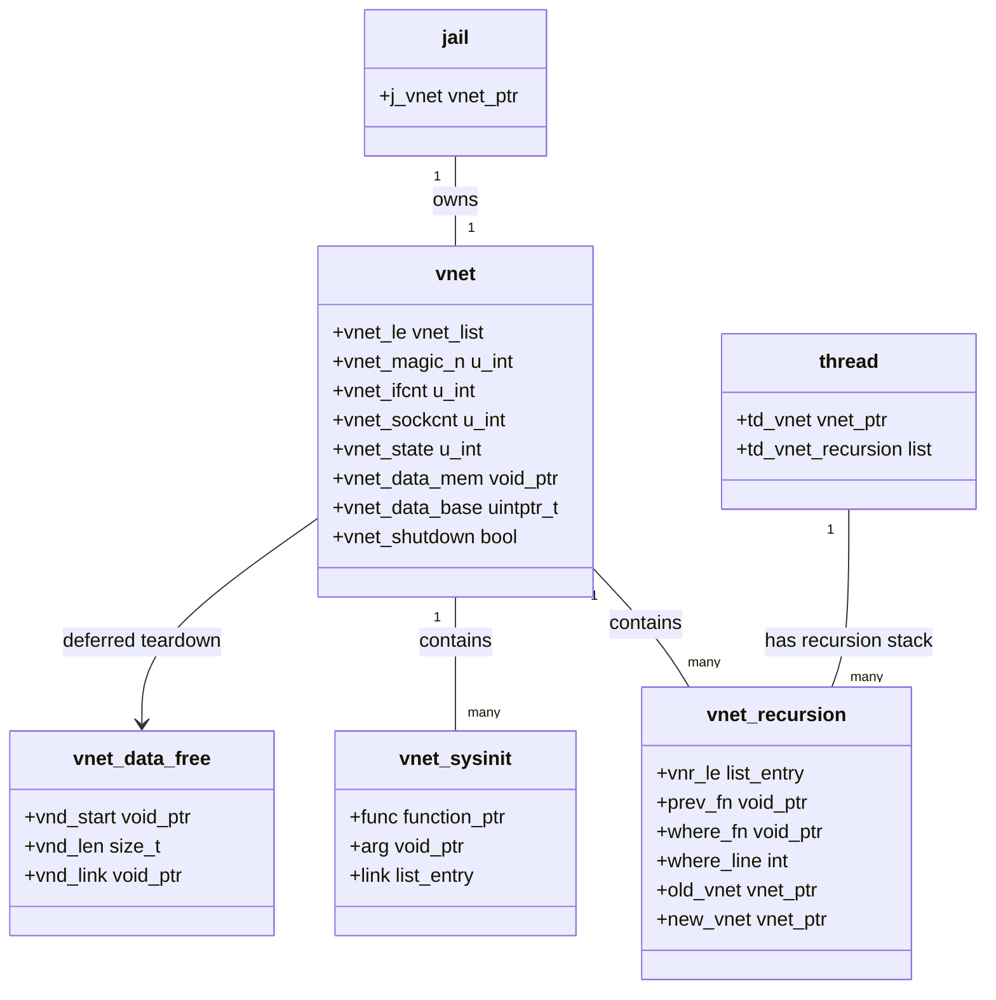

# VNET — Virtual Network Stacks
<!-- This file is auto-generated by generate-doc.py -- do not edit manually -->

---
**Navigation:**
  **Up:** [Network Stack — Architecture and Packet Flow](README.md) ▸ [Kernel Core — Structure and Entry Point](../README.md) ▸ [Source Tree — Layout and Conventions](../../README_internals.md)
  **Related:** [Network Stack — Architecture and Packet Flow](README.md) | [pf — OpenBSD-derived Packet Filter](../netpfil/pf/README.md) | [Jails — OS-level Isolation](../kern/README_jail.md)
  **All chapters:** [Source Tree — Layout and Conventions](../../README_internals.md) | [Boot Process — UEFI Bootloader to Kernel Handoff](../../stand/efi/loader/README.md) | [Kernel Core — Structure and Entry Point](../README.md) | [Build System — buildworld and buildkernel](../../share/mk/README.md) | [Virtual Memory Subsystem — vm_page, UMA, and Pagers](../vm/README.md) | [Process Management — Scheduling and Lifecycle](../kern/README_process.md) | [Locking Primitives — Mutexes, sx, rmlocks, and Atomics](../kern/README_locking.md) | [Buffer Cache — Block I/O Subsystem](../vm/README_bcache.md) ...
---


## Quick Summary

VNET (Virtual Network) is FreeBSD's per-jail network-stack virtualization framework. It transforms nearly every global variable in the network stack — interface lists, routing tables, packet filter rule sets, TCP/UDP PCB hashes, and net.* sysctl values — into per-vnet instances. This means a jail running with VNET enabled sees a completely independent network world: it has its own interface list, its own ARP cache, its own routing tables, and its own connection state, entirely separate from the host and from other jails.

The framework originated in the mid-2000s at the University of Zagreb and was later adopted and extended by the FreeBSD Foundation. Before VNET, jails shared a single global network stack, which meant that a jail could see and modify network state belonging to other jails or the host. VNET solves this by maintaining a separate `struct vnet` instance for each network namespace, with each instance containing its own copies of all virtualized global data. The base kernel always has vnet0 — the host's network stack — and each jail with the `vnet` capability gets its own vnet allocated from the vnet memory allocator.

At its core, VNET is a memory allocator and context-switching mechanism. It uses ELF linker sets (`set_vnet`) to collect all virtualized global variables at link time, then allocates a contiguous memory block for each vnet instance that contains copies of all these variables. When code accesses a virtualized global, the `VNET()` macro resolves it to the correct instance based on the current thread's vnet context, which is tracked in the thread's `td_vnet` field. The `CURVNET_SET()` macro allows code to temporarily switch the vnet context, enabling network subsystems to operate on a different vnet than the calling thread's default.

VNET distinguishes itself from chapter 12 (jail process isolation) by focusing exclusively on the network half. While [jail(8)](../../usr.sbin/jail/jail.8) provides process-level isolation — separate PID namespaces, credentials, and resource limits — VNET provides network-stack isolation. A jail without VNET still shares the host's network stack; it can see all interfaces, all routes, all connections, and all packet filter rules. A jail with VNET gets a completely private network namespace. The two mechanisms are complementary: jail provides the container boundary, and VNET provides the network isolation within that boundary.

## Architecture

VNET's architecture rests on three pillars: the linker set mechanism for collecting virtualized globals, the vnet memory allocator for providing per-instance storage, and the sysinit framework for running per-vnet initialization and cleanup.

### Linker Set Mechanism

Every virtualized global variable is declared with `VNET_DECLARE()` in a header file and defined with `VNET_DEFINE()` in a source file. These macros place the variable in the `set_vnet` ELF linker set. At link time, the linker collects all entries from `set_vnet` into a contiguous array. The linker set mechanism ensures that every virtualized variable has a known, fixed offset within this array. This allows the kernel to compute per-variable addresses using simple pointer arithmetic based on the offset, without needing a runtime name lookup or discovery phase. The linker does all the work of arranging symbols contiguously.

The `VNET_DEFINE()` macro expands to the actual variable definition, while `VNET_DECLARE()` expands to an extern declaration. When VNET is not compiled in (the common case on systems that do not use jail virtualization), both macros expand to nothing, and the variables become normal globals, incurring zero overhead. This conditional compilation is controlled by the `VIMAGE` kernel option.

### VNET Memory Allocator

The vnet memory allocator, implemented in `sys/net/vnet.c`, provides storage for virtualized global variables. When a new vnet is allocated via `vnet_alloc()`, the allocator:

1. Allocates a `struct vnet` control block from `M_VNET` malloc type
2. Computes the total size needed by summing the sizes of all variables in the `set_vnet` linker set
3. Allocates a contiguous memory block of that size
4. Initializes each virtualized variable by copying its initial value from the base kernel's copy

The `vnet_data_mem` field of `struct vnet` points to this contiguous block, and `vnet_data_base` provides the base address used by the `VNET()` macro to compute per-variable offsets. When code accesses `VNET(foo)`, the macro computes the address as `vnet_data_base + offset_of_foo`, where the offset is determined at link time from the position of `foo` in the `set_vnet` array.

### VNET Context Switching

The vnet context is stored in the thread structure (`td_vnet` in `struct thread`). By default, a thread operates on the vnet associated with its process's jail. When a thread enters a different jail, the vnet context switches automatically. The `CURVNET_SET()` macro allows code to temporarily override this default, setting the thread's vnet to a specified instance and saving the previous context on a per-thread recursion stack (`vnet_recursion`). This is essential for code paths that need to operate on a different vnet than the calling thread's default — for example, when a packet arrives on an interface belonging to a different vnet, or when a socket operation needs to access a different vnet's state.

The recursion stack prevents infinite loops when `CURVNET_SET()` is called recursively. Each `CURVNET_SET()` call pushes the old vnet onto the stack, and `CURVNET_RESTORE()` pops it. The `vnet_recursion` structure tracks the recursion depth and validates that every set has a matching restore.

### Per-VNET Sysinit Framework

VNET extends the standard `sysinit` framework with `VNET_SYSINIT()` and `VNET_SYSUNINIT()` macros. These allow network subsystems to register initialization and cleanup functions that run once for each vnet instance. When a new vnet is created, all registered `VNET_SYSINIT()` functions are called in order. When a vnet is destroyed, all registered `VNET_SYSUNINIT()` functions are called in reverse order. This mechanism replaces the need for each subsystem to manually track per-vnet state during creation and destruction.

The `vnet_sysinit` structure holds a function pointer and argument for each registration. These are collected into a per-vnet list and processed during vnet creation and destruction.

### VNET and Jails

A jail gets its own vnet when it is created with the `vnet` capability and a vnet interface (typically a vnet tap or vnet interface) is attached. The jail's vnet is allocated during jail creation and associated with the jail structure. When a process enters the jail, its thread's `td_vnet` field is set to the jail's vnet. When the process leaves the jail (or the jail is destroyed), the thread's vnet context switches back.

The relationship between jails and vnets is many-to-one: multiple jails can share the same vnet (when they are nested or when explicitly configured to do so), but typically each jail gets its own vnet. The `vnet_ifcnt` and `vnet_sockcnt` fields of `struct vnet` track the number of interfaces and sockets associated with each vnet, providing accounting information.

## Key Data Structures

### struct vnet

Defined in `sys/net/vnet.h`, this is the core data structure representing a virtual network stack instance:

```c
# From sys/net/vnet.h
struct vnet {
	LIST_ENTRY(vnet)	 vnet_le;	/* all vnets list */
	u_int			 vnet_magic_n;
	u_int			 vnet_ifcnt;
	u_int			 vnet_sockcnt;
	u_int			 vnet_state;	/* SI_SUB_* */
	void			*vnet_data_mem;
	uintptr_t		 vnet_data_base;
	bool			 vnet_shutdown;	/* Shutdown in progress. */
} __aligned(CACHE_LINE_SIZE);
```

The `vnet_le` field links all vnets into a global list (`vnet_head`), protected by both `vnet_sxlock` (a sleepable exclusive lock) and `vnet_rwlock` (a sleepable read-write lock). The dual-lock design allows the list to be stabilized and walked in a variety of network stack contexts — the sx lock prevents concurrent list modifications, while the rw lock provides a lighter-weight alternative for read-only walks.

The `vnet_magic_n` field (set to `VNET_MAGIC_N` = 0x5e4a6f28) is used for debugging and validation. Code can verify that a pointer to `struct vnet` is valid by checking this magic value.

The `vnet_data_mem` and `vnet_data_base` fields point to the contiguous memory block containing all virtualized global variables for this vnet. The `vnet_data_base` field is a `uintptr_t` that provides the base address for computing per-variable offsets.

The `vnet_shutdown` flag indicates that teardown is in progress, preventing new operations from starting on a vnet that is being destroyed.

### struct vnet_recursion

Defined in `sys/net/vnet.c`, this structure tracks nested `CURVNET_SET()` calls on a per-thread basis:

```c
# From sys/net/vnet.c
struct vnet_recursion {
	LIST_ENTRY(vnet_recursion) vnr_le;
	void			*prev_fn;
	void			*where_fn;
	int			 where_line;
	struct vnet		*old_vnet;
	struct vnet		*new_vnet;
};
```

Each `CURVNET_SET()` call creates a new `vnet_recursion` entry and pushes it onto the thread's recursion stack. The `prev_fn` and `where_fn` fields track the call stack for debugging. The `old_vnet` and `new_vnet` fields store the vnet context before and after the set, enabling `CURVNET_RESTORE()` to return to the previous context.

### struct vnet_sysinit

Defined in `sys/net/vnet.h`, this structure holds per-vnet initialization callbacks:

```c
# From sys/net/vnet.h
struct vnet_sysinit {
	void			(*func)(void *);
	void			*arg;
	LIST_ENTRY(vnet_sysinit) link;
};
```

Each network subsystem registers its initialization and cleanup functions using `VNET_SYSINIT()` and `VNET_SYSUNINIT()`. These functions are stored in a list attached to each vnet and processed during vnet creation and destruction.

### struct vnet_data_free

Defined in `sys/net/vnet.c`, this structure is used during vnet teardown to defer freeing of vnet-specific data:

```c
# From sys/net/vnet.c
struct vnet_data_free {
	void			*vnd_start;
	size_t			 vnd_len;
	void			*vnd_link;
};
```

When a vnet is destroyed, its data block cannot be freed immediately if there are still references to it (from mbufs, timers, or other asynchronous operations). The `vnet_data_free` structure queues the data block for deferred freeing, allowing the teardown to complete without race conditions.

## Deep Dive

### VNET_DEFINE / VNET_DECLARE: The Linker Set Trick

The magic of VNET lies in how it virtualizes global variables without requiring every network subsystem to be rewritten with explicit vnet pointers. The key insight is that ELF linker sets provide a way to collect symbols at link time, and C's address-of operator gives us the offset of each symbol within the linker set array.

In `sys/net/vnet.h`, `VNET_DEFINE()` is defined as:

```c
# From sys/net/vnet.h
#define VNET_DEFINE(t, n)	t n
```

And `VNET_DECLARE()` is:

```c
# From sys/net/vnet.h
#define VNET_DECLARE(t, n)	extern t n
```

These macros place each variable in the `set_vnet` linker set. The linker collects all variables placed in `set_vnet` into a contiguous array. Each variable's position in this array corresponds to a fixed, compile-time offset. This contiguous layout is what enables fast address resolution later.

When VNET is compiled in, the `VNET()` macro resolves a virtualized variable to the current vnet's copy:

```c
# From sys/net/vnet.h
#define VNET(name)		VNET_VNET(curvnet, name)
```

The `VNET_VNET()` macro resolves via direct pointer arithmetic. It takes the current vnet pointer (`curvnet`), adds the compile-time offset of the named variable to the vnet's data base address (`vnet_data_base`), and returns a pointer to that variable's storage in the current vnet. This mechanism means that code like `VNET(ifnet)` transparently accesses the correct per-vnet interface list without any explicit vnet pointer passing or runtime string lookup.

### CURVNET_SET: Context Switching

The `CURVNET_SET()` macro is the mechanism by which code switches the vnet context. It is defined in `sys/net/vnet.h` as:

```c
# From sys/net/vnet.h
#define CURVNET_SET(arg)	CURVNET_SET_VERBOSE(arg)
```

The actual implementation (in `sys/net/vnet.c`) performs the following steps:

1. Allocates a `vnet_recursion` structure and pushes it onto the thread's recursion stack
2. Saves the current vnet context (`curvnet`) into the `old_vnet` field
3. Sets the thread's `td_vnet` field to the new vnet
4. Updates the global `curvnet` variable to the new vnet

This context switch is critical for packet processing. When a packet arrives on an interface belonging to a different vnet, the packet's input path must switch to that vnet's context before processing. The `CURVNET_SET()` call ensures that all subsequent accesses to virtualized globals (interface lists, routing tables, PCB hashes) refer to the correct vnet's state.

The recursion stack prevents infinite loops when `CURVNET_SET()` is called recursively. Each nested call pushes a new entry, and `CURVNET_RESTORE()` pops entries in LIFO order. The `vnet_recursion` structure tracks the call stack for debugging, with `prev_fn` and `where_fn` recording the function and line number of each call.

### VNET Allocation and Initialization

The `vnet_alloc()` function, defined in `sys/net/vnet.c`, creates a new vnet instance:

```c
# From sys/net/vnet.c
static struct vnet *
vnet_alloc(void)
{
    struct vnet *vn;
    void *mem;
    int i;

    vn = malloc(sizeof(struct vnet), M_VNET, M_WAITOK | M_ZERO);
    vn->vnet_magic_n = VNET_MAGIC_N;

    /* Allocate memory for virtualized variables */
    mem = malloc(vnet_total_size, M_VNET, M_WAITOK | M_ZERO);
    vn->vnet_data_mem = mem;
    vn->vnet_data_base = (uintptr_t)mem;

    /* Copy initial values from base kernel */
    for (i = 0; i < vnet_set_size; i++) {
        vnet_copy_variable(i, mem);
    }

    /* Register with vnet list */
    VNET_LIST_WLOCK();
    LIST_INSERT_HEAD(&vnet_head, vn, vnet_le);
    VNET_LIST_WUNLOCK();

    /* Run per-vnet sysinits */
    vnet_run_sysinits(vn);

    return vn;
}
```

The function allocates a `struct vnet` control block and a contiguous memory block for all virtualized variables. It copies the initial values from the base kernel's copy of each variable, then registers the new vnet with the global vnet list and runs all registered per-vnet sysinits.

### VNET Destruction and Deferred Teardown

The `vnet_destroy()` function, also in `sys/net/vnet.c`, handles vnet teardown:

```c
# From sys/net/vnet.c
void
vnet_destroy(struct vnet *vn)
{
    vn->vnet_shutdown = true;

    /* Run per-vnet sysuninits */
    vnet_run_sysuninits(vn);

    /* Queue data block for deferred freeing */
    vnet_data_free_deferred(vn);

    /* Remove from vnet list */
    VNET_LIST_WLOCK();
    LIST_REMOVE(vn, vnet_le);
    VNET_LIST_WUNLOCK();

    /* Free the control block */
    free(vn, M_VNET);
}
```

The destruction protocol is carefully designed to handle the fact that mbufs, timers, and other asynchronous operations may still reference the vnet's state. The `vnet_shutdown` flag prevents new operations from starting, and the `vnet_data_free` structure queues the data block for deferred freeing. The actual memory is freed only when all references have been released.

Interface cleanup is handled by iterating the per-vnet `ifnet` list and calling `if_detach()` on each interface, which triggers the interface's cleanup callbacks and removes it from the vnet's interface list. Socket cleanup is managed by traversing the per-vnet protocol control block (PCB) hashes, closing sockets, and freeing associated PCBs, socket buffers, and state. Reference counting ensures that any mbufs or timers still holding references are properly drained before the vnet's data block is safely freed.

### Per-VNET Sysinit Framework

The per-vnet sysinit framework allows network subsystems to register initialization and cleanup functions that run once for each vnet instance. A subsystem registers with:

```c
# From sys/net/vnet.h
VNET_SYSINIT(my_subsys_init, &sbstuff, my_subsys_init_fn, NULL);
VNET_SYSUNINIT(my_subsys_fini, &sbstuff, my_subsys_fini_fn, NULL);
```

When a new vnet is created, all registered `VNET_SYSINIT()` functions are called in order of their sublevel and order values. When a vnet is destroyed, all registered `VNET_SYSUNINIT()` functions are called in reverse order. This mechanism ensures that each vnet's network subsystems are properly initialized and cleaned up.

The `vnet_sysinit` structure holds each registration:

```c
# From sys/net/vnet.h
struct vnet_sysinit {
	void			(*func)(void *);
	void			*arg;
	LIST_ENTRY(vnet_sysinit) link;
};
```

These structures are collected into a list attached to each vnet and processed during vnet creation and destruction.

## Flow / Diagram



## Advanced Notes

### DTrace Probes

VNET provides SDT (System Dynamic Tracing) probes for debugging vnet lifecycle events. The `vnet_alloc` probe fires when a new vnet is allocated, `vnet_destroy` fires when teardown begins, and `vnet_set` fires when the vnet context switches. These probes can be used to trace vnet creation and destruction in production systems without restarting with debug kernels.

Example DTrace script to trace vnet context switches:

```
dtrace -n 'sdt::vnet-set { printf("Thread %d: %s -> %s", pid, arg0, arg1); }'
```

### Performance Considerations

VNET adds minimal overhead to every network operation that accesses virtualized globals. The `VNET()` macro resolves via direct pointer arithmetic using the current vnet pointer and compile-time offsets. This makes virtualized variable access as fast as a normal global variable access, with negligible overhead compared to a function call or string lookup.

The vnet context switch performed by `CURVNET_SET()` is relatively expensive because it modifies the thread's `td_vnet` field and pushes/pops from the recursion stack. Code that frequently switches vnets should minimize the number of switches by batching operations that belong to the same vnet.

The memory overhead of VNET is proportional to the number of virtualized variables and the number of vnets. Each vnet allocates a contiguous memory block containing copies of all virtualized variables. For systems with many vnets, this can add up to significant memory usage. The `vnet_ifcnt` and `vnet_sockcnt` fields provide accounting information that can be used to monitor per-vnet resource usage.

### Race Conditions and Concurrency

The vnet list is protected by both `vnet_sxlock` (an sx lock) and `vnet_rwlock` (a read-write lock). The dual-lock design allows the list to be walked in a variety of contexts: the sx lock provides exclusive access for list modifications, while the rw lock provides a lighter-weight alternative for read-only walks. Code that walks the vnet list must acquire both locks exclusively to modify the list, but a read lock of either lock is sufficient for read-only walks.

The `vnet_shutdown` flag provides a simple mechanism for preventing new operations from starting on a vnet that is being destroyed. Code that accesses vnet state should check this flag before proceeding, and should handle the case where the vnet is being torn down.

### Common Pitfalls

1. **Forgetting to restore vnet context**: Code that calls `CURVNET_SET()` must always call `CURVNET_RESTORE()` before returning, even in error paths. Failure to do so leaves the thread in the wrong vnet context, which can cause subtle bugs that are difficult to reproduce.

2. **Accessing vnet state during teardown**: Code that accesses virtualized globals during vnet teardown may encounter use-after-free bugs if the vnet's data block has already been freed. The `vnet_shutdown` flag and deferred teardown mechanism help prevent this, but code must still be careful.

3. **Assuming vnet context matches jail**: A thread's vnet context does not always match the jail it belongs to. Code that assumes this equivalence may fail in nested jail scenarios or when vnet context is explicitly switched.

4. **Memory leaks**: If a vnet is destroyed without properly cleaning up all associated state (interfaces, sockets, timers), the vnet's data block may not be freed, leading to memory leaks. The deferred teardown mechanism helps, but code must ensure that all references are released.

### Connection to OS Theory

VNET is an example of namespace virtualization, a technique used in many operating systems to provide isolated execution environments. Namespaces isolate global system resources — such as process IDs, network interfaces, and mount points — so that each namespace sees only its own copy of the resource. FreeBSD's VNET implements network namespace virtualization, while Linux implements similar functionality through network namespaces.

The linker set mechanism used by VNET provides a scalable solution to the problem of virtualizing global variables without requiring explicit vnet pointer passing. By collecting all virtualized variables at link time and providing a macro-based resolution mechanism, VNET allows network subsystems to remain largely virtualization-agnostic. This design is similar to the way Linux uses `percpu` variables for per-CPU state, but VNET extends the concept to per-namespace state.

The deferred teardown protocol used by VNET is an example of reference counting and garbage collection in the kernel. When a vnet is destroyed, its data block cannot be freed immediately because there may still be references to it from mbufs, timers, or other asynchronous operations. The deferred teardown mechanism queues the data block for freeing when all references have been released, preventing use-after-free bugs while avoiding the overhead of immediate cleanup.

## See Also
- [Network Stack — Architecture and Packet Flow](README.md)
- [Jails — OS-level Isolation](../kern/README_jail.md)
- [pf — OpenBSD-derived Packet Filter](../netpfil/pf/README.md)


- [sys/net/vnet.c](sys/net/vnet.c) — Core vnet implementation
- [sys/net/vnet.h](sys/net/vnet.h) — VNET header with macro definitions
- [sys/kern/init_main.c](sys/kern/init_main.c) — mi_startup and sysinit framework
- [sys/sys/jail.h](sys/sys/jail.h) — Jail subsystem interface
- [sys/netinet/in_pcb.c](sys/netinet/in_pcb.c) — TCP/UDP PCB implementation with VNET support
- [sys/net/if.c](sys/net/if.c) — Interface management with per-vnet interface lists
- [man9 VNET](man9 VNET) — [VNET(9)](../../share/man/man9/VNET.9) manual page
- [FreeBSD Handbook: Jail Subsystem](books/arch-handbook/jail/) — Jail documentation

---

> _Generated by [DaemonDocs](https://github.com/ocochard/DaemonDocs) on 2026-05-03 16:47 UTC using model `Qwen3.6-35B-A3B-UD-Q8_K_XL` (llama.cpp build `b8985-27aef3dd9`). AI-generated content — verify against source before relying on it._
