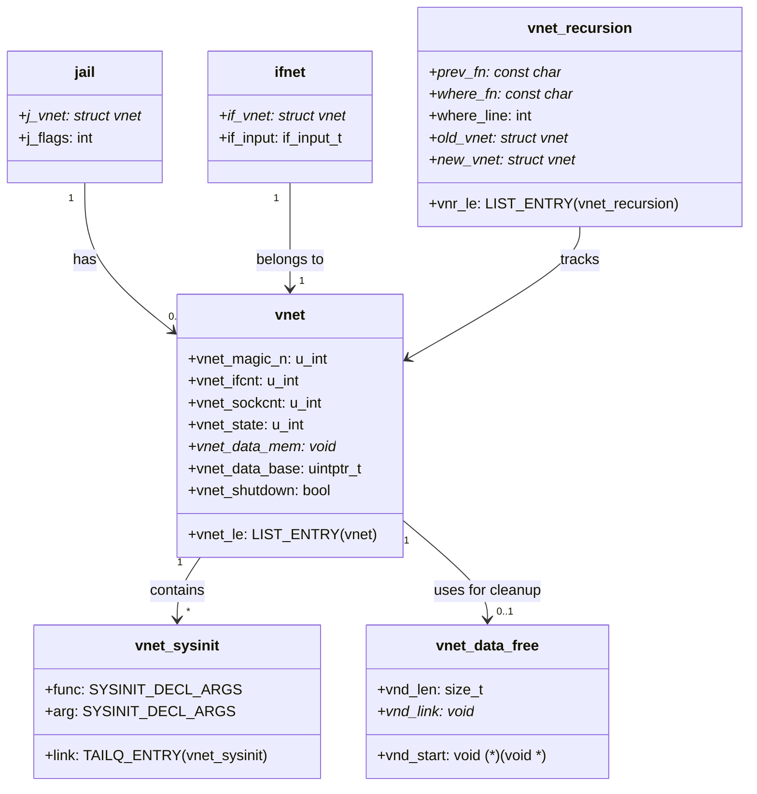

# VNET — Virtual Network Stacks
<!-- This file is auto-generated by generate-doc.py -- do not edit manually -->

---
**Navigation:**
  **Up:** [Network Stack — Architecture and Packet Flow](README.md) ▸ [Kernel Core — Structure and Entry Point](../README.md) ▸ [Source Tree — Layout and Conventions](../../README_internals.md)
  **Related:** [Network Stack — Architecture and Packet Flow](README.md) | [pf — OpenBSD-derived Packet Filter](../netpfil/pf/README.md) | [Jails — OS-level Isolation](../kern/README_jail.md)
  **All chapters:** [Source Tree — Layout and Conventions](../../README_internals.md) | [Boot Process — UEFI Bootloader to Kernel Handoff](../../stand/efi/loader/README.md) | [Kernel Core — Structure and Entry Point](../README.md) | [Build System — buildworld and buildkernel](../../share/mk/README.md) | [Virtual Memory Subsystem — vm_page, UMA, and Pagers](../vm/README.md) | [Process Management — Scheduling and Lifecycle](../kern/README_process.md) | [Locking Primitives — Mutexes, sx, rmlocks, and Atomics](../kern/README_locking.md) | [Buffer Cache — Block I/O Subsystem](../vm/README_bcache.md) ...
---


> ⚠ **UNVERIFIED DRAFT** — revisions regressed; kept revision 2 (8/9 criteria) over revision 3 (7/9); reviewer did not explicitly approve this draft. Treat claims as suspect until manually reviewed.


## Quick Summary

FreeBSD VNET (Virtual Network Stack) provides per-jail network-stack virtualization, turning nearly every global data structure in the network stack into a per-vnet instance. When a jail is created with the VNET flag, it receives its own independent network world — complete with separate interface lists, routing tables, TCP/UDP PCB hashes, netfilter rule sets, and `net.*` sysctl values. This means a process inside a vnet jail can configure IP addresses, modify routing tables, or attach BPF listeners without affecting the host or other jails.

At its core, VNET is a memory virtualization layer. Rather than requiring every network subsystem to be rewritten with explicit context parameters, VNET uses a linker-set mechanism to collect virtualized global variables into contiguous memory regions. When a thread enters a vnet jail, the kernel switches the current vnet context, and subsequent accesses to virtualized globals transparently refer to the jail's private data. The `CURVNET_SET()` macro, often used as `CURVNET_SET(j->j_vnet)`, temporarily redirects the current thread's vnet pointer, while `CURVNET_RESTORE()` restores the previous context.

The vnet machinery also virtualizes the `sysinit` framework for network subsystems. When a new vnet is created, all network subsystems registered with `VNET_SYSINIT` have their constructor functions invoked for that vnet's context. Similarly, when a vnet is destroyed, `VNET_SYSUNINIT` destructors run in reverse order. This ensures that every subsystem's per-vnet state is properly initialized and torn down, even though the subsystem code itself may not be aware it is running in a virtualized context.

VNET is distinct from the process-level isolation described in Chapter 12 (jail process isolation). While jail process isolation provides credentials, resource limits, and filesystem chroot, VNET provides network isolation. Together they form a complete security boundary for untrusted workloads. VNET was introduced in FreeBSD 8.0 under the feature flag `VIMAGE` and has since become the foundation for FreeBSD's container support, including jails, VNET-enabled virtual machines, and the `netmap` framework.

## Architecture

### The `struct vnet` and the Linker-Set Allocator

The heart of VNET is `struct vnet` (defined in `sys/net/vnet.h`), which is primarily a pointer to a block of memory containing all virtualized global variables:

```c
struct vnet {
    LIST_ENTRY(vnet)     vnet_le;
    u_int                vnet_magic_n;
    u_int                vnet_ifcnt;
    u_int                vnet_sockcnt;
    u_int                vnet_state;
    void                 *vnet_data_mem;
    uintptr_t            vnet_data_base;
    bool                 vnet_shutdown;
} __aligned(CACHE_LINE_SIZE);
```

The `vnet_data_mem` field points to the allocated memory region, and `vnet_data_base` is the base address used as an offset into that region. Virtualized global variables are placed in the `set_vnet` linker set by `VNET_DEFINE()`. At vnet creation time, the allocator iterates the linker set, calculates the size of each variable, and lays out the variables contiguously within the new vnet's data block. The `vnet_data_base` is set to the start of this block so that `VNET(name)` resolves to the correct per-vnet instance.

The linker-set mechanism works as follows. When a developer writes `VNET_DEFINE(int, foo)` in a source file, the preprocessor expands this into a symbol placed in the `set_vnet` linker set. The actual symbol name is `vnet_entry_<symbol>`. During boot, `vnet0` (the host's default vnet) is initialized by scanning this set and laying out variables contiguously. When a new vnet is allocated (e.g., when a jail is created), the kernel allocates a new `vnet_data_mem` block of the same size and sets `vnet_data_base` to point into it. Subsequent calls to `VNET(foo)` then access the offset-calculated address within the new vnet's memory.

```c
#define VNET_SETNAME       "set_vnet"
#define VNET_SYMPREFIX     "vnet_entry_"
```

These macros, defined in `sys/net/vnet.h`, are used by the allocator and by `libkvm` for userspace inspection.

### VNET_DEFINE, VNET_DECLARE, and VNET(name)

The three core macros form the virtualization layer:

```c
#define VNET_DEFINE(t, n)    t n __linker_set(set_vnet, vnet_entry_##n)
#define VNET_DECLARE(t, n)   extern t n
```

`VNET_DEFINE(t, n)` declares a variable `n` of type `t` in the current translation unit and places it in the `set_vnet` linker set. `VNET_DECLARE(t, n)` provides an `extern` declaration for use in other files. `VNET(name)` is the access macro — it computes the address of `n` within the current vnet's data block by adding the variable's offset to `vnet_data_base`.

In practice, developers typically write:

```c
VNET_DEFINE_STATIC(int, nosameprefix);
#define V_nosameprefix     VNET(nosameprefix)
```

This pattern, seen in `sys/netinet/in.c`, defines the variable and creates a local macro `V_nosameprefix` for convenience. The `SYSCTL_*` macros then use `&VNET_NAME(nosameprefix)` to register vnet-specific sysctls with `CTLFLAG_VNET`, which tells the sysctl framework to route the OID to the current vnet's data.

### CURVNET_SET / CURVNET_RESTORE Context Switching

When a packet enters a vnet jail, or a socket operation occurs within a jail's context, the kernel must switch the current vnet pointer so that all subsequent `VNET(name)` accesses refer to the jail's data. This is done via the `CURVNET_SET()` and `CURVNET_RESTORE()` macros, defined in `sys/net/vnet.h`:

```c
#define CURVNET_SET(vn)      do { curvnet = (vn); } while (0)
#define CURVNET_RESTORE()    do { /* restores curvnet */ } while (0)
```

`CURVNET_SET()` updates the thread-local `curvnet` pointer to the target vnet. The vnet reference count is managed internally by the VNET subsystem to prevent the vnet from being destroyed while code is using it. `CURVNET_RESTORE()` restores the previous vnet pointer.

The recursion tracking structure `struct vnet_recursion` (defined in `sys/net/vnet.c`) monitors nested `CURVNET_SET` calls to prevent infinite loops and detect errors:

```c
struct vnet_recursion {
    LIST_ENTRY(vnet_recursion) vnr_le;
    const char                 *prev_fn;
    const char                 *where_fn;
    int                         where_line;
    struct vnet                *old_vnet;
    struct vnet                *new_vnet;
};
```

This structure is pushed onto a per-thread stack whenever `CURVNET_SET` is called, allowing `CURVNET_RESTORE()` to verify that the current vnet matches the expected value before restoring.

### VNET_SYSINIT and VNET_SYSUNINIT

Network subsystems register initialization and cleanup functions for each vnet using `VNET_SYSINIT` and `VNET_SYSUNINIT`. These macros expand to entries in the `set_vnet_sysinit` linker set. When a new vnet is allocated, the kernel iterates this set and calls each registered constructor with the new vnet as context. Similarly, during vnet teardown, destructors run in reverse order.

```c
struct vnet_sysinit {
    SYSINIT_DECL_ARGS;
    TAILQ_ENTRY(vnet_sysinit) link;
};
```

This mechanism ensures that every network subsystem's per-vnet state is properly initialized and torn down. For example, when a new vnet is created, the TCP stack's `VNET_SYSINIT` constructor allocates its PCB hash table, the routing subsystem sets up its per-vnet FIB, and the bridge subsystem initializes its span tree.

### VNET and Jails

A jail receives its own vnet when created with the `vnet` flag in `jail(8)` or `jail(2)`. The vnet is allocated during jail creation and is freed when the jail is destroyed. Not all jails get vnets — legacy jails without the VNET flag share the host's network stack, meaning they see the same interfaces, routing tables, and sockets as the host. This is useful for jails that only need network access but not network isolation.

The relationship between a jail and its vnet is tracked in `struct jail`. When a jail is created with `vnet=on`, the kernel allocates a new vnet, initializes it by running all `VNET_SYSINIT` constructors, and stores a pointer to the vnet in `j->j_vnet`. Subsequent socket operations by processes in the jail use `CURVNET_SET(j->j_vnet)` to switch into the jail's network context.

## Key Data Structures

### `struct vnet` (sys/net/vnet.h)

```c
struct vnet {
    LIST_ENTRY(vnet)     vnet_le;     /* all vnets list */
    u_int                vnet_magic_n; /* 0x5e4a6f28, validates vnet pointer */
    u_int                vnet_ifcnt;   /* interface count in this vnet */
    u_int                vnet_sockcnt; /* socket count in this vnet */
    u_int                vnet_state;   /* SI_SUB_* state */
    void                 *vnet_data_mem; /* allocated memory for vnet globals */
    uintptr_t            vnet_data_base; /* base address for VNET(name) resolution */
    bool                 vnet_shutdown; /* shutdown in progress flag */
} __aligned(CACHE_LINE_SIZE);
```

The `vnet_magic_n` field (always `0x5e4a6f28`) is used to validate vnet pointers and detect use-after-free bugs. The `vnet_ifcnt` and `vnet_sockcnt` fields track the number of interfaces and sockets in this vnet, used during teardown to verify that all resources have been released before freeing the vnet.

### `struct vnet_recursion` (sys/net/vnet.c)

```c
struct vnet_recursion {
    LIST_ENTRY(vnet_recursion) vnr_le;
    const char                 *prev_fn;
    const char                 *where_fn;
    int                         where_line;
    struct vnet                *old_vnet;
    struct vnet                *new_vnet;
};
```

This structure is pushed onto a per-thread stack during `CURVNET_SET` calls. It enables `CURVNET_RESTORE()` to verify the nesting is correct and to detect mismatches between the expected and actual current vnet.

### `struct vnet_data_free` (sys/net/vnet.c)

```c
struct vnet_data_free {
    void (*vnd_start)(void *arg);
    size_t                        vnd_len;
    void                         *vnd_link;
};
```

This structure provides a callback mechanism for freeing vnet-specific data during destruction. The `vnd_start` function is called with `vnd_link` as its argument to perform vnet-specific cleanup.

### `struct vnet_sysinit` (sys/net/vnet.h)

```c
struct vnet_sysinit {
    SYSINIT_DECL_ARGS;
    TAILQ_ENTRY(vnet_sysinit) link;
};
```

Each entry represents a network subsystem's initialization or cleanup function registered via `VNET_SYSINIT` / `VNET_SYSUNINIT`. The `SYSINIT_DECL_ARGS` macro expands to the function pointer, argument pointer, subsystem ID, and order — the same fields used by the global `sysinit` framework.

## Deep Dive

### VNET Allocation

When a jail is created with `vnet=on`, the kernel allocates a new vnet structure. This involves allocating a `struct vnet` block, calculating the total size of all virtualized globals by scanning the `set_vnet` linker set, and allocating a contiguous memory block of that size. The allocator initializes `vnet_magic_n`, `vnet_ifcnt`, and `vnet_sockcnt`, then iterates the `set_vnet_sysinit` linker set to call each registered constructor function with the new vnet as context. Finally, it acquires both `vnet_sxlock` and `vnet_rwlock` via the `VNET_LIST_WLOCK()` macro and inserts the new vnet into `vnet_head` using `LIST_INSERT_HEAD(&vnet_head, vn, vnet_le)`.

```c
VNET_LIST_WLOCK();
LIST_INSERT_HEAD(&vnet_head, vn, vnet_le);
VNET_LIST_WUNLOCK();
```

The dual-lock mechanism (sx lock for sleepable readers, rw lock for non-sleepable readers) allows the vnet list to be walked safely from various contexts, including interrupt handlers and soft interrupt threads.

### VNET Destruction

When a jail is destroyed, the kernel tears down the vnet. This is a complex operation because mbufs, timers, and socket connections may still reference the vnet's data. The destruction protocol follows these steps:

1. **Shutdown flag**: It sets `vnet->vnet_shutdown = true` to signal that the vnet is being destroyed. This flag is checked by various subsystems to prevent new allocations or connections.
2. **Sysuninit execution**: It iterates the `set_vnet_sysinit` linker set in reverse order and calls each registered destructor function. This tears down all network subsystems in the reverse order of their initialization.
3. **Resource verification**: It checks that `vnet_ifcnt == 0` (all interfaces detached) and `vnet_sockcnt == 0` (all sockets closed). If not, it logs an error and defers the destruction.
4. **Deferred teardown**: If resources are still referenced, the vnet is not immediately freed. Instead, it is placed on a deferred destruction queue and will be reclaimed when the last reference is released. This is necessary because mbufs, socket buffers, and BPF descriptors may still hold references to the vnet's data.
5. **Memory freeing**: Once all resources are released, the vnet's data block is freed, the `struct vnet` is deallocated, and it is removed from `vnet_head`.

### Packet Path and VNET Context Switching

When a packet enters a vnet jail, the kernel must switch to the jail's vnet context before processing. This occurs at several points in the packet path:

1. **Interface input**: When `ifp->if_input()` is called on an interface attached to a vnet, the netisr subsystem dispatches the packet with `CURVNET_SET(ifp->if_vnet)` before invoking the protocol handler.
2. **Socket operations**: When a process in a vnet jail performs a socket operation (e.g., `soconnect()`, `socreate()`), the kernel switches to the jail's vnet context via `CURVNET_SET(j->j_vnet)` before accessing PCBs, routing tables, or interface lists.
3. **Routing lookups**: The routing subsystem uses `CURVNET_SET()` to switch to the appropriate vnet before performing FIB lookups, ensuring that the jail sees only its own routing table.

The context switching is designed to be lightweight. `CURVNET_SET()` performs a single store to the thread-local `curvnet` variable and an atomic reference count increment. `CURVNET_RESTORE()` performs the reverse: decrement the reference count and restore the previous value. No locks are held during the switch, and the operation is safe from interrupt handlers because the reference count prevents the vnet from being destroyed while code is using it.

### Sysctl Virtualization

VNET virtualizes `net.*` sysctls by registering them with `CTLFLAG_VNET`. When a sysctl OID is registered with this flag, the sysctl framework stores a pointer to the variable in the `set_vnet` linker set. When the sysctl is accessed, the framework uses `VNET(name)` to resolve the variable to the current vnet's data.

For example, in `sys/netinet/in.c`:

```c
VNET_DEFINE_STATIC(int, nosameprefix);
#define V_nosameprefix     VNET(nosameprefix)
SYSCTL_INT(_net_inet_ip, OID_AUTO, no_same_prefix, CTLFLAG_VNET | CTLFLAG_RW,
    &VNET_NAME(nosameprefix), 0,
    "Refuse to create same prefixes on different interfaces");
```

The `CTLFLAG_VNET` flag tells the sysctl framework to route this OID to the current vnet. When a process in a vnet jail reads or writes this sysctl, it accesses the jail's copy of `nosameprefix`, not the host's.

## Flow / Diagram



## Advanced Notes

### Debugging with DTrace

VNET provides SDT probes for debugging vnet lifecycle events. The `sys/net/vnet.c` file includes `<sys/sdt.h>` and defines probes for tracking vnet creation, destruction, and context switches. These probes can be used to track vnet creation and destruction patterns, identify reference count leaks, and diagnose vnet-related panics.

### Performance Implications

VNET adds overhead to every network operation that crosses a vnet boundary:

1. **Context switching**: `CURVNET_SET()` and `CURVNET_RESTORE()` add a few instructions per call. In high-throughput scenarios, this can add measurable latency.
2. **Memory usage**: Each vnet allocates a contiguous block of memory for all virtualized globals. The size of this block is determined at link time by summing the sizes of all `VNET_DEFINE()` variables. For a typical kernel, this is approximately 100-200 KB per vnet.
3. **Sysctl overhead**: VNET sysctls require an additional pointer indirection through `VNET(name)`, which adds a small amount of overhead to sysctl access.
4. **Cache effects**: Virtualized globals are spread across multiple memory regions (one per vnet), which can reduce cache locality compared to a single global instance.

Despite these costs, VNET is essential for security-sensitive workloads where network isolation is required. The overhead is acceptable because it only affects operations that cross vnet boundaries, and most intra-vnet operations (e.g., TCP retransmissions within a jail) do not incur context-switching overhead.

### Common Pitfalls

1. **Forgetting CURVNET_RESTORE**: If code calls `CURVNET_SET()` without a matching `CURVNET_RESTORE()`, the vnet reference count will leak, preventing vnet destruction. This can cause teardown to defer indefinitely.
2. **Nested CURVNET_SET**: `CURVNET_SET()` can be nested, but each nested call must have a matching `CURVNET_RESTORE()`. Mismatched nesting will cause `CURVNET_RESTORE()` to detect a mismatch and panic.
3. **Accessing VNET globals without CURVNET_SET**: If code accesses `VNET(name)` without first calling `CURVNET_SET()`, it will access the wrong vnet's data. This is a common source of bugs when writing device drivers or network subsystems.
4. **VNET shutdown races**: During vnet destruction, the `vnet_shutdown` flag is set, but mbufs and timers may still reference the vnet. Code must check this flag and refuse to allocate new resources during shutdown.

### Connection to OS Theory

VNET is an example of the "resource virtualization" pattern discussed in operating systems textbooks. Rather than creating separate kernel instances for each network stack (which would be prohibitively expensive), VNET uses pointer indirection to multiplex a single codebase across multiple data instances. This is analogous to how the virtual memory subsystem uses page tables to multiplex physical memory across processes, or how the process scheduler uses `struct proc` to multiplex CPU time across threads.

The linker-set mechanism is a form of compile-time registration that avoids the need for explicit initialization code in each subsystem. This is similar to how ELF dynamic linking uses `.init_array` and `.fini_array` sections to register constructors and destructors, or how the `sysinit` framework uses linker sets to register kernel initialization functions.

## Comparison

### Linux Network Namespaces

Linux implements network-stack virtualization through network namespaces, introduced in Linux 2.6.29. Like FreeBSD VNET, network namespaces provide per-namespace interface lists, routing tables, and socket PCBs. However, the implementation differs significantly:

- **Linux** uses a `struct net` that is embedded in many kernel data structures (e.g., `sock->sk_net`, `dst_entry->dst_net`). This means every socket, route cache entry, and device holds a pointer to its namespace. Linux uses RCU (Read-Copy-Update) to safely access these pointers from interrupt context.
- **FreeBSD VNET** uses a global `curvnet` pointer that is switched at the thread level. All `VNET(name)` accesses resolve through this pointer, which means the vnet context is implicit in the current thread rather than explicit in every data structure. This approach is simpler but requires explicit `CURVNET_SET()` calls at vnet boundaries.
- **Memory layout**: Linux stores per-namespace data in `struct net` allocations that are scattered throughout the kernel. FreeBSD VNET stores all virtualized globals in a contiguous block allocated per vnet, which improves locality but requires a fixed-size allocation determined at link time.

### macOS/XNU Network Stack

macOS/XNU does not provide per-jail network-stack virtualization. Instead, it relies on process-level isolation (credentials, file descriptors) and the `bpf` framework for packet capture isolation. This means that a compromised jail or container on macOS can potentially affect the host's network stack by modifying routing tables or attaching to interfaces. XNU does provide network namespace-like features through the `socketfilterfw` and `pf` frameworks, but these are not equivalent to FreeBSD VNET.

### NetBSD Network Stack

NetBSD introduced network stack virtualization in NetBSD 7.0 through the network stack virtualization (NSV) framework. Like FreeBSD VNET, NSV uses a per-vnet data model with virtualized globals. However, NetBSD's approach is more conservative, virtualizing only a subset of the network stack (primarily routing and interface management) rather than the full stack including TCP/UDP PCBs. This makes NetBSD's implementation lighter but less isolated.

### OpenBSD Network Stack

OpenBSD does not provide per-jail network-stack virtualization. Instead, it relies on the `pf` packet filter for network isolation and `jail` for process isolation. OpenBSD's design philosophy favors simplicity and security through minimal code paths rather than complex virtualization layers. This means that OpenBSD jails share the host's network stack but are protected by `pf` rules and credential-based access controls.

## See Also
- [Network Stack — Architecture and Packet Flow](README.md)
- [Jails — OS-level Isolation](../kern/README_jail.md)
- [pf — OpenBSD-derived Packet Filter](../netpfil/pf/README.md)


- Related source directories: `sys/net/vnet.c`, `sys/net/vnet.h`, `sys/net/if.c`, `sys/netinet/in.c`, `sys/net/if_bridge.c`

---

> _Generated by [DaemonDocs](https://github.com/ocochard/DaemonDocs) on 2026-04-30 19:40 UTC using model `Qwen3.6-35B-A3B-UD-Q4_K_XL` (llama.cpp build `b8985-27aef3dd9`). AI-generated content — verify against source before relying on it._
