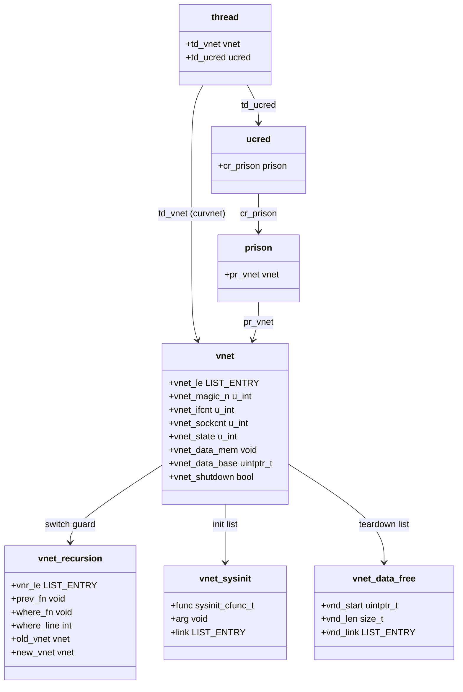

# VNET — Virtual Network Stacks
<!-- This file is auto-generated by generate-doc.py -- do not edit manually -->

---
**Navigation:**
  **Up:** [Network Stack — Architecture and Packet Flow](README.md) ▸ [Kernel Core — Structure and Entry Point](../README.md) ▸ [Source Tree — Layout and Conventions](../../README_internals.md)
  **Related:** [Network Stack — Architecture and Packet Flow](README.md) | [pf — OpenBSD-derived Packet Filter](../netpfil/pf/README.md) | [Jails — OS-level Isolation](../kern/README_jail.md)
  **All chapters:** [Source Tree — Layout and Conventions](../../README_internals.md) | [Boot Process — UEFI Bootloader to Kernel Handoff](../../stand/efi/loader/README.md) | [Kernel Core — Structure and Entry Point](../README.md) | [Build System — buildworld and buildkernel](../../share/mk/README.md) | [System Calls and Image Activation — Entry, sysent, and exec](../kern/README_syscall.md) | [Kernel Modules and the Linker — KLD, SYSINIT, and linker sets](../kern/README_kld.md) | [Virtual Memory Subsystem — vm_page, UMA, and Pagers](../vm/README.md) | [Process Management — Scheduling and Lifecycle](../kern/README_process.md) ...
---


## Quick Summary

VNET is FreeBSD's mechanism for running many independent network stacks inside one kernel. A single kernel image contains one copy of the code for `ip_input()`, the routing tables, the TCP and UDP protocol-control-block (PCB) hash tables, the `ifnet` list, and the `net.*` sysctls. Without VNET those are all one global set, so every process on the machine shares one network world. VNET turns nearly every one of those globals into a per-instance copy: each virtual network stack (a *vnet*) gets its own `ifnet` list, its own routing tables, its own firewall rules, its own socket namespace, and its own `net.*` sysctl values. A process confined to a vnet jail sees a completely separate network — different interfaces, different routes, different socket addresses — while the kernel code that services it is the same shared code.

The central trick is that the code is written once, against a name like `V_link_pfil_head`, but that name is a macro that resolves to "the copy of `link_pfil_head` belonging to the vnet the current thread is servicing." The current vnet is a per-[thread](../kern/README_process.md#glossary) pointer, `curthread->td_vnet` (where `curthread` is a macro that expands to the `struct thread *` of the currently running thread), so resolving `VNET(x)` on the packet path costs a single pointer load with no lock. When a thread must temporarily operate in a different vnet — for example, when a frame is bridged into a jail, or when the host tears a vnet down — it swaps that pointer with `CURVNET_SET()` and puts it back with `CURVNET_RESTORE()`, again with no locking on the fast path.

The relationship to jails is asymmetric. A jail is a process-isolation container (chapter 12); VNET is the network half. A jail only gets its own vnet when it is created with the vnet flag; otherwise its `pr_vnet` is `NULL` and the stack treats it as the host's default vnet, `vnet0`. So a plain jail shares the host's interfaces and routes, while a vnet jail gets a private, fully independent network stack. When the jail is destroyed, its vnet is torn down with a deferred protocol that waits for in-flight mbufs and pending timers to drain before the per-vnet memory is freed.

The cost model is worth understanding up front. Each vnet allocates a block of memory (`vnet_data_mem`) sized to hold one copy of every virtualized global, so the memory footprint grows linearly with the number of vnets. The per-vnet `net.*` sysctls are also instantiated per vnet, which is the source of the sysctl overhead. The payoff is that a host can run many isolated network domains — one per container or per VM guest — without compiling a separate kernel or duplicating the entire network code path.

## Architecture

The implementation lives in `sys/net/vnet.c` (the allocator, list management, and teardown) and `sys/net/vnet.h` (the `struct vnet` definition and the `VNET_DEFINE` / `VNET` / `CURVNET_SET` macro family). The whole subsystem is compiled in with `options VIMAGE` (Virtual IMAGE — the kernel option that enables per-vnet virtualization of network and other subsystems globals); when VIMAGE is not built, the macros collapse to plain globals and the code degrades to a single network stack, which is why the same source tree builds both a monolithic and a virtualized kernel.

**The [linker set](../kern/README_kld.md#glossary) is the layout mechanism.** Every global that should be per-vnet is declared with `VNET_DEFINE(type, name)`. The `vnet.c` header comment states the contract directly:

```c
/*
 * The virtual network stack allocator provides storage for virtualized
 * global variables.  These variables are defined/declared using the
 * VNET_DEFINE()/VNET_DECLARE() macros, which place them in the 'set_vnet'
 * linker set.
 */
```

`VNET_DEFINE` does two things at link time: it defines the variable, and it emits an entry into the `set_vnet` [linker set](../README.md#glossary) (the set name is `VNET_SETNAME`, `"set_vnet"`, and each entry is prefixed with `VNET_SYMPREFIX`, `"vnet_entry_"`). The linker collects all of those entries into a contiguous table. When a vnet is created, the allocator carves out a per-vnet block the same size as that table; `VNET_VNET(curvnet, name)` then indexes into the block for `curvnet` at the offset of `name`. This is why the code can be written once against a stable name while the data is per-vnet: the name is stable, the storage is computed from `curvnet` plus a fixed offset. A concrete instance, quoted from `sys/net/if_var.h`, is the pfil [hook](../netgraph/README.md#glossary) list that firewalls and BPF (Berkeley Packet Filter, the kernel tap for userland packet sniffers) observe:

```c
VNET_DECLARE(struct pfil_head *, link_pfil_head);
#define	V_link_pfil_head	VNET(link_pfil_head)
```

**The current vnet is per-thread.** The `curvnet` macro is the heart of the fast path:

```c
#define curvnet curthread->td_vnet
```

and the accessor macro is:

```c
#define VNET(n)			VNET_VNET(curvnet, n)
```

So `V_link_pfil_head` in the stack is, after preprocessing, an indexed read of the `curvnet` thread's copy of `link_pfil_head`. No lock, no global indirection — just a load of `curthread->td_vnet` and an offset. The vnet a thread is servicing is established from its credentials: `CRED_TO_VNET(cr)` expands to `(cr)->cr_prison->pr_vnet`, and `TD_TO_VNET(td)` / `P_TO_VNET(p)` both funnel through the thread's or process's `ucred`. A process inside a vnet jail therefore carries the correct `td_vnet` by virtue of its `ucred` pointing at a `prison` whose `pr_vnet` is that jail's vnet.

**Crossing a vnet boundary is a pointer swap.** When a thread must operate in a vnet other than its own — the canonical case is a frame arriving on a host interface and being bridged into a jail's vnet, or the host servicing a vnet during teardown — it uses the explicit switch:

```c
#define CURVNET_SET(arg)	CURVNET_SET_VERBOSE(arg)
```

`CURVNET_SET(v)` saves the current `td_vnet`, installs `v`, and records the switch on a per-thread recursion guard; `CURVNET_RESTORE()` puts the old pointer back. Because it only touches the per-thread pointer, the switch itself is lock-free. The recursion guard exists to catch a thread that tries to nest a second `CURVNET_SET` without restoring the first, which would silently corrupt which vnet the code is actually operating on.

**The vnet list and its two locks.** All live vnets are chained in a `LIST` rooted at the global `vnet_head`. The list is guarded by two locks, one sleepable and one not, so it can be walked from both process and interrupt contexts:

```c
struct rwlock		vnet_rwlock;
struct sx		vnet_sxlock;
```

Both must be held exclusively to modify the list, but a read lock of either is sufficient to walk it. `VNET_FOREACH(v)` is just `LIST_FOREACH(v, &vnet_head, vnet_le)`, and the read side is `VNET_LIST_RLOCK()` (which takes `sx_slock(&vnet_sxlock)`).

**Startup and teardown are per-vnet sysinits.** Network subsystems register their initialization and cleanup with `VNET_SYSINIT()` / `VNET_SYSUNINIT()` instead of plain `SYSINIT`. Each registration is a `struct vnet_sysinit` (fields `func`, `arg`, `link`) collected into a per-vnet list. When `vnet_alloc()` creates a vnet, it runs that vnet's `VNET_SYSINIT` list in subsystem order; when `vnet_destroy()` tears it down, it runs the `VNET_SYSUNINIT` list in reverse. This is what lets, say, the ARP, routing, and TCP subsystems each build and then dismantle their per-vnet [state](../netpfil/pf/README.md#glossary) in the correct dependency order, once per vnet rather than once per boot.

## Key Data Structures

The [anchor](../netpfil/pf/README.md#glossary) of the whole subsystem is `struct vnet`, quoted verbatim from `sys/net/vnet.h`:

```c
struct vnet {
	LIST_ENTRY(vnet)	 vnet_le;	/* all vnets list */
	u_int			 vnet_magic_n;
	u_int			 vnet_ifcnt;
	u_int			 vnet_sockcnt;
	u_int			 vnet_state;	/* SI_SUB_* */
	void			*vnet_data_mem;
	uintptr_t		 vnet_data_base;
	bool			 vnet_shutdown;	/* Shutdown in progress. */
} __aligned(CACHE_LINE_SIZE);
#define	VNET_MAGIC_N	0x5e4a6f28
```

- `vnet_le` links the vnet into the global `vnet_head` list.
- `vnet_magic_n` is a canary set to `VNET_MAGIC_N`; it lets debug and [KDB](../kern/README_kdb.md#glossary) code detect a corrupted or already-freed vnet.
- `vnet_ifcnt` and `vnet_sockcnt` are the reference counts that drive deferred teardown: interfaces attached to this vnet, and sockets owned by this vnet. `vnet_destroy()` will not free the vnet until both reach zero.
- `vnet_state` records how far startup has progressed, tagged with the `SI_SUB_*` subsystem levels, so teardown knows which `VNET_SYSUNINIT` handlers still need to run.
- `vnet_data_mem` is the per-vnet block of virtualized-global storage (the memory carved out to match the `set_vnet` linker table), and `vnet_data_base` is its base address used by `VNET_VNET()` to compute per-vnet addresses.
- `vnet_shutdown` marks that teardown has begun, so new references can be rejected while in-flight ones drain.
- The whole struct is `__aligned(CACHE_LINE_SIZE)` so that the hot per-vnet fields do not share a cache line with unrelated data and bounce between CPUs.

The recursion guard that makes `CURVNET_SET` safe is `struct vnet_recursion` (in `sys/net/vnet.c`):

```c
struct vnet_recursion {
	/* fields: vnr_le, prev_fn, where_fn, where_line, old_vnet, new_vnet */
};
```

It records the function that performed the switch (`prev_fn`, `where_fn`, `where_line`) and the two vnets involved (`old_vnet`, `new_vnet`). If a thread attempts a nested switch while a switch is already active, the guard fires and the kernel panics, turning a hard-to-diagnose "wrong vnet" bug into an immediate, locatable crash.

Per-vnet startup/teardown registrations are `struct vnet_sysinit` (in `sys/net/vnet.h`):

```c
struct vnet_sysinit {
	/* fields: func, arg, link */
};
```

`func` is the `sysinit_cfunc_t` handler, `arg` its opaque argument, and `link` chains the entry into the vnet's init list.

Teardown bookkeeping uses `struct vnet_data_free` (in `sys/net/vnet.c`):

```c
struct vnet_data_free {
	/* fields: vnd_start, vnd_len, vnd_link */
};
```

It records a memory region (`vnd_start`, `vnd_len`) to be released as part of freeing the vnet, chained by `vnd_link`.

The globals that tie it together, quoted from `sys/net/vnet.c`:

```c
static MALLOC_DEFINE(M_VNET, "vnet", "network stack control block");

LIST_HEAD(vnet_list, vnet) vnet_head;
struct vnet *vnet0;

FEATURE(vimage, "VIMAGE kernel virtualization");
```

`vnet0` is the host's default vnet — the one that exists before any jail is created. `IS_DEFAULT_VNET(v)` is just `((v) == vnet0)`, and a `NULL` vnet (a non-vnet jail) is treated as `vnet0` by the stack.

Per-vnet performance counters use a dedicated macro family in `sys/net/vnet.h` that lays out a `counter_u64_t` array sized to the counter struct, so each vnet has its own per-CPU counters:

```c
#define	VNET_PCPUSTAT_DEFINE(type, name)	\
    VNET_DEFINE(counter_u64_t, name[sizeof(type) / sizeof(uint64_t)])
#define	VNET_PCPUSTAT_ALLOC(name, wait)	\
    COUNTER_ARRAY_ALLOC(VNET(name), \
	sizeof(VNET(name)) / sizeof(counter_u64_t), (wait))
```

## Deep Dive

**Creating a vnet.** `vnet_alloc(void)` (declared in [`VNET(9)`](../../share/man/man9/VNET.9), defined in `sys/net/vnet.c`) is called when a jail with the vnet flag is created. It allocates the `struct vnet`, sets `vnet_magic_n` to `VNET_MAGIC_N`, zero-initializes `vnet_ifcnt` and `vnet_sockcnt`, and allocates `vnet_data_mem` — a block sized to the `set_vnet` linker table so that every `VNET_DEFINE`d global has a slot in this vnet. It then walks the vnet's `VNET_SYSINIT` list in subsystem order, calling each handler so that the ARP, routing, TCP, UDP, and firewall subsystems each build their per-vnet state. The new vnet is inserted into `vnet_head` under the list write lock. The first vnet ever created becomes `vnet0`.

**Resolving a virtualized global.** Consider the [pfil hook](../netinet/README_ip.md#glossary) list used by `ether_input()` to run firewalls and BPF. After preprocessing, `V_link_pfil_head` becomes `VNET_VNET(curthread->td_vnet, link_pfil_head)`. `VNET_VNET()` adds the global's fixed offset (computed at link time from the `set_vnet` table) to `curvnet->vnet_data_base`, yielding the address of this vnet's copy. The entire resolution is two loads and an add — there is no lock and no hash lookup. This is the design win: the per-vnet indirection is folded into a base-pointer-plus-offset, so the packet path pays almost nothing.

**Switching context at the boundary.** When a frame arrives on a host interface that is bridged into a jail's vnet, the servicing thread is currently in the host vnet. To run the jail's input path against the jail's routing tables and PCB hashes, it does:

```c
CURVNET_SET(jail_vnet);
/* ... run the packet through jail_vnet's stack ... */
CURVNET_RESTORE();
```

`CURVNET_SET` expands to `CURVNET_SET_VERBOSE`, which saves the current `td_vnet` into the per-thread `struct vnet_recursion`, installs `jail_vnet` as `td_vnet`, and records the call site. `CURVNET_RESTORE()` reverses it. Because the switch only rewrites the per-thread pointer, it is lock-free; the recursion guard is what makes it safe to reason about. A thread that calls `CURVNET_SET` twice without an intervening `CURVNET_RESTORE` trips the guard and panics, because the second save would overwrite the first and the restore would put back the wrong vnet.

**Tearing down a vnet.** `vnet_destroy(struct vnet *)` implements a deferred teardown, because at the moment a jail is destroyed, mbufs may still be in flight through the vnet's queues and callouts (timers) may still be armed against its PCB tables. The protocol is:

1. Set `vnet_shutdown` so that new references to the vnet are rejected.
2. Run the vnet's `VNET_SYSUNINIT` list in reverse subsystem order. Each subsystem handler detaches its per-vnet state: interfaces are detached (decrementing `vnet_ifcnt`), sockets are closed (decrementing `vnet_sockcnt`), routing tables are flushed, and callouts are stopped.
3. Wait for `vnet_ifcnt` and `vnet_sockcnt` to both reach zero. This is the "deferred" part: the vnet is not freed while any interface or socket still references it, so an in-flight [mbuf](../sys/README_mbuf.md#glossary) that is still walking the vnet's PCB hash cannot dereference freed memory.
4. Free the per-vnet memory regions recorded in the `struct vnet_data_free` list, free `vnet_data_mem`, and remove the vnet from `vnet_head` under the list write lock.

The two reference counters are the load-bearing detail: they turn "is it safe to free this vnet?" into a simple, lockable check rather than a global scan for outstanding references.

**The jail-to-vnet mapping.** The connection from a process to its vnet is a single pointer chain, all verified in `sys/net/vnet.h`:

```c
#define CRED_TO_VNET(cr)	(cr)->cr_prison->pr_vnet
#define TD_TO_VNET(td)		CRED_TO_VNET((td)->td_ucred)
#define P_TO_VNET(p)		CRED_TO_VNET((p)->p_ucred)
```

A process's `ucred` points at its `prison` (the jail), and the `prison` carries `pr_vnet`. So the vnet a process is confined to is read straight off its credentials. A jail created without a vnet has `pr_vnet == NULL`, which the stack treats as `vnet0`; a vnet jail has `pr_vnet` pointing at its private `struct vnet`. This is why the same kernel code serves both: `CRED_TO_VNET` is the single point where "which network world is this process in?" is answered.

## Flow / Diagram



The left side (thread → ucred → [prison](../kern/README_cred.md#glossary) → vnet) is how a process's credentials resolve to the vnet it is confined to, via `P_TO_VNET`/`CRED_TO_VNET`. The `td_vnet` edge is the per-thread pointer that `curvnet` and `VNET()` read on the packet path. The three structs on the right are the vnet's internal machinery: the recursion guard for safe `CURVNET_SET`, the [sysinit](../kern/README_kld.md#glossary) list for per-vnet startup/teardown, and the data-free list for deferred memory release.

## Advanced Notes

**Debugging.** The `VNET_DEBUG` kernel option turns on extra assertions in the vnet allocator. The `VNET_ASSERT(exp, msg)` macro (documented in [`VNET(9)`](../../share/man/man9/VNET.9)) checks that the current vnet is in the expected state and panics with `msg` otherwise — use it when adding code that assumes a particular vnet. The `vnet_magic_n` canary (checked against `VNET_MAGIC_N`) is your first line of defense against a use-after-free of a `struct vnet`: if the magic is wrong, the vnet was already destroyed. In [DDB](../kern/README_kdb.md#glossary), the `db_vnet_print` and `db_show_vnet_print_vs` helpers (in `sys/net/vnet.c`) dump a vnet and its virtualized globals, which is invaluable when a panic mentions a vnet. To see the per-vnet `net.*` values, note that the sysctl tree is instantiated per vnet, so `sysctl net.inet.*` inside a vnet jail reads that jail's copy, not the host's.

**Performance and the cost model.** The per-vnet memory is `vnet_data_mem`, sized to the `set_vnet` table, so total network-stack memory scales linearly with the number of vnets. The fast-path cost of virtualization is a single load of `curthread->td_vnet` plus a base-pointer add inside `VNET_VNET()` — effectively free compared to the lock and hash work the packet path already does. The real overheads are elsewhere: (1) the per-vnet `net.*` sysctl instantiation, which multiplies the sysctl [node](../netgraph/README.md#glossary) count by the number of vnets and slows `sysctl` walks and `sysctl`-driven configuration; (2) the per-vnet per-CPU counter arrays (`VNET_PCPUSTAT_*`), which add a block of counters per vnet per CPU; and (3) the list locks (`vnet_sxlock` / `vnet_rwlock`) taken when vnets are created, destroyed, or enumerated. The `__aligned(CACHE_LINE_SIZE)` on `struct vnet` is a deliberate choice to keep the hot per-vnet fields from sharing a cache line with data another CPU is writing, which would otherwise cause false sharing on the counters.

**Race conditions and pitfalls.** The deferred teardown exists precisely because of a use-after-free hazard: an mbuf in flight, or a [callout](../netinet/README_transport.md#glossary) timer, can still be walking a vnet's PCB or routing table at the instant its jail is destroyed. The `vnet_ifcnt` / `vnet_sockcnt` counters are the guard — `vnet_destroy()` blocks until both are zero. A subsystem that adds a per-vnet reference but forgets to increment (and later decrement) the matching counter will cause the vnet to be freed while that reference is live. The recursion guard is the other classic trap: any code path that calls `CURVNET_SET` must be sure it can reach `CURVNET_RESTORE` on every exit (including error paths and panics); a forgotten restore, or a nested set, corrupts `td_vnet` for the rest of that thread's life and produces bizarre "wrong vnet" failures that are far harder to find than the guard's immediate panic.

**Connection to OS theory.** VNET is the network analogue of the general OS problem of making per-process or per-container state visible to shared kernel code without per-call locking. The textbook approach is an address-space switch (the [MMU](../README.md#glossary)) so that the same kernel code operates on different user memory; VNET applies the same idea to kernel data, using a per-thread base pointer (`curvnet`) plus a fixed offset instead of a page-table walk. The linker-set trick — collecting all virtualizable globals into one table at link time and carving out a per-instance copy — is the same "statically known layout, dynamically chosen base" pattern used by per-CPU data and by VIMAGE's sibling subsystems. The deferred teardown, gated on reference counts, is the standard "RCU-like" discipline of deferring a free until no reader can still hold a reference.

## See Also
- [Network Stack — Architecture and Packet Flow](README.md)
- [Jails — OS-level Isolation](../kern/README_jail.md)
- [pf — OpenBSD-derived Packet Filter](../netpfil/pf/README.md)


- [`sys/net/vnet.c`](vnet.c) and [`sys/net/vnet.h`](vnet.h) — the allocator, list, macros, and teardown.
- [`VNET(9)`](../../share/man/man9/VNET.9) — the kernel API man page for the VNET infrastructure.
- [`jail(8)`](../../usr.sbin/jail/jail.8) and the jail chapter (chapter 12) — process isolation; VNET is the network half.
- [`sys/net/if.c`](if.c) and [`sys/net/if_var.h`](if_var.h) — the `ifnet` list and pfil heads that VNET virtualizes.
- [`sys/netinet/tcp_input.c`](../netinet/tcp_input.c) and [`sys/netinet/udp_usrreq.c`](../netinet/udp_usrreq.c) — the TCP/UDP PCB hash tables that are per-vnet.
- [`sys/netpfil/pf/`](../netpfil/pf) — the pf packet filter, whose rule sets are per-vnet.
- [`share/man/man9/VNET.9`](../../share/man/man9/VNET.9) — the authoritative interface reference.

---

> _Generated by [DaemonDocs](https://github.com/ocochard/DaemonDocs) on 2026-08-27 12:15 UTC using model `Qwen3.8-27B-Q8_0` (llama.cpp build `b10553-cd26896c1`). AI-generated content — verify against source before relying on it._
