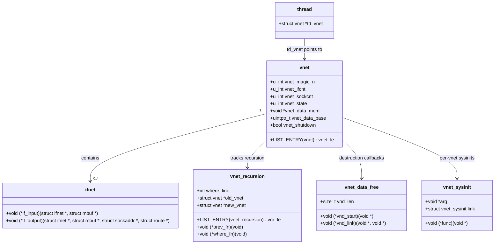

# VNET — Virtual Network Stacks
<!-- This file is auto-generated by generate-doc.py -- do not edit manually -->

---
**Navigation:**
  **Related:** [Network Stack — Architecture and Packet Flow](README.md) | [pf — OpenBSD-derived Packet Filter](../netpfil/pf/README.md) | [Jails — OS-level Isolation](../kern/README_jail.md)
  **All chapters:** [Source Tree — Layout and Conventions](../../README_internals.md) | [Boot Process — UEFI Bootloader to Kernel Handoff](../../stand/efi/loader/README.md) | [Kernel Core — Structure and Entry Point](../README.md) | [Build System — buildworld and buildkernel](../../share/mk/README.md) | [Virtual Memory Subsystem — vm_page, UMA, and Pagers](../vm/README.md) | [Process Management — Scheduling and Lifecycle](../kern/README_process.md) | [Locking Primitives — Mutexes, sx, rmlocks, and Atomics](../kern/README_locking.md) | [Buffer Cache — Block I/O Subsystem](../vm/README_bcache.md) ...
---


> ⚠ **UNVERIFIED DRAFT** — reviewer did not explicitly approve this draft. Treat claims as suspect until manually reviewed.


## Quick Summary

VNET (historically known as VIMAGE) is FreeBSD's per-jail network-stack virtualization framework. It transforms nearly every global variable in the network stack — interface lists (`ifnet`), routing tables, packet filter rules (pf/ipfw), TCP/UDP protocol control block hashes, and `net.*` sysctl values — into per-virtual-network-instance (per-vnet) storage. The result is that a jail configured with VNET sees a completely independent network world: it has its own ARP tables, its own routing decisions, its own socket state, and its own interface configuration, isolated from the host and from other jails.

The architecture was originally developed at the University of Zagreb and the FreeBSD Foundation between 2004 and 2009, with significant contributions from Jeffrey Roberson and Robert N. M. Watson. It was introduced to solve a fundamental limitation of the traditional FreeBSD jail model: while jails provided process and filesystem isolation, all jails shared a single global network stack. This meant that privileged operations such as configuring IP addresses, manipulating routing tables, or loading packet filter rules were either impossible within a jail or required dangerous host-level privileges. VNET resolves this by providing each jail with its own complete network stack instance.

At its core, VNET works through a combination of linker-set magic and per-thread context switching. Every virtualized global variable is placed in a special linker set called `set_vnet`. When a new vnet is created (typically when a jail is instantiated), the kernel allocates a contiguous block of memory for all virtualized variables and registers it with the vnet structure. The `CURVNET_SET` macro then allows any thread to switch its "current vnet" context, so that subsequent accesses to virtualized globals automatically resolve to the correct per-vnet instance. This mechanism is designed to have minimal overhead: context switching is a single pointer assignment, and variable access is typically an inline macro that indexes into the per-vnet data array.

VNET is distinct from the broader jail subsystem covered in Chapter 12. Where that chapter focuses on process isolation, resource limits, and filesystem chroots, VNET specifically addresses network stack virtualization. A jail may or may not have a dedicated vnet — by default, jails share the host's network stack, and only explicitly configured jails (with `vnet` enabled in `jail.conf`) receive their own. This distinction allows administrators to balance isolation against resource usage, since each vnet consumes additional kernel memory for its virtualized data structures.

## Architecture

### The VNET Data Model

The central data structure is `struct vnet` (defined in `sys/net/vnet.h`). It serves as a control block that ties together all per-vnet state:

```c
struct vnet {
    LIST_ENTRY(vnet)     vnet_le;     /* all vnets list */
    u_int                vnet_magic_n;
    u_int                vnet_ifcnt;
    u_int                vnet_sockcnt;
    u_int                vnet_state;  /* SI_SUB_* */
    void                *vnet_data_mem;
    uintptr_t            vnet_data_base;
    bool                 vnet_shutdown; /* Shutdown in progress. */
} __aligned(CACHE_LINE_SIZE);
#define VNET_MAGIC_N 0x5e4a6f28
```

The `vnet_data_base` field points to a contiguous memory region that holds the values of all virtualized global variables. The `vnet_data_mem` field tracks the underlying allocation (typically from `malloc(9)` with type `M_VNET`). The magic number `0x5e4a6f28` is used for sanity checking during debugging. The `vnet_ifcnt` and `vnet_sockcnt` fields track the number of interfaces and sockets associated with this vnet, used for leak detection and shutdown validation.

The global host vnet is `vnet0`, a statically allocated `struct vnet` that represents the default network stack. All non-vnet jails and the host itself operate within this context.

### VNET_DEFINE and Linker-Set Magic

Virtualized variables are defined using the `VNET_DEFINE` macro. When VIMAGE is enabled, this macro places variables in the `set_vnet` linker set:

```c
#define VNET_DEFINE(t, n)     struct _hack; t n
```

The `_hack` identifier is a dummy struct used as a placeholder to satisfy the compiler while allowing the variable `n` to be placed in the linker set. The build system arranges these definitions into a contiguous linker set (`__start_set_vnet` / `__stop_set_vnet`). Each entry in this set is a pointer to a virtualized variable. At vnet creation time, the kernel walks this linker set, allocates a block of memory large enough to hold one copy of every virtualized variable, and populates the `vnet_data_base` pointer.

The `VNET` macro then resolves to the correct per-vnet instance by indexing into this array. For a variable defined as `VNET_DEFINE(int, foo)`, the expression `VNET(foo)` expands to a pointer dereference that yields the `foo` field of the current vnet's data block.

### CURVNET_SET and Context Switching

The `CURVNET_SET` macro switches the calling thread's current vnet context:

```c
#define CURVNET_SET(arg)  CURVNET_SET_VERBOSE(arg)
```

When a packet enters a jail's network namespace — for example, when a socket's `recvfrom()` (a standard POSIX socket function) triggers an IP input dispatch, or when a jail's network interface receives a frame — the kernel uses `CURVNET_SET` to switch to that jail's vnet before processing. After processing completes, `CURVNET_RESTORE` restores the previous context. This switching is a single-pointer assignment with no locking overhead, making it suitable for the packet path.

The recursion tracking structure `struct vnet_recursion` (defined in `sys/net/vnet.c`) prevents infinite recursion when nested context switches occur:

```c
struct vnet_recursion {
    LIST_ENTRY(vnet_recursion) vnr_le;
    void (*prev_fn)(void);
    void (*where_fn)(void);
    int where_line;
    struct vnet *old_vnet;
    struct vnet *new_vnet;
};
```

### VNET List Management

The global vnet list (`vnet_head`) is protected by two locks: an `sx` lock (`vnet_sxlock`) for sleepable exclusive access, and an `rwlock` (`vnet_rwlock`) for non-sleepable exclusive access. This dual-lock design allows the list to be walked safely in diverse contexts — from interrupt handlers (which must use the rwlock) to process context (which can use the sxlock).

```c
#define VNET_LIST_WLOCK() do {     sx_xlock(&vnet_sxlock);     rw_wlock(&vnet_rwlock); } while (0)

#define VNET_LIST_WUNLOCK() do {     rw_wunlock(&vnet_rwlock);     sx_xunlock(&vnet_sxlock); } while (0)
```

Iteration over all vnets uses the `VNET_FOREACH` macro, which expands to a `LIST_FOREACH` over `vnet_head`.

### Initialization and Destruction

VNET initialization occurs during kernel startup via `sysinit` entries. The initial vnet (`vnet0`) is set up as part of the base kernel, and its data block is populated with the default values of all virtualized variables. When a jail with VNET enabled is created, `vnet_alloc` (called from the jail subsystem) allocates a new vnet, copies the linker-set layout, and initializes the data block.

Destruction is deferred to avoid use-after-free races. When a jail is destroyed, VNET marks the vnet as shutting down (`vnet_shutdown = true`) and schedules teardown callbacks via `vnet_data_free`. The actual memory release happens asynchronously, after all references to the vnet's data have been dropped. This is critical because mbufs, socket buffers, and timers may still hold references to vnet state during the destruction window.

The `vnet_if_init` function (in `sys/net/if.c`) and `vnet_bridge_init`/`vnet_bridge_uninit` (in `sys/net/if_bridge.c`) are per-vnet initialization hooks called when interfaces and bridges are attached to a vnet.

## Key Data Structures

### struct vnet (sys/net/vnet.h)

```c
struct vnet {
    LIST_ENTRY(vnet)     vnet_le;     /* all vnets list */
    u_int                vnet_magic_n; /* VNET_MAGIC_N = 0x5e4a6f28 */
    u_int                vnet_ifcnt;   /* interface count */
    u_int                vnet_sockcnt; /* socket count */
    u_int                vnet_state;   /* SI_SUB_* level */
    void                *vnet_data_mem; /* malloc(9) allocation */
    uintptr_t            vnet_data_base; /* start of vnet data */
    bool                 vnet_shutdown; /* shutdown in progress */
} __aligned(CACHE_LINE_SIZE);
```

- `vnet_le`: Doubly-linked list entry connecting all vnets through `vnet_head`.
- `vnet_magic_n`: Sanity check value; must equal `VNET_MAGIC_N` (0x5e4a6f28).
- `vnet_ifcnt`: Count of interfaces attached to this vnet. Used to detect leaked interfaces during shutdown.
- `vnet_sockcnt`: Count of sockets associated with this vnet.
- `vnet_state`: Tracks the sysinit sublevel at which this vnet was initialized.
- `vnet_data_mem`: The raw malloc(9) pointer for the vnet data block.
- `vnet_data_base`: The base address of the per-vnet data region where virtualized globals reside.
- `vnet_shutdown`: Flag set when teardown has begun; prevents new references.

### struct vnet_recursion (sys/net/vnet.c)

```c
struct vnet_recursion {
    LIST_ENTRY(vnet_recursion) vnr_le;
    void (*prev_fn)(void);
    void (*where_fn)(void);
    int where_line;
    struct vnet *old_vnet;
    struct vnet *new_vnet;
};
```

Used to track nested `CURVNET_SET` calls and detect recursion bugs. Each entry records the previous function context, the current function and line number, and the old/new vnet pointers.

### struct vnet_data_free (sys/net/vnet.c)

```c
struct vnet_data_free {
    void (*vnd_start)(void *);
    size_t vnd_len;
    void (*vnd_link)(void *, void *);
};
```

A callback structure used during vnet destruction. `vnd_start` is invoked when teardown begins, and `vnd_link` is used to link the freed data back to the vnet structure for validation.

### struct vnet_sysinit (sys/net/vnet.h)

```c
struct vnet_sysinit {
    void (*func)(void *);
    void *arg;
    struct vnet_sysinit link;
};
```

Used by virtualized sysinits to register per-vnet initialization and cleanup functions. Each network subsystem registers its startup/cleanup handlers through this mechanism.

## Deep Dive

### Tracing VNET_INIT: From Linker Set to Per-Vnet Data

Let's trace what happens when a new vnet is created. The entry point is `vnet_alloc` (in `sys/net/vnet.c`), which is typically called from the jail subsystem when a jail with VNET enabled is instantiated.

**Step 1: Allocate the vnet structure**

```c
vn = malloc(sizeof(struct vnet), M_VNET, M_WAITOK | M_ZERO);
```

The allocation uses `M_VNET` (defined in `sys/net/vnet.c`) as the malloc type, making it identifiable in memory allocation statistics.

**Step 2: Walk the linker set**

The kernel walks the `set_vnet` linker set (`__start_set_vnet` to `__stop_set_vnet`) to determine the total size needed for per-vnet data. Each entry in the set is a pointer to a virtualized variable. The kernel computes the offset of each variable within the data block by examining the linker-set entries.

```c
/* Pseudocode for data block layout */
for (entry = __start_set_vnet; entry < __stop_set_vnet; entry++) {
    offset = entry - __start_set_vnet;
    size += sizeof(*entry);
}
vnet->vnet_data_mem = malloc(size, M_VNET, M_WAITOK);
vnet->vnet_data_base = (uintptr_t)vnet->vnet_data_mem;
```

**Step 3: Copy initial values**

The kernel copies the initial values from the base kernel's global variables (which are the first entries in the linker set) into the new vnet's data block. This is how each vnet starts with a "default" network configuration.

**Step 4: Register with the vnet list**

```c
VNET_LIST_WLOCK();
LIST_INSERT_HEAD(&vnet_head, vn, vnet_le);
VNET_LIST_WUNLOCK();
```

**Step 5: Run per-vnet sysinits**

For each subsystem that registered a `vnet_sysinit` handler, the kernel calls the initialization function with the new vnet as context. This is how network interfaces, routing tables, and protocol stacks are initialized for the new vnet.

### CURVNET_SET in the Packet Path

When a packet destined for a jail arrives, the following sequence occurs:

1. The NIC driver's interrupt handler queues the mbuf to netisr.
2. Netisr dispatches to the IP input handler (`ip_input()` in `sys/netinet/ip_input.c`).
3. `ip_input()` determines the destination interface and identifies the associated vnet (via the interface's vnet pointer).
4. `CURVNET_SET` switches the current vnet context.
5. The packet is processed through the virtualized stack: ARP lookup, routing, TCP/UDP delivery.
6. `CURVNET_RESTORE` restores the previous context.

The key insight is that `CURVNET_SET` is a single-pointer assignment — it updates a per-thread variable (typically stored in the thread's `td_vnet` field). There is no locking involved in the switch itself, making it suitable for the hot packet path. The overhead is negligible: one store instruction plus one load instruction on context restore.

### VNET_DEFINE Expansion

When VIMAGE is enabled, `VNET_DEFINE(int, if_index)` expands to:

```c
struct _hack; int if_index
```

This places `if_index` in the `set_vnet` linker set. The `VNET(if_index)` macro then expands to:

```c
vnet_entry_if_index[curvnet]
```

where `curvnet` is the current vnet pointer and `vnet_entry_if_index` is the linker symbol (prefixed by `VNET_SYMPREFIX`, which is `"vnet_entry_"`) pointing to the array of pointers to all instances of `if_index` across all vnets.

### Destruction Protocol

When a jail is destroyed:

1. `vnet_destroy` is called for the jail's vnet.
2. `vnet->vnet_shutdown = true` is set to prevent new references.
3. All interfaces attached to the vnet are detached via `if_detach_internal()`.
4. All sockets associated with the vnet are closed.
5. Teardown callbacks registered via `vnet_data_free` are invoked.
6. The vnet data block is freed with `free(vnet->vnet_data_mem, M_VNET)`.
7. The vnet is removed from `vnet_head`.

The deferred nature of destruction is critical: if a timer or mbuf still references vnet state, the vnet must not be freed until that reference is dropped. This is managed through reference counting and the `vnet_shutdown` flag.

## Flow / Diagram



## Advanced Notes

### Debugging with DTrace

FreeBSD provides SDT probes for VNET events. The `netisr` and `vnet` providers expose probes for vnet creation, destruction, and context switches. For example:

```dtrace
dtrace -n 'vnet:::vnet-create { printf("Created vnet %p", arg0); }'
dtrace -n 'vnet:::vnet-destroy { printf("Destroying vnet %p", arg0); }'
```

These probes allow operators to track vnet lifecycle events in production without kernel debugging.

### Performance Implications

The primary cost of VNET is memory: each vnet consumes memory proportional to the number of virtualized variables. On a typical kernel, this is approximately 100-200 KB per vnet. The per-packet context switch overhead is negligible (one pointer store/load), but the increased memory footprint can impact cache behavior, especially on systems with many vnets.

Sysctl overhead is also a consideration: `net.*` sysctls now have per-vnet instances, which means that sysctl traversal must iterate over all vnets. This can increase the time for sysctl queries like `sysctl net.inet.tcp.stats`.

### Common Pitfalls

1. **Forgetting CURVNET_RESTORE**: If a code path calls `CURVNET_SET` without a matching `CURVNET_RESTORE`, subsequent code in the same function will operate in the wrong vnet context. This can cause subtle bugs where packets are processed with the wrong routing table or socket state.

2. **VNET in interrupt context**: `CURVNET_SET` should not be called from interrupt context without care, as the context switch affects the current thread. In interrupt handlers, the vnet context is typically inherited from the thread that queued the packet to netisr.

3. **Deferred destruction races**: If a timer or mbuf still references vnet state after `vnet_shutdown` is set, the vnet may be freed prematurely. The `vnet_magic_n` check helps detect this, but it is a debugging aid rather than a prevention mechanism.

4. **Module unload with active vnets**: Unloading a network module that has registered vnet sysinits while vnets are still active can lead to dangling function pointers. The module must ensure all vnets have been destroyed before unloading.

### Connection to OS Theory

VNET is an example of the "name space isolation" pattern described in operating systems textbooks. Just as process isolation provides each process with its own address space, VNET provides each jail with its own network name space. The linker-set approach is a compile-time solution to a runtime problem, analogous to how the `vm_map` structure provides per-process address space isolation in FreeBSD's virtual memory system.

The deferred destruction protocol is an instance of "reference-counted resource management," a common pattern in OS kernels for handling asynchronous cleanup. Similar mechanisms appear in the virtual file system (VFS) layer, where inodes and superblocks are reference-counted to prevent use-after-free during unmount operations.

## Comparison

### Linux Network Namespaces

Linux implements a similar concept through "network namespaces" (`netns`). While FreeBSD's VNET uses a linker-set approach to virtualize global variables, Linux uses a more pervasive object-oriented model where every network object (interfaces, routes, sockets, netfilter rules) explicitly holds a pointer to its owning namespace. This means Linux network objects are inherently namespace-aware, while FreeBSD's approach relies on the `CURVNET_SET` context switch to provide namespace awareness.

Linux network namespaces were introduced in Linux 2.6.19 (2006), roughly contemporaneously with FreeBSD's VNET. However, Linux's approach is more tightly integrated with the kernel's object model, while FreeBSD's VNET is more of a "patch" over the existing global-variable-based network stack. This makes Linux's approach more robust but also more invasive to the codebase.

### macOS/XNU

macOS/XNU does not have an exact equivalent to VNET. Instead, it uses socket filters and process credentials to provide network isolation. macOS jails (via `launchd` restrictions and seatbelt profiles) can restrict network access but do not provide per-process network stacks. This means that a compromised process in macOS can potentially affect the network stack of other processes on the same system, unlike FreeBSD's VNET where each jail has a completely independent network stack.

### NetBSD

NetBSD introduced network namespaces in NetBSD 7.0 (2016), using a model similar to Linux's: network objects hold explicit references to their namespace. NetBSD's approach is more modern than FreeBSD's VNET, as it was designed from the ground up with namespace awareness, rather than retrofitting virtualization onto a global-variable-based stack.

### OpenBSD

OpenBSD does not currently have a per-jail network stack virtualization feature. OpenBSD's jail model (introduced in OpenBSD 5.9) focuses on process isolation and credential separation, but all jails share the host's network stack. This is a deliberate design choice: OpenBSD prioritizes simplicity and security auditability over feature isolation, and the complexity of VNET-like virtualization is seen as a potential attack surface.

## See Also
- [Network Stack — Architecture and Packet Flow](../../../sys/net/README.md)
- [Jails — OS-level Isolation](../../../sys/kern/README_jail.md)
- [pf — OpenBSD-derived Packet Filter](../../../../sys/netpfil/pf/README.md)

- [Network Stack — Architecture and Packet Flow](../../../sys/net/README.md)
- [Jails — OS-level Isolation](../../../sys/kern/README_jail.md)
- [pf — OpenBSD-derived Packet Filter](../../../../sys/netpfil/pf/README.md)


- [Jail — Process Isolation](../kern/README_jail.md) — the broader jail subsystem covering process, credential, and filesystem isolation
- [VFS — Virtual File System Layer](../fs/README.md) — similar per-instance architecture for file systems
- [pf — OpenBSD-derived Packet Filter](../netpfil/pf/README.md) — packet filtering with VNET-aware rule sets
- [Device Driver Framework — newbus and devclass](../kern/README_driver.md) — NIC driver initialization and vnet attachment
- [NIC Drivers — from if_vr to iflib to if_cxgbe](../dev/README_nic_drivers.md) — how drivers register with vnet interfaces
- [Source Tree — Layout and Conventions](../../README_internals.md) — where VNET source files live in the tree

Key source directories:
- `sys/net/vnet.c` — core vnet implementation
- `sys/net/vnet.h` — vnet data structures and macros
- `sys/net/if.c` — interface management with vnet hooks
- `sys/net/if_bridge.c` — bridge support with vnet initialization

---

> _Generated by [DaemonDocs](https://github.com/ocochard/DaemonDocs) on 2026-04-30 12:12 UTC using model `Qwen3.6-35B-A3B-UD-Q4_K_XL` (llama.cpp build `b8985-27aef3dd9`). AI-generated content — verify against source before relying on it._
