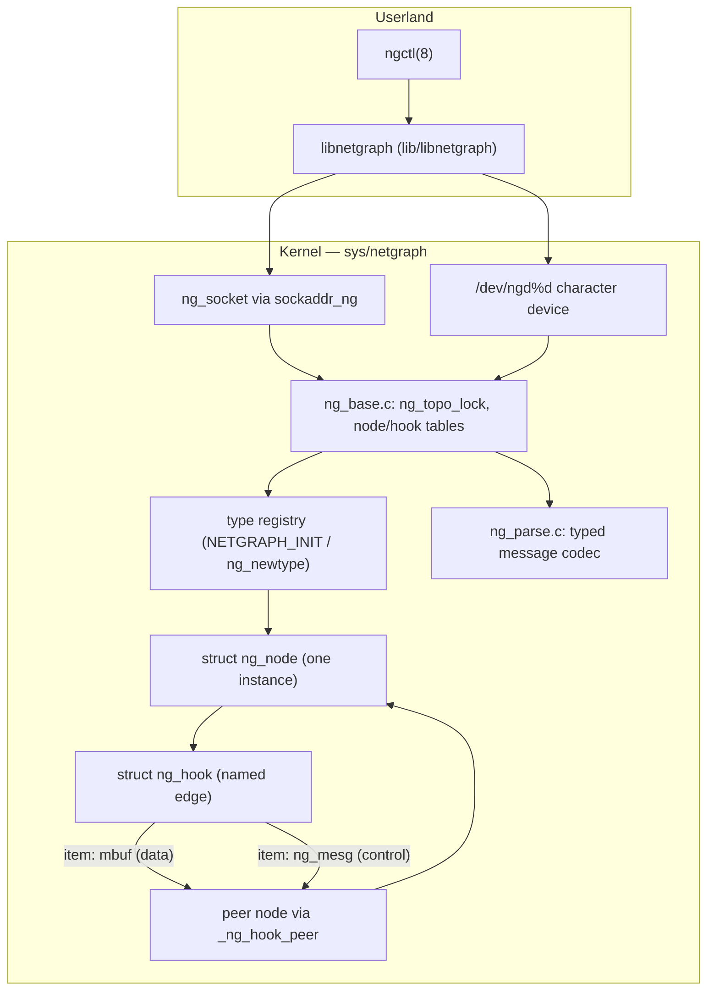

# netgraph — Graph-based Networking Framework
<!-- This file is auto-generated by generate-doc.py -- do not edit manually -->

---
**Navigation:**
  **Up:** [Kernel Core — Structure and Entry Point](../README.md) ▸ [Source Tree — Layout and Conventions](../../README_internals.md)
  **Related:** [Network Stack — Architecture and Packet Flow](../net/README.md) | [VNET — Virtual Network Stacks](../net/README_vnet.md)
  **All chapters:** [Source Tree — Layout and Conventions](../../README_internals.md) | [Boot Process — UEFI Bootloader to Kernel Handoff](../../stand/efi/loader/README.md) | [Kernel Core — Structure and Entry Point](../README.md) | [Build System — buildworld and buildkernel](../../share/mk/README.md) | [System Calls and Image Activation — Entry, sysent, and exec](../kern/README_syscall.md) | [Kernel Modules and the Linker — KLD, SYSINIT, and linker sets](../kern/README_kld.md) | [Virtual Memory Subsystem — vm_page, UMA, and Pagers](../vm/README.md) | [Process Management — Scheduling and Lifecycle](../kern/README_process.md) ...
---


## Quick Summary

FreeBSD's netgraph is a user-composable graph of *typed nodes* connected by *named hooks*, in which data items (mbufs) and control messages travel along the edges. Where the IP stack's [`pfil(9)`](../../share/man/man9/pfil.9) hooks are a fixed sequence of filtering points baked into well-known spots in the input/output path, netgraph lets an administrator or an application assemble an arbitrary pipeline at runtime: a tunnel, a protocol stack, a traffic shaper, a packet inspector, or a bridge. The framework itself — the node/[hook](#glossary)/[item](#glossary) machinery, the dispatch logic, and the message codec — lives in a handful of files under `sys/netgraph/`, and every individual node that ships in the tree is just a small module that plugs into that machinery.

The unit of computation is the *node*. A node is an instance of a *[node type](#glossary)* — a `struct ng_type` that names the node, carries a version cookie, and holds function pointers for the lifecycle callbacks the framework invokes: `constructor`, `newhook`, `rcvdata`, `rcvmsg`, `disconnect`, and `shutdown`. A node connects to its neighbours through *hooks*, which are named, bidirectional edges: two nodes share a hook pair, and data or messages sent out one hook arrive at the peer's matching hook. The framework wires the two ends together, routes the items, and tears the graph down cleanly when a hook is removed.

Control traffic in netgraph is *typed*. Rather than passing raw byte blobs, each node type declares the structure of its command arguments with `ng_parse_type` descriptors (defined in `ng_parse.h`). The framework can then convert a message's argument field between its native binary form and a machine-independent ASCII form. That ASCII form is what [`ngctl(8)`](../../usr.sbin/ngctl/ngctl.8) prints, and it is why the same control message can be described and reproduced on a host of a different endianness. Data traffic, by contrast, is passed as ordinary mbufs and is never interpreted by the framework — it is just forwarded.

Userland reaches the kernel graph through the `ng_socket` interface: a control socket owns a netgraph node, a data socket is parasitic on a control socket, and the pair is addressed by a `sockaddr_ng` that names a node (and optionally a hook or a path of hooks). The [`ngctl(8)`](../../usr.sbin/ngctl/ngctl.8) utility and the `libnetgraph` library are thin clients over that socket interface, and a `/dev/ngd%d` character device (`ng_device.c`) offers a second, file-descriptor-based way to talk to a single node. Because the graph is a live, reference-counted structure protected by a reader-writer [topology lock](#glossary), a running graph can be introspected and reconfigured — nodes added, hooks attached, statistics read — without stopping the system.

## Glossary

**node type** — A `struct ng_type` descriptor that names a kind of node and supplies its lifecycle callbacks; one type can have many node instances.

**type cookie** — A per-type magic number (e.g. `NGM_ECHO_COOKIE`) placed in every message's `typecookie` field so the framework and the node can confirm the message is meant for that type.

**hook** — A named, bidirectional edge connecting two nodes; items (data or messages) sent out one hook are delivered to the peer node through its matching hook.

**item** — The unit that travels along a hook; a `struct ng_item` that carries either an mbuf (data) or a `struct ng_mesg` (control message).

**topology lock** — The reader-writer lock (`ng_topo_lock`) in `ng_base.c` that serializes structural changes to the graph while allowing concurrent data flow.

**typed message** — A control message whose argument field is described by an `ng_parse_type`, so it can be converted between binary and a machine-independent ASCII form.

**`ng_cmdlist`** — A per-type table mapping a command number and its ASCII name to the `ng_parse_type` that converts its argument field; it is what lets [`ngctl(8)`](../../usr.sbin/ngctl/ngctl.8) encode and decode a node's control commands.

**`sockaddr_ng`** — The socket address that names a node and, optionally, a hook or a path of hooks; it is how userland addresses a specific point in the graph.

## Architecture

The framework is split into three layers, all under `sys/netgraph/`. The *type registry* is the set of `struct ng_type` descriptors, one per node kind, registered at module load with the `NETGRAPH_INIT(name, &type)` macro (see `ng_echo.c` and `ng_device.c`). Each descriptor carries a `.version` (the `NG_ABI_VERSION` from `netgraph.h`, currently `_NG_ABI_VERSION 12`), a `.name`, pointers to the lifecycle methods, and optionally a `.cmdlist` that describes the node's typed control commands. `ng_base.c` keeps these in a hash table keyed by name and by versioned cookie; `ng_newtype()` and `ng_rmtype()` add and remove entries, and `ng_findtype()` looks one up.

The *instance layer* is the live graph. `ng_base.c` allocates nodes with `ng_alloc_node()` / `ng_make_node()` and hooks with `ng_alloc_hook()`, and connects them with `ng_add_hook()`. A node is a `struct ng_node` that holds its type pointer, its 32-bit ID, an optional name, a list of its hooks, and a per-node private-data pointer (`NG_NODE_PRIVATE`). A hook is a `struct ng_hook` that names the edge and points at its peer. All of this [state](../netpfil/pf/README.md#glossary) is protected by the topology lock, declared in `ng_base.c` as `static struct rwlock ng_topo_lock` and accessed through the `TOPOLOGY_RLOCK()` / `TOPOLOGY_WLOCK()` macros. Structural operations (add node, add hook, remove hook, remove node) take the write lock; reading the graph and forwarding data take the read lock or no lock at all, so a busy data path does not block on administration.

The *codec layer* is `ng_parse.c` and `ng_parse.h`. It converts a control message's argument field between its native binary layout and a human-readable ASCII string, driven by a `ng_parse_type` schema. The schema is what a node type publishes in its `ng_cmdlist`; [`ngctl(8)`](../../usr.sbin/ngctl/ngctl.8) and `libnetgraph` use it to turn `ngctl msg node "cmd {field=value}"` into a binary `ng_mesg` and back. Because the ASCII form is endianness-independent, the same command text works on any host.

The node *lifecycle* is the contract a node author implements. When the framework creates a node of a type it calls `constructor`; when a hook is attached it calls `newhook`; data arriving on a hook is delivered to `rcvdata`; control messages to `rcvmsg`; when a hook is removed it calls `disconnect`; and when the node is torn down it calls `shutdown`. The minimal `ng_echo.c` node shows the whole contract in under a hundred lines: it registers a `struct ng_type` with four methods and a `NETGRAPH_INIT`, and its `disconnect` removes the node once the last hook is gone.

## Key Data Structures

The control message is `struct ng_mesg` from `sys/netgraph/ng_message.h`. The fixed header plus a flexible `data[]` tail is the whole wire format; `arglen` tells the receiver how much of `data[]` is present:

```c
/* From sys/netgraph/ng_message.h */
struct ng_mesg {
	struct	ng_msghdr {
		u_char		version;		/*  == NGM_VERSION */
		u_char		spare;			/* pad to 4 bytes */
		u_int16_t	spare2;	
		u_int32_t	arglen;			/* length of data */
		u_int32_t	cmd;			/* command identifier */
		u_int32_t	flags;			/* message status */
		u_int32_t	token;			/* match with reply */
		u_int32_t	typecookie;		/* node's type cookie */
		u_char		cmdstr[NG_CMDSTRSIZ];	/* cmd string + \0 */
	} header;
	char	data[];			/* placeholder for actual data */
};
```

`cmd` and `typecookie` together identify the command; `token` is echoed back in a reply so the sender can match it; `flags` carries status bits such as `NGF_RESP` (set by a node when it sends a reply, as `ng_echo.c` does) and the command modifiers `NGM_READONLY` and `NGM_HASREPLY`. The size limits `NG_TYPESIZ`, `NG_HOOKSIZ`, `NG_NODESIZ`, and `NG_PATHSIZ` (32/32/32/512) bound the strings that go into a `sockaddr_ng`.

A node type is a `struct ng_type`. The most complete initializer in the tree is in `sys/netgraph/ng_device.c`, which shows the full set of lifecycle slots plus the optional `cmdlist`:

```c
/* From sys/netgraph/ng_device.c */
static struct ng_type ngd_typestruct = {
	.version =	NG_ABI_VERSION,
	.name =		NG_DEVICE_NODE_TYPE,
	.mod_event =	ng_device_mod_event,
	.constructor =	ng_device_constructor,
	.rcvmsg	=	ng_device_rcvmsg,
	.shutdown = 	ng_device_shutdown,
	.newhook =	ng_device_newhook,
	.rcvdata =	ng_device_rcvdata,
	.disconnect =	ng_device_disconnect,
	.cmdlist =	ng_device_cmds,
};
NETGRAPH_INIT(device, &ngd_typestruct);
```

Each `.method` is one of the `ng_*_t` typedefs declared in `netgraph.h` (`ng_constructor_t`, `ng_newhook_t`, `ng_rcvdata_t`, `ng_rcvmsg_t`, `ng_disconnect_t`, `ng_shutdown_t`, `ng_close_t`, `ng_findhook_t`). A node that does not need a given callback leaves that slot NULL and the framework skips it. `NETGRAPH_INIT(device, &ngd_typestruct)` registers the descriptor with the base layer at module load.

The typed-command table is `struct ng_cmdlist`; `ng_device.c` uses it to expose two commands, each bound to a `ng_parse_type` that knows how to convert the argument:

```c
/* From sys/netgraph/ng_device.c */
static const struct ng_cmdlist ng_device_cmds[] = {
	{
	  NGM_DEVICE_COOKIE,
	  NGM_DEVICE_GET_DEVNAME,
	  "getdevname",
	  NULL,
	  &ng_parse_string_type
	},
	{
	  NGM_DEVICE_COOKIE,
	  NGM_DEVICE_ETHERALIGN,
	  "etheralign",
	  NULL,
	  NULL
	},
	{ 0 }
};
```

Each row pairs a [type cookie](#glossary) and a command number with the ASCII command name and a pointer to the `ng_parse_type` used to encode/decode the argument (NULL means the command takes no typed argument). The `{ 0 }` row terminates the table.

Per-node private data is just a `void *` owned by the node; the node casts it to its own type. `ng_device.c` shows the pattern with `struct ngd_private`, which parks the node's socket queue, its cdev, and its selection structures:

```c
/* From sys/netgraph/ng_device.c */
struct ngd_private {
	struct	ifqueue	readq;
	struct	ng_node	*node;
	struct	ng_hook	*hook;
	struct	cdev	*ngddev;
	struct  selinfo rsel;
	struct  selinfo wsel;
	struct	mtx	ngd_mtx;
	int 		unit;
	int		ether_align;
	uint16_t	flags;
#define	NGDF_OPEN	0x0001
#define	NGDF_RWAIT	0x0002
#define	NGDF_DYING	0x0004
};
```

The item that travels a hook is `struct ng_item`. It carries either a data [mbuf](../sys/README_mbuf.md#glossary) or a control message, plus the bookkeeping the base layer needs to queue and free it: an `el_flags` field, an `el_next` pointer for the input queue, and a union holding the mbuf (`da_m`) or, for a message, the `ng_mesg` pointer (`msg_msg`) together with the reply address (`msg_retaddr`). `ng_alloc_item()` and `ng_free_item()` manage these, and the `NGI_*` accessor macros (`NGI_GET_MSG`, `NGI_M`, `NGI_HOOK`, `NGI_NODE`) let a node reach the payload without touching the union directly.

## Deep Dive

**Registering a type.** A node module defines its methods, fills in a `struct ng_type`, and calls `NETGRAPH_INIT`. In `ng_echo.c` the descriptor wires four methods and the macro registers it under the name `NG_ECHO_NODE_TYPE` (`"echo"`):

```c
/* From sys/netgraph/ng_echo.c */
static struct ng_type typestruct = {
	.version =	NG_ABI_VERSION,
	.name =		NG_ECHO_NODE_TYPE,
	.constructor =	nge_cons,
	.rcvmsg =	nge_rcvmsg,
	.rcvdata =	nge_rcvdata,
	.disconnect =	nge_disconnect,
};
NETGRAPH_INIT(echo, &typestruct);
```

The base layer stores the descriptor in its type table (guarded by the topology lock) so that `ng_make_node()` can later instantiate it and so that `ng_findtype()` / cookie lookups can resolve an incoming message to the right type.

**Data flow.** When a node receives data it is handed a `hook_p` and an `item_p` in `rcvdata`. To forward it, the node calls `NG_FWD_ITEM_HOOK(error, item, hook)` (as `nge_rcvdata` does). The macro expands into `ng_base.c`, which resolves the *peer* hook on the far end of the edge (`_ng_hook_peer`), takes a reference on the peer node so it cannot be freed mid-delivery (`_ng_node_ref`), and invokes the peer's `rcvdata`. The item itself is reference-counted; once the receiver has consumed it, the base layer releases it with `ng_free_item()`. The internal send path is built from `ng_snd_item()` and the `ng_send_fn*` helpers, and `ng_package_data()` wraps a raw mbuf into an item. Because forwarding only needs the (read-protected) hook-to-peer mapping, it does not take the write lock, which is what keeps the data path fast.

**Control flow.** A node receives a message in `rcvmsg(node, item, lasthook)`. It pulls the `ng_mesg` out with `NGI_GET_MSG(item, msg)`, inspects `msg->header.cmd` against its own command set, and acts. To answer, it sets the response flag and calls `NG_RESPOND_MSG`, which copies `token`, marks the message as a reply, and sends it back to the originator recorded in the item's return address (`ng_replace_retaddr()` handles rewriting that address when a message is relayed). `ng_echo.c` is the canonical minimal handler:

```c
/* From sys/netgraph/ng_echo.c */
static int
nge_rcvmsg(node_p node, item_p item, hook_p lasthook)
{
	struct ng_mesg *msg;
	int error = 0;

	NGI_GET_MSG(item, msg);
	msg->header.flags |= NGF_RESP;
	NG_RESPOND_MSG(error, node, item, msg);
	return (error);
}
```

To *create* a message (rather than reply), a node uses `ng_package_msg()` / `ng_package_msg_self()`, filling in `cmd`, `typecookie`, and the argument bytes. The argument bytes are what the `ng_cmdlist` / `ng_parse_type` machinery turns into and out of ASCII for userland.

**Tearing down.** `disconnect` is called when a hook is removed; a node decides what that means. `ng_echo.c`'s rule is "if this was my last hook, remove myself":

```c
/* From sys/netgraph/ng_echo.c */
static int
nge_disconnect(hook_p hook)
{
	if ((NG_NODE_NUMHOOKS(NG_HOOK_NODE(hook)) == 0)
	&& (NG_NODE_IS_VALID(NG_HOOK_NODE(hook)))) {
		ng_rmnode_self(NG_HOOK_NODE(hook));
	}
	return (0);
}
```

`ng_rmnode_self()` (and the peer-side `ng_rmnode()`) walk the node's hooks, call each neighbour's `disconnect`, drop the node's name, and finally free the node once its reference count hits zero (`_ng_node_really_die()`). Hook removal is split into `ng_rmhook_part2()` / `ng_rmhook_self()` so that both ends of an edge are taken down in a defined order under the topology write lock.

**The typed codec.** `ng_parse.c` implements the binary<->ASCII conversion. A `ng_parse_type` describes one C type — a primitive (`ng_parse_uint32_type`, `ng_parse_string_type`, `ng_parse_ipaddr_type`, ...), a fixed or variable array, a fixed or variable-length string, or a composite `struct`. The composite case is the interesting one: `ng_parse_composite()` and `ng_unparse_composite()` walk a `struct` field-by-field using the `enum comptype` (`CT_STRUCT`, `CT_ARRAY`, `CT_FIXEDARRAY`) and emit the ASCII grammar from `ng_parse.h` — `{ name=value ... }` for structs, `[ value ... ]` for arrays, `"..."` for strings, with omitted fields taking defaults. Alignment is computed at build time from the `int16_temp`/`int32_temp`/`int64_temp` [probe](../kern/README_driver.md#glossary) structs so the binary layout matches the C compiler's. The `NG_GENERIC_NG_MESG_INFO(dtype)` macro in `ng_message.h` shows how the message header itself is described as a composite, with the trailing `data` field bound to a per-command `dtype`.

**Userland bridge.** `libnetgraph` (`lib/libnetgraph/`) is the library both [`ngctl(8)`](../../usr.sbin/ngctl/ngctl.8) and application code use. Its `sock.c` opens the netgraph socket pair and binds it to a `sockaddr_ng` naming a node (and optionally a hook or a path of hooks, bounded by `NG_PATHSIZ`); its `msg.c` builds `ng_mesg` structures and runs the argument through the parse types so a command can be typed as ASCII. [`ngctl(8)`](../../usr.sbin/ngctl/ngctl.8) (`usr.sbin/ngctl/`) is a CLI over that library: `list` dumps the node/hook graph, `mkpeer` creates a peer node and connects a hook, `msg` sends a typed control command, and `name`, `connect`, `rmhook`, `show`, `status`, `config`, `write`, and `dot` (Graphviz output) cover the rest of the administration surface. As an alternative to sockets, `ng_device.c` exposes a `/dev/ngd%d` character device (`NG_DEVICE_DEVNAME "ngd"`) bound to a single node, with the file operations `ngdopen`, `ngdclose`, `ngdread`, `ngdwrite`, `ngdioctl`, `ngdpoll`, and `ngdkqfilter`; its `ifqueue readq` and `selinfo` fields back the blocking-read and `poll`/kqueue behaviour.

## Flow / Diagram



## Advanced Notes

**Debugging a live graph.** Build the kernel with `NETGRAPH_DEBUG` and `ng_base.c` keeps global `SLIST`s of every node and hook (`ng_allnodes`, `ng_allhooks`) plus free lists, and exposes `ng_dumpnodes()`, `ng_dumphooks()`, and `ng_dumpitems()` (with per-object `dumpnode`/`dumphook`/`dumpitem` helpers). The `sysctl_debug_ng_dump_items` sysctl gates the item dumps. These are the first things to reach for when a graph is in an unexpected state: they show the actual node/hook topology and the items sitting in input queues without needing to [attach](../kern/README_driver.md#glossary) a tracer to every callback.

**Locking and the data path.** The whole design hinges on the `ng_topo_lock` reader-writer lock. Structural changes — `ng_add_hook`, `ng_rmhook_part2`, `ng_rmnode`, name changes — take the write lock; reads and data forwarding take the read lock or none. That is why a heavy `rcvdata` stream does not stall while an administrator runs `ngctl mkpeer`. The cost is that any operation that both reads the topology and might change it must be careful not to upgrade in place; the base layer provides `ng_acquire_read()` / `ng_acquire_write()` / `ng_upgrade_write()` / `ng_leave_read()` / `ng_leave_write()` and `ng_queue_rw()` precisely to manage that hand-off.

**Use-after-free and the "DEAD" structures.** The header comment in `ng_base.c` is worth quoting because it states the central race: *"In order to avoid races, it is sometimes necessary to point at SOMETHING even though theoretically, the current entity is INVALID."* Nodes and hooks are reference-counted (`_ng_node_ref`/`_ng_node_unref`, `_ng_hook_ref`/`_ng_hook_unref`), and a dying object is not freed the instant its last hook goes — it is marked invalid and freed only when the reference count drops (`_ng_node_really_die()`), with `_ng_node_revive()` on the other end for the debug free-lists. A node author who drops a reference early, or who assumes a `hook_p` it was handed is still valid after returning from a callback, will read a freed object. The `NG_NODE_IS_VALID` / `_ng_hook_is_valid` checks exist for exactly this reason, and `ng_echo.c`'s `disconnect` demonstrates the correct pattern (re-check validity before acting).

**Deferring work.** Netgraph callbacks can run in contexts where sleeping or taking a heavy lock is wrong. The base layer offers a worklist and [callout](../netinet/README_transport.md#glossary) facility — `ng_worklist_add()`, `ng_callout()` / `ng_callout_trampoline()`, and `ng_uncallout()` / `ng_uncallout_drain()` — and a dedicated `ngthread()` that drains the worklist, so a node can schedule a deferred action (a timeout, an async reply, a statistics flush) instead of doing it inline. `ng_flush_input_queue()` drains a node's queued items, which matters during teardown so no item is lost or leaked.

**Framing against `pfil`.** Both mechanisms are "hooks in a packet path," but they solve different problems and the two coexist. [`pfil(9)`](../../share/man/man9/pfil.9) (netpfil) is a *fixed* sequence of filter points at well-known locations in the IP input/output path: the kernel decides where the hooks are, and a filter is attached to a point to inspect or drop packets in place. Netgraph is a *user-composable* graph: the administrator chooses the nodes, the edges, and the order, and the result can be a full protocol stack, a tunnel, or a shaper, not just a filter. A `pfil` hook sees one well-defined packet at one well-defined point; a netgraph node sees whatever the node before it on the graph produced, on a hook the administrator named. The network-stack chapter covers how packets reach the IP path in the first place; netgraph is the layer that can be built *on top of* or *instead of* that path for the parts an operator wants to reconfigure at runtime.

**OS-theory connection.** Netgraph is essentially a message-passing pipeline model made into a kernel subsystem: nodes are processes, hooks are channels, and items are messages. The `ng_parse` codec is a schema-driven serializer in the same spirit as ASN.1 or an IDL — the schema (`ng_parse_type`) is the single source of truth from which both the binary layout and the human-readable text are derived, which is what buys the endianness independence. The topology lock is a textbook reader-writer lock applied to a mutable graph, trading a write barrier for a lock-free-ish data path; the reference counts are the same technique the inode (the kernel's per-file metadata structure) and `vm_object` (the kernel's per-mapping virtual-memory object) layers use to defer reclamation until no reference remains.

## See Also
- [Network Stack — Architecture and Packet Flow](../net/README.md)
- [VNET — Virtual Network Stacks](../net/README_vnet.md)


- [`sys/netgraph/ng_base.c`](ng_base.c) — the instance layer: node/hook allocation, the topology lock, and data/control dispatch.
- [`sys/netgraph/netgraph.h`](netgraph.h) — the KPI: `struct ng_type`, the `ng_*_t` method typedefs, the `NG_*` accessor macros, and `NG_ABI_VERSION`.
- [`sys/netgraph/ng_message.h`](ng_message.h) — `struct ng_mesg`, the size limits, and the command flag bits.
- [`sys/netgraph/ng_parse.h`](ng_parse.h) / `ng_parse.c` — the typed-message codec and the ASCII grammar.
- [`sys/netgraph/ng_echo.c`](ng_echo.c) — the minimal node, showing the full lifecycle in one file.
- [`sys/netgraph/ng_device.c`](ng_device.c) — the `/dev/ngd%d` character-device interface and a complete `ng_cmdlist`.
- [`lib/libnetgraph/`](../../lib/libnetgraph) (`sock.c`, `msg.c`) and [`usr.sbin/ngctl/`](../../usr.sbin/ngctl) — the userland clients.
- `ng(4)`, [`ngctl(8)`](../../usr.sbin/ngctl/ngctl.8), [`netgraph(3)`](../../lib/libnetgraph/netgraph.3), [`pfil(9)`](../../share/man/man9/pfil.9), [`mbuf(9)`](../../share/man/man9/mbuf.9), [`rwlock(9)`](../../share/man/man9/rwlock.9) — the man pages.
- Network Stack chapter — how packets enter the IP path that netgraph can sit beside or replace.

---

> _Generated by [DaemonDocs](https://github.com/ocochard/DaemonDocs) on 2026-09-01 03:48 UTC using model `Qwen3.8-27B-Q8_0` (llama.cpp build `b10553-cd26896c1`). AI-generated content — verify against source before relying on it._
