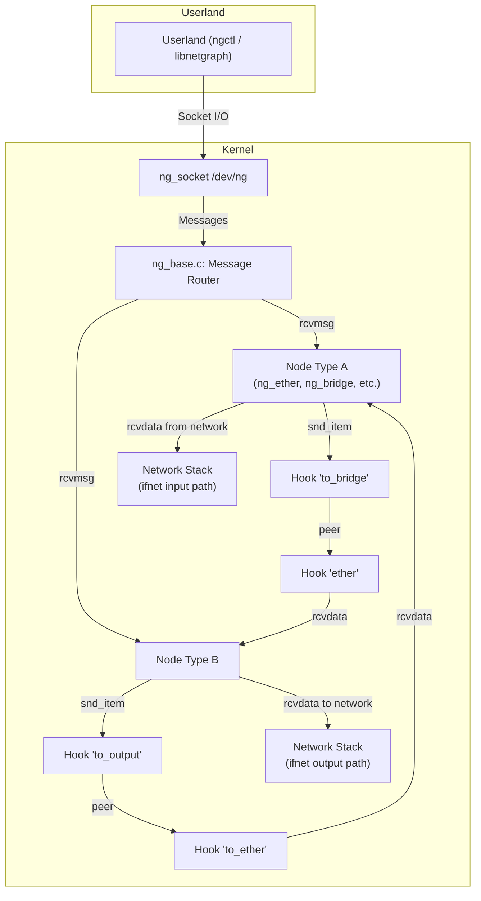

# netgraph — Graph-based Networking Framework
<!-- This file is auto-generated by generate-doc.py -- do not edit manually -->

---
**Navigation:**
  **Up:** [Kernel Core — Structure and Entry Point](../README.md) ▸ [Source Tree — Layout and Conventions](../../README_internals.md)
  **Related:** [Network Stack — Architecture and Packet Flow](../net/README.md) | [VNET — Virtual Network Stacks](../net/README_vnet.md)
  **All chapters:** [Source Tree — Layout and Conventions](../../README_internals.md) | [Boot Process — UEFI Bootloader to Kernel Handoff](../../stand/efi/loader/README.md) | [Kernel Core — Structure and Entry Point](../README.md) | [Build System — buildworld and buildkernel](../../share/mk/README.md) | [Virtual Memory Subsystem — vm_page, UMA, and Pagers](../vm/README.md) | [Process Management — Scheduling and Lifecycle](../kern/README_process.md) | [Locking Primitives — Mutexes, sx, rmlocks, and Atomics](../kern/README_locking.md) | [Buffer Cache — Block I/O Subsystem](../vm/README_bcache.md) ...
---


> ⚠ **UNVERIFIED DRAFT** — reviewer did not explicitly approve this draft. Treat claims as suspect until manually reviewed.


## Quick Summary

FreeBSD's netgraph framework provides a user-composable graph of typed nodes connected by named hooks, where data items (mbufs) and control messages flow along the edges. Unlike the fixed filtering hooks in the IP input/output path (pfil), netgraph lets administrators and applications build custom protocol stacks, tunnels, traffic shapers, and packet processors at runtime. The framework was originally developed at Whistle Communications in the mid-1990s and has been part of FreeBSD since 4.0, evolving through multiple ABI revisions while maintaining backward compatibility.

At its core, a netgraph consists of nodes and hooks. Each node represents a processing stage — it has a type that determines its behavior, a set of named hooks through which it receives data and control messages, and callback functions that the framework invokes at key lifecycle points: construction, newhook attachment, data receipt, message receipt, disconnection, and shutdown. Nodes communicate by passing mbufs along hooks to connected nodes, and by sending control messages to configure or query node state.

The typed-message system in `ng_parse.h` provides a layer of type safety and human readability for control messages. Rather than passing raw byte buffers, nodes declare the expected structure of their command arguments using `ng_parse_type` descriptors. The framework can then convert between binary and ASCII representations, enabling `ngctl(8)` to display and manipulate node state in a readable format. This system also supports inter-machine communication of control messages, since the ASCII form is machine-independent.

Userland interacts with the kernel graph through the `ng_socket` interface, which exposes a character device `/dev/ng` and supports the `ngctl(8)` command-line tool and `libnetgraph` library. Operations such as creating nodes, attaching hooks, sending data, and querying topology are performed through socket I/O that the kernel bridges to the graph framework. This design allows a running graph to be introspected and reconfigured without stopping the system — a capability that makes netgraph particularly valuable for network monitoring, traffic shaping, and protocol experimentation.

## Architecture

The netgraph framework lives in `sys/netgraph/` and consists of several key files:

**`sys/netgraph/netgraph.h`** defines the kernel programming interface (KPI). It declares the fundamental types (`struct ng_node`, `struct ng_hook`, `struct ng_item`, `struct ng_queue`), the node method function pointers that every node type must implement, and the message header structure. The KPI requires each node type to provide a `struct ng_type` containing the type name, version cookie, and function pointers for the lifecycle methods: `constructor`, `newhook`, `rcvdata`, `rcvmsg`, `disconnect`, and `shutdown`.

**`sys/netgraph/ng_base.c`** implements the core framework logic. It manages node and hook allocation, maintains the global node and hook lists, handles message routing between nodes, and implements the topology lock (`ng_topo_lock`) that protects graph modifications. The file also provides utility functions for name-to-ID resolution, hook lookup, and item queuing.

**`sys/netgraph/ng_message.h`** defines the message header structure `struct ng_mesg` and the command string size limits. Each control message carries a header with version, argument length, command identifier, flags, token (for matching requests to replies), and type cookie, followed by a variable-length data array.

**`sys/netgraph/ng_parse.h`** and **`sys/netgraph/ng_parse.c`** implement the typed-message system. They define the `ng_parse_type` structure with function pointers for `getLength`, `getAlign`, `getDefault`, `parse`, and `unparse` methods. Predefined types cover integers (int8 through int64), IP addresses, strings, arrays, fixed arrays, byte arrays, and composite structures. Node types register parse type tables that describe the expected binary layout of their command arguments.

**`sys/netgraph/ng_socket.c`** (not in the verified symbol list but part of the framework) exposes the `/dev/ng` character device and implements the socket-based protocol for userland communication.

The framework uses epoch-based synchronization for safe concurrent access to node and hook structures, and the UMA memory allocator for efficient allocation of nodes, hooks, and data items. The topology lock (`rwlock`) serializes graph modifications while allowing concurrent reads for message routing.

## Key Data Structures

### struct ng_node

The node is the central entity in the graph. It represents a processing stage and contains the following fields (defined in `sys/netgraph/netgraph.h`):

```c
struct ng_node {
    u_int32_t id;                       /* unique node ID */
    char name[NG_NODESIZ];              /* human-readable name */
    struct ng_type *type;               /* node type descriptor */
    struct hooklist hooks;              /* list of connected hooks */
    void *private;                      /* node-type-specific data */
    refcount_t refcount;                /* reference count */
    /* ... internal fields for locking and state ... */
};
```

The `id` field provides a unique identifier for the node, used in path resolution and message routing. The `name` field allows human-readable identification (e.g., "ether1", "bridge0"). The `type` pointer references the `ng_type` descriptor that defines the node's behavior. The `hooks` list contains all hooks connected to this node. The `private` pointer is reserved for node-type-specific data — for example, `ng_bridge` uses it to store bridge configuration and host tables.

### struct ng_hook

A hook represents a connection point on a node through which data and messages flow. Hooks are named within a node, and each hook has a pointer to its peer hook on the connected node:

```c
struct ng_hook {
    struct ng_node *node;               /* owning node */
    struct ng_hook *peer;               /* peer hook on connected node */
    char name[NG_HOOKSIZ];              /* hook name within node */
    void *private;                      /* hook-type-specific data */
    ng_rcvdata_fn *rcvdata;             /* data receive function */
    ng_rcvmsg_fn *rcvmsg;               /* message receive function */
    refcount_t refcount;                /* reference count */
    /* ... internal fields ... */
};
```

The `peer` pointer enables bidirectional traversal of the graph. When a node sends data to a hook, the framework follows the peer pointer to deliver the data to the connected node's `rcvdata` function. The `rcvdata` and `rcvmsg` function pointers allow hooks to override the default receive handlers, enabling specialized behavior for specific hook connections.

### struct ng_item

Data items (mbufs) are wrapped in `struct ng_item` for queuing between nodes:

```c
struct ng_item {
    item_p next;                        /* next item in queue */
    mbuf_t m;                           /* mbuf chain */
    hook_p hook;                        /* destination hook */
    /* ... timing and priority fields ... */
};
```

Each item carries a single mbuf chain destined for a specific hook. Items are queued on the destination hook when a node calls `ng_snd_item()`, and are processed asynchronously by the netgraph thread.

### struct ng_type

The node type descriptor defines the behavior of all nodes of a given type:

```c
struct ng_type {
    char name[NG_TYPESIZ];              /* type name */
    u_int32_t version;                  /* type version cookie */
    ng_constructor_t *constructor;      /* create new node */
    ng_close_t *close;                  /* destroy node */
    ng_shutdown_t *shutdown;            /* shutdown node */
    ng_newhook_t *newhook;             /* new hook added */
    ng_rcvdata_fn *rcvdata;            /* default data handler */
    ng_rcvmsg_fn *rcvmsg;              /* default message handler */
    ng_disconnect_t *disconnect;        /* hook disconnected */
    ng_findhook_t *findhook;           /* find hook by name */
    LIST_ENTRY(ng_type) next;          /* next type in list */
};
```

Every node type registers its `ng_type` structure with the framework via `ng_newtype()`. The `version` field is a cookie that encodes the ABI version, allowing the framework to detect incompatible type combinations. The function pointers define the node's behavior — at minimum, a type must provide a `constructor` function pointer and `rcvdata`/`rcvmsg` handlers.

### struct ng_mesg

Control messages use the header defined in `sys/netgraph/ng_message.h`:

```c
struct ng_mesg {
    struct {
        u_char version;
        u_char spare;
        u_int16_t spare2;
        u_int32_t arglen;
        u_int32_t cmd;
        u_int32_t flags;
        u_int32_t token;
        u_int32_t typecookie;
        u_char cmdstr[NG_CMDSTRSIZ];
    } header;
    char data[];
};
```

The `cmd` field identifies the command, `arglen` specifies the size of the data payload, `token` is used to match requests with replies, and `typecookie` identifies the node type that should handle the message. The `cmdstr` field contains a human-readable command name for debugging and logging.

## Deep Dive

### Node Lifecycle

When a node type is registered, the framework stores its `ng_type` in a global list. To create a node of that type, userland sends an `ng_mkpeer` command through the socket interface, which invokes `ng_make_node_common()` in `ng_base.c`. This function:

1. Allocates a `struct ng_node` via the framework's node allocation mechanism.
2. Calls the type's `type->constructor(node)` function pointer. If the constructor returns non-zero, the node is freed and the operation fails.
3. Assigns a unique ID and name to the node.
4. Adds the node to the global node list under the topology write lock.

```c
/* Simplified flow from ng_make_node_common */
node = ng_make_node_common(type);
if (node == NULL)
    return NULL;
error = type->constructor(node);
if (error) {
    ng_unref_node(node);
    return NULL;
}
ng_name_node(node, name);
ng_name_rehash(node);
```

The `constructor` function pointer is responsible for initializing the node's `private` data structure and any internal state. For example, the Ethernet node type allocates private data for interface tracking, while the bridge node type initializes its configuration and host table.

### Hook Management

When a hook is added to a node (via `ng_add_hook()`), the framework:

1. Allocates a `struct ng_hook` via the framework's hook allocation mechanism.
2. Assigns the hook to its parent node and sets its name.
3. Calls the node type's `type->newhook(node, hook, name)` function pointer.
4. If the hook is being connected to another node (via `ng_con_part2()`), the framework calls the peer node's `newhook()` and then links the two hooks together by setting their `peer` pointers.

The `newhook` function pointer allows the node type to initialize hook-specific state. For example, the Ethernet node type registers the hook's rcvdata/rcvmsg functions and sets up the hook for packet delivery.

### Data Forwarding

When a node needs to send data to a connected node, it has two options: it can call `ng_snd_item()` directly for asynchronous forwarding, or invoke the hook's `rcvdata` function pointer directly for synchronous delivery.

`ng_snd_item()` is defined in `sys/netgraph/ng_base.c` and performs the following steps:

1. **Item Allocation/Wrapping**: The mbuf chain is placed into a new `struct ng_item`, which wraps the mbuf and records the destination hook.
2. **Queueing**: The item is inserted into the destination hook's input queue.
3. **Scheduling**: `ng_callout()` is invoked to schedule the netgraph kernel thread (`ngthread`).
4. **Processing**: `ngthread()` dequeues items and calls the peer hook's `rcvdata` function, delivering the mbuf to the next node in the graph.

This asynchronous path is the primary data forwarding mechanism in netgraph. It ensures that data forwarding is thread-safe and decoupled from the calling context, allowing nodes to return quickly after handing off packets.

Alternatively, a node can invoke `hook->rcvdata` directly. This bypasses the queue and callout mechanism, delivering the mbuf immediately to the peer node's receive handler in the current execution context. This synchronous path is used by simple forwarding nodes that don't need asynchronous processing.

### Control Message Handling

Control messages follow a similar path but carry structured arguments. When a node type registers its `ng_type`, it can also provide a parse type table describing the expected structure of its command arguments. The framework uses `ng_parse()` and `ng_unparse()` to convert between binary and ASCII representations.

For example, if a node type expects a command with a `struct ng_car_hookconf` argument, it registers parse type descriptors for each field:

```c
static const struct ng_parse_struct_field ng_car_hookconf_type_fields[] = {
    NG_GENERIC_NG_MESG_INFO(&ng_car_hookconf_type),
    { "bandwidth", &ng_parse_uint32_type },
    { "burst", &ng_parse_uint32_type },
    { NULL }
};
```

When userland sends a command via `ngctl`, the framework:

1. Parses the ASCII argument string into binary using the registered parse type.
2. Packages the binary data into an `ng_mesg` structure.
3. Sends the message to the target node via `ng_send_fn()`.
4. The node's `rcvmsg` function receives the message, processes the command, and optionally sends a reply back to userland.

The `ng_parse` system provides type safety by ensuring that command arguments match the expected layout. It also enables human-readable configuration — `ngctl show` displays node state in ASCII form, and `ngctl msg` sends commands with human-readable arguments that are automatically converted to binary.

### Message Routing

The framework routes messages between nodes using the hook's `peer` pointer. When a node sends a message, the framework:

1. Creates an `ng_mesg` structure with the appropriate header fields.
2. Sets the `typecookie` to the target node's type cookie.
3. Calls `ng_send_fn()` to deliver the message to the target hook.
4. The target hook's `rcvmsg` function processes the command.

Messages can be sent to any node in the graph by specifying the target node's name or ID. The framework resolves the name/ID to a node reference, then follows the hook chain to deliver the message.

### Userland Interface

Userland interacts with the netgraph framework through the `ng_socket` interface. The `/dev/ng` character device provides:

- `open()`: Creates a new socket connection to the framework.
- `send()`: A standard POSIX socket function (not a netgraph-specific operation) used to transmit data or control messages over the socket.
- `read()`: Receives replies and data from the graph.
- `ioctl()`: Performs topology operations like listing nodes, hooks, and types.

The `libnetgraph` library provides a C API for programmatic access, while `ngctl(8)` provides a command-line interface. Both use the same underlying socket protocol, which defines a set of message types for operations like:

- `NGM_CONNECT`: Connect two hooks.
- `NGM_MKPEER`: Create a new node and connect it.
- `NGM_RMHOOK`: Remove a hook.
- `NGM_NAME`: Get or set node/hook names.
- `NGM_GENERIC_MSG`: Send a custom command to a node.

The socket interface uses a binary protocol that mirrors the kernel's `ng_mesg` structure, with additional framing for multi-part messages and error reporting.

## Flow / Diagram



## Advanced Notes

### Performance Considerations

Netgraph processes data items asynchronously via the `ngthread()` kernel thread. This design has several performance implications:

1. **Single-threaded processing**: All queued items are processed by a single thread, which can become a bottleneck under high packet rates. For high-throughput applications, consider using `ng_bpf` for inline packet processing or moving logic to the network stack's `netisr` framework.

2. **Mbuf copying**: Each item in the queue owns a reference to the mbuf chain. When multiple hooks are connected to a node, the framework may need to duplicate mbufs for fan-out scenarios, increasing memory pressure.

3. **Lock contention**: The topology lock serializes graph modifications, but message routing can proceed concurrently via read locks. However, the per-hook spin locks for queue access can contend under heavy load.

4. **Callout overhead**: Items are scheduled via `ng_callout()`, which adds latency compared to synchronous processing. For latency-sensitive applications, consider using `ng_eiface` to create a virtual interface that processes packets synchronously.

### Common Pitfalls

1. **Reference leaks**: Nodes and hooks maintain reference counts. Failing to call `ng_unref_node()` or `ng_unref_hook()` when done can prevent cleanup. The `NETGRAPH_DEBUG` build helps detect leaks by never freeing nodes/hooks.

2. **Topology changes during message routing**: Modifying the graph (adding/removing nodes or hooks) while messages are in flight can cause use-after-free bugs. Always acquire the topology write lock before making changes, and use epoch-based synchronization for safe concurrent access.

3. **Infinite loops**: Netgraph does not detect loops in the graph. A loop of nodes forwarding data to each other can cause infinite packet circulation. Use `ng_etf` (ethertype filter) or loop detection algorithms (as in `ng_bridge`) to prevent this.

4. **Message size limits**: Control messages are limited to `NG_CMDSTRSIZ` (32 bytes) for the command string and a configurable argument length. Large arguments may need to be split across multiple messages or handled via `ng_async` for background processing.

5. **ABI compatibility**: The `NG_ABI_VERSION` encodes compatibility information. Mixing debug and non-debug modules can cause crashes due to different internal structures. Ensure all modules are built with the same `NG_ABI_VERSION` configuration.

### Connection to OS Theory

Netgraph embodies the Unix philosophy of composability — small, well-defined components that can be connected in arbitrary configurations. Each node is a state machine with a clear interface (hooks), and the framework provides the plumbing to connect them. This design parallels the pipe-and-filter architecture pattern, where data flows through a series of processing stages.

The framework's use of mbufs for data passing connects it to the broader FreeBSD networking stack. When a netgraph node receives an mbuf from the network stack, it processes the packet according to its type-specific logic, then either forwards the mbuf to another hook (continuing the processing pipeline) or returns it to the network stack for delivery. This integration allows netgraph to sit transparently in the packet path, acting as a programmable intermediate layer between the network interface and the IP stack.

The typed-message system in `ng_parse` reflects a broader principle in systems programming: type safety at the interface boundary. By declaring the expected structure of control messages and providing automatic conversion between binary and ASCII forms, netgraph reduces the risk of configuration errors and enables tooling that can validate and display node state. This approach is analogous to protocol buffer systems in userland, but implemented entirely within the kernel for zero-copy operation.

## See Also
- [Network Stack — Architecture and Packet Flow](../net/README.md)
- [VNET — Virtual Network Stacks](../net/README_vnet.md)


- `sys/netgraph/ng_base.c` — Core framework implementation
- `sys/netgraph/netgraph.h` — Kernel programming interface
- `sys/netgraph/ng_message.h` — Message header definitions
- `sys/netgraph/ng_parse.h` / `sys/netgraph/ng_parse.c` — Typed-message system
- `sys/netgraph/ng_ether.c` — Ethernet node (example of network stack integration)
- `sys/netgraph/ng_bridge.c` — Bridge node (example of loop detection)
- `sys/netgraph/ng_bpf.c` — BPF node (example of inline packet processing)
- `sys/netgraph/ng_etf.c` — Ethertype filter (example of packet filtering)
- `man 4 ng_ether` — ng_ether(4) manual page
- `man 8 ngctl` — ngctl(8) manual page
- `sys/netinet/ip_input.c` — pfil hooks (comparison point for fixed vs. composable filtering)
- `sys/net/netisr.c` — Netisr framework (alternative to netgraph for high-throughput processing)

---

> _Generated by [DaemonDocs](https://github.com/ocochard/DaemonDocs) on 2026-05-01 00:33 UTC using model `Qwen3.6-35B-A3B-UD-Q4_K_XL` (llama.cpp build `b8985-27aef3dd9`). AI-generated content — verify against source before relying on it._
