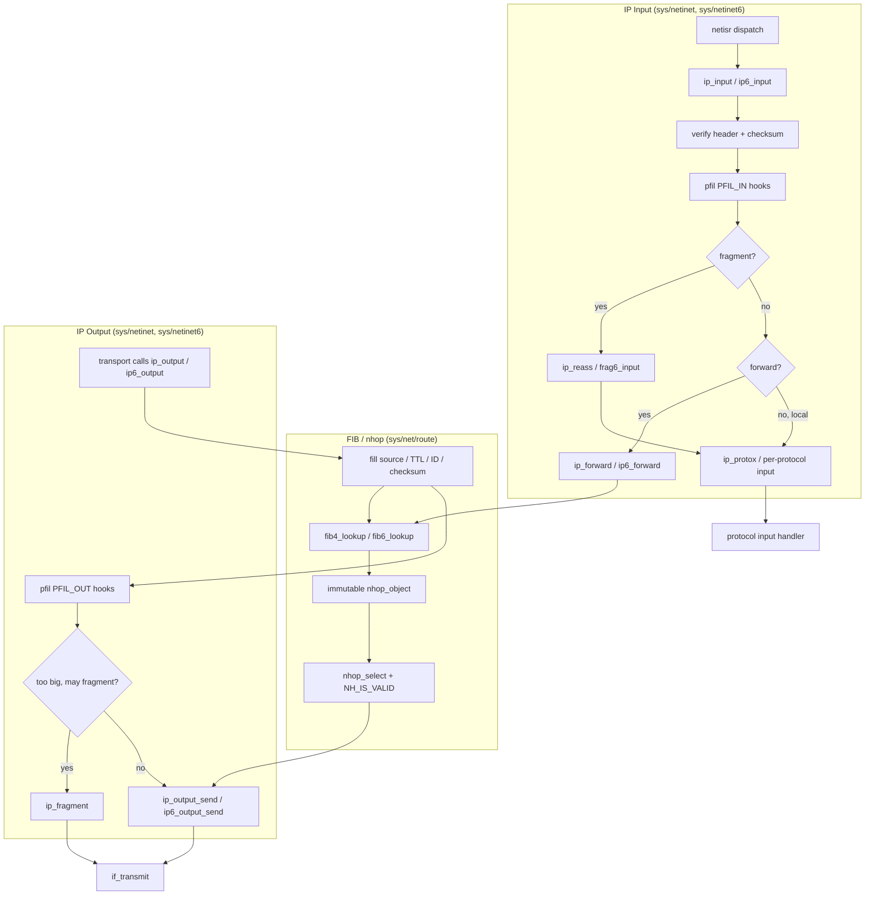

# IP Layer — IPv4, IPv6, Forwarding, FIB, and nhop
<!-- This file is auto-generated by generate-doc.py -- do not edit manually -->

---
**Navigation:**
  **Up:** [Kernel Core — Structure and Entry Point](../README.md) ▸ [Source Tree — Layout and Conventions](../../README_internals.md)
  **Related:** [Network Stack — Architecture and Packet Flow](../net/README.md) | [VNET — Virtual Network Stacks](../net/README_vnet.md) | [pf — OpenBSD-derived Packet Filter](../netpfil/pf/README.md) | [mbuf — Network Buffer Allocation and Chaining](../sys/README_mbuf.md) | [Transport Protocols — inpcb, tcpcb, TCP State Machine, UDP](README_transport.md)
  **All chapters:** [Source Tree — Layout and Conventions](../../README_internals.md) | [Boot Process — UEFI Bootloader to Kernel Handoff](../../stand/efi/loader/README.md) | [Kernel Core — Structure and Entry Point](../README.md) | [Build System — buildworld and buildkernel](../../share/mk/README.md) | [System Calls and Image Activation — Entry, sysent, and exec](../kern/README_syscall.md) | [Kernel Modules and the Linker — KLD, SYSINIT, and linker sets](../kern/README_kld.md) | [Virtual Memory Subsystem — vm_page, UMA, and Pagers](../vm/README.md) | [Process Management — Scheduling and Lifecycle](../kern/README_process.md) ...
---


## Quick Summary

The IP layer is the point where a packet stops being "a byte string on a wire" and becomes "a datagram with a destination." For every IPv4 packet that arrives, FreeBSD runs `ip_input()` (in `sys/netinet/ip_input.c`): it checks the version and header length, verifies the header checksum, walks the [pfil hook](#glossary) chain, then makes the single most important decision in the whole function — is this packet for *us*, or are we a *forwarder* for someone else? If it is for us, the packet is handed to the next layer through the `ip_protox[]` dispatch table. If we are forwarding, `ip_forward()` looks up the next hop and rewrites the header before the packet goes back out. The IPv6 twin, `ip6_input()` in `sys/netinet6/ip6_input.c`, does the same job but must first walk a chain of extension headers, and it never re-fragments in the middle of the network.

The output path is the mirror image. A transport protocol calls `ip_output()` (in `sys/netinet/ip_output.c`) with a header that is only partly filled in; the IP layer supplies the source address, the TTL, the identification field, and the checksum, runs the `PFIL_OUT` hooks, resolves the next hop, and — if the packet is too big for the link and fragmentation is permitted — splits it with `ip_fragment()` before pushing the [mbuf](../sys/README_mbuf.md#glossary) down to the interface. On the receive side, `ip_reass()` (in `sys/netinet/ip_reass.c`) glues fragments back together, guarded by timeouts and queue limits so an attacker cannot exhaust memory by sending fragments that never complete.

The most important architectural change in recent FreeBSD is the [FIB](#glossary)/[nhop](#glossary) rewrite. Before 12.x, forwarding [state](../netpfil/pf/README.md#glossary) lived in `struct rtentry`, with the next-hop information embedded inside the routing-table entry and a per-CPU forwarding cache that had to be kept in sync and locked. The rewrite split that into two objects: a *route table* (the `struct rib_head` radix tree, owned by the control plane) and an *immutable `nhop_object`* (the ready-to-use next hop, read by the datapath without a lock). The lookup data structure itself — radix, [DXR](#glossary) (a two-level direct-indexed trie optimized for large routing tables), or a binary-search array — is pluggable at runtime through `sys/net/route/fib_algo.c`, so the kernel can pick the structure that fits each table's size.

IPv6 is treated here as a primary architectural contrast, not a footnote. Its 128-bit addresses, the ban on in-network fragmentation, neighbor discovery in place of ARP, and link-local scope IDs each forced a separate input/output path under `sys/netinet6/` rather than sharing the IPv4 code. The chapter closes on what hangs off the L3 entry points: the [`pfil(9)`](../../share/man/man9/pfil.9) [hook](../netgraph/README.md#glossary) framework that lets pf, ipfw, and ipsec interpose without patching `ip_input`/`ip_output`, the per-protocol input handlers, and the [`netisr(9)`](../../share/man/man9/netisr.9) boundary where the interrupt context hands off to the deferred packet-processing context.

## Glossary

**FIB** — Forwarding Information Base; the kernel's name for a routing (next-hop) table, one per routing table number.
**DXR** — A two-level direct-indexed trie optimized for large routing tables; one of the pluggable FIB lookup structures.
**nhop** — A next-hop object (`struct nhop_object`); an immutable, reference-counted record of everything the datapath needs to send a packet out one interface.
**LPM** — Longest-prefix match; the routing-table lookup rule where the most specific (longest) matching prefix wins.
**pfil hook** — A registration point in the [`pfil(9)`](../../share/man/man9/pfil.9) framework where packet-filter modules (pf, ipfw, ipsec) interpose on the IP path without modifying the IP code itself.
**netisr** — The network interrupt service routine; the deferred, non-interrupt context that runs `ip_input`/`ip6_input` after a driver queues a packet.
**PFIL_IN / PFIL_OUT** — The two pfil hook points on the input and output IP paths respectively.
**epoch** — A kernel synchronization mechanism that defers freeing of memory until every CPU has passed through a quiescent point, guaranteeing no in-flight lookup still holds a stale pointer.
**scope ID** — A 32-bit tag (the interface index) that disambiguates link-local IPv6 addresses, which are only valid on one link.
**NHF_INVALID** — A `nhop_object` flag; when set, the next hop is considered unusable and the datapath treats the lookup as a miss.

## Architecture

FreeBSD's IP layer is split by address family, with a shared routing substrate underneath. The IPv4 plane lives in `sys/netinet/` (`ip_input.c`, `ip_output.c`, `ip_reass.c`, `in_fib.c`); the IPv6 plane lives in `sys/netinet6/` (`ip6_input.c`, `ip6_output.c`, `ip6_forward.c`, `frag6.c`, `in6_fib.c`). Both families resolve next hops through the same FIB/nhop machinery in `sys/net/route/` (`fib_algo.c`, `nhop.c`, `route_ctl.c`, `route_tables.c`), which is what makes the two planes comparable: the same `struct rib_head` tree and the same immutable `nhop_object` type serve both IPv4 and IPv6, differing only in the address family and the per-family lookup algorithm.

The input path is driven by [`netisr(9)`](../../share/man/man9/netisr.9). A driver places an mbuf on the interface's input queue; `netisr` wakes a taskqueue [thread](../kern/README_process.md#glossary) that calls the family's input function. For IPv4 that is `ip_input()` in `sys/netinet/ip_input.c`. It validates the header, verifies the checksum, calls the `PFIL_IN` hook chain, and then branches: a fragment goes to `ip_reass()`, a packet destined for another host goes to `ip_forward()`, and a local packet is dispatched through `ip_protox[]`. The forwarding sysctl is `net.inet.ip.forwarding` (`VNET_DEFINE(int, ipforwarding)` in `ip_input.c`), and redirect behavior is governed by `net.inet.ip.redirect` (`ipsendredirects`).

The output path is entered by the transport layer. `ip_output()` in `sys/netinet/ip_output.c` is the public entry; it normalizes the header, fills in the fields the caller did not, runs `ip_output_pfil()` for the `PFIL_OUT` hooks, then calls `ip_output_send()` which resolves the next hop and hands the mbuf to `if_transmit()`. When the packet exceeds the path MTU and fragmentation is allowed, `ip_fragment()` splits it. The IPv6 equivalents are `ip6_output()` → `ip6_output_send()`, `ip6_forward()` in `sys/netinet6/ip6_forward.c`, and `frag6_input()` in `sys/netinet6/frag6.c`.

The FIB/nhop rewrite is the architectural center of this chapter. The control plane owns `struct rib_head` (in `sys/net/route/route_var.h`): a radix tree plus an `rmlock` (`rib_lock`) that serializes route changes. Each route points at an `nhop_object`. The datapath never touches the tree or the lock; it calls the per-family lookup (`fib4_lookup()` / `fib6_lookup()`), which invokes the currently-selected algorithm's function pointer and returns a pointer to an immutable `nhop_object` that is valid for the duration of the current network [epoch](#glossary) (a kernel synchronization mechanism that defers freeing of memory until every CPU has passed through a quiescent point, guaranteeing no in-flight lookup still holds a stale pointer). `fib_algo.c` is what lets the algorithm itself be swapped: it defines `struct fib_lookup_module` (the registration record) and `struct fib_dp` (the per-table pointer to the active algorithm), and it lets the kernel choose among radix, DXR, and the binary-search array at runtime.

## Key Data Structures

The IPv4 header, from `sys/netinet/ip.h` (per RFC 791). The load-bearing fields for this chapter are the header length (`ip_hl`), the fragment offset (`ip_off`), the TTL (`ip_ttl`), and the protocol (`ip_p`):

```c
struct ip {
#if BYTE_ORDER == LITTLE_ENDIAN
	u_char	ip_hl:4,		/* header length */
		ip_v:4;			/* version */
#endif
#if BYTE_ORDER == BIG_ENDIAN
	u_char	ip_v:4,			/* version */
		ip_hl:4;		/* header length */
#endif
	u_char	ip_tos;			/* type of service */
	u_short	ip_len;			/* total length */
	u_short	ip_id;			/* identification */
	u_short	ip_off;			/* fragment offset field */
#define	IP_RF 0x8000			/* reserved fragment flag */
#define	IP_DF 0x4000			/* dont fragment flag */
#define	IP_MF 0x2000			/* more fragments flag */
#define	IP_OFFMASK 0x1fff		/* mask for fragmenting bits */
	u_char	ip_ttl;			/* time to live */
	u_char	ip_p;			/* protocol */
	u_short	ip_sum;			/* checksum */
	struct	in_addr ip_src,ip_dst;	/* source and dest address */
} __packed;
```

The IPv6 header, from `sys/netinet/ip6.h` (per RFC 2460). Note there is no header checksum, no TTL (it is `ip6_un1_hlim`, the hop limit), and no fragment offset — fragmentation moved to an extension header, which is the design decision that forbids in-network fragmentation:

```c
struct ip6_hdr {
	union {
		struct ip6_hdrctl {
			u_int32_t ip6_un1_flow;	/* 20 bits of flow-ID */
			u_int16_t ip6_un1_plen;	/* payload length */
			u_int8_t  ip6_un1_nxt;	/* next header */
			u_int8_t  ip6_un1_hlim;	/* hop limit */
		} ip6_un1;
		u_int8_t ip6_un2_vfc;	/* 4 bits version, top 4 bits class */
	} ip6_ctlun;
	struct in6_addr ip6_src;	/* source address */
	struct in6_addr ip6_dst;	/* destination address */
} __packed;
```

The IPv4 reassembly queue, from `sys/netinet/ip_var.h`. One `struct ipq` is created per datagram being reassembled; fragments are linked onto `ipq_frags` and the queue is timed out via `ipq_expire`:

```c
struct ipq {
	TAILQ_ENTRY(ipq) ipq_list;	/* to other reass headers */
	time_t	ipq_expire;		/* time_uptime when ipq expires */
	u_char	ipq_nfrags;		/* # frags in this packet */
	u_char	ipq_p;			/* protocol of this fragment */
	u_short	ipq_id;			/* sequence id for reassembly */
	int	ipq_maxoff;		/* total length of packet */
	struct mbuf *ipq_frags;		/* to ip headers of fragments */
	struct	in_addr ipq_src,ipq_dst;
	struct label *ipq_label;	/* MAC label */
};
```

The per-table datapath pointer, from `sys/net/route/fib_algo.h`. This is the seam that makes the lookup algorithm swappable: `f` is the active algorithm's lookup function and `arg` is its private state. `fib4_lookup()` calls `dp->f(dp->arg, key, scopeid)` and never knows which algorithm is behind it:

```c
/* Datapath lookup data */
struct fib_dp {
	flm_lookup_t	*f;
	void		*arg;
};
```

The lookup key, also from `sys/net/route/fib_algo.h`. The union is what lets one `flm_lookup_t` signature serve both families:

```c
struct flm_lookup_key {
	union {
		const struct in6_addr *addr6;
		struct in_addr addr4;
	};
};
```

The algorithm registration record, from `sys/net/route/fib_algo.h`. Each algorithm (radix, DXR, bsearch) fills in one of these and registers it; the callback set describes how to build, change, dump, and look up:

```c
struct fib_lookup_module {
	char		*flm_name;		/* algo name */
	int		flm_family;		/* address family this module supports */
	int		flm_refcount;		/* # of references */
	uint32_t	flm_flags;		/* flags */
	uint8_t		flm_index;		/* internal algo index */
	flm_init_t	*flm_init_cb;		/* instance init */
	flm_destroy_t	*flm_destroy_cb;	/* destroy instance */
	flm_change_t	*flm_change_rib_item_cb;/* routing table change hook */
	flm_dump_t	*flm_dump_rib_item_cb;	/* routing table dump cb */
	flm_dump_end_t	*flm_dump_end_cb;	/* end of dump */
	flm_lookup_t	*flm_lookup;		/* lookup function */
	flm_get_pref_t	*flm_get_pref;		/* get algo preference */
	flm_change_batch_t	*flm_change_rib_items_cb;/* routing table change hook */
	void		*spare[8];		/* Spare callbacks */
	TAILQ_ENTRY(fib_lookup_module)	entries;
};
```

The route-table head, from `sys/net/route/route_var.h`. This is the control-plane object: the radix tree (`head`), the lock that serializes changes (`rib_lock`), the generation counters used to detect stale datapath state (`rnh_gen`, `rnh_gen_rib`), and the pointer to the nhop subsystem (`nh_control`):

```c
struct rib_head {
	struct radix_head	head;
	rn_matchaddr_f_t	*rnh_matchaddr;	/* longest match for sockaddr */
	rn_addaddr_f_t		*rnh_addaddr;	/* add based on sockaddr*/
	rn_deladdr_f_t		*rnh_deladdr;	/* remove based on sockaddr */
	rn_lookup_f_t		*rnh_lookup;	/* exact match for sockaddr */
	rn_walktree_t		*rnh_walktree;	/* traverse tree */
	rn_walktree_from_t	*rnh_walktree_from; /* traverse tree below a */
	rnh_set_nh_pfxflags_f_t	*rnh_set_nh_pfxflags;	/* hook to alter record prior to insertion */
	rt_gen_t		rnh_gen;	/* datapath generation counter */
	struct radix_node	rnh_nodes[3];	/* empty tree for common case */
	struct rmlock		rib_lock;	/* config/data path lock */
	struct radix_mask_head	rmhead;		/* masks radix head */
	struct vnet		*rib_vnet;	/* vnet pointer */
	int			rib_family;	/* AF of the rtable */
	u_int			rib_fibnum;	/* fib number */
	struct callout		expire_callout;	/* Callout for expiring dynamic routes */
	time_t			next_expire;	/* Next expire run ts */
	uint32_t		rnh_prefixes;	/* Number of prefixes */
	rt_gen_t		rnh_gen_rib;	/* fib algo: rib generation counter */
	bool			rib_dying:1,	/* rib is detaching */
				rib_algo_init:1;/* algo init done */
	struct nh_control	*nh_control;	/* nexthop subsystem data */
	rnh_augment_nh_f_t	*rnh_augment_nh;/* hook to alter nexthop prior to insertion */
	CK_STAILQ_HEAD(, rib_subscription)	rnh_subscribers;/* notification subscribers */
};
```

The next-hop object, `struct nhop_object`, lives in `sys/net/route/nhop.h`. It is the immutable record the datapath reads lock-free. The header documents its fields directly; the gateway storage is a fixed buffer (`gw_buf[28]`) sized to hold an `AF_INET`, `AF_INET6`, or `AF_LINK` gateway, exposed through the `gw_sa` member. The datapath-relevant fields are:

```c
/* From sys/net/route/nhop.h (field description from the header comment) */
/* nh_flags:      NHF_ flags used in the dataplane code (NHF_GATEWAY,
 *                NHF_BLACKHOLE, NHF_INVALID, ...) */
/* nh_mtu:        ready-to-use nexthop mtu (link header + if MTU accounted) */
/* nh_ifp:        logical transmit interface; if_transmit() target, non-NULL */
/* nh_aifp:       ifnet of the source address (differs from nh_ifp only on
 *                IPv6 loopback routes) */
/* nh_ifa:        interface address to use, non-NULL */
/* nh_pksent:     counter(9) of packets transmitted */
/* gw_sa / gw_buf[28]: storage for an AF_INET / AF_INET6 / AF_LINK gateway */
```

The nhop type enum, verbatim from `sys/net/route/nhop.h`, shows the four link-level resolution modes the datapath can be in:

```c
enum nhop_type {
	NH_TYPE_IPV4_ETHER_RSLV = 1,	/* IPv4 ethernet without GW */
	NH_TYPE_IPV4_ETHER_NHOP = 2,	/* IPv4 with pre-calculated ethernet encap */
	NH_TYPE_IPV6_ETHER_RSLV = 3,	/* IPv6 ethernet, without GW */
	NH_TYPE_IPV6_ETHER_NHOP = 4	/* IPv6 with pre-calculated ethernet encap*/
};
```

The IPv4 lookup result structure, from `sys/netinet/in_fib.h`. It is the per-lookup scratch that `fib4_lookup_rt()` fills in, holding the resolved nhop, the resolved link-level entry, and the prepend/MTU the output path will use:

```c
struct route_in {
	/* common fields shared among all 'struct route' */
	struct nhop_object *ro_nh;
	struct llentry *ro_lle;
	char		*ro_prepend;
	uint16_t	ro_plen;
	uint16_t	ro_flags;
	uint16_t	ro_mtu;	/* saved ro_rt mtu */
	uint16_t	spare;
	/* custom sockaddr */
	struct sockaddr_in ro_dst4;
};
```

The IPv6 extension-header chain, described by `struct ip6_exthdrs` in `sys/netinet6/ip6_output.c`. The datapath walks this linked list of mbufs — fixed header, hop-by-hop, first destination, routing, second destination — which is why IPv6 input is a loop over headers rather than a single fixed-size parse:

```c
/* Fields of struct ip6_exthdrs (sys/netinet6/ip6_output.c) */
/* struct mbuf *ip6e_ip6;     /* fixed IPv6 header          */
/* struct mbuf *ip6e_hbh;     /* hop-by-hop options         */
/* struct mbuf *ip6e_dest1;   /* first destination options  */
/* struct mbuf *ip6e_rthdr;   /* routing header             */
/* struct mbuf *ip6e_dest2;   /* second destination options */
```

## Deep Dive

### The input path: `ip_input()`

`ip_input()` in `sys/netinet/ip_input.c` is the IPv4 entry point, called from the [`netisr(9)`](../../share/man/man9/netisr.9) context (not interrupt context). It pulls the IPv4 header off the mbuf, checks that the version is 4 and that the header length (`ip_hl`) is at least the minimum and not longer than the packet, and verifies the header checksum. A bad version bumps `ips_badvers`, a bad length bumps `ips_badhlen`/`ips_badlen`, and a bad checksum bumps `ips_badsum` — all fields of `struct ipstat` in `sys/netinet/ip_var.h`, all exposed as SDT probes (see Advanced Notes).

After validation it calls the `PFIL_IN` hook chain. This is the seam: pf, ipfw, and ipsec each register a [`pfil(9)`](../../share/man/man9/pfil.9) hook here, and each can pass the packet, drop it, or modify it. The IP code does not know which modules are present; it just walks the chain. If a hook drops the packet, `ip_input()` returns.

The next branch is the fragment check. If `ip_off` is non-zero or the `IP_MF` flag is set, the packet is a fragment and is handed to `ip_reass()` (in `sys/netinet/ip_reass.c`) instead of the protocol. Only the final, unfragmented datagram reaches the transport layer.

Then the forward-vs-local decision. `ip_input()` tests whether the destination is one of the local addresses (via `in_localip()` in `sys/netinet/in.c`). If the packet is not local and `ipforwarding` is set, it calls `ip_forward()`. If it is local, it indexes the `ip_protox[]` table by `ip_p` (the protocol field) and calls the registered input handler — UDP, TCP, ICMP, raw IP, and so on.

### The forwarding path: `ip_forward()`

`ip_forward()` in `sys/netinet/ip_input.c` is what makes a FreeBSD box a router. It decrements the TTL; if the result is zero it drops the packet and sends an ICMP time-exceeded. Otherwise it performs the FIB lookup (`fib4_lookup()`) to find the next hop, checks that the egress interface differs from the ingress interface (if not, and `ipsendredirects` is set, it sends an ICMP redirect), rewrites the header fields the forwarder owns (TTL, checksum), and hands the packet to `ip_output()` to go back out. The statistics `ips_forward`, `ips_fastforward`, and `ips_cantforward` track these outcomes.

### The output path: `ip_output()`

`ip_output()` in `sys/netinet/ip_output.c` is called by the transport layer with a header that is only partly filled in. The caller has set the destination and the protocol; `ip_output()` is responsible for the rest. It resolves the source address (from the socket, or by lookup if the caller left it zero), fills in the TTL (from the socket or the default), assigns the identification field (`ip_id`) for new datagrams, and computes the header checksum — or, when the checksum can be deferred to the NIC, calls `in_delayed_cksum()` to arrange a partial checksum.

`ip_output()` then calls `ip_output_pfil()` to run the `PFIL_OUT` hook chain, and finally `ip_output_send()`. That function resolves the next hop via `fib4_lookup()`, obtains the MTU from the nhop, and decides whether the packet fits. If it does not, and the `IP_DF` flag is not set, `ip_fragment()` splits the datagram into pieces that fit the link MTU and sends each. If `IP_DF` is set, the packet cannot be fragmented and is dropped with an ICMP "fragmentation needed" (the source of path-MTU discovery). Otherwise the single mbuf is pushed down to the interface with `if_transmit()`.

### Fragmentation and reassembly

`ip_fragment()` (send side, `sys/netinet/ip_output.c`) walks the payload in MTU-sized chunks, copies the IPv4 header into each fragment, sets the fragment offset and the `IP_MF` flag on all but the last, and recomputes each header's checksum. The `ips_fragmented` and `ips_ofragments` counters track this.

`ip_reass()` (receive side, `sys/netinet/ip_reass.c`) is the inverse. It keys each fragment by (source, destination, protocol, identification) and attaches it to a `struct ipq`. When the final fragment arrives (the one with `IP_MF` clear), it splices the fragments together into a single mbuf chain and hands the complete datagram to the protocol, bumping `ips_reassembled`.

Reassembly is a classic denial-of-service target: an attacker can send the first fragment of many datagrams and never send the rest, pinning memory in half-built `ipq` entries. FreeBSD defends against this three ways. First, every `ipq` has an `ipq_expire` deadline; `ipreass_callout()` (the slow-timer callback) reaps expired queues, bumping `ips_fragtimeout`. Second, there is a global cap on the number of in-flight reassembly queues, `net.inet.ip.maxfragpackets` (`sysctl_maxfragpackets` in `ip_reass.c`); when the cap is hit, new fragments are dropped (`ips_fragdropped`) and `ipreass_drain_lowmem()` / `ipreass_drain_tomax()` [reclaim](../sys/README_mbuf.md#glossary) space. Third, the mbuf accounting ties reassembly buffers to the general low-memory reclaim path.

### The FIB/nhop fast path

The rewrite's payoff is visible in `fib4_lookup()` in `sys/netinet/in_fib.c`, which is the function `ip_forward()` and `ip_output()` both call. Quoted verbatim:

```c
#ifdef FIB_ALGO
struct nhop_object *
fib4_lookup(uint32_t fibnum, struct in_addr dst, uint32_t scopeid,
    uint32_t flags, uint32_t flowid)
{
	struct nhop_object *nh;
	struct fib_dp *dp = &V_inet_dp[fibnum];
	struct flm_lookup_key key = {.addr4 = dst };

	nh = dp->f(dp->arg, key, scopeid);
	if (nh != NULL) {
		nh = nhop_select(nh, flowid);
		/* Ensure route & ifp is UP */
		if (NH_IS_VALID(nh)) {
			if (flags & NHR_REF)
				nhop_ref_object(nh);
			return (nh);
		}
	}
	RTSTAT_INC(rts_unreach);
	return (NULL);
}
```

Read that carefully: there is no lock. `dp->f` is the active algorithm's lookup function (radix, DXR, or bsearch, depending on what `fib_algo.c` selected for this table). It returns a pointer to an `nhop_object`. `nhop_select()` breaks a multipath group into a single next hop using the flow ID. `NH_IS_VALID(nh)` is the macro `(!((nh)->nh_flags & NHF_INVALID))` from `sys/net/route/nhop.h` — a single flag test, no lock. If the caller needs the nhop to outlive the current network epoch (for example, to hold it across a lock drop), it passes `NHR_REF` and `nhop_ref_object()` takes a reference.

This is the whole point of the rewrite. In the pre-12.x design, the next hop lived inside `struct rtentry` and the datapath kept a per-CPU forwarding cache of those entries; every lookup had to check the cache, and every route change had to invalidate caches on every CPU under a lock. The split into a control-plane `rib_head` (locked, mutable) and a datapath `nhop_object` (immutable, reference-counted, epoch-protected) means the fast path reads memory that the control plane only ever *swaps*, never mutates in place. The control plane builds a new nhop, atomically repoints the route at it, and lets the old one be reclaimed by the epoch mechanism once no CPU is still holding it.

### `fib_algo.c`: swapping the lookup structure

`sys/net/route/fib_algo.c` is the framework that makes the lookup structure a runtime choice. Each algorithm is a `struct fib_lookup_module` (see Key Data Structures) registered with `fib_module_register()`. The framework keeps one `struct fib_dp` per routing table, and `fib_select_algo_initial()` / `fib_check_best_algo()` pick the algorithm whose `flm_get_pref()` callback best matches the table's size (reported via `struct rib_rtable_info`: `num_prefixes`, `num_nhops`, `num_nhgrp`). When a route change arrives, `flm_change_rib_item_cb` updates the structure; if the structure cannot absorb the change incrementally it returns `FLM_REBUILD` and the framework rebuilds it from the tree.

The three algorithms that ship: the default radix tree (in `sys/net/radix.c`), DXR (a two-level trie with a compact direct-index stage, in `sys/netinet/in_fib_dxr.c`), and a binary-search array (`bsearch4_*` in `sys/netinet/in_fib_algo.c`) for very small tables. The IPv6 side mirrors this with `lradix6_*` in `sys/netinet6/in6_fib_algo.c`. Because the choice is per-table and per-family, a small host's default route table can run on the binary-search array while a router's large table runs on DXR, with the same `fib4_lookup()`/`fib6_lookup()` call site in both cases.

### The IPv6 path

`ip6_input()` in `sys/netinet6/ip6_input.c` is the v6 entry. The first difference is structural: after validating the fixed header, it walks the extension-header chain. `ip6_process_hopopts()` and `ip6_hopopts_input()` handle hop-by-hop options; `dest6_input()` (in `sys/netinet6/dest6.c`) handles destination options. A routing header can redirect the packet to an intermediate destination. Only after the chain is exhausted does it reach the forwarding-vs-local decision.

The second difference is fragmentation. IPv6 moved fragmentation out of the base header and into a fragment extension header, and the spec forbids intermediate nodes from fragmenting. So `ip6_input()` does not call an in-network reassembler for forwarded traffic the way IPv4 does; a packet that needs fragmenting must be fragmented by its source. On the receive side, `frag6_input()` in `sys/netinet6/frag6.c` reassembles fragments addressed to the local host, using `struct ip6qbucket` (a per-bucket counter with a `lock` and `count`, capped by a global max-fragments limit) and `struct ip6asfrag` (a per-datagram queue entry with a `ip6af_tq` timeout queue entry and the `ip6af_m` mbuf chain), with `frag6_slowtimo()` reaping expired entries.

The third difference is neighbor resolution. IPv4 uses ARP (`arpresolve()` in `sys/netinet/if_ether.c`); IPv6 uses Neighbor Discovery, which replaces ARP's address resolution with Router Solicitation/Advertisement and Neighbor Solicitation/Advertisement, and adds stateless address autoconfiguration. The `enum nhop_type` values `NH_TYPE_IPV6_ETHER_RSLV` and `NH_TYPE_IPV6_ETHER_NHOP` are the v6 analogues of the v4 pair, and the nhop carries the link-level resolution state for either.

The fourth difference is scope. A link-local IPv6 address (`fe80::/10`) is only meaningful on one link, so the kernel tags it with a [scope ID](#glossary) — the interface index — to disambiguate which `fe80::1` is meant. That scope ID is threaded through the lookup key (the `scopeid` argument to `fib4_lookup()`/`fib6_lookup()`) and stored in `struct scope6_id` (in `sys/netinet6/in6_var.h`), which maps address scopes to interface indices.

## Flow / Diagram



## Advanced Notes

**Debugging with DTrace / SDT.** The IP layer is heavily instrumented with SDT probes declared in `sys/netinet/in_kdtrace.h`. The `mib` provider exposes one [probe](../kern/README_driver.md#glossary) per `struct ipstat` counter — `mib::ip:count:ips_total`, `mib::ip:count:ips_badsum`, `mib::ip:count:ips_forward`, `mib::ip:count:ips_noroute`, `mib::ip:count:ips_reassembled`, `mib::ip:count:ips_fragtimeout`, and so on. The `ip` provider (via the `IP_PROBE` macro) carries per-packet events. A useful one-liner to watch forwarding and reassembly live:

```
dtrace -n 'mib::ip:count:ips_forward{ @f = count() }
          mib::ip:count:ips_reassembled{ @r = count() }
          mib::ip:count:ips_noroute{ @n = count() }'
```

The `struct ipstat` fields in `sys/netinet/ip_var.h` are the authoritative list of what is counted; each has a matching probe. For the FIB side, the `net.route` counters and the per-nhop `nh_pksent` counter (a [`counter(9)`](../../share/man/man9/counter.9)) let you confirm which next hop a flow is actually using.

**Locking model — what is locked vs. lock-free.** The control plane takes `rib_lock` (an `rmlock` in `struct rib_head`) for every route add/delete/change, and `fib_algo.c` runs the algorithm's change callback under it. The datapath takes no lock at all: `fib4_lookup()`/`fib6_lookup()` read the immutable `nhop_object` and rely on the network epoch to guarantee the object is not freed while in use. The cost of a route change is paid once, on the CPU that made it, not on every CPU forwarding packets. This is the direct answer to the cache-line-bouncing problem on multiprocessors that Tanenbaum and Bos describe in *Modern Operating Systems*: a shared, contended lock on the forwarding path causes the cache line holding it to ping-pong between cores, so the design removes the lock from that path entirely rather than optimizing it.

**Choosing a FIB algorithm.** Because the algorithm is selected per table by `flm_get_pref()`, you can watch which one is active and switch it for experimentation. Small tables (a desktop's handful of routes) favor the binary-search array because it is a flat, cache-friendly structure; large tables favor DXR for its compact two-level trie. The radix tree is the always-available default and the fallback when no specialized algorithm claims the table. If you are tuning a router, the choice between these three is often worth more than any micro-optimization in the packet path, because it changes the constant factor on every lookup.

**Pitfalls.** (1) A packet that arrives fragmented never reaches the transport layer until `ip_reass()` has all the pieces; if you are tracing a "missing" UDP packet, check `ips_fragdropped` and `ips_fragtimeout` first. (2) The `IP_DF` flag turns path-MTU problems into hard drops with an ICMP "fragmentation needed" rather than silent fragmentation — when a flow stalls on a jumbo/MTU mismatch, that ICMP is the signal. (3) `NH_IS_VALID()` is the single gate on the fast path; a next hop with `NHF_INVALID` set (interface down, route withdrawn but not yet reaped) is reported as a miss even though the radix tree still points at it, which is why a transient `ips_noroute` spike can appear during a route flap. (4) On the v6 side, forgetting the scope ID when constructing a link-local lookup is a common bug: two `fe80::` addresses on different interfaces are the same 128-bit value and only the scope ID tells them apart.

**Theory connection.** *Operating System Concepts* (9th ed.) describes the router's forwarding table exactly as this code implements it: a FIB organized so that the most specific routes are matched first, plus a route cache that stores only fully-resolved destination entries (no wildcards) so that the common case — a repeated lookup to the same destination — is a single cache hit rather than a full table walk. The FreeBSD rewrite generalizes that textbook route cache: instead of caching resolved `rtentry` copies per CPU, it caches the *next hop itself* as an immutable, reference-counted object shared across all CPUs, and it makes the matching structure (the "most specific first" walk) a swappable algorithm. The pfil seam matches the same text's note that "at various stages, the IP software passes packets to a separate section of code for firewall management" — FreeBSD formalizes that "separate section" as a registration-based hook chain so the IP code never names the filter it is calling.

## See Also
- [Network Stack — Architecture and Packet Flow](../net/README.md)
- [Transport Protocols — inpcb, tcpcb, TCP State Machine, UDP](README_transport.md)
- [mbuf — Network Buffer Allocation and Chaining](../sys/README_mbuf.md)
- [pf — OpenBSD-derived Packet Filter](../netpfil/pf/README.md)
- [VNET — Virtual Network Stacks](../net/README_vnet.md)


- **Transport Protocols** chapter — what happens after `ip_input()` dispatches through `ip_protox[]` (TCP, UDP, SCTP).
- **mbuf** chapter — mbuf chains, `m_pullup()`, and `pkthdr.csum_flags`, which the IP layer relies on but does not define.
- **Locking Primitives** chapter — `rmlock`, epochs, and atomics that the FIB/nhop split depends on.
- Source directories: [`sys/netinet/`](.) (IPv4 input/output/reassembly), [`sys/netinet6/`](../netinet6) (IPv6 input/output/frag6/NDP), [`sys/net/route/`](../net/route) (fib_algo, nhop, route_ctl, route_tables), [`sys/net/pfil.c`](../net/pfil.c) (the hook framework), [`sys/net/netisr.c`](../net/netisr.c) (the dispatch boundary).
- Man pages: [`ip(4)`](../../share/man/man4/ip.4), [`ip6(4)`](../../share/man/man4/ip6.4), [`route(4)`](../../share/man/man4/route.4), [`arp(4)`](../../usr.sbin/arp/arp.4), `nd6(4)`, [`pfil(9)`](../../share/man/man9/pfil.9), [`netisr(9)`](../../share/man/man9/netisr.9), [`mbuf(9)`](../../share/man/man9/mbuf.9), [`counter(9)`](../../share/man/man9/counter.9), [`epoch(9)`](../../share/man/man9/epoch.9), `sdt(9)`, [`ifnet(9)`](../../share/man/man9/ifnet.9).

---

> _Generated by [DaemonDocs](https://github.com/ocochard/DaemonDocs) on 2026-09-01 05:51 UTC using model `Qwen3.8-27B-Q8_0` (llama.cpp build `b10553-cd26896c1`). AI-generated content — verify against source before relying on it._
