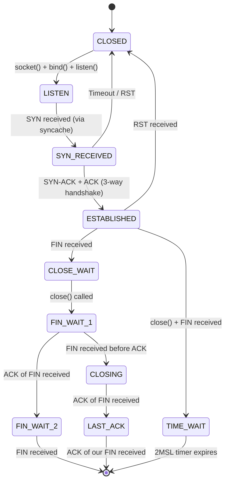
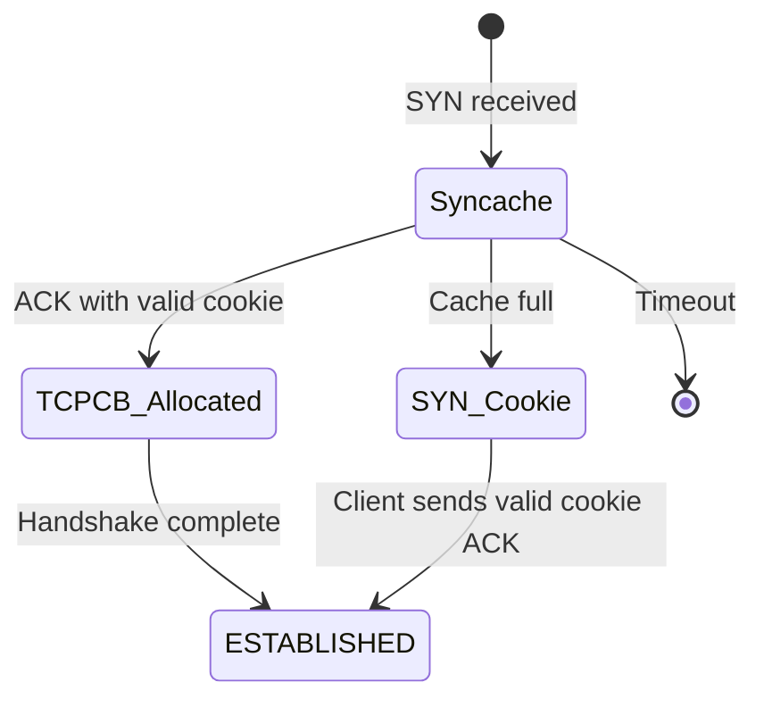
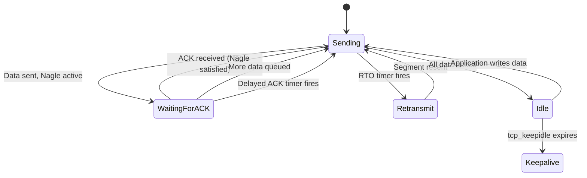

# Transport Protocols — inpcb, tcpcb, TCP State Machine, UDP
<!-- This file is auto-generated by generate-doc.py -- do not edit manually -->

---
**Navigation:**
  **Up:** [Kernel Core — Structure and Entry Point](../README.md) ▸ [Source Tree — Layout and Conventions](../../README_internals.md)
  **Related:** [Network Stack — Architecture and Packet Flow](../net/README.md) | [VNET — Virtual Network Stacks](../net/README_vnet.md) | [mbuf — Network Buffer Allocation and Chaining](../sys/README_mbuf.md) | [IP Layer — IPv4, IPv6, Forwarding, FIB, and nhop](README_ip.md)
  **All chapters:** [Source Tree — Layout and Conventions](../../README_internals.md) | [Boot Process — UEFI Bootloader to Kernel Handoff](../../stand/efi/loader/README.md) | [Kernel Core — Structure and Entry Point](../README.md) | [Build System — buildworld and buildkernel](../../share/mk/README.md) | [Virtual Memory Subsystem — vm_page, UMA, and Pagers](../vm/README.md) | [Process Management — Scheduling and Lifecycle](../kern/README_process.md) | [Locking Primitives — Mutexes, sx, rmlocks, and Atomics](../kern/README_locking.md) | [Buffer Cache — Block I/O Subsystem](../vm/README_bcache.md) ...
---


> ⚠ **UNVERIFIED DRAFT** — reviewer did not explicitly approve this draft. Treat claims as suspect until manually reviewed.


## Quick Summary

FreeBSD's Layer 4 implementation provides the bridge between application sockets and the network stack. At its foundation sits the `inpcb` (Internet Protocol Control Block), a protocol-independent structure that binds a socket to network addresses and ports. The `inpcb` serves as the common ancestor for all IP transport protocols — TCP, UDP, and raw IP — enabling the kernel to demux incoming packets to the correct socket using hash tables keyed on the five-tuple (source/destination IP, source/destination port, and protocol). This design means that the kernel never needs a per-connection lookup table at the IP layer; instead, incoming packets are routed through `in_pcblookup_hash()` which searches the `inpcbinfo` hash buckets to find the matching `inpcb`.

For TCP connections, a `tcpcb` (TCP Control Block) hangs off the `inpcb` and holds all TCP-specific state: sequence numbers, RTT estimators, congestion window, selective ACK (SACK) hints, and the full TCP state machine. This separation allows UDP and other protocols to reuse the `inpcb` infrastructure without paying the overhead of TCP state. The TCP state machine — defined in `tcp_fsm.h` — walks through eleven states from CLOSED through TIME_WAIT, with `tcp_input.c` implementing the receive-side transitions and `tcp_output.c` handling segment emission decisions.

The stack defends against SYN floods using the syncache, a dedicated hash table that holds half-open connections before a full `tcpcb` is allocated. When the syncache overflows, SYN cookies allow the kernel to respond to SYNs without consuming kernel memory, at the cost of delaying the three-way handshake. On the send side, `tcp_output.c` implements Nagle's algorithm, delayed ACKs, and TCP Segmentation Offload (TSO), deciding when to actually emit segments based on application data availability and timer events.

Timer-driven events — retransmission, persistence probes, keepalive, and the 2MSL wait in TIME_WAIT — are managed through FreeBSD's callout framework in `tcp_timer.c`. The congestion control subsystem, accessible through the `cc_algo` KPI, lets modules like CUBIC (the default), NewReno, DCTCP, and HTCP plug in to adjust the congestion window on ACKs and loss signals. For even deeper customization, `tcp_function_block` allows entire input/output state machines like RACK and BBR to replace the default TCP implementation, not just the congestion controller.

UDP, by contrast, is remarkably lightweight. The `udp_usrreq.c` implementation reuses the `inpcb` hash for demuxing but adds virtually no per-connection state beyond what `in_pcb.c` provides. UDP sockets are bound and connected through the same `in_pcbbind()` and `in_pcbconnect()` routines, but once bound, a UDP socket queues incoming datagrams on the socket buffer without sequence tracking, acknowledgments, or flow control.

## Architecture

The L4 implementation spans several key source files in `sys/netinet/`:

**`sys/netinet/in_pcb.c` and `sys/netinet/in_pcb.h`** define the protocol-independent connection block. The `inpcbinfo` structure maintains a hash table of `inpcb` pointers, keyed on the five-tuple. When a packet arrives from the IP layer, `in_pcblookup_hash()` searches this table to find the matching socket. The `inpcb` itself contains endpoints (`inp_inc`) with local/foreign ports and addresses, protocol-specific pointers, and socket references.

**`sys/netinet/tcp_subr.c`** contains foundational TCP functions that operate on the connection lifecycle regardless of state. Key functions include `tcp_init()` for stack initialization, `tcp_ctlinput()` for processing ICMP control messages (such as destination unreachable), `tcp_close()` for tearing down connections, and `tcp_drop()` for forcibly aborting connections due to errors or timeouts. This file also handles TCP-level protocol statistics, processes ICMP errors for TCP, and manages the TCP protocol control block initialization and cleanup. It serves as the glue between the TCP state machine and the IP/ICMP layers, ensuring that control signals from the network layer are properly translated into TCP state transitions.

**`sys/netinet/tcp_var.h`** defines `struct tcpcb`, which embeds a pointer to its parent `inpcb` (`t_inpcb`) and contains TCP-specific state: sequence numbers (`snd_una`, `snd_nxt`, `rcv_nxt`, `rcv_up`), RTT estimation (`sa`, `sv`, `rtt_base`), congestion control variables (`cwnd`, `ssthresh`), SACK state (`sackhint`), and timer structures. The `tcptemp` structure provides temporary storage for options during connection setup.

**`sys/netinet/tcp_fsm.h`** enumerates the eleven TCP states (TCPS_CLOSED through TCPS_TIME_WAIT) and defines the `tcp_outflags[]` array that maps each state to the TCP flags to set when sending segments. The `TCPS_HAVERCVDSYN()`, `TCPS_HAVEESTABLISHED()`, and `TCPS_HAVERCVDFIN()` macros provide state-class checks used throughout the code.

**`sys/netinet/tcp_input.c`** is the receive-side state machine. It validates headers, checks sequence numbers, processes SYNs through the syncache, handles established-state data delivery, manages SACK blocks, and triggers state transitions. The function `tcp_input()` is the main entry point, called from the IP layer after checksum validation.

**`sys/netinet/tcp_output.c`** implements the send side. Functions like `tcp_output()` decide when to emit segments based on Nagle's algorithm, delayed ACK timers, push flags, and available data. It handles MSS selection, TSO offload, and calls into the congestion control module for window updates.

**`sys/netinet/tcp_timer.c`** drives all TCP timers through FreeBSD's callout framework. Key timers include retransmission (RTO-based), persistence (to probe zero-window receivers), keepalive (idle connection detection), and the 2MSL wait. The `tcp_timer_activate()` and `tcp_timer_stop()` functions manage callout scheduling. Internal timer handlers such as `tcp_timer_2msl()`, `tcp_timer_keep()`, and `tcp_timer_persist()` are invoked by the callout framework to perform state-specific actions.

**`sys/netinet/tcp_syncache.c`** implements the SYN cache, a hash table of half-open connections. When a SYN arrives for a listening socket, `syncache_add()` either finds an existing entry, creates a new one, or generates a SYN cookie. The syncache protects against SYN floods by limiting memory usage for half-open connections.

**`sys/netinet/udp_usrreq.c`** implements UDP's socket-level operations. Functions like `udp_input()`, `udp6_input()`, `udp_send()`, and `udp6_send()` handle datagram processing. UDP reuses `in_pcblookup_hash()` for demuxing but adds no sequence tracking, acknowledgments, or state management beyond the `inpcb` itself.

**`sys/netinet/cc/cc.h`** and **`sys/netinet/cc/cc.c`** define the congestion control KPI. The `cc_algo` structure lists function pointers for connection initialization, ACK processing, congestion signals, and cleanup. The `cc_var` structure passes per-connection state to these functions. Modules register via `cc_register_algo()` and are selected via the `net.inet.tcp.cc.algorithm` sysctl.

**`sys/netinet/tcp_stacks/`** contains modular TCP implementations. RACK (`tcp_rack.h`) and BBR (`tcp_bbr.h`) define their own state structures and register via `tcp_function_block` to replace the default input/output state machine, not just the congestion controller.

## Key Data Structures

### struct inpcb (sys/netinet/in_pcb.h)

```c
struct inpcb {
    struct inpcb    *inp_hash_exact;      /* hash entry for exact match */
    LIST_ENTRY(inpcb) inp_lbgroup_list;   /* load balancer group list */
    struct socket   *inp_socket;          /* back pointer to socket */
    struct in_conninfo inp_inc;           /* protocol-independent endpoints */
    u_char           inp_vflag;           /* INP_IPV4 or INP_IPV6 */
    u_char           inp_ip_ttl;          /* time to live of packets */
    u_int8_t         inp_flags;           /* state flags (see below) */
    /* ... protocol-specific pointer follows */
};
```

The `inpcb` is allocated via `in_pcballoc()` and hashed into the `inp_hash_exact` hash table. The `inp_inc` field contains `in_endpoints` with `ie_fport`, `ie_lport`, and address fields. The protocol-specific pointer (e.g., `struct tcpcb *` for TCP) is stored immediately after the `inpcb` in memory, accessible via casting.

### struct inpcbinfo (sys/netinet/in_pcb.h)

```c
struct inpcbinfo {
    /* fields elided */
};
```

Each protocol (TCP, UDP) has its own `inpcbinfo` instance. TCP uses `tcp_pcbinfo` and UDP uses `udp_pcbinfo`. The hash table enables O(1) lookup by five-tuple.

### struct tcpcb (sys/netinet/tcp_var.h)

```c
struct tcpcb {
    struct  inpcb t_inpcb;        /* embedded inpcb */
    struct  tseg_qent *t_segq;    /* retransmit queue head */
    struct  callout t_callout;    /* main callout */
    struct  callout t_timers[TT_N]; /* callouts for timers */
    int     t_precisions[TT_N];   /* timer precision values */
    u_long  snd_una;              /* send unacknowledged */
    u_long  snd_nxt;              /* send next */
    u_long  snd_wl1;              /* seq # for window update */
    u_long  snd_wl2;              /* ack # for window update */
    u_long  snd_up;               /* send urgent pointer */
    u_long  rcv_nxt;              /* receive next */
    u_long  rcv_up;               /* receive urgent pointer */
    u_long  snd_wnd, rcv_wnd;     /* receive and send window */
    u_long  rcv_adv;              /* advertised next receive */
    u_long  snd_max;              /* highest seqno sent */
    u_long  snd_cwnd;             /* congestion-controlled window */
    u_long  snd_ssthresh;         /* slow-start threshold */
    u_long  snd_recover;          /* for Fast Recovery */
    int     t_rxtshift;           /* log(2) of rexmt exp. backoff */
    int     t_rxtcur;             /* current retransmit value */
    int     t_idle;               /* idle time (for keepalive) */
    int     t_rcvtime;            /* rcvd time (for keepalive) */
    int     t_softerror;          /* possible soft error ahead */
    int     t_state;              /* state of this connection */
    int     t_flags;              /* flags (see below) */
    /* SACK state */
    struct  sackhint sackhint;
    /* ... congestion control and modular stack state follows */
};
```

The `tcpcb` embeds `t_inpcb` as its first member, allowing the `inpcb` pointer to be obtained via `&tp->t_inpcb`. The `t_timers[]` array holds callouts for each TCP timer. The `t_segq` chain holds segments awaiting acknowledgment. RTT estimation uses the classic Jacobson/Karels algorithm with `sa` (smoothed average) and `sv` (smoothed variance).

### struct in_conninfo (sys/netinet/in_pcb.h)

```c
struct in_conninfo {
    uint8_t         inc_flags;
    uint8_t         inc_len;
    uint16_t        inc_fibnum;
    struct in_endpoints inc_ie;
};
```

The `in_endpoints` structure contains `ie_fport`, `ie_lport`, and protocol-dependent address fields (`ie_faddr`, `ie_laddr` for IPv4; `ie6_faddr`, `ie6_laddr` for IPv6). Macros like `inp_fport` and `inp_faddr` provide direct access to these fields from `inpcb`.

### struct cc_algo (sys/netinet/cc/cc.h)

```c
struct cc_algo {
    char            name[TCP_CA_NAME_MAX];
    void            (*mod_init)(void);
    void            (*mod_destroy)(void);
    size_t          (*cc_data_sz)(void);
    /* ... other function pointers elided */
    STAILQ_ENTRY(cc_algo) next;
};
```

Each congestion control module implements these callbacks. The `mod_init()` function initializes the module; `mod_destroy()` cleans up. The `cc_data_sz()` returns the size of per-connection data. The `next` field links modules in the registration list. The `cc_var` structure passes per-connection state (bytes acked, current ACK, flags) to these functions.

### struct tcp_function_block (sys/netinet/tcp_var.h)

```c
struct tcp_function_block {
    char            tfb_tcp_block_name[TCP_FUNCTION_NAME_LEN_MAX];
    const struct tcp_function *tfb_functions;
    int             tfb_refcnt;
};
```

The `tcp_function_block` replaces entire function pointers in the `tcpcb`, including input processing, output generation, and timer handlers. RACK and BBR register their own function blocks to replace the default TCP state machine, not just the congestion controller.

## Deep Dive

### The inpcb Hash and Packet Demux

When an IP packet arrives, the IP layer calls the protocol's input function (e.g., `tcp_input()` for TCP). Before reaching protocol-specific processing, the packet must be demuxed to the correct socket. This is done via `in_pcblookup_hash()` in `sys/netinet/in_pcb.c`.

The function constructs a lookup key from the packet's source/destination addresses and ports, then searches the appropriate `inpcbinfo` hash bucket. It uses a locked hash search (`in_pcblookup_hash_locked()`) that walks the chain of `inpcb` pointers in the bucket, comparing each entry's `inp_inc` against the lookup key. The search prioritizes exact matches (both local and foreign addresses match) before falling back to wildcard matches (local address is `INADDR_ANY`).

```c
// Simplified from in_pcblookup_hash()
in_pcblookup_hash(struct inpcbinfo *pcbinfo,
    u_int32_t faddr, u_int32_t laddr,
    u_int16_t fport, u_int16_t lport,
    u_int8_t fibnum, int lookforwild)
{
    struct inpcb *inp;
    u_int hash;

    hash = in_pcbinshash(pcbinfo, faddr, laddr, fport, lport);
    READ_LOCK_SPARSE(&pcbinfo->hashlock);
    HASH_FOREACH(inp, &pcbinfo->hashbase[hash], inp_hash) {
        if (in_pcblookup_hash_match(inp, faddr, laddr, fport, lport, fibnum))
            return inp;
    }
    if (lookforwild) {
        HASH_FOREACH(inp, &pcbinfo->hashbase[hash], inp_hash) {
            if (in_pcblookup_hash_wild_match(inp, faddr, laddr, fport, lport, fibnum))
                return inp;
        }
    }
    return (NULL);
}
```

The hash function `in_pcbinshash()` combines the five-tuple into a hash index, using RSS-compatible hashing when configured. The result is an O(1) average lookup that scales with the number of connections per hash bucket, not the total connection count.

### TCP State Machine in tcp_input.c

The `tcp_input()` function in `sys/netinet/tcp_input.c` is the heart of TCP's receive-side processing. It begins with header validation, then dispatches based on the current state:

**LISTEN state:** Incoming SYNs are handled by the syncache. The LISTEN state handler calls `syncache_add()` to either create a syncache entry, find an existing one, or generate a SYN cookie. No `tcpcb` is allocated at this point — the syncache entry holds only the SYN parameters and a cookie for verification.

**SYN_RECEIVED state:** When the syncache entry's SYN is acknowledged (the three-way handshake completes), `syncache_insert()` allocates a `tcpcb` via `uma_zalloc(V_tcp_zone, M_WAITOK)` and transitions to ESTABLISHED. The `tcpcb` is linked to the `inpcb` via `t_inpcb`, and the syncache entry is freed.

**ESTABLISHED and beyond:** Data segments are processed by the established-state handler. Sequence numbers are checked against `rcv_nxt` and `rcv_nxt + rcv_wnd`. Out-of-order segments are buffered for SACK if enabled. ACKs are processed to update `snd_una`, advance the congestion window, and trigger delayed ACKs.

The state transition logic follows RFC 793 closely, with FreeBSD-specific extensions for SACK, timestamp validation, and ECN. The `TCPSTATES` macro (defined in `tcp_fsm.h`) provides human-readable state names for logging.

```c
// From tcp_fsm.h - state transition table
tcp_input(struct mbuf *m, int off, int proto)
{
    struct tcphdr *th;
    struct tcpcb *tp;
    int tlen, s, state;

    // Header validation
    th = mtod_offset(m, struct tcphdr *, off);
    if (th->th_off * 4 < sizeof(struct tcphdr))
        goto bad;

    // Find or create tcpcb
    inp = in_pcblookup_hash(...);
    tp = intocb(inp);

    state = tp->t_state;

    // Dispatch based on state
    switch (state) {
    case TCPS_LISTEN:
        // Handle SYN in LISTEN state via syncache
        syncache_add(m, off, inp);
        goto out;
    case TCPS_SYN_RECEIVED:
        // Handle 3-way handshake completion
        break;
    case TCPS_ESTABLISHED:
        // Process data, ACKs, SACK
        break;
    // ... more states
    }
out:
    m_freem(m);
}
```

### Syncache and SYN Cookies

The syncache in `sys/netinet/tcp_syncache.c` is a hash table that holds half-open connections during the three-way handshake. Its purpose is to limit memory usage during SYN floods — without it, a server would allocate a full `tcpcb` (hundreds of bytes) for every SYN, allowing attackers to exhaust kernel memory.

When a SYN arrives for a listening socket, `syncache_add()` computes a hash from the five-tuple and searches the syncache. If found, it checks the cookie. If not found, it allocates a new entry and sends a SYN-ACK with a cookie embedded in the ISN (Initial Sequence Number). The cookie is computed using a cryptographic hash of the five-tuple and a secret key, making it infeasible for attackers to forge valid cookies.

```c
// From tcp_syncache.c
syncache_add(struct syncache_head *sch, struct mbuf *m, int off,
    struct inpcb *inp)
{
    struct syncache *sc;
    u_int hash;

    // Compute hash from five-tuple
    hash = syncache_hash(faddr, laddr, fport, lport);
    sch = &V_syncache.sch_hash[hash];

    // Search for existing entry
    sc = syncache_lookup(sch, faddr, laddr, fport, lport);
    if (sc != NULL) {
        // Handle retransmitted SYN or ACK
        if (TCP_FLAGS(th->th_flags) & TH_ACK)
            syncache_ack(sc, th);
        m_freem(m);
        return;
    }

    // Check if syncache is full
    if (syncache_full()) {
        if (V_tcp_syncookies)
            syncache_cookie_send(m, off, inp);
        else
            m_freem(m);
        return;
    }

    // Allocate new syncache entry
    sc = syncache_alloc(m, off, inp);
    syncache_timer_start(sc);
}
```

The syncache has configurable size limits via sysctls (`net.inet.tcp.syncache.hashsize`, `net.inet.tcp.syncache.cachelimit`). When the cache is full and SYN cookies are enabled (`net.inet.tcp.syncookies=1`), the server responds with a SYN cookie instead of allocating memory. The client's ACK must contain the correct cookie value for the connection to proceed.

### tcp_output.c — When Does the Stack Send?

The `tcp_output()` function in `sys/netinet/tcp_output.c` is called whenever the stack needs to decide whether to emit a segment. This happens on timer events (retransmit, keepalive), on ACK receipt (triggering delayed ACK or window updates), and when the application writes data (via `soisconnected()` or socket buffer wakeup).

The function checks several conditions before sending:

1. **Nagle's algorithm:** If there is unacknowledged data (`snd_una < snd_nxt`) and the segment would not be the last (i.e., more data is queued), defer sending until an ACK arrives. This prevents many small segments from flooding the network.

2. **Delayed ACK:** If an ACK is pending and no data is being sent, schedule a delayed ACK timer (`tcp_delacktime`, typically 200ms). If data is being sent, send the ACK immediately to piggyback.

3. **Push flag:** If the socket has the `SO_OOBINLINE` or `MSG_PUSH` flag set, send immediately regardless of Nagle.

4. **Retransmission:** If the retransmit timer fires, resend unacknowledged data. The RTO is computed from `sa` and `sv` (smoothed RTT and variance), with exponential backoff on successive timeouts.

5. **TSO (TCP Segmentation Offload):** If TSO is enabled (`net.inet.tcp.tso=1`) and the NIC supports it, send large segments (up to 64KB) and let the NIC handle segmentation. The MSS is reduced by TSO overhead (typically 128 bytes for headers).

```c
// Simplified tcp_output() logic
tcp_output(struct tcpcb *tp)
{
    struct mbuf *m;
    int flags, len;

    // Check if we should send
    if (tp->t_state < TCPS_ESTABLISHED) {
        // Send control segment (SYN, SYN-ACK, etc.)
        flags = tcp_outflags[tp->t_state];
        len = 0;
    } else {
        // Check Nagle's algorithm
        if (tp->snd_nxt != tp->snd_una && 
            (tp->t_flags & TF_NODELAY) == 0 &&
            (tp->t_flags & TF_NOACKSEND) == 0) {
            // Wait for ACK or more data
            return;
        }

        // Determine segment length
        len = min(tp->snd_nxt - tp->snd_una, tp->t_maxseg);
        if (tp->t_flags & TF_PUSH)
            len = tp->snd_nxt - tp->snd_una;

        flags = TH_ACK;
        if (tp->t_state >= TCPS_FIN_WAIT_1)
            flags |= TH_FIN;
    }

    // Build segment
    m = tcp_mbuilf(tp, flags, len);
    tcp_output_segment(m, tp);
}
```

### TCP Timers in tcp_timer.c

FreeBSD uses the callout framework to manage TCP timers. Each `tcpcb` has a `t_timers[]` array of callouts, indexed by timer type:

- **TCPT_REXMT (retransmit):** Fires when unacknowledged data needs retransmission. The RTO is computed as `sa + 4*sv` (smoothed RTT plus four times the smoothed variance), with exponential backoff on successive timeouts (`t_rxtshift`).

- **TCPT_PERSIST (persistence):** Fires when the receiver's window is zero. Sends a single byte probe to discover when the window opens. The timer uses exponential backoff between `tcp_persmin` and `tcp_persmax`.

- **TCPT_KEEP (keepalive):** Fires after `tcp_keepidle` seconds of idle time, then every `tcp_keepintvl` seconds. Sends a keepalive probe to detect dead connections. The number of probes before declaring a connection dead is controlled by `tcp_keepcnt`.

- **TCPT_2MSL (2MSL wait):** In TIME_WAIT state, fires after 2*MSL seconds (typically 120 seconds). Allows old duplicate segments to expire before the connection is fully closed.

```c
// From tcp_timer.c
tcp_timer_activate(struct tcpcb *tp, int timer, int ttl)
{
    callout_reset(&tp->t_timers[timer], ttl, tcp_timer_2msl, (caddr_t)tp);
}

static void
tcp_timer_2msl(void *xtp)
{
    struct tcpcb *tp = xtp;
    int timer = /* determined from callout */;

    switch (timer) {
    case TCPT_REXMT:
        tcp_rexmit_close(tp);
        tcp_timer_activate(tp, TCPT_REXMT, tp->t_rxtcur);
        break;
    case TCPT_PERSIST:
        tcp_output(tp);
        tcp_timer_activate(tp, TCPT_PERSIST, tp->t_rxtcur);
        break;
    case TCPT_KEEP:
        if (tp->t_state == TCPS_ESTABLISHED || 
            tp->t_state >= TCPS_CLOSE_WAIT)
            tcp_timer_keep(tp);
        tcp_timer_activate(tp, TCPT_KEEP, V_tcp_keepidle);
        break;
    }
}
```

### Congestion Control KPI

The congestion control subsystem in `sys/netinet/cc/` provides a pluggable interface for window adjustment algorithms. Modules register via `cc_register_algo()` and are selected via `net.inet.tcp.cc.algorithm` (default: `cubic`).

The `cc_algo` structure defines function pointers for each event the congestion controller needs to handle:

- `mod_init()`: Initialize the module
- `mod_destroy()`: Destroy the module
- `cc_data_sz()`: Return per-connection data size
- `acked()`: Called on each ACK to potentially increase the window
- `loss()`: Called on loss detection to decrease the window
- `recovery()`: Called after recovery to potentially increase the window
- `idle()`: Called after idle periods to reset state
- `destroy()`: Called to destroy per-connection state

The `cc_var` structure passes per-connection state to these functions, including bytes acked, current ACK number, and flags. The congestion controller can read `tp->snd_cwnd`, `tp->snd_ssthresh`, and other `tcpcb` fields via the `tp` pointer in `cc_var`.

```c
// From cc.h
struct cc_var {
    void    *cc_data;     /* Per-connection private CC data */
    int     bytes_this_ack;
    tcp_seq curack;
    uint32_t flags;
    struct tcpcb *tp;
    uint16_t nsegs;
    uint8_t  labc;
};

// Module registration
int
cc_register_algo(struct cc_algo *add_cc)
{
    STAILQ_INSERT_TAIL(&cc_list, add_cc, next);
    // Update default if this is the first module or explicitly set
    if (V_default_cc_ptr == NULL)
        V_default_cc_ptr = add_cc;
    return (0);
}
```

Production modules include CUBIC (default, optimized for high-bandwidth-delay-product networks), NewReno (conservative, good for lossy networks), DCTCP (data center TCP, uses ECN for fine-grained congestion signals), HTCP (HyperText Caching Protocol, for cache networks), and CDG (Congestion Discovery and Gradient, for low-latency networks).

### Modular TCP Stacks

For even deeper customization, `tcp_function_block` in `sys/netinet/tcp_stacks/` allows entire input/output state machines to replace the default. RACK (Recovery Algorithm for Kool Endpoints) and BBR (Bottleneck Bandwidth and RTT) register their own function blocks via `tcp_function_block` registration.

The `tcp_function_block` structure contains function pointers for:
- Input processing (`tfb_input`)
- Output generation (`tfb_output`)
- Timer handling (`tfb_timer`)
- State transition (`tfb_state`)

When a module registers, it replaces these function pointers in the `tcpcb`, effectively swapping out the entire TCP state machine. This is more extensive than the congestion control KPI, which only affects window adjustment.

BBR, for example, replaces the loss-based congestion control with a model-based approach that estimates bottleneck bandwidth and RTT to set the congestion window. RACK replaces the RTO-based retransmission with a time-based approach that detects spurious retransmissions more accurately.

```c
// From tcp_var.h
struct tcp_function_block {
    char                    tfb_tcp_block_name[TCP_FUNCTION_NAME_LEN_MAX];
    const struct tcp_function *tfb_functions;
    int                     tfb_refcnt;
};

struct tcp_function {
    struct tcp_function     *tf_next;
    char                    tf_name[TCP_FUNCTION_NAME_LEN_MAX];
    struct tcp_function_block *tf_fb;
};
```

### UDP — Minimal State on Top of inpcb

UDP's implementation in `sys/netinet/udp_usrreq.c` is remarkably lightweight compared to TCP. The key difference is that UDP adds no per-connection state beyond what `in_pcb.c` provides. A UDP socket is bound via `in_pcbbind()` (which allocates and hashes an `inpcb`) and connected via `in_pcbconnect()` (which sets the foreign address), but once bound, no sequence numbers, acknowledgments, or flow control are maintained.

The `udp_input()` function receives datagrams from the IP layer, looks up the destination `inpcb` via `in_pcblookup_hash()`, and queues the datagram on the socket buffer. If no socket is bound to the destination port, it sends an ICMP port unreachable message (unless the datagram was a broadcast).

```c
// Simplified udp_input()
udp_input(struct mbuf *m, int off, int proto)
{
    struct udpiphdr *ui;
    struct inpcb *inp;
    struct socket *so;

    ui = mtod_offset(m, struct udpiphdr *, off);

    // Find receiving socket
    inp = in_pcblookup_hash(&udbinfo,
        ui->ui_src.s_addr, ui->ui_dst.s_addr,
        ui->ui_sport, ui->ui_dport, 0, 0);
    if (inp == NULL) {
        // No socket - send ICMP unreachable
        icmp_error(m, ICMP_UNREACH, ICMP_UNREACH_PORT, 0, 0);
        return;
    }

    so = inp->inp_socket;
    sbappendaddr(&so->so_rcv, (struct sockaddr *)&ui->ui_src, m, NULL);
    sorwakeup(so);
}
```

UDP also supports broadcast and multicast via the `SO_BROADCAST` and `IP_ADD_MEMBERSHIP` socket options. Multicast groups are tracked via the `ip_mreq` structure and the IGMP subsystem. The `udpstat` structure in `udp_var.h` provides statistics for debugging (packets in, bad checksums, no port, etc.).

## Flow / Diagram







## Advanced Notes

### Debugging with DTrace

FreeBSD provides SDT (Statically Defined Tracing) probes in the TCP stack for runtime debugging. Key probes are defined in `sys/netinet/in_kdtrace.h` and include probes for packet input/output, timer events, and syncache operations. The actual probe names can be discovered by searching for `DTRACE_PROBE` in the source files.

Example DTrace script to track retransmissions:
```d
tcp:::tcp-retransmit
{
    printf("Retransmit: src=%s:%d dst=%s:%d seq=0x%x
",
        execname, pid,
        stringof(arg0->t_inpcb.inp_inc.inc_ie.ie_dependfaddr.id6_addr),
        arg0->t_inpcb.inp_inc.inc_ie.ie_fport,
        arg0->snd_nxt);
}
```

### Performance Implications

**Hash bucket depth:** The `inpcbinfo` hash table depth directly impacts lookup latency. With many connections per bucket, lookups degrade from O(1) to O(n). FreeBSD uses a random hash seed (`in_pcbhashseed_init()`) to prevent hash collisions from being exploitable. The hash table is resized dynamically via `in_pcbrehash()` when the load factor exceeds a threshold.

**TSO overhead:** When TSO is enabled, the stack sends large segments (up to 64KB) to the NIC, which handles segmentation. This reduces CPU usage but increases latency for individual packets. For low-latency applications, disable TSO via `net.inet.tcp.tso=0`.

**Syncache limits:** During SYN floods, the syncache is the first line of defense. Monitor `net.inet.tcp.syncache.cachelimit` and `net.inet.tcp.syncookies`. When the cache is full, SYN cookies prevent memory exhaustion but add latency (the handshake is delayed until the client's ACK arrives).

**Timer granularity:** TCP timers use the callout framework with millisecond granularity. On systems with high connection counts, timer coalescing (via `tcp_hpts` — High Precision Timer Scheduler) reduces timer overhead by batching timer events.

### Race Conditions

**inpcb reference counting:** The `inp_refcnt` field tracks passive references to an `inpcb`. When the reference count drops to zero, the `inpcb` can be freed. Care must be taken to avoid use-after-free: callers must hold a reference (`in_pcbref()`) while accessing the `inpcb`), and release it (`in_pcbrele()`) when done. The SMR (Safe Memory Reclamation) mechanism ensures that freed `inpcb` memory is not reclaimed until all readers have completed.

**Syncache races:** The syncache lookup and insertion must be atomic to avoid duplicate entries. FreeBSD uses a per-bucket lock (`mtx_lock(&V_syncache.sch_lock)`) to protect the syncache hash. When multiple CPUs race to insert the same five-tuple, only one succeeds; the others either find the existing entry or generate a SYN cookie.

**Timer races:** The callout framework ensures that timer callbacks are serialized per-`tcpcb`. However, a timer can fire while another callback is processing the same `tcpcb`. The `tcp_timer_stop()` function uses `callout_stop()` to cancel pending timers, but callbacks must check for cancellation before proceeding.

### Connection to OS Theory

FreeBSD's TCP implementation embodies several classic operating system concepts:

**Resource management:** The syncache is a bounded resource allocator that limits kernel memory usage during connection establishment. This is analogous to a semaphore with a fixed count — each slot in the syncache is a token that must be acquired before a connection can proceed.

**State machines:** The TCP state machine is a deterministic finite automaton with eleven states and well-defined transitions. FreeBSD implements this as a switch statement in `tcp_input()`, with each case handling the transitions for that state. The `tcp_outflags[]` array in `tcp_fsm.h` provides a lookup table for state-to-flags mapping.

**Hash tables:** The `inpcbinfo` hash table is a classic example of a hash table with chaining for collision resolution. The hash function combines the five-tuple into a single value, and collisions are resolved by linear search through the bucket chain. FreeBSD uses SipHash for the hash function to prevent hash-flooding attacks.

**Timer management:** FreeBSD's callout framework implements a classic timer wheel algorithm, where timers are scheduled in buckets based on their expiration time. This provides O(1) timer insertion and deletion, with O(n) scanning for expired timers (where n is the number of timers expiring in the same bucket).

**Modular design:** The `cc_algo` KPI and `tcp_function_block` structure embody the principle of separation of concerns — the core TCP state machine is decoupled from congestion control and modular stack implementations. This allows researchers to experiment with new algorithms without modifying the core stack.

## See Also
- [Network Stack — Architecture and Packet Flow](../net/README.md)
- [IP Layer — IPv4, IPv6, Forwarding, FIB, and nhop](README_ip.md)
- [mbuf — Network Buffer Allocation and Chaining](../sys/README_mbuf.md)
- [VNET — Virtual Network Stacks](../net/README_vnet.md)


- **IP Layer chapter:** [`sys/netinet/ip_input.c`](ip_input.c), [`sys/netinet6/ip6_input.c`](../netinet6/ip6_input.c) — where `tcp_input()` is called from
- **mbuf chapter:** [`sys/sys/malloc.h`](../sys/malloc.h), [`sys/sys/mbuf.h`](../sys/mbuf.h) — mbuf chain management used throughout the stack
- **Locking chapter:** [`sys/sys/lock.h`](../sys/lock.h), [`sys/sys/sx.h`](../sys/sx.h) — locking primitives used in `in_pcb.c`
- **Virtual Memory chapter:** `vm/uma.h` — UMA keg allocation for `tcpcb` and `inpcb`
- **FreeBSD man pages:** [`tcp_functions(9)`](../../share/man/man9/tcp_functions.9), `in_pcb(9)`, [`tcp(4)`](../../share/man/man4/tcp.4), [`udp(4)`](../../share/man/man4/udp.4)
- **Source directories:** [`sys/netinet/`](.), [`sys/netinet6/`](../netinet6), [`sys/netinet/cc/`](cc), [`sys/netinet/tcp_stacks/`](tcp_stacks)
- **Key files for further reading:** [`sys/netinet/in_pcb.c`](in_pcb.c), [`sys/netinet/tcp_input.c`](tcp_input.c), [`sys/netinet/tcp_output.c`](tcp_output.c), [`sys/netinet/tcp_timer.c`](tcp_timer.c), [`sys/netinet/tcp_syncache.c`](tcp_syncache.c), [`sys/netinet/udp_usrreq.c`](udp_usrreq.c), [`sys/netinet/tcp_subr.c`](tcp_subr.c)

---

> _Generated by [DaemonDocs](https://github.com/ocochard/DaemonDocs) on 2026-05-04 07:03 UTC using model `Qwen3.6-35B-A3B-UD-Q8_K_XL` (llama.cpp build `b8985-27aef3dd9`). AI-generated content — verify against source before relying on it._
