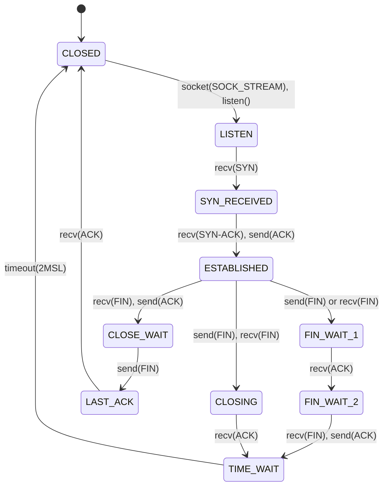

# Transport Protocols — inpcb, tcpcb, TCP State Machine, UDP
<!-- This file is auto-generated by generate-doc.py -- do not edit manually -->

---
**Navigation:**
  **Up:** [Kernel Core — Structure and Entry Point](../README.md) ▸ [Source Tree — Layout and Conventions](../../README_internals.md)
  **Related:** [Network Stack — Architecture and Packet Flow](../net/README.md) | [VNET — Virtual Network Stacks](../net/README_vnet.md) | [mbuf — Network Buffer Allocation and Chaining](../sys/README_mbuf.md) | [IP Layer — IPv4, IPv6, Forwarding, FIB, and nhop](README_ip.md)
  **All chapters:** [Source Tree — Layout and Conventions](../../README_internals.md) | [Boot Process — UEFI Bootloader to Kernel Handoff](../../stand/efi/loader/README.md) | [Kernel Core — Structure and Entry Point](../README.md) | [Build System — buildworld and buildkernel](../../share/mk/README.md) | [Virtual Memory Subsystem — vm_page, UMA, and Pagers](../vm/README.md) | [Process Management — Scheduling and Lifecycle](../kern/README_process.md) | [Locking Primitives — Mutexes, sx, rmlocks, and Atomics](../kern/README_locking.md) | [Buffer Cache — Block I/O Subsystem](../vm/README_bcache.md) ...
---


> ⚠ **UNVERIFIED DRAFT** — reviewer did not explicitly approve this draft. Treat claims as suspect until manually reviewed.


## Quick Summary
The FreeBSD transport layer (Layer 4) implements the core mechanisms for reliable (TCP) and unreliable (UDP) data delivery. At the heart of this implementation is the `inpcb` (Internet Protocol Control Block), a protocol-independent structure that binds a socket to network addresses and ports. The `inpcb` serves as the universal container for all transport protocols, allowing the kernel to demux incoming packets from a single hash table regardless of whether they belong to TCP, UDP, or raw IP.

For TCP specifically, the `inpcb` is extended by the `tcpcb` (TCP Control Block), which hangs off the `inpcb` to hold all TCP-specific state. This includes the sequence numbers, congestion control parameters, and the state machine state. The `tcpcb` is the primary unit of per-connection management, tracking everything from the slow-start threshold to Selective Acknowledgement (SACK) holes.

The TCP state machine is implemented primarily in `tcp_input.c` and `tcp_output.c`. Incoming packets are processed by `tcp_input`, which validates headers, updates state, and triggers appropriate actions (e.g., moving from `SYN_RECEIVED` to `ESTABLISHED`). The send side, driven by `tcp_output.c`, determines when to transmit segments based on congestion windows, Nagle's algorithm, and delayed ACKs. To survive SYN floods, FreeBSD uses the `syncache` mechanism, which buffers half-open connections in a separate hash table before allocating a full `tcpcb`.

UDP, in contrast, is a lightweight protocol that reuses the `inpcb` infrastructure for address binding and packet demuxing but adds almost no per-connection state of its own. It relies on the socket buffer (`so_snd`/`so_rcv`) for flow control and has no retransmission or ordering logic.

## Architecture
The FreeBSD L4 implementation is structured around the `inpcb` hash tables, which provide a unified demuxing mechanism for all IP-based protocols.

### The inpcb Hash Tables
The `inpcb` structure is managed by `inpcbinfo` (defined in `sys/netinet/in_pcb.h`), which contains the hash table (`ipi_table`) and the list of all PCBs (`ipi_list`). The key function for demuxing incoming packets is `in_pcblookup_hash` (in `sys/netinet/in_pcb.c`). This function searches the hash table for a matching `inpcb` based on the 5-tuple (source/destination IP, source/destination port, and protocol).

For TCP, the `inpcb` is linked to a `tcpcb` via the `t_inpcb` field (in `sys/netinet/tcp_var.h`). UDP does not maintain a separate per-connection control block; the `inpcb` itself holds all the information needed for UDP packet processing. This separation allows the kernel to handle the common IP binding logic in `in_pcb.c` while leaving protocol-specific processing to `tcp_input.c` or `udp_usrreq.c`.

### TCP Initialization (tcp_subr.c)
TCP initialization and registration with the IP layer happens in `sys/netinet/tcp_subr.c`. The `tcp_init` function sets up the TCP protocol handler, initializes the global `tcpstat` statistics structure, and registers TCP with the IP layer. This file also contains general-purpose TCP utility functions and the `tcpstat` structure, which tracks per-protocol statistics such as connection attempts, resets, and retransmissions.

### TCP Input/Output Path
The TCP state machine is implemented in `sys/netinet/tcp_input.c`. The main entry point is `tcp_input`, which is called from the network interrupt handler after the IP layer has validated the packet. `tcp_input` performs header validation, checks for sequence space overlaps, and processes the packet according to the current state.

The send side is implemented in `sys/netinet/tcp_output.c`. The `tcp_output` function is called by the TCP state machine (via `tcp_timer` callbacks or socket buffer events) to generate segments. It calculates the segment length based on the congestion window, the receiver's advertised window, and the Maximum Segment Size (MSS). It also handles the Nagle algorithm (coalescing small segments) and delayed ACKs.

### Timers and Syncache
TCP relies on a set of timers for retransmission, keepalive, and connection teardown. These are managed by `tcp_timer.c`. Unlike the traditional model of per-timer callouts, FreeBSD uses a single `callout` (`t_callout`) in the `tcpcb` to handle all timer events. The `t_timers` field tracks which of the five timer types is active (retransmit, persist, keepalive, 2MSL, or delayed ACK). When the callout fires, `tcp_timer_next()` dispatches to the appropriate handler function (`tcp_timer_rexmt`, `tcp_timer_persist`, `tcp_timer_keep`, `tcp_timer_2msl`, or `tcp_timer_delack`).

The `syncache` (in `sys/netinet/tcp_syncache.c`) is a critical component for protecting listening sockets from SYN floods. When a SYN packet arrives for a listening socket, the kernel allocates a `syncache` entry instead of a full `tcpcb`. The `syncache` stores the SYN packet's information and waits for the corresponding SYN-ACK response. If the cache overflows, FreeBSD can use SYN cookies (controlled by the `tcp_syncookies` sysctl) to validate the client's address without allocating memory.

### Congestion Control and Modular Stacks
FreeBSD supports pluggable congestion control algorithms via the `cc_algo` KPI (defined in `sys/netinet/cc/cc.h`). The `cc_attach` function in `sys/netinet/cc/cc.c` initializes the congestion control module for a new connection. The default algorithm is CUBIC, but others like NewReno, DCTCP, and HTCP are available.

For more advanced customization, FreeBSD supports modular TCP stacks via the `tcp_function_block` (in `sys/netinet/tcp_var.h`). This structure allows entire state machines, such as RACK or BBR, to replace the default FreeBSD TCP implementation. The `tcp_function_block` contains function pointers for input processing, output generation, and congestion control, enabling protocols like BBR to operate without modifying the core kernel code.

## Key Data Structures

### `struct inpcb` (sys/netinet/in_pcb.h)
The `inpcb` is the central structure for all transport protocols. It binds a socket to network addresses and ports.

```c
struct inpcb {
    struct socket     *inp_socket;    /* Back pointer to socket */
    struct inpcbinfo  *inp_pcbinfo;   /* PCB hash table info */
    struct in_conninfo inp_inc;       /* Protocol-independent conninfo */
    uint32_t          inp_gencnt;     /* Generation count of this instance */
    uint32_t          inp_flags;      /* Flags (e.g., INP_TIMEWAIT) */
    uint32_t          inp_flow;       /* Flow label for IPv6 */
    TAILQ_ENTRY(inpcb) inp_hash_exact;      /* Hash chain */
    TAILQ_ENTRY(inpcb) inp_lbgroup_list;      /* List of all PCBs */
    /* ... protocol-specific data follows ... */
};
```

*   `inp_socket`: Pointer to the associated socket, allowing the transport layer to interact with the socket buffer.
*   `inp_inc`: Contains the connection endpoints (local/foreign addresses and ports).
*   `inp_hash_exact`: Used for fast lookup in the hash table.

### `struct tcpcb` (sys/netinet/tcp_var.h)
The `tcpcb` hangs off the `inpcb` and holds all TCP-specific state.

```c
struct tcpcb {
    struct tcp_function_block *t_fb;  /* Function block for modular stacks */
    struct callout t_callout;         /* Main timer callout */
    uint8_t t_timers[TT_N];           /* Array of timer flags */
    uint8_t t_precisions[TT_N];       /* Timer precision array */
    /* ... other fields ... */
};
```

*   `t_fb`: Pointer to the `tcp_function_block`, enabling modular stacks like RACK or BBR.
*   `t_callout`: The single callout used for all TCP timer events.
*   `t_timers`: Array tracking which of the five timer types is active.

### `struct cc_algo` (sys/netinet/cc/cc.h)
The `cc_algo` structure defines the congestion control algorithm interface.

```c
struct cc_algo {
    const char *name;                 /* Algorithm name (e.g., "cubic") */
    int (*init)(struct cc_var *);     /* Initialize per-connection state */
    void (*destroy)(struct cc_var *); /* Cleanup per-connection state */
    void (*conn_init)(struct cc_var *); /* Initialize connection parameters */
    void (*ack_received)(struct cc_var *); /* Process ACK */
    void (*cong_signal)(struct cc_var *);  /* Handle congestion signal */
    /* ... other function pointers ... */
};
```

*   `name`: The name of the algorithm, used for sysctl configuration.
*   `init`/`destroy`: Functions to allocate and free per-connection congestion control state.
*   `ack_received`/`cong_signal`: Called by the TCP state machine on ACK receipt or congestion detection.

### `struct tcp_function_block` (sys/netinet/tcp_var.h)
The `tcp_function_block` allows modular TCP stacks to replace the default implementation.

```c
struct tcp_function_block {
    const char tfb_tcp_block_name[TCP_FUNCTION_NAME_LEN_MAX]; /* Name of the function block */
    int (*tfb_tcp_input)(struct mbuf *, int); /* Custom input handler */
    void (*tfb_tcp_output)(struct tcpcb *);   /* Custom output handler */
    /* ... other function pointers ... */
};
```

*   `tfb_tcp_input`: Custom input processing function (e.g., for RACK).
*   `tfb_tcp_output`: Custom output processing function.

## Deep Dive

### Demuxing Incoming Packets
When a packet arrives, the IP layer calls the transport protocol's input function (e.g., `tcp_input`). Before processing, the kernel must find the associated `inpcb`. This is done via `in_pcblookup_hash` in `sys/netinet/in_pcb.c`.

```c
struct inpcb *
in_pcblookup_hash(struct inpcbinfo *pcbinfo, ...)
{
    /* Search hash table for matching 5-tuple */
    /* Return inpcb if found, NULL otherwise */
}
```

For TCP, the `inpcb` is then cast to a `tcpcb` to access TCP-specific state.

### TCP State Machine (tcp_input.c)
The `tcp_input` function in `sys/netinet/tcp_input.c` is the core of the TCP implementation. It processes incoming segments based on the current state.

```c
void
tcp_input(struct mbuf m, int off)
{
    struct tcpcb *tp;
    struct inpcb *inp;
    /* ... header validation ... */

    switch (tp->t_state) {
    case TCPS_LISTEN:
        /* Handle SYN, check syncache */
        break;
    case TCPS_SYN_RECEIVED:
        /* Handle SYN-ACK, transition to ESTABLISHED */
               break;
    case TCPS_ESTABLISHED:
        /* Process data, ACKs, SACK */
        break;
    case TCPS_FIN_WAIT_1:
        /* Handle ACK of our FIN, or peer's FIN */
        break;
    case TCPS_FIN_WAIT_2:
        /* Handle peer's FIN */
        break;
    case TCPS_CLOSE_WAIT:
        /* Handle data, ACKs */
        break;
    case TCPS_CLOSING:
        /* Handle ACK of peer's FIN */
        break;
    case TCPS_LAST_ACK:
        /* Handle ACK of our FIN */
        break;
    /* ... other states ... */
    }
}
```

In the `LISTEN` state, `tcp_input` checks the `syncache`. If a SYN is found, it transitions to `SYN_RECEIVED`. If the cache is full, it may drop the SYN or use a SYN cookie.

In the `SYN_RECEIVED` state, `tcp_input` processes the incoming SYN-ACK (or retransmission), verifies the syncache entry, and transitions to `ESTABLISHED`.

In the `ESTABLISHED` state, `tcp_input` processes data segments, updates the sequence numbers, and triggers SACK processing via `sack_filter_run`.

In the `FIN_WAIT_1` state, `tcp_input` handles two cases: if an ACK arrives acknowledging our FIN, it transitions to `FIN_WAIT_2`; if a FIN arrives simultaneously (simultaneous close), it transitions to `CLOSING` and sends an ACK.

In the `FIN_WAIT_2` state, `tcp_input` waits for the peer's FIN. When it arrives, it sends an ACK and transitions to `TIME_WAIT`.

In the `CLOSE_WAIT` state, the local side has received a FIN and sent an ACK. `tcp_input` continues to process incoming data and ACKs while the application is expected to close its side. When the application closes, `tcp_output` sends our FIN.

In the `CLOSING` state, both sides have sent FINs simultaneously. `tcp_input` waits for the ACK of our FIN. When it arrives, it transitions to `TIME_WAIT`.

In the `LAST_ACK` state, we have sent our FIN and are waiting for the ACK of that FIN. When the ACK arrives, `tcp_input` transitions to `CLOSED` and frees the connection.

### Syncache and SYN Cookies (tcp_syncache.c)
The `syncache` protects listening sockets from SYN floods. When a SYN arrives, the kernel allocates a `syncache` entry and sends a SYN-ACK. If the ACK arrives, the `syncache` entry is promoted to a full `tcpcb`.

```c
void
syncache_add(struct inpcb *inp, ...)
{
    /* Allocate syncache entry */
    /* Send SYN-ACK */
    /* Start timer */
}
```

If the cache overflows, FreeBSD can use SYN cookies (controlled by `tcp_syncookies`). SYN cookies encode the connection parameters in the initial sequence number, allowing the kernel to validate the client's address without storing state.

### Send Side (tcp_output.c)
The `tcp_output` function in `sys/netinet/tcp_output.c` determines when to send segments. It calculates the segment length based on the congestion window (`cwnd`), the receiver's advertised window (`rcv_wnd`), and the MSS.

```c
void
tcp_output(struct tcpcb *tp)
{
    /* Calculate segment length */
    /* Check Nagle's algorithm */
    /* Check delayed ACK */
    /* Send segment */
}
```

Nagle's algorithm coalesces small segments to improve network efficiency. Delayed ACKs wait for a short period before sending an ACK to allow piggybacking on outgoing data.

### Timers (tcp_timer.c)
TCP timers are managed by `tcp_timer.c`. Unlike the traditional model of per-timer callouts, FreeBSD uses a single `callout` (`t_callout`) in the `tcpcb`. The `t_timers` array tracks which of the five timer types is active (retransmit, persist, keepalive, 2MSL, delayed ACK). When the callout fires, `tcp_timer_next()` dispatches to the appropriate handler: `tcp_timer_rexmt`, `tcp_timer_persist`, `tcp_timer_keep`, `tcp_timer_2msl`, or `tcp_timer_delack`.

```c
void
tcp_timer_2msl(void *arg)
{
    struct tcpcb *tp = arg;
    /* Transition to TIME_WAIT */
}
```

The `2MSL` timer ensures that delayed segments from the previous connection do not interfere with a new connection.

### Congestion Control (cc/cc.c)
FreeBSD's congestion control is modular. The `cc_attach` function in `sys/netinet/cc/cc.c` initializes the congestion control module for a new connection.

```c
int
cc_attach(struct tcpcb *tp)
{
    struct cc_algo *algo;
    /* Find algorithm by name (e.g., "cubic") */
    /* Allocate cc_var */
    /* Call algo->init */
}
```

The `cc_var` structure holds per-connection congestion control state. The `ack_received` and `cong_signal` functions are called by the TCP state machine to update the congestion window.

### UDP (udp_usrreq.c)
UDP reuses the `inpcb` infrastructure for address binding and packet demuxing. The `udp_input` function in `sys/netinet/udp_usrreq.c` processes incoming UDP packets.

```c
void
udp_input(struct mbuf m, int off)
{
    struct inpcb *inp;
    /* Find inpcb via in_pcblookup_hash */
    /* Checksum validation */
    /* Deliver to socket buffer */
}
```

UDP has no per-connection state beyond the `inpcb`. It relies on the socket buffer for flow control and has no retransmission or ordering logic. The `udp_usrreq.c` file adds UDP-specific processing on top of the generic `in_pcb.c` infrastructure: it performs checksum computation and validation, length validation, and direct delivery to the socket buffer without sequence tracking or retransmission logic. In contrast, `in_pcb.c` provides the generic 5-tuple lookup and socket binding infrastructure shared by all transport protocols. UDP-specific constants and the `udpstat` structure are defined in `sys/netinet/udp_var.h`.

## Flow / Diagram



## Comparison

### FreeBSD vs Linux
*   **Control Blocks**: FreeBSD uses `struct inpcb` for all protocols and `struct tcpcb` for TCP. Linux uses `struct sock` as the base and `struct tcp_sock` for TCP. FreeBSD's `inpcb` is more protocol-agnostic, while Linux's `sock` is more tightly coupled to the socket layer.
*   **Memory Management**: FreeBSD uses UMA (Uniform Memory Allocator) for `inpcb` and `tcpcb` allocation, providing fast, lock-free allocation. Linux uses SLUB, a slab allocator.
*   **Locking**: FreeBSD uses a combination of `sx` locks and read-write locks for `inpcb` hash tables. Linux uses RCU (Read-Copy-Update) for some parts of the socket layer.
*   **Congestion Control**: FreeBSD's `cc_algo` KPI is similar to Linux's `tcp_congestion_ops` structure. Both allow pluggable algorithms, but FreeBSD's implementation is more modular, with separate `tcp_function_block` for entire state machines.

### macOS/XNU and NetBSD
*   **macOS/XNU**: XNU uses a hybrid Mach/BSD architecture. XNU's TCP implementation includes the `tcp_cc` structure for congestion control state, which is embedded directly in `struct tcpcb` (FreeBSD uses a separate `cc_var` structure). XNU also uses `tcp_timer` (a single `callout` with a `tt` array) similar to FreeBSD, but XNU's `tcp_timer` handler is `tcp_timer_handler` which dispatches based on timer type, whereas FreeBSD dispatches via `tcp_timer_next()` from a single callout. XNU's `inpcb` structure does not include Mach-specific fields; the Mach layer interacts with BSD sockets through the `kern_socket` subsystem.
*   **NetBSD**: NetBSD's TCP implementation is closely related to FreeBSD's, as both derive from the original BSD code. However, NetBSD uses `struct tcp_timer` (defined in `netinet/tcp_timer.h`) with fields `tt_callout` and `tt_timeo` for each timer slot, whereas FreeBSD uses a single `callout` (`t_callout`) with a `t_timers` array to track which of the five timer types is active. NetBSD also implements its own congestion control algorithms including `Vegas` and `Westwood` in `netinet/tcp_cc`, while FreeBSD's congestion control is more modular through the `cc_algo` KPI.

## Advanced Notes

### DTrace for TCP Debugging
FreeBSD provides DTrace probes for TCP debugging. The `tcp_input` function has SDT (System Dynamic Tracing) probes that can be used to trace packet processing.

```dtrace
tcp:::input
{
    printf("Received packet for state %d
", arg1->t_state);
}
```

### Performance Implications
*   **TSO (TCP Segmentation Offload)**: FreeBSD supports TSO, which allows the kernel to send large segments to the NIC for segmentation. This reduces CPU overhead but can increase latency.
*   **RSS (Receive Side Scaling)**: FreeBSD uses RSS to distribute incoming packets across multiple CPU cores. The `inpcb` hash table is sharded to improve scalability.

### Common Pitfalls
*   **SYN Floods**: Without proper `syncache` tuning, FreeBSD can be vulnerable to SYN floods. Administrators should monitor `tcpstat.tcps_SyncookiesSent` and `tcpstat.tcps_SyncookiesFailed`.
*   **Memory Leaks**: Improper use of `inpcb` can lead to memory leaks. Always ensure `in_pcbfree` is called when a socket is closed.

### Connection to OS Theory
The `inpcb` structure is an example of the "control block" pattern, which separates protocol state from the socket interface. This pattern is common in operating systems theory, as it allows for modular protocol implementation.

## See Also
- [Network Stack — Architecture and Packet Flow](../net/README.md)
- [IP Layer — IPv4, IPv6, Forwarding, FIB, and nhop](README_ip.md)
- [mbuf — Network Buffer Allocation and Chaining](../sys/README_mbuf.md)
- [VNET — Virtual Network Stacks](../net/README_vnet.md)

*   [Source Tree — Layout and Conventions](../../README_internals.md)
*   [Virtual Memory Subsystem — vm_page, UMA, and Pagers](../vm/README.md)
*   [Process Management — Scheduling and Lifecycle](../kern/README_process.md)
*   [Locking Primitives — Mutexes, sx, rmlocks, and Atomics](../kern/README_locking.md)
*   [Buffer Cache — Block I/O Subsystem](../vm/README_bcache.md)
*   [GEOM — Storage Framework](../geom/README.md)
*   `sys/netinet/in_pcb.c`
*   `sys/netinet/tcp_input.c`
*   `sys/netinet/tcp_output.c`
*   `sys/netinet/tcp_timer.c`
*   `sys/netinet/tcp_subr.c`
*   `sys/netinet/tcp_syncache.c`
*   `sys/netinet/udp_usrreq.c`
*   `sys/netinet/udp_var.h`
*   `sys/netinet/cc/cc.c`
*   `sys/netinet/cc/cc.h`

---

> _Generated by [DaemonDocs](https://github.com/ocochard/DaemonDocs) on 2026-05-01 14:59 UTC using model `Qwen3.6-35B-A3B-UD-Q4_K_XL` (llama.cpp build `b8985-27aef3dd9`). AI-generated content — verify against source before relying on it._
