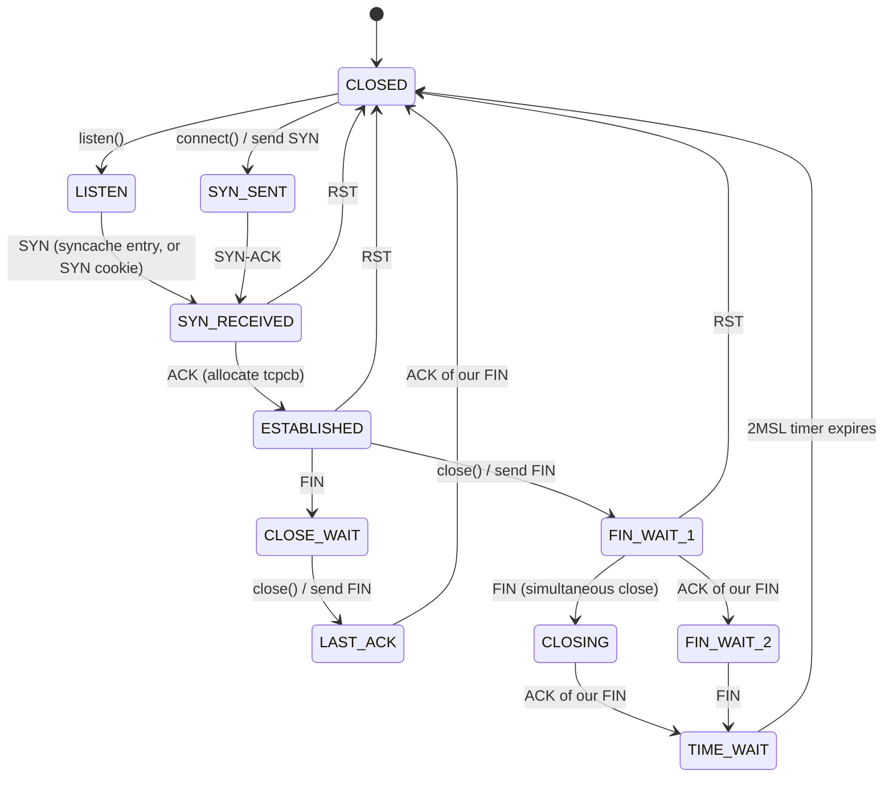

# Transport Protocols — inpcb, tcpcb, TCP State Machine, UDP
<!-- This file is auto-generated by generate-doc.py -- do not edit manually -->

---
**Navigation:**
  **Up:** [Kernel Core — Structure and Entry Point](../README.md) ▸ [Source Tree — Layout and Conventions](../../README_internals.md)
  **Related:** [Network Stack — Architecture and Packet Flow](../net/README.md) | [VNET — Virtual Network Stacks](../net/README_vnet.md) | [mbuf — Network Buffer Allocation and Chaining](../sys/README_mbuf.md) | [IP Layer — IPv4, IPv6, Forwarding, FIB, and nhop](README_ip.md)
  **All chapters:** [Source Tree — Layout and Conventions](../../README_internals.md) | [Boot Process — UEFI Bootloader to Kernel Handoff](../../stand/efi/loader/README.md) | [Kernel Core — Structure and Entry Point](../README.md) | [Build System — buildworld and buildkernel](../../share/mk/README.md) | [System Calls and Image Activation — Entry, sysent, and exec](../kern/README_syscall.md) | [Kernel Modules and the Linker — KLD, SYSINIT, and linker sets](../kern/README_kld.md) | [Virtual Memory Subsystem — vm_page, UMA, and Pagers](../vm/README.md) | [Process Management — Scheduling and Lifecycle](../kern/README_process.md) ...
---


## Quick Summary

At layer 4 the kernel's job is to take a stream of IP packets and turn them into
per-socket [state](../netpfil/pf/README.md#glossary). FreeBSD does this with two cooperating structures. `struct
[inpcb](#glossary)` is the protocol-independent half: it records the socket's [four-tuple](#glossary)
(local/remote address and port, plus the [FIB](README_ip.md#glossary)), owns the socket reference, and —
crucially — is what gets hashed into the global inpcb hash tables. Those tables
are the demux: an incoming TCP or UDP packet is looked up by its four-tuple and
the matching socket is returned without any per-connection hop table. Every
protocol that binds to an IP port — TCP, UDP, raw IP, divert — reuses the same
`inpcb`, which is why `in_pcb.c` is shared by all of them.

`struct tcpcb` hangs off the `inpcb` as its `ppcb` (private protocol control
block) and carries everything TCP-specific: the send/receive sequence space, the
RTT estimator, the congestion window and slow-start threshold, the timers, and
the current state-machine state. UDP, by contrast, has almost no per-connection
state at all — `struct udpcb` is a thin wrapper that mostly just points back at
its `inpcb` — which is why `udp_usrreq.c` is a fraction the size of the TCP
files and can lean on `in_pcb.c` for nearly all of its work.

The TCP state machine lives in `tcp_input.c`. It validates each incoming header,
then branches on the current state: a `LISTEN` socket routes SYNs through the
[syncache](#glossary) (a small fixed entry, or a stateless [SYN cookie](#glossary) when that overflows) so
a SYN flood cannot exhaust memory; an `ESTABLISHED` socket processes data, ACKs,
fast retransmits, and SACK (Selective ACK, a TCP option that acknowledges
out-of-order blocks) blocks. The send side, `tcp_output.c`, decides each
call whether a segment should actually be emitted or held ([Nagle](#glossary), delayed ACK,
push), and how long to make it ([MSS](#glossary), [TSO](#glossary) offload). `tcp_timer.c` drives the
retransmit, persist, keepalive, and 2MSL timers through the kernel [callout](#glossary)
facility. Finally, congestion control is pluggable: the `cc_algo` KPI (kernel
provider interface, FreeBSD's term for a module function-pointer table) in
`sys/netinet/cc/cc.h` lets CUBIC (the default), NewReno, DCTCP (Data Center TCP, a
congestion controller using ECN (Explicit Congestion Notification, a TCP/IP
mechanism where routers set a congestion mark in the IP header instead of
dropping the packet) marks), HTCP (Hybrid TCP, a congestion
controller blending Reno and AIMD), and CDG (Congestion-Delay Gradient, a
delay-based congestion controller) swap in per-connection window logic, and the
wider `tcp_function_block` KPI lets RACK (Recent Acknowledgment, a
timestamp-based loss-detection algorithm) and BBR (Bottleneck Bandwidth and
Round-trip propagation time, a model-based congestion controller) replace the
entire input/output/timer state machine, not just the window controller.

## Glossary

**inpcb** — the Internet Protocol Control Block; the kernel structure that binds a socket to an IP address/port pair and is hashed for packet demux.

**ppcb** — the private protocol control block pointer inside an `inpcb`; for TCP it points at the `tcpcb`, for UDP at the `udpcb`.

**four-tuple** — the (local address, local port, remote address, remote port) key used to identify a connection and to index the inpcb hash.

**syncache** — a small fixed-size cache of half-open (SYN-received) connections that stands in for a full `tcpcb` so a SYN flood cannot exhaust memory.

**SYN cookie** — a stateless fallback in which the listening socket encodes the connection's key parameters into the SYN-ACK's initial sequence number, so the server holds no per-half-open state at all.

**MSS** — maximum segment size; the largest TCP payload a segment may carry, derived from the path MTU.

**TSO** — TCP Segmentation Offload; the NIC slices one large buffer into MSS-sized segments, so the kernel hands it a single oversized mbuf.

**Nagle** — the rule that a small unacknowledged segment is held back until the previous one is ACKed or a full-sized segment is ready, to avoid flooding the network with tiny packets.

**2MSL** — twice the maximum segment lifetime; the quiet interval a connection keeps its `tcpcb` in `TIME_WAIT` so delayed segments from the old incarnation cannot corrupt the next one.

**callout** — the kernel's one-shot timer facility ([`callout(9)`](../../share/man/man9/callout.9)); a function scheduled to run once after a given delay, used to drive every TCP timer.

## Architecture

The split between `inpcb` and `tcpcb` is the organizing idea of the whole
chapter. `struct inpcb` (defined in `sys/netinet/in_pcb.h`, implemented in
`sys/netinet/in_pcb.c`) is deliberately protocol-agnostic. It stores the
four-tuple — through the embedded `struct in_conninfo` / `struct in_endpoints`
— the socket it belongs to, its reference count, the FIB number, and the pointer
`inp_ppcb` to the protocol-specific block. Because the four-tuple and the hash
insertion live here, every IP-port protocol gets demux for free: `in_pcblookup()`
(`sys/netinet/in_pcb.c`) hashes the incoming packet's addresses and ports and
walks the matching bucket to return the owning `inpcb`.

TCP adds `struct tcpcb` (`sys/netinet/tcp_var.h`, helpers in
`sys/netinet/tcp_subr.c`) on top. The `tcpcb` is allocated by `tcp_subr.c` and
stashed in `inp_ppcb`; it owns the sequence space (`snd_una`/`snd_max` on the
send side, `rcv_nxt` on the receive side), the RTT estimator, the congestion
window and slow-start threshold, the `t_state` field that holds the current
`TCPS_*` state, and the `t_callout`/`t_timers[]`/`t_precisions[]` fields that
`tcp_timer.c` uses to arm the timers. UDP's `struct udpcb`
(`sys/netinet/udp_var.h`) is the opposite extreme — it is essentially a pointer
back to its `inpcb` plus a couple of flags, which is why `udp_usrreq.c` is so
small: nearly all of its logic (bind, connect, lookup, free) is already in
`in_pcb.c`.

The input path is split into three files. `tcp_input.c` owns the state machine
and the syncache interaction; `tcp_syncache.c` owns the half-open cache and the
SYN-cookie encode/decode; `tcp_output.c` owns the send side; and `tcp_timer.c`
owns the timers. Where `tcp_input` is called from (the IP layer's protocol
dispatch, RSS steering, IPsec) belongs to the IP Layer chapter; this chapter
starts at the point where a validated TCP header and its payload [mbuf](../sys/README_mbuf.md#glossary) arrive at
`tcp_input()`.

## Key Data Structures

The four-tuple is stored in a small, cache-friendly struct that is shared by the
inpcb and (by reference) by the syncache. From `sys/netinet/in_pcb.h`:

```c
struct in_conninfo {
	uint8_t		inc_flags;
	uint8_t		inc_len;
	uint16_t	inc_fibnum;
	struct in_endpoints {
		uint16_t	ie_fport;		/* foreign port */
		uint16_t	ie_lport;		/* local port */
		union in_dependaddr {
			struct {
				uint32_t __pad[3];
				struct in_addr id4_addr;
			};
			struct in6_addr	id6_addr;
		} ie_dependfaddr, ie_dependladdr;
#define	ie_faddr	ie_dependfaddr.id4_addr
#define	ie_laddr	ie_dependladdr.id4_addr
#define	ie6_faddr	ie_dependfaddr.id6_addr
#define	ie6_laddr	ie_dependladdr.id6_addr
		uint32_t	ie6_zoneid;		/* scope zone id */
	} inc_ie;
};
```

Note the `union in_dependaddr`: the same storage is either an IPv4 address (with
padding so the union is 16 bytes) or an IPv6 address, which is how one `inpcb`
can serve both families. The header carries an explicit warning that
`tcp_syncache.c` uses the first five 32-bit words (the ports and foreign
address) to generate its hash, so these fields "shouldn't be moved" — a good
example of a layout constraint imposed by a second consumer of the struct.
Convenience macros in the same header let code write `inp_fport`, `inp_lport`,
`inp_faddr`, `inp_laddr` (and the `in6p_*` forms) instead of reaching through
`inp_inc.inc_ie`.

The `tcpcb` (`sys/netinet/tcp_var.h`) is where all TCP state lives. The fields
that matter for this chapter, as surfaced by the header, include the send
pointers `snd_una` (oldest unacknowledged byte) and `snd_max`, the negotiated
` t_maxseg` (MSS), the current `t_state`, and the timer machinery `t_callout`,
`t_timers[TT_N]`, and `t_precisions[TT_N]` — one callout plus a per-timer
active flag and a precision value, indexed by the `TT_*` timer id (retransmit,
persist, keepalive, delayed-ACK, 2MSL). The congestion window, slow-start
threshold, and RTT/RTT-var estimators live here too, as do the SACK bookkeeping
structures (`sackhole`, `sackhint`) referenced by the input path.

The congestion-control KPI is `struct cc_algo` (`sys/netinet/cc/cc.h`). Each
module fills in a table of function pointers and a name, and the stack calls
into that table on each relevant event. The per-connection scratch space the
stack passes to a module is `struct cc_var` (also in `sys/netinet/cc/cc.h`):

```c
struct cc_var {
	void		*cc_data; /* Per-connection private CC algorithm data. */
	int		bytes_this_ack; /* # bytes acked by the current ACK. */
	tcp_seq		curack; /* Most recent ACK. */
	uint32_t	flags; /* Flags for cc_var (see below) */
	struct tcpcb	*tp; /* Pointer to tcpcb */
	uint16_t	nsegs; /* # segments coalesced into current chain. */
	uint8_t		labc;  /* Dont use system abc use passed in */
};
```

`cc_data` points at the module's own per-connection state (sized by the module's
`cc_data_sz()`), and `tp` is the back-pointer to the `tcpcb` so the module can
read and write `snd_cwnd`, `t_rtt`, and friends. The wider modular-stack KPI is
`struct tcp_function_block` (`sys/netinet/tcp_var.h`), whose first field is
`tfb_tcp_block_name[TCP_FUNCTION_NAME_LEN_MAX]` followed by a table of function
pointers (including `tfb_tcp_output`) that the stack dispatches through instead
of calling `tcp_input`/`tcp_output`/`tcp_timer` directly.

UDP's only truly per-connection structure is the thin `struct udpcb`
(`sys/netinet/udp_var.h`), which begins with `u_inpcb` — a pointer back to the
owning `inpcb` — plus a small set of flags and a tunneled-ICMP callback. The
input/output glue is the overlaid header `struct udpiphdr`:

```c
struct udpiphdr {
	struct ipovly	ui_i;		/* overlaid ip structure */
	struct udphdr	ui_u;		/* udp header */
};
```

and the counters are `struct udpstat`, with fields such as `udps_ipackets`,
`udps_noport`, `udps_badsum`, `udps_fullsock`, and (on the output side)
`udps_fastout` — the "fast path" counter is the one that proves UDP is doing
almost no per-connection work.

## Deep Dive

**Binding and hashing.** When a socket is created and bound, `in_pcballoc()`
(`sys/netinet/in_pcb.c`) allocates the `inpcb` (from a per-protocol [UMA](../vm/README_bcache.md#glossary)
(User-Managed Allocator, the kernel's scalable per-CPU memory allocator) [zone](../vm/README.md#glossary),
chosen over general-purpose kmem because inpcbs are allocated and freed at high
frequency on the packet fast path and benefit from per-CPU caching), and
`in_pcbbind()` / `in_pcbbind_setup()` fill in the local address and port,
choosing an ephemeral port from the `ipport_firstauto`..`ipport_lastauto` range
if the caller asked for port 0. `in_pcbinshash()` then inserts the `inpcb` into
the global hash keyed by the four-tuple. A `LISTEN`/wildcard socket is inserted
with the foreign address/port zeroed so it matches any peer; an established
socket is inserted with the full four-tuple. `in_pcblookup()` is the inverse:
given a packet's four-tuple it computes the same hash, walks the bucket, and
returns the matching `inpcb` (taking a reference so it survives reclamation).
This is the entire demux — no per-connection table, just a hash [probe](../kern/README_driver.md#glossary).

**tcp_input.c — the state machine.** `tcp_input()` (and its port-steered
variant `tcp_input_with_port()`) is the entry point. It first validates the
header (minimum length, options, checksum already checked upstream), then does
the `in_pcblookup()` for the four-tuple. If no exact match exists and the packet
is a SYN to a listening port, it hands the SYN to the syncache. Otherwise it
dispatches on `tp->t_state`. The state constants come from
`sys/netinet/tcp_fsm.h`:

```c
#define	TCPS_CLOSED		0	/* closed */
#define	TCPS_LISTEN		1	/* listening for connection */
#define	TCPS_SYN_SENT		2	/* active, have sent syn */
#define	TCPS_SYN_RECEIVED	3	/* have sent and received syn */
#define	TCPS_ESTABLISHED	4	/* established */
#define	TCPS_CLOSE_WAIT		5	/* rcvd fin, waiting for close */
#define	TCPS_FIN_WAIT_1		6	/* have closed, sent fin */
#define	TCPS_CLOSING		7	/* closed xchd FIN; await FIN ACK */
#define	TCPS_LAST_ACK		8	/* had fin and close; await FIN ACK */
#define	TCPS_FIN_WAIT_2		9	/* have closed, fin is acked */
#define	TCPS_TIME_WAIT		10	/* in 2*msl quiet wait after close */
```

In `LISTEN` there is no `tcpcb` yet; the interesting work is deciding whether to
accept the SYN (and via the syncache, how to record it). In `SYN_RECEIVED` the
stack is completing the three-way handshake and, on the final ACK, allocates the
real `tcpcb` and moves to `ESTABLISHED`. In `ESTABLISHED` the bulk of the code
runs: it advances `rcv_nxt` for in-order data, records SACK blocks for
out-of-order data, processes the ACK (advancing `snd_una`, updating the RTT via
the module's RTT [hook](../netgraph/README.md#glossary), and calling the congestion controller's
`cc_ack_received()`), and on three duplicate ACKs triggers fast retransmit. The
FIN/ACK combinations that drive the close (`FIN_WAIT_1`, `CLOSING`, `LAST_ACK`,
`FIN_WAIT_2`, `TIME_WAIT`) are handled in the same function but in separate
branches keyed by `t_state`.

**The syncache and SYN cookies.** A listening socket that accepts a SYN normally
would allocate a `tcpcb` per half-open connection — exactly what a SYN flood
exploits. `tcp_syncache.c` instead stores each pending SYN in a compact
`struct syncache` entry inside a small fixed-size hash (sized by
`tcp_syncache_limit`), reusing the four-tuple hashing from `in_conninfo`. When
the cache is full, the stack falls back to stateless SYN cookies: the listen
socket encodes the key parameters (a hash of the four-tuple plus a timestamp)
into the SYN-ACK's initial sequence number, guarded by the `V_tcp_syncookies`
sysctl (default on) and `V_tcp_syncookiesonly`. On the completing ACK the cookie
is decoded and validated; if it checks out, the real `tcpcb` is built from the
information recovered out of the sequence number. The result is that a flood of
SYNs that never complete allocates nothing.

**tcp_output.c — the send side.** `tcp_output()` is called whenever there is a
reason to consider sending: new data in the send buffer, a window update, a
retransmit timer, a FIN to send, or a forced push. Each call it re-derives the
segment length: it is bounded by the send buffer, the peer's advertised window
(`rcv_wnd`), the congestion window (`snd_cwnd`), and the MSS (`t_maxseg`). If
TSO is enabled (`V_tcp_do_tso`, default on) and the NIC supports it, the kernel
may hand down a single oversized mbuf up to the offload limit and let the
hardware slice it. The "should I actually emit now, or wait" decision is where
Nagle and delayed-ACK logic live: a small segment may be held if a larger one is
coalescable or if the previous segment is unacknowledged, while a `push` flag
forces emission. `tcp_addoptions()` appends the TCP options (timestamps, SACK
blocks, window scale) and `tcp_sndbuf_autoscale()` may grow the send buffer
before the segment is built.

**tcp_timer.c — the timers.** All TCP timers are one-shot [`callout(9)`](../../share/man/man9/callout.9) entries
armed and disarmed from `tcp_timer.c`. The header `sys/netinet/tcp_timer.h`
documents the four classic timers and their semantics:

```c
/*
 * The TCPT_REXMT timer is used to force retransmissions. ...
 * The TCPT_PERSIST timer is used to keep window size information
 * flowing even if the window goes shut. ...
 * The TCPT_KEEP timer is used to keep connections alive. ...
 */
```

`tcp_timer_rexmt()` retransmits the oldest unacknowledged segment and backs off
the RTO; `tcp_timer_persist()` probes a zero window (sending a 1-byte "window
probe" if the window is still shut); `tcp_timer_keep()` sends the keepalive
probe `<SEQ=SND.UNA-1><ACK=RCV.NXT><CTL=ACK>` and, after too many missed probes,
resets the connection; and `tcp_timer_2msl()` expires a `TIME_WAIT` connection
after twice the maximum segment lifetime, freeing the `tcpcb`. `tcp_timer_next()`
picks the earliest of the active timers and (re)arms the single `t_callout`,
while `tcp_timer_activate()`/`tcp_timer_stop()` manage the per-timer active
flags. The RTO and keepalive intervals are tunable through sysctls declared at
the top of the file (`tcp_persmin`, `tcp_persmax`, `tcp_keepinit`,
`tcp_keepidle`, `tcp_keepintvl`, `tcp_delacktime`, and the VNET-scoped
`tcp_msl` (VNET: virtual network, FreeBSD's per-namespace network-stack
isolation)).

**Pluggable congestion control.** The stack never implements a window algorithm
inline; it calls the `cc_algo` table. On connection setup `cc_conn_init()` is
called to size and zero the module's `cc_data`; on each ACK the stack calls
`cc_ack_received()` (which is where `snd_cwnd`/`t_ssthresh` move); on a loss
signal (RTO, fast retransmit) it calls `cc_cong_signal()`; and on recovery or
idle it calls `cc_post_recovery()` / `cc_after_idle()`. ECN handling goes through
`cc_ecnpkt_handler()`. The module list is a VNET-scoped `STAILQ` (`cc_list`)
protected by `cc_list_lock`, and `cc_register_algo()` / `cc_deregister_algo()`
add and remove entries. The default is selected by the
`net.inet.tcp.cc.algorithm` sysctl (falling back to the first registered
module, which is `cubic` unless `CC_DEFAULT` overrides it). The production
modules under `sys/netinet/cc/` are one-line plug-ins of this KPI: CUBIC
(`cc_cubic.c`, the default), NewReno (`cc_newreno.c`), DCTCP (`cc_dctcp.c`),
HTCP (`cc_htcp.c`), CDG (`cc_cdg.c`), plus Hamilton (`cc_hd.c`) and Vegas
(`cc_vegas.c`).

**Modular stacks — the wider KPI.** `cc_algo` only replaces the window logic;
the TCP state machine itself is hardwired in `tcp_input.c`/`tcp_output.c`.
`struct tcp_function_block` goes further: a stack like RACK
(`sys/netinet/tcp_stacks/tcp_rack.h`) or BBR (`tcp_bbr.h`) registers a block of
function pointers (including `tfb_tcp_output`) that the core dispatches
through, so the entire input/output/timer path — loss detection, retransmit
policy, and the window algorithm together — is swappable as a unit. The lookup
helpers `find_and_ref_tcp_fb()` / `find_tcp_fb_locked()` resolve a stack by name
to a `tcp_function_block`, and a per-`tcpcb` field selects which block a given
connection uses. This is strictly wider scope than `cc_algo`, because RACK and
BBR change how the stack decides *what to retransmit and when*, not just how the
congestion window moves.

**UDP — almost no state.** `udp_usrreq.c` implements the `pr_usrreq` entry
points (`PRU_BIND`, `PRU_CONNECT`, `PRU_SEND`, `PRU_RCVMMSG`, etc.) but defers
the heavy lifting to `in_pcb.c`: binding is `in_pcbbind()`, the send path is
`udp_send()` (which builds the UDP/IP header and calls `ip_output`), and the
receive path is `udp_input()` doing an `in_pcblookup()` on the four-tuple and
then queuing the datagram to the socket. The only UDP-specific state is the
`udpcb` (pointer back to the `inpcb`, a tunneled-ICMP flag, and an optional
`u_tun_func`). Checksumming is controlled by the `V_udp_cksum` sysctl (default
on). The net effect is that UDP is a thin protocol layer over the inpcb
infrastructure, which is exactly why it is so much smaller than TCP.

## Flow / Diagram

The TCP connection state machine as driven by `tcp_input.c`, with the syncache
standing in for the `tcpcb` during the half-open phase:



## Advanced Notes

**Debugging.** The inpcb and tcpcb are the two objects to dump when a
connection misbehaves. `netstat(8)` walks the inpcb hash to print the four-tuple
and state; the [DDB](../kern/README_kdb.md#glossary) `db_print_inpcb()` helper (in `sys/netinet/in_pcb.c`) and the
`tcpstates[]` string table in `tcp_fsm.h` give human-readable state names. The
SDT probes defined in `sys/netinet/in_kdtrace.h` (fired from `tcp_input.c`,
`tcp_output.c`, and `tcp_timer.c`) let DTrace trace segment send/receive,
retransmits, and state transitions without recompiling. For congestion-control
behavior, the per-algorithm `*_log_*` functions (e.g. `cubic_log_hystart_event()`)
feed the TCP blackbox log when `TCP_BLACKBOX` is enabled.

**Locking and races.** The inpcb hash is guarded by a per-bucket rwlock plus a
shared-memory-reclamation (SMR) reader protocol, so `in_pcblookup()` can run
under a reader lock while a writer removes a bucket; a reference
(`in_pcbref()`/`in_pcbrele()`) keeps the `inpcb` alive across the lookup. The
`tcpcb` is protected by the socket's lock for most operations, but the timer
path (`tcp_timer.c`) re-acquires it via `tcp_timer_enter()`, which is why the
timers are careful to re-check state after taking the lock — a segment can be
ACKed between the callout firing and the lock being held. The syncache is
separately locked and sized independently of the inpcb hash, so a SYN flood
pressures the syncache, not the connection table.

**Performance.** The four-tuple hash is the hot path for every packet; keeping
`in_conninfo` small and cache-line friendly (and not moving the first five
32-bit words, per the header's warning) matters for the syncache's hash as much
as for the inpcb's. TSO (`V_tcp_do_tso`) and the send-buffer autoscaling
(`tcp_sndbuf_autoscale()`) exist to cut per-segment kernel work; the
`udps_fastout` counter is the metric for UDP's low-overhead send path. The
congestion controller is invoked on every ACK, so its `cc_data` is kept in a
single cache line and the module's `cc_data_sz()` is deliberately small.

**Pitfalls.** A common mistake is to assume the `tcpcb` always exists for a
listening socket — it does not; the syncache entry is the stand-in until the
handshake completes, and SYN cookies mean even that can be absent. Another is to
conflate `cc_algo` with the full modular stack: swapping a `cc_algo` changes
only the window, while RACK/BBR via `tcp_function_block` change loss detection
and retransmit policy as well, so a module written against the `cc_algo` KPI
cannot express RACK's time-based loss detection without moving to the function
block. Finally, the 2MSL `TIME_WAIT` hold is not a leak — it is required so that
delayed segments from the old connection cannot be misread by the next one that
reuses the four-tuple; tuning `tcp_msl` trades that safety for faster port
reuse.

**Theory connection.** The inpcb/tcpcb split is the classic "protocol
independent / protocol dependent" PCB decomposition from the TCP/IP textbooks
(e.g. Stevens, *TCP/IP Illustrated, Vol. 1*): the four-tuple and the
demux hash are shared by every IP-port protocol, while the per-protocol state
lives in a separate block. The syncache and SYN cookies are the standard
defense against SYN-flood resource exhaustion (RFC 4987), and the pluggable
`cc_algo`/`tcp_function_block` KPIs are FreeBSD's answer to the long-running
problem that congestion control and loss detection evolve faster than the rest
of the stack — making them replaceable modules rather than a fixed part of
`tcp_input.c`.

## See Also
- [Network Stack — Architecture and Packet Flow](../net/README.md)
- [IP Layer — IPv4, IPv6, Forwarding, FIB, and nhop](README_ip.md)
- [mbuf — Network Buffer Allocation and Chaining](../sys/README_mbuf.md)
- [VNET — Virtual Network Stacks](../net/README_vnet.md)


- IP Layer chapter — where `tcp_input()` and `udp_input()` are called from, RSS
  steering, and IPsec; the v4-vs-v6 input differences.
- mbuf chapter — mbuf chains, `m_pullup`, and `pkthdr`, which the TCP send/receive
  paths build on.
- [`sys/netinet/in_pcb.c`](in_pcb.c) and [`sys/netinet/in_pcb.h`](in_pcb.h) — the inpcb, its hash, and
  the shared bind/lookup/free logic.
- [`sys/netinet/tcp_input.c`](tcp_input.c), `tcp_output.c`, `tcp_timer.c`, `tcp_subr.c`,
  `tcp_syncache.c` — the TCP state machine, send side, timers, and half-open
  cache.
- [`sys/netinet/cc/`](cc) — the `cc_algo` KPI (`cc.h`, `cc.c`) and the CUBIC, NewReno,
  DCTCP, HTCP, CDG, Hamilton, and Vegas modules.
- [`sys/netinet/tcp_stacks/`](tcp_stacks) — the `tcp_function_block` KPI and the RACK and BBR
  modular stacks.
- [`sys/netinet/udp_usrreq.c`](udp_usrreq.c) and `udp_var.h` — the thin UDP layer over inpcb.
- Man pages: `in_pcb(9)`, [`mod_cc(9)`](../../share/man/man9/mod_cc.9), [`callout(9)`](../../share/man/man9/callout.9), [`tcp(4)`](../../share/man/man4/tcp.4), [`udp(4)`](../../share/man/man4/udp.4).

---

> _Generated by [DaemonDocs](https://github.com/ocochard/DaemonDocs) on 2026-09-01 07:38 UTC using model `Qwen3.8-27B-Q8_0` (llama.cpp build `b10553-cd26896c1`). AI-generated content — verify against source before relying on it._
