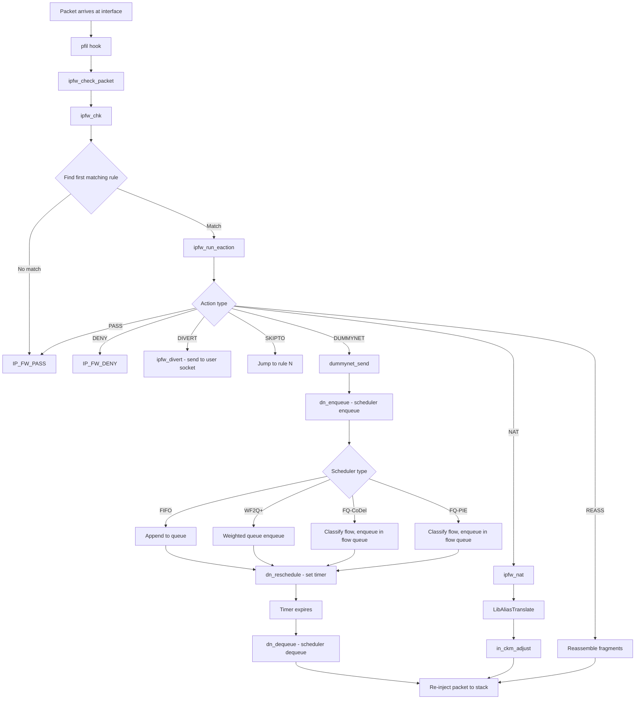

# ipfw and dummynet — Native Firewall and Traffic Shaper
<!-- This file is auto-generated by generate-doc.py -- do not edit manually -->

---
**Navigation:**
  **Up:** [Kernel Core — Structure and Entry Point](../../README.md) ▸ [Source Tree — Layout and Conventions](../../../README_internals.md)
  **Related:** [Network Stack — Architecture and Packet Flow](../../net/README.md) | [VNET — Virtual Network Stacks](../../net/README_vnet.md) | [pf — OpenBSD-derived Packet Filter](../pf/README.md)
  **All chapters:** [Source Tree — Layout and Conventions](../../../README_internals.md) | [Boot Process — UEFI Bootloader to Kernel Handoff](../../../stand/efi/loader/README.md) | [Kernel Core — Structure and Entry Point](../../README.md) | [Build System — buildworld and buildkernel](../../../share/mk/README.md) | [Virtual Memory Subsystem — vm_page, UMA, and Pagers](../../vm/README.md) | [Process Management — Scheduling and Lifecycle](../../kern/README_process.md) | [Locking Primitives — Mutexes, sx, rmlocks, and Atomics](../../kern/README_locking.md) | [Buffer Cache — Block I/O Subsystem](../../vm/README_bcache.md) ...
---


> ⚠ **UNVERIFIED DRAFT** — revision 1 truncated — kept prior draft; reviewer did not explicitly approve this draft. Treat claims as suspect until manually reviewed.


## Quick Summary

FreeBSD's `ipfw` (IP firewall) is a stateful packet inspection framework that combines filtering, NAT, and traffic shaping in a single subsystem. Unlike `pf`, which uses a last-match policy, `ipfw` applies the first matching rule and stops — a model that mirrors classic BSD packet filters but with far richer capabilities. `ipfw` attaches to the `pfil` hook framework, the same mechanism used by `pf`, to intercept packets at the input and output paths of the network stack. Its rule set is stored in-kernel as a sorted chain, and lookups are accelerated by a hash/radix table for efficient rule references.

Coupled with `ipfw` is `dummynet`, a traffic-shaping and Active Queue Management (AQM) subsystem. When an `ipfw` rule matches a packet and specifies a `pipe` action, the packet is diverted into `dummynet`'s internal queueing discipline. `dummynet` organizes traffic into pipes (which hold schedulers), queues, and flow classes. Packets are enqueued, shaped according to bandwidth and buffer limits, and re-injected back into the network stack. `dummynet` supports FIFO, WF2Q+, FQ-CoDel, and FQ-PIE schedulers, making it a full-featured alternative to Linux's `tc`/`fq_codel` or OpenBSD's `pf` rate limiting.

`ipfw` also provides in-kernel NAT via `libalias`, a modular address-translation library. NAT in `ipfw` is configured per-interface and maintains stateful mappings for port redirections and spool-based address pools. Dynamic state tracking — another `ipfw` feature — automatically creates temporary states for protocols like FTP or SIP, enabling stateful filtering without manual state rules.

Together, `ipfw` and `dummynet` form a unified firewall-shaping stack that has been part of FreeBSD since the late 1990s. While `pf` has gained popularity for its declarative rule language and last-match semantics, `ipfw` remains the only native FreeBSD solution that combines stateful filtering, NAT, and traffic shaping in a single subsystem.

## Architecture

### The pfil Hook and Packet Entry Path

`ipfw` registers itself as a `pfil_hook` on both the input and output paths. The registration is performed in `sys/netpfil/ipfw/ip_fw_pfil.c`:

```c
static pfil_hook_t *ipfw_in6_hook;
static pfil_hook_t *ipfw_in_hook;
static pfil_hook_t *ipfw_out6_hook;
static pfil_hook_t *ipfw_out_hook;
```

Each hook is associated with a function pointer (`ipfw_chk`) that the `pfil` framework calls for every traversing packet. The `pfil` framework is architecture-neutral and used by both `pf` and `ipfw`. When `pf` and `ipfw` are loaded simultaneously, they are attached to different pfil hook orderings — `pf` hooks are typically registered first (lower ordering value), meaning `pf` runs before `ipfw` on the same path. This ordering is configurable at load time via module parameters.

The entry function `ipfw_chk()` (`sys/netpfil/ipfw/ip_fw2.c`) receives an `ip_fw_args` structure, initializes the rule reference, and begins rule evaluation:

```c
static pfil_return_t
ipfw_check_packet(struct mbuf **m0, struct ifnet *ifp, int flags,
    void *ruleset __unused, struct inpcb *inp)
{
	struct ip_fw_args args;
	struct m_tag *tag;
	pfil_return_t ret;
	int ipfw;

	args.flags = (flags & PFIL_IN) ? IPFW_ARGS_IN
	    : IPFW_ARGS_OUT;
	/* ... */
	ret = ipfw_chk(&args, m0);
	/* ... */
	return ret;
}
```

### Rule Evaluation: First-Match Semantics

The core rule evaluation loop is in `ipfw_chk()` (`sys/netpfil/ipfw/ip_fw2.c`). Rules are stored in a sorted chain (`struct ip_fw_chain`), and the lookup is performed inline within `ipfw_chk()` using a radix/hash-based algorithm to find the first matching rule. Unlike `pf`, which scans all rules and keeps the last match, `ipfw` stops at the first match:

```c
enum {
	IP_FW_PASS = 0,
	IP_FW_DENY,
	IP_FW_DIVERT,
	IP_FW_DUMMYNET,
	IP_FW_NETGRAPH,
	IP_FW_NGTEE,
	IP_FW_NAT,
	IP_FW_REASS,
	IP_FW_NAT64,
};
```

These return values from `ipfw_chk()` determine the disposition of the packet. `IP_FW_PASS` and `IP_FW_DENY` are the basic allow/deny actions. `IP_FW_DIVERT` sends the packet to a user-space divert socket (often used for transparent proxying). `IP_FW_DUMMYNET` routes the packet to `dummynet` for shaping. `IP_FW_NAT` triggers address translation via `libalias`. `IP_FW_REASS` reassembles fragmented packets before further inspection.

### Control Flow: divert and skipto

`ipfw` provides several control-flow primitives that alter the normal rule-evaluation sequence:

- **divert**: Sends the packet to a user-space socket on a specified port. The packet is consumed by the kernel and never reaches its destination unless the user-space application reinjects it.
- **skipto**: Jumps to a specified rule number, skipping intermediate rules. This enables modular rule design where common checks are grouped and then execution continues at a different point.

These primitives are implemented in `sys/netpfil/ipfw/ip_fw2.c` via the `eaction_obj` structures and the `ipfw_run_eaction()` function, which dispatches to the appropriate handler based on the action type.

### Dynamic State Tracking

`ipfw` maintains dynamic states for stateful protocols. These states are stored in hash tables (`dyn_ipv4`, `dyn_ipv6`, `dyn_ipv4_parent`, `dyn_ipv6_parent`) as described in `sys/netpfil/ipfw/ip_fw_dynamic.c`. When a packet matches a rule with the `keep-state` option, `ipfw` creates a temporary state entry that allows return traffic to pass without matching an explicit rule. States expire after a configurable timeout (`dyn_*_lifetime` sysctls) or when the connection terminates.

The dynamic state system uses `dyn_classify()` to match incoming packets against existing states, and `dyn_add_ipv4_state()` / `dyn_add_ipv6_state()` to create new entries. Parent states track the original rule that created the state, enabling proper cleanup when the parent rule is deleted.

### In-Kernel NAT

`ipfw`'s NAT implementation is built on `libalias`, a modular address-translation library. The configuration structures (`cfg_nat`, `cfg_redir`, `cfg_spool`) are defined in `sys/netpfil/ipfw/ip_fw_nat.c`. NAT is configured per-interface and maintains stateful mappings for port redirections and spool-based address pools.

The `cfg_nat` structure holds a `libalias` instance per interface, along with chains of redirections (`cfg_redir`) and spool entries (`cfg_spool`). When a packet matches a NAT rule, `ipfw_nat()` is called, which delegates to `libalias` for address and port translation. Checksums are adjusted using `in_ckm_adjust()` to reflect the changed addresses.

NAT in `ipfw` differs from `pf`'s NAT in several ways: `pf` uses a declarative syntax with `nat` and `rdr` rules that are evaluated with last-match semantics, while `ipfw` uses explicit rule numbers and first-match semantics. `ipfw`'s NAT is tightly integrated with its stateful filtering — the `keep-state` option automatically creates states for NATted connections, whereas `pf` requires separate `match state` rules.

### dummynet: Traffic Shaping and AQM

`dummynet` is a separate subsystem that `ipfw` drives. When a rule specifies a `pipe` action, the packet is passed to `dummynet` via `dummynet_send()` in `sys/netpfil/ipfw/ip_dn_io.c`. `dummynet` organizes traffic hierarchically:

- **Pipes** are the top-level containers that hold a scheduler.
- **Schedulers** (FIFO, WF2Q+, FQ-CoDel, FQ-PIE, etc.) determine the order in which packets are dequeued.
- **Queues** hold packets waiting to be transmitted.
- **Flow classes** (in fair-queuing schedulers) group packets by flow for per-flow fairness.

The scheduler API is defined in `sys/netpfil/ipfw/dn_sched.h` via the `dn_alg` structure, which contains function pointers for `enqueue`, `dequeue`, `config`, `destroy`, and other operations. Each scheduler module registers itself with the global `schedlist` via `dn_sched_modevent()`.

When a packet is enqueued, `dn_enqueue()` is called, which dispatches to the scheduler's `enqueue` method. The scheduler places the packet in an appropriate queue or flow. When the scheduler can transmit, `dn_dequeue()` is called, which invokes the scheduler's `dequeue` method to retrieve the next packet. The packet is then re-injected into the network stack via `ip_output()` or the appropriate input handler.

`dummynet` also supports Active Queue Management (AQM) algorithms like CoDel and PIE, implemented in `dn_aqm_codel.c` and `dn_aqm_pie.c`. These algorithms proactively drop or mark packets when queues grow, preventing bufferbloat and reducing latency.

## Key Data Structures

### `struct ip_fw_args`
Defined in `sys/netpfil/ipfw/ip_fw_private.h`, this structure collects all parameters for packet inspection:

```c
struct ip_fw_args {
	uint32_t		flags;
#define	IPFW_ARGS_ETHER		0x00010000	/* valid ethernet header */
#define	IPFW_ARGS_NH4		0x00020000	/* IPv4 next hop in hopstore */
#define	IPFW_ARGS_NH6		0x00040000	/* IPv6 next hop in hopstore */
#define	IPFW_ARGS_IN		0x00400000	/* called on input */
#define	IPFW_ARGS_OUT		0x00800000	/* called on output */
	struct ipfw_rule_ref	rule;	/* match/restart info		*/
	struct ifnet		*ifp;	/* input/output interface	*/
	struct inpcb		*inp;
	/* ... */
};
```

The `flags` field indicates whether the packet is incoming or outgoing, whether it has a valid Ethernet header, and which address family it belongs to. The `rule` field tracks the current position in the rule chain, enabling `skipto` and dynamic rule matching.

### `struct ip_fw_chain`
Defined in `sys/netinet/ip_fw.h`, this structure represents the sorted chain of rules:

```c
struct ip_fw_chain {
	struct ip_fw		*rules;
	uint32_t		id;
	uint32_t		nrules;
	/* hash/radix tables for fast lookup */
	/* ... */
};
```

The `rules` array holds all rules in sorted order. The hash/radix tables accelerate lookups by indexing rules based on their match criteria (source/destination addresses, ports, protocols). This allows `ipfw` to skip non-matching rules without examining every field.

### `struct dn_sch`
Defined in `sys/netinet/ip_dummynet.h`, this structure represents a scheduler instance:

```c
struct dn_sch {
	struct dn_id		oid;
	/* scheduler-specific data */
	/* ... */
};
```

Each scheduler type (FIFO, WF2Q+, FQ-CoDel, etc.) extends this structure with additional fields. The `dn_alg` structure (from `dn_sched.h`) provides the function pointers that implement the scheduling algorithm.

### `struct dn_queue`
Defined in `sys/netpfil/ipfw/ip_dn_private.h`, this is a simple mbuf queue:

```c
struct mq {	/* a basic queue of packets*/
        struct mbuf *head, *tail;
	int count;
};
```

Queues hold packets waiting to be dequeued by the scheduler. In multi-queue schedulers like FQ-CoDel, each flow has its own queue.

### `struct cfg_nat`
Defined in `sys/netpfil/ipfw/ip_fw_nat.c`, this structure holds NAT configuration:

```c
struct cfg_nat {
	LIST_ENTRY(cfg_nat)	_next;
	int			id;
	struct in_addr		ip;
	struct libalias		*lib;
	int			mode;
	LIST_HEAD(redir_chain, cfg_redir) redir_chain;
	char			if_name[IF_NAMESIZE];
	/* ... */
};
```

Each `cfg_nat` instance corresponds to a NAT-enabled interface. The `libalias` pointer holds the translation state, and the `redir_chain` lists port redirections configured for that interface.

## Deep Dive

### Tracing a Packet Through ipfw

When a packet arrives on a network interface, the `pfil` framework calls `ipfw_check_packet()` in `sys/netpfil/ipfw/ip_fw_pfil.c`. This function constructs an `ip_fw_args` structure and calls `ipfw_chk()`:

```c
static pfil_return_t
ipfw_check_packet(struct mbuf **m0, struct ifnet *ifp, int flags,
    void *ruleset __unused, struct inpcb *inp)
{
	struct ip_fw_args args;
	struct m_tag *tag;
	pfil_return_t ret;
	int ipfw;

	args.flags = (flags & PFIL_IN) ? IPFW_ARGS_IN
	    : IPFW_ARGS_OUT;
	args.ifp = ifp;
	args.inp = inp;
	/* ... */
	ret = ipfw_chk(&args, m0);
	/* ... */
	return ret;
}
```

`ipfw_chk()` in `sys/netpfil/ipfw/ip_fw2.c` begins rule evaluation. It first checks if the packet has already been tagged by a previous `pfil` hook (to avoid re-evaluation). It then looks up the first matching rule using the hash/radix table:

```c
pfil_return_t
ipfw_chk(struct ip_fw_args *a, struct mbuf **m)
{
	struct ip_fw_chain *chain = &V_layer3_chain;
	struct ip_fw *f;
	struct ipfw_rule_ref *ref = &a->rule;
	int error;

	/* Check if already processed */
	if (ref->slot > 0 && ref->chain_id == chain->id)
		goto restart;

	/* Find first matching rule */
	f = ipfw_find_rule(chain, a, m);
	if (f == NULL)
		return (IP_FW_PASS);

	/* Execute rule action */
	error = ipfw_run_eaction(a, m, f);
	/* ... */
	return (error);
}
```

The `ipfw_find_rule()` function performs the first-match lookup. It iterates through the sorted rule chain, comparing each rule's match criteria against the packet. When a match is found, the rule's action is executed via `ipfw_run_eaction()`.

### Rule Actions and Control Flow

`ipfw_run_eaction()` dispatches to the appropriate handler based on the rule's action:

```c
static int
ipfw_run_eaction(struct ip_fw_args *a, struct mbuf **m, struct ip_fw *f)
{
	switch (f->action) {
	case IP_FW_PASS:
		return (IP_FW_PASS);
	case IP_FW_DENY:
		return (IP_FW_DENY);
	case IP_FW_DIVERT:
		return (ipfw_divert(m, a, f->divert_port));
	case IP_FW_DUMMYNET:
		return (dummynet_send(m, a, f->pipe_id));
	case IP_FW_NAT:
		return (ipfw_nat(a, m, f->nat_id));
	/* ... */
	}
}
```

For `divert`, the packet is sent to a user-space socket via `ipfw_divert()`. For `dummynet`, the packet is enqueued via `dummynet_send()`. For `nat`, address translation is performed via `ipfw_nat()`.

### dummynet Packet Flow

When a packet is matched by a rule with a `pipe` action, `dummynet_send()` in `sys/netpfil/ipfw/ip_dn_io.c` is called:

```c
int
dummynet_send(struct mbuf *m, struct ip_fw_args *a, int pipe_id)
{
	struct dn_obj *obj;
	struct dn_sch *sch;
	int error;

	/* Find the pipe */
	obj = dn_obj_find(DN_PIPE, pipe_id);
	if (obj == NULL)
		return (IP_FW_DENY);

	sch = &obj->sch;

	/* Enqueue the packet */
	error = sch->alg->enqueue(sch, m);
	if (error) {
		/* Packet dropped by scheduler */
		return (IP_FW_DENY);
	}

	/* Reschedule if needed */
	dn_reschedule();
	return (IP_FW_DUMMYNET);
}
```

`dn_obj_find()` looks up the pipe by ID. The scheduler's `enqueue` method places the packet in an appropriate queue. For FIFO, this is straightforward — the packet is appended to the queue. For WF2Q+, the packet is placed in a weighted queue. For FQ-CoDel, the packet is classified into a flow and enqueued in the flow's queue.

When the scheduler can transmit, `dn_dequeue()` is called, which invokes the scheduler's `dequeue` method:

```c
struct mbuf *
dn_dequeue(struct dn_sch *sch)
{
	struct mbuf *m;

	m = sch->alg->dequeue(sch);
	if (m) {
		/* Update statistics */
		sch->stats.packets++;
		sch->stats.bytes += m->m_pkthdr.len;
	}
	return (m);
}
```

The dequeued packet is then re-injected into the network stack. For output packets, it is passed to `ip_output()`. For input packets, it is re-injected via the appropriate input handler.

### Dynamic State Management

Dynamic states are created when a packet matches a rule with the `keep-state` option. `dyn_add_ipv4_state()` in `sys/netpfil/ipfw/ip_fw_dynamic.c` allocates a state entry and inserts it into the appropriate hash table:

```c
static struct dyn_state_obj *
dyn_add_ipv4_state(struct ip_fw *f, struct ip_fw_args *a, struct mbuf *m)
{
	struct dyn_state_obj *state;
	uint32_t hash;

	/* Allocate state */
	state = dyn_alloc_dyndata(f->proto, AF_INET);
	if (state == NULL)
		return (NULL);

	/* Initialize state from packet */
	dyn_init_state(state, f, a, m);

	/* Hash and insert */
	hash = dyn_hash_state(state);
	dyn_insert_state(state, hash);

	return (state);
}
```

The state is hashed based on its tuple (source/destination addresses, ports, protocol) and inserted into the appropriate hash table. When a return packet arrives, `dyn_lookup_state()` searches the hash table for a matching state. If found, the state is updated and the packet is allowed to pass.

### In-Kernel NAT via libalias

NAT in `ipfw` uses `libalias` for address and port translation. `ipfw_nat()` in `sys/netpfil/ipfw/ip_fw_nat.c` looks up the NAT configuration for the packet's interface and delegates to `libalias`:

```c
int
ipfw_nat(struct ip_fw_args *a, struct mbuf **m, int nat_id)
{
	struct cfg_nat *nat;
	struct libalias *la;
	int error;

	/* Find NAT configuration */
	nat = ipfw_nat_get_cfg(nat_id);
	if (nat == NULL)
		return (IP_FW_DENY);

	la = nat->lib;

	/* Perform translation */
	error = LibAliasTranslate(la, m, a);
	if (error)
		return (IP_FW_DENY);

	/* Adjust checksums */
	in_ckm_adjust(*m);

	return (IP_FW_NAT);
}
```

`LibAliasTranslate()` performs the actual address and port translation based on the configured NAT rules. Checksums are adjusted using `in_ckm_adjust()` to reflect the changed addresses.

## Flow / Diagram



## Advanced Notes

### Debugging with SDT Probes

`ipfw` provides System DTrace Probes (SDT) for runtime tracing. The `rule__matched` probe fires when a rule matches, providing the rule number, address family, source and destination addresses, and the `ip_fw_args` structure:

```c
SDT_PROBE_DEFINE6(ipfw, , , rule__matched,
    "int",			/* retval */
    "int",			/* af */
    "void *",			/* src addr */
    "void *",			/* dst addr */
    "struct ip_fw_args *",	/* args */
    "struct ip_fw *"		/* rule */);
```

DTrace scripts can attach to this probe to monitor rule matching patterns, identify misconfigured rules, or detect suspicious traffic. The `dummynet` subsystem also provides a `drop` probe that fires when a packet is dropped by the scheduler:

```c
SDT_PROBE_DEFINE2(dummynet, , , drop, "struct mbuf *", "struct dn_queue *");
```

### Performance Implications

`ipfw`'s first-match semantics can have significant performance implications. Unlike `pf`, which can optimize rule evaluation by building a decision tree, `ipfw` must scan rules in order until a match is found. This makes rule ordering critical — common rules should be placed early in the chain to minimize evaluation time.

`ipfw` mitigates this with hash/radix tables that accelerate lookups. These tables index rules based on their match criteria, allowing `ipfw` to skip non-matching rules without examining every field. However, the tables add overhead during rule insertion and deletion, so frequent rule changes can impact performance.

`dummynet`'s schedulers also have performance characteristics that depend on the algorithm. FIFO is the fastest but provides no fairness. WF2Q+ provides weighted fairness with moderate overhead. FQ-CoDel and FQ-PIE provide per-flow fairness and AQM but require flow classification and per-flow state, which adds CPU and memory overhead.

### Race Conditions and Locking

`ipfw` uses read-mostly locks (UH locks) for rule chain access, allowing concurrent packet inspection while rule modifications are serialized. Dynamic states are protected by hash-table locks, and `dummynet` uses a global scheduler mutex (`sched_mtx`) to protect scheduler state.

A potential race condition exists when a rule is deleted while packets are being processed. `ipfw` mitigates this by referencing rules via `ipfw_rule_ref` structures that are reference-counted and cleaned up via `NET_EPOCH`. This ensures that a rule cannot be freed while it is still being accessed.

`dummynet`'s scheduler operations are protected by `sched_mtx`, but packet enqueue and dequeue operations are lock-free where possible. The `dn_reschedule()` function uses a callout to defer scheduler wake-up, avoiding busy-waiting and reducing CPU overhead.

### Common Pitfalls

1. **Rule ordering**: Because `ipfw` uses first-match semantics, placing a deny rule before an allow rule will block traffic unexpectedly. Always test rule order carefully.

2. **NAT and stateful rules**: When using NAT with `keep-state`, the NAT rule must be placed before the stateful rule. If the stateful rule matches before NAT, it will create a state for the original (untranslated) address, causing return traffic to be dropped.

3. **Pipe ID conflicts**: `dummynet` pipes are identified by numeric IDs. If multiple `ipfw` rules reference the same pipe ID, they share the same scheduler and queues. This can lead to unexpected interactions between unrelated traffic flows.

4. **Dynamic state exhaustion**: The maximum number of dynamic states is limited by `dyn_max`. If this limit is reached, new states are not created, and return traffic may be dropped. Monitor state counts via `ipfw statdyn` and adjust `dyn_max` if necessary.

5. **AQM tuning**: CoDel and PIE parameters (target latency, interval, max threshold) must be tuned for the specific network topology. Default values may not be optimal for all configurations. Use `ipfw pipe show` to monitor queue statistics and adjust parameters accordingly.

## Comparison

### FreeBSD ipfw vs. Linux tc/netfilter

FreeBSD's `ipfw` combines filtering, NAT, and traffic shaping in a single subsystem, whereas Linux separates these concerns: `netfilter` handles filtering and NAT, while `tc` (traffic control) handles shaping. This separation gives Linux more flexibility — different administrators can manage filtering and shaping independently — but requires more complex configuration to achieve the same integrated behavior.

`ipfw`'s first-match semantics contrast with `netfilter`'s chain-based evaluation, where packets traverse multiple chains (INPUT, FORWARD, OUTPUT, PREROUTING, POSTROUTING) and each chain uses last-match semantics. `ipfw`'s approach is simpler but less flexible for complex policies.

In terms of traffic shaping, `dummynet`'s FQ-CoDel implementation is comparable to Linux's `fq_codel` qdisc. Both use flow classification based on hash values and maintain per-flow queues with CoDel AQM. However, `dummynet` integrates shaping directly with filtering, while Linux requires `tc` filters to match packets and direct them to the appropriate qdisc.

### FreeBSD ipfw vs. OpenBSD pf

OpenBSD's `pf` uses last-match semantics and a declarative rule language, which simplifies rule design and reduces the risk of misconfiguration. `pf`'s rule evaluation builds a decision tree, which can be more efficient than `ipfw`'s linear scan for large rule sets.

`pf`'s NAT is configured with separate `nat` and `rdr` rules, while `ipfw` integrates NAT into the rule chain. `pf` requires explicit `match state` rules for stateful filtering, while `ipfw`'s `keep-state` option automatically creates states.

Both `ipfw` and `pf` attach to the `pfil` framework, but they use different hook orderings. When both are loaded, `pf` typically runs before `ipfw`, allowing `pf` to perform initial filtering and `ipfw` to handle shaping and additional policies.

### FreeBSD dummynet vs. Linux fq_codel

`dummynet`'s FQ-CoDel scheduler (`dn_sched_fq_codel.c`) is functionally equivalent to Linux's `fq_codel` qdisc. Both use flow classification based on hash values, maintain per-flow queues, and apply CoDel AQM to each flow. The main difference is integration: `dummynet` is driven by `ipfw` rules, while Linux requires `tc` filters to direct packets to the qdisc.

`dummynet` also supports WF2Q+ and FQ-PIE, which have no direct Linux equivalents in the mainline kernel. WF2Q+ provides weighted fair queuing with O(1) complexity, while FQ-PIE uses Proportional Integral Controller-Enhanced Queue Management for adaptive drop rates.

## See Also
- [Network Stack — Architecture and Packet Flow](../../net/README.md)
- [pf — OpenBSD-derived Packet Filter](../pf/README.md)
- [VNET — Virtual Network Stacks](../../net/README_vnet.md)


- [sys/netpfil/ipfw/](../../../sys/netpfil/ipfw/) — Source directory for `ipfw` and `dummynet`.
- [sys/netinet/ip_fw.h](../../../sys/netinet/ip_fw.h) — Header file with `ipfw` data structures and constants.
- [sys/netinet/ip_dummynet.h](../../../sys/netinet/ip_dummynet.h) — Header file with `dummynet` data structures.
- [books/handbook/firewalls/](https://www.freebsd.org/doc/en/books/handbook/firewalls/) — FreeBSD Handbook chapter on firewalls, including `ipfw` configuration examples.

---

> _Generated by [DaemonDocs](https://github.com/ocochard/DaemonDocs) on 2026-04-30 19:58 UTC using model `Qwen3.6-35B-A3B-UD-Q4_K_XL` (llama.cpp build `b8985-27aef3dd9`). AI-generated content — verify against source before relying on it._
