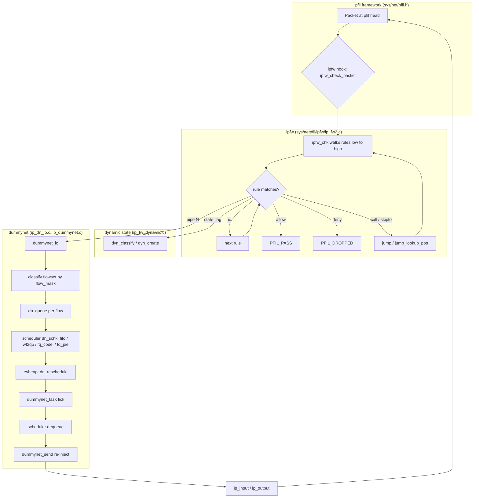

# ipfw and dummynet — Native Firewall and Traffic Shaper
<!-- This file is auto-generated by generate-doc.py -- do not edit manually -->

---
**Navigation:**
  **Up:** [Kernel Core — Structure and Entry Point](../../README.md) ▸ [Source Tree — Layout and Conventions](../../../README_internals.md)
  **Related:** [Network Stack — Architecture and Packet Flow](../../net/README.md) | [VNET — Virtual Network Stacks](../../net/README_vnet.md) | [pf — OpenBSD-derived Packet Filter](../pf/README.md)
  **All chapters:** [Source Tree — Layout and Conventions](../../../README_internals.md) | [Boot Process — UEFI Bootloader to Kernel Handoff](../../../stand/efi/loader/README.md) | [Kernel Core — Structure and Entry Point](../../README.md) | [Build System — buildworld and buildkernel](../../../share/mk/README.md) | [System Calls and Image Activation — Entry, sysent, and exec](../../kern/README_syscall.md) | [Kernel Modules and the Linker — KLD, SYSINIT, and linker sets](../../kern/README_kld.md) | [Virtual Memory Subsystem — vm_page, UMA, and Pagers](../../vm/README.md) | [Process Management — Scheduling and Lifecycle](../../kern/README_process.md) ...
---


## Quick Summary

`ipfw` is FreeBSD's native IP firewall. It is a stateful packet-inspection framework that combines filtering, in-kernel NAT (Network Address Translation), and traffic shaping in one subsystem. When a packet crosses the input or output path of the network stack, the `pfil` [hook](../../netgraph/README.md#glossary) framework hands it to `ipfw`, which walks its rule set from the lowest rule number upward. The first rule whose match criteria are all satisfied is executed and the search stops for that packet — this is the "first match wins" model. This is the opposite of `pf`, which walks all rules and applies the last matching one. The default rule, number `65535` (`IPFW_DEFAULT_RULE` in `netinet/ip_fw.h`), is always present and is the last rule evaluated, so a packet that matches nothing earlier falls through to it.

Coupled with `ipfw` is `dummynet`, the traffic-shaping and Active Queue Management ([AQM](#glossary)) subsystem. When an `ipfw` rule matches a packet and specifies a `pipe` action, the packet is diverted into a `dummynet` pipe. A pipe holds a scheduler — FIFO, WF2Q+ (work-conserving weighted fair queueing), FQ-CoDel, FQ-PIE, round-robin, priority, or QFQ (queue fair queuing) — which in turn owns one or more queues. Packets are enqueued, held in memory, and released at a configured rate until their bandwidth and buffer limits are met, then re-injected into the stack. A periodic task driven by a binary min-heap of expiry events moves packets out of queues at the right time.

`ipfw` also provides in-kernel NAT built on `libalias`, the same address-translation library used by `ipfilter`. NAT is configured per interface and keeps stateful mappings for port redirections and address pools. Dynamic [state](../pf/README.md#glossary) tracking is a separate feature: when a rule carries the `state` flag, `ipfw` generates temporary state entries for each observed session, so subsequent packets of that session are matched without re-evaluating the full rule set.

Together, `ipfw` and `dummynet` have shipped in FreeBSD since the late 1990s. `pf` has become the more common choice for declarative rule sets and last-match semantics, but `ipfw` remains the only native FreeBSD stack that unifies stateful filtering, NAT, and a full queueing discipline in a single kernel subsystem. The FreeBSD Handbook notes that the in-kernel NAT implementation is only compatible with `ipfw`, which is why a machine running NAT plus stateful rules typically uses `ipfw` rather than `pf`.

## Glossary

**pfil head** — an intercept point in the network stack (for example "IPv4 input") on which one or more packet filters register.

**pfil hook** — a registered packet filter (for example `ipfw` or `pf`) attached to a pfil head; hooks are chained in list order and each may pass, drop, or consume the packet.

**flowset** — a named set of flows in dummynet, identified by a flowset id, that shares a scheduler and a flow mask; it is the unit to which a `pipe` or `queue` rule refers.

**scheduler instance** — one concrete copy of a scheduler (FIFO, WF2Q+, FQ-CoDel, ...) selected by a `sched_mask` applied to the flow; a single scheduler id can expand into many instances.

**AQM** — Active Queue Management, a per-queue policy (RED, CoDel, PIE) that drops or marks packets before a queue overflows, instead of only dropping on overflow.

**first match wins** — ipfw's rule-evaluation model: the first rule whose criteria are all true is executed and the search stops, in contrast to pf's last-match-wins.

**eaction** — an external action object (an `eaction_obj`) referenced by a rule, used to hold per-rule state such as connection limits and counters.

**evheap** — the binary min-heap of scheduled expiry events that dummynet's periodic task drains each tick to decide when to dequeue packets.

## Architecture

### The pfil hook and packet entry path

`ipfw` does not call into the network stack directly. It registers itself on the `pfil` framework, the same mechanism `pf` uses. `sys/net/pfil.h` defines the two roles:

```c
/*
 * A pfil head is created by a packet intercept point.
 *
 * A pfil hook is created by a packet filter.
 *
 * Hooks are chained on heads.  Historically some hooking happens
 * automatically, e.g. ipfw(4), pf(4) and ipfilter(4) would register
 * theirselves on IPv4 and IPv6 input/output.
 */
typedef struct pfil_hook *	pfil_hook_t;
typedef struct pfil_head *	pfil_head_t;
```

The split into *head* (the intercept point, e.g. "IPv4 input") and *hook* (the filter, e.g. "ipfw") is the engineering reason the framework exists: one intercept point can carry several filters, so `ipfw` and `pf` can both observe the same packet without either hard-coding a call into the other. A filter registers by filling in a `pfil_hook_args` structure:

```c
struct pfil_hook_args {
	int		 pa_version;
	int		 pa_flags;
	enum pfil_types	 pa_type;
	pfil_mbuf_chk_t	 pa_mbuf_chk;
	pfil_mem_chk_t	 pa_mem_chk;
	void		*pa_ruleset;
	const char	*pa_modname;
	const char	*pa_rulname;
};
```

`pa_type` selects the head family (`PFIL_TYPE_IP4`, `PFIL_TYPE_IP6`, or `PFIL_TYPE_ETHERNET`), and `pa_mbuf_chk` is the function the framework invokes for each packet. `ipfw` installs its hook from `ipfw_attach_hooks()` in `sys/netpfil/ipfw/ip_fw_pfil.c`, and the entry point it hands over is `ipfw_check_packet()`:

```c
static pfil_return_t
ipfw_check_packet(struct mbuf **m0, struct ifnet *ifp, int flags,
    void *ruleset __unused, struct inpcb *inp)
{
	struct ip_fw_args args;
	struct m_tag *tag;
	pfil_return_t ret;
	int ipfw;

	args.flags = (flags & PFIL_IN) ? IPFW_ARGS_IN
```

`ipfw_check_packet()` fills a `struct ip_fw_args` (described below), calls `ipfw_chk()` to walk the rules, and then dispatches on the return code. The possible outcomes are enumerated in `sys/netpfil/ipfw/ip_fw_private.h`:

```c
/* Return values from ipfw_chk() */
enum {
	IP_FW_PASS = 0,
	IP_FW_DENY,
	IP_FW_DIVERT,
	IP_FW_TEE,
	IP_FW_DUMMYNET,
	IP_FW_NETGRAPH,
	IP_FW_NGTEE,
	IP_FW_NAT,
	IP_FW_REASS,
	IP_FW_NAT64,
};
```

The `pfil` framework translates the filter's decision back into one of the four `pfil_return_t` values defined in `sys/net/pfil.h`:

```c
typedef enum {
	PFIL_PASS = 0,
	PFIL_DROPPED,
	PFIL_CONSUMED,
	PFIL_REALLOCED,
} pfil_return_t;
```

`PFIL_PASS` lets the packet continue to the next hook and then to the rest of the stack; `PFIL_DROPPED` frees it; `PFIL_CONSUMED` means the filter took ownership (as `dummynet` does when it queues a packet); `PFIL_REALLOCED` means the filter replaced the [mbuf](../../sys/README_mbuf.md#glossary) chain.

### First match wins, and what it means for rule design

`ipfw_chk()` in `sys/netpfil/ipfw/ip_fw2.c` walks the rule chain from the lowest rule number toward `IPFW_DEFAULT_RULE` (65535). For each rule it evaluates every match instruction; the moment one rule matches, its action runs and the walk stops. The default rule is always present, so a packet that matches nothing earlier is resolved by it. This is the mirror image of `pf`, whose `pf_match()` walks the entire rule list and remembers the last matching rule's action.

The practical consequence is the order in which you write rules. With `pf` you typically write a broad allow first and narrow denies later, because the last match wins. With `ipfw` you must write the most specific rule first: a `deny` placed above a broad `allow` will shadow it for the packets it matches, and nothing below the first match is ever consulted. The `skipto` and `call`/`return` primitives exist to manage this ordering explicitly — `skipto` jumps to a later rule number, `call` pushes the current position onto a 16-deep call stack (`IPFW_CALLSTACK_SIZE` in `netinet/ip_fw.h`) and jumps to a subroutine rule, and `return` pops back — so a shared block of rules can be invoked from several places without being duplicated. The `jump()` and `jump_lookup_pos()` helpers in `ip_fw2.c` implement these transfers.

### Rule tables and dynamic state

Match criteria can be static (a literal address or mask) or indirect, via a *table*. Tables live in `sys/netpfil/ipfw/ip_fw_table.c` and are described by `struct table_config` in `sys/netpfil/ipfw/ip_fw_table.h`; the lookup backend is pluggable through a `struct table_algo` (hash, radix, or the legacy single-value form), so a rule can test membership against a set of addresses, interfaces, or UIDs without rewriting the rule. A `table()` lookup leaves its result in the rule argument slot `IP_FW_TARG` (0), which a later `tablearg` action consumes — this is how a single rule can both classify and act on the same lookup.

Dynamic state is a separate mechanism in `sys/netpfil/ipfw/ip_fw_dynamic.c`. When a rule carries the `state` flag, the first packet of a session creates a temporary state entry; later packets of the same session hit that entry and skip the full rule walk. The design is documented in the file header:

```c
/*
 * Description of dynamic states.
 *
 * Dynamic states are stored in lists accessed through a hash tables
 * whose size is curr_dyn_buckets. This value can be modified through
 * the sysctl variable dyn_buckets.
 *
 * Currently there are four tables: dyn_ipv4, dyn_ipv6, dyn_ipv4_parent,
 * and dyn_ipv6_parent.
 * ...
 * Each state holds a pointer to the parent ipfw rule so we know what
 * action to perform. Dynamic rules are removed when the parent rule is
 * deleted.
```

The four hash tables separate IPv4 and IPv6 states from their *parent* states (used for connection limits and NAT). `dyn_classify()` hashes a packet's address fields, `dyn_create()` allocates a new state, `dyn_expire_states()` and `dyn_tick()` run from a periodic task to reap idle entries, and `dyn_update_tcp_state()` tracks the TCP state machine so that, for example, a `state` rule only accepts packets consistent with the observed handshake.

### In-kernel NAT

`ipfw`'s NAT lives in `sys/netpfil/ipfw/ip_fw_nat.c` and is built on `libalias` (`sys/netinet/libalias/`), the same address-translation library `ipfilter` uses. Each NAT instance is anchored to an interface and owns a `struct libalias` handle plus chains of redirection and spool (port-pool) entries:

```c
struct cfg_nat {
	/* chain of nat instances */
	LIST_ENTRY(cfg_nat)	_next;
	int			id;		/* nat id  */
	struct in_addr		ip;		/* nat ip address */
	struct libalias		*lib;		/* libalias instance */
	int			mode;		/* aliasing mode */
	int			redir_cnt; /* number of entry in spool chain */
	/* chain of redir instances */
	LIST_HEAD(redir_chain, cfg_redir) redir_chain;
	char			if_name[IF_NAMESIZE];	/* interface name */
	u_short			alias_port_lo;	/* low range for port aliasing */
	u_short			alias_port_hi;	/* high range for port aliasing */
};
```

The per-interface [anchor](../pf/README.md#glossary) is why NAT is configured with an `interface` argument rather than a global rule: the translation depends on which interface a packet leaves on. `ifaddr_change()` (registered as an event handler) re-validates every NAT entry when an interface's address changes, so a NAT bound to a now-absent address is dropped. `ipfw_nat()` is the per-packet entry point that hands the mbuf to the matching `struct libalias` instance.

This differs from `pf`'s NAT in two ways. First, `pf`'s translation is built into its rule language (`nat on ...`) and is tightly coupled to its state table, whereas `ipfw`'s NAT is a separate `libalias`-based engine keyed by interface. Second, because `libalias` is shared with `ipfilter`, the port-mapping state and the address-pool logic are the same code both filters rely on, which is why the in-kernel NAT is only wired to `ipfw` and not to `pf`.

### dummynet: pipes, flowsets, schedulers, queues

`dummynet` is configured through a separate object model, described in `sys/netpfil/ipfw/dummynet.txt` (the design note by Panicucci and Rizzo). The object hierarchy is:

- **link** — the physical link (bandwidth, delay, burst) a scheduler is attached to.
- **scheduler** (`dn_sch`) — a named scheduler of a given type, with a `sched_mask` that expands one scheduler id into many instances.
- **[flowset](#glossary)** (`dn_fs`) — a named set of flows, with a `flow_mask`, a queue size, a weight, and a pointer to its scheduler.
- **queue** — a per-flow queue created on demand when a packet's flow matches a flowset.

The two masks are the heart of the design, as the design note explains:

```
There are in fact two masks applied to each packet:
+ the "sched_mask" sends packets arriving to a scheduler_id to
  one of many instances.
+ the "flow_mask" together with the flowset_id is used to
  collect packets into independent flows on each scheduler.
```

So `sched 10 config type WF2Q+ sched_mask src-ip 0xffffff00` gives one [scheduler instance](#glossary) per /24 source subnet, and within each instance `flow_mask src-ip 0x000000ff` makes each individual source its own queue. The reason for the split is fairness granularity: the `sched_mask` decides how the link's bandwidth is divided among groups, and the `flow_mask` decides how each group's share is divided among the flows inside it.

The kernel-side representation lives in `sys/netpfil/ipfw/ip_dn_private.h`. The basic packet queue is trivial:

```c
struct mq {	/* a basic queue of packets*/
        struct mbuf *head, *tail;
	int count;
};
```

On top of it sit `struct dn_queue` (one per flow, holding the `mq` plus per-queue accounting and an AQM status pointer), `struct dn_fsk` (the per-flowset key, which counts how many live queues point at it so the flowset can be freed when its last queue dies), `struct dn_schk` (the scheduler template), and `struct dn_sch_inst` (one live scheduler instance, holding its delay line `dline` and the `when` timestamp of its next scheduled dequeue).

The scheduler and AQM algorithms are pluggable through two vtables. `struct dn_alg` in `sys/netpfil/ipfw/dn_sched.h` is the scheduler interface:

```c
struct dn_alg {
	uint32_t type;           /* the scheduler type */
	const char *name;   /* scheduler name */
	uint32_t flags;	/* DN_MULTIQUEUE if supports multiple queues */

	/*
	 * The following define the size of 3 optional data structures
	 * that may need to be allocated at runtime, and are appended
	 * to each of the base data structures: scheduler, sched.inst,
	 * and queue. We don't have a per-flowset structure.
	 */
```

It carries the `enqueue`, `dequeue`, `config`, `destroy`, `new_sched`, and `free_sched` callbacks plus the sizes of the per-template, per-instance, and per-queue data areas that each algorithm appends to the base structures. The built-in schedulers are `dn_sched_fifo.c`, `dn_sched_wf2q.c`, `dn_sched_fq_codel.c`, `dn_sched_fq_pie.c`, `dn_sched_prio.c`, `dn_sched_rr.c`, and `dn_sched_qfq.c`. The AQM interface, `struct dn_aqm` in `sys/netpfil/ipfw/dn_aqm.h`, is analogous and is implemented by `dn_aqm_codel.c` (CoDel) and `dn_aqm_pie.c` (PIE); the `DN_IS_AQM` flag in `netinet/ip_dummynet.h` marks a queue as using one.

### The shaping loop: enqueue, tick, dequeue, re-inject

When `ipfw_chk()` returns `IP_FW_DUMMYNET`, `ipfw_check_packet()` calls `dummynet_io()` in `sys/netpfil/ipfw/ip_dn_io.c`. `dummynet_io()` classifies the packet to a flowset (via `dn_fsk` and the flow mask), finds or creates the per-flow `dn_queue`, and calls the scheduler's `enqueue` (for example `wf2qp_enqueue()` or `fq_codel_enqueue()`). The packet is now owned by dummynet; `dummynet_io()` returns control to the caller with the mbuf consumed.

Release is driven by a periodic task, `dummynet_task()`, which runs on a tick. Each tick it drains the `evheap` — a binary min-heap of expiry events defined in `sys/netpfil/ipfw/dn_heap.h`:

```c
struct dn_heap_entry {
	uint64_t key;	/* sorting key, smallest comes first */
	void *object;	/* object pointer */
};

struct dn_heap {
	int size;	/* the size of the array */
	int elements;	/* elements in use */
	int ofs;	/* offset in the object of heap index */
	struct dn_heap_entry *p;	/* array of "size" entries */
};
```

The heap is why the tick is cheap: instead of scanning every queue to find which ones are allowed to send, the tick pops the entries whose `key` (an absolute timestamp) has arrived, in O(log n) per event. For each ready scheduler instance the task calls the scheduler's `dequeue` to pull a packet, applies any AQM drop/mark decision, and hands the packet to `dummynet_send()` for re-injection. `dn_reschedule()` recomputes each instance's next `when` and re-inserts it into the heap, so the rate limit is enforced across ticks rather than per packet.

Re-injection is the step that closes the loop. `dummynet_send()` re-enters the stack: for an input packet it calls `ip_input()`/`ip6_input()`, for an output packet it calls `ip_output()`/`ip6_output()`, and for a forwarding packet it uses the saved next-hop information. The packet is re-checked by `ipfw` on the way in unless it is tagged to skip the firewall a second time, which is why the `ip_fw_args` carries direction bits (`IPFW_ARGS_IN`/`IPFW_ARGS_OUT`) and a drop flag (`IPFW_ARGS_DROP`) that dummynet sets when a shaped packet must not be re-filtered into an infinite loop.

## Key Data Structures

### `struct ip_fw_args` — the per-packet context

Defined in `sys/netpfil/ipfw/ip_fw_private.h`, this structure is the single argument bundle passed to both `ipfw_chk()` and `dummynet_io()`, which is why it carries both firewall and shaping state:

```c
struct ip_fw_args {
	uint32_t		flags;
#define	IPFW_ARGS_ETHER		0x00010000	/* valid ethernet header */
#define	IPFW_ARGS_NH4		0x00020000	/* IPv4 next hop in hopstore */
#define	IPFW_ARGS_NH6		0x00040000	/* IPv6 next hop in hopstore */
#define	IPFW_ARGS_NH4PTR	0x00080000	/* IPv4 next hop in next_hop */
#define	IPFW_ARGS_NH6PTR	0x00100000	/* IPv6 next hop in next_hop6 */
#define	IPFW_ARGS_REF		0x00200000	/* valid ipfw_rule_ref	*/
#define	IPFW_ARGS_IN		0x00400000	/* called on input */
#define	IPFW_ARGS_OUT		0x00800000	/* called on output */
#define	IPFW_ARGS_IP4		0x01000000	/* belongs to v4 ISR */
#define	IPFW_ARGS_IP6		0x02000000	/* belongs to v6 ISR */
#define	IPFW_ARGS_DROP		0x04000000	/* drop it (dummynet) */
#define	IPFW_ARGS_LENMASK	0x0000ffff	/* length of data in *mem */
#define	IPFW_ARGS_LENGTH(f)	((f) & IPFW_ARGS_LENMASK)
	/*
	 * On return, it points to the matching rule.
	 * On entry, rule.slot > 0 means the info is valid and
	 * contains the starting rule for an ipfw search.
	 * If chain_id == chain->id && slot >0 then jump to that slot.
	 * Otherwise, we locate the first rule >= rulenum:rule_id
	 */
	struct ipfw_rule_ref	rule;	/* match/restart info		*/

	struct ifnet		*ifp;	/* input/output interface	*/
	struct inpcb		*inp;
```

The `flags` word packs the direction, the address family, and whether a link-layer header is present. The `rule` field is a `struct ipfw_rule_ref` (defined in `sys/netinet/ip_var.h`) that records which rule matched on return and, on entry, where to resume the walk after a `call`/`return`. The `ifp` and `inp` pointers let a rule test the interface and, for connected packets, the socket. The `IPFW_ARGS_DROP` bit is set by dummynet so a shaped packet is not re-filtered when it is re-injected.

### `struct dn_id` — the dummynet object header

Every object in the userland-to-kernel dummynet API (a link, flowset, scheduler, or queue) begins with this header, defined in `sys/netinet/ip_dummynet.h`:

```c
struct dn_id {
	uint16_t	len;	/* total obj len including this header */
	uint8_t		type;
	uint8_t		subtype;
	uint32_t	id;	/* generic id */
};
```

A configuration request is a batch of such objects passed through `setsockopt()`; the first object carries `type = DN_CMD_*` and `id = DN_API_VERSION`, and the rest name the objects to create or modify. The `type` values (`DN_LINK`, `DN_FS`, `DN_SCH`, `DN_QUEUE`, ...) and the scheduler subtypes are enumerated in the same header, where `DN_SCHED_FIFO = 1` and `DN_SCHED_WF2QP = 2` are the two built-in schedulers and the rest (FQ-CoDel, FQ-PIE, ...) are registered by their modules.

### `struct table_config` — a rule table

Defined in `sys/netpfil/ipfw/ip_fw_table.h`, this is the kernel-side record for one named table:

```c
struct table_config {
	struct named_object	no;
	uint8_t		tflags;		/* type flags */
	uint8_t		locked;		/* 1 if locked from changes */
	uint8_t		linked;		/* 1 if already linked */
	uint8_t		ochanged;	/* used by set swapping */
	uint8_t		vshared;	/* 1 if using shared value array */
	uint8_t		spare[3];
	uint32_t	count;		/* Number of records */
	uint32_t	limit;		/* Max number of records */
	uint32_t	vmask;		/* bitmask with supported values */
	uint32_t	ocount;		/* used by set swapping */
	uint64_t	gencnt;		/* generation count */
	char		tablename[64];	/* table name */
	struct table_algo	*ta;	/* Callbacks for given algo */
	void		*astate;	/* algorithm state */
```

The `ta` pointer is the pluggable backend (hash, radix, or legacy), and `ti_copy` (just below the quoted region) holds the live lookup function and its state. The `gencnt` generation counter is what lets a rule that has cached a table reference detect that the table has been swapped or destroyed. `create_table()`, `find_table()`, `add_table_entry()`, and `del_table_entry()` in `ip_fw_table.c` manage these records.

### `struct cfg_redir` — a NAT redirection

From `sys/netpfil/ipfw/ip_fw_nat.c`, this is one port-redirection entry inside a `cfg_nat`:

```c
/* Nat redirect configuration. */
struct cfg_redir {
	LIST_ENTRY(cfg_redir)	_next;	/* chain of redir instances */
	uint16_t		mode;	/* type of redirect mode */
	uint16_t		proto;	/* protocol: tcp/udp */
	struct in_addr		laddr;	/* local ip address */
	struct in_addr		paddr;	/* public ip address */
	struct in_addr		raddr;	/* remote ip address */
	uint16_t		lport;	/* local port */
	uint16_t		pport;	/* public port */
	uint16_t		rport;	/* remote port	*/
	uint16_t		pport_cnt;	/* number of public ports */
	uint16_t		rport_cnt;	/* number of remote ports */
	struct alias_link	**alink;
	u_int16_t		spool_cnt; /* num of entry in spool chain */
	/* chain of spool instances */
	LIST_HEAD(spool_chain, cfg_spool) spool_chain;
};
```

The `laddr`/`paddr`/`raddr` triple with their port fields describes a DNAT/SNAT mapping; the `spool_chain` of `struct cfg_spool` entries (each an `addr`/`port` pair) is the address pool used when the NAT has more clients than fixed ports. `add_redir_spool_cfg()` and `del_redir_spool_cfg()` maintain these chains.

## Deep Dive

### Tracing a packet through `ipfw_chk()`

The entry is `ipfw_check_packet()` in `sys/netpfil/ipfw/ip_fw_pfil.c`. It builds the `ip_fw_args`, sets `args.flags` from the `PFIL_IN`/`PFIL_OUT` bits, and then calls `ipfw_chk()`. `ipfw_chk()` in `sys/netpfil/ipfw/ip_fw2.c` is the rule walker. Its contract, visible in the `ip_fw_args.rule` comment, is: on entry, if `rule.slot > 0` and the chain id matches, resume at that slot (this is how `call`/`return` and dynamic-state restarts work); otherwise start at the first rule at or above the given rule number. It then loops rule by rule, and for each rule evaluates the match instructions in order.

Each match is a small function in `ip_fw2.c` — `icmptype_match()`, `flags_match()`, `ipopts_match()`, `tcpopts_match()`, `iface_match()`, `flow6id_match()`, and the table-lookup path — and the first rule for which every match succeeds has its action executed. The action is one of the `IP_FW_*` codes from `ip_fw_private.h`. For `IP_FW_PASS` the packet is returned to `pfil` as `PFIL_PASS`; for `IP_FW_DENY` it is `PFIL_DROPPED`; for `IP_FW_DIVERT` and `IP_FW_TEE` it goes to a [`divert(4)`](../../../share/man/man4/divert.4) socket (the difference being that `tee` also lets the packet continue); for `IP_FW_DUMMYNET` it is handed to dummynet and consumed.

The control-flow opcodes are handled inside the same loop. `skipto` sets the next rule number directly. `call` pushes the return position onto the call stack and jumps; `return` pops it. Both are implemented by `jump()` and `jump_lookup_pos()` in `ip_fw2.c`, and the stack depth is bounded by `IPFW_CALLSTACK_SIZE` (16) in `netinet/ip_fw.h`. This is what makes first-match-wins usable for large rulesets: a common deny block can be written once and `call`ed from many points, rather than the last-match model of `pf` where the same block would have to be reached by every path.

When a rule matches, the SDT [probe](../../kern/README_driver.md#glossary) fires so the match is observable from userland:

```c
SDT_PROVIDER_DEFINE(ipfw);
SDT_PROBE_DEFINE6(ipfw, , , rule__matched,
    "int",			/* retval */
    "int",			/* af */
    "void *",			/* src addr */
    "void *",			/* dst addr */
    "struct ip_fw_args *",	/* args */
    "struct ip_fw *"		/* rule */);
```

### Tracing a packet through dummynet

`dummynet_io()` in `sys/netpfil/ipfw/ip_dn_io.c` is the shaping entry. It takes the `ip_fw_args` (which now carries the pipe/queue number the rule selected), classifies the packet to a flowset, and resolves the per-flow queue. The classification uses the flowset's `flow_mask` against the packet's 5-tuple; the result indexes a hash table of `dn_queue` structures owned by the flowset. If no queue exists for this flow, one is created and attached to the scheduler instance selected by the scheduler's `sched_mask`.

The packet is then enqueued by the scheduler's `enqueue` callback. For FIFO this is `fifo_enqueue()`; for WF2Q+ it is `wf2qp_enqueue()`, which also updates the per-queue virtual time `V` and the backlog `F` used by the work-conserving fair-queueing calculation; for FQ-CoDel it is `fq_codel_enqueue()`, which places the packet in a per-flow sub-queue and tracks the flow's sojourn time. The enqueue may drop the packet if the queue is full or if an AQM policy (CoDel or PIE) decides to drop early; in that case the dummynet `drop` SDT probe fires:

```c
SDT_PROVIDER_DEFINE(dummynet);
SDT_PROBE_DEFINE2(dummynet, , , drop, "struct mbuf *", "struct dn_queue *");
```

After enqueue, `dummynet_io()` schedules the scheduler instance's next dequeue in the `evheap` (via `dn_reschedule()`) and returns with the mbuf consumed. The packet now sits in a `dn_queue`'s `mq`, holding its place in line.

The release happens in `dummynet_task()`, the periodic tick. Each tick it advances the simulated clock, drains all `evheap` entries whose key has expired, and for each ready scheduler instance calls its `dequeue` callback. `wf2qp_dequeue()` picks the queue with the smallest virtual finish time among the non-empty queues (the WF2Q+ selection), `fifo_dequeue()` takes the head of the single queue, and `fq_codel_dequeue()` round-robins the per-flow sub-queues while applying the CoDel target-latency drop. The dequeued mbuf is passed to `dummynet_send()`, which re-injects it: `ip_input()`/`ip6_input()` for input, `ip_output()`/`ip6_output()` for output, using the saved next-hop for forwarding. Because the re-injected packet carries `IPFW_ARGS_DROP` in its `ip_fw_args`, it is not re-filtered by `ipfw` on the way back in, which would otherwise loop it through the same `pipe` rule forever.

### How the tick keeps the rate

The rate limit is not enforced per packet but per tick. `dn_reschedule()` computes, from the link bandwidth and the scheduler instance's weight, the number of bytes the instance may send in the next interval, sets the instance's `when` field to the absolute time it may next dequeue, and inserts that into the `evheap`. On the next tick, only instances whose `when` has arrived are dequeued, and each is rescheduled for the interval after that. The `evheap` is a binary min-heap precisely because the tick must find "the next instance to run" in O(log n) rather than scanning every instance; the heap's `ofs` field points at the in-object index so an instance can be re-prioritized or removed out of order when its configuration changes.

## Flow / Diagram



## Advanced Notes

### Debugging with DTrace and SDT

Both subsystems export SDT probes. The `ipfw` provider's `rule__matched` probe (defined in `sys/netpfil/ipfw/ip_fw2.c`) fires for every rule that matches, with the return code, address family, source and destination addresses, the `ip_fw_args`, and the matching `struct ip_fw`. A D script can use it to answer "which rule did this flow hit and what was the verdict" without adding `printf`s. The `dummynet` provider's `drop` probe (in `sys/netpfil/ipfw/ip_dn_io.c`) fires with the dropped mbuf and the `dn_queue`, which is the direct way to confirm that drops you are seeing are AQM/queue-full drops inside dummynet rather than firewall denies. For per-packet tracing of the shaping path, the `D()`, `D1()`, and `DX(level, ...)` macros in `sys/netpfil/ipfw/ip_dn_private.h` gate on `V_dn_cfg.debug`, so raising the dummynet debug sysctl turns on the internal trace lines.

### Locking and the two dummynet mutexes

Dummynet keeps two mutexes, initialized by `DN_LOCK_INIT()` in `ip_dn_private.h`: `uh_mtx` ("dn_uh") and `bh_mtx` ("dn_bh"). The `dummynet_sched_lock()`/`dummynet_sched_unlock()` pair (in `sys/netpfil/ipfw/ip_dummynet.c`) serialize the scheduler structure against concurrent reconfiguration from userland while the tick runs. The reason there are two locks at all is that a `setsockopt()` reconfiguration can run on one CPU while `dummynet_task()` is dequeuing on another; the `id` field in `struct dn_parms` is incremented on every configuration change so a worker can detect a stale pointer it cached before the lock was taken. A common pitfall is holding the scheduler lock across a call that re-enters dummynet (for example an enqueue that triggers a reschedule); the lock macros are non-reentrant, so such a path deadlocks.

### Interaction with pf and hook ordering

FreeBSD can load `pf` and `ipfw` at the same time; both register hooks on the same `PFIL_TYPE_IP4` and `PFIL_TYPE_IP6` heads. The `pfil` framework calls the hooks in the order they were linked onto the head, and a hook returning `PFIL_DROPPED` or `PFIL_CONSUMED` short-circuits the remaining hooks for that packet. In practice this means the two filters are not redundant but sequential: a packet that `ipfw` passes is still offered to `pf`, and vice versa, so the effective policy is the composition of both rulesets in hook order rather than either one alone. Because the ordering is by registration order on the head rather than by a fixed priority, the relative order of `ipfw` and `pf` is something to verify on a given system (via the [`pfil(9)`](../../../share/man/man9/pfil.9) ioctls that list heads and hooks) before assuming which filter sees a packet first. The practical guidance is to run one or the other as the authoritative policy and use the other only for a narrow, non-overlapping purpose (for example `ipfw` for NAT plus shaping and `pf` for a separate deny list), so that the composition is predictable.

### Performance characteristics

The rule walk is O(number of rules) in the worst case, which is why `ipfw` provides the `skipto`/`call`/`return` primitives and rule *sets* (`IPFW_MAX_SETS` is 32 in `netinet/ip_fw.h`) to keep the hot path short: a set groups rules so that a non-matching set can be skipped as a unit. Dynamic state exists for the same reason — once a session has a state entry, its packets bypass the full walk and are resolved by a hash lookup in `dyn_classify()`. On the shaping side, the cost per tick is dominated by the `evheap` drain, which is O(k log n) for k expired events out of n scheduled instances, so adding more pipes and schedulers scales the tick cost logarithmically rather than linearly. The `byte_limit` and `slot_limit` sysctls (handled by `sysctl_limits()` in `ip_dn_io.c`) cap total queue memory and the number of live queues, which bounds both memory use and the per-tick scan of the flowset hash tables.

### Pitfalls

The first-match-wins model is the most common source of rule bugs: a broad `allow` written above a specific `deny` will shadow the deny, the opposite of the intuition someone coming from `pf` brings. The second is the re-injection loop: a `pipe` rule that also matches the re-injected packet will loop the packet through dummynet; the `IPFW_ARGS_DROP` bit is what prevents this, and it is set only on the dummynet path, so a rule that `tee`s or `divert`s and then re-enters the firewall does not get the same protection. The third is NAT interface binding: a `cfg_nat` is tied to an interface name, and `ifaddr_change()` drops the entry when that interface loses the bound address, so a NAT configured against a virtual or renamed interface can silently stop translating. The fourth is AQM misconfiguration: CoDel and PIE are only active when the `DN_IS_AQM` flag is set on the flowset, and their parameters (target, interval, alpha/beta) come through the `DN_AQM_PARAMS`/`DN_SCH_PARAMS` subtypes, so a flowset created without those parameters runs the plain queue discipline and will buffer to the `byte_limit` before dropping.

### Connection to OS theory

The dummynet scheduler hierarchy is a direct implementation of the weighted fair queueing (WFQ) and generalized processor sharing (GPS) models from the queueing-theory literature: the `sched_mask`/`flow_mask` split is the two-level hierarchy in which the link is shared among groups (the scheduler instances) and each group is shared among its flows (the queues), with WF2Q+ providing the work-conserving approximation of the ideal fluid fair-queueing. The `evheap` is the standard event-driven simulation clock used in discrete-event network simulators: rather than servicing every queue every tick, it services only the queues whose quantum has elapsed, which is what makes a software shaper feasible at line rate. The `pfil` head/hook split is the observer pattern applied to the packet path: the network stack defines the intercept points (heads) and the filters [attach](../../kern/README_driver.md#glossary) to them (hooks) without the stack needing to know which filters exist, which is the same decoupling that `hook(9)` and the eventhandler framework provide elsewhere in the kernel.

## See Also
- [Network Stack — Architecture and Packet Flow](../../net/README.md)
- [pf — OpenBSD-derived Packet Filter](../pf/README.md)
- [VNET — Virtual Network Stacks](../../net/README_vnet.md)


- [`sys/netpfil/pf/`](../pf) — the `pf` packet filter, for the contrasting last-match-wins model and its NAT/state design.
- [`sys/net/pfil.h`](../../net/pfil.h) and [`pfil(9)`](../../../share/man/man9/pfil.9) — the hook framework both filters register on.
- [`sys/netinet/libalias/`](../../netinet/libalias) — the address-translation library backing `ipfw`'s NAT.
- [`sys/netinet/ip_fw.h`](../../netinet/ip_fw.h) and [`sys/netinet/ip_dummynet.h`](../../netinet/ip_dummynet.h) — the kernel-userland ABI for rules and dummynet objects.
- [`sys/netpfil/ipfw/dummynet.txt`](dummynet.txt) — the design note describing the dummynet object model.
- [`ipfw(8)`](../../../sbin/ipfw/ipfw.8), `ipfw(4)`, [`pf(4)`](../../../share/man/man4/pf.4), [`mbuf(9)`](../../../share/man/man9/mbuf.9), `if(9)` — the operator and kernel interfaces.

---

> _Generated by [DaemonDocs](https://github.com/ocochard/DaemonDocs) on 2026-09-02 01:34 UTC using model `Qwen3.8-27B-Q8_0` (llama.cpp build `b10553-cd26896c1`). AI-generated content — verify against source before relying on it._
