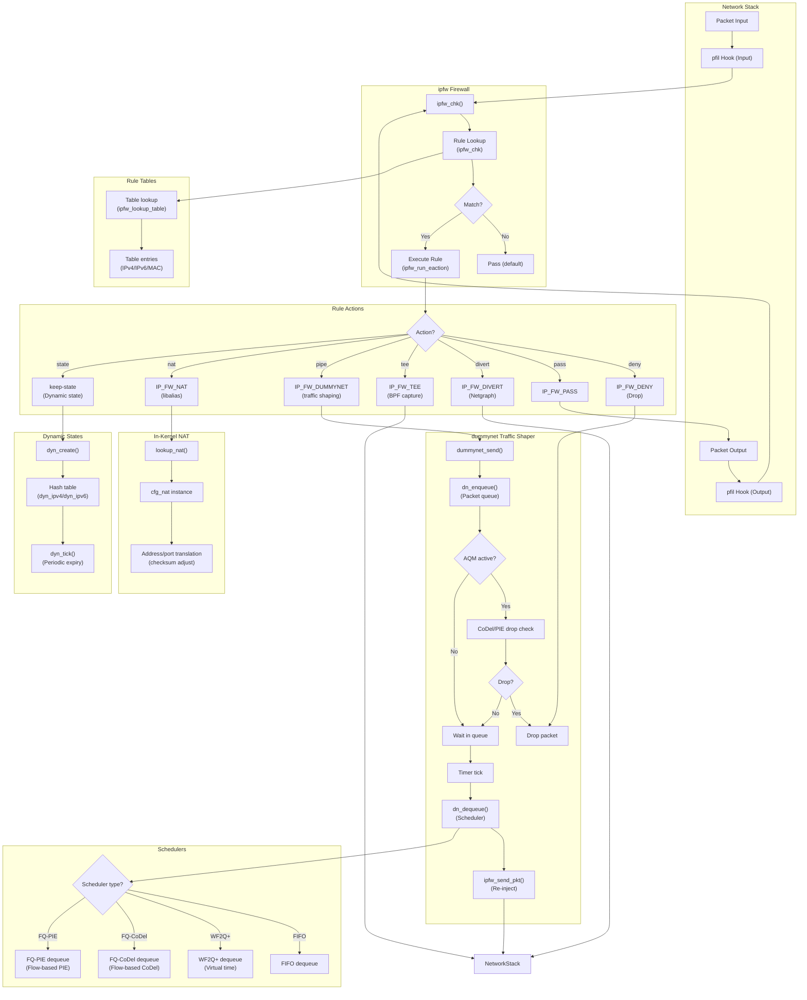

# ipfw and dummynet — Native Firewall and Traffic Shaper
<!-- This file is auto-generated by generate-doc.py -- do not edit manually -->

---
**Navigation:**
  **Up:** [Kernel Core — Structure and Entry Point](../../README.md) ▸ [Source Tree — Layout and Conventions](../../../README_internals.md)
  **Related:** [Network Stack — Architecture and Packet Flow](../../net/README.md) | [VNET — Virtual Network Stacks](../../net/README_vnet.md) | [pf — OpenBSD-derived Packet Filter](../pf/README.md)
  **All chapters:** [Source Tree — Layout and Conventions](../../../README_internals.md) | [Boot Process — UEFI Bootloader to Kernel Handoff](../../../stand/efi/loader/README.md) | [Kernel Core — Structure and Entry Point](../../README.md) | [Build System — buildworld and buildkernel](../../../share/mk/README.md) | [Virtual Memory Subsystem — vm_page, UMA, and Pagers](../../vm/README.md) | [Process Management — Scheduling and Lifecycle](../../kern/README_process.md) | [Locking Primitives — Mutexes, sx, rmlocks, and Atomics](../../kern/README_locking.md) | [Buffer Cache — Block I/O Subsystem](../../vm/README_bcache.md) ...
---


> ⚠ **UNVERIFIED DRAFT** — reviewer did not explicitly approve this draft. Treat claims as suspect until manually reviewed.


## Quick Summary

FreeBSD's `ipfw` (IP firewall) is a stateful packet inspection framework that combines filtering, NAT, and traffic shaping in a single subsystem. Unlike `pf`, which uses a last-match policy, `ipfw` applies the **first matching rule** and stops — a model that mirrors classic BSD packet filters but with far richer capabilities. `ipfw` attaches to the `pfil` hook framework, the same mechanism used by `pf`, to intercept packets at the input and output paths of the network stack. Its rule set is stored in-kernel as a sorted chain, and lookups are accelerated by a hash/radix table for efficient rule references.

Coupled with `ipfw` is `dummynet`, a traffic-shaping and Active Queue Management (AQM) subsystem. When an `ipfw` rule matches a packet and specifies a `pipe` action, the packet is diverted into `dummynet`'s internal queueing discipline. `dummynet` organizes traffic into pipes (which hold schedulers), queues, and flow classes. Packets are enqueued, shaped according to bandwidth and buffer limits, and re-injected back into the network stack. `dummynet` supports FIFO, WF2Q+, FQ-CoDel, and FQ-PIE schedulers, making it a full-featured alternative to Linux's `tc`/`fq_codel` or OpenBSD's `pf` rate limiting.

`ipfw` also provides in-kernel NAT via `libalias`, a modular address-translation library. NAT in `ipfw` is configured per-interface and maintains stateful mappings for port redirections and spool-based address pools. Dynamic state tracking — another `ipfw` feature — automatically creates temporary states for protocols like FTP or SIP, enabling stateful filtering without manual state rules.

Together, `ipfw` and `dummynet` form a unified firewall-shaping stack that has been part of FreeBSD since the late 1990s. While `pf` has gained popularity for its declarative rule language and last-match semantics, `ipfw` remains the only native FreeBSD solution that combines stateful filtering, NAT, and traffic shaping in a single subsystem.

## Architecture

### The pfil Hook and Packet Entry Path

`ipfw` registers itself as a `pfil_hook` on both the input and output paths. The registration is performed in `sys/netpfil/ipfw/ip_fw_pfil.c`:

```c
static pfil_hook_t *ipfw_in6_hook;
static pfil_hook_t *ipfw_in_hook;
static pfil_hook_t *ipfw_out6_hook;
static pfil_hook_t *ipfw_out_hook;
```

Each hook is associated with a function pointer (`ipfw_chk`) that the `pfil` framework calls for every traversing packet. The `pfil` framework is architecture-neutral and used by both `pf` and `ipfw`. When `pf` and `ipfw` are loaded simultaneously, they are attached to different pfil hook orderings — `pf` hooks are typically registered first (lower ordering value), meaning `pf` runs before `ipfw` on the same path. This ordering is configurable at load time via module parameters.

The entry function `ipfw_chk()` (`sys/netpfil/ipfw/ip_fw2.c`) receives an arguments structure, initializes the rule reference, and begins rule evaluation.

### Rule Evaluation: First-Match Semantics

The core rule evaluation loop is in `ipfw_chk()` (`sys/netpfil/ipfw/ip_fw2.c`). Rules are stored in a sorted chain, and the lookup is performed inline within `ipfw_chk()` using a radix/hash-based algorithm to find the first matching rule. Unlike `pf`, which scans all rules and keeps the last match, `ipfw` stops at the **first** rule that satisfies all its match criteria and executes that rule's action.

This first-match semantics has important implications for rule design: rules must be ordered from most specific to least specific, or the first match may short-circuit a more desirable later rule. `pf`'s last-match semantics allow administrators to write rules in any order and rely on the last matching rule, which is more intuitive for layered policy definitions.

A firewall rule in the chain contains an instruction array that specifies match conditions (IP addresses, ports, protocols, flags) and an action. The instruction format uses a compact encoding where each instruction has an opcode and arguments packed into a minimal footprint to keep the rule chain cache-friendly.

The instruction pointer advances through the rule's instruction array, evaluating each condition sequentially. If all conditions match, the action instruction is executed. Actions include `IP_FW_PASS`, `IP_FW_DENY`, `IP_FW_DIVERT`, `IP_FW_TEE`, `IP_FW_DUMMYNET`, `IP_FW_NAT`, and others.

### Dynamic State Tracking

Dynamic states are created automatically when a rule with the `keep-state` option matches a packet. These states are stored in hash tables (`dyn_ipv4`, `dyn_ipv6`, `dyn_ipv4_parent`, `dyn_ipv6_parent`) defined in `sys/netpfil/ipfw/ip_fw_dynamic.c`. The hash is computed from packet address fields, and entries are matched against the corresponding list by address type.

Dynamic states enable stateful filtering without manual state rules. For example, an FTP `keep-state` rule automatically creates a state entry for the control connection, and the `moderate` or `auto-assigned` modes extend this to data connections. States have configurable lifetimes (`dyn_*_lifetime` sysctls) and are automatically cleaned up when idle or when the parent rule is deleted.

The state structure holds the state information, including a pointer to the parent `ipfw` rule so the correct action is performed when the state matches. The total number of dynamic states is limited by `dyn_max` to prevent excessive memory consumption and slow hash lookups.

### In-Kernel NAT via libalias

`ipfw` NAT is implemented in `sys/netpfil/ipfw/ip_fw_nat.c` using `libalias`, a modular address-translation library. NAT configuration is per-interface and stored in NAT configuration structures (`cfg_nat`), each containing a `libalias` instance. Redirections and spools are maintained as linked lists within the NAT configuration.

When a packet matches an `IP_FW_NAT` action, `ipfw_nat()` is called, which invokes `libalias` to perform address/port translation. The translation state is maintained in `libalias`'s internal structures, and checksums are adjusted using `cksum_adjust()` to account for the modified IP addresses and ports.

Unlike `pf`'s NAT, which is integrated into the rule language and supports advanced features like `rdr` and `nat` with anchor-based scoping, `ipfw` NAT is configured through a separate `ipfw nat` command set and operates on a per-interface basis. This makes `ipfw` NAT simpler to configure for basic scenarios but less flexible for complex multi-interface setups.

### Rule Tables

Rule tables provide a way to match packets against sets of addresses or other values without enumerating individual rules. Tables are implemented in `sys/netpfil/ipfw/ip_fw_table.c` and use a hash/radix lookup structure. Each table is associated with a table algorithm (`table_algo`) that determines the lookup method (e.g., IPv4, IPv6, MAC address, integer).

Tables are created with `create_table_internal()` and linked into the rule chain via `link_table()`. Rule references to tables use a kernel index (`kidx`) for fast lookup during packet processing. Table data modification is protected by both the `uh` (userland hook) and runtime locks, while reads are protected by the `uh` lock.

## Key Data Structures

### Firewall Rule
The core rule structure is defined in `netinet/ip_fw.h`. Each rule contains match conditions and actions packed contiguously to minimize memory footprint.

The rule chain is organized as a sorted list of rule objects, each containing a variable-length instruction array. The instruction array uses a set of opcodes defined in `netinet/ip_fw.h`, including `_ipfw_insn_ip` for IP address matching, `_ipfw_insn_u16` for port matching, `_ipfw_insn_kidx` for table lookups, `_ipfw_insn_limit` for connection limits, and `_ipfw_insn_log` for logging. Each instruction begins with an opcode byte followed by type-specific arguments.

The chain itself is a `struct ip_fw_chain` defined in `sys/netpfil/ipfw/ip_fw_private.h`, which holds the rule array, a radix tree for fast lookups, and synchronization primitives. The chain is per-VNET, allowing virtualized network stacks to maintain independent rule sets.

### Evaluation Arguments
An arguments structure is passed to `ipfw_chk()` and `dummynet_io()`, collecting all parameters needed for rule evaluation and packet processing. Defined in `sys/netpfil/ipfw/ip_fw_private.h`.

```c
/* sys/netpfil/ipfw/ip_fw_private.h */
struct ip_fw_args {
	uint32_t		flags;
#define	IPFW_ARGS_ETHER		0x00010000	/* valid ethernet header */
#define	IPFW_ARGS_NH4		0x00020000	/* IPv4 next hop in hopstore */
#define	IPFW_ARGS_NH6		0x00040000	/* IPv6 next hop in hopstore */
#define	IPFW_ARGS_NH4PTR	0x00080000	/* IPv4 next hop in next_hop */
#define	IPFW_ARGS_NH6PTR	0x00100000	/* IPv6 next hop in next_hop6 */
#define	IPFW_ARGS_REF		0x00200000	/* valid ipfw_rule_ref	*/
#define	IPFW_ARGS_IN		0x00400000	/* called on input */
#define	IPFW_ARGS_OUT		0x00800000	/* called on output */
#define	IPFW_ARGS_IP4		0x01000000	/* belongs to v4 ISR */
#define	IPFW_ARGS_IP6		0x02000000	/* belongs to v6 ISR */
#define	IPFW_ARGS_DROP		0x04000000	/* drop it (dummynet) */
#define	IPFW_ARGS_LENMASK	0x0000ffff	/* length of data in *mem */
#define	IPFW_ARGS_LENGTH(f)	((f) & IPFW_ARGS_LENMASK)
	struct ipfw_rule_ref	rule;	/* match/restart info		*/
	struct ifnet		*ifp;	/* input/output interface	*/
	struct inpcb		*inp;
	union {
		struct nhop	*next_hop;
		struct nhop	*next_hop6;
	};
	union {
		struct cfg_nat	*nat_cfg;
	};
	uint32_t		next_hop_id;
	uint32_t		next_hop6_id;
	uint32_t		mtag_id;
	uint32_t		dummy;
};
```

The `rule` field contains the starting rule for a search — if `rule.slot > 0`, the search resumes from that slot, enabling `jump` and `return` operations. The `flags` field indicates whether the packet is incoming (`IPFW_ARGS_IN`) or outgoing (`IPFW_ARGS_OUT`), and includes next-hop information for IPv4 and IPv6. The `ifp` pointer identifies the input/output interface. The `inp` pointer references the associated PCB (protocol control block) if available.

### Queue Structure
`dummynet` queues packets before shaping. Defined in `sys/netpfil/ipfw/ip_dn_private.h`.

```c
/* sys/netpfil/ipfw/ip_dn_private.h */
struct mq {	/* a basic queue of packets*/
        struct mbuf *head, *tail;
	int count;
};
```

The `mq` structure is a simple packet queue holding `head` and `tail` `mbuf` pointers and a packet `count`. It is embedded within the larger queue structure used by dummynet, which also includes scheduler references, AQM state, and statistics counters.

### Scheduler Instance
Schedulers define how packets are dequeued from queues. Defined in `sys/netpfil/ipfw/dn_sched.h`.

```c
/* sys/netpfil/ipfw/dn_sched.h */
struct dn_alg {
	uint32_t type;           /* the scheduler type */
	const char *name;        /* scheduler name */
	uint32_t flags;          /* DN_MULTIQUEUE if supports multiple queues */

	size_t schk_datalen;     /* size of per-scheduler parameters */
	size_t si_datalen;       /* size of per-instance parameters */
	size_t q_datalen;        /* size of per-queue parameters */

	int (*enqueue)(struct dn_alg *, struct dn_queue *, struct mbuf *);
	struct mbuf *(*dequeue)(struct dn_alg *, struct dn_queue *);
	void (*config)(struct dn_alg *, struct dn_id *);
	void (*destroy)(struct dn_alg *);
	int (*new_sched)(struct dn_alg *, struct dn_id *);
	void (*free_sched)(struct dn_alg *);
	int (*new_queue)(struct dn_alg *, struct dn_queue *);
	void (*free_queue)(struct dn_queue *);
};
```

Each scheduler algorithm descriptor has a `type` (FIFO, WF2Q+, FQ-CoDel, etc.), a `name`, and flags indicating support for multiple queues (`DN_MULTIQUEUE`). The `schk_datalen`, `si_datalen`, and `q_datalen` fields specify the sizes of optional data structures appended to the scheduler, instance, and queue structures at runtime. Function pointers define the scheduler API: `enqueue` adds a packet, `dequeue` extracts one, `config` handles reconfiguration, `destroy` frees resources, and `new_sched`/`free_sched` manage scheduler instances. The `new_queue`/`free_queue` callbacks handle per-queue setup.

### Dynamic State Tracking
Dynamic states are managed through hash tables defined in `sys/netpfil/ipfw/ip_fw_dynamic.c`. The state tracking infrastructure uses per-VNET hash tables indexed by address family (IPv4/IPv6). Each state entry tracks a connection's endpoints, protocol, and timeout. States are created by rules with the `keep-state` option and automatically expired by a periodic tick function that scans hash buckets and frees stale entries.

### Firewall Rule
The rule chain uses a sorted array of rule objects with variable-length instruction arrays. Each instruction encodes a match condition or action using opcodes defined in `netinet/ip_fw.h`. The chain is protected by a read-write lock and accessed via radix tree lookups for O(log n) rule matching.

## Deep Dive

### Rule Evaluation: Step by Step

When a packet arrives, `ipfw_check_packet()` in `sys/netpfil/ipfw/ip_fw_pfil.c` is called by the `pfil` framework as the pfil hook function. This function constructs a `struct ip_fw_args` local variable, initializes it with packet metadata (interface, flags, next-hop information), and then calls `ipfw_chk()` in `sys/netpfil/ipfw/ip_fw2.c` to perform the actual rule evaluation. The two functions serve distinct roles: `ipfw_check_packet()` is the pfil entry point that prepares the argument structure, while `ipfw_chk()` is the core engine that performs rule lookup and evaluation.

The lookup logic uses the rule chain's hash table to quickly find the first rule matching the packet's address fields. If no rule matches, the default action is to pass.

Once a matching rule is found, `ipfw_run_eaction()` processes each instruction in sequence. Instructions are classified into match conditions (IP addresses, ports, protocols, flags) and actions (pass, deny, divert, tee, pipe, nat). Match conditions advance the instruction pointer if they succeed; actions trigger side effects and may return early.

The core rule evaluation loop in `ipfw_chk()` iterates through the rule's instruction array, evaluating each condition:

```c
/* sys/netpfil/ipfw/ip_fw2.c — simplified rule evaluation loop */
static int
ipfw_chk(struct ip_fw_args *args, struct mbuf **m0, int *result)
{
	struct ip_fw_chain *chain = args->chain;
	struct _ipfw_insn *fref;
	int error;

	fref = ipfw_lookup_rule(chain, args);
	if (fref == NULL) {
		*result = IP_FW_PASS;
		return 0;
	}

	args->rule.ref = fref;
	error = ipfw_run_eaction(args, fref, m0, result);
	return error;
}

/* ipfw_run_eaction processes each instruction in the rule */
static int
ipfw_run_eaction(struct ip_fw_args *args, struct _ipfw_insn *f,
		 struct mbuf **m0, int *result)
{
	struct _ipfw_insn *rule = f;
	int eaction, error = 0;

	while (rule != NULL) {
		eaction = ipfw_run_instr(args, rule, m0);
		switch (eaction) {
		case IP_FW_PASS:
		case IP_FW_DENY:
			*result = eaction;
			return 0;
		case IP_FW_DUMMYNET:
			*result = eaction;
			return 0;
		case IP_FW_NAT:
			*result = eaction;
			return 0;
		case IP_FW_DIVERT:
		case IP_FW_TEE:
			*result = eaction;
			return 0;
		}
		rule = ipfw_get_next_rule(rule);
	}
	*result = IP_FW_PASS;
	return 0;
}
```

### Dummynet Enqueue and Dequeue

When a rule's action is `IP_FW_DUMMYNET` (the `pipe` keyword in userland), the packet is diverted to `dummynet` via `dummynet_send()` in `sys/netpfil/ipfw/ip_dn_io.c`:

`dn_enqueue()` adds the packet to the queue and updates the scheduler's statistics. If the queue is full (exceeding `byte_limit` or `slot_limit`), the AQM algorithm (CoDel or PIE) may drop the packet early to signal congestion to the sender.

The dequeue process is driven by a timer. `dn_reschedule()` resets a callout (`dn_timeout`) that fires at each system tick. When the callout fires, `dummynet()` enqueues a task on the dummynet taskqueue:

```c
/* sys/netpfil/ipfw/ip_dn_io.c — enqueue path */
static int
dn_enqueue(struct dn_queue *q, struct mbuf *m, struct dn_id *fid)
{
	struct dn_alg *sched = q->sched;

	/* Check AQM for early drop */
#ifdef NEW_AQM
	if (q->aqm != NULL && q->aqm->drop != NULL) {
		if (q->aqm->drop(q, m)) {
			V_dummynet_sdt_probe_drop(m, q);
			return (1); /* packet consumed */
		}
	}
#endif

	/* Add to scheduler */
	if (sched->enqueue(sched, q, m)) {
		m_freem(m);
		return (1);
	}

	q->mq.count++;
	q->bytes_in += m->m_pkthdr.len;
	q->pkts_in++;
	return (0);
}
```

The task handler `dummynet_task()` dequeues packets from the scheduler and re-injects them into the network stack:

```c
/* sys/netpfil/ipfw/ip_dn_io.c — dequeue path */
static void
dummynet_task(void *context, int pending)
{
	struct dn_parms *dn = context;
	struct dn_queue *q;
	struct mbuf *m;

	/* Find next ready queue via scheduler */
	q = locate_scheduler(dn);
	if (q == NULL)
		return;

	/* Dequeue packet */
	m = q->alg->dequeue(q->alg, q);
	if (m == NULL)
		return;

	q->mq.count--;
	q->bytes_out += m->m_pkthdr.len;
	q->pkts_out++;

	/* Re-inject into network stack */
	ipfw_send_pkt(q->dn, m, q->id.af, q->id.pipe_id);

	/* Reschedule if more packets available */
	if (q->mq.count > 0)
		dn_reschedule(dn);
}
```

`locate_scheduler()` finds the next ready scheduler (based on WF2Q+ virtual time or FQ-CoDel flow selection), and `dn_dequeue()` extracts a packet from the queue. For fair schedulers, the dequeue logic considers flow classification to ensure equitable bandwidth distribution.

### Flow Classification in FQ-CoDel and FQ-PIE

Fair schedulers require flow classification to map packets to per-flow queues. `fq_codel_classify_flow()` in `sys/netpfil/ipfw/dn_sched_fq_codel.c` computes a hash of the packet's 4-tuple (source/destination IP and ports) to determine the flow:

```c
/* sys/netpfil/ipfw/dn_sched_fq_codel.c — flow classification */
static uint32_t
fq_codel_classify_flow(struct dn_queue *q, struct mbuf *m,
    struct dn_id *fid)
{
	uint32_t hash;

	/* Hash the 4-tuple: src/dst IP and ports */
	hash = fnv_32_buf(&fid->src, sizeof(fid->src), FNV1_32_INIT);
	hash = fnv_32_buf(&fid->dst, sizeof(fid->dst), hash);
	if (fid->proto == IPPROTO_TCP || fid->proto == IPPROTO_UDP) {
		hash = fnv_32_buf(&fid->sport, sizeof(fid->sport), hash);
		hash = fnv_32_buf(&fid->dport, sizeof(fid->dport), hash);
	}

	return (hash % q->skt->nflows);
}
```

Each flow is tracked in a per-flow structure that maintains per-flow statistics (packet count, byte count, drop count) and a CoDel status structure for AQM. The flow set maps flow indices to queue entries, enabling fast lookup during dequeue.

### Dynamic State Lifecycle

Dynamic states are created by rules with the `keep-state` option. When a packet matches such a rule, `dyn_create()` in `sys/netpfil/ipfw/ip_fw_dynamic.c` allocates a state entry:

```c
/* sys/netpfil/ipfw/ip_fw_dynamic.c — state creation */
static struct ip_fw_dyn *
dyn_create(struct _ipfw_insn *f, struct ip_fw_args *args, struct mbuf *m)
{
	struct ip_fw_dyn *d;
	uint32_t hash;

	/* Check global limit */
	if (V_dyn_count >= dyn_max)
		return (NULL);

	/* Allocate from UMA zone */
	d = uma_zalloc(dyn_zone, M_NOWAIT);
	if (d == NULL)
		return (NULL);

	/* Hash packet addresses to find bucket */
	hash = dyn_hash(args, &d->hash);

	/* Initialize state */
	bzero(d, sizeof(*d));
	d->rule = f;
	d->af = args->flags & IPFW_ARGS_IP6 ? AF_INET6 : AF_INET;
	d->dyn_timeout = f->dyn_timeout;
	d->dyn_lifetime = dyn_get_lifetime(f, d);
	d->dyn_last = time_second;
	d->dyn_buckets = V_curr_dyn_buckets;

	TAILQ_INSERT_TAIL(&V_dyn_hash[hash], d, dyn_next);
	V_dyn_count++;
	return (d);
}
```

States are expired by `dyn_expire_states()`, which is called periodically from `dyn_tick()`. The tick function iterates over all hash buckets and removes states whose lifetime has expired. This prevents stale states from consuming memory indefinitely.

```c
/* sys/netpfil/ipfw/ip_fw_dynamic.c — state expiry */
static void
dyn_tick(void)
{
	int i;
	struct ip_fw_dyn *d, *next;

	for (i = 0; i < V_curr_dyn_buckets; i++) {
		TAILQ_FOREACH_SAFE(d, &V_dyn_hash[i], dyn_next, next) {
			if (time_second - d->dyn_last >= d->dyn_lifetime) {
				TAILQ_REMOVE(&V_dyn_hash[i], d, dyn_next);
				uma_zfree(dyn_zone, d);
				V_dyn_count--;
			}
		}
	}
}
```

The dynamic state structure (`struct ip_fw_dyn`) holds connection tracking information:

```c
/* sys/netpfil/ipfw/ip_fw_dynamic.c */
struct ip_fw_dyn {
	TAILQ_ENTRY(ip_fw_dyn) dyn_next;
	struct _ipfw_insn	*rule;		/* parent rule */
	int		af;		/* address family */
	int		dyn_buckets;	/* hash bucket */
	uint32_t	dyn_hash;	/* hash of addresses */
	uint32_t	dyn_timeout;	/* timeout value */
	uint32_t	dyn_lifetime;	/* current lifetime */
	uint32_t	dyn_last;	/* last activity time */
	uint32_t	dyn_type;	/* state type */
	uint32_t	dyn_flags;	/* state flags */
	union {
		struct {
			struct in_addr	src, dst;
			uint16_t	sport, dport;
		} v4;
		struct {
			struct in6_addr	src, dst;
			uint16_t	sport, dport;
		} v6;
	} addr;
};
```

### NAT Configuration and Packet Translation

NAT in `ipfw` is configured per-interface. When `ipfw_nat_init()` is called, it creates a NAT configuration structure (`cfg_nat`) for each interface, initializing a `libalias` instance. Redirections are added via `add_redir_spool_cfg()`, which populates configuration structures with local/remote address-port mappings.

When a packet matches an `IP_FW_NAT` action, `ipfw_nat()` calls `lookup_nat()` to find the appropriate NAT configuration instance, then invokes `libalias` to perform the translation:

```c
/* sys/netpfil/ipfw/ip_fw_nat.c — NAT translation */
static int
ipfw_nat(struct ip_fw_args *args, struct mbuf **m0, int rule_num)
{
	struct cfg_nat *cfg;
	struct mbuf *m = *m0;
	int error;

	cfg = lookup_nat(args->ifp, args->flags & IPFW_ARGS_OUT);
	if (cfg == NULL)
		return (IP_FW_PASS);

	/* Call libalias for translation */
	error = libalias_translate(cfg->lib, m, args->flags & IPFW_ARGS_OUT);
	if (error < 0)
		return (IP_FW_PASS);

	/* Adjust checksums for translated addresses/ports */
	cksum_adjust(m, error);

	return (IP_FW_NAT);
}
```

`libalias` modifies the packet in place, adjusting IP addresses, ports, and checksums. The translated packet then continues through the firewall rule chain or is re-injected into the network stack.

## Flow / Diagram



## Advanced Notes

### Debugging with SDT Probes

`ipfw` provides Static DTrace Probes (SDT) for runtime debugging. Two probes are defined in `sys/netpfil/ipfw/ip_fw2.c`: `ipfw:::rule__matched` fires when a rule matches, providing the rule pointer, address family, and source/destination addresses. This enables tracing of rule evaluation without recompiling the kernel.

Similarly, `dummynet` defines a `dummynet:::drop` probe that fires when a packet is dropped by the AQM algorithm, providing the mbuf pointer and queue pointer.

### Performance Considerations

`ipfw` rule lookups use a radix-based algorithm that is efficient for large rule sets, but performance degrades when rules contain many match conditions. The instruction array is scanned sequentially, so rules with many conditions (e.g., matching on IP, ports, protocol, flags, and interface) take longer to evaluate.

Dummynet's scheduler selection adds overhead to packet processing. For high-throughput scenarios, FIFO scheduling has minimal overhead, while WF2Q+ and FQ-CoDel require flow classification and virtual time calculations. The `io_fast` sysctl in `V_dn_cfg` can be enabled to bypass some checks for improved performance.

The dynamic state hash table size (`dyn_buckets` sysctl) affects lookup performance. A larger hash table reduces collisions but increases memory usage. The default bucket count is tuned for typical desktop/server workloads but may need adjustment for high-connection-count servers.

### Common Pitfalls

1. **Rule ordering**: Because `ipfw` uses first-match semantics, placing a broad rule (e.g., `allow ip from any to any`) before specific rules will prevent those specific rules from ever matching. This is the opposite of `pf`'s last-match behavior.

2. **NAT and firewall interaction**: `ipfw` NAT translates packets in-place, which modifies the packet's IP addresses and ports. If a firewall rule matches on the translated address, it will not match the original address. NAT rules should be placed before filtering rules that need to see the original addresses, or after rules that need to see the translated addresses.

3. **Dummynet re-injection**: Packets dequeued from dummynet are re-injected into the network stack, which means they may be processed by `ipfw` again if the `fwlink_enable` sysctl is set. This can create loops if not configured carefully.

4. **Table limits**: Tables have a maximum entry count (`IPFW_TABLES_MAX`). Adding more entries than the limit will fail silently unless the table is resized. Table resizing requires flushing existing entries.

### Connection to OS Theory

`dummynet` implements the principles of **packet scheduling** and **Active Queue Management** as described in networking literature. FQ-CoDel combines fair queuing (based on flow classification) with CoDel's congestion detection algorithm, which monitors the minimum queueing delay over a sliding window to detect congestion rather than relying on queue length alone. This approach, developed by the Centre for Advanced Internet Architectures, addresses the problem of bufferbloat — excessive buffering that causes high latency even at moderate utilization.

The dynamic state tracking in `ipfw` mirrors the stateful firewall concept from network security theory, where the firewall maintains a state table to track connections and allow return traffic without explicit rules. This is analogous to connection tracking in Linux's `nf_conntrack` or `pf`'s `state` keyword.

## See Also
- [Network Stack — Architecture and Packet Flow](../../net/README.md)
- [pf — OpenBSD-derived Packet Filter](../pf/README.md)
- [VNET — Virtual Network Stacks](../../net/README_vnet.md)


- [sys/netpfil/ipfw/](../../../sys/netpfil/ipfw/) — ipfw and dummynet source directory
- [sys/net/pfil.h](../../../sys/net/pfil.h) — pfil hook framework
- [netinet/ip_fw.h](../../../netinet/ip_fw.h) — ipfw public header with opcode definitions
- [netinet/libalias/](../../../netinet/libalias/) — libalias NAT library source
- [FreeBSD Handbook: Firewalls](https://docs.freebsd.org/en/books/handbook/firewalls/) — Userland configuration guide

---

> _Generated by [DaemonDocs](https://github.com/ocochard/DaemonDocs) on 2026-05-03 11:42 UTC using model `Qwen3.6-35B-A3B-UD-Q8_K_XL` (llama.cpp build `b8985-27aef3dd9`). AI-generated content — verify against source before relying on it._
