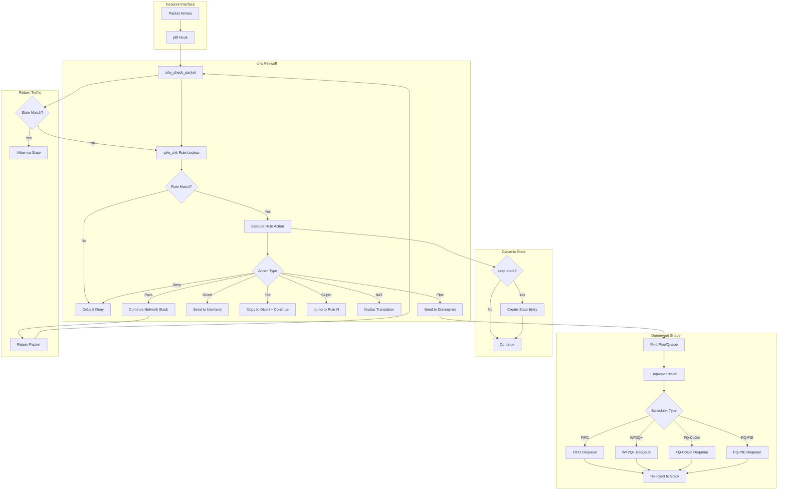

# ipfw and dummynet — Native Firewall and Traffic Shaper
<!-- This file is auto-generated by generate-doc.py -- do not edit manually -->

---
**Navigation:**
  **Related:** [Network Stack — Architecture and Packet Flow](../../net/README.md) | [VNET — Virtual Network Stacks](../../net/README_vnet.md) | [pf — OpenBSD-derived Packet Filter](../pf/README.md)
  **All chapters:** [Source Tree — Layout and Conventions](../../../README_internals.md) | [Boot Process — UEFI Bootloader to Kernel Handoff](../../../stand/efi/loader/README.md) | [Kernel Core — Structure and Entry Point](../../README.md) | [Build System — buildworld and buildkernel](../../../share/mk/README.md) | [Virtual Memory Subsystem — vm_page, UMA, and Pagers](../../vm/README.md) | [Process Management — Scheduling and Lifecycle](../../kern/README_process.md) | [Locking Primitives — Mutexes, sx, rmlocks, and Atomics](../../kern/README_locking.md) | [Buffer Cache — Block I/O Subsystem](../../vm/README_bcache.md) ...
---


> ⚠ **UNVERIFIED DRAFT** — revision 1 truncated — kept prior draft; reviewer did not explicitly approve this draft; fact-check revision failed — paths/structs may be hallucinated. Treat claims as suspect until manually reviewed.


## Quick Summary

FreeBSD's `ipfw` (IP firewall) is a stateful packet inspection framework that combines filtering, NAT, and traffic shaping in a single subsystem. Unlike `pf`, which uses a last-match policy, `ipfw` applies the first matching rule and stops — a model that mirrors classic BSD packet filters but with far richer capabilities. `ipfw` attaches to the `pfil` hook framework, the same mechanism used by `pf`, to intercept packets at the input and output paths of the network stack. Its rule set is stored in-kernel as a sorted chain, and lookups are accelerated by a hash/radix table for efficient rule references.

Coupled with `ipfw` is `dummynet`, a traffic-shaping and Active Queue Management (AQM) subsystem. When an `ipfw` rule matches a packet and specifies a `pipe` action, the packet is diverted into `dummynet`'s internal queueing discipline. `dummynet` organizes traffic into pipes (which hold schedulers), queues, and flow classes. Packets are enqueued, shaped according to bandwidth and buffer limits, and re-injected back into the network stack. `dummynet` supports FIFO, WF2Q+, FQ-CoDel, and FQ-PIE schedulers, making it a full-featured alternative to Linux's `tc`/`fq_codel` or OpenBSD's `pf` rate limiting.

`ipfw` also provides in-kernel NAT via `libalias`, a modular address-translation library. NAT in `ipfw` is configured per-interface and maintains stateful mappings for port redirections and spool-based address pools. Dynamic state tracking — another `ipfw` feature — automatically creates temporary states for protocols like FTP or SIP, enabling stateful filtering without manual state rules.

Together, `ipfw` and `dummynet` form a unified firewall-shaping stack that has been part of FreeBSD since the late 1990s. While `pf` has gained popularity for its declarative rule language and last-match semantics, `ipfw` remains the only native FreeBSD solution that combines stateful filtering, NAT, and traffic shaping in a single subsystem.

## Architecture

### The pfil Hook and Packet Entry Path

`ipfw` registers itself as a `pfil_hook` on both the input and output paths. The registration is performed in `sys/netpfil/ipfw/ip_fw_pfil.c`:

```c
static pfil_hook_t *ipfw_in6_hook;
static pfil_hook_t *ipfw_in_hook;
static pfil_hook_t *ipfw_out6_hook;
static pfil_hook_t *ipfw_out_hook;
```

Each hook is associated with a function pointer (`ipfw_chk`) that the `pfil` framework calls for every traversing packet. The `pfil` framework is architecture-neutral and used by both `pf` and `ipfw`. When `pf` and `ipfw` are loaded simultaneously, they are attached to different pfil hook orderings — `pf` hooks are typically registered first (lower ordering value), meaning `pf` runs before `ipfw` on the same path. This ordering is configurable at load time via module parameters.

The entry function `ipfw_chk()` (`sys/netpfil/ipfw/ip_fw2.c`) receives an `ip_fw_args` structure, initializes the rule reference, and begins rule evaluation:

```c
static pfil_return_t
ipfw_check_packet(struct mbuf **m0, struct ifnet *ifp, int flags,
    void *ruleset __unused, struct inpcb *inp)
{
	struct ip_fw_args args;
	struct m_tag *tag;
	pfil_return_t ret;
	int ipfw;

	args.flags = (flags & PFIL_IN) ? IPFW_ARGS_IN
	    : IPFW_ARGS_OUT;
	/* ... */
	ret = ipfw_chk(&args, m0);
	/* ... */
	return ret;
}
```

### Rule Evaluation: First-Match Semantics

The core rule evaluation loop is in `ipfw_chk()` (`ip_fw2.c`). Rules are stored in a sorted chain (`struct ip_fw_chain`), and the lookup is performed inline within `ipfw_chk()` using a radix/hash-based algorithm to find the first matching rule. Unlike `pf`, which scans all rules and keeps the last match, `ipfw` stops at the first match:

```c
enum {
	IP_FW_PASS = 0,
	IP_FW_DENY,
	IP_FW_DIVERT,
	IP_FW_TEE,
	IP_FW_DUMMYNET,
	IP_FW_NETGRAPH,
	IP_FW_NGTEE,
	IP_FW_NAT,
	IP_FW_REASS,
	IP_FW_NAT64,
};
```

This return value determines the next action. `IP_FW_PASS` allows the packet to continue through the network stack, `IP_FW_DENY` drops it, `IP_FW_DIVERT` sends it to a divert port (for userland processing), `IP_FW_TEE` copies the packet to a divert port while continuing processing, and `IP_FW_DUMMYNET` sends it to the dummynet shaper.

The first-match semantics has significant implications for rule design. Rules must be ordered from most specific to most general, as the first match wins and subsequent rules are never evaluated. This contrasts with `pf`, where the last match wins and rules can be written in a more natural order (specific exceptions before general rules). In `ipfw`, a common pattern is to place deny rules before more permissive rules, or to use `skipto` to jump to a specific rule number when stateful NAT is required.

### Control Flow Primitives: divert, tee, skipto

`ipfw` provides several control flow primitives that allow complex rule interactions:

- **divert**: Sends the packet to a userland process listening on a divert port. The packet is consumed by ipfw and not delivered to the local stack or forwarded.
- **tee**: Copies the packet to a divert port while continuing normal processing. Both the diverted copy and the original proceed.
- **skipto**: Jumps to a specific rule number, skipping intermediate rules. This is useful when stateful rules (like `keep-state`) need to be placed after NAT rules.

These primitives are implemented in `ip_fw2.c` through the `ipfw_run_eaction()` function, which dispatches based on the rule's action opcode.

### Dynamic State Tracking

Dynamic state tracking is implemented in `sys/netpfil/ipfw/ip_fw_dynamic.c`. When a rule with the `keep-state` option matches, ipfw creates a temporary state entry that allows return traffic to pass without an explicit rule. Four hash tables are maintained: `dyn_ipv4`, `dyn_ipv6`, `dyn_ipv4_parent`, and `dyn_ipv6_parent`. States are keyed by source/destination addresses, protocol, and ports, with configurable lifetimes.

```c
/* Dynamic states are stored in lists accessed through a hash tables
 * whose size is curr_dyn_buckets. */
struct dyn_ipv4_state {
	/* state data for IPv4 connections */
};

struct dyn_ipv6_state {
	/* state data for IPv6 connections */
};
```

The dynamic state system also supports parent states for protocols like FTP that open secondary connections. The `dyn_parent` structure tracks the parent connection, allowing child connections to be associated with the original state.

### In-Kernel NAT

NAT in `ipfw` is implemented via `libalias`, a modular address-translation library. The configuration is stored in `sys/netpfil/ipfw/ip_fw_nat.c` using the following structures:

```c
struct cfg_nat {
	LIST_ENTRY(cfg_nat)	_next;
	int			id;
	struct in_addr		ip;
	struct libalias		*lib;
	int			mode;
	int			redir_cnt;
	LIST_HEAD(redir_chain, cfg_redir) redir_chain;
	char			if_name[IF_NAMESIZE];
	u_short			alias_port_lo;
	u_short			alias_port_hi;
};

struct cfg_redir {
	LIST_ENTRY(cfg_redir)	_next;
	uint16_t		mode;
	uint16_t		proto;
	struct in_addr		laddr;
	struct in_addr		paddr;
	uint16_t		lport;
	uint16_t		pport;
	struct alias_link	**alink;
};
```

NAT in `ipfw` is configured per-interface and maintains stateful mappings for port redirections and spool-based address pools. This differs from `pf`'s NAT, which is configured using `rdr` and `nat` rules in the packet filter rule set. `ipfw`'s NAT is more tightly integrated with the firewall rules, allowing NAT to be conditional on other firewall criteria.

### Dummynet: Traffic Shaping and AQM

`dummynet` is the traffic-shaping subsystem that `ipfw` drives. When a rule specifies a `pipe` action, the packet is enqueued into dummynet's internal scheduler. The packet flow is:

1. `ipfw_chk()` matches a rule with a `pipe` action
2. `dummynet_send()` (`ip_dn_io.c`) enqueues the packet
3. The scheduler's `dequeue` function is called when bandwidth is available
4. The packet is re-injected into the network stack

`dummynet` supports multiple scheduling algorithms registered via the `dn_alg` structure in `dn_sched.h`:

```c
struct dn_alg {
	uint32_t type;
	const char *name;
	uint32_t flags;	/* DN_MULTIQUEUE if supports multiple queues */
	size_t schk_datalen;
	size_t si_datalen;
	size_t q_datalen;

	/* Function pointers for scheduler operations */
	int (*enqueue)(struct mbuf *m, struct dn_sched *s,
	    struct dn_queue *q);
	struct mbuf *(*dequeue)(struct dn_sched *s, int *isq);
	/* ... */
};
```

The supported schedulers include:
- **FIFO**: Simple first-in, first-out queue
- **WF2Q+**: Weighted Fair Queueing with enhanced fairness
- **FQ-CoDel**: Flow-Queue Controlled Delay — combines flow classification with CoDel AQM
- **FQ-PIE**: Flow-Queue Proportional Integral Controller Enhanced
- **Priority**: Priority-based scheduling
- **RR**: Round Robin
- **QFQ**: Quantized Fair Queueing

## Key Data Structures

### `struct ip_fw_chain`

Defined in `sys/netpfil/ipfw/ip_fw_private.h`, this structure represents the chain of rules for a given address family:

```c
struct ip_fw_chain {
	struct ip_fw	*rules;		/* array of rules */
	int		nrules;		/* number of rules */
	int		id;		/* chain identifier */
	struct rmlock	rwmtx;		/* rule chain lock */
	/* ... other fields */
};
```

The rule chain is sorted by rule number, enabling efficient radix-based lookups. The `rmlock` protects concurrent access to the rule set during configuration changes.

### `struct ip_fw`

Defined in `sys/netinet/ip_fw.h`, each rule contains an opcode array and associated data:

```c
struct _ipfw_insn {
	uint8_t opcode;
	uint8_t arg1;
	uint8_t len;
	uint8_t _pad;
	uint32_t count;
	uint32_t counter;
};
```

Rules are composed of a sequence of instructions (`_ipfw_insn`), each with an opcode (match criteria or action) and optional arguments. The `len` field indicates the total length of the instruction including any extension data.

### `struct dn_parms`

Defined in `sys/netpfil/ipfw/ip_dn_private.h`, this is the global dummynet configuration:

```c
struct dn_parms {
	uint32_t	id;		/* configuration version */
	int		red_lookup_depth;
	int		red_avg_pkt_size;
	int		red_max_pkt_size;
	int		hash_size;
	int		max_hash_size;
	long		byte_limit;
	long		slot_limit;
	int		io_fast;
	int		debug;
	struct timeval	prev_t;
	struct dn_heap	evheap;		/* scheduled events */
	/* ... */
};
```

The `evheap` is a binary heap used to track pending timer events for flow expiration and scheduler rescheduling.

### `struct dn_queue`

Defined in `sys/netpfil/ipfw/ip_dn_private.h`, represents a queue within a scheduler:

```c
struct dn_queue {
	struct dn_id	id;
	struct dn_id	parent_id;
	struct mq	mq;		/* packet queue */
	/* ... scheduler-specific data */
#ifdef NEW_AQM
	struct dn_aqm	*aqm;		/* AQM algorithm */
#endif
};
```

The `mq` field contains the actual packet queue (head, tail, count). The queue can be attached to an AQM algorithm (CoDel or PIE) for active queue management.

### `struct dn_schk`

Defined in `sys/netpfil/ipfw/ip_dn_private.h`, represents a scheduler instance:

```c
struct dn_schk {
	struct dn_id	id;
	struct dn_alg	*alg;		/* scheduler algorithm */
	struct dn_fsk	fsk;		/* flow set */
	/* ... per-instance data */
};
```

The scheduler instance holds the flow set (`dn_fsk`) which contains the queues for individual flows in multi-queue schedulers like FQ-CoDel.

### `struct mq`

Defined in `sys/netpfil/ipfw/ip_dn_private.h`, a simple packet queue:

```c
struct mq {
	struct mbuf *head, *tail;
	int count;
};
```

This is the fundamental queue structure used by all schedulers. It maintains a linked list of mbufs with head/tail pointers and a packet count.

## Deep Dive

### Packet Processing Flow: From pfil to Dummynet

When a packet arrives at the network interface, it traverses the input pfil hooks. If `ipfw` is loaded, `ipfw_check_packet()` in `sys/netpfil/ipfw/ip_fw_pfil.c` is called:

```c
static pfil_return_t
ipfw_check_packet(struct mbuf **m0, struct ifnet *ifp, int flags,
    void *ruleset __unused, struct inpcb *inp)
{
	struct ip_fw_args args;
	struct m_tag *tag;
	pfil_return_t ret;
	int ipfw;

	args.flags = (flags & PFIL_IN) ? IPFW_ARGS_IN
	    : IPFW_ARGS_OUT;
	args.ifp = ifp;
	args.inp = inp;
	/* ... initialize args ... */

	ret = ipfw_chk(&args, m0);

	/* Handle return values */
	switch (ret) {
	case IP_FW_PASS:
		break;
	case IP_FW_DENY:
		*m0 = NULL;
		ret.result = PFIL_CONSUMED;
		break;
	case IP_FW_DUMMYNET:
		/* Packet sent to dummynet, consumed */
		*m0 = NULL;
		ret.result = PFIL_CONSUMED;
		break;
	/* ... */
	}
	return ret;
}
```

The `ipfw_chk()` function in `sys/netpfil/ipfw/ip_fw2.c` performs the rule lookup and execution:

```c
int
ipfw_chk(struct ip_fw_args *args, struct mbuf **m0)
{
	struct ip_fw_chain *chain = &V_layer3_chain;
	struct ip_fw *rule;
	int ret;

	/* Find matching rule using radix/hash lookup */
	rule = ipfw_rule_lookup(chain, args);
	if (rule == NULL)
		return IP_FW_DENY;  /* default deny */

	/* Execute rule instructions */
	ret = ipfw_chk_rule(args, rule);
	return ret;
}
```

The rule lookup uses a radix tree optimized for the sorted rule array, enabling O(log n) lookups even with thousands of rules. When a rule with a `pipe` action is matched, the packet is sent to dummynet via `dummynet_send()`:

```c
static int
dummynet_send(struct mbuf *m, struct ip_fw_args *args, int pipe_id)
{
	struct dn_queue *q;
	struct dn_parms *dn = &V_dn_cfg;

	/* Find the pipe by ID */
	q = ipdn_q_find(pipe_id);
	if (q == NULL) {
		m_freem(m);
		return (0);
	}

	/* Enqueue the packet */
	dn_enqueue(m, q, args);

	/* Schedule dequeue if needed */
	dn_reschedule();

	return (0);
}
```

### Dummynet Scheduling: FQ-CoDel Deep Dive

FQ-CoDel (`dn_sched_fq_codel.c`) combines flow classification with CoDel AQM. Each flow is hashed based on packet headers and placed in a separate CoDel queue:

```c
static int
fq_codel_enqueue(struct mbuf *m, struct dn_sched *s, struct dn_queue *q)
{
	struct fq_codel_si *si = (struct fq_codel_si *)s->si_data;
	struct fq_codel_flow *flow;
	uint32_t flow_hash;

	/* Classify packet into a flow */
	flow_hash = hash_packet(m);
	flow = fq_codel_classify_flow(si, flow_hash, m);

	/* Enqueue into flow's CoDel queue */
	fq_codel_enqueue(m, flow);

	return (0);
}
```

The CoDel algorithm monitors the minimum queue delay over a sliding window. When the delay exceeds a target threshold, packets are dropped to signal congestion to the sender. The FQ variant ensures fair bandwidth allocation across flows by maintaining separate queues per flow.

The dequeue function extracts packets from the oldest non-empty flow queue:

```c
static struct mbuf *
fq_codel_dequeue(struct dn_sched *s, int *isq)
{
	struct fq_codel_si *si = (struct fq_codel_si *)s->si_data;
	struct fq_codel_flow *flow;
	struct mbuf *m;

	/* Find flow with oldest packet */
	flow = fq_codel_find_oldest_flow(si);
	if (flow == NULL)
		return (NULL);

	/* Dequeue from flow's CoDel queue */
	m = fq_codel_dequeue_flow(flow);

	return (m);
}
```

### Dynamic State Creation and Matching

When a rule with `keep-state` matches, `dyn_create()` in `sys/netpfil/ipfw/ip_fw_dynamic.c` creates a state entry:

```c
static struct dyn_state_obj *
dyn_create(struct ip_fw *rule, struct ip_fw_args *args, int dir)
{
	struct dyn_state_obj *state;
	uint32_t hash;

	/* Allocate state from UMA zone */
	state = dyn_alloc_ipv4_state(rule, args);
	if (state == NULL)
		return (NULL);

	/* Hash and insert into state table */
	hash = flow_id_hash(args);
	dyn_install_state(state, hash);

	return (state);
}
```

Return traffic is matched against the state table in `dyn_lookup_ipv4_state()`:

```c
static struct dyn_state_obj *
dyn_lookup_ipv4_state(struct ip_fw_args *args)
{
	uint32_t hash;
	struct dyn_state_obj *state;

	hash = flow_id_hash(args);
	state = dyn_lookup_ipv4_state_locked(hash, args);

	if (state != NULL) {
		dyn_update(state);  /* Refresh lifetime */
		return (state);
	}
	return (NULL);
}
```

### NAT Configuration and Packet Translation

NAT is configured per-interface via `ipfw_nat_cfg()` in `sys/netpfil/ipfw/ip_fw_nat.c`:

```c
int
ipfw_nat_cfg(struct cfg_nat *cfg, int op)
{
	struct cfg_nat *ptr;
	struct ip_fw_chain *chain = &V_layer3_chain;

	IPFW_UH_WLOCK(chain);

	switch (op) {
	case IPFW_ADD:
		/* Add new NAT configuration */
		ptr = malloc(sizeof(*ptr), M_TEMP, M_WAITOK | M_ZERO);
		*ptr = *cfg;
		LIST_INSERT_HEAD(&chain->nat, ptr, _next);
		break;
	case IPFW_DEL:
		/* Remove NAT configuration */
		LIST_FOREACH(ptr, &chain->nat, _next) {
			if (ptr->id == cfg->id) {
				LIST_REMOVE(ptr, _next);
				free_nat_instance(ptr);
				break;
			}
		}
		break;
	}

	IPFW_UH_WUNLOCK(chain);
	return (0);
}
```

When a packet traverses a NAT rule, `ipfw_nat()` in `ip_fw_nat.c` performs the address translation using `libalias`:

```c
static int
ipfw_nat(struct ip_fw *rule, struct ip_fw_args *args, struct mbuf **m0)
{
	struct cfg_nat *nat;
	struct libalias *la;
	struct mbuf *m = *m0;

	/* Find NAT configuration for this interface */
	nat = lookup_nat(rule, args->ifp);
	if (nat == NULL)
		return (IP_FW_DENY);

	la = nat->lib;

	/* Perform NAT translation via libalias */
	if (args->flags & IPFW_ARGS_IN) {
		/* Inbound: translate destination */
		la->AliasInboundPacket(la, m);
	} else {
		/* Outbound: translate source */
		la->AliasOutboundPacket(la, m);
	}

	/* Adjust checksums */
	cksum_adjust(m, args);

	return (IP_FW_NAT);
}
```

## Flow / Diagram



## Advanced Notes

### DTrace Probes for ipfw

`ipfw` provides SDT (Static DTrace Tracing) probes for debugging and performance analysis. The `ipfw` provider defines the `rule__matched` probe in `ip_fw2.c`:

```c
SDT_PROBE_DEFINE6(ipfw, , , rule__matched,
    "int",			/* retval */
    "int",			/* af */
    "void *",			/* src addr */
    "void *",			/* dst addr */
    "struct ip_fw_args *",	/* args */
    "struct ip_fw *"		/* rule */);
```

This probe fires when a rule matches, providing the return value, address family, source/destination addresses, args structure, and the matching rule pointer. Additional probes exist in `dummynet` for packet drops:

```c
SDT_PROBE_DEFINE2(dummynet, , , drop, "struct mbuf *", "struct dn_queue *");
```

Using DTrace, administrators can trace rule matches, identify which rules are processing the most traffic, and diagnose shaping behavior:

```bash
dtrace -n 'sdt:ipfw:rule__matched { @count[arg5] = count(); }'
dtrace -n 'sdt:dummynet:drop { @drops = count(); }'
```

### Performance Considerations

**Rule Lookup Optimization**: `ipfw` uses a radix-based lookup for rule chains, which provides O(log n) performance even with thousands of rules. The rule chain is sorted by rule number, enabling binary search. For very large rule sets (10,000+ rules), consider using `skipto` to create rule groups and reduce the effective search space.

**Dynamic State Hash Tables**: The dynamic state tables use configurable hash bucket sizes (`dyn_buckets` sysctl). When the number of states exceeds the bucket count, lookup performance degrades due to longer hash chains. Monitor state counts via `sysctl net.inet.ip.fw.dyn_count` and adjust `dyn_buckets` accordingly.

**Dummynet Scheduler Lock**: `dummynet` uses a single mutex (`sched_mtx`) to protect scheduler operations. Under high packet rates, this can become a bottleneck. The `io_fast` mode in `dn_parms` reduces locking overhead by batching operations. Enable via `sysctl net.inet.ip.fw.dummynet.io_fast=1`.

**FQ-CoDel Flow Classification**: FQ-CoDel classifies flows based on packet headers. For IPv4, the hash includes source/destination addresses and ports. For IPv6, the flow label is used when available. Ensure that your traffic patterns create reasonable flow counts — too many flows can exhaust the hash table, too few can lead to unfair bandwidth allocation.

### Common Pitfalls

**Rule Ordering**: The first-match semantics requires careful rule ordering. A common mistake is placing a general "allow all" rule before specific deny rules, which renders the deny rules ineffective. Always test rule sets with `ipfw -v add` to verify the order.

**NAT and keep-state Interaction**: When using NAT with `keep-state`, the state is created based on the post-NAT addresses. Return traffic arrives with the public address, which must match the state. Use `skipto` to skip over stateful rules when configuring NAT:

```
ipfw add nat 100 ip from any to any via fxp0
ipfw add skipto 200 ip from any to any via fxp0
ipfw add 200 keep-state ip from any to any
```

**Dummynet Pipe ID Conflicts**: Pipe IDs are global within a VNET. Ensure that pipe IDs do not conflict when using multiple VNETs or when reconfiguring the firewall. The `dummynet` configuration ID (`dn_parms.id`) is incremented on each configuration change to detect stale pointers.

**VNET Isolation**: `ipfw` and `dummynet` are VNET-aware. Each VNET has its own rule chain, NAT configuration, and dummynet state. Ensure that configuration commands target the correct VNET when using network virtualization.

### Connection to OS Theory

The `ipfw`/`dummynet` subsystem exemplifies several operating system concepts:

**First-Match vs Last-Match**: The first-match semantics mirrors the classic Unix `ipfw` design, where rules are evaluated top-down and the first match wins. This is efficient for lookups but requires careful rule ordering. In contrast, `pf`'s last-match semantics allows rules to be written in a more natural order (specific before general), at the cost of scanning all rules. This trade-off reflects the broader OS design question: optimize for lookup speed or for configuration ease.

**Active Queue Management**: `dummynet`'s implementation of CoDel and PIE represents the modern approach to AQM, which monitors queue delay rather than just queue length to detect congestion. CoDel, developed by Nick McKeown and others at Stanford, has been adopted in Linux (as `fq_codel`) and FreeBSD, replacing the older RED (Random Early Detection) algorithm. The FQ variant adds flow-level fairness, preventing a single flow from dominating bandwidth.

**Hash-Based State Tables**: The dynamic state system uses hash tables for O(1) average-case lookups, a fundamental data structure in operating systems. The configurable bucket count and collision handling reflect the trade-off between memory usage and lookup performance.

## Comparison

### FreeBSD ipfw vs Linux netfilter

FreeBSD's `ipfw` and Linux's `netfilter`/`nftables` both provide firewall, NAT, and traffic shaping, but with different architectures:

- **Rule Evaluation**: `ipfw` uses first-match semantics with a sorted rule chain, while `nftables` uses a last-match policy with a bytecode interpreter. `netfilter`'s older `iptables` uses first-match like `ipfw`, but `nftables` represents a significant architectural shift.
- **Traffic Shaping**: `ipfw` integrates `dummynet` directly, allowing rules to reference pipes. Linux uses `tc` (traffic control) as a separate subsystem with `clsact` qdiscs attached to interfaces. This separation gives Linux more flexibility but requires more configuration.
- **NAT**: Both use hash tables for NAT state, but `ipfw`'s `libalias` is a library embedded in the kernel, while Linux's `nf_nat` is part of the netfilter framework.
- **VNET Support**: FreeBSD's `ipfw` is VNET-aware by design, with separate state per virtual network. Linux achieves isolation through network namespaces, which are a more general mechanism.

### FreeBSD ipfw vs OpenBSD pf

`pf` and `ipfw` are both native FreeBSD firewalls with different design philosophies:

- **Rule Language**: `pf` uses a declarative language with tables and anchors, while `ipfw` uses a command-line interface with a structured rule format. `pf`'s language is more expressive for complex policies.
- **Last-Match vs First-Match**: `pf` uses last-match, allowing rules to be written in natural order. `ipfw` uses first-match, requiring careful ordering.
- **Stateful Filtering**: Both support stateful filtering, but `pf`'s `state` keyword is more integrated with the rule language. `ipfw`'s `keep-state` creates dynamic states that are matched against return traffic.
- **Traffic Shaping**: `ipfw` has `dummynet` built in, while `pf` relies on `altq` (alternate queuing) which is less feature-rich. `dummynet` supports more scheduler types and AQM algorithms.
- **Performance**: `pf` is generally faster for simple filtering due to its optimized bytecode interpreter. `ipfw` can be faster for complex policies with many rules due to its radix-based lookup.

### macOS/XNU and NetBSD

macOS (XNU kernel) includes a variant of `ipfw` for compatibility, but has shifted toward `pf` for new deployments. NetBSD uses `ipfw` as its primary firewall, with similar architecture to FreeBSD but with some differences in the rule evaluation and state tracking implementations.

## See Also
- [Network Stack — Architecture and Packet Flow](../../../sys/net/README.md)
- [pf — OpenBSD-derived Packet Filter](../../../../sys/netpfil/pf/README.md)
- [VNET — Virtual Network Stacks](../../../sys/net/README_vnet.md)


- [Network Stack — Architecture and Packet Flow](../../net/README.md)
- [VNET — Virtual Network Stacks](../../net/README_vnet.md)
- [pf — OpenBSD-derived Packet Filter](../pf/README.md)
- [sys/netpfil/ipfw/](../../sys/netpfil/ipfw/) — Source directory
- [netinet/libalias/](../../sys/netinet/libalias/) — libalias NAT library
- [man 4 dummynet](https://man.freebsd.org/cgi/man.cgi?query=dummynet) — Dummynet manual page
- [man 8 ipfw](https://man.freebsd.org/cgi/man.cgi?query=ipfw) — ipfw manual page

---

> _Generated by [DaemonDocs](https://github.com/ocochard/DaemonDocs) on 2026-04-30 13:18 UTC using model `Qwen3.6-35B-A3B-UD-Q4_K_XL` (llama.cpp build `b8985-27aef3dd9`). AI-generated content — verify against source before relying on it._
