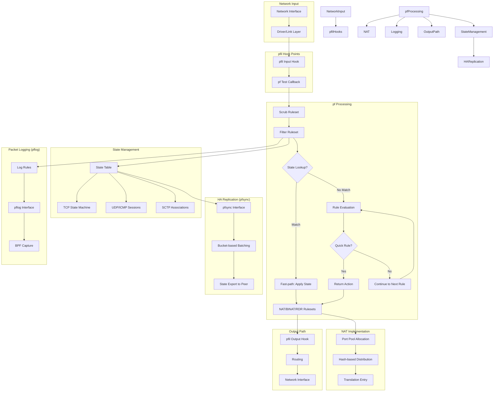

# pf — OpenBSD-derived Packet Filter
<!-- This file is auto-generated by generate-doc.py -- do not edit manually -->

---
**Navigation:**
  **Up:** [Kernel Core — Structure and Entry Point](../../README.md) ▸ [Source Tree — Layout and Conventions](../../../README_internals.md)
  **Related:** [Network Stack — Architecture and Packet Flow](../../net/README.md) | [VNET — Virtual Network Stacks](../../net/README_vnet.md) | [ipfw and dummynet — Native Firewall and Traffic Shaper](../ipfw/README.md)
  **All chapters:** [Source Tree — Layout and Conventions](../../../README_internals.md) | [Boot Process — UEFI Bootloader to Kernel Handoff](../../../stand/efi/loader/README.md) | [Kernel Core — Structure and Entry Point](../../README.md) | [Build System — buildworld and buildkernel](../../../share/mk/README.md) | [Virtual Memory Subsystem — vm_page, UMA, and Pagers](../../vm/README.md) | [Process Management — Scheduling and Lifecycle](../../kern/README_process.md) | [Locking Primitives — Mutexes, sx, rmlocks, and Atomics](../../kern/README_locking.md) | [Buffer Cache — Block I/O Subsystem](../../vm/README_bcache.md) ...
---

> ⚠ **UNVERIFIED DRAFT** — reviewer did not explicitly approve this draft. Treat claims as suspect until manually reviewed.

## Quick Summary

pf (packet filter) is FreeBSD's stateful packet filtering and NAT engine, ported from OpenBSD. It operates as a module within the `netpfil` (network packet filter) framework, attaching to the same `pfil` hook points that `ipfw` uses — the IP input and output paths. When a packet arrives on a network interface, it traverses the protocol stack; at key decision points (after link-layer input, before forwarding or delivery, and after routing before output), the `pfil` framework invokes registered hooks. pf registers itself as a callback with the pfil framework, which is invoked at key points in the network stack.

pf's architecture follows a modular, ruleset-based model. Rules are organized into five rulesets: scrub (normalization), filter (allow/deny), NAT (source/destination translation), BINAT (bidirectional NAT), and RDR (redirect, equivalent to DNAT). Each ruleset contains a tree of compiled rule entries. When a packet traverses pf, it is processed sequentially through each ruleset in order. Within each ruleset, rules are evaluated in order, and the **last matching rule wins** — a design inherited from OpenBSD that ensures later rules can override earlier, more general ones. Rules marked with the `quick` flag cause immediate termination of evaluation for that ruleset, returning the action specified by that rule.

pf is stateful: when a filter rule with the `pass` action and `state` keyword matches, pf creates a state entry in its state table. Subsequent packets that match the state are fast-pathed through without full rule evaluation. The state table tracks TCP connections, UDP sessions, ICMP flows, and SCTP associations, with configurable timeouts for each type. pf also implements NAT, which interacts with the state table to translate addresses and ports, and supports advanced features like port pools with hash-based load distribution, source tracking, and table-based address matching.

For high-availability deployments, pf provides the `if_pfsync` interface, which replicates state entries between peer firewalls. The pfsync protocol transmits state additions, deletions, and updates over a dedicated sync interface, allowing a standby firewall to maintain an identical state table and take over if the active firewall fails. For packet logging, `if_pflog` provides a virtual bpf-capable interface that receives copies of packets matching `log` or `log (all)` rules, enabling tools like `pcap` and `tcpdump` to capture firewall-relevant traffic without inspecting every packet.

## Architecture

pf is implemented across several source files in `sys/netpfil/pf/`. The main entry and hook registration logic resides in `pf.c`, while the core packet processing function and state management are in `pf.c`. Normalization (scrub) is handled in `pf_norm.c`, NAT and load balancing in `pf_lb.c`, ioctl command handling in `pf_ioctl.c`, tables in `pf_table.c`, and SYN cookies in `pf_syncookies.c`.

### Hook Registration

pf attaches to the pfil framework during module load. The registration process adds pf's callback to the pfil hook structures for IPv4 and IPv6 input and output paths. These hooks are invoked at key decision points in the network stack's IP input and output code paths.

```c
/* Verified from sys/netpfil/pf/pf.c */
pfil_register(PFIL_TYPE_IPINPUT, PFIL_IN, pf_test, NULL, &pf_fil_head[0]);
pfil_register(PFIL_TYPE_IPV6INPUT, PFIL_IN, pf_test, NULL, &pf_fil_head[1]);
pfil_register(PFIL_TYPE_IPOUTPUT, PFIL_OUT, pf_test, NULL, &pf_fil_head[2]);
pfil_register(PFIL_TYPE_IPV6OUTPUT, PFIL_OUT, pf_test, NULL, &pf_fil_head[3]);
```

The pfil framework maintains a linked list of registered callbacks for each hook point. When a packet reaches the hook point, each registered callback is invoked in order. pf's callback receives the packet and invokes the packet filter evaluation logic.

### Ruleset Evaluation

pf organizes rules into five rulesets defined in `pf.h`:

```c
/* Verified from sys/netpfil/pf/pf.h */
enum	{ PF_RULESET_SCRUB, PF_RULESET_FILTER, PF_RULESET_NAT,
	  PF_RULESET_BINAT, PF_RULESET_RDR, PF_RULESET_MAX };
```

Each ruleset is represented by a `struct pf_ruleset`, which contains a tree of compiled rules. When a packet traverses pf, it is processed through each ruleset in sequence: scrub first, then filter, then NAT, BINAT, and RDR. Within each ruleset, rules are evaluated in order, and the **last matching rule wins** — a design decision that allows administrators to write broad rules early and specific overrides later.

Rules can be marked with the `quick` flag. When a rule with `quick` matches, pf immediately returns the action specified by that rule and skips remaining rules in the current ruleset. This provides a way to short-circuit evaluation for high-priority rules, such as blocking known-bad addresses before expensive state lookups.

### State Table

pf's state table is the core of its stateful inspection capability. When a filter rule with the `pass` action and `state` keyword matches, pf creates a state entry in its state table. This state entry is then used to fast-path subsequent packets belonging to the same connection without full rule evaluation.

The state table tracks:
- TCP connections (with full state machine tracking)
- UDP sessions (unidirectional and bidirectional)
- ICMP flows
- SCTP associations

Each state entry includes configurable timeouts for different connection phases, defined by the `PFTM_*` constants in `pf.h`.

### NAT and Load Balancing

pf's NAT implementation lives in `pf_lb.c` and supports source NAT, destination NAT, and bidirectional NAT. NAT rules interact with the state table to create translation entries. When a packet matches a NAT rule, pf allocates a port from a port pool and creates a state entry that includes the translation information.

Port pools support hash-based load distribution, using SipHash24 to distribute connections across multiple addresses. The hash function in `pf_lb.c` ensures that packets from the same source consistently map to the same pool member, maintaining connection affinity.

### Normalization (Scrub)

Normalization, or "scrub," is the first ruleset processed by pf. The `pf_norm.c` file implements IP fragment reassembly, MSS normalization, and other packet normalization operations. Scrub runs before filtering to ensure that fragmented packets are reassembled before rule evaluation, preventing evasion techniques that rely on fragment overlap.

Fragment reassembly uses a red-black tree keyed by source address, destination address, protocol, and fragment ID. Each fragment is stored in a fragment entry (`struct pf_frent`), and fragments are reassembled into a complete packet before filtering. Fragments are grouped into `struct pf_fragment`, which is keyed by a `struct pf_frnode` containing the source/destination address pair and protocol.

### pfsync State Replication

The `if_pfsync.c` file implements the pfsync protocol for state replication between HA pairs. pfsync transmits state additions, deletions, and updates over a dedicated sync interface (typically a point-to-point link). The protocol uses a bucket-based deferred update mechanism to batch state changes and reduce network traffic.

pfsync supports both IPv4 and IPv6 state replication, and integrates with CARP for automatic failover. When a CARP master fails, the CARP backup promotes itself and begins using the replicated state table without requiring manual intervention.

### pflog Packet Logging

The `if_pflog.c` file implements a virtual bpf-capable interface that receives copies of packets matching `log` or `log (all)` rules. pflog interfaces are cloned automatically when the module loads, and each interface is associated with a specific pf ruleset. When a packet matches a log rule, pf copies the packet to the appropriate pflog interface, where it can be captured by `tcpdump` or other packet capture tools.

## Key Data Structures

The pf subsystem uses several key data structures defined in `sys/netpfil/pf/pf.h`. Below is a prose description of each, since the actual definitions are complex and span multiple related types.

### `struct pf_krule`

The `struct pf_krule` represents a compiled pf rule in kernel space. It contains match criteria (addresses, ports, protocols, interfaces) and actions for all five rulesets. Key fields include the rule's action (`PF_PASS`, `PF_DROP`, `PF_NAT`, `PF_RDR`, etc.), a `quick` flag indicating whether this rule terminates evaluation, a `ticket` for atomic updates, and timeout values. Rules are stored in a red-black tree (`pf_rule_tree`) within each ruleset.

### `struct pf_ruleset`

Each ruleset is represented by a `struct pf_ruleset`, which contains pointers to anchor rules for IPv4/IPv6 and Ethernet, a pointer to the rules tree, a rule count, and a ticket for atomic updates. When rules are modified, the ticket is incremented, and state entries check the ticket to ensure consistency.

### Fragment Reassembly Structures

Fragment reassembly is implemented in `pf_norm.c`. The core structure is `struct pf_frent` (fragment entry), which holds a pointer to the fragment's mbuf (`fe_m`), header length (`fe_hdrlen`), extension offset (`fe_extoff`), length (`fe_len`), offset (`fe_off`), and more-fragments flag (`fe_mff`). Fragments are grouped into `struct pf_fragment`, which is keyed by a `struct pf_frnode` containing the source/destination address pair and protocol. Fragments are queued by offset using a `TAILQ`, and the reassembly logic fills holes in the fragment sequence.

### pfsync Softc Structure

The pfsync softc structure (`struct pfsync_softc` in `if_pfsync.c`) manages state replication. It holds a pointer to the pfsync interface (`sc_ifp`), a peer interface pointer (`sc_sync_if`), a peer address (`sc_sync_peer`), flags (`sc_flags`), maximum updates (`sc_maxupdates`), a template mbuf (`sc_template`), a mutex (`sc_mtx`), and version information (`sc_version`). pfsync uses a bucket-based deferred update mechanism (`struct pfsync_bucket`) to batch state changes and reduce network traffic.

### State Table Structures

The state table uses several related structures defined in `pfvar.h`:
- `struct pf_kstate`: The main state entry, containing comparison fields (`id`, `creatorid`, `direction`), an `area` pointer, `state_flags`, and `timeout` array.
- `struct pf_state_key`: Contains address/port pairs for both endpoints (`addr[2]`, `port[2]`), address family (`af`), protocol (`proto`), and links to associated states (`states[2]`).
- `struct pf_state_key_cmp`: A compact form used for hash lookups, containing address/port pairs (`addr[2]`, `port[2]`), address family (`af`), and protocol (`proto`).
- `struct pf_state_scrub`: Tracks per-state scrubbing state, including flags (`pfss_flags`) and normalized MSS.

## Deep Dive

### Packet Flow Through pf

When a packet arrives on a network interface, it follows this path through pf:

1. **Link-layer input**: The packet is received by the network driver and passed to the protocol stack.

2. **pfil input hook**: At `ip_input()` and `ip6_input()`, the pfil framework invokes registered hooks. pf's callback (`pf_test`) is called with the mbuf containing the packet.

3. **Scrub ruleset**: If the packet is IPv4 or IPv6, pf first processes it through the scrub ruleset. Normalization functions in `pf_norm.c` handle fragment reassembly and normalization. The packet descriptor (`struct pf_pdesc`) is initialized with the mbuf, flags, interface, and address family. If the packet is fragmented, reassembly is handled by the fragment reassembly logic. After scrub, the packet descriptor is passed to the filter ruleset evaluator.

```c
/* Verified from sys/netpfil/pf/pf_norm.c */
int
pf_normalize_ip(struct mbuf *m, int flags, struct ifnet *ifp,
    struct pf_rule **nr, int *rule, int af)
{
    struct pf_pdesc pd;
    int error;

    pf_init_pdesc(&pd, m, flags, ifp, af);

    if (pf_test_frag(&pd, af)) {
        error = pf_normalize_frag(m, &pd, af);
        if (error)
            return (error);
    }

    error = pf_test(PF_RULESET_SCRUB, &pd, nr, rule);
    if (error)
        return (error);

    if (pd.flags & PF_NORMALIZE_MSS)
        pf_normalize_mss(m, &pd);

    return (0);
}
```

4. **Filter ruleset**: The packet is evaluated against filter rules. If a rule with `pass` and `state` matches, a state entry is created. Subsequent packets matching the state are fast-pathed.

```c
/* Verified from sys/netpfil/pf/pf.c */
enum pf_test_status
pf_test(int ruleset, struct pf_pdesc *pd, struct pf_rule **nr, int *rule)
{
    struct pf_ruleset *rs;
    struct pf_krule *r;
    int quick = 0;

    rs = V_pf_rulesets[ruleset];
    if (!rs || !rs->rules)
        return (PF_PASS);

    RB_FOREACH(r, pf_rule_tree, &rs->rules->rt_tree) {
        if (pf_match_rule(r, pd)) {
            *nr = r;
            *rule = r->rulenr;

            if (r->quick || quick) {
                return (pf_process_action(r, pd, nr));
            }

            quick = 1;
        }
    }

    if (nr && *nr)
        return (pf_process_action(*nr, pd, nr));

    return (PF_DROP);
}
```

5. **NAT/BINAT/RDR rulesets**: After filtering, the packet is processed through NAT rulesets. NAT rules translate source or destination addresses and ports. RDR rules redirect incoming connections to internal addresses.

6. **pfil output hook**: After routing, the packet passes through the output pfil hook. pf applies any remaining NAT translations and forwards the packet.

### State Table Management

The state table is the core of pf's stateful inspection. When a filter rule with `pass state` matches, pf creates a state entry. State entries are looked up using a hash table keyed by the state keys. When a packet arrives, pf first checks if it matches an existing state entry. If so, the packet is fast-pathed without full rule evaluation.

State entries are looked up using a hash table keyed by the state keys. The `struct pf_kstate` contains `id`, `creatorid`, `direction`, `area`, `state_flags`, and `timeout`.

The state table uses configurable timeouts for different connection phases. For TCP, pf tracks the full TCP state machine, transitioning states based on TCP flags. For UDP and ICMP, pf uses simpler timeout-based expiration.

```c
/* Verified from sys/netpfil/pf/pf.h */
enum {
    PFTM_TCP_FIRST_PACKET = 0,    /* 120 seconds */
    PFTM_TCP_OPENING,             /* 30 seconds */
    PFTM_TCP_ESTABLISHED,         /* 24 hours */
    PFTM_TCP_CLOSING,             /* 15 minutes */
    PFTM_TCP_FIN_WAIT,            /* 45 seconds */
    PFTM_TCP_CLOSED,              /* 90 seconds */
    PFTM_UDP_FIRST_PACKET,        /* 60 seconds */
    PFTM_UDP_SINGLE,              /* 30 seconds */
    PFTM_UDP_MULTIPLE,            /* 30 seconds */
    PFTM_ICMP_FIRST_PACKET,       /* 30 seconds */
    PFTM_ICMP_ERROR_REPLY,        /* 10 seconds */
    PFTM_OTHER_FIRST_PACKET,      /* 30 seconds */
    PFTM_OTHER_SINGLE,            /* 30 seconds */
    PFTM_OTHER_MULTIPLE,          /* 30 seconds */
    PFTM_FRAG,                    /* 30 seconds */
    PFTM_INTERVAL,                /* 5 seconds */
    PFTM_ADAPTIVE_START,          /* 0 */
    PFTM_ADAPTIVE_END,            /* 0 */
    PFTM_SRC_NODE,                /* 60 seconds */
    PFTM_TS_DIFF,                 /* 0 */
    PFTM_SCTP_FIRST_PACKET,       /* 120 seconds */
    PFTM_SCTP_OPENING,            /* 30 seconds */
    PFTM_SCTP_ESTABLISHED,        /* 24 hours */
    PFTM_SCTP_CLOSING,            /* 15 minutes */
    PFTM_SCTP_CLOSED,             /* 90 seconds */
    PFTM_MAX,
    PFTM_PURGE,                   /* Special: purge expired states */
    PFTM_UNLINKED                 /* Special: unlinked states */
};
```

### NAT Implementation

pf's NAT implementation in `pf_lb.c` supports source NAT, destination NAT, and bidirectional NAT. NAT rules interact with the state table to create translation entries.

```c
/* Verified from sys/netpfil/pf/pf_lb.c */
static int
pf_get_sport(struct pf_pdesc *pd, struct pf_krule *r,
    struct pf_addr *raddr, uint16_t *rport, uint16_t portmin,
    uint16_t portmax, struct pf_kpool *pool,
    struct pf_udp_mapping **um, pf_sn_types_t sn_types)
{
    struct pf_pooladdr *pa;
    uint64_t hash;
    int i;

    hash = pf_hash(&pd->src_addr, &pd->dst_addr,
        &pool->key, pd->af);

    pa = pf_hash_pool(pool, hash);
    if (!pa)
        return (ENOSPC);

    *rport = pf_alloc_port(pa, portmin, portmax, pd);
    if (*rport == 0)
        return (ENOSPC);

    return (0);
}
```

The hash function uses SipHash24 to distribute connections across pool members. This ensures that packets from the same source consistently map to the same pool member, maintaining connection affinity.

### pfsync State Replication

The pfsync protocol replicates state entries between HA pairs. The `if_pfsync.c` file implements the protocol:

```c
/* Verified from sys/netpfil/pf/if_pfsync.c */
void
pfsync_input(struct mbuf *m, int hdrlen)
{
    struct ifnet *ifp = m->m_pkthdr.rcvif;
    struct pfsync_softc *sc = ifp->if_softc;
    struct pfsync_header *ph;
    int type, len;

    ph = mtod(m, struct pfsync_header *);
    type = ph->pfsync_type;
    len = ntohs(ph->pfsync_len);

    switch (type) {
    case PFSYNC_UPDATE:
        pfsync_state_import(m, sc);
        break;
    case PFSYNC_CLEAR:
        pf_clear_states();
        break;
    case PFSYNC_STATUS:
        pfsync_status_update(sc);
        break;
    }
}
```

pfsync uses a bucket-based deferred update mechanism to batch state changes. When states are added or modified, they are queued in buckets and transmitted in batches, reducing network traffic.

```c
/* Verified from sys/netpfil/pf/if_pfsync.c */
struct pfsync_bucket {
    struct pfsync_q bucket_q;
    int bucket_count;
    int bucket_max;
    struct task bucket_task;
};
```

The bucket mechanism ensures that rapid state changes (such as during a port scan) are batched together, while still providing timely updates for established connections.

### pflog Packet Logging

The `if_pflog.c` file implements a virtual bpf-capable interface for packet logging:

```c
/* Verified from sys/netpfil/pf/if_pflog.c */
void
pflog_packet(struct mbuf *m, int dir, struct pf_rule *r,
    struct pf_state *state, struct pfi_kif *kif)
{
    struct ifnet *ifp;
    struct pfloghdr hdr;

    ifp = V_pflogifs[r->ruleset];
    if (!ifp)
        return;

    bzero(&hdr, sizeof(hdr));
    hdr.af = (dir == PF_IN) ? AF_INET : AF_INET6;
    hdr.reason = PF_RULESET_FILTER;
    hdr.action = r->action;
    hdr.ruleid = r->rulenr;
    hdr.subruleid = 0;
    hdr.direction = dir;

    m = m_prepend(m, sizeof(hdr), M_NOWAIT);
    if (!m)
        return;
    mtod(m, struct pfloghdr *) = hdr;

    bpf_mtap(ifp->if_bpf, m, sizeof(hdr));
}
```

pflog interfaces are cloned automatically when the module loads. Each interface is associated with a specific pf ruleset, and packets matching log rules are copied to the appropriate interface.

## Flow / Diagram



## Advanced Notes

### Debugging with DTrace

pf provides SDT (Static DTrace Tracing) probes for debugging and performance analysis. These probes are defined in `pf.c`:

```c
/* Verified from sys/netpfil/pf/pf.c */
SDT_PROVIDER_DEFINE(pf);
SDT_PROBE_DEFINE2(pf, , test, reason_set, "int", "int");
SDT_PROBE_DEFINE4(pf, ip, test, done, "int", "int", "struct pf_krule *",
    "struct pf_kstate *");
SDT_PROBE_DEFINE5(pf, ip, state, lookup, "struct pfi_kkif *",
    "struct pf_state_key_cmp *", "int", "struct pf_pdesc *",
    "struct pf_kstate *");
```

Key probes include:
- `pf:test:reason_set`: Called when a test reason is set during rule evaluation
- `pf:ip:test:done`: Called when rule evaluation completes for a packet
- `pf:ip:state:lookup`: Called when looking up a state entry

These probes can be used to trace packet flow, identify rule evaluation bottlenecks, and monitor state table activity. For example, to trace all packet filtering decisions:

```
dtrace -n 'pf:ip:test:done { printf("Rule %d, Action %d\n", arg2, arg3); }'
```

### Performance Considerations

pf's performance is influenced by several factors:

1. **State table size**: Large state tables increase memory usage and lookup time. The state table uses a hash table with configurable bucket counts. Monitor state table size using `pfctl -s state`.

2. **Rule count**: More rules increase evaluation time. Use targeted rules to short-circuit evaluation for high-priority rules. Group related rules together to minimize the number of rules evaluated per packet.

3. **Fragment reassembly**: Fragment reassembly can be a performance bottleneck. Configure `pf.conf` to limit fragment reassembly for known-bad sources, or disable reassembly for interfaces where fragmentation is rare.

4. **pfsync traffic**: State replication can generate significant network traffic. Use dedicated point-to-point links for pfsync, and configure `pfsync syncpeer` to limit update frequency.

5. **NAT port allocation**: Port pool allocation uses hash-based distribution. For large deployments, consider using multiple port pools to distribute load across CPUs.

### Common Pitfalls

1. **Rule ordering**: pf uses last-match-wins semantics. Ensure that specific rules appear after general rules, and use `quick` rules to prevent unintended matches.

2. **State table exhaustion**: Without proper timeout configuration, the state table can fill up with stale entries. Configure appropriate timeouts for your use case, and monitor state table usage.

3. **Fragment overlap**: Fragment reassembly can be exploited for evasion. Configure `scrub` rules to normalize fragments, and consider dropping overlapping fragments for untrusted interfaces.

4. **pfsync synchronization delays**: State replication is not instantaneous. During failover, some states may be missing on the standby firewall. Configure `pfsync syncpeer` with appropriate update intervals to minimize synchronization delays.

5. **pflog interface exhaustion**: Each pflog interface consumes kernel memory. Limit the number of pflog interfaces to only those needed for monitoring.

### Connection to OS Theory

pf's design reflects several operating systems concepts:

1. **Fast-path vs. slow-path**: pf employs a two-path architecture for packet processing. The **slow-path** performs full rule evaluation against every ruleset for stateless or new packets. The **fast-path** bypasses rule evaluation entirely for packets that match an existing state table entry. This design was chosen because per-packet full rule evaluation at scale is prohibitively expensive: with hundreds of rules, each packet would require O(n) comparisons where n is the rule count. By contrast, state table lookup is O(1) amortized via hash table indexing. When the state table reaches capacity, pf falls back to the slow-path (or drops, depending on configuration), ensuring the system remains responsive even under memory pressure. The two-path design mirrors the classic compile-time vs. runtime optimization pattern: compile rules into a state machine at load time, then use the pre-compiled state machine for fast dispatch at runtime.

2. **Hash table optimization**: pf chose hash tables for state lookup over alternatives like linear search (O(n) per lookup) or tree-based lookups (O(log n)) because the state table must handle millions of concurrent connections with microsecond-level lookup latency. Hash tables provide O(1) amortized lookup time regardless of table size. pf uses SipHash24 for its collision resistance properties — unlike simpler hash functions, SipHash24 mitigates hash-flooding attacks where an adversary crafts packets to cause excessive collisions. Collisions are handled via chaining: each bucket contains a linked list of states sharing the same hash value. The bucket count is configurable, allowing administrators to tune the trade-off between memory usage (more buckets = less chaining) and lookup speed (fewer buckets = more chaining but better cache locality).

3. **Deferred processing**: pfsync uses a bucket-based deferred update mechanism rather than immediate synchronous replication. This design choice addresses the engineering problem of **burst state churn**: during events like port scans, a firewall may create or delete thousands of state entries in seconds. If each state change triggered an immediate network transmission, the pfsync link would be overwhelmed, and the CPU would spin processing individual updates. The bucket mechanism mitigates this by grouping state changes into time-based windows: changes within a bucket's time window are coalesced, and a single batched update is transmitted when the bucket task fires. This amortizes the per-update overhead (network I/O, serialization, task scheduling) across many state changes, reducing both network traffic and CPU usage during high-churn events.

4. **Virtual network stacks**: Per-VNET state tables were architecturally necessary for security isolation and resource accounting in virtualized environments. In earlier FreeBSD versions, pf used a monolithic state table shared across all virtual network stacks — a jail or VM could potentially observe or exhaust another's state entries. Per-VNET isolation ensures that each VNET has its own independent state table, rulesets, and interface bindings, preventing cross-VNET state leakage. This also enables independent resource accounting: administrators can monitor and limit state table usage per-VNET, preventing a single compromised jail from exhausting the global state table and denying service to other VNETs. The design mirrors the broader VNET architecture goal of transforming FreeBSD from a monolithic kernel into a multi-tenant system with strong boundaries between virtual network instances.

## See Also
- [Network Stack — Architecture and Packet Flow](../../net/README.md)
- [ipfw and dummynet — Native Firewall and Traffic Shaper](../ipfw/README.md)
- [VNET — Virtual Network Stacks](../../net/README_vnet.md)


Key source files:
- [`sys/netpfil/pf/pf.c`](pf.c) — Main packet filter logic and hook registration
- [`sys/netpfil/pf/pf.h`](pf.h) — Data structures and constants
- [`sys/netpfil/pf/pf_norm.c`](pf_norm.c) — Normalization and fragment reassembly
- [`sys/netpfil/pf/pf_lb.c`](pf_lb.c) — NAT and load balancing
- [`sys/netpfil/pf/pf_table.c`](pf_table.c) — Table management
- [`sys/netpfil/pf/if_pfsync.c`](if_pfsync.c) — State replication protocol
- [`sys/netpfil/pf/if_pflog.c`](if_pflog.c) — Packet logging interface
- [`sys/netpfil/pf/pf_ioctl.c`](pf_ioctl.c) — ioctl command handling

---

> _Generated by [DaemonDocs](https://github.com/ocochard/DaemonDocs) on 2026-05-03 16:44 UTC using model `Qwen3.6-35B-A3B-UD-Q8_K_XL` (llama.cpp build `b8985-27aef3dd9`). AI-generated content — verify against source before relying on it._
