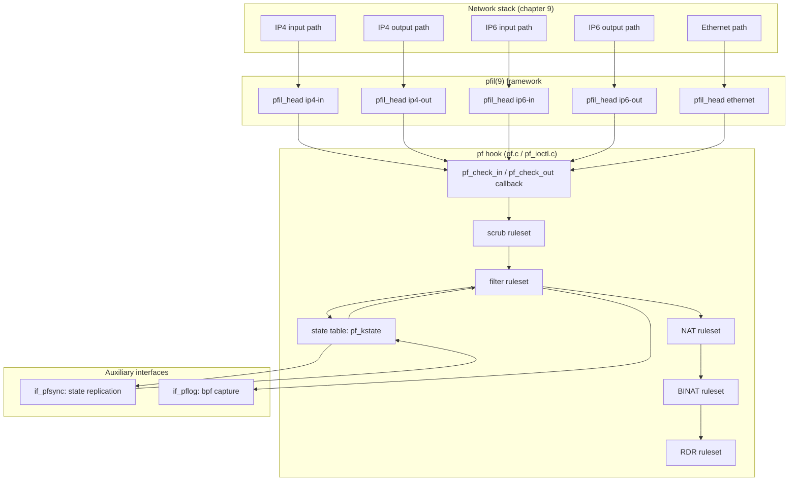

# pf — OpenBSD-derived Packet Filter
<!-- This file is auto-generated by generate-doc.py -- do not edit manually -->

---
**Navigation:**
  **Up:** [Kernel Core — Structure and Entry Point](../../README.md) ▸ [Source Tree — Layout and Conventions](../../../README_internals.md)
  **Related:** [Network Stack — Architecture and Packet Flow](../../net/README.md) | [VNET — Virtual Network Stacks](../../net/README_vnet.md) | [ipfw and dummynet — Native Firewall and Traffic Shaper](../ipfw/README.md)
  **All chapters:** [Source Tree — Layout and Conventions](../../../README_internals.md) | [Boot Process — UEFI Bootloader to Kernel Handoff](../../../stand/efi/loader/README.md) | [Kernel Core — Structure and Entry Point](../../README.md) | [Build System — buildworld and buildkernel](../../../share/mk/README.md) | [System Calls and Image Activation — Entry, sysent, and exec](../../kern/README_syscall.md) | [Kernel Modules and the Linker — KLD, SYSINIT, and linker sets](../../kern/README_kld.md) | [Virtual Memory Subsystem — vm_page, UMA, and Pagers](../../vm/README.md) | [Process Management — Scheduling and Lifecycle](../../kern/README_process.md) ...
---


## Quick Summary

pf (packet filter) is FreeBSD's stateful packet-filtering and NAT (Network Address Translation) engine, ported from OpenBSD. It is a kernel module, not a userland daemon: it plugs into the [`pfil(9)`](../../../share/man/man9/pfil.9) packet-intercept framework at the same [hook](../../netgraph/README.md#glossary) points that `ipfw(4)` uses. When a packet walks the IPv4/IPv6 input or output path — or the Ethernet path — the network stack asks the pfil framework to run every registered hook, and pf is one of them. Because it sits on the wire path, pf can inspect, drop, log, reassemble, normalize, and address-translate every IP packet the host sends or receives.

pf is organized around five rulesets that are evaluated in a fixed order for every packet: `scrub` (normalization), `filter` (allow/deny), `NAT`, `BINAT` (bidirectional NAT, which rewrites both source and destination addresses), and `RDR` (redirect, which rewrites the destination address to forward traffic to a different internal host). Within a [ruleset](#glossary), rules are walked in order and the **last matching rule wins** — a later, more specific rule can override an earlier, more general one. A rule marked `quick` short-circuits the walk: once it matches, the ruleset stops and that rule's action is returned immediately. This two-level model (sequential [last-match-wins](#glossary), with `quick` as an escape hatch) is inherited directly from OpenBSD and is the single most important idea for reading a [`pf.conf(5)`](../../../share/man/man5/pf.conf.5).

pf is stateful. When a `pass` rule with the `state` keyword matches, pf inserts a `pf_kstate` entry into its [state](#glossary) table. Every subsequent packet in that flow is matched against the state table first; if it matches, the packet is fast-pathed without re-running the full rule tree. The state table tracks TCP, UDP, ICMP, and SCTP (Stream Control Transmission Protocol) flows, each with its own timeout ladder (the `PFTM_*` timers in `sys/netpfil/pf/pf.h`), and it is the structure that makes pf a stateful rather than stateless firewall.

For high-availability pairs, the `if_pfsync(4)` driver replicates that state table between two firewalls over a dedicated multicast link, and `if_pflog(4)` provides a bpf-capture interface that receives copies of packets matching `log` rules so tools like `tcpdump(8)` can see exactly what pf decided to act on. Together these let an operator build a CARP (Common Address Redundancy Protocol)-based active/standby firewall pair that fails over without dropping established connections.

## Glossary

**pfil head** — a named intercept point in the network stack (one per direction per protocol family, e.g. IPv4-in, IPv4-out, IPv6-in, Ethernet-in) that owns a chain of hooks.

**pfil hook / link** — a registration by a packet filter (pf, ipfw) that links a callback onto a pfil head; the per-head, per-hook `pfil_link` entry is what actually sits on the head's in/out chain and carries the filter's `pfil_mbuf_chk` callback.

**ruleset** — one of pf's five ordered rule lists (`scrub`, `filter`, `NAT`, `BINAT`, `RDR`); a packet is evaluated against them in that fixed order.

**state** — a `pf_kstate` record describing one bidirectional flow (a connection), created by a matching stateful rule and used to fast-path later packets.

**quick rule** — a filter rule that, on match, stops the ruleset walk immediately instead of continuing to the last matching rule.

**scrub** — the normalization ruleset that fixes or rewrites malformed packets (MSS clamping, fragment reassembly, TCP timestamp handling) before the filter sees them.

**pfsync** — the multicast protocol implemented by `if_pfsync(4)` that ships state-table updates (and fragment and status records) between two firewalls so they stay consistent across a failover.

**pflog** — the `if_pflog(4)` interface that attaches a [bpf(4)](../../../share/man/man4/bpf.4) reader to each `log`-tagged rule, delivering a copy of the packet plus a `pfloghdr` describing the action pf took.

**last-match-wins** — pf's evaluation semantics: the ruleset is walked in order and the action of the *last* matching rule is the one that is applied, unless a `quick` rule matched earlier.

## Architecture

pf lives under `sys/netpfil/pf/` and is built as a loadable module. Its public interface is `sys/net/pfvar.h`; its private declarations live in `sys/netpfil/pf/pf.h`. The packet-path entry points — `pf_check_in()`, `pf_check_out()`, `pf_check6_in()`, `pf_check6_out()`, and `pf_check_return()` — are defined in `sys/netpfil/pf/pf_ioctl.c` (they are the functions the pfil framework calls), while the rule-matching, state, and translation logic they invoke lives in `sys/netpfil/pf/pf.c`, `sys/netpfil/pf/pf_lb.c`, and `sys/netpfil/pf/pf_norm.c`.

### Attaching to pfil

The [`pfil(9)`](../../../share/man/man9/pfil.9) framework is the bridge between the network stack and any packet filter. A *head* is created by an intercept point in the stack; a *hook* is created by a filter; hooks are chained onto heads. The framework's own comment in `sys/net/pfil.h` is explicit about this split:

```c
/*
 * A pfil head is created by a packet intercept point.
 *
 * A pfil hook is created by a packet filter.
 *
 * Hooks are chained on heads.  Historically some hooking happens
 * automatically, e.g. ipfw(4), pf(4) and ipfilter(4) would register
 * theirselves on IPv4 and IPv6 input/output.
 */
```

The three protocol families pf can [attach](../../kern/README_driver.md#glossary) to are named by `enum pfil_types` in `sys/net/pfil.h`:

```c
enum pfil_types {
	PFIL_TYPE_IP4,
	PFIL_TYPE_IP6,
	PFIL_TYPE_ETHERNET,
};
```

pf registers one hook per head it cares about. The registration argument structure, `struct pfil_hook_args`, carries the `pfil_mbuf_chk` callback (the function the stack will call with each packet) plus the module and ruleset names:

```c
struct pfil_hook_args {
	int		 pa_version;
	int		 pa_flags;
	enum pfil_types	 pa_type;
	pfil_mbuf_chk_t	 pa_mbuf_chk;
	pfil_mem_chk_t	 pa_mem_chk;
	void		*pa_ruleset;
	const char	*pa_modname;
	const char	*pa_rulname;
};
```

The callback signature is `pfil_mbuf_chk_t`:

```c
typedef pfil_return_t	(*pfil_mbuf_chk_t)(struct mbuf **, struct ifnet *, int,
		    void *, struct inpcb *);
typedef enum {
	PFIL_PASS = 0,
	PFIL_DROPPED,
	PFIL_CONSUMED,
	PFIL_REALLOCED,
} pfil_return_t;
```

The `int` direction argument is built from the `PFIL_IN` / `PFIL_OUT` / `PFIL_FWD` flags (`0x00010000`, `0x00020000`, `0x00040000` in `sys/net/pfil.h`). pf's `pf_check_in()` and friends return one of the four `pfil_return_t` values: `PFIL_PASS` lets the packet continue up the stack, `PFIL_DROPPED` consumes it, and `PFIL_REALLOCED` signals that the [mbuf](../../sys/README_mbuf.md#glossary) (kernel packet buffer) chain was reassembled or rewritten. The `hook_pf()` / `dehook_pf()` and `hook_pf_eth()` / `dehook_pf_eth()` functions in `sys/netpfil/pf/pf_ioctl.c` add and remove these links; they are driven from `pfattach_vnet()` (module attach) and `pf_modevent()` (module load/unload).

### The five-ruleset pipeline

`sys/netpfil/pf/pf.h` fixes the evaluation order with a single enum:

```c
enum { PF_RULESET_SCRUB, PF_RULESET_FILTER, PF_RULESET_NAT,
       PF_RULESET_BINAT, PF_RULESET_RDR, PF_RULESET_MAX };
```

For each packet the entry function walks these five lists in order. The action space is the `PF_PASS`/`PF_DROP`/... enum in the same header:

```c
enum { PF_PASS, PF_DROP, PF_SCRUB, PF_NOSCRUB, PF_NAT, PF_NONAT,
       PF_BINAT, PF_NOBINAT, PF_RDR, PF_NORDR, PF_SYNPROXY_DROP, PF_DEFER,
       PF_MATCH, PF_AFRT, PF_RT };
```

The `filter` ruleset is where the allow/deny decision is made. Two rules apply to a packet at once: the *default* action (the last matching non-`quick` rule) and, if a `quick` rule matched earlier, that rule's action which overrides the rest. The matching primitive is `pf_test_rule()` in `sys/netpfil/pf/pf.c`, which tests one `pf_krule` against a packet descriptor (`struct pf_pdesc`) and returns the rule's action. The walk accumulates the last match; a `quick` match returns immediately. This is why rule *order* matters in [`pf.conf(5)`](../../../share/man/man5/pf.conf.5): a broad `pass` early in the list is the default, and a narrow `block` later in the list overrides it — unless the `block` is marked `quick`, in which case it wins the moment it matches.

### NAT, BINAT, RDR

Address translation is handled by `sys/netpfil/pf/pf_lb.c`. `pf_match_translation()` finds the matching NAT/BINAT/RDR rule and then `pf_match_translation_rule()` performs the rewrite, choosing a source/destination address from the rule's address pool (`pf_hash_pool()`, `pf_map_addr()`, `pf_map_addr_sn()`). `pf_get_transaddr()` / `pf_get_transaddr_af()` carry out the actual address (and port) substitution, and `pf_get_translation()` is the reverse lookup used when a returning packet must be mapped back to its original address. `pf_step_into_translation_anchor()` lets a translation rule jump into an anchor (a nested ruleset) to pick a pool address, which is how `load balance` groups work.

### Normalization (scrub)

`sys/netpfil/pf/pf_norm.c` implements the `scrub` ruleset. `pf_scrub()` (in `pf.c`) is the entry point; it dispatches to `pf_normalize_ip()` / `pf_normalize_ip6()` for IP-level fixes, `pf_normalize_tcp()` / `pf_normalize_tcp_stateful()` for TCP ([MSS](../../netinet/README_transport.md#glossary) clamping, timestamp handling, [SYN cookie](../../netinet/README_transport.md#glossary) decisions), and `pf_normalize_sctp()` for SCTP. Fragment reassembly is done here too: `pf_create_fragment()`, `pf_find_fragment()`, `pf_fillup_fragment()`, `pf_join_fragment()`, `pf_reassemble()` / `pf_reassemble6()`, and `pf_refragment6()` build and tear down the `pf_fragment` structures that hold partially-received datagrams. Normalization runs *before* filtering because the filter needs a clean, reassembled packet to match against — a fragmented or oversized-MSS packet would otherwise be matched (and possibly allowed) in a malformed state.

### The state table

The state table is the heart of pf's statefulness. It is a set of hash tables (the `pf_idhash`, `pf_keyhash`, and `pf_udpendpointhash` structures declared in `sys/net/pfvar.h`) keyed by the flow's endpoints. `pf_create_state()` in `sys/netpfil/pf/pf.c` allocates a `pf_kstate` when a `pass ... state` rule matches; `pf_test_state()` looks one up on every subsequent packet. A state is owned by the rule that created it (`creatorid`) and remembers the direction, the two `pf_state_key` endpoints, and per-protocol counters. Reference counting is done with `pf_ref_state()` / `pf_release_state()`, and `pf_killstates()` / `pf_kill_matching_state()` remove entries (e.g. on a `block` with `state`, or on interface teardown).

### pfsync and pflog

`sys/netpfil/pf/if_pfsync.c` implements the state-replication driver. When a state is created, updated, or killed, pf calls the registered [pfsync](#glossary) callback (the `pfsync_update_state_t` / `pfsync_state_import_t` typedefs in `sys/net/pfvar.h`); `if_pfsync` serializes the state into a `pfsync_state_1500` record (the default message version, see below) and multicasts it to the peer. On receive, `pfsync_input()` / `pfsync6_input()` parse the frame and `pfsync_state_import()` rebuilds the local `pf_kstate`. `sys/netpfil/pf/if_pflog.c` implements the logging interface: `pflog_packet()` is called by the filter whenever a rule with a `log` action matches, and it pushes a copy of the packet plus a `struct pfloghdr` to the [bpf(4)](../../../share/man/man4/bpf.4) reader attached to that `pflog` device.

## Key Data Structures

### pfil head, hook, and link (sys/net/pfil.c)

These three structures are the whole of the intercept framework. A `pfil_head` is the stack's intercept point; a `pfil_hook` is a filter's registration; a `pfil_link` is the per-head instance of a hook that actually sits on the chain.

```c
struct pfil_link {
	CK_STAILQ_ENTRY(pfil_link) link_chain;
	pfil_mbuf_chk_t		 link_mbuf_chk;
	pfil_mem_chk_t		 link_mem_chk;
	void			*link_ruleset;
	int			 link_flags;
	struct pfil_hook	*link_hook;
	struct epoch_context	 link_epoch_ctx;
};

struct pfil_head {
	int		 head_nhooksin;
	int		 head_nhooksout;
	pfil_chain_t	 head_in;
	pfil_chain_t	 head_out;
	int		 head_flags;
	enum pfil_types	 head_type;
	LIST_ENTRY(pfil_head) head_list;
	const char	*head_name;
};
```

The `link_epoch_ctx` field is why a hook can be removed safely while a packet is still in flight: the link is freed only after the [epoch](../../netinet/README_ip.md#glossary) in which it was unlinked has drained, so a concurrent `pf_check_in()` cannot dereference a freed callback.

### The state (sys/net/pfvar.h)

`pf_kstate` is the per-flow record. Its first member is a `pf_state_cmp` sub-struct — the part that is compared when a packet is tested against the table — and the rest is the live state. The verified field inventory (from `sys/net/pfvar.h`) is:

- `pf_state_cmp` — the comparison key, itself made of `id`, `creatorid`, `direction`, `pad[3]`;
- `id`, `creatorid`, `direction`, `pad[3]` — the state's own identity: `id` is the global state number, `creatorid` is the rule that created it, `direction` is the direction the state was created in;
- an `area` union — the per-protocol state (the TCP/UDP/ICMP/SCTP counters live here);
- `state_flags`, `timeout` — the state's flag bits and its current timeout (one of the `PFTM_*` timers).

Each endpoint of the flow is a `pf_state_key` — a five-tuple plus a back-pointer to the owning state and a per-direction `pf_state_peer` holding the protocol-specific counters (TCP sequence numbers, window, etc.):

The verified field inventory (from `sys/net/pfvar.h`) is:

- `pf_state_key_cmp` — `addr[2]`, `port[2]`, `af`, `proto`, `pad[2]`; the fixed-size key used for hashing and comparison;
- `pf_state_key` — the same `addr[2]`, `port[2]`, `af`, `proto`, `pad[2]`, plus an `entry` (the red-black tree node) and `states[2]` (back-pointers to the owning `pf_kstate`, one per direction).

A `pf_state_scrub` (fields `pfss_flags`, exported as `pf_state_scrub_export`) rides along on the state to remember per-flow normalization decisions (e.g. the clamped MSS) so the reverse direction can be re-normalized consistently.

### The rule (sys/net/pfvar.h, sys/netpfil/pf/pf.h)

The in-kernel rule is `pf_krule`. It stores the source/destination match addresses, the list of labels, the rule identifier, the interface names, the queue names, and the tag name:

The verified field inventory (from `sys/net/pfvar.h`) is: `src` and `dst` (the match addresses), `*skip[PF_SKIP_COUNT]`, `label[PF_RULE_MAX_LABEL_COUNT][PF_RULE_LABEL_SIZE]`, `ridentifier`, `ifname[IFNAMSIZ]`, `rcv_ifname[IFNAMSIZ]`, `qname[PF_QNAME_SIZE]`, `pqname[PF_QNAME_SIZE]`, and `tagname[PF_TAG_NAME_SIZE]` — i.e. the match addresses, the labels, the rule identifier, the interface names, the queue names, and the tag name.

The match address itself is a `pf_rule_addr` from `sys/netpfil/pf/pf.h`, pairing an address with an optional port range and a negate flag:

The verified field inventory (from `sys/netpfil/pf/pf.h`) is: `addr`, `port[2]`, `neg`, and `port_op` — an address paired with an optional port range and a negate flag.

Rules are grouped into `pf_kruleset` (a list plus a `*tree` for O(log n) lookup) and nested under `pf_kanchor` objects, which form the anchor tree that [`pf.conf(5)`](../../../share/man/man5/pf.conf.5)'s `set skip` / `table` / `load` syntax maps onto:

The verified field inventory (from `sys/net/pfvar.h`) is: `entry_global` and `entry_node` (the red-black tree entries), `*parent`, `children`, `name[PF_ANCHOR_NAME_SIZE]`, `path[MAXPATHLEN]`, and `ruleset` (a `pf_kruleset` per `PF_RULESET_*`). The `pf_kruleset` itself holds a rule list, a `*tree` for O(log n) lookup, `rcount`, and a `ticket`.

### The packet descriptor (sys/net/pfvar.h)

`pf_pdesc` is the per-packet context passed through the whole pipeline. It carries the parsed addresses, the running action, and the `uid`/`gid` of the owning process (used by `set skip` and `uid`/`gid` rule matching):

The verified field inventory (from `sys/net/pfvar.h`) includes the parsed addresses, the running `done` action, and the `uid`/`gid` of the owning process (used by `set skip` and `uid`/`gid` rule matching).

### pfsync frame (sys/net/if_pfsync.h)

A pfsync frame is an IP datagram whose payload is a header followed by one or more subheader/action sections, terminated by an `EOF` subheader. The header carries an MD5 checksum (`PF_MD5_DIGEST_LENGTH` is 16) so a peer can drop corrupted frames:

```c
struct pfsync_header {
	uint8_t	 version;
	uint8_t _pad;
	uint16_t len;
	uint8_t pfcksum[PF_MD5_DIGEST_LENGTH];
};

struct pfsync_subheader {
	uint8_t	 action;
	uint8_t _pad;
	uint16_t count;
};
```

The action byte is one of the `PFSYNC_ACT_*` values — the default message version is `PFSYNC_MSG_VERSION_1500` (1500):

```c
#define PFSYNC_MSG_VERSION_DEFAULT PFSYNC_MSG_VERSION_1500

#define	PFSYNC_ACT_CLR		0	/* clear all states */
#define	PFSYNC_ACT_INS_1301	1	/* insert state */
#define	PFSYNC_ACT_INS_ACK	2	/* ack of inserted state */
#define	PFSYNC_ACT_UPD_1301	3	/* update state */
#define	PFSYNC_ACT_UPD_C	4	/* "compressed" update state */
#define	PFSYNC_ACT_UPD_REQ	5	/* request "uncompressed" state */
#define	PFSYNC_ACT_DEL		6	/* delete state */
#define	PFSYNC_ACT_DEL_C	7	/* "compressed" delete state */
#define	PFSYNC_ACT_INS_F	8	/* insert fragment */
#define	PFSYNC_ACT_DEL_F	9	/* delete fragments */
#define	PFSYNC_ACT_BUS		10	/* bulk update status */
#define	PFSYNC_ACT_TDB		11	/* TDB replay counter update */
#define	PFSYNC_ACT_EOF		12	/* end of frame */
#define PFSYNC_ACT_INS_1400	13	/* insert state */
#define PFSYNC_ACT_UPD_1400	14	/* update state */
#define PFSYNC_ACT_INS_1500	15	/* insert state */
#define PFSYNC_ACT_UPD_1500	16	/* update state */
#define	PFSYNC_ACT_MAX		17
```

A v1500 state record (`pfsync_state_1500`) is what gets serialized for the common case:

The verified field inventory (from `sys/net/pfvar.h`) is: `id`, `ifname[IFNAMSIZ]`, `key[2]` (the two `pf_state_key` endpoints), `src`, `dst`, `rt_addr`, `rule`, `anchor`, `nat_rule`, and `creation` — enough to reconstruct the local `pf_kstate` and the rule/anchor that created it.

The per-interface driver state is `pfsync_softc` (`sys/netpfil/pf/if_pfsync.c`):

The verified field inventory (from `sys/netpfil/pf/if_pfsync.c`) is: `*sc_ifp` (the pfsync interface), `*sc_sync_if` (the real interface that carries the sync traffic), `sc_imo`/`sc_im6o` (the IPv4/IPv6 multicast group memberships), `sc_sync_peer`, `sc_flags`, `sc_maxupdates`, `sc_template`, `sc_mtx`, and `sc_version`.

### pflog header (sys/net/if_pflog.h)

Each logged packet is prefixed with a `pfloghdr` describing the decision. `PFLOG_MAX_DEVS` is 256 (one per `log` rule that has been given a `pflog` interface):

```c
struct pfloghdr {
	u_int8_t	length;
	sa_family_t	af;
	u_int8_t	action;
	u_int8_t	reason;
	char		ifname[IFNAMSIZ];
	char		ruleset[PFLOG_RULESET_NAME_SIZE];
	u_int32_t	rulenr;
	u_int32_t	subrulenr;
	uid_t		uid;
	pid_t		pid;
	uid_t		rule_uid;
	pid_t		rule_pid;
	u_int8_t	dir;
	u_int8_t	pad1;	/* rewritten, on OpenBSD */
	sa_family_t	naf;
	u_int8_t	pad[1];
	u_int32_t	ridentifier;
	u_int8_t	reserve;	/* Appease broken software like Wireshark. */
	u_int8_t	pad2[3];
};
```

The `action` and `reason` fields tell `tcpdump(8)`/Wireshark whether the packet was passed, blocked, or logged, and *why* (e.g. state mismatch, bad checksum, source limit). The `PFLOG_PACKET(b,t,c,d,e,f,g,h)` macro in the same header is the single call site the filter uses to hand a packet to the attached bpf reader via `pflog_packet_ptr`.

## Deep Dive

### Tracing one packet through pf

Take an incoming IPv4 packet. The stack reaches the `ip4-in` [pfil head](#glossary) and walks its chain, calling each `pfil_link`'s `link_mbuf_chk`. pf's link calls `pf_check_in()` (in `sys/netpfil/pf/pf_ioctl.c`), which builds a `pf_pdesc` from the mbuf and then walks the five rulesets:

1. **[scrub](#glossary).** `pf_scrub()` runs the `PF_RULESET_SCRUB` list. If a `scrub` rule matches, `pf_normalize_ip()` clamps the MSS (`pf_normalize_mss()`), and if the packet is fragmented `pf_find_fragment()` / `pf_join_fragment()` reassemble it into a full datagram before the filter ever sees it. A `noscrub` rule suppresses this for a specific flow.
2. **filter.** `pf_check_in()` first tries the state table: `pf_test_state()` hashes the packet's five-tuple and, on a hit, fast-paths the packet using the owning state's action and translation. Only if there is no matching state does it walk the `PF_RULESET_FILTER` list with `pf_test_rule()`. The walk remembers the last match; a `quick` match returns at once. If the winning rule is `pass` with `state`, `pf_create_state()` inserts a `pf_kstate` so the *next* packet in this flow takes the fast path.
3. **NAT / BINAT / RDR.** `pf_match_translation()` (in `sys/netpfil/pf/pf_lb.c`) looks up the matching translation rule and `pf_match_translation_rule()` rewrites the addresses. For a NAT rule the source is replaced with a pool address (`pf_map_addr()`); for an RDR rule the destination is replaced with the internal server. The packet's mbuf is patched in place and checksums recomputed.

The function then returns `PFIL_PASS`, `PFIL_DROPPED`, or `PFIL_REALLOCED` to the pfil framework, which either continues the packet up the stack, frees it, or hands back the rewritten mbuf chain.

### Why the state table is a hash of keys, not a list

A stateful rule does not create a new *rule*; it creates a `pf_kstate` that is indexed by the flow's endpoints. The table is a hash (the `pf_keyhash` / `pf_udpendpointhash` structures in `sys/net/pfvar.h`) so that the per-packet lookup in `pf_test_state()` is O(1) rather than a scan of every connection. This is what lets pf sustain high packet rates: the common case (a packet belonging to an already-tracked flow) never touches the rule tree at all. The `pf_state_key_cmp` sub-struct exists precisely so the hash and the comparison can operate on a fixed-size, cache-friendly key without dragging the whole `pf_kstate` into the comparison.

### Why `quick` and last-match-wins coexist

Last-match-wins makes the *default* policy easy to express: put a permissive `pass` at the top and a series of narrow `block`s below; the last `block` that matches a given packet wins over the earlier `pass`. But that means a single packet may match many rules before a decision is made. `quick` is the optimization and the override: a `quick` rule that matches commits the decision immediately, so the expensive remainder of the list is skipped. In practice operators use `quick` for the explicit deny rules and the explicit allow rules, and rely on last-match-wins for the catch-all default.

### How pfsync keeps a pair in lockstep

When the active firewall's `pf_create_state()` / `pf_release_state()` / `pf_killstates()` changes the table, pf invokes the registered update callback. `if_pfsync` builds a frame: a `pfsync_header` (with a fresh MD5 checksum), then a `pfsync_subheader` with `action = PFSYNC_ACT_INS_1500` (or `UPD_1500` / `DEL`), then the serialized `pfsync_state_1500`, and finally a `PFSYNC_ACT_EOF` subheader. The frame is multicast on the dedicated sync interface (`sc_sync_if`) to the peer's multicast group (`sc_imo`/`sc_im6o`). The standby's `pfsync_input()` validates the checksum, walks the subheaders, and `pfsync_state_import()` reconstructs the local `pf_kstate`. Because the state (not the packets) is what is replicated, the standby can take over the CARP virtual IP and immediately fast-path every in-flight connection — no re-handshake, no dropped TCP sequence. The `PFSYNC_ACT_UPD_REQ` / `PFSYNC_ACT_UPD_C` pair lets a peer request a full (uncompressed) copy of a state it only has a compressed update for, which is how a freshly-promoted standby backfills any records it missed.

## Flow / Diagram



## Advanced Notes

### Observing pf with DTrace

`sys/netpfil/pf/pf.c` defines an SDT provider named `pf` with probes that map directly onto the pipeline. The most useful are the state-lookup and test probes:

```c
SDT_PROVIDER_DEFINE(pf);
SDT_PROBE_DEFINE2(pf, , test, reason_set, "int", "int");
SDT_PROBE_DEFINE4(pf, ip, test, done, "int", "int", "struct pf_krule *",
    "struct pf_kstate *");
```

A DTrace one-liner can fire on `pf:ip:test:done` to print the action and the matching rule/state for every packet, or on `pf:ip:state:lookup` to watch state hits versus misses. This is the fastest way to confirm whether a packet is being fast-pathed by the state table or falling through to the rule walk. The `pf::test:reason_set` [probe](../../kern/README_driver.md#glossary) reports the drop reason, which pairs with the `reason` field in `struct pfloghdr` for correlating kernel decisions with what `tcpdump(8)` captured on a `pflog` device.

### Counters and the 32-to-64 hybrid

High-frequency counters (per-rule packet/byte counts, status counters) are the hot path. On 32-bit platforms `sys/net/pfvar.h` defines `pf_counter_u64` / `pf_counter_u64_pcpu`, a hybrid that keeps a per-CPU 32-bit `current` plus a `snapshot` and periodically rolls the per-CPU values into a 64-bit `pfcu64_value` under a sequence counter (`pfcu64_seqc`). The reason for the hybrid is that a full 64-bit atomic increment on every packet is expensive on 32-bit CPUs; the per-CPU 32-bit counter is cheap, and the periodic rollup bounds the error. `pf_counter_u64_add_protected()` and `pf_counter_u64_rollup_protected()` both assert `curthread->td_critnest > 0`, i.e. they must be called with [preemption](../../kern/README_process.md#glossary) (the ability of the scheduler to swap out the current [thread](../../kern/README_process.md#glossary)) disabled — a constraint any new counter call site has to honor.

### Locking and the state table

The state table is protected by the pf lock, but the per-packet path is designed to take short critical sections. The `pf_ref_state()` / `pf_release_state()` reference counts are what let a packet hold a state across a point where the lock is dropped (e.g. while an mbuf is being reassembled or a translation is being applied), so a concurrent `pf_killstates()` cannot free the state out from under the in-flight packet. The pfil framework's `link_epoch_ctx` provides the analogous guarantee at the hook level: a hook removed while a packet is still in `pf_check_in()` is not freed until the epoch drains.

### Pitfalls

- **Rule order is the policy.** Because last-match-wins governs the `filter` set, a `block` placed *before* the `pass` it is meant to override has no effect unless it is `quick`. Reordering rules in [`pf.conf(5)`](../../../share/man/man5/pf.conf.5) silently changes behavior; [`pfctl(8)`](../../../sbin/pfctl/pfctl.8) shows the effective order.
- **Normalization must precede matching.** If a `scrub` rule is missing, fragmented packets reach the filter unreassembled and may be matched (or dropped) on partial headers. The `PF_PFIL_NOREFRAGMENT` flag in `sys/net/pfvar.h` is the escape hatch for interfaces where pf should not reassemble.
- **pfsync is unicast-of-states, not packet mirroring.** A standby that has missed updates relies on `PFSYNC_ACT_UPD_REQ` to backfill; a long partition can leave it with a stale table, which is why the `PFSYNC_ACT_CLR` (clear-all) message exists for a clean re-sync on failover.
- **[pflog](#glossary) is per-rule.** Each `log` rule needs its own `pflog` interface; `PFLOG_MAX_DEVS` (256) caps how many there can be. Forgetting to create the interface means `pflog_packet_ptr` is `NULL` and the `PFLOG_PACKET` macro is a no-op — the packet is still acted on, just not captured.

## See Also
- [Network Stack — Architecture and Packet Flow](../../net/README.md)
- [ipfw and dummynet — Native Firewall and Traffic Shaper](../ipfw/README.md)
- [VNET — Virtual Network Stacks](../../net/README_vnet.md)


- [`sys/netpfil/pf/`](.) — the pf module: `pf.c` (rule/state/translation core), `pf_ioctl.c` (pfil entry points and ioctl handling), `pf_lb.c` (NAT/BINAT/RDR), `pf_norm.c` (scrub/reassembly), `pf_ruleset.c` (anchors and rulesets), `pf_table.c` (address tables), `if_pfsync.c`, `if_pflog.c`.
- [`sys/net/pfvar.h`](../../net/pfvar.h) — public pf interface: `pf_kstate`, `pf_state_key`, `pf_krule`, `pf_kanchor`, `pf_pdesc`, `pf_sourcelim`, `pf_fragment`.
- [`sys/net/pfil.h`](../../net/pfil.h) and [`sys/net/pfil.c`](../../net/pfil.c) — the [`pfil(9)`](../../../share/man/man9/pfil.9) head/hook/link framework shared with `ipfw(4)`.
- [`sys/net/if_pfsync.h`](../../net/if_pfsync.h), [`sys/net/if_pflog.h`](../../net/if_pflog.h) — the pfsync frame format and the `pfloghdr`.
- Related chapters: [ipfw and dummynet — Native Firewall and Traffic Shaper](../ipfw/README.md) (the other consumer of the same pfil hooks), [Network Stack — Architecture and Packet Flow](../../net/README.md) (the input/output paths pf hooks into), [VNET — Virtual Network Stacks](../../net/README_vnet.md) (pf is per-VNET (virtual network stack) via `pfattach_vnet()`).
- Man pages: [`pfil(9)`](../../../share/man/man9/pfil.9), [`pf(4)`](../../../share/man/man4/pf.4), [`pf.conf(5)`](../../../share/man/man5/pf.conf.5), [`pfctl(8)`](../../../sbin/pfctl/pfctl.8), `if_pfsync(4)`, `if_pflog(4)`, `ipfw(4)`, [`mbuf(9)`](../../../share/man/man9/mbuf.9), [`bpf(4)`](../../../share/man/man4/bpf.4), `tcpdump(8)`.

---

> _Generated by [DaemonDocs](https://github.com/ocochard/DaemonDocs) on 2026-09-04 14:41 UTC using model `Qwen3.8-27B-Q8_0` (llama.cpp build `b10788-e107984bc`). AI-generated content — verify against source before relying on it._
