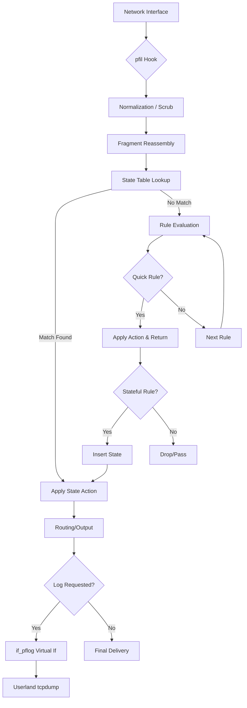

# pf — OpenBSD-derived Packet Filter
<!-- This file is auto-generated by generate-doc.py -- do not edit manually -->

---
**Navigation:**
  **Related:** [Network Stack — Architecture and Packet Flow](../../net/README.md) | [VNET — Virtual Network Stacks](../../net/README_vnet.md) | [ipfw and dummynet — Native Firewall and Traffic Shaper](../ipfw/README.md)
  **All chapters:** [Source Tree — Layout and Conventions](../../../README_internals.md) | [Boot Process — UEFI Bootloader to Kernel Handoff](../../../stand/efi/loader/README.md) | [Kernel Core — Structure and Entry Point](../../README.md) | [Build System — buildworld and buildkernel](../../../share/mk/README.md) | [Virtual Memory Subsystem — vm_page, UMA, and Pagers](../../vm/README.md) | [Process Management — Scheduling and Lifecycle](../../kern/README_process.md) | [Locking Primitives — Mutexes, sx, rmlocks, and Atomics](../../kern/README_locking.md) | [Buffer Cache — Block I/O Subsystem](../../vm/README_bcache.md) ...
---


## Quick Summary
Packet Filter (`pf`) is a stateful packet filtering, network address translation (NAT), and traffic shaping subsystem in FreeBSD, originally derived from OpenBSD. It intercepts network packets at various points in the networking stack using the `pfil` hook framework. Unlike older filters that process packets sequentially through a fixed set of chains, `pf` uses a unified rule set where the last matching rule determines the action. This design simplifies administration and improves performance by reducing rule evaluation overhead.

When a packet traverses the network stack, `pf` can inspect, modify, or drop it based on administrator-defined policies. It maintains a state table to track active connections, enabling stateful inspection where return traffic is automatically permitted without re-evaluating the entire rule set. Additionally, `pf` handles NAT and address rewriting (RDR), allowing internal hosts to share public IPs or expose services securely.

Before filtering, packets may undergo normalization (`scrub`), which reassembles IP fragments and corrects malformed headers to prevent evasion attacks. For high-availability deployments, `pf` integrates with the `pfsync` protocol to replicate its state table across cluster nodes, ensuring reliable failover. Finally, `pflog` provides a virtual interface that captures logged packets for offline analysis, bridging packet filtering with network monitoring tools.

## Architecture
`pf` integrates with the FreeBSD network stack through the `netpfil` framework. The `pfil` subsystem provides hook points at IP input, output, and forwarding paths. During initialization, `pf` registers its callback functions (`pf_input` and `pf_output`) with `pfil_add_hook` in `sys/netpfil/pf/pf_ioctl.c`. These hooks intercept `mbuf` chains before they reach the upper-layer protocols.

Rule evaluation in `pf` follows a last-matching-wins policy by default. Rules are compiled from userland via `pfctl` and stored in a red-black tree within a `struct pf_ruleset`. When a packet is processed, `pf` walks the rule tree, evaluating each rule in order. The last rule that matches the packet's criteria determines the action. However, if a rule is marked with the `quick` flag, evaluation stops immediately at the first matching rule, and the specified action (pass, drop, etc.) is applied without examining further rules. This contrasts with earlier filters that required explicit jump statements or chain terminators.

The state table tracks active connections using `struct pf_kstate` entries, defined in `sys/netpfil/pf/pf.h`. When a stateful rule matches, `pf` allocates a state, binds it to the packet, and stores it in a hash table. Subsequent packets matching the state key skip rule evaluation and proceed directly to the action. NAT and RDR are handled as part of the translation ruleset, modifying packet headers in-place before routing decisions.

Load balancing is implemented in `sys/netpfil/pf/pf_lb.c`. When a pool of destinations is configured, `pf` selects a backend using one of several algorithms: hash-based (deterministic based on source/destination IP and port), round-robin (distributes connections evenly), or source hashing (pins a source to a single backend for session persistence). The `pf_hash` function uses SipHash24 to compute a hash of the packet's address fields and the pool's hash key, ensuring consistent selection for the same flow.

Normalization, or `scrub`, is implemented in `sys/netpfil/pf/pf_norm.c`. It runs before the filter ruleset to reassemble fragmented packets and repair checksums. This prevents attackers from fragmenting malicious payloads across multiple packets to bypass signature matching. The `pfsync` subsystem (`sys/netpfil/pf/if_pfsync.c`) uses a dedicated virtual interface to multicast state updates to peer nodes in a CARP cluster, ensuring consistent filtering states across the failover group.

## Key Data Structures
The core rule structure is defined in `sys/netpfil/pf/pf.h`. It contains match criteria, actions, and timeout parameters:
```c
struct pf_krule (from sys/netpfil/pf/pf.h):
  fields: src, dst, *skip[PF_SKIP_COUNT], label[PF_RULE_MAX_LABEL_COUNT][PF_RULE_LABEL_SIZE], ridentifier, ifname[IFNAMSIZ], rcv_ifname[IFNAMSIZ], qname[PF_QNAME_SIZE], pqname[PF_QNAME_SIZE], tagname[PF_TAG_NAME_SIZE]
```
The `src` and `dst` fields hold address and port masks, while `skip` points to alternative rulesets for anchors. Interface names restrict rule application to specific NICs.

State entries are tracked using `struct pf_kstate`, which groups connection endpoints and manages lifetime:
```c
struct pf_kstate (from sys/netpfil/pf/pf.h):
  fields: pf_state_cmp, *, id, creatorid, direction, pad[3], area, *, state_flags, timeout
```
The `pf_state_cmp` substructure contains `id`, `creatorid`, and `direction` to identify the originating rule and traffic flow. The `timeout` array holds dynamic expiration timers for each protocol state.

Fragment reassembly relies on `struct pf_fragment` from `sys/netpfil/pf/pf_norm.c`:
```c
struct pf_fragment {
	uint32_t	fr_id;	/* fragment id for reassemble */

	/* pointers to queue element */
	struct pf_frent	*fr_firstoff[PF_FRAG_ENTRY_POINTS];
	/* count entries between pointers */
	uint8_t	fr_entries[PF_FRAG_ENTRY_POINTS];
	RB_ENTRY(pf_fragment) fr_entry;
	TAILQ_ENTRY(pf_fragment) frag_next;
	uint32_t	fr_timeout;
	TAILQ_HEAD(pf_fragq, pf_frent) fr_queue;
	uint16_t	fr_maxlen;	/* maximum length of single fragment */
	u_int16_t	fr_holes;	/* number of holes in the queue */
	struct pf_frnode *fr_node;	/* ip src/dst/proto/af for fragments */
};
```
The `fr_queue` holds reassembled fragments, while `fr_holes` tracks missing data segments. A red-black tree (`fr_entry`) indexes fragments by their identification field for fast lookup.

`pfsync` synchronization uses `struct pfsync_softc` in `sys/netpfil/pf/if_pfsync.c`:
```c
struct pfsync_softc (from sys/netpfil/pf/if_pfsync.c):
  fields: *sc_ifp, *sc_sync_if, sc_imo, sc_im6o, sc_sync_peer, sc_flags, sc_maxupdates, sc_template, sc_mtx, sc_version
```
`sc_sync_peer` stores the remote address, `sc_mtx` protects concurrent state updates, and `sc_template` holds a pre-formatted packet header to reduce allocation overhead during bulk state transfers.

## Deep Dive
Initialization begins in `sys/netpfil/pf/pf_ioctl.c`, where `pfattach_vnet` registers the filter with the `sysinit` framework. It calls `pfil_add_hook` to bind `pf` to the `PFIL_IN` and `PFIL_OUT` heads. The `pfil_hook_args` structure specifies the callback function type `pfil_mbuf_chk_t`, which matches the signature of `pf_test`.

When a packet arrives, the `pfil` core invokes `pf_test`. This function extracts the protocol header, checks address families, and searches the active ruleset. If a match occurs, `pf` evaluates the `quick` flag. If set, it returns immediately with `PFIL_PASS` or `PFIL_DROPPED`. Otherwise, it continues to the next rule.

Stateful rules trigger `pf_state_insert`. The kernel allocates a `struct pf_kstate` from a UMA zone, initializes the state key using `pf_state_key_cmp`, and inserts it into the hash table. Subsequent packets are matched against the state table first via `pf_state_lookup`. A hit bypasses rule evaluation, significantly reducing CPU usage for established connections.

Normalization is handled in `sys/netpfil/pf/pf_norm.c`. The `pf_normalize` function intercepts packets, checks for IP fragmentation, and calls `pf_frag_reass`. It uses `struct pf_frnode` to group fragments by source/destination IP and protocol. Once all fragments arrive, `pf` reassembles the original datagram, recalculates checksums, and passes the contiguous `mbuf` chain to the filter rules.

Load balancing is implemented in `sys/netpfil/pf/pf_lb.c`. When a NAT pool is configured, `pf` selects a destination address using one of three algorithms: hash-based, round-robin, or source hashing. The hash-based algorithm uses SipHash24 to compute a deterministic hash of the packet's source and destination addresses, ensuring that packets from the same flow always select the same backend. Round-robin distributes connections evenly across all available backends, while source hashing pins a source address to a single backend for session persistence.

For high availability, `if_pfsync.c` implements the state replication protocol. When a state is created or expires, `pfsync_output` formats the update into a UDP packet using `sc_template`. It sends the packet to `sc_sync_peer`. The receiving node processes it in `pfsync_input`, merging new states into its local table and purging expired ones. This keeps the backup node's filter state synchronized with the primary.

Logging is managed by `if_pflog.c`. The `pflogattach` function registers a virtual interface cloner. When a rule specifies `log`, `pf` duplicates the packet, prepends a `pflog` header with metadata (rule number, interface, action), and enqueues it on `pflog0`. Userland tools like `tcpdump` read from this interface to analyze filtered traffic.

## Flow / Diagram


## Advanced Notes
`pf` exposes several SDT probes for runtime debugging. Defined in `sys/netpfil/pf/pf.c`, probes like `pf,ip,test,done` and `pf,ip,state,lookup` allow DTrace scripts to trace rule evaluations and state lookups without recompiling the kernel. Developers can attach to `pf_test` to monitor rule hit rates and identify misconfigured policies.

Performance tuning often involves adjusting the state table size. `pf` uses a hash table with configurable bucket counts. When the table fills, insertion failures increase, causing stateful rules to fall back to stateless evaluation or drop packets. The `pf.state_table_max` sysctl controls this limit. Additionally, `pfsync` uses deferred updates to batch state changes, preventing network congestion during rapid connection churn.

A common pitfall is misordering rules with the `quick` flag. Because `quick` terminates evaluation, placing a broad `quick pass` rule before specific `quick drop` rules will allow unwanted traffic. Administrators must order rules from specific to general, or rely on the default last-match behavior for non-quick rules.

Theoretical connections to operating system design include state machine management and memory pool allocation. `pf`'s state table mirrors TCP state tracking but operates at a higher level, abstracting connection tracking from the transport layer. The use of UMA zones for state allocation ensures lock-free memory management, aligning with FreeBSD's goal of minimizing contention in high-throughput network paths.

## Comparison
Linux implements packet filtering through `nftables` and the `netfilter` framework. While `nftables` also uses a last-match-wins model and supports stateful tracking, it relies on eBPF programs for rule evaluation, whereas `pf` uses a compiled C-like rule tree. Linux's connection tracking (`nf_conntrack`) is a separate subsystem, while `pf` integrates state management directly into the filter pipeline.

OpenBSD, the origin of `pf`, shares the same core architecture but diverges in initialization and userland tools. FreeBSD's `pfil` framework is more generalized, allowing multiple filters to register hooks, whereas OpenBSD tightly couples `pf` to its network stack. NetBSD also uses `pfil` but historically supported `ipfilter` alongside `pf`, leading to differences in hook priority and rule syntax compatibility.

macOS/XNU uses `pf` as well, inheriting it from OpenBSD, but modifies the hook registration to work with XNU's `IOKit` networking extensions. The state table implementation remains nearly identical, though macOS restricts certain kernel extensions from modifying `pf` rules without explicit user approval.

## See Also
- [Network Stack — Architecture and Packet Flow](../../../sys/net/README.md)
- [ipfw and dummynet — Native Firewall and Traffic Shaper](../../../../sys/netpfil/ipfw/README.md)
- [VNET — Virtual Network Stacks](../../../sys/net/README_vnet.md)

- [Network Stack — Architecture and Packet Flow](../../../sys/net/README.md)
- [ipfw and dummynet — Native Firewall and Traffic Shaper](../../../../sys/netpfil/ipfw/README.md)
- [VNET — Virtual Network Stacks](../../../sys/net/README_vnet.md)


- [Source Tree — Layout and Conventions](../README_internals.md)
- [Locking Primitives — Mutexes, sx, rmlocks, and Atomics](kern/README_locking.md)
- [Virtual Memory Subsystem — vm_page, UMA, and Pagers](vm/README.md)
- `sys/netpfil/pf/`
- `sys/netpfil/pf/pf.h`
- `sys/netpfil/pf/pf_lb.c`
- `sys/netpfil/pf/pf_norm.c`
- `sys/netpfil/pf/if_pfsync.c`
- `sys/netpfil/pf/if_pflog.c`
- `sys/net/pfil.h`

---

> _Generated by [DaemonDocs](https://github.com/ocochard/DaemonDocs) on 2026-04-29 14:57 UTC using model `Qwen3.6-35B-A3B-UD-Q4_K_XL` (llama.cpp build `b8973-3142f1dbb`). AI-generated content — verify against source before relying on it._
