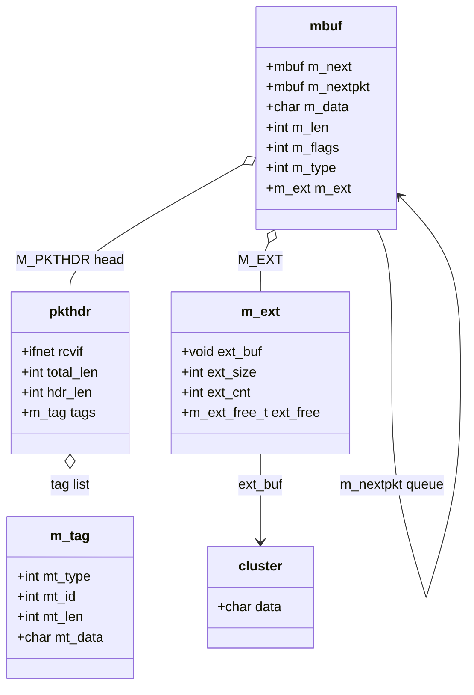

# mbuf — Network Buffer Allocation and Chaining
<!-- This file is auto-generated by generate-doc.py -- do not edit manually -->

---
**Navigation:**
  **Up:** [Kernel Core — Structure and Entry Point](../README.md) ▸ [Source Tree — Layout and Conventions](../../README_internals.md)
  **Related:** [Network Stack — Architecture and Packet Flow](../net/README.md) | [NIC Drivers — from if_vr to iflib to if_cxgbe](../dev/README_nic_drivers.md) | [Transport Protocols — inpcb, tcpcb, TCP State Machine, UDP](../netinet/README_transport.md) | [IP Layer — IPv4, IPv6, Forwarding, FIB, and nhop](../netinet/README_ip.md)
  **All chapters:** [Source Tree — Layout and Conventions](../../README_internals.md) | [Boot Process — UEFI Bootloader to Kernel Handoff](../../stand/efi/loader/README.md) | [Kernel Core — Structure and Entry Point](../README.md) | [Build System — buildworld and buildkernel](../../share/mk/README.md) | [System Calls and Image Activation — Entry, sysent, and exec](../kern/README_syscall.md) | [Kernel Modules and the Linker — KLD, SYSINIT, and linker sets](../kern/README_kld.md) | [Virtual Memory Subsystem — vm_page, UMA, and Pagers](../vm/README.md) | [Process Management — Scheduling and Lifecycle](../kern/README_process.md) ...
---


## Quick Summary

Every network packet in FreeBSD — an ARP reply, a TCP segment, an ICMP echo — rides through the kernel inside a *[mbuf](#glossary)*. The mbuf is the network stack's universal currency: a small, fixed-size header that describes a variable amount of payload, and the ability to link many of them together into a chain. If you can read an mbuf chain, you can read the network stack; nearly every protocol, driver, and firewall [hook](../netgraph/README.md#glossary) takes a `struct mbuf *` as its first argument and returns one. This chapter is the prerequisite the rest of the network stack reads against, so protocol chapters assume you already understand the invariants documented here.

The core design problem is that packets vary wildly in size. A 64-byte ARP reply and a 1500-byte Ethernet frame both have to fit, but a single fixed-size buffer would waste memory on the small one and be too small for the large one. FreeBSD solves this by making the mbuf a small unit — a header plus a modest inline data area — and letting mbufs *chain*. A large packet is just several mbufs linked together; you allocate exactly as many as the payload needs. When the payload is too big even for one inline data area, the mbuf attaches a separate *[cluster](#glossary)* of a few kilobytes and points at it, so the header stays small no matter how large the buffer behind it is.

On top of the buffer itself, the mbuf carries two orthogonal mechanisms. The `M_PKTHDR` flag marks the *first* mbuf of a packet, which reserves extra room for a `struct pkthdr` — the packet-wide metadata (receiving interface, total length, checksum offload [state](../netpfil/pf/README.md#glossary), and an optional list of tags) that belongs to the whole packet rather than one segment. The second mechanism is `m_tag`, a way for subsystems such as pf, ipsec, and LRO to [attach](../kern/README_driver.md#glossary) their own per-packet records without enlarging `struct mbuf` for everyone.

Finally, mbufs are allocated from a small set of [UMA](../vm/README_bcache.md#glossary) zones, one per size class, which keeps allocation fast and per-CPU. Because the total number of mbufs is bounded, allocation can fail. Callers choose between `M_NOWAIT` (fail immediately with `NULL` when the [zone](../vm/README.md#glossary) is empty — the only option in interrupt context) and `M_WAITOK` (sleep until one frees up). When allocation is failing, the kernel runs `mb_reclaim` to try to return memory to the mbuf pool. Understanding this exhaustion path is what lets a driver or protocol decide whether to drop a packet, sleep, or shed load.

## Glossary

**mbuf** — The variable-size kernel buffer that holds a network packet; a small header plus a data area, linkable into a chain.

**cluster** — A separate, reference-counted buffer (typically `MCLBYTES`, 2048 bytes) attached to an mbuf via `M_EXT` so a large payload does not have to fit in the mbuf's inline data area.

**jumbo cluster** — A larger cluster (4096, 9216, or 16184 bytes) used for high-throughput paths; allocated from its own UMA zone.

**pkthdr** — The `struct pkthdr` embedded in the first mbuf of a packet (when `M_PKTHDR` is set); holds packet-wide metadata such as the receiving interface and total length.

**m_tag** — A small, self-describing record a subsystem attaches to a packet to carry per-packet metadata without modifying `struct mbuf`.

**UMA zone** — A per-CPU, fixed-size slab allocator (see `uma(9)`) used to hand out mbufs and clusters quickly; FreeBSD keeps one zone per mbuf size class.

**M_NOWAIT / M_WAITOK** — Allocation flags: `M_NOWAIT` returns `NULL` immediately if the zone is empty (safe in interrupt context); `M_WAITOK` sleeps until an mbuf is available.

**mb_reclaim** — The kernel path that runs when mbuf allocation is failing, attempting to free pages and return buffers to the mbuf pool.

## Architecture

The mbuf subsystem lives in three files. `sys/sys/mbuf.h` defines the structure, the size macros, the `M_` flags, the `EXT_` external-buffer types, and declares the entire public API. `sys/kern/uipc_mbuf.c` implements the allocator entry points (`m_get`, `m_getcl`, `m_gethdr`, `m_getjcl`), the chain-manipulation primitives (`m_freem`, `m_copypacket`, `m_split`, `m_defrag`, `m_dup`, `m_prepend`, `m_append`, `m_cat`, `m_length`, `m_getptr`), and the [UMA zone](#glossary) setup. `sys/kern/uipc_mbuf2.c` implements the data-access primitives that walk a chain — `m_pullup`, `m_copydata`, `m_adj`, `m_adj_decap` — plus the `m_tag` machinery. The reclaim path, `mb_reclaim`, lives in `sys/kern/kern_mbuf.c`.

The single most important fact about the layout is that the header size depends on whether the mbuf is a packet header. `sys/sys/mbuf.h` defines the header sizes with `offsetof`, which is the authoritative statement of where the data area begins:

```c
/* From sys/sys/mbuf.h */
struct mbuf;
#define	MHSIZE		offsetof(struct mbuf, m_dat)
#define	MPKTHSIZE	offsetof(struct mbuf, m_pktdat)
#define	MLEN		((int)(MSIZE - MHSIZE))
#define	MHLEN		((int)(MSIZE - MPKTHSIZE))
```

`MHSIZE` is the offset of `m_dat`, the start of the data area in a *regular* mbuf. `MPKTHSIZE` is the offset of `m_pktdat`, the start of the data area in a *header* mbuf — and it is larger, because a `struct pkthdr` is inserted between the common header and the data. Consequently `MLEN` (data that fits in a regular mbuf) is larger than `MHLEN` (data that fits in a header mbuf). This is the whole "header vs regular" distinction in one place: a header mbuf spends its extra space on the `pkthdr`, leaving less room for payload. `MSIZE` and `MCLBYTES` are defined in `sys/param.h`; the header comment in `mbuf.h` states that an mbuf "is of a single size, MSIZE, which includes overhead" and "may add a single mbuf cluster of size MCLBYTES, which has no additional overhead and is used instead of the internal data area; this is done when at least MINCLSIZE of data must be stored." `MINCLSIZE` is the minimum payload size at which a cluster is used instead of the inline data area.

Two pointers give the mbuf its dual role, and the network stack needs both. `m_next` links the *segments of one packet* — the chain that makes up a single logical frame. `m_nextpkt` links *separate packets* waiting in a queue, for example the packets sitting in an interface's output queue or in a protocol's input queue. A chain is a unit of data; a queue is a unit of scheduling. The stack walks `m_next` to read or free a packet, and `m_nextpkt` to walk a queue of packets. Confusing the two is a classic source of use-after-free bugs, because freeing "one packet" means following `m_next` (not `m_nextpkt`) to the end of the chain.

Large payloads use the `M_EXT` indirection. When a payload exceeds the inline data area, the mbuf sets `M_EXT` and stores a pointer to an external buffer (a cluster or [jumbo cluster](#glossary)) in the `m_ext` structure, rather than growing the header. The external buffer is reference-counted: it stays alive as long as any mbuf points at it, and is released by a free callback (`ext_free`) when the count drops to zero. This is what lets a payload be shared — for instance after `m_dup`, or when the same cluster is handed to a checksum-offload path and a driver — without copying the bytes.

Per-packet metadata uses `m_tag`. Rather than add a field to `struct mbuf` for every subsystem that wants to remember something about a packet, each subsystem allocates a small `m_tag` record and links it into the packet's tag list (held on the `pkthdr`). Tags are allocated with `m_tag_alloc`, found with `m_tag_locate`, removed with `m_tag_delete`, and copied with `m_tag_copy`. The backing memory comes from a dedicated malloc type (a named bucket registered with `MALLOC_DEFINE`, the macro that registers a named [`malloc(9)`](../../share/man/man9/malloc.9) allocation type, in the kernel's [`malloc(9)`](../../share/man/man9/malloc.9) subsystem); `sys/kern/uipc_mbuf2.c` defines it as:

```c
/* From sys/kern/uipc_mbuf2.c */
static MALLOC_DEFINE(M_PACKET_TAGS, MBUF_TAG_MEM_NAME,
    "packet-attached information");
```

This keeps the common case — a packet with no tags — at the size of a plain mbuf, and only pays for the metadata a subsystem actually attaches.

## Key Data Structures

### struct mbuf and the size macros

The `offsetof` macros above are the load-bearing definition of the layout. A regular mbuf's data area begins at `m_dat` (offset `MHSIZE`); a header mbuf's data area begins at `m_pktdat` (offset `MPKTHSIZE`), after the `pkthdr`. The common header always present in both forms carries the chain pointers and per-segment state:

- `m_next` — next segment of the *same* packet (the chain).
- `m_nextpkt` — next *packet* in a queue.
- `m_data` — pointer to the first valid byte of this segment's data.
- `m_len` — number of valid bytes in this segment.
- `m_flags` — the `M_` flags below.
- `m_type` — the `MT_` type of this segment (e.g. data, header, control).
- `m_ext` — the external-buffer descriptor, valid when `M_EXT` is set.

The header comment in `mbuf.h` is explicit that these offsets are sensitive to padding: "NB: These calculation do not take actual compiler-induced alignment and padding inside the complete struct mbuf into account. Appropriate attention is required when changing members of struct mbuf." Compile-time assertions in `uipc_mbuf.c` check that the resulting `MLEN`/`MHLEN` values are sensible.

### The M_ flags

These are the bits in `m_flags`. The two that drive the layout and the external-buffer machinery are quoted verbatim from `sys/sys/mbuf.h`:

```c
/* From sys/sys/mbuf.h */
#define	M_EXT		0x00000001 /* has associated external storage */
#define	M_PKTHDR	0x00000002 /* start of record */
```

`M_EXT` says "this mbuf points at external storage, use `m_ext` to find and free it." `M_PKTHDR` says "this is the first mbuf of a packet; a `pkthdr` is present." Three further bits are reserved for protocol use so a protocol can stash a small flag without a tag:

```c
/* From sys/sys/mbuf.h */
#define	M_PROTO1	0x00002000 /* protocol-specific */
#define	M_PROTO2	0x00004000 /* protocol-specific */
#define	M_PROTO3	0x00008000 /* protocol-specific */
```

### struct pkthdr

The `pkthdr` is what a header mbuf carries that the rest of the chain does not. Per the [`mbuf(9)`](../../share/man/man9/mbuf.9) documentation, when `M_PKTHDR` is set the header "contains a pointer to the interface the packet has been received from and the total packet length. Optionally, it may also contain an attached list of packet tags," and "fields used in offloading checksum calculation to the hardware are kept in [the pkthdr] as well." The receiving-interface pointer is `rcvif`, a pointer to the packet's receiving `ifnet` (the network interface descriptor struct that represents a NIC); it is read, for example, by the `ip_input` SDT (Statically Defined Tracing) [probe](../kern/README_driver.md#glossary) as `m->m_pkthdr.rcvif`. Because the `pkthdr` holds packet-wide state — total length, not just this segment's `m_len` — only the head of the chain has one, and only the head is a header mbuf.

### External buffer types (EXT_)

When `M_EXT` is set, the `m_ext` descriptor records what kind of external buffer it points at, so the free path knows how to release it. The types are defined in the mbuf header and documented in [`mbuf(9)`](../../share/man/man9/mbuf.9):

```c
/* External buffer types (mbuf(9)) */
#define	EXT_CLUSTER	1	/* mbuf cluster */
#define	EXT_SFBUF	2	/* sendfile(2)'s sf_bufs */
#define	EXT_JUMBOP	3	/* jumbo cluster 4096 bytes */
#define	EXT_JUMBO9	4	/* jumbo cluster 9216 bytes */
#define	EXT_JUMBO16	5	/* jumbo cluster 16184 bytes */
#define	EXT_PACKET	6	/* mbuf+cluster from packet zone */
#define	EXT_MBUF	7	/* external mbuf reference */
```

The three jumbo types map directly onto the three jumbo UMA zones: `EXT_JUMBOP` (4096 bytes), `EXT_JUMBO9` (9216 bytes), and `EXT_JUMBO16` (16184 bytes). The `m_ext` descriptor holds a pointer to the buffer (`ext_buf`), its size (`ext_size`), a reference count (`ext_cnt`), and a free callback of type `m_ext_free_t` (the field is `ext_free`). When `ext_cnt` reaches zero, `ext_free` is invoked to actually release the buffer — this is how a cluster's lifetime is decoupled from any single mbuf that references it.

### struct m_tag

An `m_tag` is a small record a subsystem attaches to a packet. Its fixed prefix identifies the tag and sizes its variable payload:

- `mt_type` — the tag's type, identifying the subsystem that owns it.
- `mt_id` — a per-type instance id, so a subsystem can have several distinct tag kinds.
- `mt_len` — length of the tag including its data.
- `mt_data` — the start of the tag's variable-length payload.

Tags are linked into the packet's list (on the `pkthdr`) and are allocated from the `M_PACKET_TAGS` malloc type (a named MALLOC_DEFINE bucket) shown above. Subsystems look a tag up by `(mt_type, mt_id)` with `m_tag_locate`, and copy or delete it with `m_tag_copy` / `m_tag_delete`. Protocol-specific consumers — for example pf's per-packet state or ipsec's SA association — are out of scope here; they are just examples of subsystems that use this mechanism.

### Allocator bookkeeping structs

A few auxiliary structures round out the subsystem. `struct mbufprofile` (in `sys/kern/uipc_mbuf.c`) accumulates per-bucket accounting for mbuf usage:

```c
/* Fields of struct mbufprofile (sys/kern/uipc_mbuf.c) */
wasted[MP_BUCKETS], used[MP_BUCKETS], segments[MP_BUCKETS]
```

`struct mbufq` and `struct mchain` (both in `sys/sys/mbuf.h`) describe a queue of packets and a chain of segments respectively, and are the return types of the queue-walking helpers:

```c
/* Fields of struct mbufq (sys/sys/mbuf.h) */
mq_head, mq_len, mq_maxlen

/* Fields of struct mchain (sys/sys/mbuf.h) */
mc_q, mc_len, mc_mlen
```

`mbufq` mirrors the `m_nextpkt` dimension (a queue of packet heads, with a total byte length `mq_len` and a high-water mark `mq_maxlen`), while `mchain` mirrors the `m_next` dimension (a chain of segments, with `mc_mlen` counting the mbufs in it). These give the stack a way to pass a whole queue or chain around without re-walking it.

## Deep Dive

### Allocation: m_get, m_gethdr, m_getcl, m_getjcl

All four entry points in `sys/kern/uipc_mbuf.c` follow the same shape: pick a zone, ask UMA for an object, and (for the cluster forms) attach the cluster to the mbuf via `m_ext`. Each is wrapped in an SDT probe — `m__get`, `m__gethdr`, `m__getcl`, `m__getjcl` — so the allocation path is observable with DTrace (the dynamic tracing framework).

- `m_get(m, wait)` returns a *regular* mbuf, its data area sized to `MLEN` (offset `m_dat`).
- `m_gethdr(m, wait)` returns a *header* mbuf with `M_PKTHDR` set, its data area sized to `MHLEN` (offset `m_pktdat`) and room for the `pkthdr`. This is what a driver calls when it receives a new packet, because the packet head must carry the `pkthdr`.
- `m_getcl(m, wait, type, flags)` returns a regular mbuf *plus* a `MCLBYTES` cluster attached through `m_ext` (`EXT_CLUSTER`). It is used when a payload of at least `MINCLSIZE` bytes is expected, so the data lives in the cluster instead of the small inline area.
- `m_getjcl(m, wait, type, len, flags)` is the jumbo variant: it chooses the right jumbo zone for `len` (4096, 9216, or 16184 bytes) and attaches it as `EXT_JUMBOP` / `EXT_JUMBO9` / `EXT_JUMBO16`. High-throughput drivers and the `m_copypacket` path use it to avoid chaining many small mbufs for a large frame.

The `wait` argument is the `M_NOWAIT`/`M_WAITOK` flag. The allocator is built on UMA zones — one per size class — so the fast path is a per-CPU cache lookup with no global lock. The zones are created in `uipc_mbuf.c`; the mbuf zones are `zone_mbuf` (regular mbufs) and `zone_pack` (header mbufs, the larger `MPKTHSIZE` object), and the cluster zones are `zone_jumbop`, `zone_jumbo9`, and `zone_jumbo16` for the three jumbo sizes. Because UMA hands out fixed-size objects from per-CPU caches, an mbuf of a given class is byte-for-byte identical every time, which is why the `offsetof`-based size macros are stable and why the layout is so tightly coupled to padding.

### Freeing: m_freem and the external-buffer refcount

`m_freem` (declared in `sys/sys/mbuf.h`, implemented in `sys/kern/uipc_mbuf.c`) frees a whole chain. It walks the chain with `m_next`, and for each mbuf: if `M_EXT` is set, it decrements the external buffer's reference count and, when it reaches zero, calls the buffer's `ext_free` callback; then it returns the mbuf object itself to its UMA zone. The `m__freem` SDT probe fires on the head. This is the only correct way to free a packet — it is what makes the `m_next`-versus-`m_nextpkt` distinction matter, because `m_freem` deliberately follows only `m_next`, so it frees exactly one packet and leaves the queue linkage (`m_nextpkt`) for the queue owner.

### Reading data: m_pullup, m_copydata, m_adj

The data-access primitives in `sys/kern/uipc_mbuf2.c` are the ones protocol code calls most often.

`m_pullup(m, len)` is the workhorse for reading a header that may straddle a chain boundary. Its own comment states the contract: "ensure that [off, off + len) is contiguous on the mbuf chain m. packet chain before off is kept untouched." If the first `len` bytes already live contiguously in the head mbuf's data area, `m_pullup` returns immediately. Otherwise it allocates a new head mbuf (or cluster), copies the leading bytes into it, and re-links the chain so the caller can now `mtod(m, ...)` the header — `mtod` is the macro that casts an mbuf's data pointer to a C type so a header can be read as a struct. Protocol code *must* call `m_pullup` before reading a header whose length exceeds the head's `m_len`; reading past `m_len` into the next segment's bytes is undefined because the data may not be physically contiguous.

`m_copydata(m, off, len, buf)` copies `len` bytes starting at offset `off` from the chain into a caller buffer. It walks the chain segment by segment, copying the overlapping slice of each, so it works across boundaries without the caller having to reason about where the data lives. It is the safe read for a fragment that is not a whole header.

`m_adj(m, len)` advances the start of the chain by `len` bytes, discarding that many bytes. It is the inverse of `m_prepend` and is how a protocol consumes a header it has already parsed: after `m_pullup` and a `mtod` read, `m_adj(m, hlen)` drops the header and leaves the payload. If `len` exceeds the head's `m_len`, `m_adj` frees head segments until the offset is satisfied. `m_adj_decap` is a variant used when decapsulating (e.g. stripping a tunnel header) that also fixes up the `pkthdr` length.

### Copying and splitting

`m_copypacket` (in `uipc_mbuf.c`) makes a deep copy of a chain, allocating fresh mbufs/clusters and copying the data — used when a packet must be delivered to more than one destination (broadcast, or a firewall that inspects a copy). `m_split(m, off, wait)` cuts a chain at offset `off`, returning the first part and leaving the rest in `m`; it is how a protocol separates a header from a payload, or a payload from a trailer. `m_defrag(m, wait)` is the opposite: it coalesces a chain into as few large segments as possible (using clusters), which is what a driver wants before handing a packet to the NIC. `m_dup` makes a *shallow* copy — it increments reference counts on the shared external buffers rather than copying the bytes — which is why the `m_ext` refcount exists at all.

### m_tag in action

A subsystem that wants per-packet state does not touch `struct mbuf`. It calls `m_tag_alloc(type, id, len, wait)` to get a `m_tag` (backed by the `M_PACKET_TAGS` malloc type), fills `mt_data`, and links it into the packet. Later, `m_tag_locate(m, type, id, ...)` finds it again by `(mt_type, mt_id)`, and `m_tag_delete` / `m_tag_copy` remove or duplicate it. Because the tag list lives on the `pkthdr`, only the head mbuf is touched, and a packet that no subsystem tags costs nothing. The tag mechanism is the reason pf, ipsec, and LRO can each remember their own per-packet state on the same packet without any of them knowing about the others.

## Flow / Diagram



There is a single `struct mbuf` type; the "header mbuf" and "regular mbuf" are the same struct with or without `M_PKTHDR` set. When `M_PKTHDR` is set, the head mbuf's data area begins at `m_pktdat` (after the embedded `pkthdr`) instead of `m_dat`, which is why `MPKTHSIZE > MHSIZE` and `MHLEN < MLEN`. Any mbuf in the chain — head or not — may carry an `m_ext` descriptor when `M_EXT` is set; that descriptor points at a cluster or jumbo cluster whose lifetime is governed by `ext_cnt` and released by `ext_free`. The `m_tag` list hangs off the head's `pkthdr`. `m_next` binds the segments of one packet; `m_nextpkt` binds the packets of a queue. Reading a packet follows `m_next` to the end of the chain; walking a queue follows `m_nextpkt` from packet head to packet head.

## Advanced Notes

### Observability

The entire allocation path is instrumented with SDT probes, defined in `sys/kern/uipc_mbuf.c`: `m__init`, `m__get`, `m__gethdr`, `m__getcl`, `m__getjcl`, `m__clget`, `m__cljget`, `m__cljset`, `m__free`, `m__freem`, and `m__freemp`. Each `m__get*` probe fires with the allocation flags and the resulting mbuf, so a DTrace one-liner can count how often `m_getcl` falls back to a cluster, or how many `M_NOWAIT` allocations return `NULL` (the probe still fires with a null mbuf). This is the fastest way to find out whether a load is mbuf-bound before reaching for `sysctl`. The `mbufprofile` counters (`wasted`, `used`, `segments` per bucket) are exposed for the same purpose and let you see the distribution of chain lengths and the bytes wasted in trailing mbufs.

### Performance: why the zones are split

The allocator is per-CPU and lock-free on the fast path because it is built on UMA zones, one per size class. Splitting into `zone_mbuf`, `zone_pack`, `zone_jumbop`, `zone_jumbo9`, and `zone_jumbo16` means a small packet and a jumbo frame never contend for the same cache line, and a driver that only ever allocates 2048-byte clusters never touches the jumbo16 cache. The trade-off is that a burst of one size can exhaust its zone while other zones sit full; the reclaim path (below) is what lets the kernel move memory between them. `m_defrag` and `m_getjcl` are the two levers that change the size mix: defragmenting a chain into clusters reduces the number of mbufs in flight, and allocating jumbo clusters up front reduces the number of small mbufs needed per packet.

### Exhaustion and mb_reclaim

When a zone is empty, the behavior depends on the `wait` flag. With `M_NOWAIT`, the allocator returns `NULL` immediately — this is the only legal choice in interrupt context, where sleeping is forbidden — and the caller must drop the packet or defer it. With `M_WAITOK`, the caller is put to sleep on a zone-specific wait channel until a free happens. Before the allocator gives up, it calls `mb_reclaim` (in `sys/kern/kern_mbuf.c`), which attempts to return memory to the pool: it can force the page daemon to reclaim freeable pages, and it can drop mbufs that are held only by a slow consumer (e.g. a socket buffer that is not making progress). The reclaim path is what makes `M_WAITOK` allocation eventually succeed under sustained load, and it is also the path that can drop data if the system is truly out of memory. A driver that sees repeated `M_NOWAIT` failures should treat that as a signal to shed load (drop, or coalesce) rather than retry in a tight loop, because retrying `M_NOWAIT` in interrupt context cannot make the zone non-empty.

### Common pitfalls

- **Reading past `m_len`.** The single most common mbuf bug is treating a header as contiguous when it is not. If a header's length exceeds the head mbuf's `m_len`, the bytes continue in the next segment, and reading them as a C struct is undefined. Always `m_pullup(m, hlen)` before `mtod(m, ...)` when `hlen` may exceed the head's `m_len`.
- **Confusing `m_next` and `m_nextpkt`.** Freeing a packet means following `m_next` to the end of the chain (`m_freem` does this). Following `m_nextpkt` walks *other packets* in a queue; freeing along `m_nextpkt` destroys packets you do not own. Conversely, a queue-walker that follows `m_next` instead of `m_nextpkt` will run off the end of one packet into the next.
- **Forgetting the `pkthdr` is only on the head.** Only the first mbuf of a packet has `M_PKTHDR` set and a valid `pkthdr`. Code that assumes every segment has a `pkthdr` (e.g. to read the total length) will read garbage on the tail segments; use the head's `pkthdr` total length, not a per-segment field.
- **Dangling `m_ext` after a shallow copy.** `m_dup` shares external buffers by incrementing `ext_cnt`; the buffer is freed only when the last reference is dropped. Code that frees the underlying buffer directly without going through the refcount (or that assumes it owns the cluster) will corrupt the other sharers.

### Theory connection

The mbuf is a textbook example of the *descriptor* pattern from OS design: a fixed-size control block that describes a variable-size resource, decoupled from it so that the control structure's cost does not scale with the payload. The `M_EXT`/`m_ext` indirection is the same idea as a file's `vnode` pointing at a `vm_object` — a small, cheap handle that stands in for a large, expensive object, with a reference count mediating lifetime. The `m_tag` mechanism is the network analogue of an out-of-band *annotation* or *property bag*: it lets independent subsystems attach data to a shared object without a central schema, at the cost of a linear search by `(type, id)`. The `m_next`/`m_nextpkt` split is the distinction between a *linked list of a record's fields* and a *queue of records*, a distinction that recurs in every kernel buffer manager (e.g. the difference between a bio (block-I/O descriptor) segment list and a device's request queue).

## See Also
- [Network Stack — Architecture and Packet Flow](../net/README.md)
- [Transport Protocols — inpcb, tcpcb, TCP State Machine, UDP](../netinet/README_transport.md)
- [IP Layer — IPv4, IPv6, Forwarding, FIB, and nhop](../netinet/README_ip.md)
- [NIC Drivers — from if_vr to iflib to if_cxgbe](../dev/README_nic_drivers.md)


- [`mbuf(9)`](../../share/man/man9/mbuf.9) — the kernel API reference for the mbuf structure and all the functions covered here.
- [`mbchain(9)`](../../share/man/man9/mbchain.9) and [`mdchain(9)`](../../share/man/man9/mdchain.9) — helpers for walking and dumping mbuf chains.
- `m_tag(9)` (see [`mbuf_tags(9)`](../../share/man/man9/mbuf_tags.9)) — the tag allocation and lookup API.
- `uma(9)` — the per-CPU slab allocator that backs the mbuf zones.
- [`refcount(9)`](../../share/man/man9/refcount.9) — the atomic (lock-free, indivisible read-modify-write) reference-count primitives used by `m_ext`.
- `sdt(9)` — the SDT probe framework used to instrument the allocation path.
- Source: [`sys/sys/mbuf.h`](mbuf.h), [`sys/kern/uipc_mbuf.c`](../kern/uipc_mbuf.c), [`sys/kern/uipc_mbuf2.c`](../kern/uipc_mbuf2.c), [`sys/kern/kern_mbuf.c`](../kern/kern_mbuf.c).
- Related chapters: Network Stack (how mbufs flow through `ifnet` and netisr (the network interrupt service routine, which defers soft-interrupt work)), Transport Protocols (how TCP reads and writes mbuf chains), and IP Layer (how `ip_input` consumes a packet via `m_pullup` and `m_adj`).

---

> _Generated by [DaemonDocs](https://github.com/ocochard/DaemonDocs) on 2026-09-03 07:00 UTC using model `Qwen3.8-27B-Q8_0` (llama.cpp build `b10553-cd26896c1`). AI-generated content — verify against source before relying on it._
