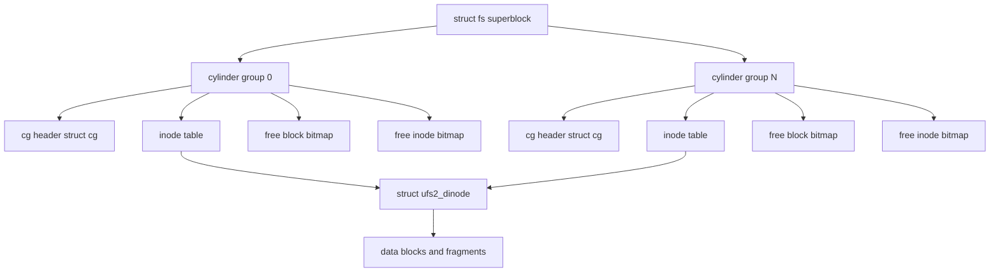
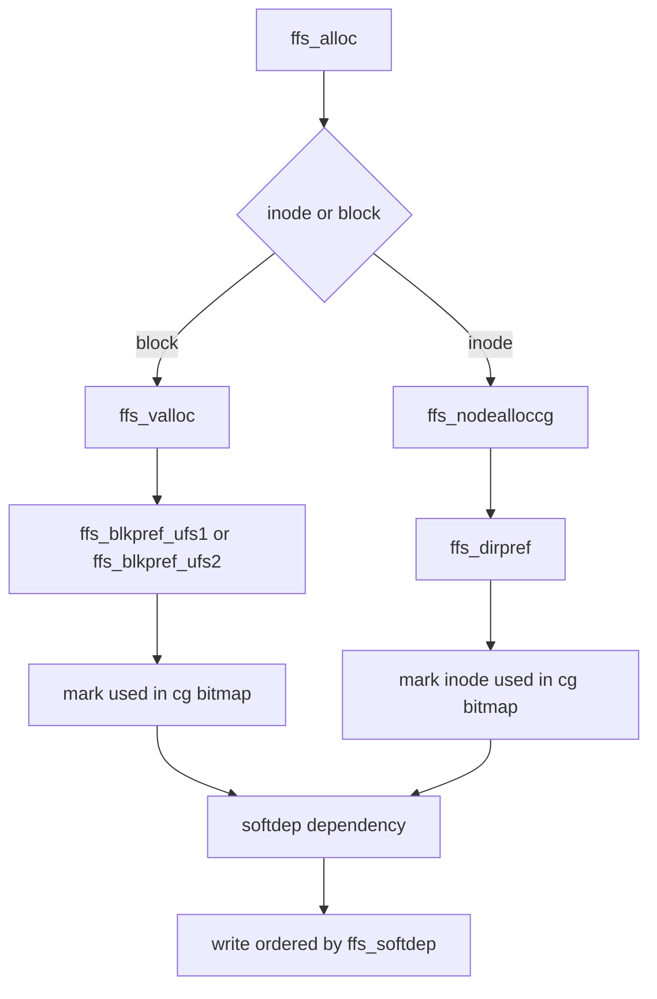

# UFS — FreeBSD's Native Filesystem
<!-- This file is auto-generated by generate-doc.py -- do not edit manually -->

---
**Navigation:**
  **Up:** [Kernel Core — Structure and Entry Point](../README.md) ▸ [Source Tree — Layout and Conventions](../../README_internals.md)
  **Related:** [Buffer Cache — Block I/O Subsystem](../vm/README_bcache.md) | [GEOM — Storage Framework](../geom/README.md) | [VFS — Virtual File System Layer](../fs/README.md)
  **All chapters:** [Source Tree — Layout and Conventions](../../README_internals.md) | [Boot Process — UEFI Bootloader to Kernel Handoff](../../stand/efi/loader/README.md) | [Kernel Core — Structure and Entry Point](../README.md) | [Build System — buildworld and buildkernel](../../share/mk/README.md) | [System Calls and Image Activation — Entry, sysent, and exec](../kern/README_syscall.md) | [Kernel Modules and the Linker — KLD, SYSINIT, and linker sets](../kern/README_kld.md) | [Virtual Memory Subsystem — vm_page, UMA, and Pagers](../vm/README.md) | [Process Management — Scheduling and Lifecycle](../kern/README_process.md) ...
---


## Quick Summary

The FreeBSD Unix File System (UFS) is the native filesystem that most FreeBSD
installations still run. It stores a large disk partition as a collection of
fixed-size filesystem blocks and fragments, and it keeps track of which blocks
are free and which belong to which file using bitmap tables. On top of the
original UFS layout sits the Fast File System (FFS) organization, which is the
format `newfs` creates by default. FFS divides the partition into a set of
*cylinder groups*, each of which carries its own set of inodes, its own free
block bitmap, and its own free inode bitmap. The reason for this layout is
mechanical: by keeping a directory's inodes and the data blocks of the files it
contains in the same cylinder group, the disk head does not have to travel far
to read a file after looking up its name. Tanenbaum describes the same idea in
*Modern Operating Systems*: dividing the disk into cylinder groups, each with
its own blocks and i-nodes, reduces the average seek between an i-[node](../netgraph/README.md#glossary) and the
first block of the file it describes.

A single superblock (`struct fs`) describes the whole filesystem: how many
cylinder groups there are, the block and fragment sizes, and the starting block
number of each region (superblock, cylinder-group headers, inodes, and data).
Because the superblock is the one structure whose loss would make the entire
filesystem unreadable, `newfs` writes a copy of it into every cylinder group;
only the copy in cylinder group 0 is normally read. The other cylinder groups
hold a smaller per-group header, `struct cg`, that tracks the free space for
that group alone.

FreeBSD's distinguishing contribution to UFS is *soft updates*. A traditional
filesystem can end up in an inconsistent [state](../netpfil/pf/README.md#glossary) after a power loss: the block
bitmap may say a block is free while a file's inode still points at it, or an
inode may be marked free while a directory entry still names it. Soft updates
solves this without a journal. Instead of logging every transaction, the kernel
records, in memory, the dependencies between the pieces of metadata that a
single operation touches, and it orders the writes so that no dependent block
reaches the disk before the block it depends on. The result is that, after any
crash, the on-disk state is one that `fsck` can read without finding a torn
inode or a double-allocated block, while the steady-state cost is only the
bookkeeping of the dependency lists.

FreeBSD supports two on-disk formats. UFS1 uses 32-bit block numbers, which
limits a filesystem to a few hundred gigabytes; UFS2 uses 48-bit block numbers
and is the format `newfs` creates by default. The two differ mostly in the size
of the on-disk inode and in the width of the block pointers, and the kernel
selects the right code path at mount time through the function operators stored
in the mount structure.

## Architecture

The UFS code is split across two directories. `sys/ufs/ufs/` holds the parts
that are shared by every UFS version, and `sys/ufs/ffs/` holds the Fast File
System specifics. The on-disk format is defined in `sys/ufs/ffs/fs.h`, which
declares the superblock (`struct fs`), the cylinder-group header (`struct cg`),
the per-group summary (`struct fs_summary_info`), and the helper macros
`lbn_level()` and `lbn_offset()`. The on-disk inode is defined in
`sys/ufs/ufs/dinode.h` as `struct ufs1_dinode` and `struct ufs2_dinode`; the
in-memory inode that the kernel attaches to each open file is `struct inode` in
`sys/ufs/ufs/inode.h`.

The mount-time state for one mounted UFS filesystem is `struct ufsmount` in
`sys/ufs/ufs/ufsmount.h`. It is the per-mount object that every UFS function
reaches for first: it holds the [GEOM](../vm/README_bcache.md#glossary) consumer (`um_cp`), the buffer-cache
object (`um_bo`), a pointer to the in-memory superblock (`um_fs`), the soft
updates management structure (`um_softdep`), and the constants that differ
between UFS1 and UFS2 such as the number of indirect pointers per block
(`um_nindir`) and the filesystem block size (`um_bsize`). The mount arguments
are carried in `struct ufs_args`, which holds the block special device to mount
(`fspec`) and the network export information (`export`).

Allocation is the heart of the FFS design and lives in
`sys/ufs/ffs/ffs_alloc.c`. The single entry point `ffs_alloc()` decides whether
the caller wants a data block or an inode and then routes to the right
allocator: `ffs_valloc()` for a data block and `ffs_nodealloccg()` for an
inode. Both consult preference functions — `ffs_blkpref_ufs1()` and
`ffs_blkpref_ufs2()` for blocks, `ffs_dirpref()` for the directory-driven
inode preference — to choose *where* in the cylinder group to place the new
allocation. The free side is `ffs_blkfree()`, which marks a block free in the
cylinder-group bitmap and, when the underlying disk supports it, queues an
UNMAP/TRIM request through `ffs_blkfree_trim_task()`. The logical-to-physical
block mapping (which indirect block a logical block number lives in) is built
by `ffs_balloc_ufs1()` and `ffs_balloc_ufs2()` in `sys/ufs/ffs/ffs_balloc.c`.

Soft updates is implemented in `sys/ufs/ffs/ffs_softdep.c` with its public
declarations in `sys/ufs/ffs/softdep.h`. The VFS glue — mount, unmount,
vnode operations, and the superblock read path — is in `sys/ufs/ffs/ffs_vfsops.c`
and `sys/ufs/ffs/ffs_vnops.c`. The superblock search order is implemented by
`ffs_sbget()` in `sys/ufs/ffs/ffs_subr.c`, which tries the UFS2 location, then
the UFS1 location, then the floppy location, then the piggy location, in that
order.

## Key Data Structures

### Superblock: `struct fs`

The superblock is defined in `sys/ufs/ffs/fs.h`. It is the single source of
truth for the geometry of the filesystem. The fields below are the layout
anchors — the block numbers at which each region of the disk begins — and the
per-group counts that let the kernel compute the size of a cylinder group:

```c
/* From sys/ufs/ffs/fs.h (layout fields; the full struct has many more) */
struct fs {
    daddr_t fs_sblkno;      /* Offset of super-block */
    daddr_t fs_cblkno;      /* Offset of cylinder group blocks */
    daddr_t fs_iblkno;      /* Offset of inode blocks */
    daddr_t fs_dblkno;      /* Offset of data blocks */
    int     fs_fpg;         /* Fragments per group */
    int     fs_ipg;         /* Inodes per group */
    /* ... more fields ... */
};
```

`fs_fpg` (fragments per group) and `fs_ipg` (inodes per group) are the two
numbers that, together with the block size, fix the size of every cylinder
group. `newfs` chooses them so that each group holds a roughly constant amount
of data, which is what keeps the per-group bitmaps small enough to fit in a
handful of blocks.

The superblock itself is not always at the same place on the disk. The macros
in `sys/ufs/ffs/fs.h` define where the kernel looks for it, in the order given
by `SBLOCKSEARCH`:

```c
/* From sys/ufs/ffs/fs.h */
#define	SBLOCK_FLOPPY	     0
#define	SBLOCK_UFS1	  8192
#define	SBLOCK_UFS2	 65536
#define	SBLOCK_PIGGY	262144
#define	SBLOCKSIZE	  8192
#define	SBLOCKSEARCH \
	{ SBLOCK_UFS2, SBLOCK_UFS1, SBLOCK_FLOPPY, SBLOCK_PIGGY, -1 }
```

So `ffs_sbget()` first probes 64 KiB in (the UFS2 default, which leaves room
for the disk label and a larger bootstrap), then 8 KiB in (the historical UFS1
location), then block 0 (very small media where every block counts), and
finally 256 KiB in (the "piggy" location). All values are byte offsets, so they
do not assume a sector size, and the superblock is always `SBLOCKSIZE`
(8192 bytes) long.

### Mount structure: `struct ufsmount`

The per-mount state is in `sys/ufs/ufs/ufsmount.h`. The leading fields are the
ones most UFS code reads on every operation:

```c
/* From sys/ufs/ufs/ufsmount.h (leading fields; the full struct is longer) */
struct ufsmount {
	struct	mount *um_mountp;		/* (r) filesystem vfs struct */
	struct	cdev *um_dev;			/* (r) device mounted */
	struct	g_consumer *um_cp;		/* (r) GEOM access point */
	struct	bufobj *um_bo;			/* (r) Buffer cache object */
	struct	vnode *um_odevvp;		/* (r) devfs dev vnode */
	struct	vnode *um_devvp;		/* (r) mntfs private vnode */
	uint64_t um_fstype;			/* (c) type of filesystem */
	struct	fs *um_fs;			/* (r) pointer to superblock */
	struct	ufs_extattr_per_mount um_extattr; /* (c) extended attrs */
	uint64_t um_nindir;			/* (c) indirect ptrs per blk */
	uint64_t um_bptrtodb;			/* (c) indir disk block ptr */
	uint64_t um_seqinc;			/* (c) inc between seq blocks */
	uint64_t um_bsize;			/* (c) fs block size */
	uint64_t um_maxsymlinklen;		/* (c) max size of short
						       symlink */
	struct	mtx um_lock;			/* (c) Protects ufsmount & fs */
	struct	mount_softdeps *um_softdep;	/* (c) softdep mgmt structure */
	/* ... quota file references and per-CPU locks follow ... */
};
```

The letters in the lock-reference comments (`c`, `i`, `q`, `r`) are the
invariants the code relies on: `c` for fields that are constant after
allocation, `i` for the ufsmount interlock, `q` for a locked quota file, and
`r` for a held reference to the parent mount. `um_softdep` is where the soft
updates work queues for this filesystem live; it is NULL when soft updates are
disabled on the mount. The mount arguments that feed the mount are:

```c
/* From sys/ufs/ufs/ufsmount.h */
struct ufs_args {
	char	*fspec;			/* block special device to mount */
	struct	oexport_args export;	/* network export information */
};
```

### Cylinder group: `struct cg`

Each cylinder group has a header, `struct cg`, also defined in
`sys/ufs/ffs/fs.h`, that is the per-group counterpart of the superblock. Where
`struct fs` describes the whole filesystem, `struct cg` describes one group: it
holds the free-data-block bitmap for that group, the free-inode bitmap, the
count of free blocks and free inodes, and a per-group summary (`struct
fs_summary_info`) that aggregates the free-space totals across all groups so
that a full-filesystem "how much is free" answer does not require summing every
group. The kernel reads a group's header with `ffs_getcg()` and checks it with
`ffs_checkcgintegrity()`. Because the bitmaps are per-group, allocating a block
only ever touches one cylinder-group header, which is what keeps the allocation
path from contending on a single global lock.

### On-disk inode and soft updates dependency records

The on-disk inode is `struct ufs1_dinode` or `struct ufs2_dinode` in
`sys/ufs/ufs/dinode.h`; the root inode is defined there as `UFS_ROOTINO`, the
value 2 (inode 0 is reserved and inode 1 is legacy, so the tree is rooted at 2).
The UFS2 inode uses 48-bit block pointers, which is what lifts the size limit
beyond UFS1's 32-bit addresses.

Soft updates keeps its state in a set of dependency records declared in
`sys/ufs/ffs/softdep.h`. The header's own comment states the model:

```
/* From sys/ufs/ffs/softdep.h (top-of-file comment) */
 * Allocation dependencies are handled with undo/redo on the in-memory copy
 * of the data.  A particular data dependency is eliminated when it is
 * ALLCOMPLETE: that is ATTACHED, DEPCOMPLETE, and COMPLETE.
```

The records are `struct inodedep` (the dependencies attached to one inode),
`struct pagedep` (the dependencies attached to one buffer-cache page), and the
work-list and new-block records that describe the in-flight operation. The
reason these records exist is the crash-consistency problem: a single
`write()` that extends a file must update the file's data block, the inode's
size and block pointers, the cylinder-group block bitmap, and the cylinder-group
free count, and those four writes may land on the disk in any order. The
dependency records let the kernel hold the later writes until the earlier ones
are on stable storage, so no intermediate disk state is ever self-contradictory.

## Deep Dive

### Mounting and finding the superblock

When `mount` is called for a UFS device, the VFS layer builds a
`struct ufsmount` and the UFS mount path reads the superblock through
`ffs_sbget()` in `sys/ufs/ffs/ffs_subr.c`. That function walks the
`SBLOCKSEARCH` order — UFS2 at 64 KiB, UFS1 at 8 KiB, floppy at 0, piggy at
256 KiB — reading each candidate and validating it until one passes. Once a
valid superblock is found, its fields are copied into `um_fs` and the
UFS1/UFS2-specific constants (`um_nindir`, `um_bsize`, `um_bptrtodb`,
`um_maxsymlinklen`) are filled in from the on-disk format so that the rest of
the code can use a single set of field names regardless of which format is
mounted. `readsuper()` in the same file is the helper that validates a candidate
superblock's magic and checksums before it is accepted.

### Allocating a data block

The allocation path starts at `ffs_alloc()` in `sys/ufs/ffs/ffs_alloc.c`. It is
the single funnel through which every UFS data-block allocation passes, and it
takes the caller's preference (a starting cylinder group and a preferred block
number) and turns it into a concrete block. The flow is:

1. `ffs_alloc()` decides which cylinder group to allocate from. It starts at
   the caller's preferred group and, if that group is out of space, walks
   outward to the nearest group with free blocks.
2. It calls the preference function for the on-disk format —
   `ffs_blkpref_ufs1()` or `ffs_blkpref_ufs2()` — to pick a specific block
   inside the chosen group. The preference logic prefers blocks that are near
   the file's existing blocks and near the file's own inode, so that a growing
   file stays physically contiguous and close to its metadata.
3. If the requested size does not fill a whole block, `ffs_fragextend()` is
   used to extend an existing fragment rather than allocating a fresh block.
4. The chosen block is marked used in the group's free bitmap, the group's free
   count is decremented, and — when soft updates is on — the bitmap update and
   the inode update are tied together with a dependency so they cannot reach
   the disk out of order.

The same funnel has an inode variant, `ffs_nodealloccg()`, which allocates a
free inode from a group's inode bitmap using `ffs_dirpref()` to prefer an inode
close to the parent directory's inode. That is the mechanism behind the FFS
guarantee that a new file's inode lands in the same cylinder group as the
directory that names it.

### Logical-to-physical mapping

A file's data does not live in one place; the on-disk inode holds a set of
direct block pointers plus a chain of indirect blocks (single, double, and
triple indirect) that point at further blocks. `ffs_balloc_ufs1()` and
`ffs_balloc_ufs2()` in `sys/ufs/ffs/ffs_balloc.c` build that structure. The
file's own comment states the role:

```
/* From sys/ufs/ffs/ffs_balloc.c (top-of-file comment) */
 * Balloc defines the structure of filesystem storage
 * by allocating the physical blocks on a device given
 * the inode and the logical block number in a file.
 * This is the allocation strategy for UFS1. Below is
 * the allocation strategy for UFS2.
```

Given a logical block number, the mapping is computed by the `lbn_level()` and
`lbn_offset()` macros in `sys/ufs/ffs/fs.h`: `lbn_level()` returns which level
of indirection (direct, single, double, triple) the block lives at, and
`lbn_offset()` returns the offset within that level's pointer array. The number
of pointers that fit in one indirect block is `um_nindir`, which is why the
mount structure caches it: it is the same computation the kernel does on every
`read()` and `write()` to a file past the direct blocks.

### Freeing a block and TRIM

The reverse path is `ffs_blkfree()` in `sys/ufs/ffs/ffs_alloc.c`. It marks the
block free in the group's bitmap, increments the group's free count, and, if the
block was the last reference to a run of blocks, issues an UNMAP to the device
so that an SSD or thin-provisioned store can [reclaim](../sys/README_mbuf.md#glossary) the space. The TRIM work
is deferred to a taskqueue: `ffs_blkfree_trim_task()` runs the queued request
and `ffs_blkfree_trim_completed()` reaps it. The per-request state is
`struct ffs_blkfree_trim_params`, and the lookup of a previously queued request
is `trim_lookup()`. Deferring TRIM to a taskqueue keeps the fast allocation
path from blocking on device I/O that the filesystem does not need for
correctness.

### Soft updates in operation

When soft updates is enabled, the allocation and free paths above do not write
their metadata directly. Instead they register the intended change with the
soft updates layer in `sys/ufs/ffs/ffs_softdep.c`, which attaches the change to
the appropriate `struct inodedep` or `struct pagedep`. The layer then walks the
dependency graph and writes out the blocks in an order that respects the
dependencies: a block is not written until every block it depends on is already
on stable storage. The `ALLCOMPLETE` state named in the `softdep.h` comment is
the point at which a dependency has been attached, its own data is complete,
and it has been written — at that point it can be freed. This is what lets
FreeBSD skip a journal: the ordering of writes, not a log, is what guarantees
that `fsck` never sees a torn state.

## Flow / Diagram

The on-disk hierarchy, from the single superblock down to the per-group
bitmaps:



The allocation path through the FFS code:



## Advanced Notes

**Debugging with DTrace.** The soft updates layer and the allocation path are
instrumented with SDT probes, so a DTrace script can watch allocation
decisions live. The [probe](../kern/README_driver.md#glossary) definitions follow the standard `SDT_PROBE_DEFINE`
form used throughout the kernel (see [`SDT(9)`](../../share/man/man9/SDT.9)), and the module is the UFS
provider, so scripts key off the `ufs` probe module. Tracing the
`ffs_alloc`/`ffs_valloc` boundary shows which cylinder group and block the
preference functions chose, which is the fastest way to diagnose why a file
grew non-contiguously. The buffer-cache side is observable through the
`buf` and `bio` probes described in the [Buffer Cache](../vm/README_bcache.md#glossary) chapter, which lets you
correlate a soft updates write ordering with the actual `g_bio` submission
order to GEOM.

**Performance implications.** The cylinder-group size is the single biggest
knob. A group that is too small forces the free bitmaps to be rewritten often
and scatters a single file's blocks across many groups; a group that is too
large makes the per-group bitmaps big enough to thrash the buffer cache and
defeats the locality the design is meant to buy. `newfs` picks a default, but
[`tunefs(8)`](../../sbin/tunefs/tunefs.8) can retune the free-space thresholds on a mounted filesystem, and it
is also the tool that enables or disables soft updates and the soft updates
journal. Clustering of related blocks is what `ffs_clusteralloc()` optimizes:
when a caller asks for several blocks at once, it tries to place them in a run
so the device sees a sequential write.

**Crash consistency and the journal.** Plain soft updates keeps the dependency
state only in memory, which is enough for the kernel to order writes but means
the ordering information is lost in a crash. The soft updates journal (the
[`gjournal(8)`](../../lib/geom/journal/gjournal.8) GEOM class) persists that ordering information to a dedicated
journal partition so that, after a crash, the kernel can resume the in-flight
metadata operations instead of relying on `fsck` to reconstruct them. The
FreeBSD Handbook recommends soft updates with journaling for both desktop and
general-purpose server use, and notes that [`dump(8)`](../../sbin/dump/dump.8) does not work on a
filesystem with the soft updates journal enabled — [`tunefs(8)`](../../sbin/tunefs/tunefs.8) is used to
detect and disable it before a `dump`.

**Race conditions and locking.** The per-mount `um_lock` protects the
`struct ufsmount` and the in-memory `struct fs`, and the cylinder-group
headers are protected per-group so that two allocations in different groups do
not serialize. The soft updates dependency records carry their own locking,
because a single in-flight operation can touch records in several groups at
once. The classic UFS pitfall is a writer that assumes a block it just
allocated is immediately visible to a concurrent reader; with soft updates the
metadata that makes the block visible is deliberately held back until its
dependencies are satisfied, so code that bypasses the dependency layer can
observe a block that the on-disk state does not yet describe.

**Connection to OS theory.** The cylinder-group layout is the concrete
implementation of the locality principle in Tanenbaum's *Modern Operating
Systems* and in the free-space-management discussion in *Operating System
Concepts* (bitmap and grouping strategies). Soft updates is an alternative to
the journaling approach those texts describe: instead of logging a transaction
and replaying it, it orders the writes so that no log is needed. The trade-off
is that the ordering state must be kept in memory (or persisted by the
journal), and that the write path carries the cost of maintaining the
dependency graph — a cost that shows up as extra bookkeeping on every metadata
change but no cost on a pure data write.

## See Also
- [VFS — Virtual File System Layer](../fs/README.md)
- [Buffer Cache — Block I/O Subsystem](../vm/README_bcache.md)
- [GEOM — Storage Framework](../geom/README.md)


- Source directories: [`sys/ufs/ffs/`](ffs) (allocation, soft updates, on-disk format) and [`sys/ufs/ufs/`](ufs) (shared inode, directory, and mount code).
- Man pages: [`newfs(8)`](../../sbin/newfs/newfs.8), [`tunefs(8)`](../../sbin/tunefs/tunefs.8), [`fsck(8)`](../../sbin/fsck/fsck.8), [`gjournal(8)`](../../lib/geom/journal/gjournal.8), `mount_ufs(5)`, [`SDT(9)`](../../share/man/man9/SDT.9).

---

> _Generated by [DaemonDocs](https://github.com/ocochard/DaemonDocs) on 2026-08-26 15:39 UTC using model `Qwen3.8-27B-Q8_0` (llama.cpp build `b10553-cd26896c1`). AI-generated content — verify against source before relying on it._
