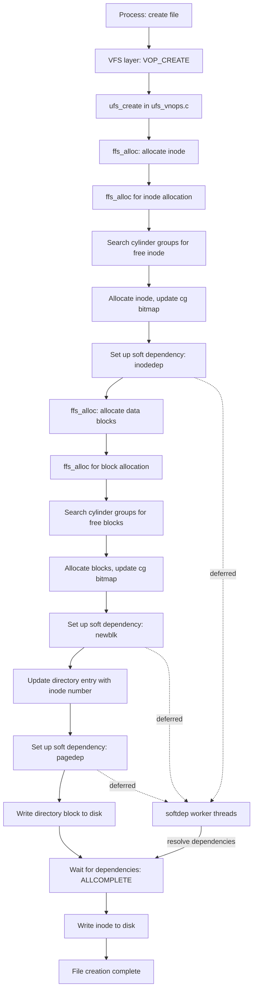

# UFS — FreeBSD's Native Filesystem
<!-- This file is auto-generated by generate-doc.py -- do not edit manually -->

---
**Navigation:**
  **Up:** [Kernel Core — Structure and Entry Point](../README.md) ▸ [Source Tree — Layout and Conventions](../../README_internals.md)
  **Related:** [Buffer Cache — Block I/O Subsystem](../vm/README_bcache.md) | [GEOM — Storage Framework](../geom/README.md) | [VFS — Virtual File System Layer](../fs/README.md)
  **All chapters:** [Source Tree — Layout and Conventions](../../README_internals.md) | [Boot Process — UEFI Bootloader to Kernel Handoff](../../stand/efi/loader/README.md) | [Kernel Core — Structure and Entry Point](../README.md) | [Build System — buildworld and buildkernel](../../share/mk/README.md) | [Virtual Memory Subsystem — vm_page, UMA, and Pagers](../vm/README.md) | [Process Management — Scheduling and Lifecycle](../kern/README_process.md) | [Locking Primitives — Mutexes, sx, rmlocks, and Atomics](../kern/README_locking.md) | [Buffer Cache — Block I/O Subsystem](../vm/README_bcache.md) ...
---


> ⚠ **UNVERIFIED DRAFT** — reviewer did not explicitly approve this draft. Treat claims as suspect until manually reviewed.


## Quick Summary
The FreeBSD Unix File System (UFS), enhanced with the Fast File System (FFS) layout, is a mature filesystem designed for reliability and efficiency on traditional disk storage. FFS improves upon the original UFS by organizing the disk into cylinder groups, which cluster related inodes and data blocks together. This layout significantly reduces disk seek times, especially for directory traversals and file creation, by keeping metadata and data physically close on the platter.

A key innovation in FreeBSD's UFS implementation is "soft updates," a technique that ensures filesystem consistency after an unexpected shutdown without the overhead of a traditional journal. Instead of writing transaction logs, soft updates tracks dependencies between metadata updates in memory. The kernel defers certain writes until their dependencies are satisfied, allowing for asynchronous metadata updates while guaranteeing that the on-disk state remains valid. This approach provides a good balance between performance and crash consistency, although it has specific hardware requirements and limitations.

FreeBSD supports both UFS1 (32-bit block addresses) and UFS2 (48-bit block addresses, supporting filesystems up to 2^48 bytes). The FFS layout algorithm places new files near their parent directory's inode, reducing the physical distance between related metadata and data. The superblock is replicated in Cylinder Group 0 for redundancy; other cylinder groups contain a Cylinder Group header (`struct cg`) rather than a full superblock copy. The filesystem uses bitmap-based allocation to efficiently track free inodes and data blocks.

## Architecture
The UFS implementation is distributed across several directories in the FreeBSD source tree. The core on-disk format is defined in `sys/ufs/ffs/fs.h`, which describes the superblock and cylinder group structures. The allocation logic for inodes and data blocks resides in `sys/ufs/ffs/ffs_alloc.c`. The soft updates mechanism, which handles metadata dependencies, is implemented in `sys/ufs/ffs/ffs_softdep.c` and `sys/ufs/ffs/softdep.h`. The VFS interface for UFS is provided by files in `sys/ufs/ufs/`, such as `ufsmount.h` and `inode.c`.

The filesystem is organized into cylinder groups, each containing a copy of the superblock, inode tables, and data blocks. This layout minimizes the distance the disk head must travel when accessing files within the same directory. The superblock (`struct fs`) contains global information about the filesystem, including the number of cylinder groups and the layout of blocks.

The superblock search order for locating the active superblock is implemented by `ffs_sbsearch()` in `sys/ufs/ffs/ffs_subr.c`, which searches for UFS2 at 64K, UFS1 at 8K, floppy at 0, and piggy at 256K. The `SBLOCKSIZE` constant is 8192 bytes.

The mount structure `struct ufsmount` in `sys/ufs/ufs/ufsmount.h` tracks per-mount state including the GEOM consumer (`um_cp`), buffer cache object (`um_bo`), the superblock pointer (`um_fs`), and the soft dependencies management structure (`um_softdep`). It also includes per-CPU locks and quota file references.

## Key Data Structures

### Superblock: `struct fs`
The superblock structure is defined in `sys/ufs/ffs/fs.h`. It describes the overall filesystem layout, including cylinder group boundaries:

```c
/* From sys/ufs/ffs/fs.h */
struct fs {
    daddr_t fs_sblkno;      /* Offset of super-block */
    daddr_t fs_cblkno;      /* Offset of cylinder group blocks */
    daddr_t fs_iblkno;      /* Offset of inode blocks */
    daddr_t fs_dblkno;      /* Offset of data blocks */
    int     fs_cpg;         /* Cylinders per group */
    int     fs_fpg;         /* Fragments per group */
    int     fs_ipg;         /* Inodes per group */
    ufs2_daddr_t fs_sparecon[36]; /* Spare constructor space */
    /* ... additional fields for block/inode bitmaps, free counts */
};
```

Key fields include `fs_sblkno` (superblock offset), `fs_cblkno` (cylinder group block offset), `fs_iblkno` (inode block offset), `fs_dblkno` (data block offset), `fs_cpg` (cylinders per group), `fs_fpg` (fragments per group), and `fs_ipg` (inodes per group). The filesystem uses these to compute block locations using the `cgbase(fs, c)` macro.

### Cylinder Group Header: `struct cg`
Each cylinder group contains a header structure (`struct cg`) that tracks allocation state within that group. This includes bitmaps for free inodes and free blocks, as well as counts of available resources.

### Inode Structures
Two inode formats exist: `struct ufs1_dinode` (32-bit) and `struct ufs2_dinode` (64-bit). These are defined in `sys/ufs/ufs/dinode.h`. The root inode is defined as `UFS_ROOTINO` (value 2), since inode 0 cannot be used and inode 1 historically held bad blocks.

### Mount Structure: `struct ufsmount`
Defined in `sys/ufs/ufs/ufsmount.h`:

```c
struct ufsmount {
    struct  mount *um_mountp;       /* filesystem vfs struct */
    struct  cdev *um_dev;           /* device mounted */
    struct  g_consumer *um_cp;      /* GEOM access point */
    struct  bufobj *um_bo;          /* Buffer cache object */
    struct  fs *um_fs;              /* pointer to superblock */
    struct  mtx um_lock;            /* Protects ufsmount & fs */
    struct  mount_softdeps *um_softdep; /* softdep mgmt structure */
    struct  vnode *um_quotas[MAXQUOTAS]; /* quota files */
    /* ... additional fields */
};
```

### Soft Updates Structures
Defined in `sys/ufs/ffs/softdep.h`:

- `worklist` — represents pending work to be processed by the softdep worker threads
- `pagedep` — tracks dependencies for a particular disk block
- `inodedep` — tracks dependencies for inode updates
- `bmsafemap` — tracks cylinder group map updates for crash consistency
- `newblk` — tracks newly allocated blocks pending directory updates
- `allocdirect` — tracks direct block allocation dependencies

## Deep Dive

### Cylinder Group Organization
The FFS layout divides the disk into cylinder groups, each containing a self-contained subset of the filesystem. The superblock (`struct fs`) in `sys/ufs/ffs/fs.h` defines the layout parameters:

```c
/* From sys/ufs/ffs/fs.h */
#define SBLOCK_FLOPPY    0
#define SBLOCK_UFS1      8192
#define SBLOCK_UFS2      65536
#define SBLOCK_PIGGY     262144
#define SBLOCKSIZE       8192
#define SBLOCKSEARCH     { SBLOCK_UFS2, SBLOCK_UFS1, SBLOCK_FLOPPY, SBLOCK_PIGGY, -1 }
```

The superblock search order (`SBLOCKSEARCH`) defines where the kernel looks for the active superblock: first at 64K for UFS2, then 8K for UFS1, then 0 for floppy filesystems, and finally 256K for "piggy" filesystems. This multi-location search ensures compatibility across different filesystem creation tools and media types.

The `cgbase(fs, c)` macro computes the starting block of cylinder group `c` using the formula `c * fs->fs_fpg`, where `fs_fpg` is the number of fragments per group.

### Allocation Strategy
The FFS allocation algorithm in `sys/ufs/ffs/ffs_alloc.c` uses hash-based allocation to distribute new files evenly across cylinder groups. The key function `ffs_alloc()` implements this strategy, iterating through cylinder groups and searching for available space based on proximity to the allocation request.

For inode allocation, `ffs_valloc()` is used to allocate inodes within cylinder groups. For data blocks, `ffs_balloc_ufs2()` is used to allocate data blocks within cylinder groups.

Cluster allocation is handled by the `ffs_alloc()` function with cluster support, which allocates multiple contiguous blocks for sequential file writes. This reduces seek times for large file operations by keeping related data blocks physically adjacent.

Fragment extension is handled by the regular allocation mechanism, which extends a file to use full blocks when the file grows beyond its initial fragment allocation. This is important because UFS allows partial blocks (fragments) at the end of files to reduce space waste.

### Soft Updates Mechanism
The soft updates mechanism in `sys/ufs/ffs/ffs_softdep.c` implements the algorithm described in "Soft Updates: A Solution to the Metadata Update Problem in File Systems" by Gregory R. Ganger and Yale N. Patt. The key insight is that metadata updates have dependencies — for example, a directory entry must not be written before the inode it references exists, and a cylinder group bitmap must not be updated before the blocks it describes are actually written.

The dependency tracking uses three flags defined in `sys/ufs/ffs/softdep.h`:

```c
/* From sys/ufs/ffs/softdep.h */
/*
 * Allocation dependencies are handled with undo/redo on the in-memory
 * copy of the data. A particular data dependency is eliminated when
 * it is ALLCOMPLETE: that is ATTACHED, DEPCOMPLETE, and COMPLETE.
 *
 * The ATTACHED flag means that the data is not currently being written
 * to disk.
 *
 * The COMPLETE flag indicates that the item has been written. For example,
 * a dependency that requires that an inode be written will be marked
 * COMPLETE after the inode has been written to disk.
 *
 * The DEPCOMPLETE flag indicates the completion of any other
 * dependencies such as the writing of a cylinder group map has been
 * completed.
 */
```

The `pagedep` structure tracks dependencies for a specific disk block, while `inodedep` tracks inode-related dependencies. When creating a directory, two flags are used: `MKDIR_BODY` (cleared when the directory data block with "." and ".." entries is written) and `MKDIR_PARENT` (cleared when the parent inode's link count is updated).

The softdep worker threads process the worklist, resolving dependencies in the correct order. When a dependency is complete, the associated data structure is freed. This ensures that on-disk metadata is always consistent, even after a crash.

### Buffer Cache Integration
The `struct ufsmount` structure includes a `bufobj` pointer (`um_bo`) that connects UFS to the buffer cache subsystem. This allows UFS to manage its own buffer objects, which track dirty buffers and manage I/O scheduling. The GEOM consumer (`um_cp`) provides a block-level abstraction that handles device I/O transparently.

## Flow / Diagram



## Advanced Notes

### Debugging with sysctls and ddb
FreeBSD's UFS implementation provides several debugging mechanisms. The `vfs.ffs.*` sysctl tree exposes filesystem parameters and statistics. The `sysctl vfs.ffs.fsck` interface provides access to filesystem check parameters. For kernel-level debugging, the DDB debugger can inspect UFS data structures directly, and `ktr` tracing can be enabled for detailed kernel trace record output.

### Performance Considerations
Cylinder group sizing affects performance: larger groups reduce metadata overhead but increase the time to find free space. The `fs_cpg` (cylinders per group) and `fs_fpg` (fragments per group) fields in the superblock determine the group size. A common heuristic is to make each cylinder group approximately 16-32 MB.

Cluster allocation significantly improves sequential write performance by allocating contiguous blocks. The cluster size is determined by the `fs_maxbpg` field in the superblock. For workloads with many small files, smaller cylinder groups reduce fragmentation.

### Crash Consistency and Soft Updates
Soft updates guarantee crash consistency by ensuring that metadata updates are written in dependency order. However, there are limitations:

1. **Power failures during I/O**: If the system loses power while a buffer is dirty, the buffer cache contents are lost. Soft updates cannot recover from this.
2. **Non-atomic updates**: Some operations require multiple disk writes that cannot be fully serialized. The `bmsafemap` structure helps track cylinder group map updates.
3. **Hardware requirements**: Soft updates require that the disk controller does not reorder writes in ways that violate the dependency order.

When soft updates are enabled, the `tunefs` userland utility can also enable "soft updates journaling," which adds a small journal to further reduce fsck time after a crash.

### Common Pitfalls
- **Filesystem corruption after unexpected shutdown**: While soft updates significantly reduce the risk, they do not eliminate it entirely. Regular backups are still essential.
- **Allocation delays**: When cylinder groups become fragmented, `ffs_alloc()` may spend significant time searching for free space. This can cause latency spikes during file creation.
- **Soft updates worker thread backlog**: Under heavy filesystem activity, the softdep worker threads may fall behind, causing memory pressure from accumulated dependencies.

### Connection to OS Theory
The soft updates mechanism is a practical implementation of dependency-based consistency, which relates to the broader OS theory of transaction processing without explicit logging. Unlike traditional journaling filesystems that write all metadata changes to a log before applying them, soft updates rely on the ordering of writes to maintain consistency. This approach reduces disk I/O but requires careful handling of write ordering guarantees from the storage subsystem.

The cylinder group layout relates to the concept of locality of reference — by keeping related data physically close, the filesystem reduces seek times and improves performance for typical access patterns. This is similar to how databases use clustering keys to co-locate related rows.

## Comparison

### Linux ext4
Linux's ext4 filesystem also uses a block-group-like organization, with each group containing its own inode table and block bitmap. However, ext4 uses a different allocation strategy: it employs a buddy allocator for block groups and supports extents (contiguous block runs) natively, whereas UFS uses hash-based allocation with explicit fragment tracking. Ext4's journaling is mandatory (though configurable), while FreeBSD's UFS relies on soft updates as the default consistency mechanism.

FreeBSD's soft updates approach differs from ext4's journaling in that it tracks dependencies in memory rather than writing to a log. This eliminates the write amplification of journaling but requires stronger guarantees about write ordering from the storage subsystem.

### macOS/XNU (HFS+)
Apple's HFS+ (and its successor APFS) uses a B-tree-based catalog structure, which differs fundamentally from UFS's inode-based approach. HFS+ organizes files in a hierarchical tree with separate allocation bitmap files, while UFS embeds bitmap information directly in cylinder group headers. APFS introduces copy-on-write semantics and snapshots, features not present in traditional UFS.

### NetBSD/UFS
NetBSD's UFS implementation shares the same 4.4BSD heritage as FreeBSD's, but differs in several concrete ways. NetBSD's soft updates implementation uses a different dependency tracking structure — `pagedep` in NetBSD includes additional fields for tracking indirect block dependencies that FreeBSD handles separately. NetBSD's `ffs_alloc.c` uses a different hash function (`ffs_hashfunc`) with a distinct collision resolution strategy. Additionally, NetBSD's `struct cg` includes a `cg_rawblkoff` field that FreeBSD's equivalent lacks, used for raw I/O offset calculations. NetBSD also maintains separate allocation statistics counters in the superblock (`fs_cstotal`) that FreeBSD consolidates into a single structure.

### OpenBSD/UFS
OpenBSD's UFS implementation has diverged significantly from FreeBSD's. OpenBSD removed UFS support entirely starting with OpenBSD 6.4 (2018), replacing it with F2FS as the default filesystem on flash storage and retaining only minimal UFS read-only support in later versions. Historically, OpenBSD's UFS implementation was more conservative — it omitted cluster allocation optimizations, used simpler fragment handling, and did not implement soft updates, relying instead on traditional fsck for crash consistency. OpenBSD's `sys/ufs/ffs/ffs_alloc.c` also used a different allocation strategy that prioritized simplicity over performance, with linear search patterns instead of FreeBSD's hash-based distribution.

## See Also
- [VFS — Virtual File System Layer](../fs/README.md)
- [Buffer Cache — Block I/O Subsystem](../vm/README_bcache.md)
- [GEOM — Storage Framework](../geom/README.md)


- [sys/ufs/ffs/ffs_alloc.c] — FFS allocation implementation
- [sys/ufs/ffs/ffs_softdep.c] — soft updates dependency tracking
- [sys/ufs/ffs/fs.h] — superblock and cylinder group definitions
- [sys/ufs/ufs/ufsmount.h] — mount structure definition
- [sys/ufs/ufs/dinode.h] — inode structure definitions

---

> _Generated by [DaemonDocs](https://github.com/ocochard/DaemonDocs) on 2026-04-30 23:21 UTC using model `Qwen3.6-35B-A3B-UD-Q4_K_XL` (llama.cpp build `b8985-27aef3dd9`). AI-generated content — verify against source before relying on it._
