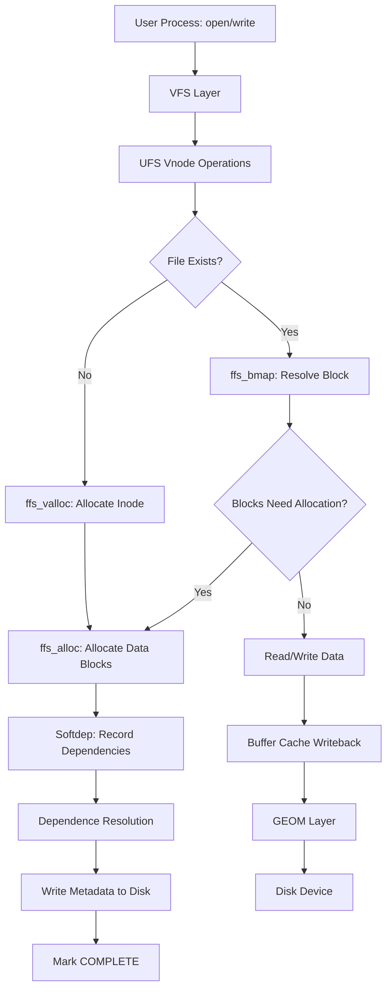
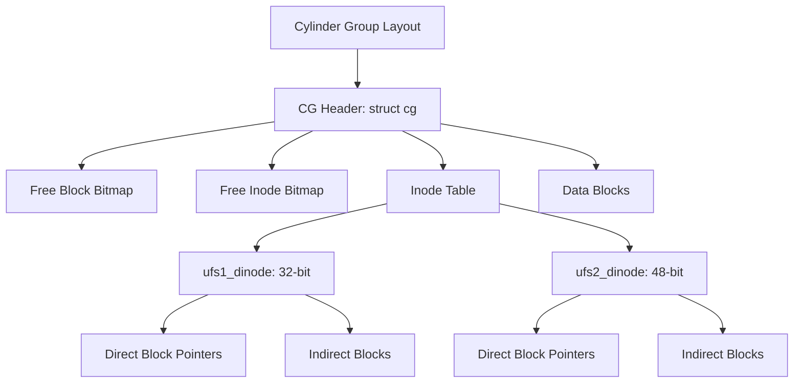

# UFS — FreeBSD's Native Filesystem
<!-- This file is auto-generated by generate-doc.py -- do not edit manually -->

---
**Navigation:**
  **Related:** [Buffer Cache — Block I/O Subsystem](../vm/README_bcache.md) | [GEOM — Storage Framework](../geom/README.md) | [VFS — Virtual File System Layer](../fs/README.md)
  **All chapters:** [Source Tree — Layout and Conventions](../../README_internals.md) | [Boot Process — UEFI Bootloader to Kernel Handoff](../../stand/efi/loader/README.md) | [Kernel Core — Structure and Entry Point](../README.md) | [Build System — buildworld and buildkernel](../../share/mk/README.md) | [Virtual Memory Subsystem — vm_page, UMA, and Pagers](../vm/README.md) | [Process Management — Scheduling and Lifecycle](../kern/README_process.md) | [Locking Primitives — Mutexes, sx, rmlocks, and Atomics](../kern/README_locking.md) | [Buffer Cache — Block I/O Subsystem](../vm/README_bcache.md) ...
---


## Quick Summary
The FreeBSD Unix File System (UFS), enhanced with the Fast File System (FFS) layout, is a mature filesystem designed for reliability and efficiency on traditional disk storage. FFS improves upon the original UFS by organizing the disk into cylinder groups, which cluster related inodes and data blocks together. This layout significantly reduces disk seek times, especially for directory traversals and file creation, by keeping metadata and data physically close on the platter.

A key innovation in FreeBSD's UFS implementation is "soft updates," a technique that ensures filesystem consistency after an unexpected shutdown without the overhead of a traditional journal. Instead of writing transaction logs, soft updates tracks dependencies between metadata updates in memory. The kernel defers certain writes until their dependencies are satisfied, allowing for asynchronous metadata updates while guaranteeing that the on-disk state remains valid. This approach provides a good balance between performance and crash consistency, although it has specific hardware requirements and limitations.

FreeBSD supports both UFS1 (32-bit block addresses) and UFS2 (48-bit block addresses, supporting filesystems up to 2^48 bytes). The FFS layout algorithm places new files near their parent directory's inode, reducing the physical distance between related metadata and data. The superblock is replicated in Cylinder Group 0 for redundancy; other cylinder groups contain a Cylinder Group header (`struct cg`) rather than a full superblock copy. The filesystem uses bitmap-based allocation to efficiently track free inodes and data blocks.

## Architecture
The UFS implementation is distributed across several directories in the FreeBSD source tree. The core on-disk format is defined in `sys/ufs/ffs/fs.h`, which describes the superblock and cylinder group structures. The allocation logic for inodes and data blocks resides in `sys/ufs/ffs/ffs_alloc.c`. The soft updates mechanism, which handles metadata dependencies, is implemented in `sys/ufs/ffs/ffs_softdep.c` and `sys/ufs/ffs/softdep.h`. The VFS interface for UFS is provided by files in `sys/ufs/ufs/`, such as `ufsmount.h` and `inode.c`.

The filesystem is organized into cylinder groups, each containing a copy of the superblock, inode tables, and data blocks. This layout minimizes the distance the disk head must travel when accessing files within the same directory. The superblock (`struct fs`) contains global information about the filesystem, including the number of cylinder groups and the layout of blocks.

The superblock search order for locating the active superblock is implemented by `ffs_sbsearch()` in `sys/ufs/ffs/ffs_subr.c`, which searches for UFS2 at 64K, UFS1 at 8K, floppy at 0, and piggy at 256K. The `SBLOCKSIZE` constant is 8192 bytes.

The mount structure `struct ufsmount` in `sys/ufs/ufs/ufsmount.h` tracks per-mount state including the GEOM consumer (`um_cp`), buffer cache object (`um_bo`), the superblock pointer (`um_fs`), and the soft dependencies management structure (`um_softdep`). It also includes per-CPU locks and quota file references.

## Key Data Structures

### Superblock: `struct fs`
The superblock structure is defined in `sys/ufs/ffs/fs.h`. It describes the overall filesystem layout, including cylinder group boundaries:

```c
/* From sys/ufs/ffs/fs.h */
struct fs {
    daddr_t fs_sblkno;      /* Offset of super-block */
    daddr_t fs_cblkno;      /* Offset of cylinder group blocks */
    daddr_t fs_iblkno;      /* Offset of inode blocks */
    daddr_t fs_dblkno;      /* Offset of data blocks */
    int     fs_cpg;         /* Cylinders per group */
    int     fs_fpg;         /* Fragments per group */
    int     fs_ipg;         /* Inodes per group */
    ufs2_daddr_t fs_sparecon[36]; /* Spare constructor space */
    /* ... additional fields for block/inode bitmaps, free counts */
};
```

Key fields include `fs_sblkno` (super-block offset), `fs_cblkno` (cylinder group block offset), `fs_iblkno` (inode block offset), and `fs_dblkno` (data block offset). It also stores `fs_cpg` (cylinders per group) and `fs_fpg` (fragments per group). The superblock is replicated in Cylinder Group 0 for redundancy, with copies in other cylinder groups containing only a `struct cg` header.

The superblock search locations are defined by macros in `sys/ufs/ffs/fs.h`:
```c
#define SBLOCK_FLOPPY   0
#define SBLOCK_UFS1     8192
#define SBLOCK_UFS2     65536
#define SBLOCK_PIGGY    262144
#define SBLOCKSIZE      8192
#define SBLOCKSEARCH    { SBLOCK_UFS2, SBLOCK_UFS1, SBLOCK_FLOPPY, SBLOCK_PIGGY, -1 }
```

### Cylinder Group: `struct cg`
Each cylinder group contains a `struct cg` header (defined in `sys/ufs/ffs/fs.h`) that describes the layout of blocks within that group. The cg structure includes bitmaps for free blocks and free inodes, counts of free blocks and inodes, and the offset of the inode table. The starting block number of any cylinder group can be computed by multiplying the fragments-per-group (`fs_fpg`) by the cylinder group index.

### Inodes: `ufs1_dinode` and `ufs2_dinode`
Defined in `sys/ufs/ufs/dinode.h`, UFS supports two inode formats:
- `ufs1_dinode`: Uses 32-bit block addresses (max filesystem ~2TB)
- `ufs2_dinode`: Uses 48-bit block addresses (max filesystem ~256TB)

```c
/* From sys/ufs/ufs/dinode.h */
#define UFS_ROOTINO ((ino_t)2)
```

The root inode is 2 (inode 0 is unused, and inode 1 historically stored bad block references). Both inode structures contain file metadata including size, timestamps, block pointers (direct, indirect, double-indirect, triple-indirect), and link count.

### Mount Structure: `struct ufsmount`
Defined in `sys/ufs/ufs/ufsmount.h`, this structure tracks per-mount state:

```c
/* From sys/ufs/ufs/ufsmount.h */
struct ufsmount {
    struct mount *um_mountp;      /* filesystem vfs struct */
    struct cdev *um_dev;          /* device mounted */
    struct g_consumer *um_cp;     /* GEOM access point */
    struct bufobj *um_bo;         /* Buffer cache Object */
    struct vnode *um_odevvp;      /* devfs dev vnode */
    struct vnode *um_devvp;       /* mntfs private vnode */
    uint64_t um_fstype;           /* type of filesystem */
    struct fs *um_fs;             /* pointer to superblock */
    struct mtx um_lock;           /* Protects ufsmount & fs */
    struct mount_softdeps *um_softdep; /* softdep mgmt structure */
    struct vnode *um_quotas[MAXQUOTAS]; /* pointer to quota files */
    /* ... additional fields for block size, nindir, symlink limits */
};
```

The mount structure includes a `struct mtx um_lock` to protect the ufsmount data and the associated `struct fs`, and a pointer to the soft dependencies management structure (`um_softdep`).

### Soft Updates Dependency Structures
Defined in `sys/ufs/ffs/softdep.h`, the soft updates mechanism uses several dependency tracking structures:

```c
/* From sys/ufs/ffs/softdep.h */
/*
 * Allocation dependencies are handled with undo/redo on the in-memory
 * copy of the data. A particular data dependency is eliminated when
 * it is ALLCOMPLETE: that is ATTACHED, DEPCOMPLETE, and COMPLETE.
 *
 * The ATTACHED flag means that the data is not currently being written
 * to disk.
 *
 * The UNDONE flag means that the data has been rolled back to a safe
 * state for writing to the disk.
 *
 * The COMPLETE flag indicates that the item has been written.
 *
 * The DEPCOMPLETE flag indicates the completion of any other
 * dependencies such as the writing of a cylinder group map.
 */
```

Key structures include `pagedep` (page-level dependencies), `inodedep` (inode dependencies), `bmsafemap` (block map safety maps), `newblk` (new block allocation), and `allocdirect` (direct block allocation dependencies).

## Deep Dive

### Cylinder Group Organization
The FFS (Fast File System) layout divides the disk into cylinder groups, each containing a self-contained set of inodes and data blocks. This organization is fundamental to UFS performance:

1. **Block layout within a cylinder group**: Each cylinder group contains:
   - A cylinder group header (`struct cg`) with bitmap and count information
   - The inode table (containing `struct ufs1_dinode` or `struct ufs2_dinode`)
   - Data blocks for file content

2. **Cylinder group addressing**: The starting block of each cylinder group is computed from the superblock's `fs_fpg` (fragments per group) value multiplied by the cylinder group index. This allows the kernel to quickly locate any cylinder group.

3. **Fragmentation awareness**: UFS tracks fragments (sub-block units) in addition to full blocks. The `fs_fpg` field in `struct fs` specifies fragments per group, and the `fs_frag` field indicates the fragment size ratio.

### Allocation Strategy: `ffs_alloc()`
The allocation logic in `sys/ufs/ffs/ffs_alloc.c` implements several key functions:

- **`ffs_alloc()`**: The main allocation function that allocates data blocks for a file. It uses a hashing-based strategy to find free blocks, preferring blocks near the inode to minimize seek times.

- **`ffs_valloc()`**: Allocates an inode for a new file. It searches the cylinder group containing the parent directory's inode first, then expands outward.

- **`ffs_vfree()`**: Frees an inode, updating the cylinder group's free inode bitmap.

- **`ffs_freefile()`**: Frees a file's data blocks and inode.

- **`ffs_realloccg()`**: Reallocates blocks for a file, potentially changing the number of blocks. This is used during file growth.

The allocation algorithm uses a cylinder group selection strategy that favors groups with more free space and groups near the allocating file's inode. This minimizes disk head movement for related operations.

### Soft Updates: `ffs_softdep.c`
The soft updates mechanism in `sys/ufs/ffs/ffs_softdep.c` implements a dependency-tracking system that ensures filesystem consistency without traditional journaling:

1. **Dependency tracking**: When metadata is updated (e.g., an inode is modified), soft updates records the dependency in memory. For example, when a new block is allocated, the inode update that references that block must not be written until the block allocation is complete.

2. **The ALLCOMPLETE state**: A dependency is eliminated when it reaches ALLCOMPLETE state, meaning:
   - **ATTACHED**: The data is not currently being written to disk
   - **DEPCOMPLETE**: All prerequisite operations have completed
   - **COMPLETE**: The item has been written

3. **Undo/redo mechanism**: If a dependency is not yet complete when a write occurs, the data is rolled back to a safe state (UNDONE flag), the write completes, and then the data is restored to its current form. This ensures that user processes never see intermediate states.

4. **Worklists and dependencies**: The `worklist` structure tracks pending operations. `pagedep` structures track page-level dependencies, `inodedep` tracks inode dependencies, and `bmsafemap` structures protect cylinder group bitmap updates.

### Block Mapping: `ufs_bmap()`
The block mapping function in `sys/ufs/ufs/ufs_bmap.c` translates logical block numbers to physical disk addresses:

- `ufs_bmaparray()`: Walks the indirect block chain to resolve a logical block number
- `readindir()`: Reads an indirect block from disk
- `ufs_getlbns()`: Computes the array of logical block numbers needed to access a given block

The block mapping uses the `ufs_lbn_t` type for logical block numbers and computes the indirect block chain by iterating through the dinode's block pointers to resolve the physical disk address.

## Flow / Diagram





## Advanced Notes

### Debugging with DTrace
FreeBSD's UFS implementation can be monitored using various debugging techniques. While UFS does not expose DTrace SDT probes for individual allocation/free operations, developers can use the following approaches:

- **`dtrace -l -n 'ufs*'`**: Lists available UFS-related DTrace providers and probes
- **`dtrace -l -n 'genfs*'`**: Lists genfs-level probes that can capture VFS operations
- **`sysctl vfs.ufs.*`**: UFS-specific sysctl variables for runtime tuning and diagnostics
- **`adb` and `kgdb`**: Traditional kernel debuggers for low-level UFS debugging
- **`dumpsys` and `vmstat -m`**: Memory and buffer cache statistics relevant to UFS performance

These tools can be used to diagnose performance issues, such as excessive block fragmentation or slow dependency resolution in soft updates.

### Performance Implications
Several factors affect UFS/FFS performance:

1. **Cylinder group size**: Larger cylinder groups reduce the number of groups but increase the time to scan for free space. The `fs_cpg` field in `struct fs` determines cylinders per group.

2. **Fragment size**: UFS supports fragments smaller than the block size. Smaller fragments reduce internal fragmentation for small files but increase overhead for bitmap management.

3. **Soft updates overhead**: While soft updates avoids journal write overhead, it adds memory overhead for dependency tracking structures. The `um_softdep` pointer in `struct ufsmount` references the soft dependencies management structure.

4. **Directory hashing**: FreeBSD UFS supports hash-based directory lookup (`sys/ufs/ufs/ufs_dirhash.c`), which significantly speeds up directory traversals for large directories.

### Common Pitfalls
1. **Superblock corruption**: If the primary superblock is damaged, UFS attempts to recover from the backup in cylinder group 0. If that also fails, recovery from other locations (SBLOCK_UFS1, SBLOCK_FLOPPY, SBLOCK_PIGGY) may be attempted.

2. **Soft updates and non-DRAM-Cache (NDC) disks**: Soft updates requires that disk write caches are disabled or properly managed. Disks with write-back caches that do not properly handle cache flush commands can cause data corruption.

3. **Filesystem growth**: UFS2 supports larger filesystems than UFS1, but growing an existing UFS1 filesystem to UFS2 requires reformatting. The `fs_fstype` field in `struct ufsmount` tracks whether the filesystem is UFS1 or UFS2.

4. **Block fragmentation**: Over time, files can become fragmented as blocks are allocated and freed. The `ffs_reallocblks()` function can be used to compact file blocks, but this is typically done during filesystem creation by `newfs`.

### Connection to OS Theory
The UFS implementation demonstrates several operating system concepts:

- **Virtual-to-physical mapping**: The indirect block chain implements the classic virtual-to-physical address translation, similar to page tables in virtual memory systems.

- **Dependency tracking**: Soft updates implements a form of dependency tracking similar to that used in database transaction systems, but applied to filesystem metadata.

- **Cylinder group allocation**: The FFS allocation strategy is an application of the "cluster" concept from file system theory, reducing disk head movement by keeping related data physically close.

- **Crash consistency**: Soft updates provides crash consistency without the overhead of a traditional journal, demonstrating an alternative approach to the write-ahead logging (WAL) pattern.

## Comparison

### FreeBSD UFS vs Linux ext4
FreeBSD's UFS and Linux's ext4 share the same historical lineage (both derived from the original BSD UFS and System V UFS respectively), but have diverged significantly:

- **Allocation strategy**: UFS uses cylinder-group-based allocation with bitmap tracking, while ext4 uses group descriptor tables with flexible block allocation policies.
- **Journaling**: ext4 uses traditional journaling (metadata and data journals), while FreeBSD UFS uses soft updates for crash consistency. Soft updates avoids the write amplification of journaling but has stricter hardware requirements.
- **Block sizes**: UFS typically uses 4KB blocks with optional fragmentation, while ext4 supports block sizes from 512 bytes to 4KB.
- **64-bit support**: UFS2 uses 48-bit block addresses (256TB max), while ext4 uses 64-bit block addresses with extents for efficient large file storage.

### FreeBSD UFS vs macOS/XNU UFS
macOS (XNU kernel) retains a UFS implementation that is closely related to FreeBSD's but with some differences:

- **Apple's modifications**: XNU's UFS includes Apple-specific extensions for resource forks and extended attributes, which are not present in FreeBSD's UFS.
- **Soft updates**: macOS also implements soft updates, but with different dependency tracking structures and integration with the Darwin kernel's buffer cache.
- **Snapshots**: FreeBSD's `ffs_snapshot.c` implements copy-on-write snapshots, while macOS uses a different snapshot mechanism integrated with its APFS transition.

### FreeBSD UFS vs NetBSD/OpenBSD
NetBSD and OpenBSD also maintain UFS implementations with their own variations:

- **NetBSD**: NetBSD's UFS includes additional features like online resizing and has a more aggressive soft updates implementation. NetBSD also supports UFS3 (an experimental format with larger inodes).
- **OpenBSD**: OpenBSD's UFS is more conservative, focusing on security and simplicity. It has fewer experimental features and emphasizes code correctness over feature completeness.

## See Also
- [VFS — Virtual File System Layer](../../../sys/fs/README.md)
- [Buffer Cache — Block I/O Subsystem](../../../sys/vm/README_bcache.md)
- [GEOM — Storage Framework](../../../sys/geom/README.md)

- [VFS — Virtual File System Layer](../../../sys/fs/README.md)
- [Buffer Cache — Block I/O Subsystem](../../../sys/vm/README_bcache.md)
- [GEOM — Storage Framework](../../../sys/geom/README.md)


- [Buffer Cache — Block I/O Subsystem](../vm/README_bcache.md) — How UFS interacts with the buffer cache
- [GEOM — Storage Framework](../geom/README.md) — The GEOM layer that provides UFS with disk access
- [VFS — Virtual File System Layer](../fs/README.md) — The VFS interface that UFS implements
- [sys/ufs/ffs/ffs_alloc.c](sys/ufs/ffs/ffs_alloc.c) — Core allocation logic
- [sys/ufs/ffs/ffs_softdep.c](sys/ufs/ffs/ffs_softdep.c) — Soft updates implementation
- [sys/ufs/ffs/fs.h](sys/ufs/ffs/fs.h) — Superblock and cylinder group definitions
- [sys/ufs/ufs/dinode.h](sys/ufs/ufs/dinode.h) — Inode structure definitions
- [sys/ufs/ufs/ufsmount.h](sys/ufs/ufs/ufsmount.h) — Mount structure definitions

---

> _Generated by [DaemonDocs](https://github.com/ocochard/DaemonDocs) on 2026-04-30 13:47 UTC using model `Qwen3.6-35B-A3B-UD-Q4_K_XL` (llama.cpp build `b8985-27aef3dd9`). AI-generated content — verify against source before relying on it._
