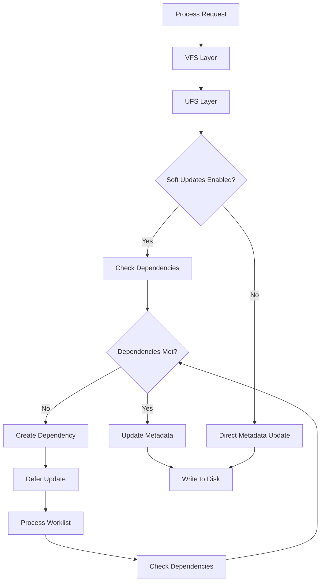

# UFS — FreeBSD's Native Filesystem
<!-- This file is auto-generated by generate-doc.py -- do not edit manually -->

---
**Navigation:**
  **Up:** [Kernel Core — Structure and Entry Point](../README.md) ▸ [Source Tree — Layout and Conventions](../../README_internals.md)
  **Related:** [Buffer Cache — Block I/O Subsystem](../vm/README_bcache.md) | [GEOM — Storage Framework](../geom/README.md) | [VFS — Virtual File System Layer](../fs/README.md)
  **All chapters:** [Source Tree — Layout and Conventions](../../README_internals.md) | [Boot Process — UEFI Bootloader to Kernel Handoff](../../stand/efi/loader/README.md) | [Kernel Core — Structure and Entry Point](../README.md) | [Build System — buildworld and buildkernel](../../share/mk/README.md) | [Virtual Memory Subsystem — vm_page, UMA, and Pagers](../vm/README.md) | [Process Management — Scheduling and Lifecycle](../kern/README_process.md) | [Locking Primitives — Mutexes, sx, rmlocks, and Atomics](../kern/README_locking.md) | [Buffer Cache — Block I/O Subsystem](../vm/README_bcache.md) ...
---


## Quick Summary
The FreeBSD Unix File System (UFS), enhanced with the Fast File System (FFS) layout, is a mature filesystem designed for reliability and efficiency on traditional disk storage. FFS improves upon the original UFS by organizing the disk into cylinder groups, which cluster related inodes and data blocks together. This layout significantly reduces disk seek times, especially for directory traversals and file creation, by keeping metadata and data physically close on the platter.

A key innovation in FreeBSD's UFS implementation is "soft updates," a technique that ensures filesystem consistency after an unexpected shutdown without the overhead of a traditional journal. Instead of writing transaction logs, soft updates tracks dependencies between metadata updates in memory. The kernel defers certain writes until their dependencies are satisfied, allowing for asynchronous metadata updates while guaranteeing that the on-disk state remains valid. This approach provides a good balance between performance and crash consistency, relying on the buffer cache flush order rather than requiring special hardware like a battery-backed write cache.

FreeBSD supports both UFS1 (32-bit block addresses) and UFS2 (48-bit block addresses, supporting filesystems up to 2^48 bytes). The FFS layout algorithm places new files near their parent directory's inode, reducing the physical distance between related metadata and data. The superblock is replicated in Cylinder Group 0 for redundancy; other cylinder groups contain a Cylinder Group header (`struct cg`) rather than a full superblock copy. The filesystem uses bitmap-based allocation to efficiently track free inodes and data blocks.

## Architecture
The UFS implementation is distributed across several directories in the FreeBSD source tree. The core on-disk format is defined in `sys/ufs/ffs/fs.h`, which describes the superblock and cylinder group structures. The allocation logic for inodes and data blocks resides in `sys/ufs/ffs/ffs_alloc.c`. The soft updates mechanism, which handles metadata dependencies, is implemented in `sys/ufs/ffs/ffs_softdep.c` and `sys/ufs/ffs/softdep.h`. The VFS interface for UFS is provided by files in `sys/ufs/ufs/`, such as `ufsmount.h` and `inode.c`.

The filesystem is organized into cylinder groups, each containing a copy of the superblock, inode tables, and data blocks. This layout minimizes the distance the disk head must travel when accessing files within the same directory. The superblock (`struct fs`) contains global information about the filesystem, including the number of cylinder groups and the layout of blocks.

The superblock search order for locating the active superblock is implemented by `ffs_sbget()` in `sys/ufs/ffs/ffs_subr.c`, which searches for UFS2 at 64K, UFS1 at 8K, floppy at 0, and piggy at 256K. The `SBLOCKSIZE` constant is 8192 bytes.

The mount structure `struct ufsmount` in `sys/ufs/ufs/ufsmount.h` tracks per-mount state including the GEOM consumer (`um_cp`), buffer cache object (`um_bo`), the superblock pointer (`um_fs`), and the soft dependencies management structure (`um_softdep`). It also includes per-CPU locks and quota file references.

## Key Data Structures

### Superblock: `struct fs`
The superblock structure is defined in `sys/ufs/ffs/fs.h`. It describes the overall filesystem layout, including cylinder group boundaries:

```c
/* From sys/ufs/ffs/fs.h */
struct fs {
    daddr_t fs_sblkno;      /* Offset of super-block */
    daddr_t fs_cblkno;      /* Offset of cylinder group blocks */
    daddr_t fs_iblkno;      /* Offset of inode blocks */
    daddr_t fs_dblkno;      /* Offset of data blocks */
    int     fs_fpg;         /* Fragments per group */
    int     fs_ipg;         /* Inodes per group */
    ufs2_daddr_t fs_sparecon[36];
    /* ... more fields ... */
};
```

### Cylinder Group: `struct cg`
Each cylinder group has a header stored at the beginning of the group. The `struct cg` in `sys/ufs/ffs/fs.h` contains the free block and inode bitmaps, as well as summary information:

```c
/* From sys/ufs/ffs/fs.h */
struct cg {
    int         cg_magic;       /* Magic number */
    int         cg_version;     /* Version */
    daddr_t     cg_size;        /* Number of blocks in group */
    daddr_t     cg_ndblk;       /* Number of data blocks */
    daddr_t     cg_niblk;       /* Number of inode blocks */
    daddr_t     cg_nrblk;       /* Number of reserved blocks */
    daddr_t     cg_rpos;        /* Rotation position */
    u_int32_t   cg_fsimask;     /* Fragment size mask */
    u_int32_t   cg_fsiblk;      /* First inode block */
    u_int32_t   cg_chsize;      /* Chunk size */
    u_int32_t   cg_ntrak;       /* Number of tracks per cylinder */
    char        cg_rotv[CGROTATE];  /* Rotation vector */
    daddr_t     cg_rotoff[CGSIZE];  /* Rotation offset */
    daddr_t     cg_irotv[CGSIZE];   /* Inode rotation vector */
    daddr_t     cg_frotv[CGSIZE];   /* Fragment rotation vector */
    char        cg_bmspar[3];   /* Bitmap spare */
    daddr_t     cg_csaddr;      /* Cylinder summary address */
    u_int32_t   cg_flags;       /* Flags */
    u_int32_t   cg_cgx;         /* Group number */
    u_int32_t   cg_pad[3];      /* Padding */
    struct csum cg_csum;        /* Cylinder summary */
    u_int32_t   cg_fragslots[1]; /* Fragment slots */
    u_int32_t   cg_inoslots[1];  /* Inode slots */
};
```

### Inode: `struct ufs2_dinode`
The on-disk inode structure is defined in `sys/ufs/ufs/dinode.h`. It contains file metadata such as size, block pointers, and timestamps:

```c
/* From sys/ufs/ufs/dinode.h */
struct ufs2_dinode {
    u_int16_t di_mode;        /* 01: File mode */
    u_int16_t di_nlink;       /* 03: Number of links */
    u_int32_t di_uid;         /* 05: File owner */
    u_int32_t di_gid;         /* 09: File group */
    u_int32_t di_spare[9];    /* 13: Unused spare */
    u_int64_t di_size;        /* 49: File size in bytes */
    u_int32_t di_blocks;      /* 57: Blocks occupied by file */
    u_int32_t di_gen;         /* 61: Generation number */
    u_int32_t di_atime;       /* 65: Access time */
    u_int32_t di_atimensec;   /* 69: Access time nanoseconds */
    u_int32_t di_ctime;       /* 73: Creation time */
    u_int32_t di_ctimensec;   /* 77: Creation time nanoseconds */
    u_int64_t di_birthtime;   /* 81: Birth time */
    u_int64_t di_extsize;     /* 89: External attributes */
    u_int64_t di_db[12];      /* 97: Direct blocks */
    u_int64_t di_ib[10];      /* 193: Indirect blocks */
    u_int32_t di_spare2[16];  /* 273: Unused spare */
};
```

### Mount Structure: `struct ufsmount`
The per-mount structure in `sys/ufs/ufs/ufsmount.h` tracks state specific to a mounted filesystem instance:

```c
/* From sys/ufs/ufs/ufsmount.h */
struct ufsmount {
    struct  mount *um_mountp;       /* (r) filesystem vfs struct */
    struct  cdev *um_dev;           /* (r) device mounted */
    struct  g_consumer *um_cp;      /* (r) GEOM access point */
    struct  bufobj *um_bo;          /* (r) Buffer cache object */
    struct  vnode *um_odevvp;       /* (r) devfs dev vnode */
    struct  vnode *um_devvp;        /* (r) mntfs private vnode */
    uint64_t um_fstype;             /* (c) type of filesystem */
    struct  fs *um_fs;              /* (r) pointer to superblock */
    struct  ufs_extattr_per_mount um_extattr; /* (c) extended attrs */
    uint64_t um_nindir;             /* (c) indirect ptrs per blk */
    uint64_t um_bptrtodb;           /* (c) indir disk block ptr */
    uint64_t um_seqinc;             /* (c) inc between seq blocks */
    uint64_t um_bsize;              /* (c) fs block size */
    uint64_t um_maxsymlinklen;      /* (c) max size of short symlink */
    struct  mtx um_lock;            /* (c) Protects ufsmount & fs */
    struct  mount_softdeps *um_softdep; /* (c) softdep mgmt structure */
    struct  vnode *um_quotas[MAXQUOTAS]; /* (q) pointer to quota files */
    struct  ucred *um_cred[MAXQUOTAS]; /* (q) quota file access cred */
    time_t  um_btime[MAXQUOTAS];    /* (q) block quota time limit */
    time_t  um_itime[MAXQUOTAS];    /* (q) inode quota time limit */
    /* ... */
};
```

## Deep Dive

### Allocation Logic
The allocation of inodes and data blocks is handled by functions in `sys/ufs/ffs/ffs_alloc.c`. The primary entry point for block allocation is `ffs_alloc()`, which uses a hash-based allocation strategy to distribute blocks evenly across the filesystem.

The `ffs_hashalloc()` function takes a hash key and a callback function, and iterates over possible allocation strategies (e.g., sequential, random) to find a free block. This helps avoid fragmentation by ensuring that related blocks are not always allocated contiguously.

For inode allocation, `ffs_valloc()` calls `ffs_hashalloc()` with a callback to `ffs_nodealloccg()`, which searches the cylinder group for a free inode. The `ffs_dirpref()` function ensures that new files are allocated near their parent directory, reducing seek times for directory traversals.

### Soft Updates
Soft updates, implemented in `sys/ufs/ffs/ffs_softdep.c`, track dependencies between metadata updates. The key structures are defined in `sys/ufs/ffs/softdep.h`:

- `pagedep`: Tracks dependencies for a specific data block.
- `inodedep`: Tracks dependencies for an inode.
- `bmsafemap`: Tracks the status of cylinder group map updates.

When a block is allocated, a dependency is created to ensure that the inode update (which records the new block number) is not written to disk before the block itself is initialized. This prevents the filesystem from referencing uninitialized blocks after a crash.

The dependency is eliminated when it is `ALLCOMPLETE`: `ATTACHED`, `DEPCOMPLETE`, and `COMPLETE`. The `ATTACHED` flag means the data is not currently being written to disk. The `UNDONE` flag indicates a rollback to a safe state. The `COMPLETE` flag indicates the item has been written.

## Flow / Diagram



## Advanced Notes

### Performance Implications
Soft updates can significantly improve performance by allowing asynchronous metadata updates. They are designed to work without special hardware; instead, they rely on the buffer cache flush order to maintain consistency, not a battery-backed write cache.

### Common Pitfalls
One common pitfall is the "soft updates journaling" feature, which is a hybrid approach that uses a journal to ensure consistency. It is important to understand the trade-offs between soft updates and traditional journaling. Another pitfall is the potential for data loss if the filesystem is not unmounted properly before a power failure.

## Comparison

### Linux ext4
Linux's ext4 filesystem uses a traditional journaling approach, which writes transaction logs to disk before committing changes. This ensures consistency but can be slower than soft updates. ext4 also supports delayed allocation, which can improve performance by deferring block allocation until writeout time.

### macOS XNU
macOS XNU does not use a variant of UFS. HFS+ (Hierarchical File System Plus) is a completely separate filesystem developed by Apple, not a variant of UFS/FFS. They share no common ancestry. HFS+ uses a B-tree structure for directory indexing, which can improve lookup performance for large directories.

### NetBSD/OpenBSD
NetBSD and OpenBSD also use UFS/FFS, with similar implementations to FreeBSD. NetBSD retains a soft updates implementation (though with some architectural differences in the `softdep` subsystem), while OpenBSD removed soft updates support for UFS in OpenBSD 5.2, relying instead on `fsck_ffs` and optional GEOM journaling for consistency.

## See Also
- [VFS — Virtual File System Layer](../fs/README.md)
- [Buffer Cache — Block I/O Subsystem](../vm/README_bcache.md)
- [GEOM — Storage Framework](../geom/README.md)


- [`sys/ufs/ffs/fs.h`](ffs/fs.h) - Superblock and cylinder group structures
- [`sys/ufs/ffs/ffs_alloc.c`](ffs/ffs_alloc.c) - Allocation logic
- [`sys/ufs/ffs/ffs_softdep.c`](ffs/ffs_softdep.c) - Soft updates implementation
- [`sys/ufs/ufs/ufsmount.h`](ufs/ufsmount.h) - Mount structure
- [`sys/ufs/ufs/dinode.h`](ufs/dinode.h) - Inode structure
- [`sys/ufs/ffs/ffs_subr.c`](ffs/ffs_subr.c) - Superblock search and verification

---

> _Generated by [DaemonDocs](https://github.com/ocochard/DaemonDocs) on 2026-05-03 04:15 UTC using model `Qwen3.6-35B-A3B-UD-Q8_K_XL` (llama.cpp build `b8985-27aef3dd9`). AI-generated content — verify against source before relying on it._
